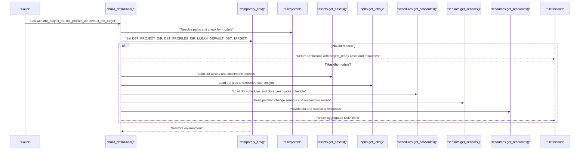
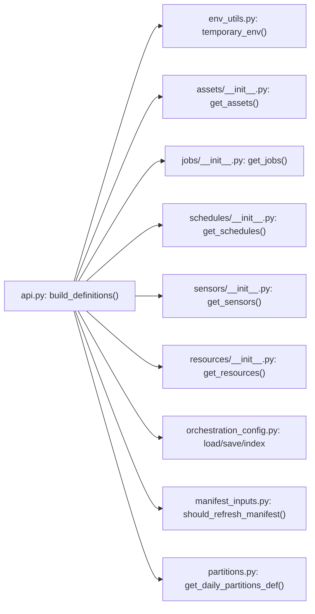
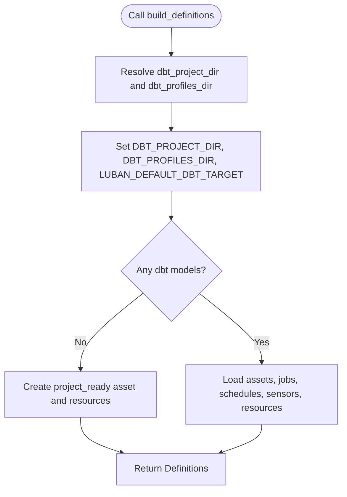

# API Reference

<cite>
**Referenced Files in This Document**
- [api.py](file://src/dbt_dagsterizer/api.py)
- [env_utils.py](file://src/dbt_dagsterizer/env_utils.py)
- [orchestration_config.py](file://src/dbt_dagsterizer/orchestration_config.py)
- [manifest_inputs.py](file://src/dbt_dagsterizer/manifest_inputs.py)
- [partitions.py](file://src/dbt_dagsterizer/partitions.py)
- [assets/__init__.py](file://src/dbt_dagsterizer/assets/__init__.py)
- [jobs/__init__.py](file://src/dbt_dagsterizer/jobs/__init__.py)
- [schedules/__init__.py](file://src/dbt_dagsterizer/schedules/__init__.py)
- [sensors/__init__.py](file://src/dbt_dagsterizer/sensors/__init__.py)
- [resources/__init__.py](file://src/dbt_dagsterizer/resources/__init__.py)
- [test_api.py](file://tests/test_api.py)
- [dagsterization.yml](file://src/dbt_dagsterizer/project_templates/luban-dagster-dbt-starrocks-code-location-source-template/{{cookiecutter.output_name}}/dbt_project/dagsterization.yml)
</cite>

## Table of Contents
1. [Introduction](#introduction)
2. [Project Structure](#project-structure)
3. [Core Components](#core-components)
4. [Architecture Overview](#architecture-overview)
5. [Detailed Component Analysis](#detailed-component-analysis)
6. [Dependency Analysis](#dependency-analysis)
7. [Performance Considerations](#performance-considerations)
8. [Troubleshooting Guide](#troubleshooting-guide)
9. [Conclusion](#conclusion)
10. [Appendices](#appendices)

## Introduction
This document provides a comprehensive API reference for dbt-dagsterizer’s Python interface, focusing on the primary entry point for building Dagster Definitions from a dbt project. It documents the build_definitions() function, its parameters, return values, environment variable handling, configuration options, and advanced usage patterns for assets, jobs, schedules, sensors, and resources. Practical examples demonstrate programmatic integration with Dagster code locations and guidance for production usage and performance.

## Project Structure
The API surface centers around a single function that orchestrates asset, job, schedule, sensor, and resource discovery from a dbt project. Supporting modules handle environment variable management, orchestration configuration persistence, manifest inputs caching, and partition definitions.

```mermaid
graph TB
API["api.py<br/>build_definitions()"] --> ENV["env_utils.py<br/>temporary_env(), dotenv helpers"]
API --> ASSETS["assets/__init__.py<br/>get_assets()"]
API --> JOBS["jobs/__init__.py<br/>get_jobs()"]
API --> SCHEDULES["schedules/__init__.py<br/>get_schedules()"]
API --> SENSORS["sensors/__init__.py<br/>get_sensors()"]
API --> RES["resources/__init__.py<br/>get_resources()"]
ASSETS --> DBT_ASSETS["assets/dbt/assets.py<br/>get_dbt_assets()"]
ASSETS --> SRC_FACTORY["assets/sources/factory.py<br/>build_observable_source_assets()"]
ASSETS --> SRC_AUTO["assets/sources/automation.py<br/>load_automation_observable_sources()"]
JOBS --> DBT_JOBS["jobs/dbt/jobs.py<br/>get_dbt_jobs()"]
JOBS --> OBS_JOBS["jobs/sources/jobs.py<br/>get_observe_sources_job()"]
SCHEDULES --> DBT_SCH["schedules/dbt/schedules.py<br/>get_dbt_schedules()"]
SCHEDULES --> OBS_SCH["schedules/sources/schedules.py<br/>get_observe_sources_schedule()"]
SENSORS --> DBT_CFG["sensors/dbt_config.py<br/>PARTITION_CHANGE_*"]
SENSORS --> DET_FACTORY["sensors/partition_change/detector/factory.py<br/>build_dbt_partition_change_sensors()"]
SENSORS --> PROP_FACTORY["sensors/partition_change/propagator/factory.py<br/>build_partition_propagation_sensors()"]
RES --> DBT_RES["resources/dbt.py<br/>make_dbt_resource()"]
RES --> SR_RES["resources/starrocks.py<br/>make_starrocks_resource()"]
API --> ORCH["orchestration_config.py<br/>dagsterization.yml loader & writer"]
API --> MAN["manifest_inputs.py<br/>.luban_manifest_inputs.json"]
API --> PART["partitions.py<br/>DailyPartitionsDefinition"]
```

**Diagram sources**
- [api.py:15-72](file://src/dbt_dagsterizer/api.py#L15-L72)
- [env_utils.py:61-77](file://src/dbt_dagsterizer/env_utils.py#L61-L77)
- [assets/__init__.py:1-13](file://src/dbt_dagsterizer/assets/__init__.py#L1-L13)
- [jobs/__init__.py:1-10](file://src/dbt_dagsterizer/jobs/__init__.py#L1-L10)
- [schedules/__init__.py:1-10](file://src/dbt_dagsterizer/schedules/__init__.py#L1-L10)
- [sensors/__init__.py:40-75](file://src/dbt_dagsterizer/sensors/__init__.py#L40-L75)
- [resources/__init__.py:5-10](file://src/dbt_dagsterizer/resources/__init__.py#L5-L10)
- [orchestration_config.py:19-83](file://src/dbt_dagsterizer/orchestration_config.py#L19-L83)
- [manifest_inputs.py:24-91](file://src/dbt_dagsterizer/manifest_inputs.py#L24-L91)
- [partitions.py:10-21](file://src/dbt_dagsterizer/partitions.py#L10-L21)

**Section sources**
- [api.py:15-72](file://src/dbt_dagsterizer/api.py#L15-L72)
- [env_utils.py:61-77](file://src/dbt_dagsterizer/env_utils.py#L61-L77)
- [assets/__init__.py:1-13](file://src/dbt_dagsterizer/assets/__init__.py#L1-L13)
- [jobs/__init__.py:1-10](file://src/dbt_dagsterizer/jobs/__init__.py#L1-L10)
- [schedules/__init__.py:1-10](file://src/dbt_dagsterizer/schedules/__init__.py#L1-L10)
- [sensors/__init__.py:40-75](file://src/dbt_dagsterizer/sensors/__init__.py#L40-L75)
- [resources/__init__.py:5-10](file://src/dbt_dagsterizer/resources/__init__.py#L5-L10)
- [orchestration_config.py:19-83](file://src/dbt_dagsterizer/orchestration_config.py#L19-L83)
- [manifest_inputs.py:24-91](file://src/dbt_dagsterizer/manifest_inputs.py#L24-L91)
- [partitions.py:10-21](file://src/dbt_dagsterizer/partitions.py#L10-L21)

## Core Components
This section documents the main build_definitions() function and its surrounding ecosystem.

- Function: build_definitions
  - Purpose: Construct a Dagster Definitions object from a dbt project by dynamically loading assets, jobs, schedules, sensors, and resources.
  - Parameters:
    - dbt_project_dir: Optional[str | Path]. Absolute or relative path to the dbt project root. Defaults to "./dbt_project" if not provided. Relative paths are resolved against the current working directory.
    - dbt_profiles_dir: Optional[str | Path]. Absolute or relative path to the dbt profiles directory. If omitted, the environment’s DBT_PROFILES_DIR is used.
    - default_dbt_target: Optional[str]. Default dbt target name to set via LUBAN_DEFAULT_DBT_TARGET during definition construction.
  - Returns: dagster.Definitions containing assets, jobs, schedules, sensors, and resources.
  - Behavior:
    - Resolves dbt_project_dir and dbt_profiles_dir to absolute paths.
    - Temporarily sets environment variables (DBT_PROJECT_DIR, DBT_PROFILES_DIR, LUBAN_DEFAULT_DBT_TARGET) while constructing definitions.
    - If no dbt SQL models are found under the dbt project’s models directory, a minimal “project_ready” asset is returned along with configured resources.
    - Otherwise, aggregates assets, jobs, schedules, sensors, and resources from their respective modules.
  - Type hints and defaults:
    - All parameters accept str or Path and default to None when not provided.
  - Environment variable handling:
    - Uses env_utils.temporary_env() to temporarily override DBT_PROJECT_DIR, DBT_PROFILES_DIR, and LUBAN_DEFAULT_DBT_TARGET.
    - Loads .env files adjacent to the dbt project directory via dotenv helpers.
  - Configuration options:
    - Orchestrates via dagsterization.yml (see Orchestration Configuration).
    - Daily partitions require DAGSTER_DAILY_PARTITIONS_START_DATE.
  - Error conditions:
    - Missing DAGSTER_DAILY_PARTITIONS_START_DATE when daily partitions are used.
    - Invalid orchestration configuration entries raise explicit errors during parsing and mutation operations.

Practical usage pattern:
- Call build_definitions() with dbt_project_dir pointing to a valid dbt project with dbt_project.yml, profiles.yml, and models/*.sql.
- Integrate the returned Definitions into a Dagster code location by assigning it to a module-level variable named defs.

**Section sources**
- [api.py:15-72](file://src/dbt_dagsterizer/api.py#L15-L72)
- [env_utils.py:61-77](file://src/dbt_dagsterizer/env_utils.py#L61-L77)
- [partitions.py:10-21](file://src/dbt_dagsterizer/partitions.py#L10-L21)
- [orchestration_config.py:19-83](file://src/dbt_dagsterizer/orchestration_config.py#L19-L83)

## Architecture Overview
The build_definitions() function orchestrates a modular pipeline that discovers and composes Dagster constructs from a dbt project. It manages environment variables, checks for dbt models, and delegates to specialized modules for assets, jobs, schedules, sensors, and resources.

**Diagram sources**
- [api.py:15-72](file://src/dbt_dagsterizer/api.py#L15-L72)
- [env_utils.py:61-77](file://src/dbt_dagsterizer/env_utils.py#L61-L77)
- [assets/__init__.py:1-13](file://src/dbt_dagsterizer/assets/__init__.py#L1-L13)
- [jobs/__init__.py:1-10](file://src/dbt_dagsterizer/jobs/__init__.py#L1-L10)
- [schedules/__init__.py:1-10](file://src/dbt_dagsterizer/schedules/__init__.py#L1-L10)
- [sensors/__init__.py:40-75](file://src/dbt_dagsterizer/sensors/__init__.py#L40-L75)
- [resources/__init__.py:5-10](file://src/dbt_dagsterizer/resources/__init__.py#L5-L10)

## Detailed Component Analysis

### build_definitions()
- Parameters:
  - dbt_project_dir: str | Path | None
  - dbt_profiles_dir: str | Path | None
  - default_dbt_target: str | None
- Returns: dagster.Definitions
- Behavior:
  - Path resolution and environment preparation handled via env_utils.temporary_env().
  - Skeleton mode when no dbt models are present; otherwise loads dynamic constructs from submodules.
- Usage patterns:
  - Programmatic integration: Assign the returned Definitions to a module-level variable named defs in your Dagster code location.
  - CLI vs API: The CLI internally calls build_definitions(); for programmatic control, call it directly.

**Section sources**
- [api.py:15-72](file://src/dbt_dagsterizer/api.py#L15-L72)
- [env_utils.py:61-77](file://src/dbt_dagsterizer/env_utils.py#L61-L77)

### Environment Variable Handling
- Temporary overrides:
  - DBT_PROJECT_DIR: Set to the resolved dbt project directory.
  - DBT_PROFILES_DIR: Set to the resolved profiles directory.
  - LUBAN_DEFAULT_DBT_TARGET: Set to the provided default target.
- Dotenv loading:
  - Searches for .env files in the dbt project’s parent and itself.
  - Only applies keys not already present in the current environment.
- Partition definitions:
  - Requires DAGSTER_DAILY_PARTITIONS_START_DATE for daily partitions.

**Section sources**
- [env_utils.py:61-77](file://src/dbt_dagsterizer/env_utils.py#L61-L77)
- [env_utils.py:44-48](file://src/dbt_dagsterizer/env_utils.py#L44-L48)
- [partitions.py:10-21](file://src/dbt_dagsterizer/partitions.py#L10-L21)

### Orchestration Configuration (dagsterization.yml)
- Persistence and defaults:
  - Creates a default orchestration config with version, empty jobs, asset_jobs, partitions, schedules, and partition_change sections if missing.
  - Supports saving and loading via YAML with preserved formatting.
- Indexing:
  - Builds indices for partitions_by_model, asset_job_models, and group_job_by_model to derive job names per model.
- Mutations:
  - set_partition, set_asset_job, set_group_job, delete_group_job, set_schedule, set_partition_change_detector, set_partition_change_propagation.
- Example configuration:
  - See the included template dagsterization.yml for jobs, asset_jobs, partitions, schedules, and partition_change detectors/propagators.

**Section sources**
- [orchestration_config.py:19-83](file://src/dbt_dagsterizer/orchestration_config.py#L19-L83)
- [orchestration_config.py:112-158](file://src/dbt_dagsterizer/orchestration_config.py#L112-L158)
- [orchestration_config.py:161-235](file://src/dbt_dagsterizer/orchestration_config.py#L161-L235)
- [orchestration_config.py:238-268](file://src/dbt_dagsterizer/orchestration_config.py#L238-L268)
- [orchestration_config.py:271-357](file://src/dbt_dagsterizer/orchestration_config.py#L271-L357)
- [dagsterization.yml:1-48](file://src/dbt_dagsterizer/project_templates/luban-dagster-dbt-starrocks-code-location-source-template/{{cookiecutter.output_name}}/dbt_project/dagsterization.yml#L1-L48)

### Manifest Inputs and Caching
- Purpose: Track dbt target and .env file metadata to decide whether to refresh the dbt manifest.
- Fields: version, generated_at, dbt_target, dotenv_paths, dotenv_mtime_max.
- Decision logic: Refresh if manifest does not exist, schema version differs, target changed, or any tracked .env file has been modified after generation.

**Section sources**
- [manifest_inputs.py:11-91](file://src/dbt_dagsterizer/manifest_inputs.py#L11-L91)

### Assets, Jobs, Schedules, Sensors, Resources
- Assets:
  - Aggregates dbt assets and observable source assets built from automation and factory modules.
- Jobs:
  - Aggregates dbt jobs and an optional observe-sources job.
- Schedules:
  - Aggregates dbt schedules and an optional observe-sources schedule.
- Sensors:
  - Includes a default automation condition sensor and partition-change sensors (auto-configured plus manual specs).
  - Propagation mode controlled by LUBAN_PARTITION_CHANGE_PROPAGATOR_MODE (defaults to sensor; eager disables manual propagation sensors).
- Resources:
  - Provides dbt and starrocks resources.

**Section sources**
- [assets/__init__.py:1-13](file://src/dbt_dagsterizer/assets/__init__.py#L1-L13)
- [jobs/__init__.py:1-10](file://src/dbt_dagsterizer/jobs/__init__.py#L1-L10)
- [schedules/__init__.py:1-10](file://src/dbt_dagsterizer/schedules/__init__.py#L1-L10)
- [sensors/__init__.py:40-75](file://src/dbt_dagsterizer/sensors/__init__.py#L40-L75)
- [resources/__init__.py:5-10](file://src/dbt_dagsterizer/resources/__init__.py#L5-L10)

### Advanced Usage Patterns

#### Custom Asset Generation
- Extend assets via the assets module’s factories and automation loaders.
- Combine dbt assets with observable sources to react to external data changes.

**Section sources**
- [assets/__init__.py:1-13](file://src/dbt_dagsterizer/assets/__init__.py#L1-L13)

#### Job Orchestration
- Define jobs in dagsterization.yml with models, include_upstream, and partitions.
- Use set_group_job and delete_group_job to manage job configurations programmatically.

**Section sources**
- [orchestration_config.py:196-235](file://src/dbt_dagsterizer/orchestration_config.py#L196-L235)
- [dagsterization.yml:3-9](file://src/dbt_dagsterizer/project_templates/luban-dagster-dbt-starrocks-code-location-source-template/{{cookiecutter.output_name}}/dbt_project/dagsterization.yml#L3-L9)

#### Sensor Configuration
- Configure partition-change detectors and propagators in dagsterization.yml or programmatically via set_partition_change_detector and set_partition_change_propagation.
- Control propagation behavior with LUBAN_PARTITION_CHANGE_PROPAGATOR_MODE.

**Section sources**
- [sensors/__init__.py:40-75](file://src/dbt_dagsterizer/sensors/__init__.py#L40-L75)
- [orchestration_config.py:271-357](file://src/dbt_dagsterizer/orchestration_config.py#L271-L357)
- [dagsterization.yml:29-48](file://src/dbt_dagsterizer/project_templates/luban-dagster-dbt-starrocks-code-location-source-template/{{cookiecutter.output_name}}/dbt_project/dagsterization.yml#L29-L48)

#### Integration with Execution Environments
- Local development: Use temporary_env to set DBT_PROJECT_DIR and DBT_PROFILES_DIR for isolated runs.
- CI/CD: Persist dagsterization.yml and .env files alongside the dbt project; ensure DAGSTER_DAILY_PARTITIONS_START_DATE is set in the environment.
- Kubernetes/Docker: Mount dbt project directories and pass environment variables accordingly.

**Section sources**
- [env_utils.py:61-77](file://src/dbt_dagsterizer/env_utils.py#L61-L77)
- [partitions.py:10-21](file://src/dbt_dagsterizer/partitions.py#L10-L21)

### Programmatic Integration Examples
- Minimal skeleton mode:
  - Create a dbt project directory with dbt_project.yml, profiles.yml, and an empty models directory.
  - Call build_definitions(dbt_project_dir=...) to receive a Definitions object with a single project_ready asset.
- Full integration:
  - Populate models/*.sql and dagsterization.yml.
  - Call build_definitions(...) and assign the result to a module-level defs variable for use in a Dagster code location.

**Section sources**
- [test_api.py:6-21](file://tests/test_api.py#L6-L21)

## Dependency Analysis
The build_definitions() function depends on environment preparation, orchestration configuration, and modular submodules for assets, jobs, schedules, sensors, and resources. The diagram below highlights these relationships.

**Diagram sources**
- [api.py:15-72](file://src/dbt_dagsterizer/api.py#L15-L72)
- [env_utils.py:61-77](file://src/dbt_dagsterizer/env_utils.py#L61-L77)
- [assets/__init__.py:1-13](file://src/dbt_dagsterizer/assets/__init__.py#L1-L13)
- [jobs/__init__.py:1-10](file://src/dbt_dagsterizer/jobs/__init__.py#L1-L10)
- [schedules/__init__.py:1-10](file://src/dbt_dagsterizer/schedules/__init__.py#L1-L10)
- [sensors/__init__.py:40-75](file://src/dbt_dagsterizer/sensors/__init__.py#L40-L75)
- [resources/__init__.py:5-10](file://src/dbt_dagsterizer/resources/__init__.py#L5-L10)
- [orchestration_config.py:19-83](file://src/dbt_dagsterizer/orchestration_config.py#L19-L83)
- [manifest_inputs.py:67-91](file://src/dbt_dagsterizer/manifest_inputs.py#L67-L91)
- [partitions.py:10-21](file://src/dbt_dagsterizer/partitions.py#L10-L21)

**Section sources**
- [api.py:15-72](file://src/dbt_dagsterizer/api.py#L15-L72)
- [env_utils.py:61-77](file://src/dbt_dagsterizer/env_utils.py#L61-L77)
- [assets/__init__.py:1-13](file://src/dbt_dagsterizer/assets/__init__.py#L1-L13)
- [jobs/__init__.py:1-10](file://src/dbt_dagsterizer/jobs/__init__.py#L1-L10)
- [schedules/__init__.py:1-10](file://src/dbt_dagsterizer/schedules/__init__.py#L1-L10)
- [sensors/__init__.py:40-75](file://src/dbt_dagsterizer/sensors/__init__.py#L40-L75)
- [resources/__init__.py:5-10](file://src/dbt_dagsterizer/resources/__init__.py#L5-L10)
- [orchestration_config.py:19-83](file://src/dbt_dagsterizer/orchestration_config.py#L19-L83)
- [manifest_inputs.py:67-91](file://src/dbt_dagsterizer/manifest_inputs.py#L67-L91)
- [partitions.py:10-21](file://src/dbt_dagsterizer/partitions.py#L10-L21)

## Performance Considerations
- Manifest caching: Use manifest_inputs.should_refresh_manifest() to avoid unnecessary dbt manifest regeneration when .env files or targets have not changed.
- Environment isolation: temporary_env minimizes side effects and avoids repeated environment churn across invocations.
- Sensor propagation mode: Prefer LUBAN_PARTITION_CHANGE_PROPAGATOR_MODE=eager in high-throughput environments to reduce sensor overhead, understanding the trade-offs described in the sensors module.

[No sources needed since this section provides general guidance]

## Troubleshooting Guide
- Missing daily partitions start date:
  - Symptom: ValueError indicating DAGSTER_DAILY_PARTITIONS_START_DATE must be set.
  - Resolution: Set the environment variable to a valid YYYY-MM-DD date.
- No dbt models found:
  - Behavior: Returns a minimal Definitions with a project_ready asset and resources.
  - Action: Add models/*.sql and ensure dbt_project.yml and profiles.yml are present.
- Invalid orchestration configuration:
  - Symptoms: ValueErrors raised during load_or_create or mutation operations.
  - Resolution: Validate dagsterization.yml structure and values; refer to set_* functions’ constraints.
- .env overrides not applied:
  - Cause: Keys already present in the environment take precedence.
  - Resolution: Unset conflicting environment variables or adjust .env file keys.

**Section sources**
- [partitions.py:10-21](file://src/dbt_dagsterizer/partitions.py#L10-L21)
- [api.py:44-57](file://src/dbt_dagsterizer/api.py#L44-L57)
- [orchestration_config.py:46-68](file://src/dbt_dagsterizer/orchestration_config.py#L46-L68)
- [orchestration_config.py:161-175](file://src/dbt_dagsterizer/orchestration_config.py#L161-L175)
- [env_utils.py:61-77](file://src/dbt_dagsterizer/env_utils.py#L61-L77)

## Conclusion
The build_definitions() function provides a robust, modular entry point to integrate dbt projects into Dagster. By leveraging environment management, orchestration configuration, and dynamic asset/job/schedule/sensor/resource discovery, it supports flexible deployment across local and production environments. Following the best practices and patterns outlined here ensures reliable, maintainable, and performant integrations.

[No sources needed since this section summarizes without analyzing specific files]

## Appendices

### API Definition Flow

**Diagram sources**
- [api.py:15-72](file://src/dbt_dagsterizer/api.py#L15-L72)
- [env_utils.py:61-77](file://src/dbt_dagsterizer/env_utils.py#L61-L77)