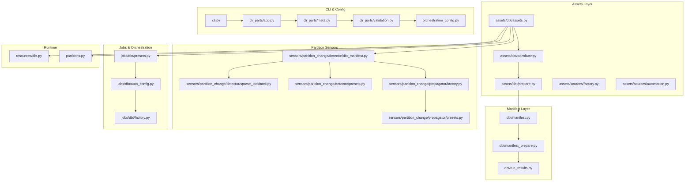
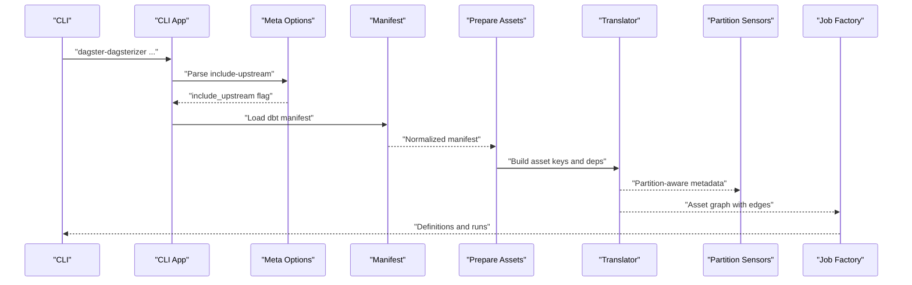
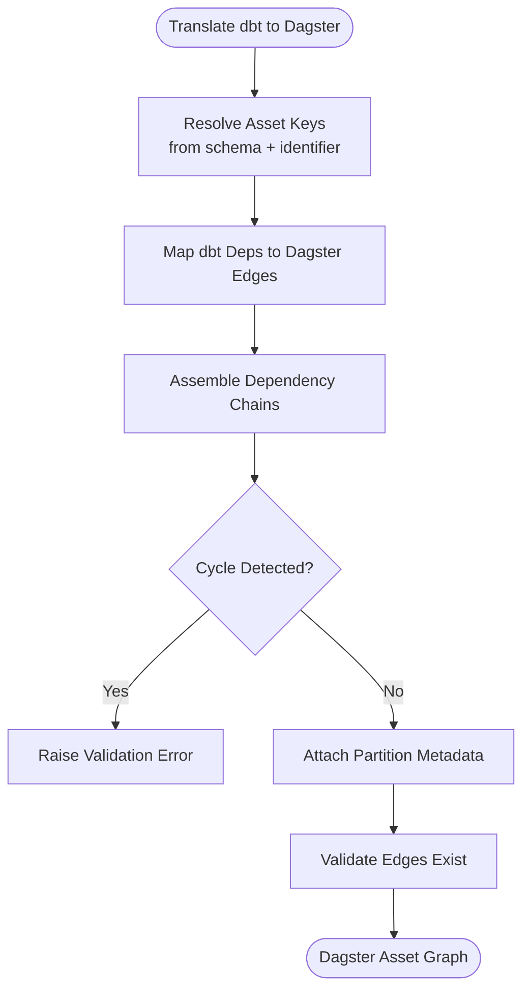
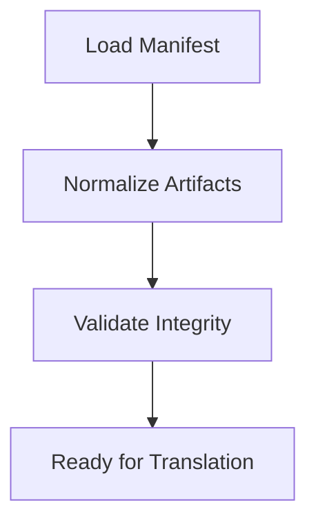
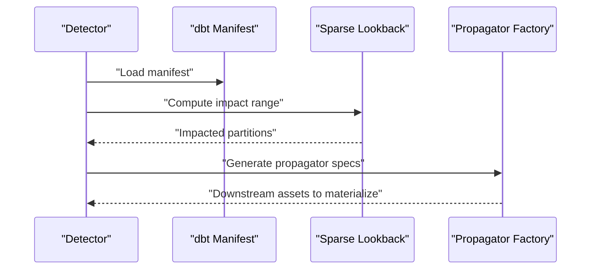
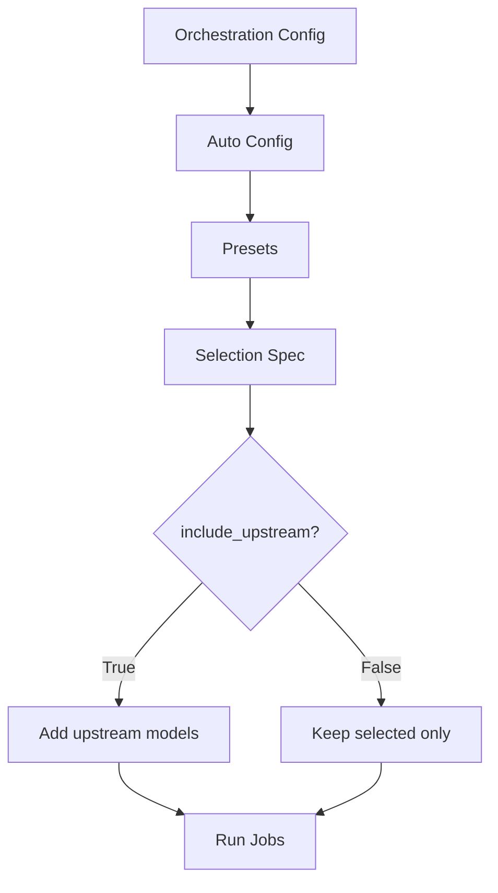
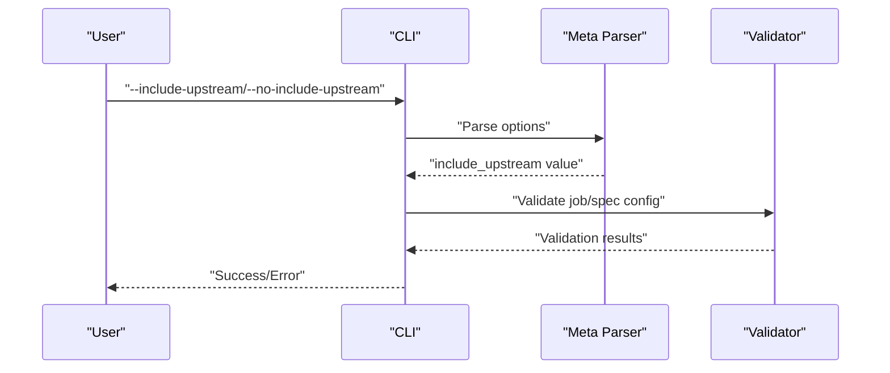
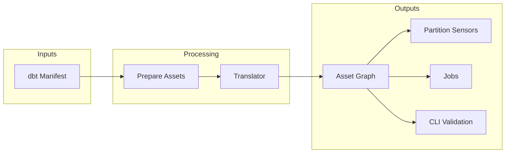

# Asset Dependencies

<cite>
**Referenced Files in This Document**
- [assets.py](file://src/dbt_dagsterizer/assets/dbt/assets.py)
- [translator.py](file://src/dbt_dagsterizer/assets/dbt/translator.py)
- [prepare.py](file://src/dbt_dagsterizer/assets/dbt/prepare.py)
- [manifest.py](file://src/dbt_dagsterizer/dbt/manifest.py)
- [manifest_prepare.py](file://src/dbt_dagsterizer/dbt/manifest_prepare.py)
- [run_results.py](file://src/dbt_dagsterizer/dbt/run_results.py)
- [factory.py](file://src/dbt_dagsterizer/assets/sources/factory.py)
- [automation.py](file://src/dbt_dagsterizer/assets/sources/automation.py)
- [partitions.py](file://src/dbt_dagsterizer/partitions.py)
- [presets.py](file://src/dbt_dagsterizer/jobs/dbt/presets.py)
- [auto_config.py](file://src/dbt_dagsterizer/jobs/dbt/auto_config.py)
- [factory.py](file://src/dbt_dagsterizer/jobs/dbt/factory.py)
- [dbt_manifest.py](file://src/dbt_dagsterizer/sensors/partition_change/detector/dbt_manifest.py)
- [sparse_lookback.py](file://src/dbt_dagsterizer/sensors/partition_change/detector/sparse_lookback.py)
- [presets.py](file://src/dbt_dagsterizer/sensors/partition_change/detector/presets.py)
- [factory.py](file://src/dbt_dagsterizer/sensors/partition_change/propagator/factory.py)
- [presets.py](file://src/dbt_dagsterizer/sensors/partition_change/propagator/presets.py)
- [dbt.py](file://src/dbt_dagsterizer/resources/dbt.py)
- [cli.py](file://src/dbt_dagsterizer/cli.py)
- [app.py](file://src/dbt_dagsterizer/cli_parts/app.py)
- [meta.py](file://src/dbt_dagsterizer/cli_parts/meta.py)
- [validation.py](file://src/dbt_dagsterizer/cli_parts/validation.py)
- [orchestration_config.py](file://src/dbt_dagsterizer/orchestration_config.py)
</cite>

## Table of Contents
1. [Introduction](#introduction)
2. [Project Structure](#project-structure)
3. [Core Components](#core-components)
4. [Architecture Overview](#architecture-overview)
5. [Detailed Component Analysis](#detailed-component-analysis)
6. [Dependency Analysis](#dependency-analysis)
7. [Performance Considerations](#performance-considerations)
8. [Troubleshooting Guide](#troubleshooting-guide)
9. [Conclusion](#conclusion)
10. [Appendices](#appendices)

## Introduction
This document explains how dbt model dependencies are translated into Dagster asset dependency graphs within dbt-dagsterizer. It covers upstream/downstream relationship resolution, dependency chain creation, circular dependency detection, and validation. It also documents asset key resolution, schema handling, partition-aware dependency tracking, dependency inheritance patterns, asset grouping strategies, optimization techniques, and practical guidance for debugging and performance at scale.

## Project Structure
The asset dependency pipeline spans several modules:
- Assets generation and translation from dbt manifests
- Manifest preparation and validation
- Partition change sensors and propagators
- Job orchestration and selection presets
- CLI and configuration for include-upstream behavior
- Resources and runtime helpers

**Diagram sources**
- [assets.py](file://src/dbt_dagsterizer/assets/dbt/assets.py)
- [translator.py](file://src/dbt_dagsterizer/assets/dbt/translator.py)
- [prepare.py](file://src/dbt_dagsterizer/assets/dbt/prepare.py)
- [manifest.py](file://src/dbt_dagsterizer/dbt/manifest.py)
- [manifest_prepare.py](file://src/dbt_dagsterizer/dbt/manifest_prepare.py)
- [run_results.py](file://src/dbt_dagsterizer/dbt/run_results.py)
- [dbt_manifest.py](file://src/dbt_dagsterizer/sensors/partition_change/detector/dbt_manifest.py)
- [sparse_lookback.py](file://src/dbt_dagsterizer/sensors/partition_change/detector/sparse_lookback.py)
- [presets.py](file://src/dbt_dagsterizer/sensors/partition_change/detector/presets.py)
- [factory.py](file://src/dbt_dagsterizer/sensors/partition_change/propagator/factory.py)
- [presets.py](file://src/dbt_dagsterizer/sensors/partition_change/propagator/presets.py)
- [presets.py](file://src/dbt_dagsterizer/jobs/dbt/presets.py)
- [auto_config.py](file://src/dbt_dagsterizer/jobs/dbt/auto_config.py)
- [factory.py](file://src/dbt_dagsterizer/jobs/dbt/factory.py)
- [cli.py](file://src/dbt_dagsterizer/cli.py)
- [app.py](file://src/dbt_dagsterizer/cli_parts/app.py)
- [meta.py](file://src/dbt_dagsterizer/cli_parts/meta.py)
- [validation.py](file://src/dbt_dagsterizer/cli_parts/validation.py)
- [orchestration_config.py](file://src/dbt_dagsterizer/orchestration_config.py)
- [dbt.py](file://src/dbt_dagsterizer/resources/dbt.py)
- [partitions.py](file://src/dbt_dagsterizer/partitions.py)

**Section sources**
- [assets.py](file://src/dbt_dagsterizer/assets/dbt/assets.py)
- [translator.py](file://src/dbt_dagsterizer/assets/dbt/translator.py)
- [prepare.py](file://src/dbt_dagsterizer/assets/dbt/prepare.py)
- [manifest.py](file://src/dbt_dagsterizer/dbt/manifest.py)
- [manifest_prepare.py](file://src/dbt_dagsterizer/dbt/manifest_prepare.py)
- [run_results.py](file://src/dbt_dagsterizer/dbt/run_results.py)
- [dbt_manifest.py](file://src/dbt_dagsterizer/sensors/partition_change/detector/dbt_manifest.py)
- [sparse_lookback.py](file://src/dbt_dagsterizer/sensors/partition_change/detector/sparse_lookback.py)
- [presets.py](file://src/dbt_dagsterizer/sensors/partition_change/detector/presets.py)
- [factory.py](file://src/dbt_dagsterizer/sensors/partition_change/propagator/factory.py)
- [presets.py](file://src/dbt_dagsterizer/sensors/partition_change/propagator/presets.py)
- [presets.py](file://src/dbt_dagsterizer/jobs/dbt/presets.py)
- [auto_config.py](file://src/dbt_dagsterizer/jobs/dbt/auto_config.py)
- [factory.py](file://src/dbt_dagsterizer/jobs/dbt/factory.py)
- [cli.py](file://src/dbt_dagsterizer/cli.py)
- [app.py](file://src/dbt_dagsterizer/cli_parts/app.py)
- [meta.py](file://src/dbt_dagsterizer/cli_parts/meta.py)
- [validation.py](file://src/dbt_dagsterizer/cli_parts/validation.py)
- [orchestration_config.py](file://src/dbt_dagsterizer/orchestration_config.py)
- [dbt.py](file://src/dbt_dagsterizer/resources/dbt.py)
- [partitions.py](file://src/dbt_dagsterizer/partitions.py)

## Core Components
- Assets generation and translation: Converts dbt relations and sources into Dagster assets with dependency edges.
- Manifest preparation and validation: Ensures dbt artifacts are ready and consistent for asset graph construction.
- Partition change sensors: Detect partition changes and propagate impacts downstream.
- Job orchestration presets: Provide include-upstream selection behavior for job runs.
- CLI and configuration: Support toggling upstream inclusion and validating user-provided specs.
- Runtime helpers: Provide resource and partition utilities for asset execution.

Key responsibilities:
- Build asset keys from dbt relation metadata (schema, identifier).
- Resolve upstream/downstream edges from dbt’s dependency graph.
- Validate and normalize dependency specs.
- Track partition-aware dependencies for incremental and time-partitioned assets.
- Optimize dependency chains and prune unnecessary edges.

**Section sources**
- [assets.py](file://src/dbt_dagsterizer/assets/dbt/assets.py)
- [translator.py](file://src/dbt_dagsterizer/assets/dbt/translator.py)
- [prepare.py](file://src/dbt_dagsterizer/assets/dbt/prepare.py)
- [manifest.py](file://src/dbt_dagsterizer/dbt/manifest.py)
- [manifest_prepare.py](file://src/dbt_dagsterizer/dbt/manifest_prepare.py)
- [run_results.py](file://src/dbt_dagsterizer/dbt/run_results.py)
- [presets.py](file://src/dbt_dagsterizer/jobs/dbt/presets.py)
- [auto_config.py](file://src/dbt_dagsterizer/jobs/dbt/auto_config.py)
- [factory.py](file://src/dbt_dagsterizer/jobs/dbt/factory.py)
- [cli.py](file://src/dbt_dagsterizer/cli.py)
- [app.py](file://src/dbt_dagsterizer/cli_parts/app.py)
- [meta.py](file://src/dbt_dagsterizer/cli_parts/meta.py)
- [validation.py](file://src/dbt_dagsterizer/cli_parts/validation.py)
- [orchestration_config.py](file://src/dbt_dagsterizer/orchestration_config.py)
- [dbt.py](file://src/dbt_dagsterizer/resources/dbt.py)
- [partitions.py](file://src/dbt_dagsterizer/partitions.py)

## Architecture Overview
The asset dependency pipeline transforms dbt models and sources into a Dagster asset graph with explicit upstream/downstream edges. The process integrates:
- Manifest ingestion and normalization
- Asset key derivation and schema handling
- Dependency chain assembly and validation
- Partition-aware propagation
- Job selection presets and include-upstream behavior
- CLI-driven validation and configuration

**Diagram sources**
- [cli.py](file://src/dbt_dagsterizer/cli.py)
- [app.py](file://src/dbt_dagsterizer/cli_parts/app.py)
- [meta.py](file://src/dbt_dagsterizer/cli_parts/meta.py)
- [manifest.py](file://src/dbt_dagsterizer/dbt/manifest.py)
- [prepare.py](file://src/dbt_dagsterizer/assets/dbt/prepare.py)
- [translator.py](file://src/dbt_dagsterizer/assets/dbt/translator.py)
- [dbt_manifest.py](file://src/dbt_dagsterizer/sensors/partition_change/detector/dbt_manifest.py)
- [factory.py](file://src/dbt_dagsterizer/jobs/dbt/factory.py)

## Detailed Component Analysis

### Asset Translation and Dependency Resolution
- Asset key resolution: Uses dbt relation schema and identifier to construct Dagster asset keys. Schema handling ensures correctness across environments and layered schemas.
- Upstream/downstream resolution: Translates dbt dependency edges into Dagster asset edges. This preserves model-to-model and source-to-model relationships.
- Dependency chain creation: Builds transitive closure of dependencies for deterministic execution ordering.
- Circular dependency detection: Validates the resulting graph for cycles; errors are surfaced during asset graph construction.
- Dependency validation: Ensures referenced upstream models exist and conform to expected types.

**Diagram sources**
- [translator.py](file://src/dbt_dagsterizer/assets/dbt/translator.py)
- [prepare.py](file://src/dbt_dagsterizer/assets/dbt/prepare.py)
- [manifest.py](file://src/dbt_dagsterizer/dbt/manifest.py)

**Section sources**
- [translator.py](file://src/dbt_dagsterizer/assets/dbt/translator.py)
- [prepare.py](file://src/dbt_dagsterizer/assets/dbt/prepare.py)
- [manifest.py](file://src/dbt_dagsterizer/dbt/manifest.py)

### Manifest Preparation and Validation
- Manifest preparation normalizes dbt artifacts for reliable asset graph construction.
- Validation ensures consistency and detects missing or malformed entries early.

**Diagram sources**
- [manifest_prepare.py](file://src/dbt_dagsterizer/dbt/manifest_prepare.py)
- [manifest.py](file://src/dbt_dagsterizer/dbt/manifest.py)

**Section sources**
- [manifest_prepare.py](file://src/dbt_dagsterizer/dbt/manifest_prepare.py)
- [manifest.py](file://src/dbt_dagsterizer/dbt/manifest.py)

### Partition-Aware Dependency Tracking
- Partition change detection identifies impacted partitions and triggers downstream recomputation.
- Sparse lookback and propagator presets define conservative or aggressive propagation strategies.
- Detector uses dbt manifest to correlate partition changes with affected assets.

**Diagram sources**
- [dbt_manifest.py](file://src/dbt_dagsterizer/sensors/partition_change/detector/dbt_manifest.py)
- [sparse_lookback.py](file://src/dbt_dagsterizer/sensors/partition_change/detector/sparse_lookback.py)
- [presets.py](file://src/dbt_dagsterizer/sensors/partition_change/detector/presets.py)
- [factory.py](file://src/dbt_dagsterizer/sensors/partition_change/propagator/factory.py)
- [presets.py](file://src/dbt_dagsterizer/sensors/partition_change/propagator/presets.py)

**Section sources**
- [dbt_manifest.py](file://src/dbt_dagsterizer/sensors/partition_change/detector/dbt_manifest.py)
- [sparse_lookback.py](file://src/dbt_dagsterizer/sensors/partition_change/detector/sparse_lookback.py)
- [presets.py](file://src/dbt_dagsterizer/sensors/partition_change/detector/presets.py)
- [factory.py](file://src/dbt_dagsterizer/sensors/partition_change/propagator/factory.py)
- [presets.py](file://src/dbt_dagsterizer/sensors/partition_change/propagator/presets.py)

### Job Selection and Include-Upstream Behavior
- Presets provide standardized selection prefixes and include-upstream flags.
- Auto-config reads orchestration config to set include-upstream defaults.
- Factory applies upstream inclusion to selection specs.

**Diagram sources**
- [presets.py](file://src/dbt_dagsterizer/jobs/dbt/presets.py)
- [auto_config.py](file://src/dbt_dagsterizer/jobs/dbt/auto_config.py)
- [factory.py](file://src/dbt_dagsterizer/jobs/dbt/factory.py)
- [orchestration_config.py](file://src/dbt_dagsterizer/orchestration_config.py)

**Section sources**
- [presets.py](file://src/dbt_dagsterizer/jobs/dbt/presets.py)
- [auto_config.py](file://src/dbt_dagsterizer/jobs/dbt/auto_config.py)
- [factory.py](file://src/dbt_dagsterizer/jobs/dbt/factory.py)
- [orchestration_config.py](file://src/dbt_dagsterizer/orchestration_config.py)

### CLI and Manual Overrides
- CLI supports toggling include-upstream via command-line options.
- Meta parsing validates and applies include-upstream flags.
- Validation enforces type and existence checks for manual specs.

**Diagram sources**
- [cli.py](file://src/dbt_dagsterizer/cli.py)
- [app.py](file://src/dbt_dagsterizer/cli_parts/app.py)
- [meta.py](file://src/dbt_dagsterizer/cli_parts/meta.py)
- [validation.py](file://src/dbt_dagsterizer/cli_parts/validation.py)

**Section sources**
- [cli.py](file://src/dbt_dagsterizer/cli.py)
- [app.py](file://src/dbt_dagsterizer/cli_parts/app.py)
- [meta.py](file://src/dbt_dagsterizer/cli_parts/meta.py)
- [validation.py](file://src/dbt_dagsterizer/cli_parts/validation.py)

### Asset Grouping Strategies and Dependency Inheritance
- Grouping by schema or model layer enables targeted orchestration and isolation.
- Dependency inheritance follows dbt’s layered models (ods/dwd/dws) to maintain clean boundaries.
- Asset factories support consistent key derivation and dependency wiring across groups.

**Section sources**
- [assets.py](file://src/dbt_dagsterizer/assets/dbt/assets.py)
- [factory.py](file://src/dbt_dagsterizer/assets/sources/factory.py)
- [automation.py](file://src/dbt_dagsterizer/assets/sources/automation.py)

### Dependency Optimization Techniques
- Prune redundant edges by relying on dbt’s normalized dependency graph.
- Use include-upstream selectively to avoid over-triggering upstream assets.
- Partition-aware propagation minimizes recomputation to impacted subsets.

**Section sources**
- [presets.py](file://src/dbt_dagsterizer/jobs/dbt/presets.py)
- [auto_config.py](file://src/dbt_dagsterizer/jobs/dbt/auto_config.py)
- [dbt_manifest.py](file://src/dbt_dagsterizer/sensors/partition_change/detector/dbt_manifest.py)
- [sparse_lookback.py](file://src/dbt_dagsterizer/sensors/partition_change/detector/sparse_lookback.py)

## Dependency Analysis
This section maps how dbt dependencies translate into Dagster asset edges and how validation and configuration influence the final graph.

**Diagram sources**
- [manifest.py](file://src/dbt_dagsterizer/dbt/manifest.py)
- [prepare.py](file://src/dbt_dagsterizer/assets/dbt/prepare.py)
- [translator.py](file://src/dbt_dagsterizer/assets/dbt/translator.py)
- [dbt_manifest.py](file://src/dbt_dagsterizer/sensors/partition_change/detector/dbt_manifest.py)
- [factory.py](file://src/dbt_dagsterizer/jobs/dbt/factory.py)
- [meta.py](file://src/dbt_dagsterizer/cli_parts/meta.py)

**Section sources**
- [manifest.py](file://src/dbt_dagsterizer/dbt/manifest.py)
- [prepare.py](file://src/dbt_dagsterizer/assets/dbt/prepare.py)
- [translator.py](file://src/dbt_dagsterizer/assets/dbt/translator.py)
- [dbt_manifest.py](file://src/dbt_dagsterizer/sensors/partition_change/detector/dbt_manifest.py)
- [factory.py](file://src/dbt_dagsterizer/jobs/dbt/factory.py)
- [meta.py](file://src/dbt_dagsterizer/cli_parts/meta.py)

## Performance Considerations
- Large dependency graphs: Prefer partition-aware propagation and selective include-upstream to limit recomputation.
- Dependency pruning: Leverage dbt’s normalized manifest to avoid redundant edges.
- Sensor impact range: Use sparse lookback to constrain downstream propagation.
- Resource efficiency: Centralize asset key derivation and reuse validated metadata.

[No sources needed since this section provides general guidance]

## Troubleshooting Guide
Common issues and resolutions:
- Missing upstream model references: Validate that all referenced models exist in the manifest and match expected names.
- Invalid include-upstream types: Ensure boolean values are provided for include-upstream flags.
- Circular dependencies: Review asset edges for cycles; fix model dependencies in dbt or adjust include-upstream behavior.
- Partition propagation mismatches: Verify partition change detector alignment with dbt manifest and partition presets.

**Section sources**
- [validation.py](file://src/dbt_dagsterizer/cli_parts/validation.py)
- [meta.py](file://src/dbt_dagsterizer/cli_parts/meta.py)
- [dbt_manifest.py](file://src/dbt_dagsterizer/sensors/partition_change/detector/dbt_manifest.py)
- [presets.py](file://src/dbt_dagsterizer/sensors/partition_change/detector/presets.py)

## Conclusion
dbt-dagsterizer translates dbt model dependencies into a robust Dagster asset graph while preserving upstream/downstream semantics, enforcing validation, and enabling partition-aware propagation. By combining manifest normalization, selective include-upstream behavior, and sensor-driven impact propagation, teams can manage complex dependency scenarios efficiently and debug issues systematically.

[No sources needed since this section summarizes without analyzing specific files]

## Appendices
- Example scenarios:
  - Multi-layered models (ods/dwd/dws): Use dependency inheritance to maintain layer boundaries and group assets accordingly.
  - Incremental models with partitions: Rely on partition sensors to propagate changes only to affected partitions.
  - Manual overrides: Use CLI options and validation to override defaults safely.
- Debugging tips:
  - Inspect asset keys derived from schema and identifiers.
  - Trace dependency edges from dbt manifest through translator to Dagster graph.
  - Validate include-upstream flags and job presets before running jobs.

[No sources needed since this section provides general guidance]