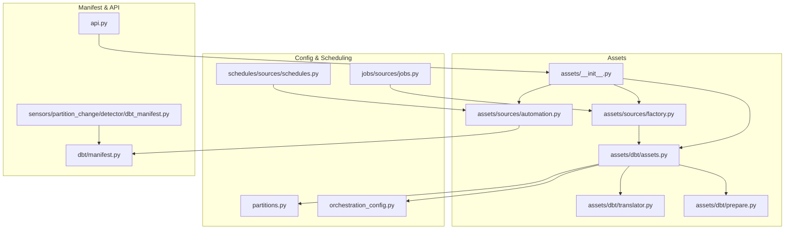
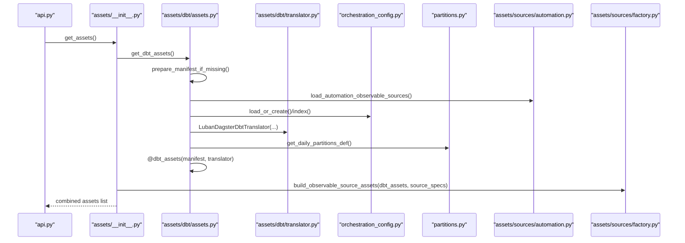
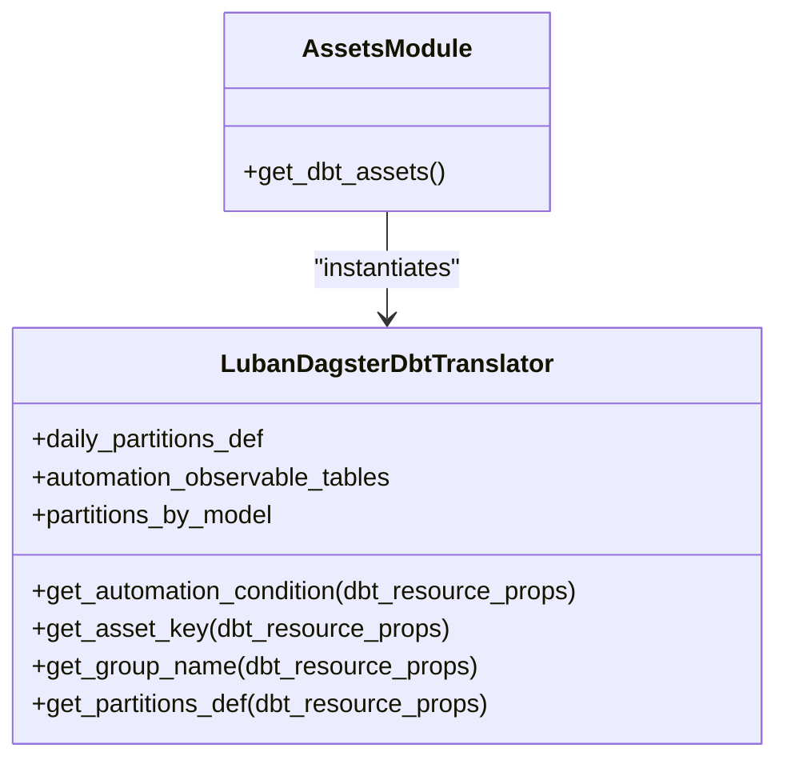
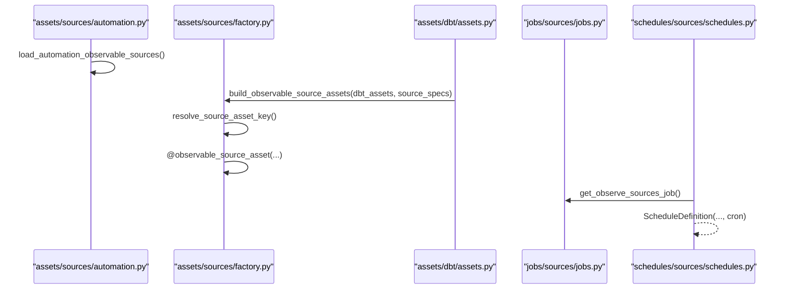
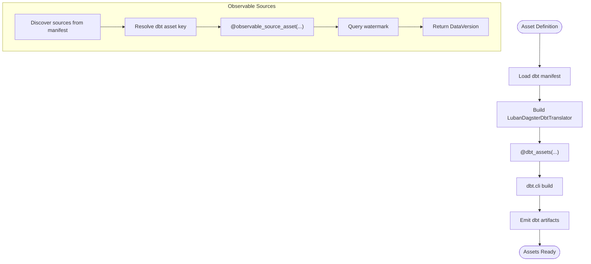
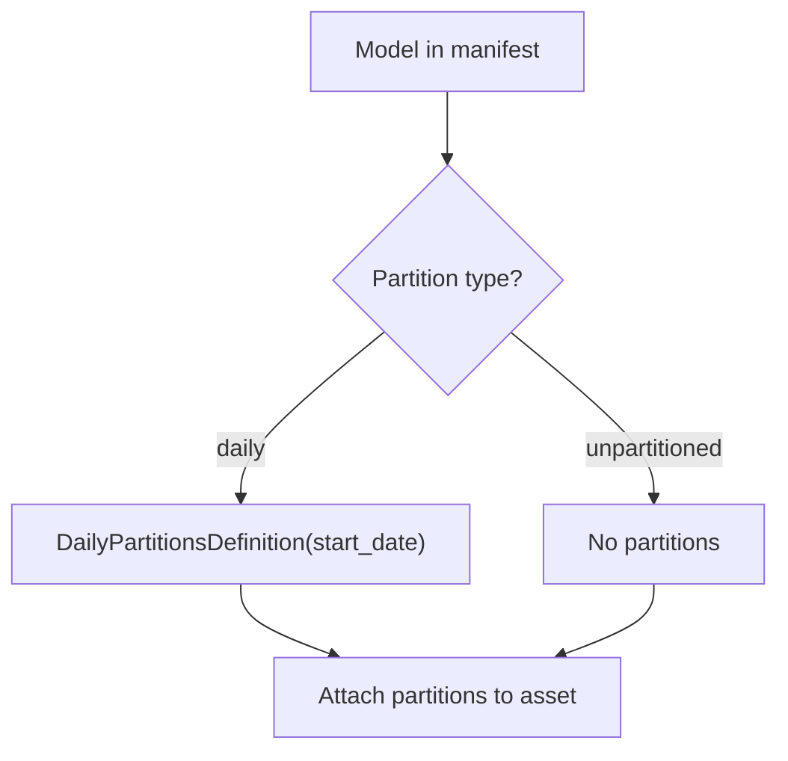
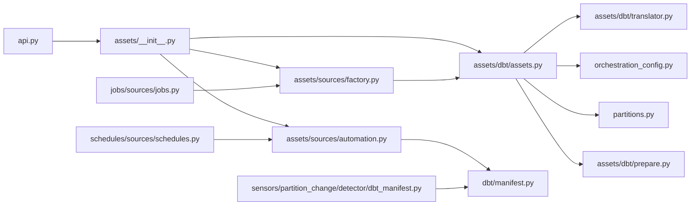

# Asset Management

<cite>
**Referenced Files in This Document**
- [assets/__init__.py](file://src/dbt_dagsterizer/assets/__init__.py)
- [assets/dbt/assets.py](file://src/dbt_dagsterizer/assets/dbt/assets.py)
- [assets/dbt/translator.py](file://src/dbt_dagsterizer/assets/dbt/translator.py)
- [assets/dbt/prepare.py](file://src/dbt_dagsterizer/assets/dbt/prepare.py)
- [assets/sources/automation.py](file://src/dbt_dagsterizer/assets/sources/automation.py)
- [assets/sources/factory.py](file://src/dbt_dagsterizer/assets/sources/factory.py)
- [partitions.py](file://src/dbt_dagsterizer/partitions.py)
- [orchestration_config.py](file://src/dbt_dagsterizer/orchestration_config.py)
- [api.py](file://src/dbt_dagsterizer/api.py)
- [schedules/sources/schedules.py](file://src/dbt_dagsterizer/schedules/sources/schedules.py)
- [jobs/sources/jobs.py](file://src/dbt_dagsterizer/jobs/sources/jobs.py)
- [sensors/partition_change/detector/dbt_manifest.py](file://src/dbt_dagsterizer/sensors/partition_change/detector/dbt_manifest.py)
- [dbt/manifest.py](file://src/dbt_dagsterizer/dbt/manifest.py)
- [test_relation_asset_key_path.py](file://tests/test_relation_asset_key_path.py)
- [test_observable_sources.py](file://tests/test_observable_sources.py)
</cite>

## Table of Contents
1. [Introduction](#introduction)
2. [Project Structure](#project-structure)
3. [Core Components](#core-components)
4. [Architecture Overview](#architecture-overview)
5. [Detailed Component Analysis](#detailed-component-analysis)
6. [Dependency Analysis](#dependency-analysis)
7. [Performance Considerations](#performance-considerations)
8. [Troubleshooting Guide](#troubleshooting-guide)
9. [Conclusion](#conclusion)
10. [Appendices](#appendices)

## Introduction
This document explains asset management in dbt-dagsterizer, focusing on how dbt models are automatically translated into Dagster assets, how observable sources and external data sources are integrated, and how asset translation strategies are applied across dbt model types. It covers dependency resolution, asset key creation, naming conventions, schema handling, partition-aware asset generation, lifecycle management, and configuration options for behavior and metadata.

## Project Structure
Asset management spans several modules:
- DBT asset generation and translation
- Observable source integration
- Partition and orchestration configuration
- Scheduling and sensor support for external data sources

**Diagram sources**
- [assets/__init__.py:1-12](file://src/dbt_dagsterizer/assets/__init__.py#L1-L12)
- [assets/dbt/assets.py:40-113](file://src/dbt_dagsterizer/assets/dbt/assets.py#L40-L113)
- [assets/dbt/translator.py:44-116](file://src/dbt_dagsterizer/assets/dbt/translator.py#L44-L116)
- [assets/dbt/prepare.py:9-18](file://src/dbt_dagsterizer/assets/dbt/prepare.py#L9-L18)
- [assets/sources/automation.py:15-47](file://src/dbt_dagsterizer/assets/sources/automation.py#L15-L47)
- [assets/sources/factory.py:13-86](file://src/dbt_dagsterizer/assets/sources/factory.py#L13-L86)
- [partitions.py:10-21](file://src/dbt_dagsterizer/partitions.py#L10-L21)
- [orchestration_config.py:105-158](file://src/dbt_dagsterizer/orchestration_config.py#L105-L158)
- [schedules/sources/schedules.py:6-16](file://src/dbt_dagsterizer/schedules/sources/schedules.py#L6-L16)
- [jobs/sources/jobs.py:6-23](file://src/dbt_dagsterizer/jobs/sources/jobs.py#L6-L23)
- [dbt/manifest.py:47-92](file://src/dbt_dagsterizer/dbt/manifest.py#L47-L92)
- [api.py:39-71](file://src/dbt_dagsterizer/api.py#L39-L71)
- [sensors/partition_change/detector/dbt_manifest.py:19-53](file://src/dbt_dagsterizer/sensors/partition_change/detector/dbt_manifest.py#L19-L53)

**Section sources**
- [assets/__init__.py:1-12](file://src/dbt_dagsterizer/assets/__init__.py#L1-L12)
- [api.py:39-71](file://src/dbt_dagsterizer/api.py#L39-L71)

## Core Components
- Automatic DBT asset generation via a Dagster asset definition that invokes the dbt CLI and uses a custom translator to map dbt resources to Dagster assets.
- Observable source assets that monitor external data sources (e.g., StarRocks) using watermark columns or SQL expressions.
- Translation strategies for asset keys, groups, partitions, and automation conditions.
- Orchestration configuration for partitions, jobs, schedules, and partition-change propagation.
- Manifest preparation and environment-driven behavior.

**Section sources**
- [assets/dbt/assets.py:40-113](file://src/dbt_dagsterizer/assets/dbt/assets.py#L40-L113)
- [assets/dbt/translator.py:44-116](file://src/dbt_dagsterizer/assets/dbt/translator.py#L44-L116)
- [assets/sources/factory.py:13-86](file://src/dbt_dagsterizer/assets/sources/factory.py#L13-L86)
- [assets/sources/automation.py:15-47](file://src/dbt_dagsterizer/assets/sources/automation.py#L15-L47)
- [partitions.py:10-21](file://src/dbt_dagsterizer/partitions.py#L10-L21)
- [orchestration_config.py:105-158](file://src/dbt_dagsterizer/orchestration_config.py#L105-L158)

## Architecture Overview
The asset pipeline integrates dbt manifests with Dagster assets and external observables:

**Diagram sources**
- [api.py:39-71](file://src/dbt_dagsterizer/api.py#L39-L71)
- [assets/__init__.py:1-12](file://src/dbt_dagsterizer/assets/__init__.py#L1-L12)
- [assets/dbt/assets.py:40-113](file://src/dbt_dagsterizer/assets/dbt/assets.py#L40-L113)
- [assets/dbt/translator.py:44-116](file://src/dbt_dagsterizer/assets/dbt/translator.py#L44-L116)
- [assets/sources/automation.py:15-47](file://src/dbt_dagsterizer/assets/sources/automation.py#L15-L47)
- [assets/sources/factory.py:13-86](file://src/dbt_dagsterizer/assets/sources/factory.py#L13-L86)
- [partitions.py:10-21](file://src/dbt_dagsterizer/partitions.py#L10-L21)
- [orchestration_config.py:105-158](file://src/dbt_dagsterizer/orchestration_config.py#L105-L158)

## Detailed Component Analysis

### DBT Asset Generation and Translation
- Asset definition: A Dagster asset decorated with a dbt manifest and a translator drives dbt CLI execution and yields dbt artifacts.
- Translator responsibilities:
  - Asset key derivation from dbt resource properties using physical identifiers.
  - Group naming derived from file path or FQN.
  - Partition definition for daily-partitioned models.
  - Automation condition for eager runs based on model tags, FQN, and orchestration configuration.
- Environment and retries:
  - DBT_TARGET/LUBAN_DEFAULT_DBT_TARGET selects target.
  - Retry policy for transient errors.
  - Telemetry attached to spans for run results.

**Diagram sources**
- [assets/dbt/translator.py:44-116](file://src/dbt_dagsterizer/assets/dbt/translator.py#L44-L116)
- [assets/dbt/assets.py:40-113](file://src/dbt_dagsterizer/assets/dbt/assets.py#L40-L113)

**Section sources**
- [assets/dbt/assets.py:40-113](file://src/dbt_dagsterizer/assets/dbt/assets.py#L40-L113)
- [assets/dbt/translator.py:44-116](file://src/dbt_dagsterizer/assets/dbt/translator.py#L44-L116)
- [partitions.py:10-21](file://src/dbt_dagsterizer/partitions.py#L10-L21)
- [test_relation_asset_key_path.py:1-19](file://tests/test_relation_asset_key_path.py#L1-L19)

### Observable Source Integration and External Data Handling
- Discovery:
  - Loads observable source specs from the dbt manifest’s sources metadata.
- Asset generation:
  - Resolves a dbt asset key for each source table.
  - Creates an observable source asset with a watermark column or SQL expression.
  - Reads watermark via a StarRocks resource and returns a DataVersion.
- Scheduling:
  - A schedule periodically triggers observation jobs for observable sources.

**Diagram sources**
- [assets/sources/automation.py:15-47](file://src/dbt_dagsterizer/assets/sources/automation.py#L15-L47)
- [assets/sources/factory.py:13-86](file://src/dbt_dagsterizer/assets/sources/factory.py#L13-L86)
- [jobs/sources/jobs.py:6-23](file://src/dbt_dagsterizer/jobs/sources/jobs.py#L6-L23)
- [schedules/sources/schedules.py:6-16](file://src/dbt_dagsterizer/schedules/sources/schedules.py#L6-L16)

**Section sources**
- [assets/sources/automation.py:15-47](file://src/dbt_dagsterizer/assets/sources/automation.py#L15-L47)
- [assets/sources/factory.py:13-86](file://src/dbt_dagsterizer/assets/sources/factory.py#L13-L86)
- [jobs/sources/jobs.py:6-23](file://src/dbt_dagsterizer/jobs/sources/jobs.py#L6-L23)
- [schedules/sources/schedules.py:6-16](file://src/dbt_dagsterizer/schedules/sources/schedules.py#L6-L16)
- [test_observable_sources.py:88-131](file://tests/test_observable_sources.py#L88-L131)

### Asset Dependency Management and Lifecycle
- Dependencies:
  - DBT assets depend on upstream dbt models as defined in the manifest.
  - Observable source assets depend on the resolved dbt asset keys for their upstream relations.
- Lifecycle:
  - Assets are materialized by dbt builds.
  - Observable source assets update their data versions based on watermark checks.
  - Sensors and schedules can trigger re-execution based on partition changes or periodic cadence.

**Diagram sources**
- [assets/dbt/assets.py:40-113](file://src/dbt_dagsterizer/assets/dbt/assets.py#L40-L113)
- [assets/sources/automation.py:15-47](file://src/dbt_dagsterizer/assets/sources/automation.py#L15-L47)
- [assets/sources/factory.py:13-86](file://src/dbt_dagsterizer/assets/sources/factory.py#L13-L86)

**Section sources**
- [assets/dbt/assets.py:40-113](file://src/dbt_dagsterizer/assets/dbt/assets.py#L40-L113)
- [assets/sources/automation.py:15-47](file://src/dbt_dagsterizer/assets/sources/automation.py#L15-L47)
- [assets/sources/factory.py:13-86](file://src/dbt_dagsterizer/assets/sources/factory.py#L13-L86)

### Asset Naming Conventions and Schema Handling
- Asset keys:
  - Relation-based keys constructed from database, schema, and identifier to ensure stability across environments.
  - Empty components are omitted; schema-only cases normalize to database/schema.
- Groups:
  - Derived from the dbt model’s file path under models or from the FQN third segment.
- Naming examples:
  - Keys follow a “dbt/<database>/<schema>/<identifier>” pattern.
  - Tests confirm omission of empty database and correct ordering.

**Section sources**
- [assets/dbt/translator.py:12-42](file://src/dbt_dagsterizer/assets/dbt/translator.py#L12-L42)
- [assets/dbt/translator.py:88-106](file://src/dbt_dagsterizer/assets/dbt/translator.py#L88-L106)
- [test_relation_asset_key_path.py:1-19](file://tests/test_relation_asset_key_path.py#L1-L19)

### Partition-Aware Asset Generation
- Daily partitions:
  - Enabled per model via orchestration configuration and detected by translator.
  - Start date sourced from an environment variable.
- Propagation mode:
  - Controlled by an environment variable affecting automation behavior.

**Diagram sources**
- [assets/dbt/translator.py:108-115](file://src/dbt_dagsterizer/assets/dbt/translator.py#L108-L115)
- [partitions.py:10-21](file://src/dbt_dagsterizer/partitions.py#L10-L21)
- [orchestration_config.py:112-158](file://src/dbt_dagsterizer/orchestration_config.py#L112-L158)

**Section sources**
- [assets/dbt/translator.py:108-115](file://src/dbt_dagsterizer/assets/dbt/translator.py#L108-L115)
- [partitions.py:10-21](file://src/dbt_dagsterizer/partitions.py#L10-L21)
- [orchestration_config.py:112-158](file://src/dbt_dagsterizer/orchestration_config.py#L112-L158)

### Configuration Options for Asset Behavior
- Manifest preparation:
  - Toggle controlled by an environment variable; ensures manifest availability before loading.
- Target selection:
  - DBT_TARGET or LUBAN_DEFAULT_DBT_TARGET determines the dbt target.
- Partition change propagation:
  - Mode controlled by an environment variable influencing automation conditions.
- Daily partitions start date:
  - Required environment variable for daily partition definitions.
- Observable sources:
  - Cron schedule configurable via an environment variable.
- Orchestration configuration:
  - Defines partitions, jobs, schedules, and partition-change detectors/propagators.

**Section sources**
- [assets/dbt/prepare.py:9-18](file://src/dbt_dagsterizer/assets/dbt/prepare.py#L9-L18)
- [assets/dbt/assets.py:46-47](file://src/dbt_dagsterizer/assets/dbt/assets.py#L46-L47)
- [assets/dbt/translator.py:55-56](file://src/dbt_dagsterizer/assets/dbt/translator.py#L55-L56)
- [partitions.py:14-18](file://src/dbt_dagsterizer/partitions.py#L14-L18)
- [schedules/sources/schedules.py:13](file://src/dbt_dagsterizer/schedules/sources/schedules.py#L13)
- [orchestration_config.py:19-83](file://src/dbt_dagsterizer/orchestration_config.py#L19-L83)

### Asset Metadata and Customization Patterns
- Metadata extraction:
  - Manifest loader reads dbt model metadata and tags to derive partition types and asset-job flags.
- Custom asset generators:
  - Observable source assets accept custom watermark SQL or column; environment variables control database selection.
- Extension patterns:
  - Extend translator methods to customize asset keys, groups, partitions, and automation conditions.
  - Add new schedulable jobs for observable sources and integrate with sensors for partition-change detection.

**Section sources**
- [dbt/manifest.py:47-92](file://src/dbt_dagsterizer/dbt/manifest.py#L47-L92)
- [assets/sources/factory.py:46-86](file://src/dbt_dagsterizer/assets/sources/factory.py#L46-L86)
- [assets/dbt/translator.py:44-116](file://src/dbt_dagsterizer/assets/dbt/translator.py#L44-L116)

## Dependency Analysis
- Coupling:
  - DBT asset generation depends on translator and orchestration configuration.
  - Observable source assets depend on dbt asset keys resolved from the dbt asset collection.
- Cohesion:
  - Each module encapsulates a single responsibility: manifest preparation, translation, observable discovery, factory, partitions, and orchestration indexing.
- External dependencies:
  - Dagster, dagster-dbt, and StarRocks resource for observable sources.

**Diagram sources**
- [assets/dbt/assets.py:40-113](file://src/dbt_dagsterizer/assets/dbt/assets.py#L40-L113)
- [assets/dbt/translator.py:44-116](file://src/dbt_dagsterizer/assets/dbt/translator.py#L44-L116)
- [assets/dbt/prepare.py:9-18](file://src/dbt_dagsterizer/assets/dbt/prepare.py#L9-L18)
- [assets/sources/automation.py:15-47](file://src/dbt_dagsterizer/assets/sources/automation.py#L15-L47)
- [assets/sources/factory.py:13-86](file://src/dbt_dagsterizer/assets/sources/factory.py#L13-L86)
- [partitions.py:10-21](file://src/dbt_dagsterizer/partitions.py#L10-L21)
- [orchestration_config.py:105-158](file://src/dbt_dagsterizer/orchestration_config.py#L105-L158)
- [api.py:39-71](file://src/dbt_dagsterizer/api.py#L39-L71)
- [jobs/sources/jobs.py:6-23](file://src/dbt_dagsterizer/jobs/sources/jobs.py#L6-L23)
- [schedules/sources/schedules.py:6-16](file://src/dbt_dagsterizer/schedules/sources/schedules.py#L6-L16)
- [sensors/partition_change/detector/dbt_manifest.py:19-53](file://src/dbt_dagsterizer/sensors/partition_change/detector/dbt_manifest.py#L19-L53)

**Section sources**
- [assets/dbt/assets.py:40-113](file://src/dbt_dagsterizer/assets/dbt/assets.py#L40-L113)
- [assets/sources/automation.py:15-47](file://src/dbt_dagsterizer/assets/sources/automation.py#L15-L47)
- [assets/sources/factory.py:13-86](file://src/dbt_dagsterizer/assets/sources/factory.py#L13-L86)
- [dbt/manifest.py:47-92](file://src/dbt_dagsterizer/dbt/manifest.py#L47-L92)

## Performance Considerations
- Manifest preparation:
  - Enablement controlled by an environment variable to avoid unnecessary work when manifests are prebuilt.
- Retries:
  - Limited retry logic for transient CLI errors to reduce flakiness.
- Partition definitions:
  - Reuse of a singleton daily partitions definition to minimize overhead.
- Observability:
  - Telemetry spans capture dbt command and target for observability and performance insights.

[No sources needed since this section provides general guidance]

## Troubleshooting Guide
- Missing daily partitions start date:
  - Ensure the required environment variable is set when using daily partitions.
- Manifest not found:
  - Verify manifest preparation is enabled or that the manifest exists in the expected location.
- Observable source resolution failures:
  - Confirm dbt asset keys can be resolved for the given source/table combination; check available output names.
- Watermark configuration:
  - Provide either a watermark column or watermark SQL; otherwise, observable source creation fails.
- Automation conditions:
  - Verify model tags, FQN segments, and orchestration configuration align with expected automation behavior.

**Section sources**
- [partitions.py:14-18](file://src/dbt_dagsterizer/partitions.py#L14-L18)
- [assets/dbt/prepare.py:9-18](file://src/dbt_dagsterizer/assets/dbt/prepare.py#L9-L18)
- [assets/sources/factory.py:31-44](file://src/dbt_dagsterizer/assets/sources/factory.py#L31-L44)
- [assets/sources/factory.py:52-56](file://src/dbt_dagsterizer/assets/sources/factory.py#L52-L56)
- [assets/dbt/translator.py:58-80](file://src/dbt_dagsterizer/assets/dbt/translator.py#L58-L80)

## Conclusion
dbt-dagsterizer automates asset generation from dbt models while integrating external observable sources. The LubanDagsterDbtTranslator centralizes asset key, group, partition, and automation logic, while orchestration configuration and environment variables tailor behavior. The system supports partition-aware assets, robust dependency management, and extensible customization patterns for diverse data engineering needs.

[No sources needed since this section summarizes without analyzing specific files]

## Appendices
- Example patterns:
  - Extend translator methods to add custom asset properties or override grouping logic.
  - Integrate new observable sources by adding watermark metadata in dbt schema files and referencing dbt asset keys in the factory.
  - Configure schedules and partition-change propagators via orchestration configuration to drive automation.

[No sources needed since this section provides general guidance]