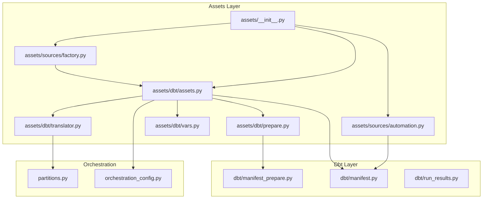
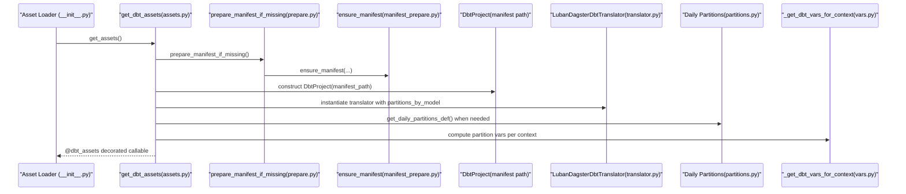
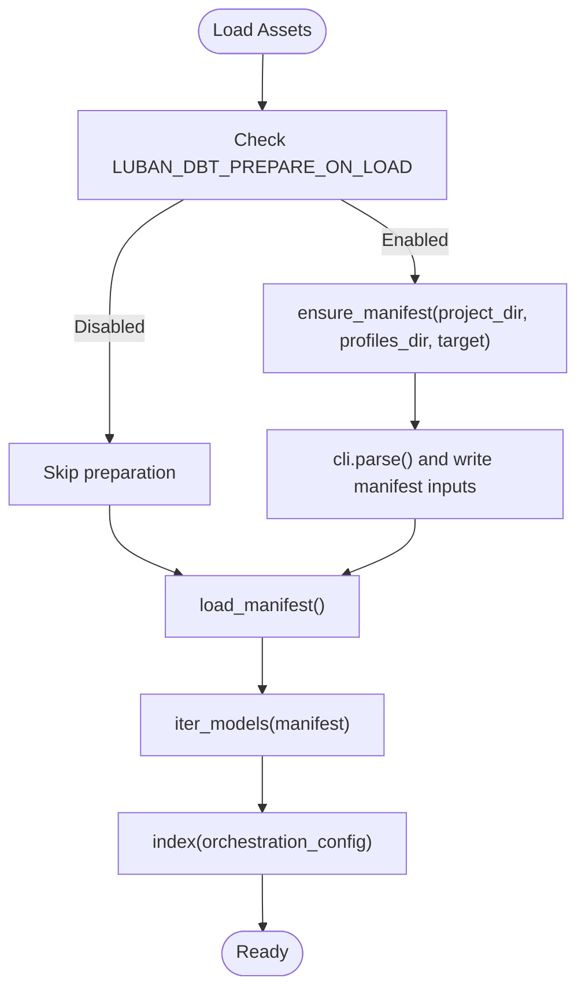
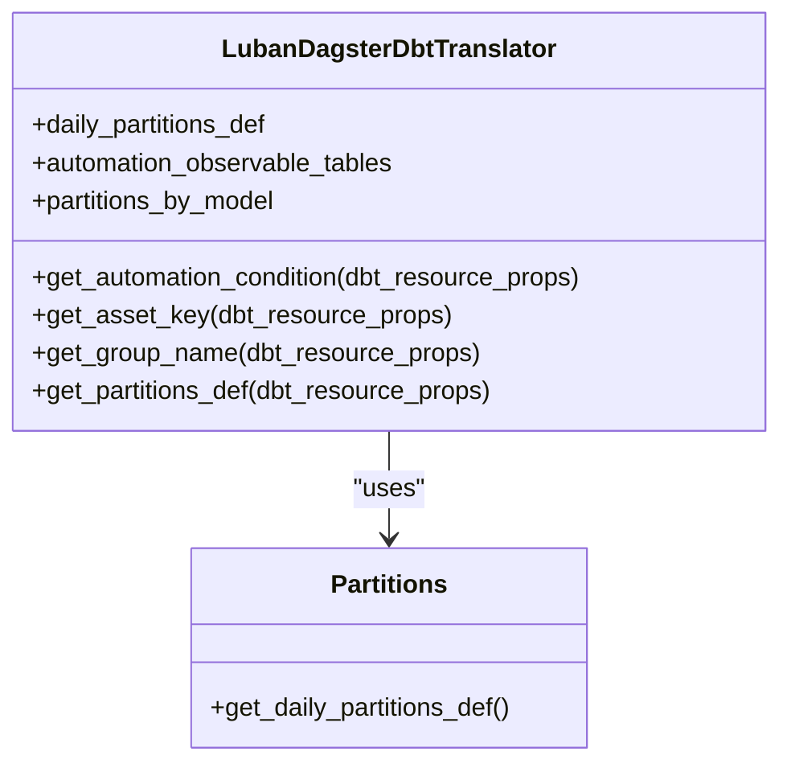
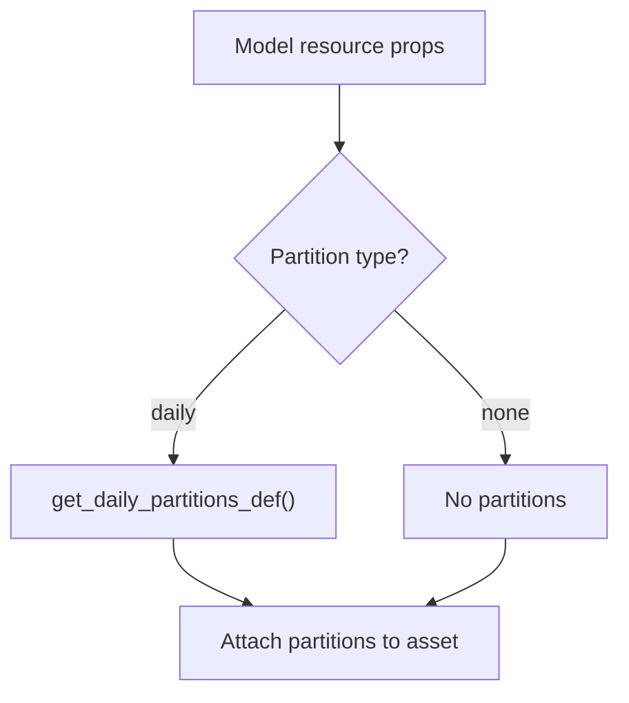
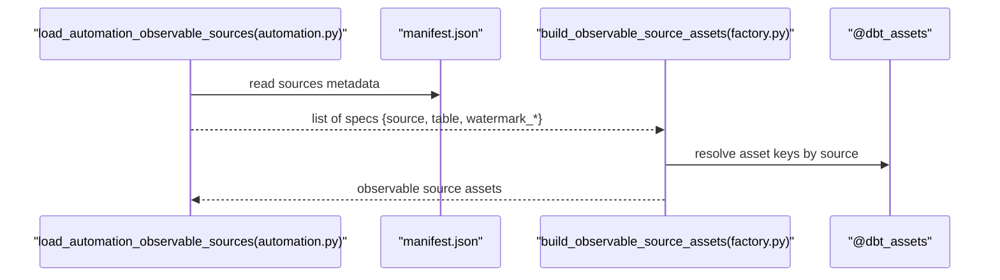
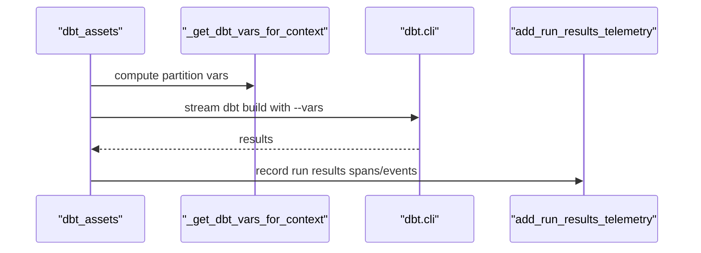
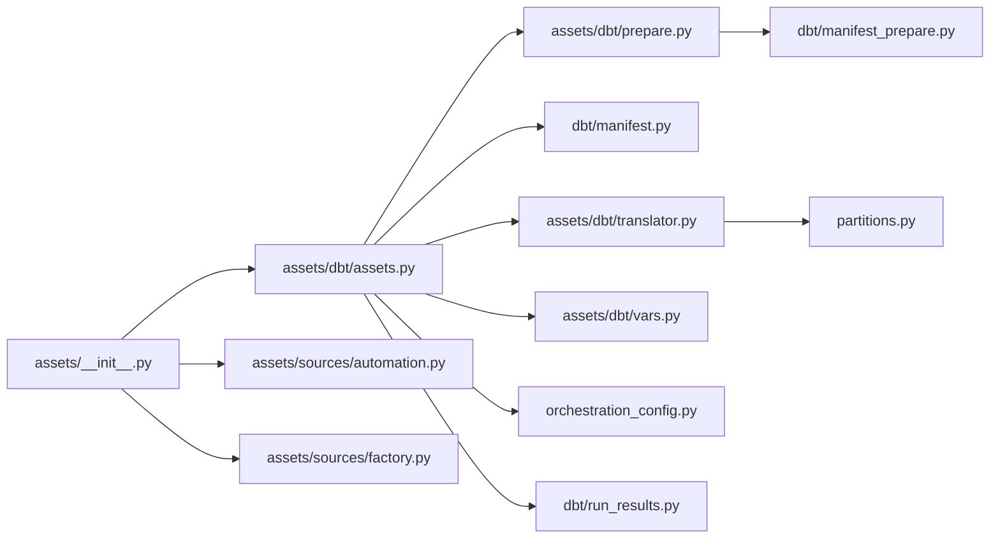

# Dbt Assets

<cite>
**Referenced Files in This Document**
- [assets.py](file://src/dbt_dagsterizer/assets/dbt/assets.py)
- [prepare.py](file://src/dbt_dagsterizer/assets/dbt/prepare.py)
- [translator.py](file://src/dbt_dagsterizer/assets/dbt/translator.py)
- [manifest.py](file://src/dbt_dagsterizer/dbt/manifest.py)
- [manifest_prepare.py](file://src/dbt_dagsterizer/dbt/manifest_prepare.py)
- [vars.py](file://src/dbt_dagsterizer/assets/dbt/vars.py)
- [partitions.py](file://src/dbt_dagsterizer/partitions.py)
- [orchestration_config.py](file://src/dbt_dagsterizer/orchestration_config.py)
- [factory.py](file://src/dbt_dagsterizer/assets/sources/factory.py)
- [automation.py](file://src/dbt_dagsterizer/assets/sources/automation.py)
- [run_results.py](file://src/dbt_dagsterizer/dbt/run_results.py)
- [__init__.py](file://src/dbt_dagsterizer/assets/__init__.py)
</cite>

## Table of Contents
1. [Introduction](#introduction)
2. [Project Structure](#project-structure)
3. [Core Components](#core-components)
4. [Architecture Overview](#architecture-overview)
5. [Detailed Component Analysis](#detailed-component-analysis)
6. [Dependency Analysis](#dependency-analysis)
7. [Performance Considerations](#performance-considerations)
8. [Troubleshooting Guide](#troubleshooting-guide)
9. [Conclusion](#conclusion)
10. [Appendices](#appendices)

## Introduction
This document explains how dbt-dagsterizer automatically converts dbt models into Dagster assets. It covers SQL parsing, manifest processing, asset key creation, and the asset preparation pipeline that extracts metadata, resolves model dependencies, and generates asset definitions. It also documents translation strategies for different dbt model types, naming conventions, schema handling, partition-aware asset generation, customization via metadata, and performance considerations for large dbt projects.

## Project Structure
The dbt asset generation pipeline centers around a small set of modules that coordinate manifest preparation, translation to Dagster asset definitions, and runtime execution with dbt CLI.

**Diagram sources**
- [assets.py:40-113](file://src/dbt_dagsterizer/assets/dbt/assets.py#L40-L113)
- [prepare.py:9-18](file://src/dbt_dagsterizer/assets/dbt/prepare.py#L9-L18)
- [translator.py:44-116](file://src/dbt_dagsterizer/assets/dbt/translator.py#L44-L116)
- [manifest_prepare.py:57-72](file://src/dbt_dagsterizer/dbt/manifest_prepare.py#L57-L72)
- [manifest.py:28-93](file://src/dbt_dagsterizer/dbt/manifest.py#L28-L93)
- [vars.py:25-39](file://src/dbt_dagsterizer/assets/dbt/vars.py#L25-L39)
- [partitions.py:10-21](file://src/dbt_dagsterizer/partitions.py#L10-L21)
- [orchestration_config.py:112-158](file://src/dbt_dagsterizer/orchestration_config.py#L112-L158)
- [automation.py:15-47](file://src/dbt_dagsterizer/assets/sources/automation.py#L15-L47)
- [factory.py:13-86](file://src/dbt_dagsterizer/assets/sources/factory.py#L13-L86)
- [__init__.py:1-12](file://src/dbt_dagsterizer/assets/__init__.py#L1-L12)

**Section sources**
- [assets.py:40-113](file://src/dbt_dagsterizer/assets/dbt/assets.py#L40-L113)
- [prepare.py:9-18](file://src/dbt_dagsterizer/assets/dbt/prepare.py#L9-L18)
- [translator.py:44-116](file://src/dbt_dagsterizer/assets/dbt/translator.py#L44-L116)
- [manifest_prepare.py:57-72](file://src/dbt_dagsterizer/dbt/manifest_prepare.py#L57-L72)
- [manifest.py:28-93](file://src/dbt_dagsterizer/dbt/manifest.py#L28-L93)
- [vars.py:25-39](file://src/dbt_dagsterizer/assets/dbt/vars.py#L25-L39)
- [partitions.py:10-21](file://src/dbt_dagsterizer/partitions.py#L10-L21)
- [orchestration_config.py:112-158](file://src/dbt_dagsterizer/orchestration_config.py#L112-L158)
- [automation.py:15-47](file://src/dbt_dagsterizer/assets/sources/automation.py#L15-L47)
- [factory.py:13-86](file://src/dbt_dagsterizer/assets/sources/factory.py#L13-L86)
- [__init__.py:1-12](file://src/dbt_dagsterizer/assets/__init__.py#L1-L12)

## Core Components
- Manifest preparation and caching: Ensures a fresh dbt manifest is available and tracks inputs to avoid unnecessary rebuilds.
- Asset definition factory: Creates a dbt_assets decorator-backed asset graph using a custom translator.
- Translator: Defines asset keys, groups, partitions, and automation conditions based on dbt resource properties and orchestration configuration.
- Partition utilities: Provides daily partitions definition with a required start date.
- Runtime variable injection: Supplies dbt variables for partitioned runs based on Dagster’s partition time window.
- Source observability: Builds observable source assets from dbt sources metadata and links them to generated dbt assets.
- Telemetry: Adds OpenTelemetry spans/events for dbt run results.

**Section sources**
- [manifest_prepare.py:57-72](file://src/dbt_dagsterizer/dbt/manifest_prepare.py#L57-L72)
- [assets.py:40-113](file://src/dbt_dagsterizer/assets/dbt/assets.py#L40-L113)
- [translator.py:44-116](file://src/dbt_dagsterizer/assets/dbt/translator.py#L44-L116)
- [partitions.py:10-21](file://src/dbt_dagsterizer/partitions.py#L10-L21)
- [vars.py:25-39](file://src/dbt_dagsterizer/assets/dbt/vars.py#L25-L39)
- [automation.py:15-47](file://src/dbt_dagsterizer/assets/sources/automation.py#L15-L47)
- [factory.py:13-86](file://src/dbt_dagsterizer/assets/sources/factory.py#L13-L86)
- [run_results.py:223-335](file://src/dbt_dagsterizer/dbt/run_results.py#L223-L335)

## Architecture Overview
The asset generation pipeline integrates dbt CLI, manifest parsing, and Dagster asset definitions. It supports partition-aware assets, automation triggers, and observable sources.

**Diagram sources**
- [__init__.py:1-12](file://src/dbt_dagsterizer/assets/__init__.py#L1-L12)
- [assets.py:40-113](file://src/dbt_dagsterizer/assets/dbt/assets.py#L40-L113)
- [prepare.py:9-18](file://src/dbt_dagsterizer/assets/dbt/prepare.py#L9-L18)
- [manifest_prepare.py:57-72](file://src/dbt_dagsterizer/dbt/manifest_prepare.py#L57-L72)
- [translator.py:44-116](file://src/dbt_dagsterizer/assets/dbt/translator.py#L44-L116)
- [partitions.py:10-21](file://src/dbt_dagsterizer/partitions.py#L10-L21)
- [vars.py:25-39](file://src/dbt_dagsterizer/assets/dbt/vars.py#L25-L39)

## Detailed Component Analysis

### Asset Preparation Pipeline
- Manifest preparation: On load, the system optionally prepares a dbt manifest by invoking dbt parse (with optional deps) and records inputs to prevent redundant work.
- Manifest loading: Loads the manifest JSON and iterates dbt models to extract metadata and properties used downstream.
- Orchestration indexing: Reads orchestration configuration (dagsterization.yml) to determine partitions, asset jobs, and grouping.

**Diagram sources**
- [prepare.py:9-18](file://src/dbt_dagsterizer/assets/dbt/prepare.py#L9-L18)
- [manifest_prepare.py:57-72](file://src/dbt_dagsterizer/dbt/manifest_prepare.py#L57-L72)
- [manifest.py:28-64](file://src/dbt_dagsterizer/dbt/manifest.py#L28-L64)
- [orchestration_config.py:112-158](file://src/dbt_dagsterizer/orchestration_config.py#L112-L158)

**Section sources**
- [prepare.py:9-18](file://src/dbt_dagsterizer/assets/dbt/prepare.py#L9-L18)
- [manifest_prepare.py:30-72](file://src/dbt_dagsterizer/dbt/manifest_prepare.py#L30-L72)
- [manifest.py:28-64](file://src/dbt_dagsterizer/dbt/manifest.py#L28-L64)
- [orchestration_config.py:112-158](file://src/dbt_dagsterizer/orchestration_config.py#L112-L158)

### Asset Translation Strategies
- Asset key derivation: Relation-based keys use physical identifiers (database, schema, identifier) to ensure stability across environments.
- Grouping: Derives group names from dbt model paths or FQN to organize assets consistently.
- Partitions: Applies daily partitions for models tagged as daily via orchestration configuration.
- Automation conditions: Eager automation for specific model families/tags and observable tables.

**Diagram sources**
- [translator.py:44-116](file://src/dbt_dagsterizer/assets/dbt/translator.py#L44-L116)
- [partitions.py:10-21](file://src/dbt_dagsterizer/partitions.py#L10-L21)

**Section sources**
- [translator.py:12-116](file://src/dbt_dagsterizer/assets/dbt/translator.py#L12-L116)
- [partitions.py:10-21](file://src/dbt_dagsterizer/partitions.py#L10-L21)

### Asset Naming Conventions and Schema Handling
- Asset keys are relation-based and follow a path convention that includes dbt, database, schema, and identifier. Empty components are omitted, and schema normalization ensures consistent paths.
- Group names are derived from dbt model paths or FQN to reflect logical grouping.

**Section sources**
- [translator.py:12-106](file://src/dbt_dagsterizer/assets/dbt/translator.py#L12-L106)

### Partition-Aware Asset Generation
- Daily partitions are applied when a model is configured as daily in orchestration. A start date is required via an environment variable.
- For non-partitioned runs against daily-partitioned assets, default daily window variables are injected.

**Diagram sources**
- [translator.py:108-116](file://src/dbt_dagsterizer/assets/dbt/translator.py#L108-L116)
- [partitions.py:10-21](file://src/dbt_dagsterizer/partitions.py#L10-L21)
- [vars.py:18-39](file://src/dbt_dagsterizer/assets/dbt/vars.py#L18-L39)

**Section sources**
- [translator.py:108-116](file://src/dbt_dagsterizer/assets/dbt/translator.py#L108-L116)
- [partitions.py:10-21](file://src/dbt_dagsterizer/partitions.py#L10-L21)
- [vars.py:18-39](file://src/dbt_dagsterizer/assets/dbt/vars.py#L18-L39)

### Observable Source Assets
- Extracts observable source specs from the dbt manifest metadata.
- Resolves dbt source asset keys to link observable sources to generated dbt assets.
- Builds observable source assets with watermarks computed via SQL or column maxima.

**Diagram sources**
- [automation.py:15-47](file://src/dbt_dagsterizer/assets/sources/automation.py#L15-L47)
- [factory.py:13-86](file://src/dbt_dagsterizer/assets/sources/factory.py#L13-L86)
- [assets.py:40-113](file://src/dbt_dagsterizer/assets/dbt/assets.py#L40-L113)

**Section sources**
- [automation.py:15-47](file://src/dbt_dagsterizer/assets/sources/automation.py#L15-L47)
- [factory.py:13-86](file://src/dbt_dagsterizer/assets/sources/factory.py#L13-L86)

### Asset Execution and Telemetry
- The dbt assets decorator executes dbt CLI commands and streams logs.
- Variables for partitioned runs are injected dynamically based on the current partition time window.
- Run results telemetry adds spans or events for long-running dbt nodes.

**Diagram sources**
- [assets.py:71-113](file://src/dbt_dagsterizer/assets/dbt/assets.py#L71-L113)
- [vars.py:25-39](file://src/dbt_dagsterizer/assets/dbt/vars.py#L25-L39)
- [run_results.py:223-335](file://src/dbt_dagsterizer/dbt/run_results.py#L223-L335)

**Section sources**
- [assets.py:71-113](file://src/dbt_dagsterizer/assets/dbt/assets.py#L71-L113)
- [vars.py:25-39](file://src/dbt_dagsterizer/assets/dbt/vars.py#L25-L39)
- [run_results.py:223-335](file://src/dbt_dagsterizer/dbt/run_results.py#L223-L335)

## Dependency Analysis
- Asset loader composes dbt assets, observable sources, and automation specs into a single asset list.
- Translator depends on orchestration configuration for partitioning and automation rules.
- Manifest preparation is gated by environment flags and writes manifest inputs to avoid re-parsing.

**Diagram sources**
- [__init__.py:1-12](file://src/dbt_dagsterizer/assets/__init__.py#L1-L12)
- [assets.py:40-113](file://src/dbt_dagsterizer/assets/dbt/assets.py#L40-L113)
- [prepare.py:9-18](file://src/dbt_dagsterizer/assets/dbt/prepare.py#L9-L18)
- [manifest_prepare.py:57-72](file://src/dbt_dagsterizer/dbt/manifest_prepare.py#L57-L72)
- [manifest.py:28-93](file://src/dbt_dagsterizer/dbt/manifest.py#L28-L93)
- [translator.py:44-116](file://src/dbt_dagsterizer/assets/dbt/translator.py#L44-L116)
- [partitions.py:10-21](file://src/dbt_dagsterizer/partitions.py#L10-L21)
- [vars.py:25-39](file://src/dbt_dagsterizer/assets/dbt/vars.py#L25-L39)
- [orchestration_config.py:112-158](file://src/dbt_dagsterizer/orchestration_config.py#L112-L158)
- [automation.py:15-47](file://src/dbt_dagsterizer/assets/sources/automation.py#L15-L47)
- [factory.py:13-86](file://src/dbt_dagsterizer/assets/sources/factory.py#L13-L86)
- [run_results.py:223-335](file://src/dbt_dagsterizer/dbt/run_results.py#L223-L335)

**Section sources**
- [__init__.py:1-12](file://src/dbt_dagsterizer/assets/__init__.py#L1-L12)
- [assets.py:40-113](file://src/dbt_dagsterizer/assets/dbt/assets.py#L40-L113)
- [prepare.py:9-18](file://src/dbt_dagsterizer/assets/dbt/prepare.py#L9-L18)
- [manifest_prepare.py:57-72](file://src/dbt_dagsterizer/dbt/manifest_prepare.py#L57-L72)
- [manifest.py:28-93](file://src/dbt_dagsterizer/dbt/manifest.py#L28-L93)
- [translator.py:44-116](file://src/dbt_dagsterizer/assets/dbt/translator.py#L44-L116)
- [partitions.py:10-21](file://src/dbt_dagsterizer/partitions.py#L10-L21)
- [vars.py:25-39](file://src/dbt_dagsterizer/assets/dbt/vars.py#L25-L39)
- [orchestration_config.py:112-158](file://src/dbt_dagsterizer/orchestration_config.py#L112-L158)
- [automation.py:15-47](file://src/dbt_dagsterizer/assets/sources/automation.py#L15-L47)
- [factory.py:13-86](file://src/dbt_dagsterizer/assets/sources/factory.py#L13-L86)
- [run_results.py:223-335](file://src/dbt_dagsterizer/dbt/run_results.py#L223-L335)

## Performance Considerations
- Manifest caching: Manifest preparation checks inputs and avoids re-parsing unless necessary. Disable with an environment flag if desired.
- Target selection: Uses DBT_TARGET or a default to control which dbt target is used for parsing and building.
- Retry strategy: Retries specific dbt CLI errors once to handle transient “already exists” conditions.
- Partition variable injection: Avoids overhead by only computing variables when a partitioned context is present.
- Telemetry filtering: Limits OpenTelemetry spans/events to top N slowest nodes and minimum execution thresholds.

**Section sources**
- [manifest_prepare.py:57-72](file://src/dbt_dagsterizer/dbt/manifest_prepare.py#L57-L72)
- [assets.py:35-101](file://src/dbt_dagsterizer/assets/dbt/assets.py#L35-L101)
- [vars.py:25-39](file://src/dbt_dagsterizer/assets/dbt/vars.py#L25-L39)
- [run_results.py:194-221](file://src/dbt_dagsterizer/dbt/run_results.py#L194-L221)

## Troubleshooting Guide
- Manifest not found: Ensure dbt manifest exists or enable automatic preparation. Verify DBT_TARGET and project/profiles directories.
- Missing daily partitions start date: Set the required environment variable for daily partitions.
- Observable source resolution: If a source table cannot be resolved, confirm the source name and table exist and that the dbt asset key suffix matches expectations.
- Retries on “already exists”: The system retries once for specific CLI errors; check logs for the warning and verify concurrent runs.
- Telemetry disabled: If OpenTelemetry spans are not appearing, confirm the mode environment variable and that the run results file exists.

**Section sources**
- [manifest_prepare.py:64-72](file://src/dbt_dagsterizer/dbt/manifest_prepare.py#L64-L72)
- [partitions.py:14-18](file://src/dbt_dagsterizer/partitions.py#L14-L18)
- [factory.py:31-44](file://src/dbt_dagsterizer/assets/sources/factory.py#L31-L44)
- [assets.py:94-101](file://src/dbt_dagsterizer/assets/dbt/assets.py#L94-L101)
- [run_results.py:223-231](file://src/dbt_dagsterizer/dbt/run_results.py#L223-L231)

## Conclusion
Dbt-dagsterizer automates the conversion of dbt models into Dagster assets by preparing manifests, translating dbt resource properties into asset definitions, and wiring partition-aware execution with observable sources. The system emphasizes robustness through manifest caching, targeted retries, and telemetry, while enabling flexible customization via orchestration configuration and metadata.

## Appendices

### Asset Metadata and Customization
- Partition configuration: Use orchestration configuration to mark models as daily or unpartitioned.
- Asset job assignment: Assign models to dedicated asset jobs via orchestration configuration.
- Grouping: Group models by folder or FQN-derived names for clearer organization.
- Automation: Configure eager automation for specific model families or tags.

**Section sources**
- [orchestration_config.py:112-158](file://src/dbt_dagsterizer/orchestration_config.py#L112-L158)
- [translator.py:88-106](file://src/dbt_dagsterizer/assets/dbt/translator.py#L88-L106)