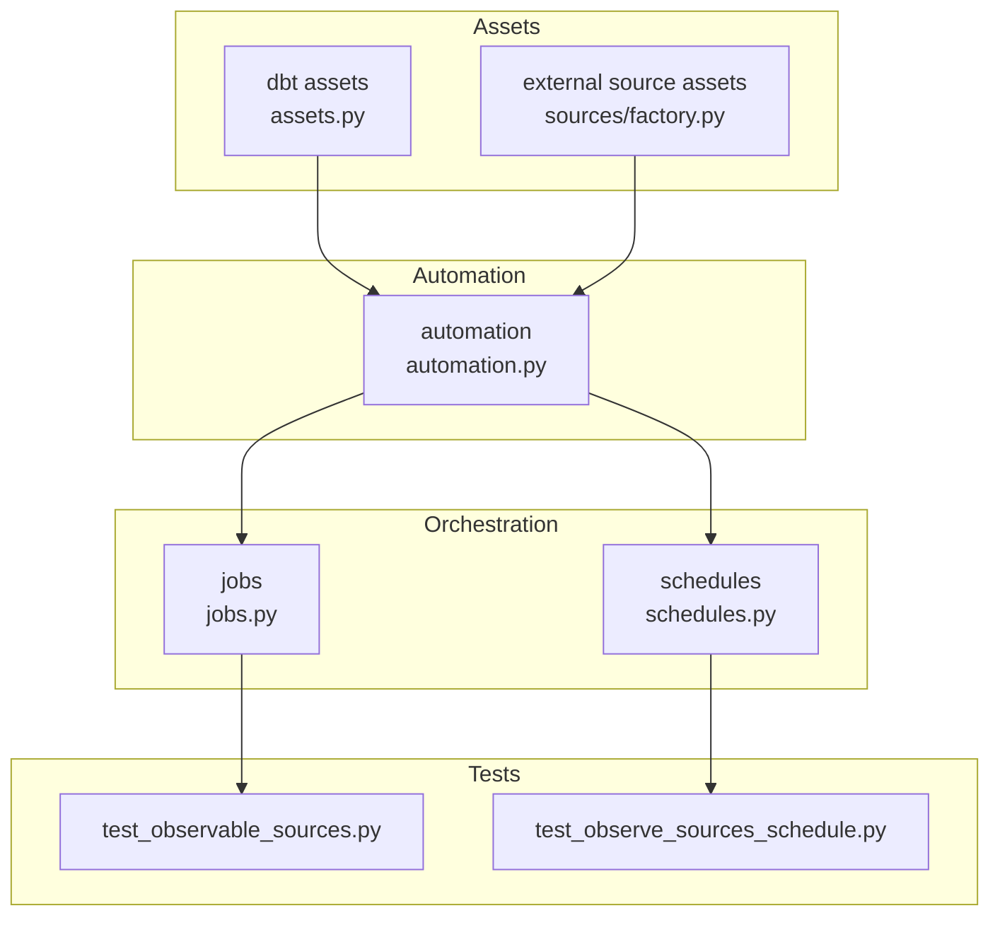
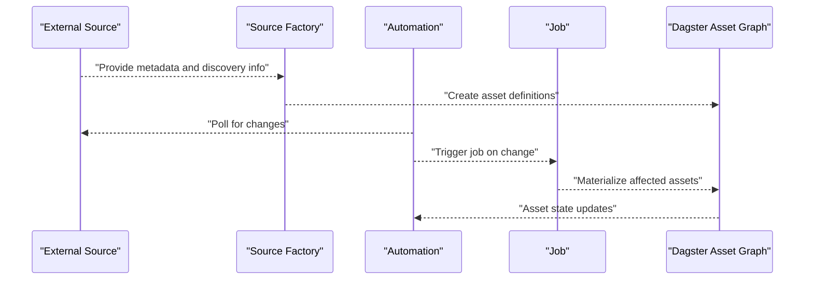
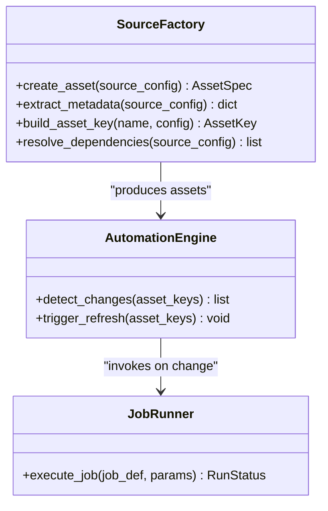
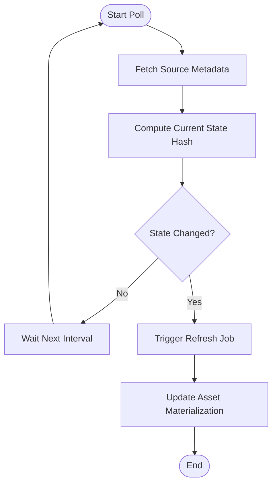
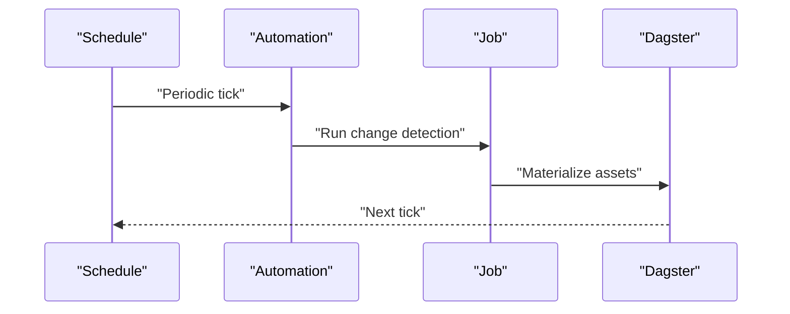
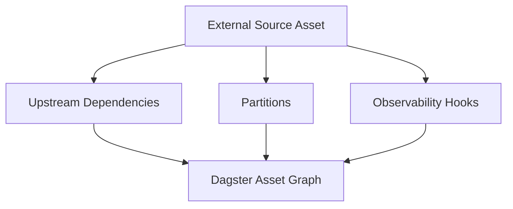
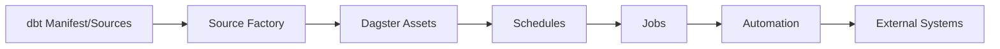

# Observable Sources

<cite>
**Referenced Files in This Document**
- [assets.py](file://src/dbt_dagsterizer/assets/dbt/assets.py)
- [automation.py](file://src/dbt_dagsterizer/assets/sources/automation.py)
- [factory.py](file://src/dbt_dagsterizer/assets/sources/factory.py)
- [jobs.py](file://src/dbt_dagsterizer/jobs/sources/jobs.py)
- [schedules.py](file://src/dbt_dagsterizer/schedules/sources/schedules.py)
- [test_observable_sources.py](file://tests/test_observable_sources.py)
- [test_observe_sources_schedule.py](file://tests/test_observe_sources_schedule.py)
- [README.md](file://docs/getting-started.md)
- [overview.md](file://docs/concepts/overview.md)
- [execution-model.md](file://docs/concepts/execution-model.md)
- [observability.md](file://docs/observability.md)
</cite>

## Table of Contents
1. [Introduction](#introduction)
2. [Project Structure](#project-structure)
3. [Core Components](#core-components)
4. [Architecture Overview](#architecture-overview)
5. [Detailed Component Analysis](#detailed-component-analysis)
6. [Dependency Analysis](#dependency-analysis)
7. [Performance Considerations](#performance-considerations)
8. [Troubleshooting Guide](#troubleshooting-guide)
9. [Conclusion](#conclusion)
10. [Appendices](#appendices)

## Introduction
This document explains how dbt-dagsterizer integrates external data sources as observable assets in Dagster. It covers:
- Handling external data beyond dbt models (files, APIs, streams)
- Automation that detects external data changes and triggers asset refreshes
- The factory pattern used to create observable source assets
- Discovery, metadata extraction, and dependency mapping for external sources
- Configuration options for polling, change detection, and error handling
- Practical examples and customization guidance

## Project Structure
The observable sources feature spans several modules:
- Assets: dbt model assets and external source assets
- Automation: change detection and asset refresh orchestration
- Jobs and Schedules: periodic execution for external sources
- Tests: verification of observable source behavior and scheduling

**Diagram sources**
- [assets.py](file://src/dbt_dagsterizer/assets/dbt/assets.py)
- [factory.py](file://src/dbt_dagsterizer/assets/sources/factory.py)
- [automation.py](file://src/dbt_dagsterizer/assets/sources/automation.py)
- [jobs.py](file://src/dbt_dagsterizer/jobs/sources/jobs.py)
- [schedules.py](file://src/dbt_dagsterizer/schedules/sources/schedules.py)
- [test_observable_sources.py](file://tests/test_observable_sources.py)
- [test_observe_sources_schedule.py](file://tests/test_observe_sources_schedule.py)

**Section sources**
- [assets.py](file://src/dbt_dagsterizer/assets/dbt/assets.py)
- [factory.py](file://src/dbt_dagsterizer/assets/sources/factory.py)
- [automation.py](file://src/dbt_dagsterizer/assets/sources/automation.py)
- [jobs.py](file://src/dbt_dagsterizer/jobs/sources/jobs.py)
- [schedules.py](file://src/dbt_dagsterizer/schedules/sources/schedules.py)
- [test_observable_sources.py](file://tests/test_observable_sources.py)
- [test_observe_sources_schedule.py](file://tests/test_observe_sources_schedule.py)

## Core Components
- External source factory: Creates Dagster assets for external sources using a standardized interface and metadata extraction.
- Automation: Detects changes in external sources and triggers asset reconciliation.
- Jobs and Schedules: Periodic orchestration to poll external sources and update asset materialization.
- Tests: Validate observable source creation, polling behavior, and schedule execution.

Key responsibilities:
- Discover external sources from dbt project configuration
- Extract metadata (paths, URLs, partitions, etc.)
- Build Dagster asset keys and dependencies
- Enforce change detection strategies and error handling policies
- Integrate with Dagster’s asset system for downstream asset propagation

**Section sources**
- [factory.py](file://src/dbt_dagsterizer/assets/sources/factory.py)
- [automation.py](file://src/dbt_dagsterizer/assets/sources/automation.py)
- [jobs.py](file://src/dbt_dagsterizer/jobs/sources/jobs.py)
- [schedules.py](file://src/dbt_dagsterizer/schedules/sources/schedules.py)

## Architecture Overview
The observable sources pipeline connects external data sources to Dagster assets via a factory, automation, and scheduled jobs.

**Diagram sources**
- [factory.py](file://src/dbt_dagsterizer/assets/sources/factory.py)
- [automation.py](file://src/dbt_dagsterizer/assets/sources/automation.py)
- [jobs.py](file://src/dbt_dagsterizer/jobs/sources/jobs.py)

## Detailed Component Analysis

### External Source Factory Pattern
The factory builds Dagster assets for external sources. It:
- Accepts source metadata (name, type, path/URL, partitions)
- Generates asset keys and dependencies
- Applies partitioning and selection logic
- Integrates with Dagster’s asset system

**Diagram sources**
- [factory.py](file://src/dbt_dagsterizer/assets/sources/factory.py)
- [automation.py](file://src/dbt_dagsterizer/assets/sources/automation.py)
- [jobs.py](file://src/dbt_dagsterizer/jobs/sources/jobs.py)

**Section sources**
- [factory.py](file://src/dbt_dagsterizer/assets/sources/factory.py)

### Automation and Change Detection
Automation monitors external sources and triggers asset refreshes when changes are detected. It:
- Polls external sources at configured intervals
- Compares current state against previous state
- Invokes jobs to reconcile assets
- Handles errors and retries according to policies

**Diagram sources**
- [automation.py](file://src/dbt_dagsterizer/assets/sources/automation.py)
- [jobs.py](file://src/dbt_dagsterizer/jobs/sources/jobs.py)

**Section sources**
- [automation.py](file://src/dbt_dagsterizer/assets/sources/automation.py)
- [jobs.py](file://src/dbt_dagsterizer/jobs/sources/jobs.py)

### Scheduling and Orchestration
Schedules define when automation runs. They:
- Configure polling intervals
- Map to jobs that execute change detection and asset refresh
- Support presets and auto-configurations

**Diagram sources**
- [schedules.py](file://src/dbt_dagsterizer/schedules/sources/schedules.py)
- [automation.py](file://src/dbt_dagsterizer/assets/sources/automation.py)
- [jobs.py](file://src/dbt_dagsterizer/jobs/sources/jobs.py)

**Section sources**
- [schedules.py](file://src/dbt_dagsterizer/schedules/sources/schedules.py)

### Asset Integration with Dagster
External source assets integrate with Dagster’s asset graph:
- Asset keys derived from source metadata
- Dependencies inferred from upstream sources/models
- Partitioning aligned with external data partitions
- Observability and logging integrated with Dagster’s observability framework

**Diagram sources**
- [factory.py](file://src/dbt_dagsterizer/assets/sources/factory.py)
- [assets.py](file://src/dbt_dagsterizer/assets/dbt/assets.py)
- [observability.md](file://docs/observability.md)

**Section sources**
- [factory.py](file://src/dbt_dagsterizer/assets/sources/factory.py)
- [assets.py](file://src/dbt_dagsterizer/assets/dbt/assets.py)
- [observability.md](file://docs/observability.md)

## Dependency Analysis
Observable sources depend on:
- dbt project configuration for source discovery
- Dagster asset definitions and job orchestration
- Scheduling subsystem for periodic polling
- External systems for data availability and change signals

**Diagram sources**
- [factory.py](file://src/dbt_dagsterizer/assets/sources/factory.py)
- [schedules.py](file://src/dbt_dagsterizer/schedules/sources/schedules.py)
- [jobs.py](file://src/dbt_dagsterizer/jobs/sources/jobs.py)
- [automation.py](file://src/dbt_dagsterizer/assets/sources/automation.py)

**Section sources**
- [factory.py](file://src/dbt_dagsterizer/assets/sources/factory.py)
- [schedules.py](file://src/dbt_dagsterizer/schedules/sources/schedules.py)
- [jobs.py](file://src/dbt_dagsterizer/jobs/sources/jobs.py)
- [automation.py](file://src/dbt_dagsterizer/assets/sources/automation.py)

## Performance Considerations
- Polling frequency: Tune intervals to balance freshness vs. cost
- Change detection granularity: Prefer efficient hashing or ETags for large datasets
- Partitioning: Use partition-aware reads to minimize reprocessing
- Backoff and retries: Apply exponential backoff on transient failures
- Observability: Monitor job durations, failure rates, and downstream asset latencies

## Troubleshooting Guide
Common issues and resolutions:
- No assets created: Verify source discovery configuration and metadata extraction
- Frequent false positives: Adjust change detection thresholds or hashing strategy
- Scheduling not triggering: Confirm schedule presets and job bindings
- External system errors: Inspect job logs and apply retry/backoff policies

Validation references:
- Observable source behavior tests
- Schedule execution tests

**Section sources**
- [test_observable_sources.py](file://tests/test_observable_sources.py)
- [test_observe_sources_schedule.py](file://tests/test_observe_sources_schedule.py)

## Conclusion
The observable sources feature extends dbt-dagsterizer to treat external data as first-class assets. By combining a factory-driven asset creation pattern, automation-based change detection, and scheduled orchestration, it enables reliable, observable, and scalable ingestion of file-based, API-backed, and streaming data into the Dagster asset graph.

## Appendices

### Configuration Options
- Polling interval: Configure schedule cadence for external source polling
- Change detection strategy: Choose hashing, timestamps, or ETag-based detection
- Error handling: Define retry limits, backoff, and alerting policies
- Partitioning: Align external partitions with downstream asset expectations

### Example Scenarios
- File-based sources: CSV/Parquet on cloud storage; detect new files or modified timestamps
- API endpoints: REST endpoints with pagination; detect incremental updates via timestamps or cursors
- Streaming data: Event streams with watermarking; reconcile per-partition windows

### Related Documentation
- Getting started guide for initial setup
- Concepts overview and execution model
- Observability practices for monitoring asset health

**Section sources**
- [README.md](file://docs/getting-started.md)
- [overview.md](file://docs/concepts/overview.md)
- [execution-model.md](file://docs/concepts/execution-model.md)
- [observability.md](file://docs/observability.md)