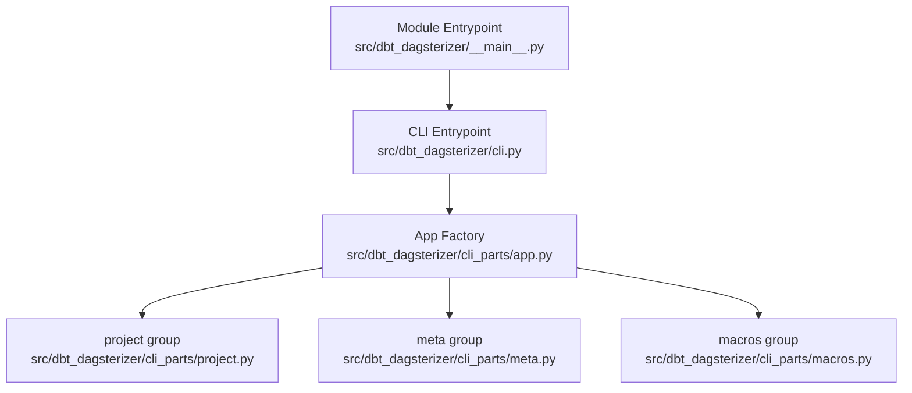
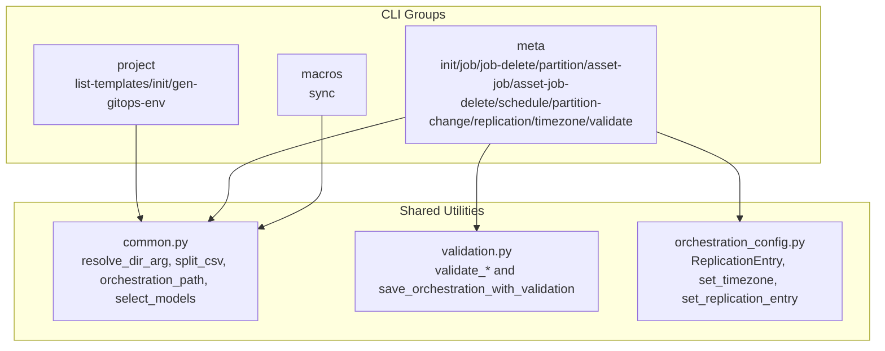
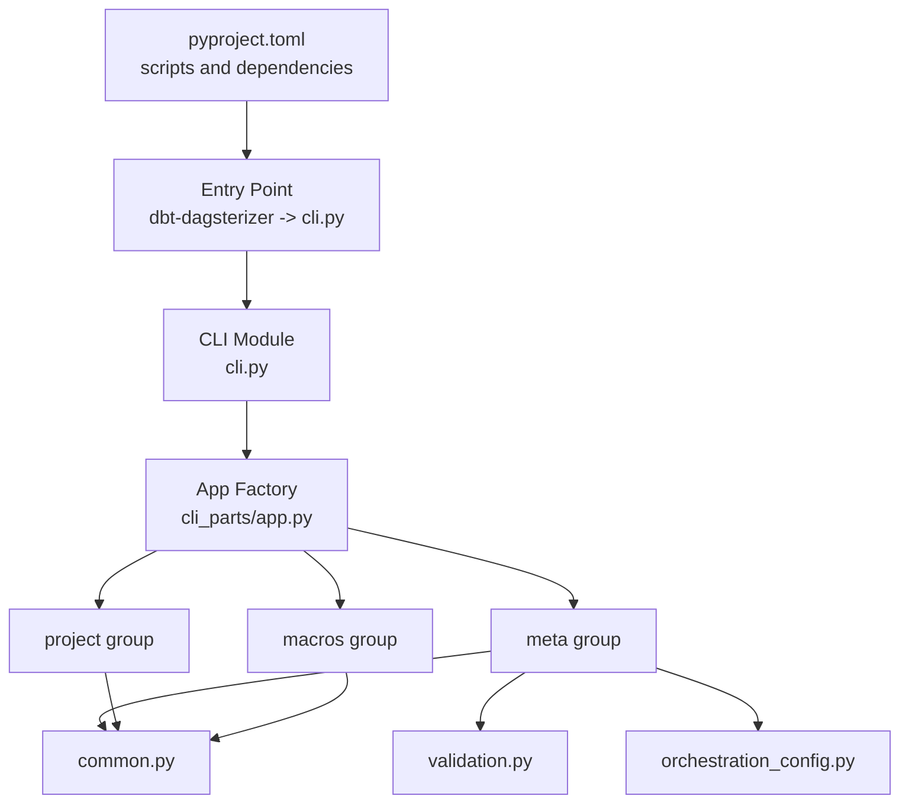

# CLI Reference

<cite>
**Referenced Files in This Document**
- [cli.py](file://src/dbt_dagsterizer/cli.py)
- [__main__.py](file://src/dbt_dagsterizer/__main__.py)
- [app.py](file://src/dbt_dagsterizer/cli_parts/app.py)
- [project.py](file://src/dbt_dagsterizer/cli_parts/project.py)
- [meta.py](file://src/dbt_dagsterizer/cli_parts/meta.py)
- [macros.py](file://src/dbt_dagsterizer/cli_parts/macros.py)
- [validation.py](file://src/dbt_dagsterizer/cli_parts/validation.py)
- [common.py](file://src/dbt_dagsterizer/cli_parts/common.py)
- [orchestration_config.py](file://src/dbt_dagsterizer/orchestration_config.py)
- [cli.md](file://docs/concepts/cli.md)
- [pyproject.toml](file://pyproject.toml)
</cite>

## Update Summary
**Changes Made**
- Added comprehensive documentation for the new meta timezone command for setting global schedule execution timezone
- Added comprehensive documentation for the new meta replication entry command for configuring StarRocks-to-SQL Server replication
- Updated meta group documentation to include new replication and timezone commands
- Added practical examples for replication configuration and timezone settings
- Updated architecture diagrams to reflect new replication functionality

## Table of Contents
1. [Introduction](#introduction)
2. [Project Structure](#project-structure)
3. [Core Components](#core-components)
4. [Architecture Overview](#architecture-overview)
5. [Detailed Component Analysis](#detailed-component-analysis)
6. [Dependency Analysis](#dependency-analysis)
7. [Performance Considerations](#performance-considerations)
8. [Troubleshooting Guide](#troubleshooting-guide)
9. [Conclusion](#conclusion)
10. [Appendices](#appendices)

## Introduction
This document is the comprehensive CLI reference for dbt-dagsterizer. It documents all available CLI commands, subcommands, and their options. It covers project initialization, validation, and maintenance operations, including command-line flags, environment variable usage, and configuration options. Practical examples are provided for each command category, along with error handling, exit codes, troubleshooting, advanced usage patterns, and CI/CD integration guidance.

## Project Structure
The CLI is organized around three top-level groups:
- project: project scaffolding and GitOps environment generation
- meta: orchestration file management and validation
- macros: macro synchronization from templates

Entry points:
- Command: dbt-dagsterizer
- Module: python -m dbt_dagsterizer

**Diagram sources**
- [cli.py:1-7](file://src/dbt_dagsterizer/cli.py#L1-L7)
- [__main__.py:1-5](file://src/dbt_dagsterizer/__main__.py#L1-L5)
- [app.py:19-29](file://src/dbt_dagsterizer/cli_parts/app.py#L19-L29)
- [project.py:106-307](file://src/dbt_dagsterizer/cli_parts/project.py#L106-L307)
- [meta.py:603-773](file://src/dbt_dagsterizer/cli_parts/meta.py#L603-L773)
- [macros.py:67-84](file://src/dbt_dagsterizer/cli_parts/macros.py#L67-L84)

**Section sources**
- [cli.py:1-7](file://src/dbt_dagsterizer/cli.py#L1-L7)
- [__main__.py:1-5](file://src/dbt_dagsterizer/__main__.py#L1-L5)
- [app.py:19-29](file://src/dbt_dagsterizer/cli_parts/app.py#L19-L29)
- [pyproject.toml:30-32](file://pyproject.toml#L30-L32)

## Core Components
- project group
  - project list-templates
  - project init
  - project gen-gitops-env
- meta group
  - meta init
  - meta job
  - meta job-delete
  - meta partition
  - meta asset-job
  - meta asset-job-delete
  - meta schedule
  - meta partition-change detector
  - meta partition-change propagator
  - meta replication entry
  - meta timezone
  - meta validate
- macros group
  - macros sync

Environment and configuration highlights:
- Version option programmatically injected
- Cookiecutter required for project init
- Dotenv loading behavior for dbt parse
- Manifest preparation and caching via sidecar inputs
- Replication configuration for StarRocks-to-SQL Server data pipeline

**Section sources**
- [app.py:19-29](file://src/dbt_dagsterizer/cli_parts/app.py#L19-L29)
- [project.py:106-307](file://src/dbt_dagsterizer/cli_parts/project.py#L106-L307)
- [meta.py:603-773](file://src/dbt_dagsterizer/cli_parts/meta.py#L603-L773)
- [macros.py:67-84](file://src/dbt_dagsterizer/cli_parts/macros.py#L67-L84)
- [cli.md:36-52](file://docs/concepts/cli.md#L36-L52)

## Architecture Overview
The CLI composes Click groups and commands, delegating to shared helpers for path resolution, model selection, and validation. The meta group orchestrates orchestration file updates and optionally triggers dbt parse to refresh manifests. The project group renders cookiecutter templates and generates GitOps artifacts. The replication functionality integrates with the orchestration configuration system to manage StarRocks-to-SQL Server data replication.

**Diagram sources**
- [project.py:106-307](file://src/dbt_dagsterizer/cli_parts/project.py#L106-L307)
- [meta.py:603-773](file://src/dbt_dagsterizer/cli_parts/meta.py#L603-L773)
- [macros.py:67-84](file://src/dbt_dagsterizer/cli_parts/macros.py#L67-L84)
- [common.py:11-63](file://src/dbt_dagsterizer/cli_parts/common.py#L11-L63)
- [validation.py:22-310](file://src/dbt_dagsterizer/cli_parts/validation.py#L22-L310)
- [orchestration_config.py:18-28](file://src/dbt_dagsterizer/orchestration_config.py#L18-L28)

## Detailed Component Analysis

### project group
- project list-templates
  - Purpose: List embedded cookiecutter template names.
  - Options:
    - None
  - Behavior: Prints template names to stdout.
  - Notes: Template names come from the embedded resource directory.

- project init
  - Purpose: Render a runnable Dagster + dbt code-location project from an embedded template.
  - Required options:
    - --project-name or --name
  - Key options:
    - --template: template name (defaulted)
    - --output-dir: destination directory (default current working directory)
    - --force: overwrite existing output directory
    - --output-name: output directory name (derived from project name if omitted)
    - --namespace: optional namespace used for defaults (e.g., OTEL service naming)
    - --dagster-version: pins Dagster version in generated dependencies
    - --dbt-dagsterizer-version: pins dbt-dagsterizer in generated dependencies (default from installed version if available)
    - --local-dbt-dagsterizer-path: specify local dbt-dagsterizer checkout path for dependency resolution
    - --no-pin-dbt-dagsterizer: do not pin dbt-dagsterizer (mutually exclusive with --dbt-dagsterizer-version)
    - --default-env: default environment string
    - --code-location-port: port for code location server
    - --include-sample-dbt-project: include sample models
    - --include-docker: include Docker Compose and Make targets
    - --author-name, --author-email: metadata for generated project
    - --python-index-url, --python-index-name: Python package index configuration
  - Dependency modes and mutual exclusivity:
    - Mode 1: Local development mode
      - Uses --local-dbt-dagsterizer-path to point to a local dbt-dagsterizer checkout
      - Validates that the path contains a valid pyproject.toml with project.name = "dbt-dagsterizer"
      - Sets dbt-dagsterizer dependency to a file URL pointing to the local checkout
      - Mutually exclusive with --no-pin-dbt-dagsterizer and --dbt-dagsterizer-version
    - Mode 2: Pinned version mode
      - Uses --dbt-dagsterizer-version to pin a specific version
      - Sets dbt-dagsterizer dependency to the specified version
      - Mutually exclusive with --no-pin-dbt-dagsterizer and --local-dbt-dagsterizer-path
    - Mode 3: No pin mode
      - Uses --no-pin-dbt-dagsterizer to skip pinning
      - Sets dbt-dagsterizer dependency to empty string (unpinned)
      - Mutually exclusive with --dbt-dagsterizer-version and --local-dbt-dagsterizer-path
    - Mode 4: Default mode
      - Uses the installed dbt-dagsterizer version if available
      - Sets dbt-dagsterizer dependency to the detected version
  - Behavior:
    - Validates inputs and normalizes names.
    - Resolves template directory from embedded resources.
    - Applies dependency mode based on provided options.
    - Calls cookiecutter with extra context.
    - Writes the output directory path to stdout.
  - Error conditions:
    - cookiecutter not installed
    - Mutually exclusive flags
    - Existing output directory without --force
    - Invalid normalized names
    - Invalid local dbt-dagsterizer path (missing pyproject.toml, wrong project name, non-existent, or not a directory)
    - Invalid TOML parsing in local dbt-dagsterizer checkout

- project gen-gitops-env
  - Purpose: Generate GitOps Kustomize overlays with ConfigMap and Secret.
  - Options:
    - --project-dir: project root (default current working directory)
    - --env-file: source .env file (default .env)
    - --output-dir: output directory (default .gitops-env)
    - --dagster-home: value written to generated ConfigMap (default /tmp/dagster_home)
    - --overwrite: overwrite existing output directory
    - --update-gitignore: add output directory to .gitignore
  - Behavior:
    - Reads values from rendered project .env.
    - Generates app/base and overlays under app/.
    - Optionally updates .gitignore.
  - Error conditions:
    - Missing files
    - Output directory exists without --overwrite
    - Invalid values

**Section sources**
- [project.py:106-307](file://src/dbt_dagsterizer/cli_parts/project.py#L106-L307)
- [project.py:192-336](file://src/dbt_dagsterizer/cli_parts/project.py#L192-L336)
- [project.py:83-139](file://src/dbt_dagsterizer/cli_parts/project.py#L83-L139)
- [project.py:242-276](file://src/dbt_dagsterizer/cli_parts/project.py#L242-L276)
- [cli.md:63-118](file://docs/concepts/cli.md#L63-L118)

### meta group
- meta init
  - Purpose: Initialize or recreate the orchestration file (dagsterization.yml).
  - Options:
    - --dbt-project-dir: dbt project directory (default ./dbt_project)
    - --path: orchestration file path (default dagsterization.yml)
    - --force: overwrite existing file
    - --parse: run dbt parse after writing
  - Behavior:
    - Creates/loads orchestration file.
    - Validates structure and references.
    - Optionally parses dbt manifest.

- meta job
  - Purpose: Create/update a grouped asset job.
  - Options:
    - --dbt-project-dir
    - --path
    - --models: comma-separated model names
    - --tag: select models by dbt tag (requires manifest)
    - --name: job name
    - --include-upstream: include upstream assets
    - --partitions: daily | unpartitioned | none
    - --prepare: prepare manifest when using --tag
    - --parse: run dbt parse after writing
  - Behavior:
    - Selects models by explicit list or tag.
    - Sets group job with optional partitions.
    - Validates and saves.

- meta job-delete
  - Purpose: Delete a grouped job by name.
  - Options:
    - --dbt-project-dir
    - --path
    - --name: job name
    - --force: remove references from schedules/propagators
    - --prepare
    - --parse
  - Behavior:
    - Removes job and cleans up references unless forced.

- meta partition
  - Purpose: Set partitioning for selected models.
  - Options:
    - --dbt-project-dir
    - --path
    - --models
    - --tag
    - --type: daily | unpartitioned | none
    - --prepare
    - --parse
  - Behavior:
    - Updates partitions mapping for selected models.

- meta asset-job
  - Purpose: Enable per-model asset jobs for selected models.
  - Options:
    - --dbt-project-dir
    - --path
    - --models
    - --tag
    - --prepare
    - --parse
  - Behavior:
    - Enables asset jobs; derived job name is dbt_<model>_asset_job.

- meta asset-job-delete
  - Purpose: Disable per-model asset jobs for selected models.
  - Options:
    - --dbt-project-dir
    - --path
    - --models
    - --tag
    - --force: remove referencing schedules
    - --prepare
    - --parse
  - Behavior:
    - Disables asset jobs; removes referencing schedules if forced.

- meta schedule
  - Purpose: Create/update a schedule.
  - Options:
    - --dbt-project-dir
    - --path
    - --models
    - --tag
    - --name
    - --hour: 0..23
    - --minute: 0..59
    - --lookback-days: >=0
    - --offset-days: >=0
    - --enabled
    - --prepare
    - --parse
  - Behavior:
    - Derives job name from selection or creates a per-model asset job.
    - Sets schedule with daily_at type.

- meta partition-change detector
  - Purpose: Configure a partition-change detector for a model.
  - Options:
    - --dbt-project-dir
    - --path
    - --model
    - --enabled
    - --name
    - --job-name
    - --detect-relation or --detect-source (exactly one)
    - --partition-date-expr
    - --updated-at-expr
    - --lookback-days: >=0
    - --offset-days: >=0
    - --minimum-interval-seconds: >0
    - --prepare
    - --parse
  - Behavior:
    - Validates exactly one detection mode.
    - Supports source.table format for detect-source.

- meta partition-change propagator
  - Purpose: Configure a partition-change propagator for a model.
  - Options:
    - --dbt-project-dir
    - --path
    - --model
    - --enabled
    - --name
    - --minimum-interval-seconds: >0
    - --targets: comma-separated job names
    - --prepare
    - --parse
  - Behavior:
    - Validates targets list and interval.
    - Sets propagator entries.

- meta replication entry
  - Purpose: Configure a StarRocks-to-SQL Server replication entry.
  - Options:
    - --dbt-project-dir: dbt project directory (default ./dbt_project)
    - --path: orchestration file path (default dagsterization.yml)
    - --model: dbt model name to replicate (required)
    - --enabled: enable/disable replication (default: true)
    - --destination-table: target table in SQL Server (default: model name)
    - --destination-schema: target schema in SQL Server (default: dbo)
    - --write-disposition: append | replace | merge (default: replace)
    - --partition-column: column for partition-aware replication (required for partitioned models)
    - --prepare: prepare manifest when using --tag
    - --parse: run dbt parse after writing
  - Behavior:
    - Ensures replication is enabled in the orchestration file
    - Creates/updates replication entry with destination configuration
    - Validates write disposition and partition column requirements
    - Automatically sets destination schema to "dbo" if not specified
  - Error conditions:
    - Invalid write disposition (must be append, replace, or merge)
    - Empty model name
    - Missing partition column for partitioned models
    - Invalid destination table or schema names

- meta timezone
  - Purpose: Set the global schedule execution timezone.
  - Options:
    - --dbt-project-dir: dbt project directory (default ./dbt_project)
    - --path: orchestration file path (default dagsterization.yml)
    - --timezone: IANA timezone name (required, e.g., UTC, Asia/Shanghai)
    - --prepare: prepare manifest when using --tag
  - Behavior:
    - Sets the global timezone for all schedules in the orchestration file
    - Validates timezone format against IANA timezone database
    - Persists timezone setting for consistent schedule execution across environments
  - Error conditions:
    - Empty timezone string
    - Invalid IANA timezone name

- meta validate
  - Purpose: Validate the orchestration file against the manifest.
  - Options:
    - --dbt-project-dir
    - --path
    - --prepare: run dbt parse if manifest is missing/stale
  - Behavior:
    - Loads manifest and orchestration.
    - Runs structural and cross-reference validation.
    - Emits warnings and errors; exits with failure if errors exist.

**Section sources**
- [meta.py:603-773](file://src/dbt_dagsterizer/cli_parts/meta.py#L603-L773)
- [validation.py:22-310](file://src/dbt_dagsterizer/cli_parts/validation.py#L22-L310)
- [common.py:11-63](file://src/dbt_dagsterizer/cli_parts/common.py#L11-L63)
- [orchestration_config.py:18-28](file://src/dbt_dagsterizer/orchestration_config.py#L18-L28)
- [orchestration_config.py:285-296](file://src/dbt_dagsterizer/orchestration_config.py#L285-L296)
- [orchestration_config.py:580-616](file://src/dbt_dagsterizer/orchestration_config.py#L580-L616)
- [cli.md:119-310](file://docs/concepts/cli.md#L119-L310)

### macros group
- macros sync
  - Purpose: Sync managed dbt macros from the template into the dbt project.
  - Options:
    - --dbt-project-dir: dbt project directory (default ./dbt_project)
    - --force: overwrite existing files
  - Behavior:
    - Determines template name from environment override or marker file.
    - Copies macro SQL files into macros/dbt_dagsterizer/.
    - Prints number of files synced and destination.

**Section sources**
- [macros.py:67-84](file://src/dbt_dagsterizer/cli_parts/macros.py#L67-L84)
- [cli.md:282-299](file://docs/concepts/cli.md#L282-L299)

## Dependency Analysis
- Runtime dependencies include Click, cookiecutter, dagster, dbt-core, and others.
- Entry point script maps dbt-dagsterizer to the CLI module.
- The CLI depends on shared utilities for path resolution and model selection.
- Validation integrates with dbt manifest loading and orchestration indexing.
- Replication functionality integrates with orchestration configuration system.

**Diagram sources**
- [pyproject.toml:30-32](file://pyproject.toml#L30-L32)
- [cli.py:1-7](file://src/dbt_dagsterizer/cli.py#L1-L7)
- [app.py:19-29](file://src/dbt_dagsterizer/cli_parts/app.py#L19-L29)
- [meta.py:603-773](file://src/dbt_dagsterizer/cli_parts/meta.py#L603-L773)
- [validation.py:22-310](file://src/dbt_dagsterizer/cli_parts/validation.py#L22-L310)
- [common.py:11-63](file://src/dbt_dagsterizer/cli_parts/common.py#L11-L63)
- [orchestration_config.py:18-28](file://src/dbt_dagsterizer/orchestration_config.py#L18-L28)

**Section sources**
- [pyproject.toml:1-50](file://pyproject.toml#L1-L50)
- [cli.py:1-7](file://src/dbt_dagsterizer/cli.py#L1-L7)
- [app.py:19-29](file://src/dbt_dagsterizer/cli_parts/app.py#L19-L29)

## Performance Considerations
- Manifest preparation (--prepare) may trigger dbt parse; cache sidecar inputs reduce unnecessary refreshes.
- Using --tag requires manifest loading; batch operations where possible to avoid repeated parsing.
- Macros sync copies files; --force may overwrite existing files.
- Local dbt-dagsterizer path validation performs filesystem checks and TOML parsing during project initialization.
- Replication configuration updates are lightweight and only modify the orchestration file structure.

## Troubleshooting Guide
Common issues and resolutions:
- Missing cookiecutter during project init
  - Symptom: Failure indicating cookiecutter is required.
  - Resolution: Install cookiecutter and retry.
- Mutually exclusive flags
  - Examples: --no-pin-dbt-dagsterizer with --dbt-dagsterizer-version, --local-dbt-dagsterizer-path with --no-pin-dbt-dagsterizer.
  - Resolution: Use only one of the conflicting options. Choose either a pinned version, local path, or no pin mode.
- Output directory exists
  - Symptom: Failure when output directory already exists.
  - Resolution: Use --force or choose a different --output-name.
- Invalid local dbt-dagsterizer path
  - Symptom: Failure when --local-dbt-dagsterizer-path points to invalid location or checkout.
  - Resolution: Ensure the path exists, is a directory, contains a valid pyproject.toml with project.name = "dbt-dagsterizer".
- No models selected
  - Symptom: Failure when neither --models nor --tag yields selections.
  - Resolution: Provide --models or supply a valid --tag with --prepare.
- Invalid partition or schedule parameters
  - Symptom: Failures for invalid ranges or formats.
  - Resolution: Ensure hour/minute within valid ranges and types among allowed values.
- Manifest missing or stale
  - Symptom: Validation requiring --prepare.
  - Resolution: Run with --prepare to refresh manifest via dbt parse.
- Validation failures
  - Symptom: Errors reported and process exits with failure.
  - Resolution: Fix references to missing models and conform to structural constraints.
- Invalid replication write disposition
  - Symptom: Failure when using unsupported write disposition (append, replace, merge).
  - Resolution: Use one of the supported values: append, replace, or merge.
- Missing partition column for partitioned models
  - Symptom: Failure when replication entry references a partitioned model without partition_column.
  - Resolution: Specify the partition_column for partitioned models.
- Invalid timezone format
  - Symptom: Failure when timezone is not a valid IANA timezone name.
  - Resolution: Use a valid IANA timezone identifier (e.g., UTC, America/New_York, Asia/Tokyo).

**Section sources**
- [project.py:187-259](file://src/dbt_dagsterizer/cli_parts/project.py#L187-L259)
- [project.py:242-276](file://src/dbt_dagsterizer/cli_parts/project.py#L242-L276)
- [meta.py:91-136](file://src/dbt_dagsterizer/cli_parts/meta.py#L91-L136)
- [meta.py:145-219](file://src/dbt_dagsterizer/cli_parts/meta.py#L145-L219)
- [meta.py:229-262](file://src/dbt_dagsterizer/cli_parts/meta.py#L229-L262)
- [meta.py:271-299](file://src/dbt_dagsterizer/cli_parts/meta.py#L271-L299)
- [meta.py:309-356](file://src/dbt_dagsterizer/cli_parts/meta.py#L309-L356)
- [meta.py:371-431](file://src/dbt_dagsterizer/cli_parts/meta.py#L371-L431)
- [meta.py:453-512](file://src/dbt_dagsterizer/cli_parts/meta.py#L453-L512)
- [meta.py:561-582](file://src/dbt_dagsterizer/cli_parts/meta.py#L561-L582)
- [meta.py:588-624](file://src/dbt_dagsterizer/cli_parts/meta.py#L588-L624)
- [meta.py:608-670](file://src/dbt_dagsterizer/cli_parts/meta.py#L608-L670)
- [meta.py:745-770](file://src/dbt_dagsterizer/cli_parts/meta.py#L745-L770)
- [validation.py:275-310](file://src/dbt_dagsterizer/cli_parts/validation.py#L275-L310)

## Conclusion
The dbt-dagsterizer CLI provides a cohesive workflow for initializing projects, managing orchestration intent in a dedicated YAML file, and synchronizing template-managed macros. It validates early to prevent runtime issues and integrates with dbt manifest preparation. The new --local-dbt-dagsterizer-path option enables flexible dependency management for development workflows. The addition of replication and timezone management capabilities extends the CLI's utility for modern data pipeline architectures, particularly for StarRocks-to-SQL Server replication scenarios. Use the examples and guidance here to adopt the CLI effectively in local development and CI/CD pipelines.

## Appendices

### Environment Variables and Dotenv Loading
- Dotenv loading for dbt parse:
  - Loads .env from repository root and dbt project directory before running dbt parse.
  - Existing process environment variables are not overridden.
- Template selection for macros sync:
  - DBT_DAGSTERIZER_TEMPLATE overrides template choice.
  - Alternatively, a template marker file inside the dbt project determines the template.

**Section sources**
- [cli.md:36-46](file://docs/concepts/cli.md#L36-L46)
- [macros.py:53-64](file://src/dbt_dagsterizer/cli_parts/macros.py#L53-L64)

### Practical Examples Index
- Project initialization
  - List templates: dbt-dagsterizer project list-templates
  - Initialize project: dbt-dagsterizer project init --output-dir . --project-name "Orders Analytics" --namespace "metasync" --author-name "You" --author-email "you@example.com"
  - Initialize project with local dbt-dagsterizer path: dbt-dagsterizer project init --output-dir . --project-name "Orders Analytics" --local-dbt-dagsterizer-path ~/dev/dbt-dagsterizer
  - Initialize project with pinned version: dbt-dagsterizer project init --output-dir . --project-name "Orders Analytics" --dbt-dagsterizer-version 0.1.0
  - Initialize project without pin: dbt-dagsterizer project init --output-dir . --project-name "Orders Analytics" --no-pin-dbt-dagsterizer
- Orchestration management
  - Initialize orchestration file: dbt-dagsterizer meta init
  - Create grouped job: dbt-dagsterizer meta job --models fact_orders_daily,fact_customer_orders_daily --name daily_facts_job --include-upstream --partitions daily
  - Add schedule: dbt-dagsterizer meta schedule --models orders --name orders_daily_schedule --hour 2 --minute 0 --lookback-days 3 --offset-days 1 --enabled
  - Set partitioning: dbt-dagsterizer meta partition --models fact_orders_daily,fact_customer_orders_daily --type daily
  - Enable per-model asset jobs: dbt-dagsterizer meta asset-job --models orders
  - Delete per-model asset jobs: dbt-dagsterizer meta asset-job-delete --models orders
  - Delete grouped job: dbt-dagsterizer meta job-delete --name daily_facts_job
  - Configure detector: dbt-dagsterizer meta partition-change detector --model orders --enabled --detect-source ods.orders --partition-date-expr order_date --updated-at-expr updated_at --lookback-days 7 --offset-days 1
  - Configure propagator: dbt-dagsterizer meta partition-change propagator --model orders --enabled --targets daily_facts_job
  - Set global timezone: dbt-dagsterizer meta timezone --timezone "America/New_York"
  - Configure replication entry: dbt-dagsterizer meta replication entry --model orders --destination-table orders --destination-schema staging --write-disposition replace --partition-column order_date
  - Validate: dbt-dagsterizer meta validate --prepare
- Macro synchronization
  - Sync macros: dbt-dagsterizer macros sync

**Section sources**
- [cli.md:63-118](file://docs/concepts/cli.md#L63-L118)
- [cli.md:119-310](file://docs/concepts/cli.md#L119-L310)

### Advanced Usage and CI/CD Integration
- Use --prepare to ensure manifests are fresh before validation in CI.
- Use --parse after edits to immediately reflect changes in the manifest.
- Integrate macros sync into CI to keep dbt macros aligned with templates.
- Generate GitOps artifacts with project gen-gitops-env and commit outputs to your GitOps repository.
- Use --local-dbt-dagsterizer-path for development workflows to test against local changes.
- Implement dependency mode selection based on environment: local path for development, pinned version for production, no pin for flexibility.
- Configure replication entries for StarRocks-to-SQL Server data pipelines with appropriate write dispositions and partition columns.
- Set global timezone to ensure consistent schedule execution across different environments and timezones.

**Section sources**
- [cli.md:300-310](file://docs/concepts/cli.md#L300-L310)
- [project.py:280-304](file://src/dbt_dagsterizer/cli_parts/project.py#L280-L304)
- [project.py:242-276](file://src/dbt_dagsterizer/cli_parts/project.py#L242-L276)
- [meta.py:608-670](file://src/dbt_dagsterizer/cli_parts/meta.py#L608-L670)
- [meta.py:745-770](file://src/dbt_dagsterizer/cli_parts/meta.py#L745-L770)