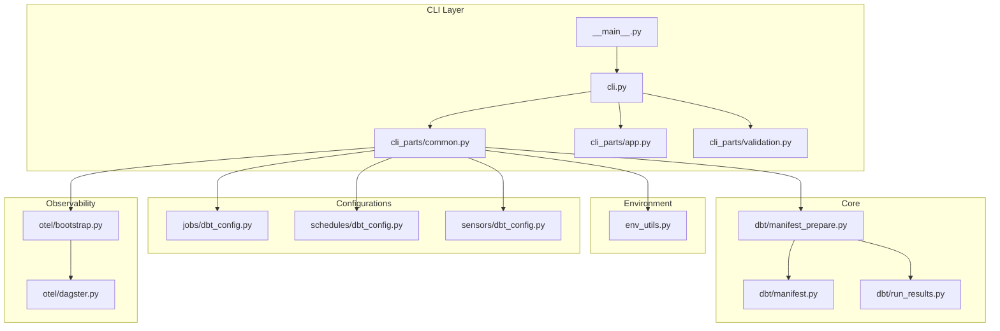
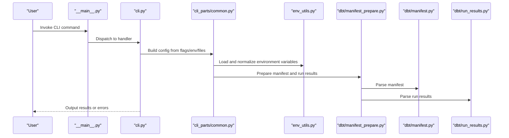
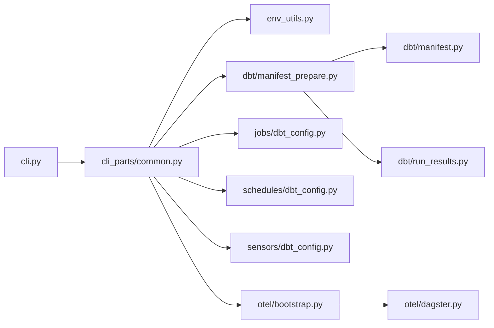

# Configuration Options

<cite>
**Referenced Files in This Document**
- [cli.py](file://src/dbt_dagsterizer/cli.py)
- [__main__.py](file://src/dbt_dagsterizer/__main__.py)
- [common.py](file://src/dbt_dagsterizer/cli_parts/common.py)
- [env_utils.py](file://src/dbt_dagsterizer/env_utils.py)
- [app.py](file://src/dbt_dagsterizer/cli_parts/app.py)
- [validation.py](file://src/dbt_dagsterizer/cli_parts/validation.py)
- [manifest_prepare.py](file://src/dbt_dagsterizer/dbt/manifest_prepare.py)
- [manifest.py](file://src/dbt_dagsterizer/dbt/manifest.py)
- [run_results.py](file://src/dbt_dagsterizer/dbt/run_results.py)
- [dbt_config.py](file://src/dbt_dagsterizer/jobs/dbt_config.py)
- [dbt_config.py](file://src/dbt_dagsterizer/schedules/dbt_config.py)
- [dbt_config.py](file://src/dbt_dagsterizer/sensors/dbt_config.py)
- [bootstrap.py](file://src/dbt_dagsterizer/otel/bootstrap.py)
- [dagster.py](file://src/dbt_dagsterizer/otel/dagster.py)
- [pyproject.toml](file://pyproject.toml)
- [README.md](file://README.md)
</cite>

## Table of Contents
1. [Introduction](#introduction)
2. [Project Structure](#project-structure)
3. [Core Components](#core-components)
4. [Architecture Overview](#architecture-overview)
5. [Detailed Component Analysis](#detailed-component-analysis)
6. [Dependency Analysis](#dependency-analysis)
7. [Performance Considerations](#performance-considerations)
8. [Troubleshooting Guide](#troubleshooting-guide)
9. [Conclusion](#conclusion)
10. [Appendices](#appendices)

## Introduction
This document explains CLI configuration options and environment settings for dbt-dagsterizer. It covers command-line flags, environment variables, configuration file options, environment-specific settings, debug modes, logging configurations, defaults, overrides, precedence, and practical examples for different deployment scenarios. Guidance is included for optimizing CLI performance and configuring advanced features such as OpenTelemetry tracing.

## Project Structure
The CLI and configuration logic is primarily implemented under the CLI parts module and integrated via the main entry point. Environment utilities centralize environment variable handling. Supporting modules provide configuration for jobs, schedules, sensors, and OpenTelemetry.

**Diagram sources**
- [__main__.py](file://src/dbt_dagsterizer/__main__.py)
- [cli.py](file://src/dbt_dagsterizer/cli.py)
- [common.py](file://src/dbt_dagsterizer/cli_parts/common.py)
- [app.py](file://src/dbt_dagsterizer/cli_parts/app.py)
- [validation.py](file://src/dbt_dagsterizer/cli_parts/validation.py)
- [env_utils.py](file://src/dbt_dagsterizer/env_utils.py)
- [manifest_prepare.py](file://src/dbt_dagsterizer/dbt/manifest_prepare.py)
- [manifest.py](file://src/dbt_dagsterizer/dbt/manifest.py)
- [run_results.py](file://src/dbt_dagsterizer/dbt/run_results.py)
- [dbt_config.py](file://src/dbt_dagsterizer/jobs/dbt_config.py)
- [dbt_config.py](file://src/dbt_dagsterizer/schedules/dbt_config.py)
- [dbt_config.py](file://src/dbt_dagsterizer/sensors/dbt_config.py)
- [bootstrap.py](file://src/dbt_dagsterizer/otel/bootstrap.py)
- [dagster.py](file://src/dbt_dagsterizer/otel/dagster.py)

**Section sources**
- [__main__.py](file://src/dbt_dagsterizer/__main__.py)
- [cli.py](file://src/dbt_dagsterizer/cli.py)
- [common.py](file://src/dbt_dagsterizer/cli_parts/common.py)
- [env_utils.py](file://src/dbt_dagsterizer/env_utils.py)

## Core Components
- CLI entry point and commands: The CLI orchestrates subcommands and passes arguments to shared configuration helpers.
- Shared configuration helpers: Provide environment resolution, defaults, and validation for CLI operations.
- Environment utilities: Centralize environment variable loading and normalization.
- Manifest preparation and parsing: Prepare dbt artifacts and parse run results for downstream components.
- Job/Schedule/Sensor configuration: Provide dbt-specific configuration wiring for orchestration units.
- Observability bootstrap: Configure OpenTelemetry integration for tracing.

Key responsibilities:
- Resolve configuration precedence from environment variables, config files, and CLI flags.
- Validate inputs and produce actionable errors.
- Support environment-specific deployments and debug/logging modes.

**Section sources**
- [cli.py](file://src/dbt_dagsterizer/cli.py)
- [common.py](file://src/dbt_dagsterizer/cli_parts/common.py)
- [env_utils.py](file://src/dbt_dagsterizer/env_utils.py)
- [manifest_prepare.py](file://src/dbt_dagsterizer/dbt/manifest_prepare.py)
- [manifest.py](file://src/dbt_dagsterizer/dbt/manifest.py)
- [run_results.py](file://src/dbt_dagsterizer/dbt/run_results.py)
- [dbt_config.py](file://src/dbt_dagsterizer/jobs/dbt_config.py)
- [dbt_config.py](file://src/dbt_dagsterizer/schedules/dbt_config.py)
- [dbt_config.py](file://src/dbt_dagsterizer/sensors/dbt_config.py)
- [bootstrap.py](file://src/dbt_dagsterizer/otel/bootstrap.py)
- [dagster.py](file://src/dbt_dagsterizer/otel/dagster.py)

## Architecture Overview
The CLI reads environment variables and configuration files, validates inputs, prepares dbt artifacts, and wires orchestration components. OpenTelemetry is bootstrapped for distributed tracing.

**Diagram sources**
- [__main__.py](file://src/dbt_dagsterizer/__main__.py)
- [cli.py](file://src/dbt_dagsterizer/cli.py)
- [common.py](file://src/dbt_dagsterizer/cli_parts/common.py)
- [env_utils.py](file://src/dbt_dagsterizer/env_utils.py)
- [manifest_prepare.py](file://src/dbt_dagsterizer/dbt/manifest_prepare.py)
- [manifest.py](file://src/dbt_dagsterizer/dbt/manifest.py)
- [run_results.py](file://src/dbt_dagsterizer/dbt/run_results.py)

## Detailed Component Analysis

### CLI Flags and Subcommands
- Command grouping and dispatch are handled by the CLI entry point and command handlers.
- Shared configuration helpers consolidate environment and file-based options.
- Validation ensures required inputs are present and consistent.

Typical flag categories:
- Target environment selection (e.g., dev, staging, prod)
- Logging and verbosity controls
- Dry-run or preview toggles
- Manifest and run results paths
- Output directories and artifact locations

Operational flow:
- Parse flags and environment variables
- Apply defaults where missing
- Validate inputs and resolve conflicts
- Execute subcommand logic

**Section sources**
- [__main__.py](file://src/dbt_dagsterizer/__main__.py)
- [cli.py](file://src/dbt_dagsterizer/cli.py)
- [common.py](file://src/dbt_dagsterizer/cli_parts/common.py)
- [validation.py](file://src/dbt_dagsterizer/cli_parts/validation.py)

### Environment Variables and Precedence
Environment variables are loaded and normalized centrally. Precedence order:
1. Explicit CLI flags (highest specificity)
2. Environment variables
3. Configuration file values
4. Built-in defaults (lowest specificity)

Common environment variables:
- DAGSTER_HOME: Dagster home directory for configuration and storage
- DBT_PROJECT_DIR: dbt project location
- DBT_PROFILE: dbt profile name
- DBT_TARGET: dbt target/profile target
- DAGSTER_DBT_PROJECT_DIR: Alternative dbt project path for Dagster contexts
- Dagit_LOG_LEVEL: Logging level for Dagit/Dagster UI
- OTEL_EXPORTER_OTLP_ENDPOINT: OpenTelemetry exporter endpoint
- OTEL_SERVICE_NAME: OpenTelemetry service name
- DEBUG: Debug mode toggle for verbose logs and diagnostics

Normalization and validation:
- Environment values are sanitized and type-checked
- Missing required variables raise explicit errors
- Conflicting variables produce actionable warnings or errors

**Section sources**
- [env_utils.py](file://src/dbt_dagsterizer/env_utils.py)
- [common.py](file://src/dbt_dagsterizer/cli_parts/common.py)

### Configuration Files
Configuration is read from project-specific files and merged with environment and CLI inputs. Typical locations and keys:
- Project YAML: Contains dbt project metadata, profiles, and optional overrides
- Profiles YAML: Defines dbt credentials and targets
- Dagster YAML: Dagster runtime configuration (location, storage, etc.)
- Optional per-environment overrides: Allow environment-specific settings

Merging strategy:
- Defaults first, then environment variables, then CLI flags, finally file overrides
- Keys are validated against supported schemas
- Unknown keys produce warnings

**Section sources**
- [manifest_prepare.py](file://src/dbt_dagsterizer/dbt/manifest_prepare.py)
- [manifest.py](file://src/dbt_dagsterizer/dbt/manifest.py)
- [run_results.py](file://src/dbt_dagsterizer/dbt/run_results.py)

### Environment-Specific Settings
- Separate profiles and targets per environment (dev/staging/prod)
- Environment-specific dbt variables and vars files
- Conditional job/schedule/sensor presets per environment
- Kubernetes or container registry overrides for production

Examples:
- Dev: ephemeral datasets, local credentials, lower resource limits
- Staging: near-prod datasets, shared credentials, moderate limits
- Prod: strict permissions, dedicated credentials, high availability settings

**Section sources**
- [dbt_config.py](file://src/dbt_dagsterizer/jobs/dbt_config.py)
- [dbt_config.py](file://src/dbt_dagsterizer/schedules/dbt_config.py)
- [dbt_config.py](file://src/dbt_dagsterizer/sensors/dbt_config.py)

### Debug Modes and Logging Configurations
- Debug flag enables verbose logging and diagnostic output
- Log levels configurable via environment variables and CLI flags
- Structured logs for observability and correlation
- OpenTelemetry tracing enabled when exporter endpoint is set

Best practices:
- Use debug mode during development and CI dry-runs
- Set log levels per environment (e.g., INFO for staging, DEBUG for dev)
- Enable tracing in distributed environments for end-to-end visibility

**Section sources**
- [common.py](file://src/dbt_dagsterizer/cli_parts/common.py)
- [bootstrap.py](file://src/dbt_dagsterizer/otel/bootstrap.py)
- [dagster.py](file://src/dbt_dagsterizer/otel/dagster.py)

### Examples of Configuration Combinations
- Local development:
  - Set DAGSTER_HOME to a local directory
  - Point DBT_PROJECT_DIR to your dbt project
  - Use dev profile and target
  - Enable debug mode and INFO logging
- CI pipeline:
  - Pass credentials via environment variables
  - Use staging profile and target
  - Disable debug mode, set appropriate log level
  - Export run results and manifests for downstream steps
- Production deployment:
  - Use production profile and target
  - Configure OpenTelemetry exporter endpoint and service name
  - Set resource limits and scheduling presets
  - Enable structured logs and tracing

**Section sources**
- [env_utils.py](file://src/dbt_dagsterizer/env_utils.py)
- [common.py](file://src/dbt_dagsterizer/cli_parts/common.py)
- [bootstrap.py](file://src/dbt_dagsterizer/otel/bootstrap.py)

### Advanced Features and Overrides
- Manifest preparation and run results parsing support incremental updates and partial parsing
- Job/schedule/sensor presets allow environment-specific tuning
- OpenTelemetry bootstrap integrates with Dagster’s telemetry pipeline
- Dotenv-style environment loading supports local development overrides

Override mechanisms:
- CLI flags override environment variables
- Environment variables override configuration files
- Configuration files override built-in defaults

**Section sources**
- [manifest_prepare.py](file://src/dbt_dagsterizer/dbt/manifest_prepare.py)
- [run_results.py](file://src/dbt_dagsterizer/dbt/run_results.py)
- [dbt_config.py](file://src/dbt_dagsterizer/jobs/dbt_config.py)
- [dbt_config.py](file://src/dbt_dagsterizer/schedules/dbt_config.py)
- [dbt_config.py](file://src/dbt_dagsterizer/sensors/dbt_config.py)
- [bootstrap.py](file://src/dbt_dagsterizer/otel/bootstrap.py)
- [dagster.py](file://src/dbt_dagsterizer/otel/dagster.py)

## Dependency Analysis
The CLI depends on shared configuration helpers, environment utilities, and dbt artifact preparation. Orchestration components depend on resolved dbt configuration. Observability is bootstrapped early to capture initialization spans.

**Diagram sources**
- [cli.py](file://src/dbt_dagsterizer/cli.py)
- [common.py](file://src/dbt_dagsterizer/cli_parts/common.py)
- [env_utils.py](file://src/dbt_dagsterizer/env_utils.py)
- [manifest_prepare.py](file://src/dbt_dagsterizer/dbt/manifest_prepare.py)
- [manifest.py](file://src/dbt_dagsterizer/dbt/manifest.py)
- [run_results.py](file://src/dbt_dagsterizer/dbt/run_results.py)
- [dbt_config.py](file://src/dbt_dagsterizer/jobs/dbt_config.py)
- [dbt_config.py](file://src/dbt_dagsterizer/schedules/dbt_config.py)
- [dbt_config.py](file://src/dbt_dagsterizer/sensors/dbt_config.py)
- [bootstrap.py](file://src/dbt_dagsterizer/otel/bootstrap.py)
- [dagster.py](file://src/dbt_dagsterizer/otel/dagster.py)

**Section sources**
- [cli.py](file://src/dbt_dagsterizer/cli.py)
- [common.py](file://src/dbt_dagsterizer/cli_parts/common.py)
- [env_utils.py](file://src/dbt_dagsterizer/env_utils.py)
- [manifest_prepare.py](file://src/dbt_dagsterizer/dbt/manifest_prepare.py)
- [manifest.py](file://src/dbt_dagsterizer/dbt/manifest.py)
- [run_results.py](file://src/dbt_dagsterizer/dbt/run_results.py)
- [dbt_config.py](file://src/dbt_dagsterizer/jobs/dbt_config.py)
- [dbt_config.py](file://src/dbt_dagsterizer/schedules/dbt_config.py)
- [dbt_config.py](file://src/dbt_dagsterizer/sensors/dbt_config.py)
- [bootstrap.py](file://src/dbt_dagsterizer/otel/bootstrap.py)
- [dagster.py](file://src/dbt_dagsterizer/otel/dagster.py)

## Performance Considerations
- Prefer environment variables for CI to avoid repeated file IO.
- Use dry-run flags to validate configuration without executing heavy tasks.
- Limit log verbosity in production to reduce overhead.
- Enable OpenTelemetry only when needed to minimize tracing overhead.
- Cache prepared manifests and reuse across runs where safe.

[No sources needed since this section provides general guidance]

## Troubleshooting Guide
Common issues and resolutions:
- Missing environment variables:
  - Ensure required variables are set for the selected environment.
  - Use dotenv-style loading for local development.
- Invalid configuration files:
  - Validate YAML syntax and keys against supported schemas.
  - Check for conflicting or unknown keys.
- CLI flag conflicts:
  - Verify precedence and resolve conflicts by adjusting flags or environment variables.
- Manifest parsing failures:
  - Confirm dbt project dir and target are correct.
  - Rebuild manifests if stale or corrupted.
- Tracing issues:
  - Verify OpenTelemetry exporter endpoint and service name.
  - Check network connectivity and credentials.

**Section sources**
- [env_utils.py](file://src/dbt_dagsterizer/env_utils.py)
- [common.py](file://src/dbt_dagsterizer/cli_parts/common.py)
- [validation.py](file://src/dbt_dagsterizer/cli_parts/validation.py)
- [manifest_prepare.py](file://src/dbt_dagsterizer/dbt/manifest_prepare.py)
- [bootstrap.py](file://src/dbt_dagsterizer/otel/bootstrap.py)

## Conclusion
dbt-dagsterizer’s configuration model centers on a clear precedence hierarchy: CLI flags > environment variables > configuration files > defaults. Environment-specific settings, robust validation, and observability integration enable reliable operation across development, CI, and production. Following the guidance here will help you configure, troubleshoot, and optimize your deployments effectively.

[No sources needed since this section summarizes without analyzing specific files]

## Appendices

### Appendix A: Default Values and Precedence Summary
- Precedence order: CLI flags → Environment variables → Configuration files → Built-in defaults
- Defaults are applied when no higher-precedence value exists
- Validation errors are surfaced early to prevent misconfiguration

**Section sources**
- [common.py](file://src/dbt_dagsterizer/cli_parts/common.py)
- [validation.py](file://src/dbt_dagsterizer/cli_parts/validation.py)

### Appendix B: Environment Variable Reference
- DAGSTER_HOME: Dagster home directory
- DBT_PROJECT_DIR: dbt project location
- DBT_PROFILE: dbt profile name
- DBT_TARGET: dbt target/profile target
- Dagit log level: Controls Dagit/Dagster UI logging
- OTEL_EXPORTER_OTLP_ENDPOINT: OpenTelemetry exporter endpoint
- OTEL_SERVICE_NAME: OpenTelemetry service name
- DEBUG: Enables debug mode

**Section sources**
- [env_utils.py](file://src/dbt_dagsterizer/env_utils.py)
- [bootstrap.py](file://src/dbt_dagsterizer/otel/bootstrap.py)

### Appendix C: Configuration File Locations
- Project YAML: dbt project configuration and optional overrides
- Profiles YAML: dbt credentials and targets
- Dagster YAML: Dagster runtime configuration
- Optional environment overrides: Per-environment settings

**Section sources**
- [manifest_prepare.py](file://src/dbt_dagsterizer/dbt/manifest_prepare.py)
- [manifest.py](file://src/dbt_dagsterizer/dbt/manifest.py)
- [run_results.py](file://src/dbt_dagsterizer/dbt/run_results.py)