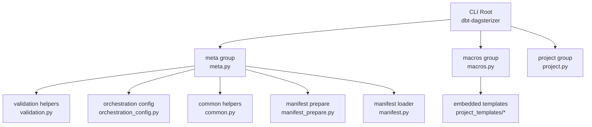
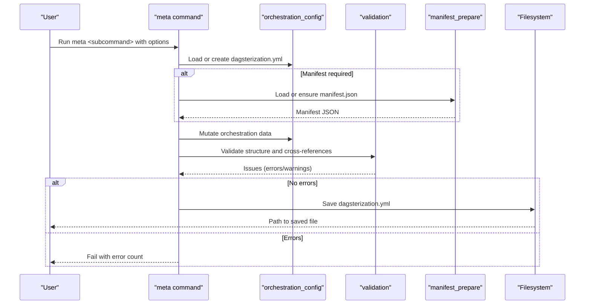
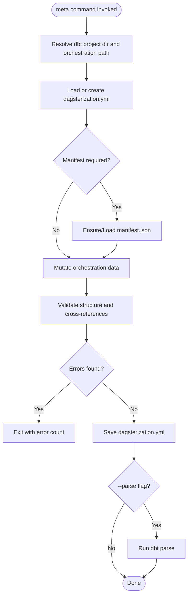
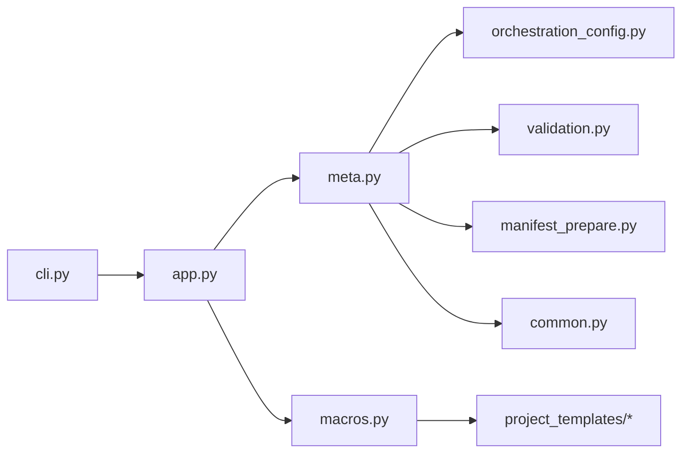

# Meta Commands

<cite>
**Referenced Files in This Document**
- [cli.py](file://src/dbt_dagsterizer/cli.py)
- [app.py](file://src/dbt_dagsterizer/cli_parts/app.py)
- [meta.py](file://src/dbt_dagsterizer/cli_parts/meta.py)
- [macros.py](file://src/dbt_dagsterizer/cli_parts/macros.py)
- [common.py](file://src/dbt_dagsterizer/cli_parts/common.py)
- [validation.py](file://src/dbt_dagsterizer/cli_parts/validation.py)
- [orchestration_config.py](file://src/dbt_dagsterizer/orchestration_config.py)
- [manifest_prepare.py](file://src/dbt_dagsterizer/dbt/manifest_prepare.py)
- [manifest.py](file://src/dbt_dagsterizer/dbt/manifest.py)
- [cli.md](file://docs/concepts/cli.md)
- [README.md](file://README.md)
- [test_cli_meta_generation.py](file://tests/test_cli_meta_generation.py)
- [test_cli_schema_yml_update.py](file://tests/test_cli_schema_yml_update.py)
</cite>

## Table of Contents
1. [Introduction](#introduction)
2. [Project Structure](#project-structure)
3. [Core Components](#core-components)
4. [Architecture Overview](#architecture-overview)
5. [Detailed Component Analysis](#detailed-component-analysis)
6. [Dependency Analysis](#dependency-analysis)
7. [Performance Considerations](#performance-considerations)
8. [Troubleshooting Guide](#troubleshooting-guide)
9. [Conclusion](#conclusion)
10. [Appendices](#appendices)

## Introduction
This document explains the meta-related CLI commands in dbt-dagsterizer. These commands enable you to extract and process dbt manifest information, manage orchestration intent in a dedicated YAML file, and integrate with dbt parsing and validation. The meta commands focus on:
- Initializing and validating orchestration configuration
- Creating and updating grouped jobs, asset jobs, schedules, and partitioning
- Managing partition-change detectors and propagators
- Integrating with dbt manifest parsing and validation

The documentation covers command usage, parameters, output formats, and practical examples for project maintenance and metadata refresh operations.

## Project Structure
The CLI is organized around a Click-based application that exposes three primary groups:
- meta: orchestration configuration management
- macros: macro template synchronization
- project: project scaffolding and GitOps environment generation

**Diagram sources**
- [app.py:19-28](file://src/dbt_dagsterizer/cli_parts/app.py#L19-L28)
- [meta.py:56-626](file://src/dbt_dagsterizer/cli_parts/meta.py#L56-L626)
- [macros.py:67-83](file://src/dbt_dagsterizer/cli_parts/macros.py#L67-L83)
- [validation.py:22-310](file://src/dbt_dagsterizer/cli_parts/validation.py#L22-L310)
- [orchestration_config.py:23-370](file://src/dbt_dagsterizer/orchestration_config.py#L23-L370)
- [manifest_prepare.py:30-72](file://src/dbt_dagsterizer/dbt/manifest_prepare.py#L30-L72)
- [manifest.py:28-93](file://src/dbt_dagsterizer/dbt/manifest.py#L28-L93)

**Section sources**
- [app.py:19-28](file://src/dbt_dagsterizer/cli_parts/app.py#L19-L28)
- [cli.py:3-6](file://src/dbt_dagsterizer/cli.py#L3-L6)

## Core Components
- meta group: orchestrates creation/update of jobs, asset jobs, schedules, partitions, and partition-change detectors/propagators; validates configuration against the dbt manifest.
- macros group: synchronizes managed macro templates into a dbt project.
- orchestration_config: defines the YAML schema, loading/writing, and mutation helpers for the orchestration file.
- validation: validates structure and cross-references between the orchestration file and the dbt manifest.
- manifest_prepare and manifest: handle dbt manifest parsing and model metadata extraction.

Key outputs:
- The orchestration file (default: dbt_project/dagsterization.yml) is updated atomically after validation passes.
- Optional dbt parse invocation updates target/manifest.json to reflect recent changes.

**Section sources**
- [meta.py:56-626](file://src/dbt_dagsterizer/cli_parts/meta.py#L56-L626)
- [orchestration_config.py:23-83](file://src/dbt_dagsterizer/orchestration_config.py#L23-L83)
- [validation.py:22-310](file://src/dbt_dagsterizer/cli_parts/validation.py#L22-L310)
- [manifest_prepare.py:30-72](file://src/dbt_dagsterizer/dbt/manifest_prepare.py#L30-L72)

## Architecture Overview
The meta commands follow a consistent flow:
- Resolve dbt project directory and orchestration file path
- Optionally load or create the orchestration file
- Optionally load the dbt manifest (via parse or cached)
- Apply mutations to the orchestration data
- Validate structure and cross-references
- Persist the orchestration file

**Diagram sources**
- [meta.py:66-136](file://src/dbt_dagsterizer/cli_parts/meta.py#L66-L136)
- [validation.py:275-310](file://src/dbt_dagsterizer/cli_parts/validation.py#L275-L310)
- [manifest_prepare.py:64-72](file://src/dbt_dagsterizer/dbt/manifest_prepare.py#L64-L72)
- [orchestration_config.py:23-83](file://src/dbt_dagsterizer/orchestration_config.py#L23-L83)

## Detailed Component Analysis

### Meta Group: Orchestration Management
The meta group provides commands to initialize, update, and validate orchestration configuration. It integrates with dbt manifest parsing and validation.

- meta init
  - Purpose: Initialize the orchestration file if it does not exist.
  - Options:
    - --dbt-project-dir: dbt project directory (default ./dbt_project)
    - --path: orchestration file path (default dagsterization.yml)
    - --force: overwrite existing file
    - --parse: run dbt parse after writing
  - Behavior: Creates default orchestration structure and optionally parses dbt manifest.

- meta job
  - Purpose: Create or update a grouped job with selected models.
  - Selection:
    - --models: comma-separated model names
    - --tag: select models by existing dbt tag (requires manifest)
  - Options:
    - --name: job name
    - --include-upstream: include upstream models
    - --partitions: daily|unpartitioned|none
    - --prepare: prepare manifest when using --tag
    - --parse: run dbt parse after writing
  - Behavior: Updates jobs mapping and partitions; sets per-model partitions when applicable.

- meta job-delete
  - Purpose: Delete a grouped job by name.
  - Options:
    - --name: job name
    - --force: remove references from schedules/propagators
    - --prepare: prepare manifest
    - --parse: run dbt parse after writing
  - Behavior: Removes job and cleans up references unless forced.

- meta partition
  - Purpose: Set partitioning for selected models.
  - Options:
    - --type: daily|unpartitioned
    - --prepare: prepare manifest
    - --parse: run dbt parse after writing
  - Behavior: Updates partitions mapping for selected models.

- meta asset-job
  - Purpose: Enable per-model asset jobs for selected models.
  - Options:
    - --prepare: prepare manifest
    - --parse: run dbt parse after writing
  - Behavior: Adds models to asset_jobs list.

- meta asset-job-delete
  - Purpose: Disable per-model asset jobs for selected models.
  - Options:
    - --force: remove referencing schedules
    - --prepare: prepare manifest
    - --parse: run dbt parse after writing
  - Behavior: Removes models from asset_jobs list and cleans up schedules if forced.

- meta schedule
  - Purpose: Create or update a schedule for selected models.
  - Options:
    - --name: schedule name
    - --hour/--minute: time of day
    - --lookback-days/--offset-days: partition windowing
    - --enabled: enable/disable
    - --prepare: prepare manifest
    - --parse: run dbt parse after writing
  - Behavior: Derives job name (asset job or existing job) and creates daily_at schedule.

- meta partition-change detector
  - Purpose: Configure a partition-change detector for a model.
  - Options:
    - --model: model name
    - --enabled/--disabled
    - --name/--job-name
    - --detect-relation or --detect-source (exactly one)
    - --partition-date-expr/--updated-at-expr
    - --lookback-days/--offset-days
    - --minimum-interval-seconds
    - --prepare: prepare manifest
    - --parse: run dbt parse after writing
  - Behavior: Adds or updates detector entry for the model.

- meta partition-change propagator
  - Purpose: Configure a partition-change propagator for a model.
  - Options:
    - --model: upstream model
    - --enabled/--disabled
    - --name
    - --minimum-interval-seconds
    - --targets: comma-separated job names
    - --prepare: prepare manifest
    - --parse: run dbt parse after writing
  - Behavior: Adds or updates propagator entry with targets.

- meta validate
  - Purpose: Validate the orchestration file against the dbt manifest.
  - Options:
    - --prepare: prepare manifest if missing/stale
  - Behavior: Loads manifest and validates structure and cross-references; prints warnings/errors and exits with failure if errors exist.

**Diagram sources**
- [meta.py:66-136](file://src/dbt_dagsterizer/cli_parts/meta.py#L66-L136)
- [validation.py:275-310](file://src/dbt_dagsterizer/cli_parts/validation.py#L275-L310)
- [manifest_prepare.py:64-72](file://src/dbt_dagsterizer/dbt/manifest_prepare.py#L64-L72)

**Section sources**
- [meta.py:61-626](file://src/dbt_dagsterizer/cli_parts/meta.py#L61-L626)
- [validation.py:22-310](file://src/dbt_dagsterizer/cli_parts/validation.py#L22-L310)
- [orchestration_config.py:112-370](file://src/dbt_dagsterizer/orchestration_config.py#L112-L370)
- [manifest_prepare.py:30-72](file://src/dbt_dagsterizer/dbt/manifest_prepare.py#L30-L72)

### Macros Group: Template Synchronization
The macros group synchronizes managed macro templates into a dbt project’s macros directory.

- macros sync
  - Purpose: Sync macro templates into dbt_project/macros/dbt_dagsterizer/.
  - Options:
    - --dbt-project-dir: dbt project directory (default ./dbt_project)
    - --force: overwrite existing files
  - Behavior: Resolves template name from environment or marker file; copies SQL files into macros directory.

Template resolution:
- Uses DBT_DAGSTERIZER_TEMPLATE environment variable if set.
- Otherwise reads dbt_project/.dbt_dagsterizer_template to determine template name.
- Falls back to default template name if neither is available.

**Section sources**
- [macros.py:28-83](file://src/dbt_dagsterizer/cli_parts/macros.py#L28-L83)

### Orchestration Schema and Indexing
The orchestration file follows a structured schema with defaults. The indexing helpers compute derived relationships used by scheduling and validation.

Key schema elements:
- version: integer
- jobs: mapping of job_name -> {models: list, include_upstream: bool, partitions?: daily|unpartitioned}
- asset_jobs: list of model names
- partitions: mapping of daily|unpartitioned -> list of model names
- schedules: mapping of schedule_name -> {type: daily_at, job_name, hour, minute, lookback_days, offset_days, enabled}
- partition_change: {detectors: list, propagators: list}

Indexing:
- Partitions by model
- Asset job models
- Group job by model

Derivation:
- Derived job names for models with asset jobs or group jobs

**Section sources**
- [orchestration_config.py:23-83](file://src/dbt_dagsterizer/orchestration_config.py#L23-L83)
- [orchestration_config.py:112-158](file://src/dbt_dagsterizer/orchestration_config.py#L112-L158)
- [orchestration_config.py:360-370](file://src/dbt_dagsterizer/orchestration_config.py#L360-L370)

### Validation and Cross-References
Validation ensures:
- Models referenced in asset_jobs, partitions, jobs, schedules, and partition-change entries exist in the manifest.
- Types and constraints are respected (e.g., partitions must be daily|unpartitioned, schedules must be daily_at).
- Schedules reference valid job names (derived or explicit).
- Partition-change detectors and propagators meet required constraints.

Structure validation:
- Ensures top-level mappings/lists are present and typed correctly.

Manifest-driven validation:
- Requires manifest loading when validating cross-references.

**Section sources**
- [validation.py:22-199](file://src/dbt_dagsterizer/cli_parts/validation.py#L22-L199)
- [validation.py:202-272](file://src/dbt_dagsterizer/cli_parts/validation.py#L202-L272)
- [validation.py:275-310](file://src/dbt_dagsterizer/cli_parts/validation.py#L275-L310)

### Manifest Preparation and Model Metadata
Manifest preparation:
- Ensures target/manifest.json exists by running dbt parse when needed.
- Writes sidecar inputs to detect when refresh is required.

Model metadata extraction:
- Iterates manifest nodes to produce DbtModel records with name, tags, meta, and identifiers.
- Provides helpers to extract Luban-specific metadata (partition, asset_job).

**Section sources**
- [manifest_prepare.py:30-72](file://src/dbt_dagsterizer/dbt/manifest_prepare.py#L30-L72)
- [manifest.py:28-93](file://src/dbt_dagsterizer/dbt/manifest.py#L28-L93)

## Dependency Analysis
The meta commands depend on orchestration_config for YAML manipulation, validation for correctness checks, and manifest preparation for dbt manifest access. The macros group depends on embedded templates packaged with the library.

**Diagram sources**
- [meta.py:8-49](file://src/dbt_dagsterizer/cli_parts/meta.py#L8-L49)
- [macros.py:15-25](file://src/dbt_dagsterizer/cli_parts/macros.py#L15-L25)
- [app.py:7-9](file://src/dbt_dagsterizer/cli_parts/app.py#L7-L9)
- [cli.py:3-6](file://src/dbt_dagsterizer/cli.py#L3-L6)

**Section sources**
- [meta.py:8-49](file://src/dbt_dagsterizer/cli_parts/meta.py#L8-L49)
- [macros.py:15-25](file://src/dbt_dagsterizer/cli_parts/macros.py#L15-L25)
- [app.py:7-9](file://src/dbt_dagsterizer/cli_parts/app.py#L7-L9)
- [cli.py:3-6](file://src/dbt_dagsterizer/cli.py#L3-L6)

## Performance Considerations
- Manifest refresh: Running dbt parse can be expensive. Use --prepare only when necessary (e.g., when selecting by tag or validating cross-references).
- Batch operations: Prefer specifying models via --models when possible to limit validation scope.
- Force vs. incremental updates: Use --force cautiously; prefer targeted updates to reduce unnecessary writes.

[No sources needed since this section provides general guidance]

## Troubleshooting Guide
Common issues and resolutions:
- Manifest not found or stale:
  - Use --prepare to refresh target/manifest.json before validation.
- No models selected:
  - Provide --models or --tag; note that --tag requires manifest.
- Validation failures:
  - Review printed warnings/errors; fix invalid references or types.
- Deleting jobs or asset jobs with references:
  - Use --force to remove referencing schedules/propagators when appropriate.
- Partition-change constraints:
  - Ensure exactly one of --detect-relation or --detect-source is set.
  - Verify partition-date and updated-at expressions are non-empty.

**Section sources**
- [meta.py:113-114](file://src/dbt_dagsterizer/cli_parts/meta.py#L113-L114)
- [meta.py:183-191](file://src/dbt_dagsterizer/cli_parts/meta.py#L183-L191)
- [validation.py:132-138](file://src/dbt_dagsterizer/cli_parts/validation.py#L132-L138)
- [meta.py:594-597](file://src/dbt_dagsterizer/cli_parts/meta.py#L594-L597)

## Conclusion
The meta commands provide a robust, manifest-aware workflow for maintaining orchestration intent in dbt-dagsterizer projects. They support initialization, updates, and validation of jobs, asset jobs, schedules, partitions, and partition-change detectors/propagators. Combined with macros synchronization and project scaffolding, they streamline project maintenance and metadata refresh operations.

[No sources needed since this section summarizes without analyzing specific files]

## Appendices

### Command Reference and Examples
- Initialization and validation
  - Initialize orchestration file and parse manifest:
    - dbt-dagsterizer meta init --parse
  - Validate with manifest refresh:
    - dbt-dagsterizer meta validate --prepare

- Job management
  - Create grouped job with upstream inclusion and daily partitions:
    - dbt-dagsterizer meta job --models fact_orders_daily,fact_customer_orders_daily --name daily_facts --include-upstream --partitions daily
  - Delete a grouped job and clean references:
    - dbt-dagsterizer meta job-delete --name daily_facts --force

- Asset jobs
  - Enable per-model asset job:
    - dbt-dagsterizer meta asset-job --models orders
  - Disable per-model asset job and remove schedules:
    - dbt-dagsterizer meta asset-job-delete --models orders --force

- Scheduling
  - Create daily schedule with lookback and offset:
    - dbt-dagsterizer meta schedule --models orders --name orders_daily --hour 2 --minute 0 --lookback-days 3 --offset-days 1 --enabled

- Partitioning
  - Set daily partitioning for models:
    - dbt-dagsterizer meta partition --models fact_orders_daily,fact_customer_orders_daily --type daily

- Partition-change detectors and propagators
  - Add detector using source:
    - dbt-dagsterizer meta partition-change detector --model orders --enabled --detect-source ods.orders --partition-date-expr order_date --updated-at-expr updated_at --lookback-days 7 --offset-days 1
  - Add propagator targeting a job:
    - dbt-dagsterizer meta partition-change propagator --model orders --enabled --targets daily_facts

- Macro synchronization
  - Sync managed macros into dbt project:
    - dbt-dagsterizer macros sync
  - Overwrite existing macro files:
    - dbt-dagsterizer macros sync --force

Integration tips:
- Use --parse after updates to ensure dbt manifest reflects changes.
- Combine meta validate --prepare in CI to catch configuration errors early.

**Section sources**
- [cli.md:119-310](file://docs/concepts/cli.md#L119-L310)
- [test_cli_meta_generation.py:17-196](file://tests/test_cli_meta_generation.py#L17-L196)
- [test_cli_schema_yml_update.py:17-48](file://tests/test_cli_schema_yml_update.py#L17-L48)