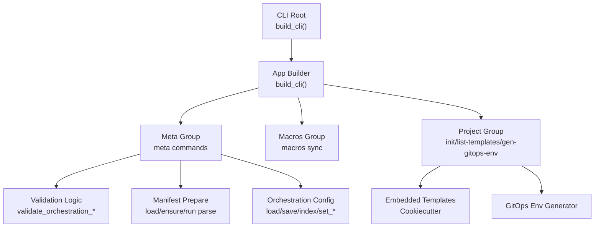
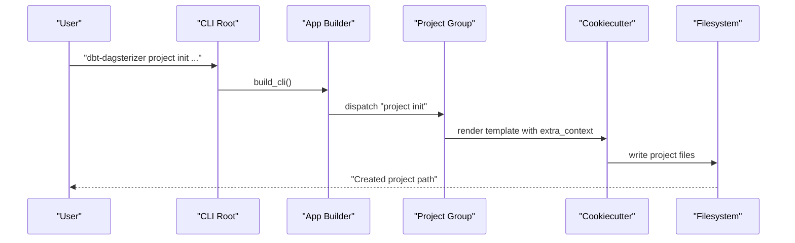
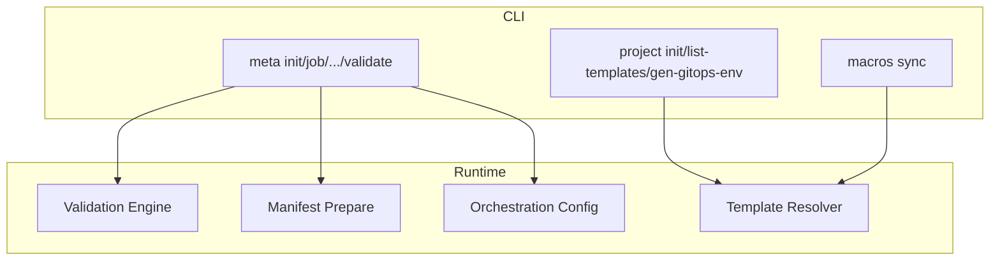
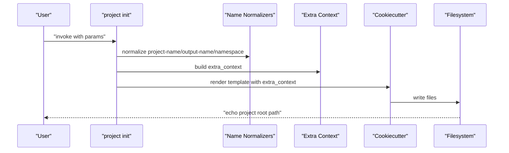
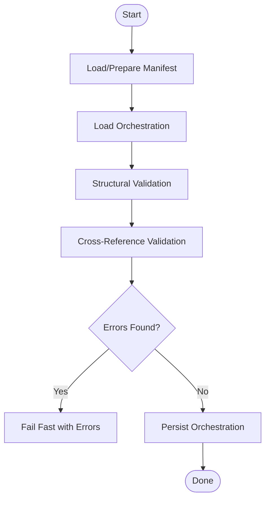
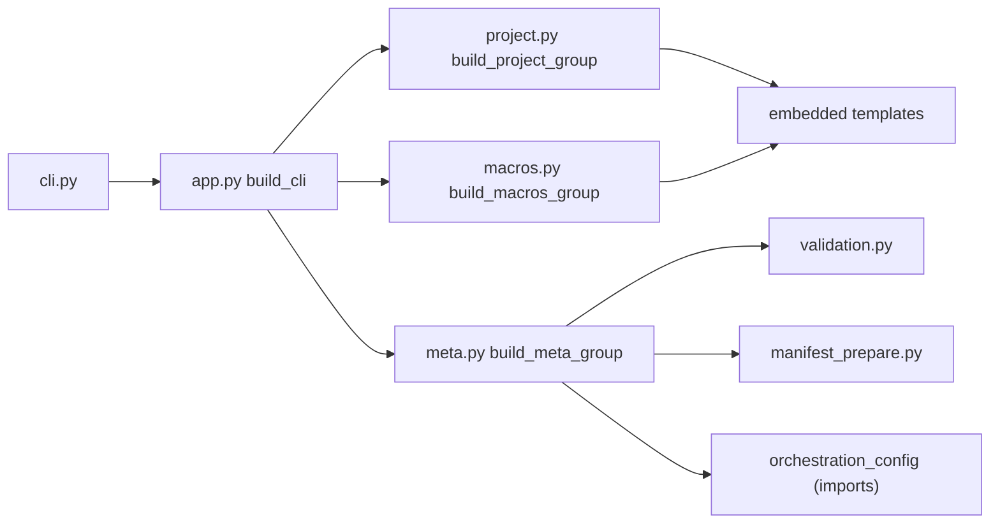

# Project Commands

<cite>
**Referenced Files in This Document**
- [cli.py](file://src/dbt_dagsterizer/cli.py)
- [app.py](file://src/dbt_dagsterizer/cli_parts/app.py)
- [project.py](file://src/dbt_dagsterizer/cli_parts/project.py)
- [meta.py](file://src/dbt_dagsterizer/cli_parts/meta.py)
- [validation.py](file://src/dbt_dagsterizer/cli_parts/validation.py)
- [macros.py](file://src/dbt_dagsterizer/cli_parts/macros.py)
- [common.py](file://src/dbt_dagsterizer/cli_parts/common.py)
- [manifest_prepare.py](file://src/dbt_dagsterizer/dbt/manifest_prepare.py)
- [manifest_inputs.py](file://src/dbt_dagsterizer/manifest_inputs.py)
</cite>

## Table of Contents
1. [Introduction](#introduction)
2. [Project Structure](#project-structure)
3. [Core Components](#core-components)
4. [Architecture Overview](#architecture-overview)
5. [Detailed Component Analysis](#detailed-component-analysis)
6. [Dependency Analysis](#dependency-analysis)
7. [Performance Considerations](#performance-considerations)
8. [Troubleshooting Guide](#troubleshooting-guide)
9. [Conclusion](#conclusion)

## Introduction
This document describes the project-related CLI commands in dbt-dagsterizer with a focus on:
- Project initialization: template selection, parameter configuration, environment setup
- Project validation: manifest checking, dependency verification, configuration validation
- Project maintenance: updating definitions, refreshing metadata, syncing macros

It provides practical examples, parameter combinations, error handling, and troubleshooting guidance for common setup issues.

## Project Structure
The CLI is organized into cohesive groups:
- project: project scaffolding and GitOps environment generation
- meta: orchestration maintenance and validation
- macros: macro synchronization against templates
- app: top-level CLI assembly and versioning

**Diagram sources**
- [app.py:19-28](file://src/dbt_dagsterizer/cli_parts/app.py#L19-L28)
- [cli.py:3-5](file://src/dbt_dagsterizer/cli.py#L3-L5)
- [project.py:106-306](file://src/dbt_dagsterizer/cli_parts/project.py#L106-L306)
- [meta.py:56-626](file://src/dbt_dagsterizer/cli_parts/meta.py#L56-L626)
- [validation.py:22-310](file://src/dbt_dagsterizer/cli_parts/validation.py#L22-L310)
- [manifest_prepare.py:30-71](file://src/dbt_dagsterizer/dbt/manifest_prepare.py#L30-L71)

**Section sources**
- [cli.py:1-7](file://src/dbt_dagsterizer/cli.py#L1-L7)
- [app.py:19-28](file://src/dbt_dagsterizer/cli_parts/app.py#L19-L28)

## Core Components
- Project group: initializes projects from embedded templates, lists available templates, and generates GitOps environments.
- Meta group: maintains orchestration definitions (jobs, asset jobs, schedules, partition change detectors/propagators), validates configurations, and supports parsing.
- Macros group: synchronizes dbt macros from the template into a project.
- Validation helpers: validate structure and cross-references against the dbt manifest.

Key responsibilities:
- Template-driven scaffolding with normalized identifiers and optional Docker/sample inclusion
- Manifest-aware validation ensuring referenced models exist and config shapes are correct
- Safe updates to orchestration files with optional dbt parse after changes

**Section sources**
- [project.py:106-306](file://src/dbt_dagsterizer/cli_parts/project.py#L106-L306)
- [meta.py:56-626](file://src/dbt_dagsterizer/cli_parts/meta.py#L56-L626)
- [validation.py:22-310](file://src/dbt_dagsterizer/cli_parts/validation.py#L22-L310)
- [macros.py:67-84](file://src/dbt_dagsterizer/cli_parts/macros.py#L67-L84)

## Architecture Overview
The CLI composes subcommands via Click groups. Project initialization uses Cookiecutter with embedded templates. Validation integrates with dbt manifest loading and orchestration configuration persistence.

**Diagram sources**
- [cli.py:3-5](file://src/dbt_dagsterizer/cli.py#L3-L5)
- [app.py:19-28](file://src/dbt_dagsterizer/cli_parts/app.py#L19-L28)
- [project.py:168-260](file://src/dbt_dagsterizer/cli_parts/project.py#L168-L260)

## Detailed Component Analysis

### Project Initialization: project init
Purpose:
- Scaffold a new project from an embedded template with normalized identifiers and optional extras.

Key parameters:
- --template: template name (defaults to a specific embedded template)
- --output-dir: destination directory for the generated project
- --force: overwrite existing output directory
- --project-name/--name: human-friendly app name (normalized to Python identifier)
- --output-name: output directory name (normalized; defaults from project-name)
- --namespace: optional namespace for OTEL and database prefixes
- --dagster-version: pins Dagster version in the generated project
- --dbt-dagsterizer-version: pins dbt-dagsterizer in the generated project
- --no-pin-dbt-dagsterizer: do not pin dbt-dagsterizer (mutually exclusive with the version flag)
- --default-env: default environment label
- --code-location-port: port for code location server
- --include-sample-dbt-project: include a sample dbt project
- --include-docker: include Docker assets
- --author-name, --author-email: author metadata
- --python-index-url, --python-index-name: Python index configuration

Behavior highlights:
- Validates inputs (non-empty names, mutually exclusive pinning flags)
- Normalizes identifiers according to strict rules
- Resolves output directory and enforces --force when needed
- Renders template via Cookiecutter with an extra context containing all parameters
- Echoes the final project path

Common use cases:
- Initialize a new project with defaults
- Pin specific versions for reproducibility
- Include Docker and sample dbt project for local iteration

Practical examples:
- Initialize with defaults: project init --project-name "My Project" --output-name "my-proj"
- Pin versions: project init --project-name "My Project" --dagster-version 1.12.19 --dbt-dagsterizer-version 0.1.0
- Include Docker and sample: project init --project-name "My Project" --include-docker --include-sample-dbt-project

Error handling:
- Missing cookiecutter dependency raises a clear error
- Mutually exclusive flags produce a ClickException
- Non-empty validation for names and versions
- Existing output directory without --force triggers an error with guidance

**Section sources**
- [project.py:115-164](file://src/dbt_dagsterizer/cli_parts/project.py#L115-L164)
- [project.py:168-260](file://src/dbt_dagsterizer/cli_parts/project.py#L168-L260)
- [project.py:28-84](file://src/dbt_dagsterizer/cli_parts/project.py#L28-L84)

### List Embedded Templates: project list-templates
Purpose:
- Enumerate available embedded project templates.

Usage:
- dbt-dagsterizer project list-templates

Behavior:
- Reads the embedded templates directory and prints names

**Section sources**
- [project.py:111-114](file://src/dbt_dagsterizer/cli_parts/project.py#L111-L114)
- [project.py:87-94](file://src/dbt_dagsterizer/cli_parts/project.py#L87-L94)

### Generate GitOps Environment: project gen-gitops-env
Purpose:
- Generate a GitOps-configured environment from a project’s .env and dbt project.

Parameters:
- --project-dir: project root (default current working directory)
- --env-file: path to .env (default .env)
- --output-dir: output directory for GitOps config (default .gitops-env)
- --dagster-home: value written as DAGSTER_HOME in generated ConfigMap
- --overwrite: overwrite existing output directory
- --update-gitignore: whether to update .gitignore with output directory

Behavior:
- Validates inputs and handles file existence and value errors
- Generates GitOps environment artifacts

Common use cases:
- CI/CD environment provisioning
- Separating runtime DAGSTER_HOME from local .env

**Section sources**
- [project.py:262-305](file://src/dbt_dagsterizer/cli_parts/project.py#L262-L305)

### Project Validation: meta validate
Purpose:
- Validate orchestration configuration against the dbt manifest.

Parameters:
- --dbt-project-dir: dbt project root
- --path: path to orchestration file (default dagsterization.yml)
- --prepare: run dbt parse to ensure manifest exists

Behavior:
- Loads manifest (optionally preparing it)
- Loads orchestration file
- Runs structural and cross-reference validations
- Emits warnings and errors; fails fast on errors

Common use cases:
- Pre-flight checks before deployment
- Detecting missing models or invalid schedule/job references

**Section sources**
- [meta.py:584-625](file://src/dbt_dagsterizer/cli_parts/meta.py#L584-L625)
- [validation.py:22-199](file://src/dbt_dagsterizer/cli_parts/validation.py#L22-L199)
- [validation.py:275-310](file://src/dbt_dagsterizer/cli_parts/validation.py#L275-L310)

### Maintenance Commands: meta group
Overview:
- Manage orchestration definitions: jobs, asset jobs, schedules, partition change detectors and propagators
- Validate configurations
- Optionally parse dbt after changes

Key commands:
- meta init: initialize and validate orchestration file
- meta job: define or update a grouped job
- meta job-delete: remove a job and clean up references
- meta partition: set partition type for models
- meta asset-job / meta asset-job-delete: enable/disable asset jobs
- meta schedule: create or update a daily schedule
- meta partition-change detector / meta partition-change propagator: configure partition change detection and propagation
- meta validate: structural and manifest-aware validation

Parameters and behaviors:
- Select models by name or tag; tag selection requires manifest
- Partition types: daily, unpartitioned, none
- Schedules: hourly/minute bounds validated; lookback/offset days validated
- Partition change: exactly one of detect_relation or detect_source; targets as comma-separated job names
- Optional --prepare and --parse to refresh manifest and run dbt parse

Common use cases:
- Define a daily job for a set of models
- Enable asset jobs for downstream sensors
- Configure partition change detectors for incremental models
- Clean up stale jobs and references

**Section sources**
- [meta.py:61-79](file://src/dbt_dagsterizer/cli_parts/meta.py#L61-L79)
- [meta.py:81-136](file://src/dbt_dagsterizer/cli_parts/meta.py#L81-L136)
- [meta.py:138-219](file://src/dbt_dagsterizer/cli_parts/meta.py#L138-L219)
- [meta.py:221-262](file://src/dbt_dagsterizer/cli_parts/meta.py#L221-L262)
- [meta.py:264-299](file://src/dbt_dagsterizer/cli_parts/meta.py#L264-L299)
- [meta.py:301-356](file://src/dbt_dagsterizer/cli_parts/meta.py#L301-L356)
- [meta.py:358-431](file://src/dbt_dagsterizer/cli_parts/meta.py#L358-L431)
- [meta.py:437-512](file://src/dbt_dagsterizer/cli_parts/meta.py#L437-L512)
- [meta.py:551-582](file://src/dbt_dagsterizer/cli_parts/meta.py#L551-L582)
- [meta.py:584-625](file://src/dbt_dagsterizer/cli_parts/meta.py#L584-L625)

### Macro Synchronization: macros sync
Purpose:
- Sync dbt macros from the template into a project’s macros directory.

Parameters:
- --dbt-project-dir: dbt project root
- --force: overwrite existing macro files

Behavior:
- Resolves template name from environment override or template marker
- Copies macro SQL files from the template into the project’s macros directory
- Counts synced files

Common use cases:
- Keep macros aligned with the template after project initialization
- Update macros after template upgrades

**Section sources**
- [macros.py:67-84](file://src/dbt_dagsterizer/cli_parts/macros.py#L67-L84)
- [macros.py:28-50](file://src/dbt_dagsterizer/cli_parts/macros.py#L28-L50)
- [macros.py:53-64](file://src/dbt_dagsterizer/cli_parts/macros.py#L53-L64)

### Validation Internals
Structure validation:
- Ensures top-level keys and nested mappings are present and typed correctly
- Validates partition types and job/schedule shapes

Cross-reference validation:
- Checks that referenced models exist in the manifest
- Validates partition types per model
- Validates schedules’ job references and time bounds
- Validates partition change detectors and propagators for presence and correctness

Manifest-aware saving:
- Optionally prepares manifest before validating
- Aggregates warnings and errors, failing fast on errors

**Section sources**
- [validation.py:22-199](file://src/dbt_dagsterizer/cli_parts/validation.py#L22-L199)
- [validation.py:202-272](file://src/dbt_dagsterizer/cli_parts/validation.py#L202-L272)
- [validation.py:275-310](file://src/dbt_dagsterizer/cli_parts/validation.py#L275-L310)

### Manifest Preparation and Refresh Logic
- Manifest path resolution under dbt project target/
- Conditional dbt deps and parse execution
- Writing manifest inputs for refresh decisions
- Loading manifest with optional preparation

Common use cases:
- Ensuring a fresh manifest before validation or definition updates
- Determining whether a refresh is needed based on environment and inputs

**Section sources**
- [manifest_prepare.py:18-71](file://src/dbt_dagsterizer/dbt/manifest_prepare.py#L18-L71)
- [manifest_inputs.py:43-81](file://src/dbt_dagsterizer/manifest_inputs.py#L43-L81)

## Architecture Overview

**Diagram sources**
- [project.py:106-306](file://src/dbt_dagsterizer/cli_parts/project.py#L106-L306)
- [meta.py:56-626](file://src/dbt_dagsterizer/cli_parts/meta.py#L56-L626)
- [validation.py:22-310](file://src/dbt_dagsterizer/cli_parts/validation.py#L22-L310)
- [manifest_prepare.py:30-71](file://src/dbt_dagsterizer/dbt/manifest_prepare.py#L30-L71)
- [macros.py:53-64](file://src/dbt_dagsterizer/cli_parts/macros.py#L53-L64)

## Detailed Component Analysis

### Project Initialization Flow

**Diagram sources**
- [project.py:168-260](file://src/dbt_dagsterizer/cli_parts/project.py#L168-L260)
- [project.py:28-84](file://src/dbt_dagsterizer/cli_parts/project.py#L28-L84)

### Validation Flow

**Diagram sources**
- [meta.py:584-625](file://src/dbt_dagsterizer/cli_parts/meta.py#L584-L625)
- [validation.py:275-310](file://src/dbt_dagsterizer/cli_parts/validation.py#L275-L310)
- [manifest_prepare.py:57-71](file://src/dbt_dagsterizer/dbt/manifest_prepare.py#L57-L71)

## Dependency Analysis
- CLI assembly depends on subcommand builders
- Project commands depend on embedded templates and Cookiecutter
- Meta commands depend on validation, manifest preparation, and orchestration config
- Macros sync depends on template discovery and filesystem writes

**Diagram sources**
- [cli.py:3-5](file://src/dbt_dagsterizer/cli.py#L3-L5)
- [app.py:19-28](file://src/dbt_dagsterizer/cli_parts/app.py#L19-L28)
- [project.py:106-306](file://src/dbt_dagsterizer/cli_parts/project.py#L106-L306)
- [meta.py:56-626](file://src/dbt_dagsterizer/cli_parts/meta.py#L56-L626)
- [validation.py:22-310](file://src/dbt_dagsterizer/cli_parts/validation.py#L22-L310)
- [manifest_prepare.py:30-71](file://src/dbt_dagsterizer/dbt/manifest_prepare.py#L30-L71)
- [macros.py:67-84](file://src/dbt_dagsterizer/cli_parts/macros.py#L67-L84)

**Section sources**
- [common.py:11-62](file://src/dbt_dagsterizer/cli_parts/common.py#L11-L62)

## Performance Considerations
- Prefer using --prepare only when necessary; parsing dbt can be expensive
- Batch operations (e.g., setting partitions for many models) by selecting models efficiently
- Limit verbose output in CI by avoiding repeated parse runs

## Troubleshooting Guide
Common issues and resolutions:
- Missing cookiecutter during project init:
  - Symptom: error indicating cookiecutter is required
  - Resolution: install cookiecutter and retry
  - Section sources
    - [project.py:188-192](file://src/dbt_dagsterizer/cli_parts/project.py#L188-L192)

- Output directory exists and not forced:
  - Symptom: error stating output directory exists
  - Resolution: use --force or change --output-name
  - Section sources
    - [project.py:227-231](file://src/dbt_dagsterizer/cli_parts/project.py#L227-L231)

- Mutually exclusive flags for dbt-dagsterizer version pinning:
  - Symptom: error about mutual exclusivity
  - Resolution: use either --dbt-dagsterizer-version or --no-pin-dbt-dagsterizer
  - Section sources
    - [project.py:209-222](file://src/dbt_dagsterizer/cli_parts/project.py#L209-L222)

- Manifest not found and --prepare not used:
  - Symptom: error indicating manifest not found
  - Resolution: re-run with --prepare to parse dbt
  - Section sources
    - [meta.py:594-597](file://src/dbt_dagsterizer/cli_parts/meta.py#L594-L597)

- Validation failures:
  - Symptom: validation reports errors/warnings
  - Resolution: fix missing models, invalid partition types, or schedule bounds
  - Section sources
    - [validation.py:302-307](file://src/dbt_dagsterizer/cli_parts/validation.py#L302-L307)
    - [meta.py:618-623](file://src/dbt_dagsterizer/cli_parts/meta.py#L618-L623)

- Job deletion blocked by references:
  - Symptom: error indicating job is referenced by schedules or propagators
  - Resolution: remove references or re-run with --force
  - Section sources
    - [meta.py:183-191](file://src/dbt_dagsterizer/cli_parts/meta.py#L183-L191)

- Macro sync failures:
  - Symptom: errors copying macro files
  - Resolution: check template availability and permissions
  - Section sources
    - [macros.py:34-47](file://src/dbt_dagsterizer/cli_parts/macros.py#L34-L47)

## Conclusion
The project-related CLI commands in dbt-dagsterizer provide a complete toolkit for initializing projects from templates, maintaining orchestration definitions, validating configurations against manifests, and keeping macros synchronized. By combining normalized identifiers, manifest-aware validation, and safe update routines, these commands streamline setup and ongoing maintenance while surfacing actionable errors and guidance.