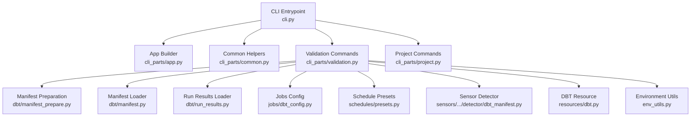
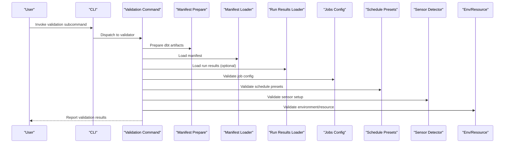
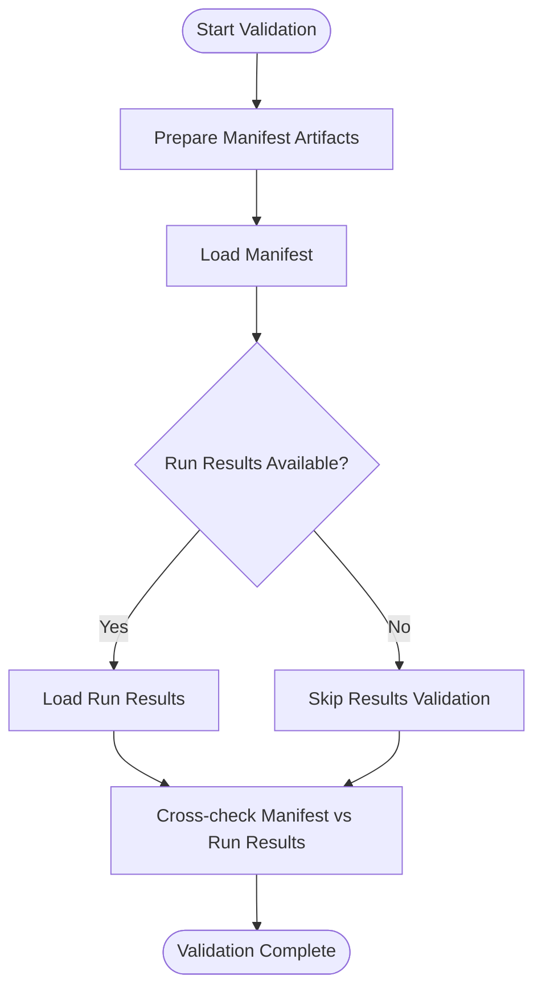
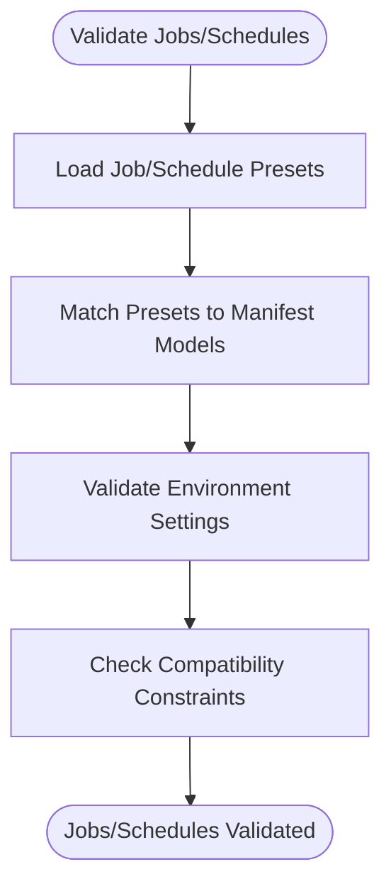
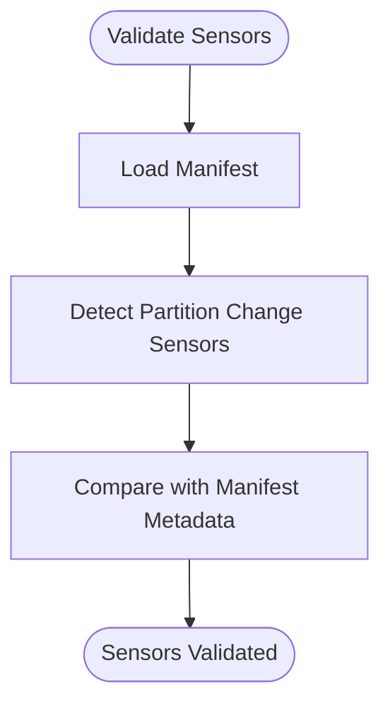
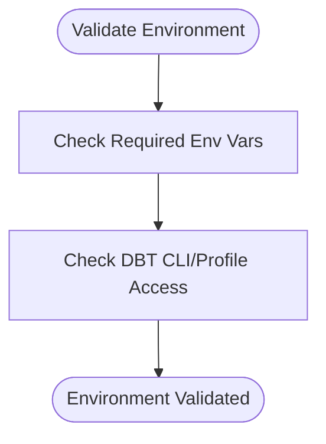
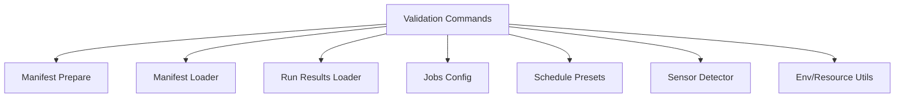

# Validation Commands

<cite>
**Referenced Files in This Document**
- [cli.py](file://src/dbt_dagsterizer/cli.py)
- [validation.py](file://src/dbt_dagsterizer/cli_parts/validation.py)
- [project.py](file://src/dbt_dagsterizer/cli_parts/project.py)
- [app.py](file://src/dbt_dagsterizer/cli_parts/app.py)
- [common.py](file://src/dbt_dagsterizer/cli_parts/common.py)
- [manifest.py](file://src/dbt_dagsterizer/dbt/manifest.py)
- [manifest_prepare.py](file://src/dbt_dagsterizer/dbt/manifest_prepare.py)
- [run_results.py](file://src/dbt_dagsterizer/dbt/run_results.py)
- [dbt_config.py](file://src/dbt_dagsterizer/jobs/dbt_config.py)
- [presets.py](file://src/dbt_dagsterizer/schedules/presets.py)
- [dbt_manifest.py](file://src/dbt_dagsterizer/sensors/partition_change/detector/dbt_manifest.py)
- [dbt.py](file://src/dbt_dagsterizer/resources/dbt.py)
- [env_utils.py](file://src/dbt_dagsterizer/env_utils.py)
- [README.md](file://README.md)
</cite>

## Table of Contents
1. [Introduction](#introduction)
2. [Project Structure](#project-structure)
3. [Core Components](#core-components)
4. [Architecture Overview](#architecture-overview)
5. [Detailed Component Analysis](#detailed-component-analysis)
6. [Dependency Analysis](#dependency-analysis)
7. [Performance Considerations](#performance-considerations)
8. [Troubleshooting Guide](#troubleshooting-guide)
9. [Conclusion](#conclusion)

## Introduction
This document describes validation-related CLI commands in dbt-dagsterizer. It focuses on commands that check dbt project integrity, manifest consistency, configuration correctness, asset dependencies, schedule configurations, sensor setups, environment readiness, dependency resolution, and compatibility verification. It also covers exit codes, error reporting, and remediation steps for failed validations.

## Project Structure
The CLI entrypoint composes subcommands from modular parts. Validation logic is centralized under a dedicated validation module and integrates with dbt manifest preparation and runtime helpers.

**Diagram sources**
- [cli.py](file://src/dbt_dagsterizer/cli.py)
- [app.py](file://src/dbt_dagsterizer/cli_parts/app.py)
- [common.py](file://src/dbt_dagsterizer/cli_parts/common.py)
- [validation.py](file://src/dbt_dagsterizer/cli_parts/validation.py)
- [project.py](file://src/dbt_dagsterizer/cli_parts/project.py)
- [manifest_prepare.py](file://src/dbt_dagsterizer/dbt/manifest_prepare.py)
- [manifest.py](file://src/dbt_dagsterizer/dbt/manifest.py)
- [run_results.py](file://src/dbt_dagsterizer/dbt/run_results.py)
- [dbt_config.py](file://src/dbt_dagsterizer/jobs/dbt_config.py)
- [presets.py](file://src/dbt_dagsterizer/schedules/presets.py)
- [dbt_manifest.py](file://src/dbt_dagsterizer/sensors/partition_change/detector/dbt_manifest.py)
- [dbt.py](file://src/dbt_dagsterizer/resources/dbt.py)
- [env_utils.py](file://src/dbt_dagsterizer/env_utils.py)

**Section sources**
- [cli.py](file://src/dbt_dagsterizer/cli.py)
- [validation.py](file://src/dbt_dagsterizer/cli_parts/validation.py)
- [project.py](file://src/dbt_dagsterizer/cli_parts/project.py)

## Core Components
- Validation command group: Provides subcommands to validate dbt project integrity, manifest consistency, configuration correctness, asset dependencies, schedule configurations, sensor setups, environment readiness, dependency resolution, and compatibility.
- Manifest preparation and loading: Ensures dbt artifacts are ready and consistent before validation.
- Jobs and schedules configuration: Validates job and schedule presets against dbt project metadata.
- Sensor detection: Validates partition-change sensor setup against dbt manifest.
- Environment and resource helpers: Validates environment variables and DBT resource availability.

**Section sources**
- [validation.py](file://src/dbt_dagsterizer/cli_parts/validation.py)
- [manifest_prepare.py](file://src/dbt_dagsterizer/dbt/manifest_prepare.py)
- [manifest.py](file://src/dbt_dagsterizer/dbt/manifest.py)
- [run_results.py](file://src/dbt_dagsterizer/dbt/run_results.py)
- [dbt_config.py](file://src/dbt_dagsterizer/jobs/dbt_config.py)
- [presets.py](file://src/dbt_dagsterizer/schedules/presets.py)
- [dbt_manifest.py](file://src/dbt_dagsterizer/sensors/partition_change/detector/dbt_manifest.py)
- [dbt.py](file://src/dbt_dagsterizer/resources/dbt.py)
- [env_utils.py](file://src/dbt_dagsterizer/env_utils.py)

## Architecture Overview
The validation commands are composed via the CLI entrypoint and delegate to specialized validators. Validators load and cross-check dbt artifacts, configuration presets, and environment settings.

**Diagram sources**
- [cli.py](file://src/dbt_dagsterizer/cli.py)
- [validation.py](file://src/dbt_dagsterizer/cli_parts/validation.py)
- [manifest_prepare.py](file://src/dbt_dagsterizer/dbt/manifest_prepare.py)
- [manifest.py](file://src/dbt_dagsterizer/dbt/manifest.py)
- [run_results.py](file://src/dbt_dagsterizer/dbt/run_results.py)
- [dbt_config.py](file://src/dbt_dagsterizer/jobs/dbt_config.py)
- [presets.py](file://src/dbt_dagsterizer/schedules/presets.py)
- [dbt_manifest.py](file://src/dbt_dagsterizer/sensors/partition_change/detector/dbt_manifest.py)
- [env_utils.py](file://src/dbt_dagsterizer/env_utils.py)

## Detailed Component Analysis

### Validation Command Group
- Purpose: Centralized validation commands for dbt project integrity, manifest consistency, configuration correctness, asset dependencies, schedule configurations, sensor setups, environment readiness, dependency resolution, and compatibility.
- Composition: Built from the CLI entrypoint and routed to the validation module.

**Section sources**
- [cli.py](file://src/dbt_dagsterizer/cli.py)
- [validation.py](file://src/dbt_dagsterizer/cli_parts/validation.py)

### Manifest Preparation and Loading
- Manifest preparation ensures dbt artifacts are generated and up-to-date before validation.
- Manifest loader reads and validates dbt manifest structure and contents.
- Run results loader optionally validates recent dbt runs for freshness and consistency.

**Diagram sources**
- [manifest_prepare.py](file://src/dbt_dagsterizer/dbt/manifest_prepare.py)
- [manifest.py](file://src/dbt_dagsterizer/dbt/manifest.py)
- [run_results.py](file://src/dbt_dagsterizer/dbt/run_results.py)

**Section sources**
- [manifest_prepare.py](file://src/dbt_dagsterizer/dbt/manifest_prepare.py)
- [manifest.py](file://src/dbt_dagsterizer/dbt/manifest.py)
- [run_results.py](file://src/dbt_dagsterizer/dbt/run_results.py)

### Jobs and Schedule Configuration Validation
- Jobs configuration validation checks job presets against dbt project metadata and environment settings.
- Schedule presets validation verifies cron-like scheduling configurations align with dbt models and partitions.

**Diagram sources**
- [dbt_config.py](file://src/dbt_dagsterizer/jobs/dbt_config.py)
- [presets.py](file://src/dbt_dagsterizer/schedules/presets.py)
- [manifest.py](file://src/dbt_dagsterizer/dbt/manifest.py)
- [env_utils.py](file://src/dbt_dagsterizer/env_utils.py)

**Section sources**
- [dbt_config.py](file://src/dbt_dagsterizer/jobs/dbt_config.py)
- [presets.py](file://src/dbt_dagsterizer/schedules/presets.py)
- [manifest.py](file://src/dbt_dagsterizer/dbt/manifest.py)
- [env_utils.py](file://src/dbt_dagsterizer/env_utils.py)

### Sensor Setup Validation
- Sensor detector validates partition-change sensor configuration against dbt manifest to ensure accurate impact propagation and watermark handling.

**Diagram sources**
- [dbt_manifest.py](file://src/dbt_dagsterizer/sensors/partition_change/detector/dbt_manifest.py)
- [manifest.py](file://src/dbt_dagsterizer/dbt/manifest.py)

**Section sources**
- [dbt_manifest.py](file://src/dbt_dagsterizer/sensors/partition_change/detector/dbt_manifest.py)
- [manifest.py](file://src/dbt_dagsterizer/dbt/manifest.py)

### Environment and Resource Validation
- Environment validation checks required environment variables and resource availability for dbt-dagsterizer operations.
- DBT resource validation ensures dbt CLI and profile settings are accessible and correct.

**Diagram sources**
- [env_utils.py](file://src/dbt_dagsterizer/env_utils.py)
- [dbt.py](file://src/dbt_dagsterizer/resources/dbt.py)

**Section sources**
- [env_utils.py](file://src/dbt_dagsterizer/env_utils.py)
- [dbt.py](file://src/dbt_dagsterizer/resources/dbt.py)

## Dependency Analysis
The validation commands depend on:
- CLI composition for routing and argument parsing.
- Manifest preparation and loaders for dbt artifact validation.
- Jobs and schedules configuration modules for preset validation.
- Sensor detector for partition-change sensor validation.
- Environment and resource utilities for environment checks.

**Diagram sources**
- [validation.py](file://src/dbt_dagsterizer/cli_parts/validation.py)
- [manifest_prepare.py](file://src/dbt_dagsterizer/dbt/manifest_prepare.py)
- [manifest.py](file://src/dbt_dagsterizer/dbt/manifest.py)
- [run_results.py](file://src/dbt_dagsterizer/dbt/run_results.py)
- [dbt_config.py](file://src/dbt_dagsterizer/jobs/dbt_config.py)
- [presets.py](file://src/dbt_dagsterizer/schedules/presets.py)
- [dbt_manifest.py](file://src/dbt_dagsterizer/sensors/partition_change/detector/dbt_manifest.py)
- [env_utils.py](file://src/dbt_dagsterizer/env_utils.py)

**Section sources**
- [validation.py](file://src/dbt_dagsterizer/cli_parts/validation.py)
- [manifest_prepare.py](file://src/dbt_dagsterizer/dbt/manifest_prepare.py)
- [manifest.py](file://src/dbt_dagsterizer/dbt/manifest.py)
- [run_results.py](file://src/dbt_dagsterizer/dbt/run_results.py)
- [dbt_config.py](file://src/dbt_dagsterizer/jobs/dbt_config.py)
- [presets.py](file://src/dbt_dagsterizer/schedules/presets.py)
- [dbt_manifest.py](file://src/dbt_dagsterizer/sensors/partition_change/detector/dbt_manifest.py)
- [env_utils.py](file://src/dbt_dagsterizer/env_utils.py)

## Performance Considerations
- Manifest preparation and loading can be I/O intensive; cache prepared artifacts when iterating on validations.
- Batch validations across related components (jobs, schedules, sensors) to minimize repeated manifest loads.
- Limit optional run results validation to targeted periods to reduce overhead.

## Troubleshooting Guide
- Manifest not found or outdated: Re-run manifest preparation before validation.
- Missing environment variables: Set required environment variables as per environment utilities.
- DBT CLI/profile errors: Verify DBT CLI installation and profile configuration.
- Job/schedule preset mismatches: Align presets with manifest models and partitions.
- Sensor setup failures: Confirm sensor detector alignment with manifest metadata.

**Section sources**
- [manifest_prepare.py](file://src/dbt_dagsterizer/dbt/manifest_prepare.py)
- [env_utils.py](file://src/dbt_dagsterizer/env_utils.py)
- [dbt.py](file://src/dbt_dagsterizer/resources/dbt.py)
- [dbt_config.py](file://src/dbt_dagsterizer/jobs/dbt_config.py)
- [presets.py](file://src/dbt_dagsterizer/schedules/presets.py)
- [dbt_manifest.py](file://src/dbt_dagsterizer/sensors/partition_change/detector/dbt_manifest.py)

## Conclusion
The validation commands in dbt-dagsterizer provide a cohesive set of checks spanning dbt project integrity, manifest consistency, configuration correctness, asset dependencies, schedule configurations, sensor setups, environment readiness, dependency resolution, and compatibility. By leveraging manifest preparation, loaders, configuration presets, and environment/resource utilities, these validations help maintain reliable and predictable DAG generation and orchestration.