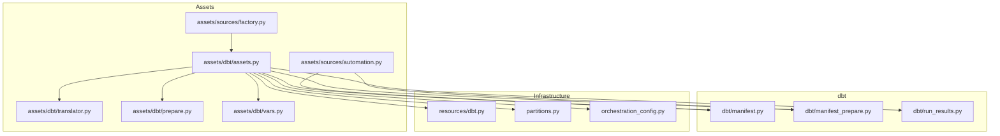
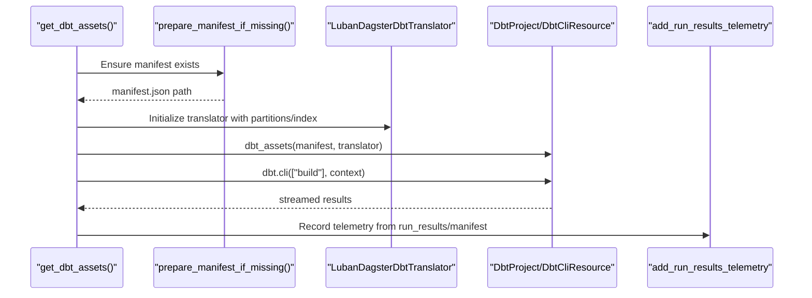
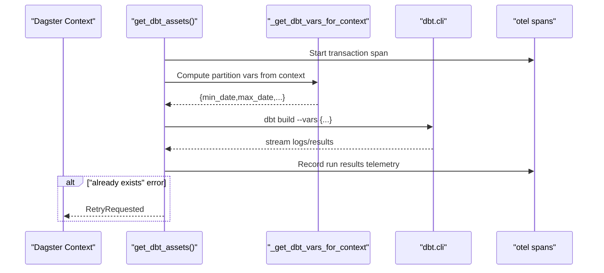
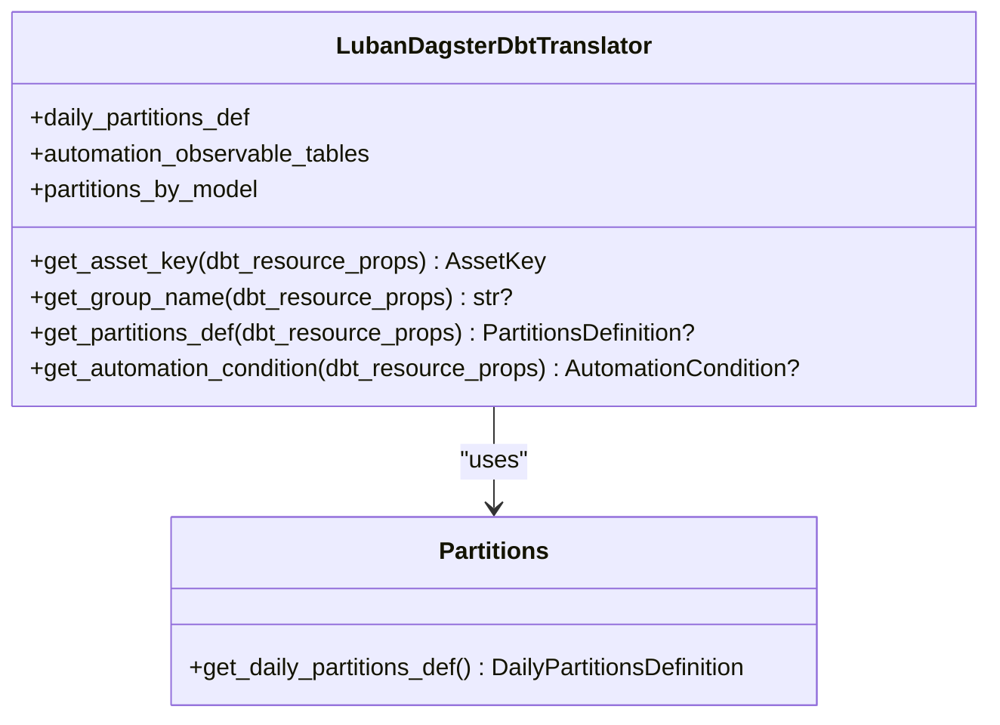
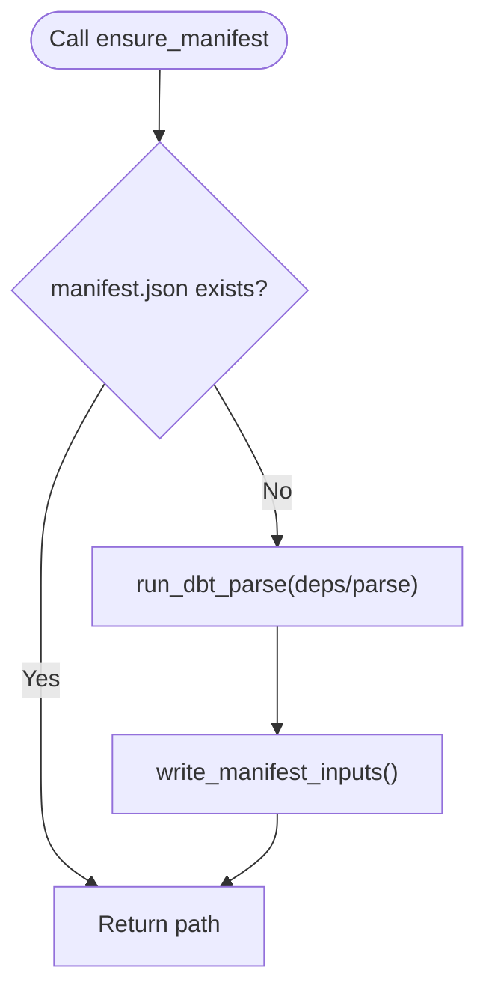
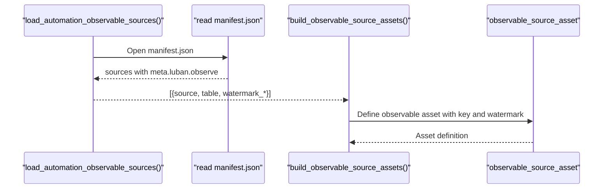
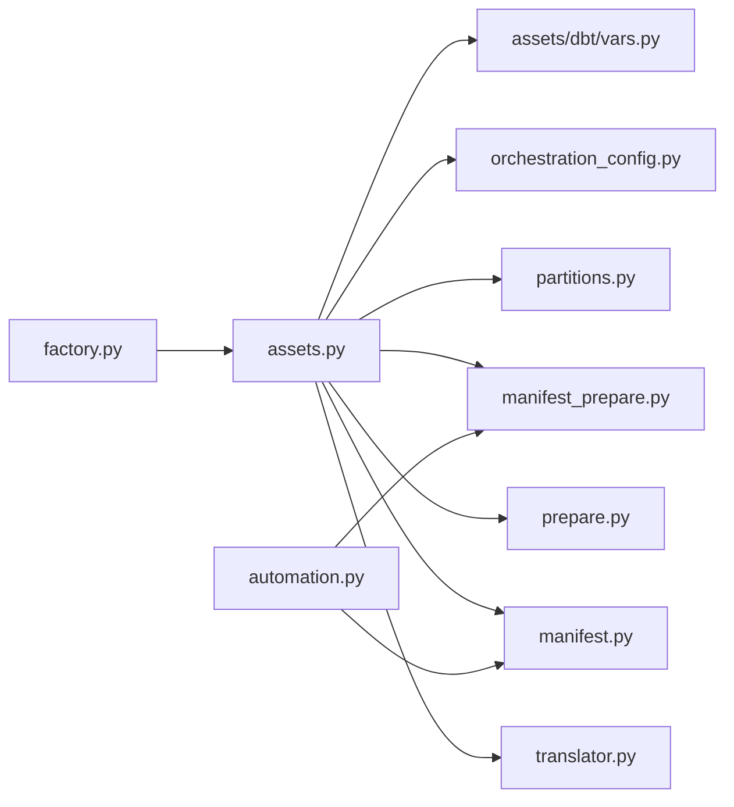

# Asset Generation

<cite>
**Referenced Files in This Document**
- [assets.py](file://src/dbt_dagsterizer/assets/dbt/assets.py)
- [translator.py](file://src/dbt_dagsterizer/assets/dbt/translator.py)
- [prepare.py](file://src/dbt_dagsterizer/assets/dbt/prepare.py)
- [factory.py](file://src/dbt_dagsterizer/assets/sources/factory.py)
- [automation.py](file://src/dbt_dagsterizer/assets/sources/automation.py)
- [manifest.py](file://src/dbt_dagsterizer/dbt/manifest.py)
- [manifest_prepare.py](file://src/dbt_dagsterizer/dbt/manifest_prepare.py)
- [partitions.py](file://src/dbt_dagsterizer/partitions.py)
- [orchestration_config.py](file://src/dbt_dagsterizer/orchestration_config.py)
- [run_results.py](file://src/dbt_dagsterizer/dbt/run_results.py)
- [dbt.py](file://src/dbt_dagsterizer/resources/dbt.py)
- [vars.py](file://src/dbt_dagsterizer/assets/dbt/vars.py)
- [test_assets_retry.py](file://tests/test_assets_retry.py)
- [test_observable_sources.py](file://tests/test_observable_sources.py)
</cite>

## Table of Contents
1. [Introduction](#introduction)
2. [Project Structure](#project-structure)
3. [Core Components](#core-components)
4. [Architecture Overview](#architecture-overview)
5. [Detailed Component Analysis](#detailed-component-analysis)
6. [Dependency Analysis](#dependency-analysis)
7. [Performance Considerations](#performance-considerations)
8. [Troubleshooting Guide](#troubleshooting-guide)
9. [Conclusion](#conclusion)
10. [Appendices](#appendices)

## Introduction
This document explains how dbt manifests are translated into Dagster assets, covering asset key generation, dependency mapping, metadata extraction, and observable source integration. It documents how different dbt model types (incremental, table, view, seed) are handled conceptually, how partitioning and automation conditions are inferred, and how asset preparation ensures manifests are ready before asset definition. It also provides examples of asset key patterns, dependency chains, and metadata enrichment via dbt’s manifest.

## Project Structure
The asset generation pipeline centers around three primary areas:
- dbt-to-Dagster asset translation and runtime execution
- Observable source asset creation from dbt source metadata
- Manifest preparation and orchestration configuration

**Diagram sources**
- [assets.py:40-113](file://src/dbt_dagsterizer/assets/dbt/assets.py#L40-L113)
- [translator.py:44-116](file://src/dbt_dagsterizer/assets/dbt/translator.py#L44-L116)
- [prepare.py:9-18](file://src/dbt_dagsterizer/assets/dbt/prepare.py#L9-L18)
- [vars.py:25-39](file://src/dbt_dagsterizer/assets/dbt/vars.py#L25-L39)
- [factory.py:13-86](file://src/dbt_dagsterizer/assets/sources/factory.py#L13-L86)
- [automation.py:15-47](file://src/dbt_dagsterizer/assets/sources/automation.py#L15-L47)
- [manifest.py:28-64](file://src/dbt_dagsterizer/dbt/manifest.py#L28-L64)
- [manifest_prepare.py:57-72](file://src/dbt_dagsterizer/dbt/manifest_prepare.py#L57-L72)
- [run_results.py:223-335](file://src/dbt_dagsterizer/dbt/run_results.py#L223-L335)
- [dbt.py:27-95](file://src/dbt_dagsterizer/resources/dbt.py#L27-L95)
- [partitions.py:10-21](file://src/dbt_dagsterizer/partitions.py#L10-L21)
- [orchestration_config.py:112-158](file://src/dbt_dagsterizer/orchestration_config.py#L112-L158)

**Section sources**
- [assets.py:40-113](file://src/dbt_dagsterizer/assets/dbt/assets.py#L40-L113)
- [translator.py:44-116](file://src/dbt_dagsterizer/assets/dbt/translator.py#L44-L116)
- [prepare.py:9-18](file://src/dbt_dagsterizer/assets/dbt/prepare.py#L9-L18)
- [factory.py:13-86](file://src/dbt_dagsterizer/assets/sources/factory.py#L13-L86)
- [automation.py:15-47](file://src/dbt_dagsterizer/assets/sources/automation.py#L15-L47)
- [manifest.py:28-64](file://src/dbt_dagsterizer/dbt/manifest.py#L28-L64)
- [manifest_prepare.py:57-72](file://src/dbt_dagsterizer/dbt/manifest_prepare.py#L57-L72)
- [run_results.py:223-335](file://src/dbt_dagsterizer/dbt/run_results.py#L223-L335)
- [dbt.py:27-95](file://src/dbt_dagsterizer/resources/dbt.py#L27-L95)
- [partitions.py:10-21](file://src/dbt_dagsterizer/partitions.py#L10-L21)
- [orchestration_config.py:112-158](file://src/dbt_dagsterizer/orchestration_config.py#L112-L158)

## Core Components
- Asset definition and runtime: The dbt assets decorator is configured with a translator and a prepared manifest. It streams dbt CLI execution, injects partition variables, and records telemetry.
- Translator: Provides asset keys, groups, partitions, and automation conditions based on dbt resource properties and orchestration configuration.
- Manifest preparation: Ensures a fresh dbt manifest exists before asset loading, optionally invoking deps and parse.
- Observable sources: Reads dbt source metadata to define observable source assets that track watermark columns or SQL expressions.
- Partitioning: Supplies a daily partitions definition when requested by the translator.
- Orchestration index: Indexes partition types and job assignments for models from a YAML configuration.

**Section sources**
- [assets.py:40-113](file://src/dbt_dagsterizer/assets/dbt/assets.py#L40-L113)
- [translator.py:44-116](file://src/dbt_dagsterizer/assets/dbt/translator.py#L44-L116)
- [prepare.py:9-18](file://src/dbt_dagsterizer/assets/dbt/prepare.py#L9-L18)
- [factory.py:13-86](file://src/dbt_dagsterizer/assets/sources/factory.py#L13-L86)
- [automation.py:15-47](file://src/dbt_dagsterizer/assets/sources/automation.py#L15-L47)
- [partitions.py:10-21](file://src/dbt_dagsterizer/partitions.py#L10-L21)
- [orchestration_config.py:112-158](file://src/dbt_dagsterizer/orchestration_config.py#L112-L158)

## Architecture Overview
The asset generation pipeline integrates dbt’s manifest with Dagster’s asset graph through a translator and runtime execution.

**Diagram sources**
- [assets.py:40-113](file://src/dbt_dagsterizer/assets/dbt/assets.py#L40-L113)
- [prepare.py:9-18](file://src/dbt_dagsterizer/assets/dbt/prepare.py#L9-L18)
- [translator.py:44-116](file://src/dbt_dagsterizer/assets/dbt/translator.py#L44-L116)
- [run_results.py:223-335](file://src/dbt_dagsterizer/dbt/run_results.py#L223-L335)

## Detailed Component Analysis

### Asset Definition and Runtime Execution
- Loads dbt project directory and target, prepares manifest, and constructs a translator with automation tables and partition index.
- Defines a dbt assets asset sensor that streams dbt CLI output, injects partition variables when present, and records telemetry.
- Implements a retry policy for specific dbt CLI errors indicating “already exists.”

**Diagram sources**
- [assets.py:71-113](file://src/dbt_dagsterizer/assets/dbt/assets.py#L71-L113)
- [vars.py:25-39](file://src/dbt_dagsterizer/assets/dbt/vars.py#L25-L39)
- [run_results.py:223-335](file://src/dbt_dagsterizer/dbt/run_results.py#L223-L335)

**Section sources**
- [assets.py:40-113](file://src/dbt_dagsterizer/assets/dbt/assets.py#L40-L113)
- [vars.py:25-39](file://src/dbt_dagsterizer/assets/dbt/vars.py#L25-L39)
- [test_assets_retry.py:4-14](file://tests/test_assets_retry.py#L4-L14)

### Translator: Asset Keys, Groups, Partitions, Automation Conditions
- Asset key generation: Builds a relation-based key using database, schema, and identifier to ensure stability across code locations.
- Group naming: Infers group names from the model’s original file path or FQN.
- Partitions: Returns a daily partitions definition when a model is marked daily in orchestration configuration.
- Automation conditions: Eager automation for specific model families/tags and automation observable tables.

**Diagram sources**
- [translator.py:44-116](file://src/dbt_dagsterizer/assets/dbt/translator.py#L44-L116)
- [partitions.py:10-21](file://src/dbt_dagsterizer/partitions.py#L10-L21)

**Section sources**
- [translator.py:44-116](file://src/dbt_dagsterizer/assets/dbt/translator.py#L44-L116)
- [partitions.py:10-21](file://src/dbt_dagsterizer/partitions.py#L10-L21)
- [orchestration_config.py:112-158](file://src/dbt_dagsterizer/orchestration_config.py#L112-L158)

### Manifest Preparation and Loading
- Ensures a manifest exists by running dbt deps and parse when needed, respecting environment and .env overrides.
- Loads manifest and iterates dbt models, extracting name, tags, meta, and relation properties.

**Diagram sources**
- [manifest_prepare.py:57-72](file://src/dbt_dagsterizer/dbt/manifest_prepare.py#L57-L72)
- [manifest.py:28-64](file://src/dbt_dagsterizer/dbt/manifest.py#L28-L64)

**Section sources**
- [manifest_prepare.py:57-72](file://src/dbt_dagsterizer/dbt/manifest_prepare.py#L57-L72)
- [manifest.py:28-64](file://src/dbt_dagsterizer/dbt/manifest.py#L28-L64)

### Observable Source Assets and Automation
- Loads observable source specs from dbt manifest sources that include watermark metadata.
- Creates observable source assets keyed by matching dbt output names, supporting either watermark column or custom watermark SQL.
- Resolves asset keys by exact table match or suffix-based fallback.

**Diagram sources**
- [automation.py:15-47](file://src/dbt_dagsterizer/assets/sources/automation.py#L15-L47)
- [factory.py:13-86](file://src/dbt_dagsterizer/assets/sources/factory.py#L13-L86)

**Section sources**
- [automation.py:15-47](file://src/dbt_dagsterizer/assets/sources/automation.py#L15-L47)
- [factory.py:13-86](file://src/dbt_dagsterizer/assets/sources/factory.py#L13-L86)
- [test_observable_sources.py:10-63](file://tests/test_observable_sources.py#L10-L63)

### Asset Key Patterns and Dependency Mapping
- Asset keys are relation-based: dbt/<database>/<schema>/<identifier>, with empty components omitted.
- Group names are derived from the model’s file path or FQN to organize assets under logical folders.
- Dependencies are inferred by Dagster from the dbt manifest and translator configuration.

Examples (conceptual):
- Asset key pattern: dbt/ods/orders
- Group derivation: models/dwd/customers → group “dwd”
- Dependency chain: incremental model depends on upstream table/view seeds

**Section sources**
- [translator.py:12-42](file://src/dbt_dagsterizer/assets/dbt/translator.py#L12-L42)
- [translator.py:88-106](file://src/dbt_dagsterizer/assets/dbt/translator.py#L88-L106)

### Metadata Extraction and Enrichment
- dbt manifest metadata is loaded and indexed to extract tags, meta, and resource properties.
- Luban-specific metadata is used for partitioning hints and automation configuration.
- Telemetry enriches spans with dbt run results and manifest node details.

**Section sources**
- [manifest.py:76-93](file://src/dbt_dagsterizer/dbt/manifest.py#L76-L93)
- [run_results.py:223-335](file://src/dbt_dagsterizer/dbt/run_results.py#L223-L335)

### Asset Translation Process by Model Type
- Table, View, Seed, Incremental: The translator treats models uniformly by resource type and uses tags/FQN to infer automation and grouping. Partitioning is applied when configured.
- The dbt CLI command executed is build, which compiles and runs models according to the manifest.

**Section sources**
- [assets.py:71-93](file://src/dbt_dagsterizer/assets/dbt/assets.py#L71-L93)
- [translator.py:88-116](file://src/dbt_dagsterizer/assets/dbt/translator.py#L88-L116)

## Dependency Analysis
The asset generation module exhibits low coupling and clear separation of concerns:
- assets.py orchestrates loading, preparation, translation, and execution.
- translator.py encapsulates key/group/partition/automation logic.
- manifest.py and manifest_prepare.py handle manifest lifecycle.
- partitions.py supplies partition definitions.
- orchestration_config.py provides model-to-partition and job mappings.
- factory.py and automation.py integrate observable sources from dbt metadata.

**Diagram sources**
- [assets.py:40-113](file://src/dbt_dagsterizer/assets/dbt/assets.py#L40-L113)
- [translator.py:44-116](file://src/dbt_dagsterizer/assets/dbt/translator.py#L44-L116)
- [prepare.py:9-18](file://src/dbt_dagsterizer/assets/dbt/prepare.py#L9-L18)
- [manifest.py:28-64](file://src/dbt_dagsterizer/dbt/manifest.py#L28-L64)
- [manifest_prepare.py:57-72](file://src/dbt_dagsterizer/dbt/manifest_prepare.py#L57-L72)
- [partitions.py:10-21](file://src/dbt_dagsterizer/partitions.py#L10-L21)
- [orchestration_config.py:112-158](file://src/dbt_dagsterizer/orchestration_config.py#L112-L158)
- [factory.py:13-86](file://src/dbt_dagsterizer/assets/sources/factory.py#L13-L86)
- [automation.py:15-47](file://src/dbt_dagsterizer/assets/sources/automation.py#L15-L47)

**Section sources**
- [assets.py:40-113](file://src/dbt_dagsterizer/assets/dbt/assets.py#L40-L113)
- [translator.py:44-116](file://src/dbt_dagsterizer/assets/dbt/translator.py#L44-L116)
- [prepare.py:9-18](file://src/dbt_dagsterizer/assets/dbt/prepare.py#L9-L18)
- [manifest.py:28-64](file://src/dbt_dagsterizer/dbt/manifest.py#L28-L64)
- [manifest_prepare.py:57-72](file://src/dbt_dagsterizer/dbt/manifest_prepare.py#L57-L72)
- [partitions.py:10-21](file://src/dbt_dagsterizer/partitions.py#L10-L21)
- [orchestration_config.py:112-158](file://src/dbt_dagsterizer/orchestration_config.py#L112-L158)
- [factory.py:13-86](file://src/dbt_dagsterizer/assets/sources/factory.py#L13-L86)
- [automation.py:15-47](file://src/dbt_dagsterizer/assets/sources/automation.py#L15-L47)

## Performance Considerations
- Manifest preparation: Running dbt deps and parse adds overhead; caching and environment checks prevent unnecessary work.
- Partition variables: Injecting time windows avoids scanning entire datasets when partitions are used.
- Telemetry: Recording run results and manifest nodes enriches observability but should be tuned via environment variables to avoid excessive event volume.

[No sources needed since this section provides general guidance]

## Troubleshooting Guide
- Manifest not found: Ensure DBT_PROJECT_DIR or LUBAN_REPO_ROOT is set correctly so dbt project/profiles discovery succeeds.
- Missing daily partitions start date: When using daily partitions, set DAGSTER_DAILY_PARTITIONS_START_DATE.
- Retry on “already exists”: The runtime retries once for specific dbt CLI errors; verify idempotency of downstream steps.
- Observable source resolution: If asset key resolution fails, confirm the source/table mapping and available output names.

**Section sources**
- [dbt.py:27-95](file://src/dbt_dagsterizer/resources/dbt.py#L27-L95)
- [partitions.py:14-18](file://src/dbt_dagsterizer/partitions.py#L14-L18)
- [assets.py:94-101](file://src/dbt_dagsterizer/assets/dbt/assets.py#L94-L101)
- [factory.py:31-44](file://src/dbt_dagsterizer/assets/sources/factory.py#L31-L44)

## Conclusion
The asset generation pipeline converts dbt manifests into a Dagster asset graph by translating dbt resource properties into asset keys, groups, partitions, and automation conditions. Manifest preparation, partition variable injection, and telemetry ensure robust and observable execution. Observable sources are automatically created from dbt source metadata, enabling watermark-driven asset updates. Orchestration configuration provides a declarative way to manage partitions and job assignments.

[No sources needed since this section summarizes without analyzing specific files]

## Appendices

### Appendix A: Asset Key Pattern Reference
- Relation-based key: dbt/<database>/<schema>/<identifier>
- Empty components are omitted; examples:
  - dbt/ods/orders
  - dbt/schema/clients
  - dbt/my_table

**Section sources**
- [translator.py:12-42](file://src/dbt_dagsterizer/assets/dbt/translator.py#L12-L42)

### Appendix B: Dependency Chain Example
- Seed → View → Table
- Incremental model depends on upstream materialized tables or views

**Section sources**
- [translator.py:88-106](file://src/dbt_dagsterizer/assets/dbt/translator.py#L88-L106)

### Appendix C: Metadata Enrichment Examples
- Partition type: daily/unpartitioned per model
- Automation condition: eager for specific model families/tags and automation observable tables
- Grouping: derived from file path or FQN

**Section sources**
- [orchestration_config.py:112-158](file://src/dbt_dagsterizer/orchestration_config.py#L112-L158)
- [translator.py:58-80](file://src/dbt_dagsterizer/assets/dbt/translator.py#L58-L80)