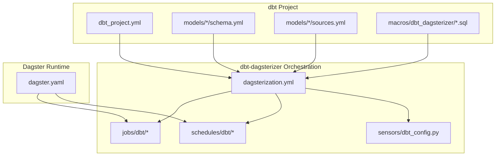
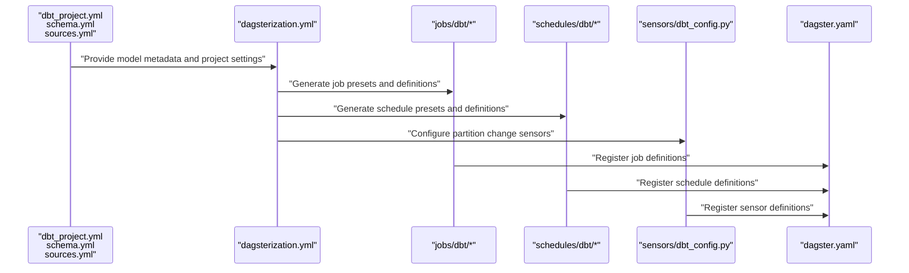
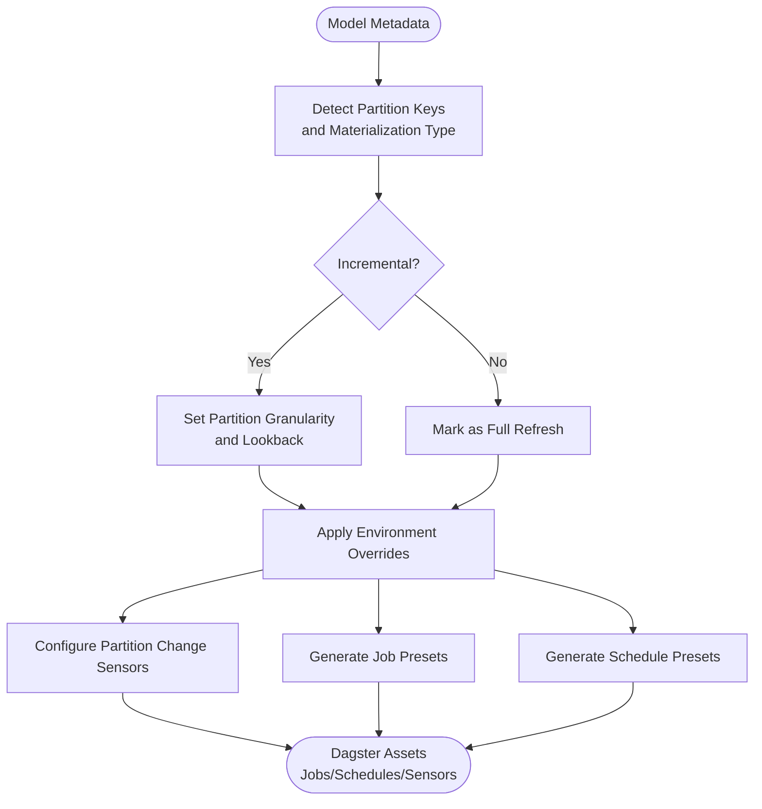
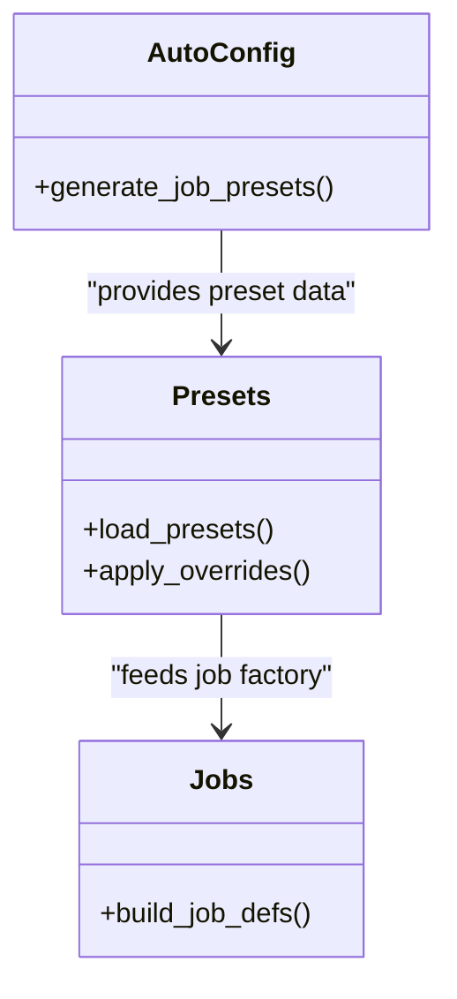
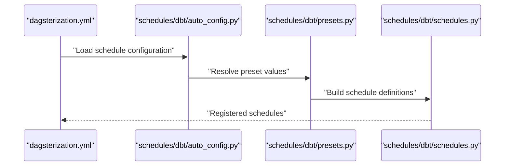
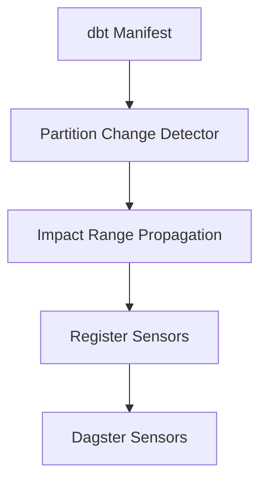
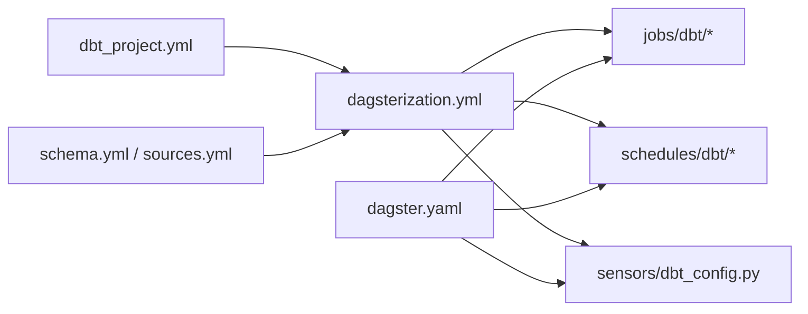

# Configuration Patterns

<cite>
**Referenced Files in This Document**
- [dagsterization.yml](file://src/dbt_dagsterizer/project_templates/luban-dagster-dbt-starrocks-code-location-source-template/{{cookiecutter.output_name}}/dbt_project/dagsterization.yml)
- [dagster.yaml](file://src/dbt_dagsterizer/project_templates/luban-dagster-dbt-starrocks-code-location-source-template/{{cookiecutter.output_name}}/dagster_home/dagster.yaml)
- [dbt_project.yml](file://src/dbt_dagsterizer/project_templates/luban-dagster-dbt-starrocks-code-location-source-template/{{cookiecutter.output_name}}/dbt_project/dbt_project.yml)
- [schema.yml](file://src/dbt_dagsterizer/project_templates/luban-dagster-dbt-starrocks-code-location-source-template/{{cookiecutter.output_name}}/dbt_project/models/dwd/schema.yml)
- [sources.yml](file://src/dbt_dagsterizer/project_templates/luban-dagster-dbt-starrocks-code-location-source-template/{{cookiecutter.output_name}}/dbt_project/models/dwd/sources.yml)
- [auto_config.py](file://src/dbt_dagsterizer/jobs/dbt/auto_config.py)
- [presets.py](file://src/dbt_dagsterizer/jobs/dbt/presets.py)
- [jobs.py](file://src/dbt_dagsterizer/jobs/dbt/jobs.py)
- [dbt_config.py](file://src/dbt_dagsterizer/jobs/dbt_config.py)
- [auto_config.py](file://src/dbt_dagsterizer/schedules/dbt/auto_config.py)
- [presets.py](file://src/dbt_dagsterizer/schedules/dbt/presets.py)
- [schedules.py](file://src/dbt_dagsterizer/schedules/dbt/schedules.py)
- [dbt_config.py](file://src/dbt_dagsterizer/schedules/dbt_config.py)
- [dbt_config.py](file://src/dbt_dagsterizer/sensors/dbt_config.py)
- [partition_vars.sql](file://src/dbt_dagsterizer/project_templates/luban-dagster-dbt-starrocks-code-location-source-template/{{cookiecutter.output_name}}/dbt_project/macros/dbt_dagsterizer/partition_vars.sql)
- [starrocks_overrides.sql](file://src/dbt_dagsterizer/project_templates/luban-dagster-dbt-starrocks-code-location-source-template/{{cookiecutter.output_name}}/dbt_project/macros/dbt_dagsterizer/starrocks_overrides.sql)
- [generate_schema_name.sql](file://src/dbt_dagsterizer/project_templates/luban-dagster-dbt-starrocks-code-location-source-template/{{cookiecutter.output_name}}/dbt_project/macros/dbt_dagsterizer/generate_schema_name.sql)
- [starrocks_layer_schema.sql](file://src/dbt_dagsterizer/project_templates/luban-dagster-dbt-starrocks-code-location-source-template/{{cookiecutter.output_name}}/dbt_project/macros/dbt_dagsterizer/starrocks_layer_schema.sql)
- [orchestration_config.py](file://src/dbt_dagsterizer/orchestration_config.py)
- [partitions.py](file://src/dbt_dagsterizer/partitions.py)
- [test_partition_vars.py](file://src/dbt_dagsterizer/project_templates/luban-dagster-dbt-starrocks-code-location-source-template/{{cookiecutter.output_name}}/tests/test_partition_vars.py)
- [test_schedule_specs.py](file://src/dbt_dagsterizer/project_templates/luban-dagster-dbt-starrocks-code-location-source-template/{{cookiecutter.output_name}}/tests/test_schedule_specs.py)
</cite>

## Table of Contents
1. [Introduction](#introduction)
2. [Project Structure](#project-structure)
3. [Core Components](#core-components)
4. [Architecture Overview](#architecture-overview)
5. [Detailed Component Analysis](#detailed-component-analysis)
6. [Dependency Analysis](#dependency-analysis)
7. [Performance Considerations](#performance-considerations)
8. [Troubleshooting Guide](#troubleshooting-guide)
9. [Conclusion](#conclusion)
10. [Appendices](#appendices)

## Introduction
This document explains configuration patterns used by dbt-dagsterizer to declare orchestration intent via YAML and translate dbt model metadata into Dagster assets, jobs, schedules, and sensors. It covers:
- How YAML configuration files define asset behaviors and orchestration settings
- Partition strategy configuration, incremental models, and full-refresh triggers
- Job configuration patterns, schedule specifications, and sensor presets
- The relationship between dbt model properties and Dagster configuration options
- Examples of common configuration patterns, best practices, environment-specific settings, and troubleshooting

## Project Structure
The configuration surface spans three primary areas:
- dbt project configuration (dbt_project.yml) and model metadata (schema.yml, sources.yml)
- dbt-dagsterizer orchestration configuration (dagsterization.yml)
- Dagster runtime configuration (dagster.yaml)

**Diagram sources**
- [dagsterization.yml](file://src/dbt_dagsterizer/project_templates/luban-dagster-dbt-starrocks-code-location-source-template/{{cookiecutter.output_name}}/dbt_project/dagsterization.yml)
- [dagster.yaml](file://src/dbt_dagsterizer/project_templates/luban-dagster-dbt-starrocks-code-location-source-template/{{cookiecutter.output_name}}/dagster_home/dagster.yaml)
- [dbt_project.yml](file://src/dbt_dagsterizer/project_templates/luban-dagster-dbt-starrocks-code-location-source-template/{{cookiecutter.output_name}}/dbt_project/dbt_project.yml)
- [schema.yml](file://src/dbt_dagsterizer/project_templates/luban-dagster-dbt-starrocks-code-location-source-template/{{cookiecutter.output_name}}/dbt_project/models/dwd/schema.yml)
- [sources.yml](file://src/dbt_dagsterizer/project_templates/luban-dagster-dbt-starrocks-code-location-source-template/{{cookiecutter.output_name}}/dbt_project/models/dwd/sources.yml)
- [auto_config.py](file://src/dbt_dagsterizer/jobs/dbt/auto_config.py)
- [presets.py](file://src/dbt_dagsterizer/jobs/dbt/presets.py)
- [jobs.py](file://src/dbt_dagsterizer/jobs/dbt/jobs.py)
- [dbt_config.py](file://src/dbt_dagsterizer/jobs/dbt_config.py)
- [auto_config.py](file://src/dbt_dagsterizer/schedules/dbt/auto_config.py)
- [presets.py](file://src/dbt_dagsterizer/schedules/dbt/presets.py)
- [schedules.py](file://src/dbt_dagsterizer/schedules/dbt/schedules.py)
- [dbt_config.py](file://src/dbt_dagsterizer/sensors/dbt_config.py)

**Section sources**
- [dagsterization.yml](file://src/dbt_dagsterizer/project_templates/luban-dagster-dbt-starrocks-code-location-source-template/{{cookiecutter.output_name}}/dbt_project/dagsterization.yml)
- [dagster.yaml](file://src/dbt_dagsterizer/project_templates/luban-dagster-dbt-starrocks-code-location-source-template/{{cookiecutter.output_name}}/dagster_home/dagster.yaml)
- [dbt_project.yml](file://src/dbt_dagsterizer/project_templates/luban-dagster-dbt-starrocks-code-location-source-template/{{cookiecutter.output_name}}/dbt_project/dbt_project.yml)
- [schema.yml](file://src/dbt_dagsterizer/project_templates/luban-dagster-dbt-starrocks-code-location-source-template/{{cookiecutter.output_name}}/dbt_project/models/dwd/schema.yml)
- [sources.yml](file://src/dbt_dagsterizer/project_templates/luban-dagster-dbt-starrocks-code-location-source-template/{{cookiecutter.output_name}}/dbt_project/models/dwd/sources.yml)

## Core Components
- Orchestration configuration file: Defines asset groups, partitioning, jobs, schedules, and sensors per dbt model or group of models.
- dbt project configuration: Provides dbt project settings and model-level metadata that inform asset creation and partitioning.
- Dagster runtime configuration: Controls Dagster instance behavior, storage, and external resource bindings.

Key responsibilities:
- Translate dbt model properties (e.g., materialization type, partition keys) into Dagster asset definitions and partition sets.
- Derive job and schedule presets from dbt model metadata and orchestration configuration.
- Provide environment-aware overrides and conditional settings for partitioning and execution.

**Section sources**
- [dagsterization.yml](file://src/dbt_dagsterizer/project_templates/luban-dagster-dbt-starrocks-code-location-source-template/{{cookiecutter.output_name}}/dbt_project/dagsterization.yml)
- [dbt_project.yml](file://src/dbt_dagsterizer/project_templates/luban-dagster-dbt-starrocks-code-location-source-template/{{cookiecutter.output_name}}/dbt_project/dbt_project.yml)
- [dagster.yaml](file://src/dbt_dagsterizer/project_templates/luban-dagster-dbt-starrocks-code-location-source-template/{{cookiecutter.output_name}}/dagster_home/dagster.yaml)

## Architecture Overview
The configuration pipeline maps dbt model metadata and orchestration directives to Dagster constructs.

**Diagram sources**
- [dagsterization.yml](file://src/dbt_dagsterizer/project_templates/luban-dagster-dbt-starrocks-code-location-source-template/{{cookiecutter.output_name}}/dbt_project/dagsterization.yml)
- [auto_config.py](file://src/dbt_dagsterizer/jobs/dbt/auto_config.py)
- [presets.py](file://src/dbt_dagsterizer/jobs/dbt/presets.py)
- [jobs.py](file://src/dbt_dagsterizer/jobs/dbt/jobs.py)
- [auto_config.py](file://src/dbt_dagsterizer/schedules/dbt/auto_config.py)
- [presets.py](file://src/dbt_dagsterizer/schedules/dbt/presets.py)
- [schedules.py](file://src/dbt_dagsterizer/schedules/dbt/schedules.py)
- [dbt_config.py](file://src/dbt_dagsterizer/sensors/dbt_config.py)
- [dagster.yaml](file://src/dbt_dagsterizer/project_templates/luban-dagster-dbt-starrocks-code-location-source-template/{{cookiecutter.output_name}}/dagster_home/dagster.yaml)

## Detailed Component Analysis

### Orchestration Configuration (dagsterization.yml)
Purpose:
- Declares orchestration intent for dbt assets, including partitioning strategy, incremental/full-refresh behavior, job scheduling, and sensor presets.
- Supports environment-specific overrides and conditional settings.

Common patterns:
- Asset grouping by model selection or tags
- Partition strategy configuration (time-based or value-based)
- Incremental model settings (partition keys, lookback windows)
- Full-refresh triggers (manual or automated)
- Job configuration patterns (definition, presets, tags)
- Schedule specifications (cron-like, cron presets)
- Sensor presets (partition change detection, impact propagation)

Best practices:
- Keep orchestration declarations close to model metadata
- Use environment-specific overlays to avoid hardcoding values
- Prefer declarative presets for reusability across environments

**Section sources**
- [dagsterization.yml](file://src/dbt_dagsterizer/project_templates/luban-dagster-dbt-starrocks-code-location-source-template/{{cookiecutter.output_name}}/dbt_project/dagsterization.yml)

### dbt Project Configuration (dbt_project.yml)
Purpose:
- Defines dbt project-level settings (e.g., project name, version, profile, target, model paths).
- Provides defaults that influence asset generation and partitioning.

Relationship to Dagster:
- Project settings feed into asset keys and resource configuration.
- Model paths and package settings influence discovery and translation.

**Section sources**
- [dbt_project.yml](file://src/dbt_dagsterizer/project_templates/luban-dagster-dbt-starrocks-code-location-source-template/{{cookiecutter.output_name}}/dbt_project/dbt_project.yml)

### Model Metadata (schema.yml, sources.yml)
Purpose:
- schema.yml: Defines model schemas, columns, constraints, and optional partitioning hints used by dbt-dagsterizer.
- sources.yml: Declares source tables and their freshness policies, which can drive sensor and schedule decisions.

How they influence Dagster:
- Partition keys and incremental columns inform partition strategy configuration.
- Source freshness and exposure metadata guide sensor presets and schedule cadence.

**Section sources**
- [schema.yml](file://src/dbt_dagsterizer/project_templates/luban-dagster-dbt-starrocks-code-location-source-template/{{cookiecutter.output_name}}/dbt_project/models/dwd/schema.yml)
- [sources.yml](file://src/dbt_dagsterizer/project_templates/luban-dagster-dbt-starrocks-code-location-source-template/{{cookiecutter.output_name}}/dbt_project/models/dwd/sources.yml)

### Partition Strategy Configuration
Partition strategy configuration bridges dbt model properties and Dagster partition sets.

Key elements:
- Partition keys derived from dbt model metadata (e.g., date or value column)
- Incremental models: partition granularity and lookback windows
- Full-refresh triggers: manual override or automated conditions
- Environment-specific overrides for partitioning behavior

Implementation touchpoints:
- Macros that compute partition variables and schema names
- Partition utilities and sensor configuration

**Diagram sources**
- [partition_vars.sql](file://src/dbt_dagsterizer/project_templates/luban-dagster-dbt-starrocks-code-location-source-template/{{cookiecutter.output_name}}/dbt_project/macros/dbt_dagsterizer/partition_vars.sql)
- [starrocks_overrides.sql](file://src/dbt_dagsterizer/project_templates/luban-dagster-dbt-starrocks-code-location-source-template/{{cookiecutter.output_name}}/dbt_project/macros/dbt_dagsterizer/starrocks_overrides.sql)
- [generate_schema_name.sql](file://src/dbt_dagsterizer/project_templates/luban-dagster-dbt-starrocks-code-location-source-template/{{cookiecutter.output_name}}/dbt_project/macros/dbt_dagsterizer/generate_schema_name.sql)
- [starrocks_layer_schema.sql](file://src/dbt_dagsterizer/project_templates/luban-dagster-dbt-starrocks-code-location-source-template/{{cookiecutter.output_name}}/dbt_project/macros/dbt_dagsterizer/starrocks_layer_schema.sql)
- [partitions.py](file://src/dbt_dagsterizer/partitions.py)
- [dbt_config.py](file://src/dbt_dagsterizer/sensors/dbt_config.py)

**Section sources**
- [partition_vars.sql](file://src/dbt_dagsterizer/project_templates/luban-dagster-dbt-starrocks-code-location-source-template/{{cookiecutter.output_name}}/dbt_project/macros/dbt_dagsterizer/partition_vars.sql)
- [starrocks_overrides.sql](file://src/dbt_dagsterizer/project_templates/luban-dagster-dbt-starrocks-code-location-source-template/{{cookiecutter.output_name}}/dbt_project/macros/dbt_dagsterizer/starrocks_overrides.sql)
- [generate_schema_name.sql](file://src/dbt_dagsterizer/project_templates/luban-dagster-dbt-starrocks-code-location-source-template/{{cookiecutter.output_name}}/dbt_project/macros/dbt_dagsterizer/generate_schema_name.sql)
- [starrocks_layer_schema.sql](file://src/dbt_dagsterizer/project_templates/luban-dagster-dbt-starrocks-code-location-source-template/{{cookiecutter.output_name}}/dbt_project/macros/dbt_dagsterizer/starrocks_layer_schema.sql)
- [partitions.py](file://src/dbt_dagsterizer/partitions.py)
- [test_partition_vars.py](file://src/dbt_dagsterizer/project_templates/luban-dagster-dbt-starrocks-code-location-source-template/{{cookiecutter.output_name}}/tests/test_partition_vars.py)

### Job Configuration Patterns
Job configuration patterns define how dbt runs are orchestrated in Dagster.

Patterns:
- Single-model jobs vs batch jobs across related models
- Preset-driven job definitions for dev/staging/prod
- Tags and run config overlays for environment-specific behavior
- Conditional inclusion based on model properties or orchestration flags

Implementation touchpoints:
- Auto-config generators derive job presets from orchestration configuration
- Job factories assemble Dagster job definitions

**Diagram sources**
- [auto_config.py](file://src/dbt_dagsterizer/jobs/dbt/auto_config.py)
- [presets.py](file://src/dbt_dagsterizer/jobs/dbt/presets.py)
- [jobs.py](file://src/dbt_dagsterizer/jobs/dbt/jobs.py)

**Section sources**
- [auto_config.py](file://src/dbt_dagsterizer/jobs/dbt/auto_config.py)
- [presets.py](file://src/dbt_dagsterizer/jobs/dbt/presets.py)
- [jobs.py](file://src/dbt_dagsterizer/jobs/dbt/jobs.py)
- [dbt_config.py](file://src/dbt_dagsterizer/jobs/dbt_config.py)

### Schedule Specifications
Schedule specifications govern automatic execution cadence.

Patterns:
- Cron-like expressions for precise timing
- Cron presets for common intervals
- Environment-specific schedule overrides
- Conditional scheduling based on model freshness or partition availability

Implementation touchpoints:
- Auto-config generators derive schedule presets
- Schedule factories assemble Dagster schedule definitions

**Diagram sources**
- [dagsterization.yml](file://src/dbt_dagsterizer/project_templates/luban-dagster-dbt-starrocks-code-location-source-template/{{cookiecutter.output_name}}/dbt_project/dagsterization.yml)
- [auto_config.py](file://src/dbt_dagsterizer/schedules/dbt/auto_config.py)
- [presets.py](file://src/dbt_dagsterizer/schedules/dbt/presets.py)
- [schedules.py](file://src/dbt_dagsterizer/schedules/dbt/schedules.py)

**Section sources**
- [auto_config.py](file://src/dbt_dagsterizer/schedules/dbt/auto_config.py)
- [presets.py](file://src/dbt_dagsterizer/schedules/dbt/presets.py)
- [schedules.py](file://src/dbt_dagsterizer/schedules/dbt/schedules.py)
- [dbt_config.py](file://src/dbt_dagsterizer/schedules/dbt_config.py)
- [test_schedule_specs.py](file://src/dbt_dagsterizer/project_templates/luban-dagster-dbt-starrocks-code-location-source-template/{{cookiecutter.output_name}}/tests/test_schedule_specs.py)

### Sensor Presets (Partition Change Detection)
Sensor presets detect partition changes and trigger downstream assets.

Patterns:
- Partition change sensors for incremental models
- Impact range propagation to upstream assets
- Sparse lookback windows to reduce overhead
- Environment-specific sensitivity thresholds

Implementation touchpoints:
- Sensor configuration module integrates with dbt manifest
- Factory and presets modules assemble sensor definitions

**Diagram sources**
- [dbt_config.py](file://src/dbt_dagsterizer/sensors/dbt_config.py)

**Section sources**
- [dbt_config.py](file://src/dbt_dagsterizer/sensors/dbt_config.py)

### Relationship Between dbt Model Properties and Dagster Configuration Options
- Materialization type influences whether a model is treated as incremental or full-refresh.
- Partition keys and incremental columns inform partition strategy and sensor triggers.
- Source freshness drives schedule cadence and sensor sensitivity.
- dbt tags and model selection in orchestration configuration map to Dagster job and sensor scopes.

**Section sources**
- [schema.yml](file://src/dbt_dagsterizer/project_templates/luban-dagster-dbt-starrocks-code-location-source-template/{{cookiecutter.output_name}}/dbt_project/models/dwd/schema.yml)
- [sources.yml](file://src/dbt_dagsterizer/project_templates/luban-dagster-dbt-starrocks-code-location-source-template/{{cookiecutter.output_name}}/dbt_project/models/dwd/sources.yml)
- [dagsterization.yml](file://src/dbt_dagsterizer/project_templates/luban-dagster-dbt-starrocks-code-location-source-template/{{cookiecutter.output_name}}/dbt_project/dagsterization.yml)

## Dependency Analysis
The configuration system exhibits clear separation of concerns:
- dbt project configuration informs asset generation
- Orchestration configuration maps to jobs, schedules, and sensors
- Runtime configuration binds Dagster to infrastructure

**Diagram sources**
- [dbt_project.yml](file://src/dbt_dagsterizer/project_templates/luban-dagster-dbt-starrocks-code-location-source-template/{{cookiecutter.output_name}}/dbt_project/dbt_project.yml)
- [dagsterization.yml](file://src/dbt_dagsterizer/project_templates/luban-dagster-dbt-starrocks-code-location-source-template/{{cookiecutter.output_name}}/dbt_project/dagsterization.yml)
- [dagster.yaml](file://src/dbt_dagsterizer/project_templates/luban-dagster-dbt-starrocks-code-location-source-template/{{cookiecutter.output_name}}/dagster_home/dagster.yaml)

**Section sources**
- [dbt_project.yml](file://src/dbt_dagsterizer/project_templates/luban-dagster-dbt-starrocks-code-location-source-template/{{cookiecutter.output_name}}/dbt_project/dbt_project.yml)
- [dagsterization.yml](file://src/dbt_dagsterizer/project_templates/luban-dagster-dbt-starrocks-code-location-source-template/{{cookiecutter.output_name}}/dbt_project/dagsterization.yml)
- [dagster.yaml](file://src/dbt_dagsterizer/project_templates/luban-dagster-dbt-starrocks-code-location-source-template/{{cookiecutter.output_name}}/dagster_home/dagster.yaml)

## Performance Considerations
- Minimize redundant partition scans by tuning lookback windows and partition granularity.
- Use environment-specific overrides to scale back schedules in lower environments.
- Prefer batch jobs for related models to reduce orchestration overhead.
- Limit sensor impact ranges to essential upstream assets to reduce fan-out.

## Troubleshooting Guide
Common configuration conflicts and resolutions:
- Partition mismatch: Ensure partition keys in dbt model metadata align with partition strategy configuration.
- Schedule overlap: Avoid overlapping cron schedules for the same asset set; use presets to consolidate.
- Sensor noise: Adjust sensor sensitivity thresholds and impact ranges; validate manifest alignment.
- Environment drift: Use environment-specific overlays to isolate differences; keep shared defaults in base configuration.

Validation references:
- Partition variable resolution tests
- Schedule specification tests

**Section sources**
- [test_partition_vars.py](file://src/dbt_dagsterizer/project_templates/luban-dagster-dbt-starrocks-code-location-source-template/{{cookiecutter.output_name}}/tests/test_partition_vars.py)
- [test_schedule_specs.py](file://src/dbt_dagsterizer/project_templates/luban-dagster-dbt-starrocks-code-location-source-template/{{cookiecutter.output_name}}/tests/test_schedule_specs.py)

## Conclusion
dbt-dagsterizer’s configuration patterns center on declarative orchestration files that connect dbt model metadata to Dagster assets, jobs, schedules, and sensors. By structuring configuration around partition strategies, incremental/full-refresh semantics, and environment-specific overrides, teams can achieve predictable, scalable, and maintainable orchestration.

## Appendices
- Example configuration patterns:
  - Partition strategy for daily incremental models
  - Full-refresh job for dimension tables
  - Sensor preset for partition change detection
  - Schedule preset for nightly runs
- Best practices:
  - Keep orchestration close to model metadata
  - Use presets for reusability
  - Apply environment-specific overlays
  - Validate configuration with targeted tests