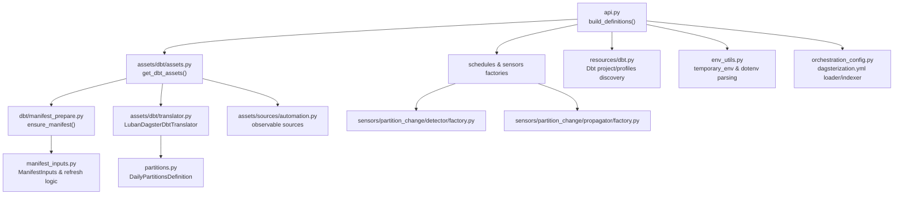
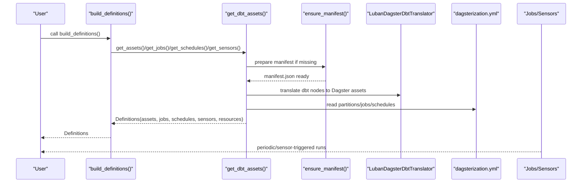
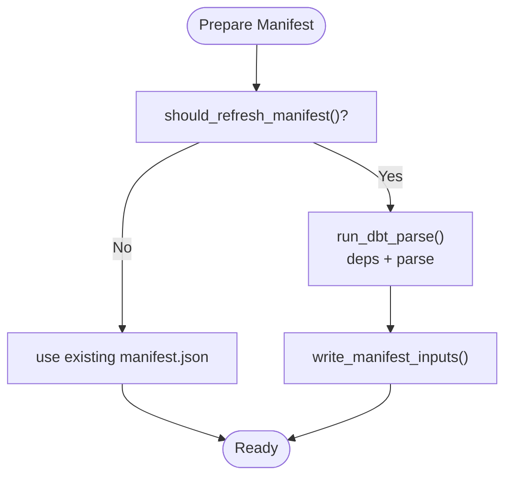
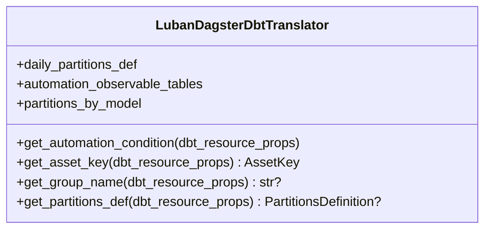
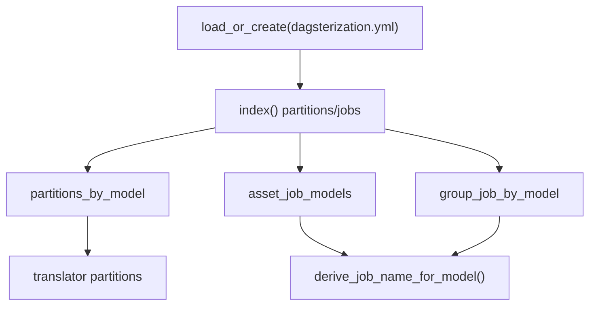
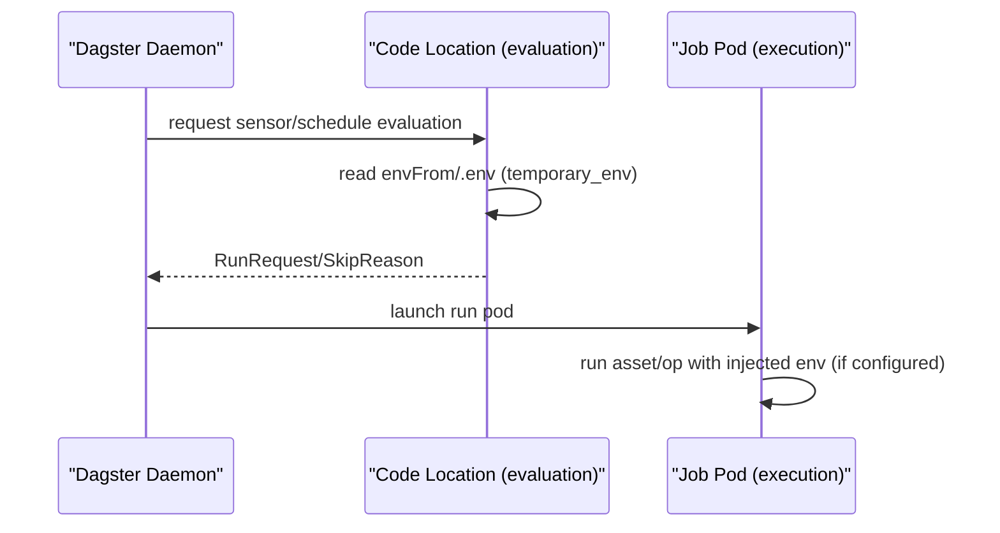
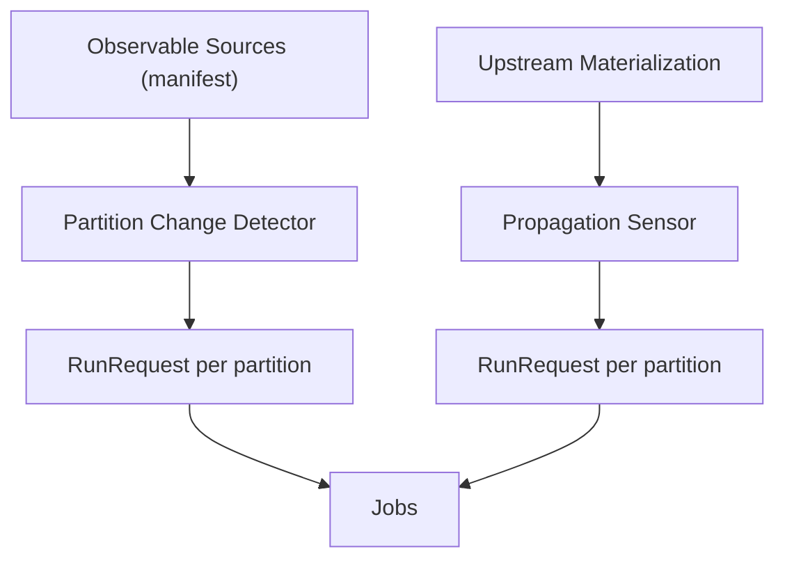
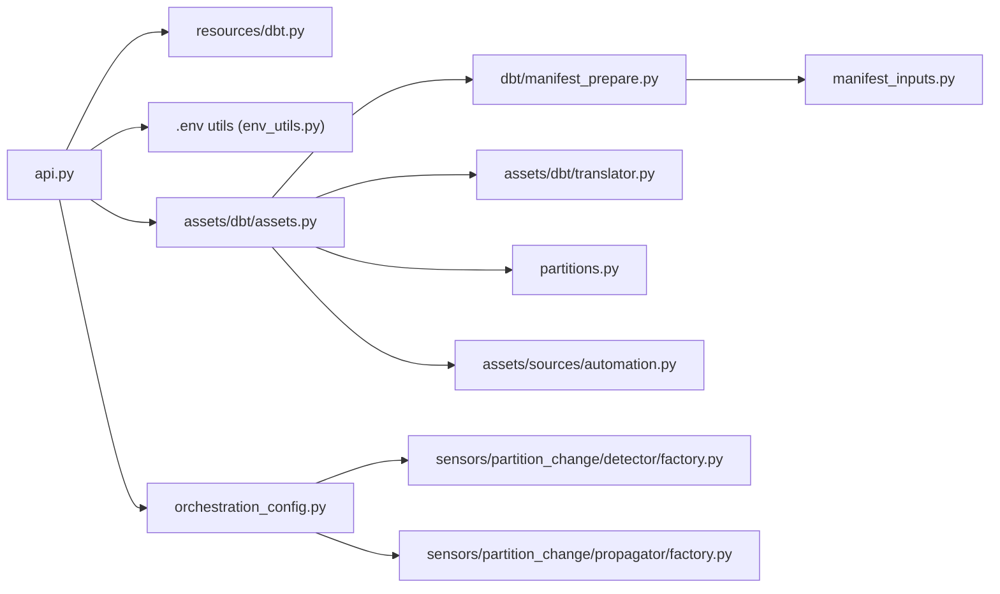

# Core Concepts

<cite>
**Referenced Files in This Document**
- [README.md](file://README.md)
- [docs/concepts/overview.md](file://docs/concepts/overview.md)
- [docs/concepts/execution-model.md](file://docs/concepts/execution-model.md)
- [src/dbt_dagsterizer/api.py](file://src/dbt_dagsterizer/api.py)
- [src/dbt_dagsterizer/__init__.py](file://src/dbt_dagsterizer/__init__.py)
- [src/dbt_dagsterizer/env_utils.py](file://src/dbt_dagsterizer/env_utils.py)
- [src/dbt_dagsterizer/manifest_inputs.py](file://src/dbt_dagsterizer/manifest_inputs.py)
- [src/dbt_dagsterizer/dbt/manifest_prepare.py](file://src/dbt_dagsterizer/dbt/manifest_prepare.py)
- [src/dbt_dagsterizer/dbt/manifest.py](file://src/dbt_dagsterizer/dbt/manifest.py)
- [src/dbt_dagsterizer/assets/dbt/assets.py](file://src/dbt_dagsterizer/assets/dbt/assets.py)
- [src/dbt_dagsterizer/assets/dbt/translator.py](file://src/dbt_dagsterizer/assets/dbt/translator.py)
- [src/dbt_dagsterizer/assets/sources/automation.py](file://src/dbt_dagsterizer/assets/sources/automation.py)
- [src/dbt_dagsterizer/orchestration_config.py](file://src/dbt_dagsterizer/orchestration_config.py)
- [src/dbt_dagsterizer/partitions.py](file://src/dbt_dagsterizer/partitions.py)
- [src/dbt_dagsterizer/resources/dbt.py](file://src/dbt_dagsterizer/resources/dbt.py)
- [src/dbt_dagsterizer/sensors/partition_change/detector/factory.py](file://src/dbt_dagsterizer/sensors/partition_change/detector/factory.py)
- [src/dbt_dagsterizer/sensors/partition_change/propagator/factory.py](file://src/dbt_dagsterizer/sensors/partition_change/propagator/factory.py)
</cite>

## Table of Contents
1. [Introduction](#introduction)
2. [Project Structure](#project-structure)
3. [Core Components](#core-components)
4. [Architecture Overview](#architecture-overview)
5. [Detailed Component Analysis](#detailed-component-analysis)
6. [Dependency Analysis](#dependency-analysis)
7. [Performance Considerations](#performance-considerations)
8. [Troubleshooting Guide](#troubleshooting-guide)
9. [Conclusion](#conclusion)

## Introduction
This document explains the core concepts and architectural principles of dbt-dagsterizer. It focuses on how dbt manifests drive asset generation, how orchestration intent is declared via a YAML configuration, and how the system maintains a mostly-static code location while dynamically generating Dagster assets, jobs, schedules, and sensors. It also covers environment propagation in Kubernetes, partition strategies, observable sources, and the relationship between dbt metadata and Dagster definitions.

## Project Structure
At a high level, dbt-dagsterizer exposes:
- An API to build Dagster Definitions from a dbt project
- Utilities to manage dbt manifest preparation and caching
- Asset generation backed by dbt manifest metadata
- Orchestration configuration via a dedicated YAML file
- Sensors for partition-change detection and propagation
- Environment utilities for dot-env loading and temporary environment overrides

**Diagram sources**
- [src/dbt_dagsterizer/api.py:15-72](file://src/dbt_dagsterizer/api.py#L15-L72)
- [src/dbt_dagsterizer/assets/dbt/assets.py:40-113](file://src/dbt_dagsterizer/assets/dbt/assets.py#L40-L113)
- [src/dbt_dagsterizer/dbt/manifest_prepare.py:57-72](file://src/dbt_dagsterizer/dbt/manifest_prepare.py#L57-L72)
- [src/dbt_dagsterizer/manifest_inputs.py:67-91](file://src/dbt_dagsterizer/manifest_inputs.py#L67-L91)
- [src/dbt_dagsterizer/assets/dbt/translator.py:44-116](file://src/dbt_dagsterizer/assets/dbt/translator.py#L44-L116)
- [src/dbt_dagsterizer/partitions.py:10-21](file://src/dbt_dagsterizer/partitions.py#L10-L21)
- [src/dbt_dagsterizer/sensors/partition_change/detector/factory.py:49-206](file://src/dbt_dagsterizer/sensors/partition_change/detector/factory.py#L49-L206)
- [src/dbt_dagsterizer/sensors/partition_change/propagator/factory.py:10-165](file://src/dbt_dagsterizer/sensors/partition_change/propagator/factory.py#L10-L165)
- [src/dbt_dagsterizer/resources/dbt.py:27-95](file://src/dbt_dagsterizer/resources/dbt.py#L27-L95)
- [src/dbt_dagsterizer/env_utils.py:61-78](file://src/dbt_dagsterizer/env_utils.py#L61-L78)
- [src/dbt_dagsterizer/orchestration_config.py:19-83](file://src/dbt_dagsterizer/orchestration_config.py#L19-L83)
- [src/dbt_dagsterizer/assets/sources/automation.py:15-47](file://src/dbt_dagsterizer/assets/sources/automation.py#L15-L47)

**Section sources**
- [README.md:1-101](file://README.md#L1-L101)
- [docs/concepts/overview.md:1-56](file://docs/concepts/overview.md#L1-L56)

## Core Components
- Manifest-driven asset generation: dbt manifest is the stable interface. AssetKey is relation-based and stable across code locations referencing the same physical table. Group names derive from dbt resource metadata.
- Orchestration intent: a single YAML file declares partitions, jobs, schedules, and partition-change detectors/propagators.
- Always-loadable definitions: when no dbt models exist, a minimal Definitions is returned so code locations remain importable.
- Environment propagation: dot-env files are parsed and temporarily injected; Kubernetes run pods can receive credentials via tags on jobs.

**Section sources**
- [docs/concepts/overview.md:11-56](file://docs/concepts/overview.md#L11-L56)
- [src/dbt_dagsterizer/api.py:15-72](file://src/dbt_dagsterizer/api.py#L15-L72)
- [src/dbt_dagsterizer/env_utils.py:44-78](file://src/dbt_dagsterizer/env_utils.py#L44-L78)
- [README.md:63-80](file://README.md#L63-L80)

## Architecture Overview
The system centers on a manifest-first approach:
- dbt manifest is prepared and cached
- Assets are generated from the manifest using a translator
- Orchestration configuration augments behavior (partitions, jobs, schedules, partition-change sensors)
- Sensors evaluate in the code-server environment and emit RunRequests; jobs execute in run pods

**Diagram sources**
- [src/dbt_dagsterizer/api.py:15-72](file://src/dbt_dagsterizer/api.py#L15-L72)
- [src/dbt_dagsterizer/assets/dbt/assets.py:40-113](file://src/dbt_dagsterizer/assets/dbt/assets.py#L40-L113)
- [src/dbt_dagsterizer/dbt/manifest_prepare.py:57-72](file://src/dbt_dagsterizer/dbt/manifest_prepare.py#L57-L72)
- [src/dbt_dagsterizer/assets/dbt/translator.py:44-116](file://src/dbt_dagsterizer/assets/dbt/translator.py#L44-L116)
- [src/dbt_dagsterizer/orchestration_config.py:19-83](file://src/dbt_dagsterizer/orchestration_config.py#L19-L83)

## Detailed Component Analysis

### Manifest Processing and Asset Generation
- Manifest preparation: ensures target/manifest.json exists and is up-to-date based on .env timestamps and target selection.
- Asset generation: uses dagster-dbt’s dbt_assets decorator with a custom translator to map dbt nodes to Dagster assets.
- Relation-based AssetKey: stable across code locations; group names derive from dbt resource metadata.

**Diagram sources**
- [src/dbt_dagsterizer/dbt/manifest_prepare.py:57-72](file://src/dbt_dagsterizer/dbt/manifest_prepare.py#L57-L72)
- [src/dbt_dagsterizer/manifest_inputs.py:67-91](file://src/dbt_dagsterizer/manifest_inputs.py#L67-L91)

**Section sources**
- [src/dbt_dagsterizer/dbt/manifest_prepare.py:30-72](file://src/dbt_dagsterizer/dbt/manifest_prepare.py#L30-L72)
- [src/dbt_dagsterizer/manifest_inputs.py:24-91](file://src/dbt_dagsterizer/manifest_inputs.py#L24-L91)
- [src/dbt_dagsterizer/assets/dbt/assets.py:40-113](file://src/dbt_dagsterizer/assets/dbt/assets.py#L40-L113)
- [src/dbt_dagsterizer/assets/dbt/translator.py:12-116](file://src/dbt_dagsterizer/assets/dbt/translator.py#L12-L116)

### Translator and Asset Keys
- AssetKey derivation uses physical relation identifiers (database/schema/identifier) to ensure stability.
- Group names come from dbt resource metadata; for models, the first folder under models/ is used.
- Partitions are applied based on orchestration configuration.

**Diagram sources**
- [src/dbt_dagsterizer/assets/dbt/translator.py:44-116](file://src/dbt_dagsterizer/assets/dbt/translator.py#L44-L116)

**Section sources**
- [src/dbt_dagsterizer/assets/dbt/translator.py:12-116](file://src/dbt_dagsterizer/assets/dbt/translator.py#L12-L116)
- [src/dbt_dagsterizer/partitions.py:10-21](file://src/dbt_dagsterizer/partitions.py#L10-L21)

### Orchestration Intent via YAML
- The YAML file (default path: dagsterization.yml) defines:
  - Partitions: daily or unpartitioned per model
  - Jobs: model lists, include_upstream flag, partitioning
  - Schedules: daily_at with offset_days and lookback_days
  - Partition-change detectors and propagators: configuration for watermark detection and downstream propagation
- Indexing validates uniqueness and builds lookup maps for jobs and partitions.

**Diagram sources**
- [src/dbt_dagsterizer/orchestration_config.py:19-83](file://src/dbt_dagsterizer/orchestration_config.py#L19-L83)
- [src/dbt_dagsterizer/orchestration_config.py:112-158](file://src/dbt_dagsterizer/orchestration_config.py#L112-L158)
- [src/dbt_dagsterizer/orchestration_config.py:360-370](file://src/dbt_dagsterizer/orchestration_config.py#L360-L370)

**Section sources**
- [src/dbt_dagsterizer/orchestration_config.py:19-370](file://src/dbt_dagsterizer/orchestration_config.py#L19-L370)

### Execution Model and Environment Propagation
- Evaluation vs execution:
  - Sensors/schedules evaluate in the code-server environment
  - Jobs run in separate Kubernetes pods when using K8sRunLauncher
- Environment propagation:
  - Dot-env files are parsed and temporarily injected
  - For Kubernetes, run pods can receive envFrom via job tags configured from environment variables on the code-server Deployment

**Diagram sources**
- [docs/concepts/execution-model.md:1-65](file://docs/concepts/execution-model.md#L1-L65)
- [src/dbt_dagsterizer/env_utils.py:61-78](file://src/dbt_dagsterizer/env_utils.py#L61-L78)
- [README.md:63-80](file://README.md#L63-L80)

**Section sources**
- [docs/concepts/execution-model.md:1-65](file://docs/concepts/execution-model.md#L1-L65)
- [src/dbt_dagsterizer/env_utils.py:8-78](file://src/dbt_dagsterizer/env_utils.py#L8-L78)
- [README.md:63-80](file://README.md#L63-L80)

### Partition Strategies and Incremental vs Full Refresh
- Daily partitions are supported via a daily partitions definition; start date is required via environment variable.
- Partition-change detectors compute watermarks over a window and emit RunRequests for changed partitions.
- Propagation sensors react to upstream materializations and trigger downstream jobs for affected partitions.
- Observable sources: dbt sources with luban meta can declare watermark columns/sql for automation.

**Diagram sources**
- [src/dbt_dagsterizer/assets/sources/automation.py:15-47](file://src/dbt_dagsterizer/assets/sources/automation.py#L15-L47)
- [src/dbt_dagsterizer/sensors/partition_change/detector/factory.py:49-206](file://src/dbt_dagsterizer/sensors/partition_change/detector/factory.py#L49-L206)
- [src/dbt_dagsterizer/sensors/partition_change/propagator/factory.py:10-165](file://src/dbt_dagsterizer/sensors/partition_change/propagator/factory.py#L10-L165)
- [src/dbt_dagsterizer/partitions.py:10-21](file://src/dbt_dagsterizer/partitions.py#L10-L21)

**Section sources**
- [src/dbt_dagsterizer/partitions.py:10-21](file://src/dbt_dagsterizer/partitions.py#L10-L21)
- [src/dbt_dagsterizer/sensors/partition_change/detector/factory.py:49-206](file://src/dbt_dagsterizer/sensors/partition_change/detector/factory.py#L49-L206)
- [src/dbt_dagsterizer/sensors/partition_change/propagator/factory.py:10-165](file://src/dbt_dagsterizer/sensors/partition_change/propagator/factory.py#L10-L165)
- [src/dbt_dagsterizer/assets/sources/automation.py:15-47](file://src/dbt_dagsterizer/assets/sources/automation.py#L15-L47)

### Static Code Location Philosophy and Dynamic Generation
- The API returns a fully-formed Definitions regardless of dbt model presence, enabling skeleton repos to import successfully.
- dbt-dagsterizer remains a runtime import in the Dagster code location; the CLI is for bootstrapping and maintenance.

**Section sources**
- [src/dbt_dagsterizer/api.py:15-72](file://src/dbt_dagsterizer/api.py#L15-L72)
- [README.md:25-28](file://README.md#L25-L28)

## Dependency Analysis
High-level dependencies among core modules:

**Diagram sources**
- [src/dbt_dagsterizer/api.py:15-72](file://src/dbt_dagsterizer/api.py#L15-L72)
- [src/dbt_dagsterizer/resources/dbt.py:27-95](file://src/dbt_dagsterizer/resources/dbt.py#L27-L95)
- [src/dbt_dagsterizer/env_utils.py:44-78](file://src/dbt_dagsterizer/env_utils.py#L44-L78)
- [src/dbt_dagsterizer/orchestration_config.py:19-83](file://src/dbt_dagsterizer/orchestration_config.py#L19-L83)
- [src/dbt_dagsterizer/assets/dbt/assets.py:40-113](file://src/dbt_dagsterizer/assets/dbt/assets.py#L40-L113)
- [src/dbt_dagsterizer/dbt/manifest_prepare.py:57-72](file://src/dbt_dagsterizer/dbt/manifest_prepare.py#L57-L72)
- [src/dbt_dagsterizer/assets/dbt/translator.py:44-116](file://src/dbt_dagsterizer/assets/dbt/translator.py#L44-L116)
- [src/dbt_dagsterizer/partitions.py:10-21](file://src/dbt_dagsterizer/partitions.py#L10-L21)
- [src/dbt_dagsterizer/assets/sources/automation.py:15-47](file://src/dbt_dagsterizer/assets/sources/automation.py#L15-L47)
- [src/dbt_dagsterizer/manifest_inputs.py:24-91](file://src/dbt_dagsterizer/manifest_inputs.py#L24-L91)
- [src/dbt_dagsterizer/sensors/partition_change/detector/factory.py:49-206](file://src/dbt_dagsterizer/sensors/partition_change/detector/factory.py#L49-L206)
- [src/dbt_dagsterizer/sensors/partition_change/propagator/factory.py:10-165](file://src/dbt_dagsterizer/sensors/partition_change/propagator/factory.py#L10-L165)

**Section sources**
- [src/dbt_dagsterizer/api.py:15-72](file://src/dbt_dagsterizer/api.py#L15-L72)
- [src/dbt_dagsterizer/dbt/manifest_prepare.py:57-72](file://src/dbt_dagsterizer/dbt/manifest_prepare.py#L57-L72)
- [src/dbt_dagsterizer/orchestration_config.py:19-370](file://src/dbt_dagsterizer/orchestration_config.py#L19-L370)

## Performance Considerations
- Manifest caching avoids repeated dbt parse calls; refresh occurs when .env files change or target changes.
- Partition-change detectors and propagators minimize unnecessary runs by tracking cursors and watermarks.
- Using relation-based AssetKeys reduces rework when moving assets across code locations.

[No sources needed since this section provides general guidance]

## Troubleshooting Guide
- Manifest not found or outdated:
  - Ensure DBT_PROJECT_DIR and DBT_PROFILES_DIR are set or discoverable
  - Confirm .env files exist and are parsed; manifest refresh depends on .env timestamps
- Missing dbt_project.yml:
  - Set LUBAN_REPO_ROOT or DBT_PROJECT_DIR appropriately
- Kubernetes run pod credentials:
  - Configure LUBAN_RUN_ENV_CONFIGMAP/LUBAN_RUN_ENV_SECRET on the code-server Deployment to inject envFrom into run pods
- Partition-change sensors:
  - Detectors skip when relations are missing; verify detect_relation and schema
  - Propagation sensors rely on event log entries; ensure upstream assets are materialized

**Section sources**
- [src/dbt_dagsterizer/dbt/manifest_prepare.py:57-72](file://src/dbt_dagsterizer/dbt/manifest_prepare.py#L57-L72)
- [src/dbt_dagsterizer/manifest_inputs.py:67-91](file://src/dbt_dagsterizer/manifest_inputs.py#L67-L91)
- [src/dbt_dagsterizer/resources/dbt.py:27-95](file://src/dbt_dagsterizer/resources/dbt.py#L27-L95)
- [README.md:63-80](file://README.md#L63-L80)
- [src/dbt_dagsterizer/sensors/partition_change/detector/factory.py:108-127](file://src/dbt_dagsterizer/sensors/partition_change/detector/factory.py#L108-L127)

## Conclusion
dbt-dagsterizer aligns Dagster automation with dbt’s manifest, keeping code locations static while enabling dynamic generation of assets, jobs, schedules, and sensors. Orchestration intent is captured in a small, reviewable YAML file. The system emphasizes environment propagation clarity, partition strategies, and observable sources to build reliable, maintainable pipelines.