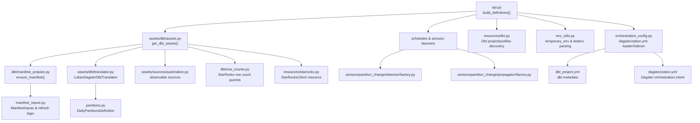
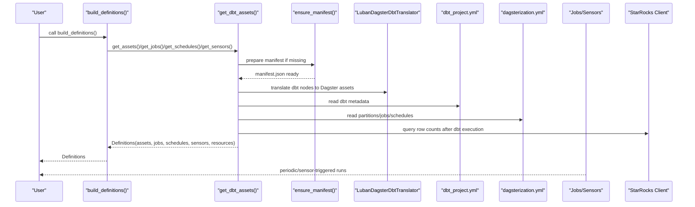
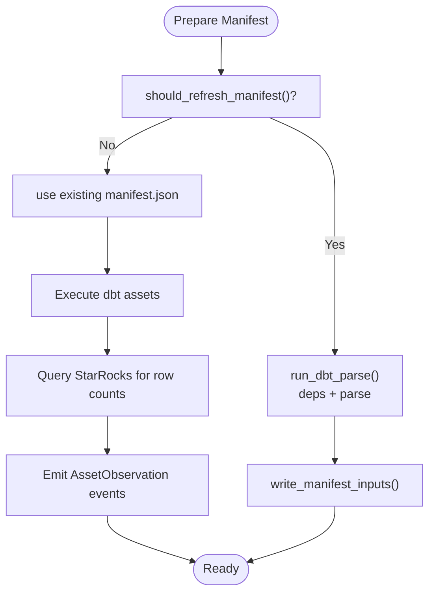
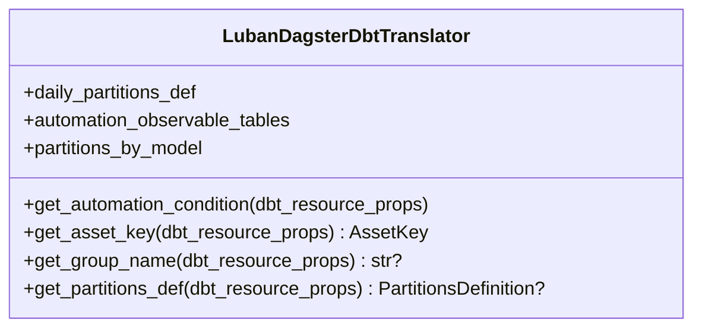
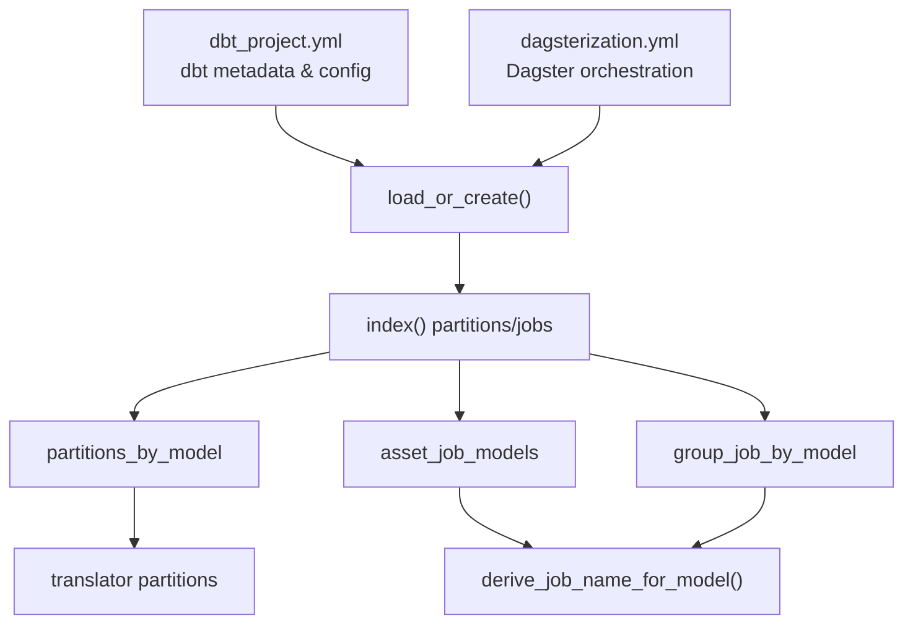
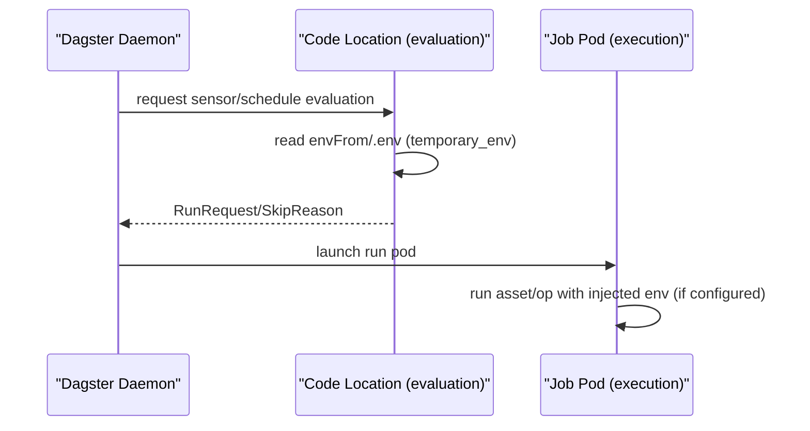
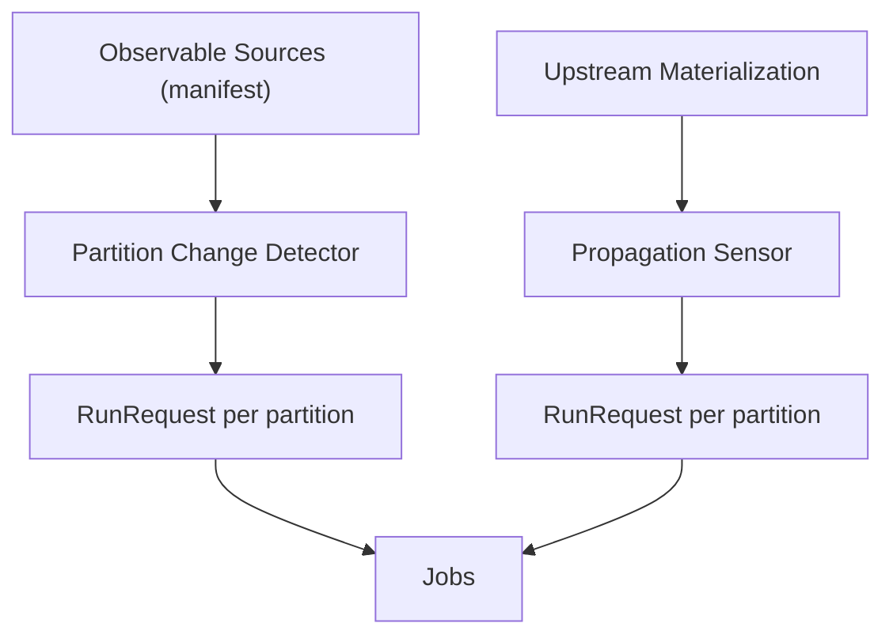
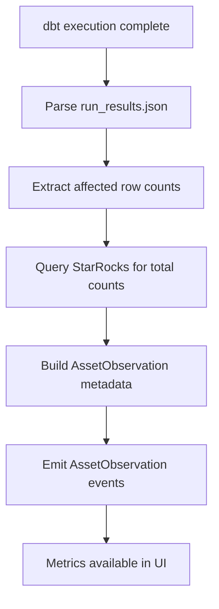
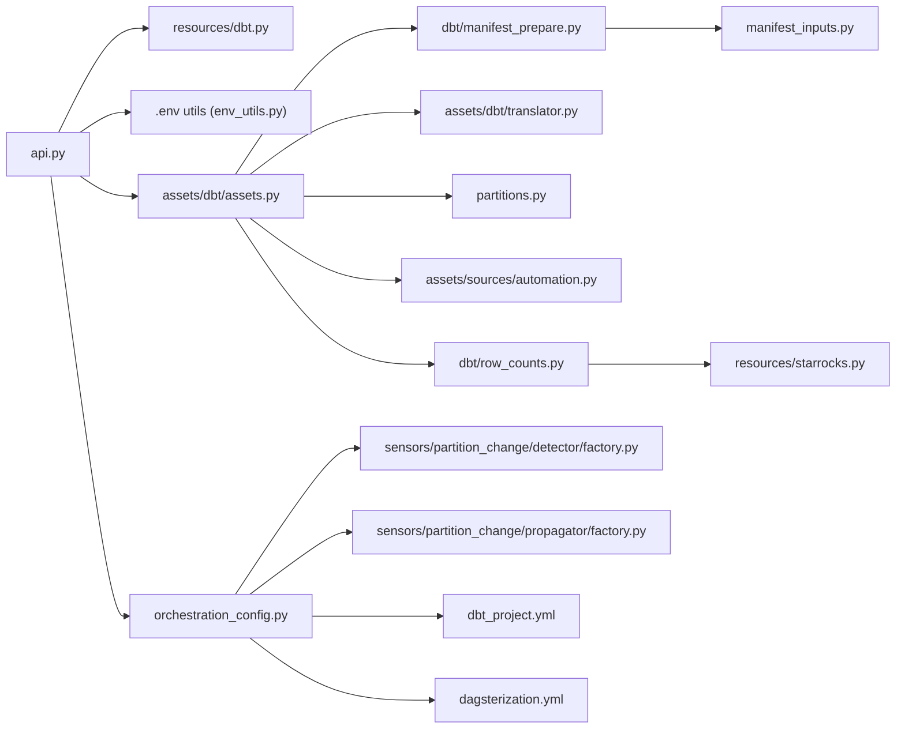

# Core Concepts

<cite>
**Referenced Files in This Document**
- [README.md](file://docs/README.md)
- [docs/concepts/overview.md](file://docs/concepts/overview.md)
- [docs/concepts/execution-model.md](file://docs/concepts/execution-model.md)
- [docs/concepts/dagsterization-yml.md](file://docs/concepts/dagsterization-yml.md)
- [docs/observability.md](file://docs/observability.md)
- [src/dbt_dagsterizer/api.py](file://src/dbt_dagsterizer/api.py)
- [src/dbt_dagsterizer/__init__.py](file://src/dbt_dagsterizer/__init__.py)
- [src/dbt_dagsterizer/env_utils.py](file://src/dbt_dagsterizer/env_utils.py)
- [src/dbt_dagsterizer/manifest_inputs.py](file://src/dbt_dagsterizer/manifest_inputs.py)
- [src/dbt_dagsterizer/dbt/manifest_prepare.py](file://src/dbt_dagsterizer/dbt/manifest_prepare.py)
- [src/dbt_dagsterizer/dbt/manifest.py](file://src/dbt_dagsterizer/dbt/manifest.py)
- [src/dbt_dagsterizer/dbt/row_counts.py](file://src/dbt_dagsterizer/dbt/row_counts.py)
- [src/dbt_dagsterizer/assets/dbt/assets.py](file://src/dbt_dagsterizer/assets/dbt/assets.py)
- [src/dbt_dagsterizer/assets/dbt/translator.py](file://src/dbt_dagsterizer/assets/dbt/translator.py)
- [src/dbt_dagsterizer/assets/sources/automation.py](file://src/dbt_dagsterizer/assets/sources/automation.py)
- [src/dbt_dagsterizer/assets/sources/factory.py](file://src/dbt_dagsterizer/assets/sources/factory.py)
- [src/dbt_dagsterizer/orchestration_config.py](file://src/dbt_dagsterizer/orchestration_config.py)
- [src/dbt_dagsterizer/partitions.py](file://src/dbt_dagsterizer/partitions.py)
- [src/dbt_dagsterizer/resources/dbt.py](file://src/dbt_dagsterizer/resources/dbt.py)
- [src/dbt_dagsterizer/resources/starrocks.py](file://src/dbt_dagsterizer/resources/starrocks.py)
- [src/dbt_dagsterizer/sensors/partition_change/detector/factory.py](file://src/dbt_dagsterizer/sensors/partition_change/detector/factory.py)
- [src/dbt_dagsterizer/sensors/partition_change/propagator/factory.py](file://src/dbt_dagsterizer/sensors/partition_change/propagator/factory.py)
</cite>

## Update Summary
**Changes Made**
- Added comprehensive documentation for the new row count tracking observability feature
- Documented StarRocks integration for accurate row counting with AssetObservation events
- Updated observability section to include row count metadata collection
- Enhanced asset generation documentation to cover automatic row count emission
- Added environment variable configuration for StarRocks connectivity

## Table of Contents
1. [Introduction](#introduction)
2. [Project Structure](#project-structure)
3. [Core Components](#core-components)
4. [Architecture Overview](#architecture-overview)
5. [Detailed Component Analysis](#detailed-component-analysis)
6. [Row Count Tracking Observability](#row-count-tracking-observability)
7. [Dependency Analysis](#dependency-analysis)
8. [Performance Considerations](#performance-considerations)
9. [Troubleshooting Guide](#troubleshooting-guide)
10. [Conclusion](#conclusion)

## Introduction
This document explains the core concepts and architectural principles of dbt-dagsterizer. It focuses on how dbt manifests drive asset generation, how orchestration intent is declared via YAML configuration files, and how the system maintains a mostly-static code location while dynamically generating Dagster assets, jobs, schedules, and sensors. The system operates on two complementary YAML files: `dbt_project.yml` (dbt metadata) and `dagsterization.yml` (Dagster orchestration intent), which together form the single source of truth for pipeline configuration. **Updated**: The system now includes advanced observability features with automatic row count tracking through StarRocks integration.

## Project Structure
At a high level, dbt-dagsterizer exposes:
- An API to build Dagster Definitions from a dbt project
- Utilities to manage dbt manifest preparation and caching
- Asset generation backed by dbt manifest metadata
- Dual-file orchestration configuration via dbt_project.yml and dagsterization.yml
- Sensors for partition-change detection and propagation
- Environment utilities for dot-env loading and temporary environment overrides
- **New**: Row count tracking observability with StarRocks integration

**Diagram sources**
- [src/dbt_dagsterizer/api.py:15-72](file://src/dbt_dagsterizer/api.py#L15-L72)
- [src/dbt_dagsterizer/assets/dbt/assets.py:40-113](file://src/dbt_dagsterizer/assets/dbt/assets.py#L40-L113)
- [src/dbt_dagsterizer/dbt/manifest_prepare.py:57-72](file://src/dbt_dagsterizer/dbt/manifest_prepare.py#L57-L72)
- [src/dbt_dagsterizer/manifest_inputs.py:67-91](file://src/dbt_dagsterizer/manifest_inputs.py#L67-L91)
- [src/dbt_dagsterizer/assets/dbt/translator.py:44-116](file://src/dbt_dagsterizer/assets/dbt/translator.py#L44-L116)
- [src/dbt_dagsterizer/partitions.py:10-21](file://src/dbt_dagsterizer/partitions.py#L10-L21)
- [src/dbt_dagsterizer/sensors/partition_change/detector/factory.py:49-206](file://src/dbt_dagsterizer/sensors/partition_change/detector/factory.py#L49-L206)
- [src/dbt_dagsterizer/sensors/partition_change/propagator/factory.py:10-165](file://src/dbt_dagsterizer/sensors/partition_change/propagator/factory.py#L10-L165)
- [src/dbt_dagsterizer/resources/dbt.py:27-95](file://src/dbt_dagsterizer/resources/dbt.py#L27-L95)
- [src/dbt_dagsterizer/env_utils.py:61-78](file://src/dbt_dagsterizer/env_utils.py#L61-L78)
- [src/dbt_dagsterizer/orchestration_config.py:19-83](file://src/dbt_dagsterizer/orchestration_config.py#L19-L83)
- [src/dbt_dagsterizer/assets/sources/automation.py:15-47](file://src/dbt_dagsterizer/assets/sources/automation.py#L15-L47)
- [src/dbt_dagsterizer/dbt/row_counts.py:1-68](file://src/dbt_dagsterizer/dbt/row_counts.py#L1-68)
- [src/dbt_dagsterizer/resources/starrocks.py:1-65](file://src/dbt_dagsterizer/resources/starrocks.py#L1-65)

**Section sources**
- [README.md:1-25](file://docs/README.md#L1-L25)
- [docs/concepts/overview.md:1-57](file://docs/concepts/overview.md#L1-L57)

## Core Components
- **Manifest-driven asset generation**: dbt manifest is the stable interface. AssetKey is relation-based and stable across code locations referencing the same physical table. Group names derive from dbt resource metadata.
- **Dual-file orchestration**: Two complementary YAML files form the single source of truth:
  - `dbt_project.yml`: dbt metadata and project configuration
  - `dagsterization.yml`: Dagster orchestration intent and pipeline configuration
- **Always-loadable definitions**: when no dbt models exist, a minimal Definitions is returned so code locations remain importable.
- **Environment propagation**: dot-env files are parsed and temporarily injected; Kubernetes run pods can receive credentials via tags on jobs.
- **Enhanced observability**: Automatic row count tracking with StarRocks integration for accurate metrics collection.

**Section sources**
- [docs/concepts/overview.md:11-57](file://docs/concepts/overview.md#L11-L57)
- [docs/concepts/dagsterization-yml.md:1-636](file://docs/concepts/dagsterization-yml.md#L1-L636)
- [src/dbt_dagsterizer/api.py:15-72](file://src/dbt_dagsterizer/api.py#L15-L72)
- [src/dbt_dagsterizer/env_utils.py:44-78](file://src/dbt_dagsterizer/env_utils.py#L44-L78)

## Architecture Overview
The system centers on a manifest-first approach with dual-file orchestration:
- dbt manifest is prepared and cached
- Assets are generated from the manifest using a translator
- Both dbt_project.yml and dagsterization.yml orchestration configuration augment behavior
- Sensors evaluate in the code-server environment and emit RunRequests; jobs execute in run pods
- **Updated**: Row count tracking is automatically performed after dbt execution using StarRocks for accurate metrics

**Diagram sources**
- [src/dbt_dagsterizer/api.py:15-72](file://src/dbt_dagsterizer/api.py#L15-L72)
- [src/dbt_dagsterizer/assets/dbt/assets.py:40-113](file://src/dbt_dagsterizer/assets/dbt/assets.py#L40-L113)
- [src/dbt_dagsterizer/dbt/manifest_prepare.py:57-72](file://src/dbt_dagsterizer/dbt/manifest_prepare.py#L57-L72)
- [src/dbt_dagsterizer/assets/dbt/translator.py:44-116](file://src/dbt_dagsterizer/assets/dbt/translator.py#L44-L116)
- [src/dbt_dagsterizer/orchestration_config.py:19-83](file://src/dbt_dagsterizer/orchestration_config.py#L19-L83)

## Detailed Component Analysis

### Manifest Processing and Asset Generation
- Manifest preparation: ensures target/manifest.json exists and is up-to-date based on .env timestamps and target selection.
- Asset generation: uses dagster-dbt's dbt_assets decorator with a custom translator to map dbt nodes to Dagster assets.
- Relation-based AssetKey: stable across code locations; group names derive from dbt resource metadata.
- **Updated**: Automatic row count emission after dbt execution using StarRocks for accurate metrics.

**Diagram sources**
- [src/dbt_dagsterizer/dbt/manifest_prepare.py:57-72](file://src/dbt_dagsterizer/dbt/manifest_prepare.py#L57-L72)
- [src/dbt_dagsterizer/manifest_inputs.py:67-91](file://src/dbt_dagsterizer/manifest_inputs.py#L67-L91)
- [src/dbt_dagsterizer/assets/dbt/assets.py:43-143](file://src/dbt_dagsterizer/assets/dbt/assets.py#L43-L143)

**Section sources**
- [src/dbt_dagsterizer/dbt/manifest_prepare.py:30-72](file://src/dbt_dagsterizer/dbt/manifest_prepare.py#L30-L72)
- [src/dbt_dagsterizer/manifest_inputs.py:24-91](file://src/dbt_dagsterizer/manifest_inputs.py#L24-L91)
- [src/dbt_dagsterizer/assets/dbt/assets.py:40-113](file://src/dbt_dagsterizer/assets/dbt/assets.py#L40-L113)
- [src/dbt_dagsterizer/assets/dbt/translator.py:12-116](file://src/dbt_dagsterizer/assets/dbt/translator.py#L12-L116)

### Translator and Asset Keys
- AssetKey derivation uses physical relation identifiers (database/schema/identifier) to ensure stability.
- Group names come from dbt resource metadata; for models, the first folder under models/ is used.
- Partitions are applied based on orchestration configuration.

**Diagram sources**
- [src/dbt_dagsterizer/assets/dbt/translator.py:44-116](file://src/dbt_dagsterizer/assets/dbt/translator.py#L44-L116)

**Section sources**
- [src/dbt_dagsterizer/assets/dbt/translator.py:12-116](file://src/dbt_dagsterizer/assets/dbt/translator.py#L12-L116)
- [src/dbt_dagsterizer/partitions.py:10-21](file://src/dbt_dagsterizer/partitions.py#L10-L21)

### Dual-File Orchestration: dbt_project.yml and dagsterization.yml
- **dbt_project.yml**: Contains dbt metadata, project configuration, and model definitions
- **dagsterization.yml**: Contains Dagster orchestration intent, partitioning strategies, job definitions, schedules, and partition-change sensors
- **Single source of truth**: Together these files provide complete pipeline configuration
- **Separation of concerns**: dbt handles data modeling, Dagster handles orchestration and execution

**Diagram sources**
- [src/dbt_dagsterizer/orchestration_config.py:19-83](file://src/dbt_dagsterizer/orchestration_config.py#L19-L83)
- [src/dbt_dagsterizer/orchestration_config.py:112-158](file://src/dbt_dagsterizer/orchestration_config.py#L112-L158)
- [src/dbt_dagsterizer/orchestration_config.py:360-370](file://src/dbt_dagsterizer/orchestration_config.py#L360-L370)

**Section sources**
- [src/dbt_dagsterizer/orchestration_config.py:19-370](file://src/dbt_dagsterizer/orchestration_config.py#L19-L370)
- [docs/concepts/dagsterization-yml.md:1-636](file://docs/concepts/dagsterization-yml.md#L1-L636)

### Execution Model and Environment Propagation
- Evaluation vs execution:
  - Sensors/schedules evaluate in the code-server environment
  - Jobs run in separate Kubernetes pods when using K8sRunLauncher
- Environment propagation:
  - Dot-env files are parsed and temporarily injected
  - For Kubernetes, run pods can receive envFrom via job tags configured from environment variables on the code-server Deployment

**Diagram sources**
- [docs/concepts/execution-model.md:1-65](file://docs/concepts/execution-model.md#L1-L65)
- [src/dbt_dagsterizer/env_utils.py:61-78](file://src/dbt_dagsterizer/env_utils.py#L61-L78)
- [README.md:63-80](file://README.md#L63-L80)

**Section sources**
- [docs/concepts/execution-model.md:1-65](file://docs/concepts/execution-model.md#L1-L65)
- [src/dbt_dagsterizer/env_utils.py:8-78](file://src/dbt_dagsterizer/env_utils.py#L8-L78)
- [README.md:63-80](file://README.md#L63-L80)

### Partition Strategies and Incremental vs Full Refresh
- Daily partitions are supported via a daily partitions definition; start date is required via environment variable.
- Partition-change detectors compute watermarks over a window and emit RunRequests for changed partitions.
- Propagation sensors react to upstream materializations and trigger downstream jobs for affected partitions.
- Observable sources: dbt sources with luban meta can declare watermark columns/sql for automation.

**Diagram sources**
- [src/dbt_dagsterizer/assets/sources/automation.py:15-47](file://src/dbt_dagsterizer/assets/sources/automation.py#L15-L47)
- [src/dbt_dagsterizer/sensors/partition_change/detector/factory.py:49-206](file://src/dbt_dagsterizer/sensors/partition_change/detector/factory.py#L49-L206)
- [src/dbt_dagsterizer/sensors/partition_change/propagator/factory.py:10-165](file://src/dbt_dagsterizer/sensors/partition_change/propagator/factory.py#L10-L165)
- [src/dbt_dagsterizer/partitions.py:10-21](file://src/dbt_dagsterizer/partitions.py#L10-L21)

**Section sources**
- [src/dbt_dagsterizer/partitions.py:10-21](file://src/dbt_dagsterizer/partitions.py#L10-L21)
- [src/dbt_dagsterizer/sensors/partition_change/detector/factory.py:49-206](file://src/dbt_dagsterizer/sensors/partition_change/detector/factory.py#L49-L206)
- [src/dbt_dagsterizer/sensors/partition_change/propagator/factory.py:10-165](file://src/dbt_dagsterizer/sensors/partition_change/propagator/factory.py#L10-L165)
- [src/dbt_dagsterizer/assets/sources/automation.py:15-47](file://src/dbt_dagsterizer/assets/sources/automation.py#L15-L47)

### Static Code Location Philosophy and Dynamic Generation
- The API returns a fully-formed Definitions regardless of dbt model presence, enabling skeleton repos to import successfully.
- dbt-dagsterizer remains a runtime import in the Dagster code location; the CLI is for bootstrapping and maintenance.

**Section sources**
- [src/dbt_dagsterizer/api.py:15-72](file://src/dbt_dagsterizer/api.py#L15-L72)
- [README.md:25-28](file://README.md#L25-L28)

## Row Count Tracking Observability

**New Feature**: dbt-dagsterizer now includes advanced row count tracking observability through StarRocks integration. This feature automatically collects and emits accurate row count metrics for dbt models after execution.

### Automatic Row Count Collection
- **Primary source**: Direct StarRocks queries for accurate row counts
- **Fallback source**: dbt run_results.json adapter_response for affected row counts
- **Event emission**: Uses AssetObservation events to publish metrics to Dagster's asset metadata

### StarRocks Integration
The system includes a dedicated StarRocks client that:
- Connects to StarRocks clusters using configurable environment variables
- Executes COUNT(*) queries for accurate row count measurements
- Handles connection pooling and error recovery
- Supports database-specific query construction

### Metadata Emission
Two types of row count metadata are emitted:
1. **last_run_affected_row_count**: Number of rows affected by the last dbt operation
2. **dagster/row_count**: Total row count in the table (queried from StarRocks)

### Configuration Requirements
Environment variables for StarRocks connectivity:
- `STARROCKS_HOST`: StarRocks server hostname (default: localhost)
- `STARROCKS_PORT`: StarRocks server port (default: 9030)
- `STARROCKS_USER`: Authentication username (default: root)
- `STARROCKS_PASSWORD`: Authentication password
- `STARROCKS_<SOURCE>_DB`: Database name overrides for specific sources

### Implementation Details
The row count tracking is integrated into the asset execution flow:
1. dbt execution completes successfully
2. System parses run_results.json to extract affected row counts
3. For each affected model, queries StarRocks for total row count
4. Emits AssetObservation events with both metrics
5. Metrics are available in Dagster's asset metadata and observability dashboards

**Diagram sources**
- [src/dbt_dagsterizer/assets/dbt/assets.py:43-143](file://src/dbt_dagsterizer/assets/dbt/assets.py#L43-L143)
- [src/dbt_dagsterizer/dbt/row_counts.py:36-67](file://src/dbt_dagsterizer/dbt/row_counts.py#L36-L67)
- [src/dbt_dagsterizer/resources/starrocks.py:58-64](file://src/dbt_dagsterizer/resources/starrocks.py#L58-L64)

**Section sources**
- [src/dbt_dagsterizer/assets/dbt/assets.py:43-143](file://src/dbt_dagsterizer/assets/dbt/assets.py#L43-L143)
- [src/dbt_dagsterizer/dbt/row_counts.py:1-68](file://src/dbt_dagsterizer/dbt/row_counts.py#L1-68)
- [src/dbt_dagsterizer/resources/starrocks.py:1-65](file://src/dbt_dagsterizer/resources/starrocks.py#L1-65)
- [src/dbt_dagsterizer/assets/sources/factory.py:65-102](file://src/dbt_dagsterizer/assets/sources/factory.py#L65-L102)

## Dependency Analysis
High-level dependencies among core modules:

**Diagram sources**
- [src/dbt_dagsterizer/api.py:15-72](file://src/dbt_dagsterizer/api.py#L15-L72)
- [src/dbt_dagsterizer/resources/dbt.py:27-95](file://src/dbt_dagsterizer/resources/dbt.py#L27-L95)
- [src/dbt_dagsterizer/env_utils.py:44-78](file://src/dbt_dagsterizer/env_utils.py#L44-L78)
- [src/dbt_dagsterizer/orchestration_config.py:19-83](file://src/dbt_dagsterizer/orchestration_config.py#L19-L83)
- [src/dbt_dagsterizer/assets/dbt/assets.py:40-113](file://src/dbt_dagsterizer/assets/dbt/assets.py#L40-L113)
- [src/dbt_dagsterizer/dbt/manifest_prepare.py:57-72](file://src/dbt_dagsterizer/dbt/manifest_prepare.py#L57-L72)
- [src/dbt_dagsterizer/assets/dbt/translator.py:44-116](file://src/dbt_dagsterizer/assets/dbt/translator.py#L44-L116)
- [src/dbt_dagsterizer/partitions.py:10-21](file://src/dbt_dagsterizer/partitions.py#L10-L21)
- [src/dbt_dagsterizer/assets/sources/automation.py:15-47](file://src/dbt_dagsterizer/assets/sources/automation.py#L15-L47)
- [src/dbt_dagsterizer/manifest_inputs.py:24-91](file://src/dbt_dagsterizer/manifest_inputs.py#L24-L91)
- [src/dbt_dagsterizer/sensors/partition_change/detector/factory.py:49-206](file://src/dbt_dagsterizer/sensors/partition_change/detector/factory.py#L49-L206)
- [src/dbt_dagsterizer/sensors/partition_change/propagator/factory.py:10-165](file://src/dbt_dagsterizer/sensors/partition_change/propagator/factory.py#L10-L165)
- [src/dbt_dagsterizer/dbt/row_counts.py:1-68](file://src/dbt_dagsterizer/dbt/row_counts.py#L1-68)
- [src/dbt_dagsterizer/resources/starrocks.py:1-65](file://src/dbt_dagsterizer/resources/starrocks.py#L1-65)

**Section sources**
- [src/dbt_dagsterizer/api.py:15-72](file://src/dbt_dagsterizer/api.py#L15-L72)
- [src/dbt_dagsterizer/dbt/manifest_prepare.py:57-72](file://src/dbt_dagsterizer/dbt/manifest_prepare.py#L57-L72)
- [src/dbt_dagsterizer/orchestration_config.py:19-370](file://src/dbt_dagsterizer/orchestration_config.py#L19-L370)

## Performance Considerations
- Manifest caching avoids repeated dbt parse calls; refresh occurs when .env files change or target changes.
- Partition-change detectors and propagators minimize unnecessary runs by tracking cursors and watermarks.
- Using relation-based AssetKeys reduces rework when moving assets across code locations.
- **Updated**: Row count queries are executed after dbt completion and use efficient COUNT(*) queries; consider connection pooling for high-throughput environments.

## Troubleshooting Guide
- Manifest not found or outdated:
  - Ensure DBT_PROJECT_DIR and DBT_PROFILES_DIR are set or discoverable
  - Confirm .env files exist and are parsed; manifest refresh depends on .env timestamps
- Missing dbt_project.yml:
  - Set LUBAN_REPO_ROOT or DBT_PROJECT_DIR appropriately
- Missing dagsterization.yml:
  - Initialize with `dbt-dagsterizer meta init` or create manually
  - Both files are required for complete orchestration
- Kubernetes run pod credentials:
  - Configure LUBAN_RUN_ENV_CONFIGMAP/LUBAN_RUN_ENV_SECRET on the code-server Deployment to inject envFrom into run pods
- Partition-change sensors:
  - Detectors skip when relations are missing; verify detect_relation and schema
  - Propagation sensors rely on event log entries; ensure upstream assets are materialized
- **New**: Row count tracking issues:
  - Verify StarRocks connectivity with STARROCKS_HOST, STARROCKS_PORT, STARROCKS_USER, STARROCKS_PASSWORD
  - Check that StarRocks queries execute successfully for affected models
  - Ensure database permissions allow COUNT(*) queries on target tables

**Section sources**
- [src/dbt_dagsterizer/dbt/manifest_prepare.py:57-72](file://src/dbt_dagsterizer/dbt/manifest_prepare.py#L57-L72)
- [src/dbt_dagsterizer/manifest_inputs.py:67-91](file://src/dbt_dagsterizer/manifest_inputs.py#L67-L91)
- [src/dbt_dagsterizer/resources/dbt.py:27-95](file://src/dbt_dagsterizer/resources/dbt.py#L27-L95)
- [README.md:63-80](file://README.md#L63-L80)
- [src/dbt_dagsterizer/sensors/partition_change/detector/factory.py:108-127](file://src/dbt_dagsterizer/sensors/partition_change/detector/factory.py#L108-L127)

## Conclusion
dbt-dagsterizer aligns Dagster automation with dbt's manifest, keeping code locations static while enabling dynamic generation of assets, jobs, schedules, and sensors. The system operates on a dual-file orchestration approach where `dbt_project.yml` provides dbt metadata and `dagsterization.yml` provides Dagster orchestration intent, forming a single source of truth for pipeline configuration. The system emphasizes environment propagation clarity, partition strategies, and observable sources to build reliable, maintainable pipelines. **Updated**: Advanced observability features now include automatic row count tracking through StarRocks integration, providing accurate metrics collection and enhanced monitoring capabilities for dbt models.