# Dagsterization YAML Configuration

<cite>
**Referenced Files in This Document**
- [dagsterization.yml](file://src/dbt_dagsterizer/project_templates/luban-dagster-dbt-starrocks-code-location-source-template/{{cookiecutter.output_name}}/dbt_project/dagsterization.yml)
- [dagsterization-yml.md](file://docs/concepts/dagsterization-yml.md)
- [orchestration_config.py](file://src/dbt_dagsterizer/orchestration_config.py)
- [validation.py](file://src/dbt_dagsterizer/cli_parts/validation.py)
- [meta.py](file://src/dbt_dagsterizer/cli_parts/meta.py)
- [factory.py](file://src/dbt_dagsterizer/jobs/dbt/factory.py)
- [factory.py](file://src/dbt_dagsterizer/schedules/dbt/factory.py)
- [factory.py](file://src/dbt_dagsterizer/sensors/partition_change/detector/factory.py)
- [factory.py](file://src/dbt_dagsterizer/sensors/partition_change/propagator/factory.py)
- [dynamic_partitions_bootstrap.py](file://src/dbt_dagsterizer/sensors/dynamic_partitions_bootstrap.py)
- [partitions_dynamic.py](file://src/dbt_dagsterizer/partitions_dynamic.py)
- [partitions.py](file://src/dbt_dagsterizer/partitions.py)
- [auto_config.py](file://src/dbt_dagsterizer/assets/replication/auto_config.py)
- [executor.py](file://src/dbt_dagsterizer/assets/replication/executor.py)
- [factory.py](file://src/dbt_dagsterizer/assets/replication/factory.py)
- [auto_config.py](file://src/dbt_dagsterizer/jobs/replication/auto_config.py)
- [factory.py](file://src/dbt_dagsterizer/jobs/replication/factory.py)
- [auto_config.py](file://src/dbt_dagsterizer/schedules/replication/auto_config.py)
- [factory.py](file://src/dbt_dagsterizer/schedules/replication/factory.py)
- [starrocks.py](file://src/dbt_dagsterizer/resources/starrocks.py)
- [mssql.py](file://src/dbt_dagsterizer/resources/mssql.py)
</cite>

## Update Summary
**Changes Made**
- Added comprehensive documentation for the new StarRocks-to-Microsoft SQL Server replication system
- Documented replication configuration syntax, write dispositions (append, replace, merge), and partition-aware behavior
- Added practical usage scenarios for dbt-dagsterizer users requiring downstream SQL Server access
- Included detailed examples of replication configuration and execution flow
- Documented resource management for StarRocks and SQL Server connections
- Enhanced timezone configuration capabilities and global schedule execution timezone support

## Table of Contents
1. [Introduction](#introduction)
2. [Project Structure](#project-structure)
3. [Core Components](#core-components)
4. [Architecture Overview](#architecture-overview)
5. [Detailed Component Analysis](#detailed-component-analysis)
6. [Replication System](#replication-system)
7. [Timezone Configuration](#timezone-configuration)
8. [Dependency Analysis](#dependency-analysis)
9. [Performance Considerations](#performance-considerations)
10. [Troubleshooting Guide](#troubleshooting-guide)
11. [Conclusion](#conclusion)

## Introduction
This document provides comprehensive documentation for the Dagsterization YAML Configuration system used by dbt-dagsterizer. The `dagsterization.yml` file serves as the single source of truth for Dagster orchestration intent in dbt projects, bridging dbt metadata with Dagster orchestration through partitioning strategies, job definitions, schedules, partition change sensors, and the new StarRocks-to-Microsoft SQL Server replication system.

**Updated** Added support for the new StarRocks-to-Microsoft SQL Server replication system, enabling downstream SQL Server access for dbt-dagsterizer users. The replication system supports three write dispositions (append, replace, merge) with partition-aware behavior, integrates seamlessly with existing orchestration configuration, and provides comprehensive timezone configuration capabilities for global schedule execution.

## Project Structure
The Dagsterization YAML configuration system is organized around several key components with enhanced replication capabilities:

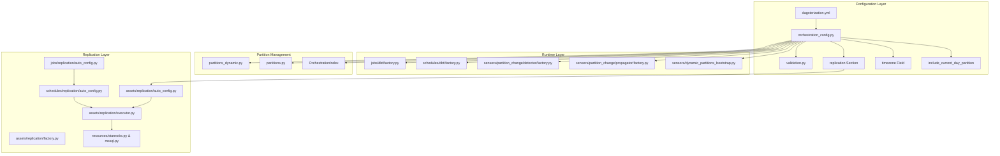

**Diagram sources**
- [dagsterization.yml:1-50](file://src/dbt_dagsterizer/project_templates/luban-dagster-dbt-starrocks-code-location-source-template/{{cookiecutter.output_name}}/dbt_project/dagsterization.yml#L1-L50)
- [orchestration_config.py:120-191](file://src/dbt_dagsterizer/orchestration_config.py#L120-L191)
- [validation.py:22-212](file://src/dbt_dagsterizer/cli_parts/validation.py#L22-L212)
- [partitions.py:10-30](file://src/dbt_dagsterizer/partitions.py#L10-L30)
- [auto_config.py:1-79](file://src/dbt_dagsterizer/assets/replication/auto_config.py#L1-L79)
- [executor.py:18-102](file://src/dbt_dagsterizer/assets/replication/executor.py#L18-L102)

**Section sources**
- [dagsterization.yml:1-50](file://src/dbt_dagsterizer/project_templates/luban-dagster-dbt-starrocks-code-location-source-template/{{cookiecutter.output_name}}/dbt_project/dagsterization.yml#L1-L50)
- [dagsterization-yml.md:1-864](file://docs/concepts/dagsterization-yml.md#L1-L864)

## Core Components

### Configuration File Structure
The `dagsterization.yml` file follows a hierarchical structure with eight primary sections including enhanced timezone support:

```mermaid
flowchart TD
ROOT[dagsterization.yml Root] --> VERSION[version: 1]
VERSION --> TIMEZONE[timezone: string]
VERSION --> PARTITIONS[partitions Section]
VERSION --> JOBS[jobs Section]
VERSION --> ASSET_JOBS[asset_jobs Section]
VERSION --> SCHEDULES[schedules Section]
VERSION --> PARTITION_CHANGE[partition_change Section]
VERSION --> REPLICATION[replication Section]
PARTITIONS --> DAILY[daily: model lists]
PARTITIONS --> DAILY_CONFIG[daily_config: {include_current_day_partition}]
PARTITIONS --> DYNAMIC[dynamic: partition definitions]
REPLICATION --> ENABLED[enabled: boolean]
REPLICATION --> SCHEDULES_ENABLED[schedules: {enabled: boolean}]
REPLICATION --> ENTRIES[entries: list of replication configs]
REPL_ENTRIES --> ENTRY1[{model, destination_table, destination_schema, write_disposition, partition_column, primary_key}]
```

**Diagram sources**
- [dagsterization.yml:1-50](file://src/dbt_dagsterizer/project_templates/luban-dagster-dbt-starrocks-code-location-source-template/{{cookiecutter.output_name}}/dbt_project/dagsterization.yml#L1-L50)
- [dagsterization-yml.md:27-60](file://docs/concepts/dagsterization-yml.md#L27-L60)

### Partition Types and Constraints
The system supports three primary partition types with strict isolation requirements:

| Partition Type | Description | Environment Variables | Asset Group Isolation |
|---|---|---|---|
| `daily` | One partition per day | `DAGSTER_DAILY_PARTITIONS_START_DATE`, `DAGSTER_PARTITION_TIMEZONE` | ✅ Separate group |
| `dynamic` | Custom partition keys (e.g., country codes) | N/A (defined inline) | ✅ Separate group (per name) |
| `unpartitioned` | No partitioning | N/A | ✅ Separate group |

**Section sources**
- [dagsterization-yml.md:102-130](file://docs/concepts/dagsterization-yml.md#L102-L130)

## Architecture Overview

The Dagsterization YAML Configuration system implements a multi-layered architecture that transforms declarative configuration into executable Dagster orchestration with enhanced replication capabilities:

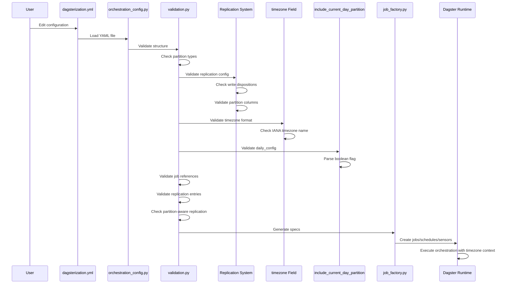

**Diagram sources**
- [orchestration_config.py:30-75](file://src/dbt_dagsterizer/orchestration_config.py#L30-L75)
- [validation.py:22-212](file://src/dbt_dagsterizer/cli_parts/validation.py#L22-L212)
- [partitions.py:10-30](file://src/dbt_dagsterizer/partitions.py#L10-L30)
- [factory.py:84-127](file://src/dbt_dagsterizer/jobs/dbt/factory.py#L84-L127)

## Detailed Component Analysis

### Orchestration Configuration Loading
The configuration loading system provides robust YAML parsing with default value handling and enhanced timezone support:

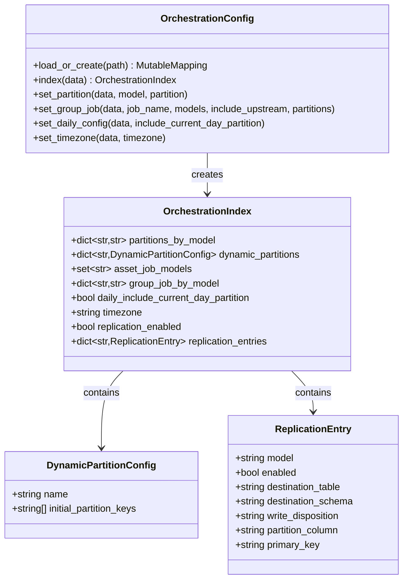

**Diagram sources**
- [orchestration_config.py:112-191](file://src/dbt_dagsterizer/orchestration_config.py#L112-L191)
- [orchestration_config.py:1-16](file://src/dbt_dagsterizer/orchestration_config.py#L1-L16)

### Validation System
The validation system enforces configuration integrity through comprehensive checks including enhanced timezone validation:

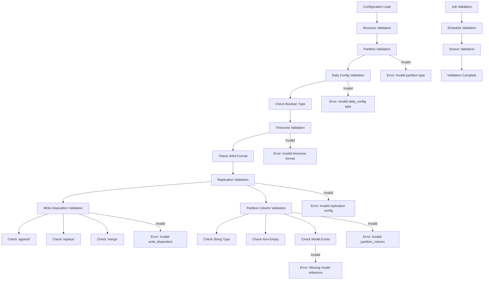

**Diagram sources**
- [validation.py:22-212](file://src/dbt_dagsterizer/cli_parts/validation.py#L22-L212)
- [validation.py:215-320](file://src/dbt_dagsterizer/cli_parts/validation.py#L215-L320)

**Section sources**
- [validation.py:22-212](file://src/dbt_dagsterizer/cli_parts/validation.py#L22-L212)
- [validation.py:215-320](file://src/dbt_dagsterizer/cli_parts/validation.py#L215-L320)

### Daily Partition Configuration
The new `include_current_day_partition` option provides granular control over daily partition availability:

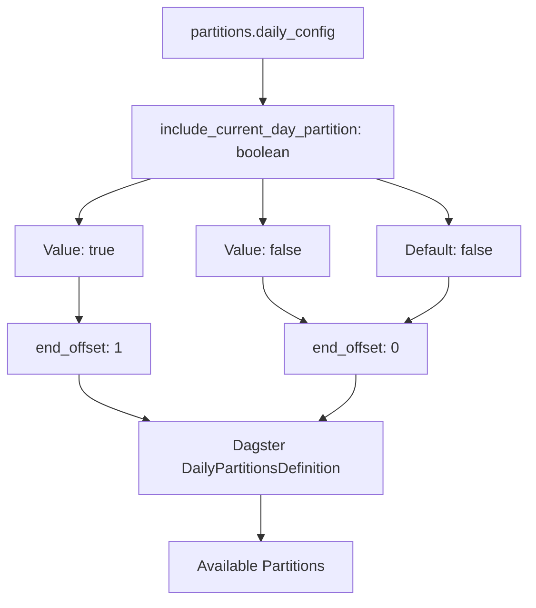

**Diagram sources**
- [dagsterization-yml.md:126-149](file://docs/concepts/dagsterization-yml.md#L126-L149)
- [partitions.py:10-30](file://src/dbt_dagsterizer/partitions.py#L10-L30)

**Section sources**
- [dagsterization-yml.md:126-149](file://docs/concepts/dagsterization-yml.md#L126-L149)
- [partitions.py:10-30](file://src/dbt_dagsterizer/partitions.py#L10-L30)

### Job Factory Implementation
The job factory transforms configuration into executable Dagster jobs:

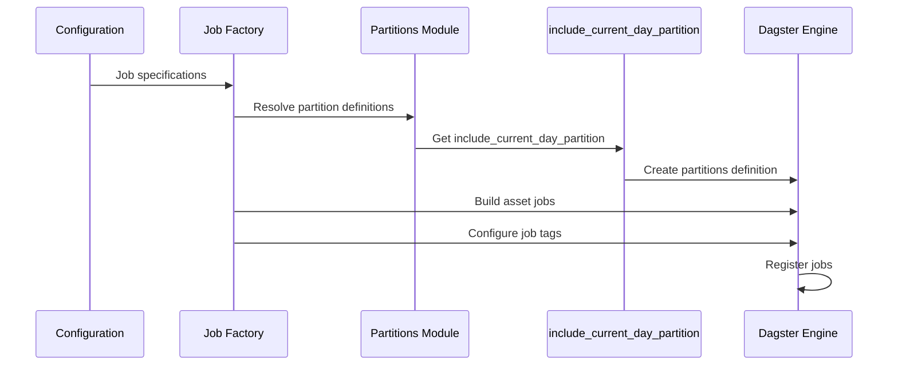

**Diagram sources**
- [factory.py:84-127](file://src/dbt_dagsterizer/jobs/dbt/factory.py#L84-L127)
- [factory.py:12-28](file://src/dbt_dagsterizer/jobs/dbt/factory.py#L12-L28)
- [partitions.py:33-70](file://src/dbt_dagsterizer/partitions.py#L33-L70)

**Section sources**
- [factory.py:84-127](file://src/dbt_dagsterizer/jobs/dbt/factory.py#L84-L127)

### Dynamic Partitions Management
Dynamic partitions provide flexible non-temporal partitioning capabilities:

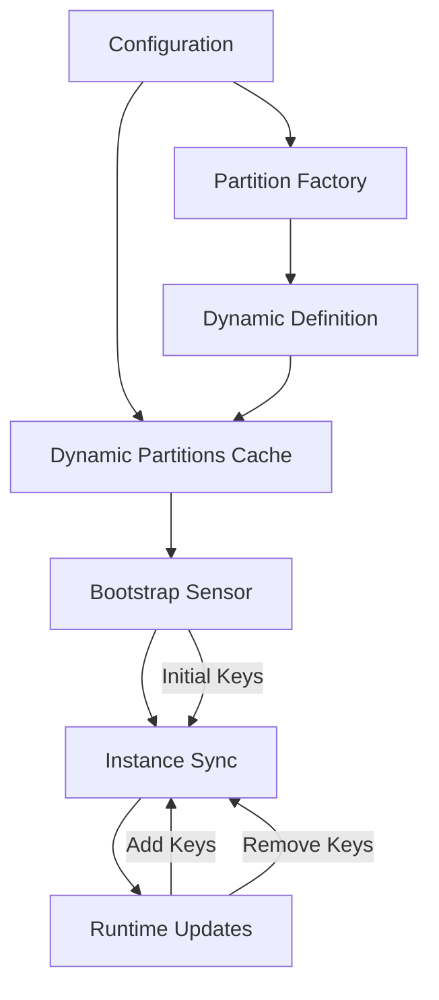

**Diagram sources**
- [dynamic_partitions_bootstrap.py:39-122](file://src/dbt_dagsterizer/sensors/dynamic_partitions_bootstrap.py#L39-L122)
- [partitions_dynamic.py:18-52](file://src/dbt_dagsterizer/partitions_dynamic.py#L18-L52)

**Section sources**
- [dynamic_partitions_bootstrap.py:39-122](file://src/dbt_dagsterizer/sensors/dynamic_partitions_bootstrap.py#L39-L122)
- [partitions_dynamic.py:18-52](file://src/dbt_dagsterizer/partitions_dynamic.py#L18-L52)

### Partition Change Sensors
The system implements sophisticated sensors for handling late arrivals and data updates:

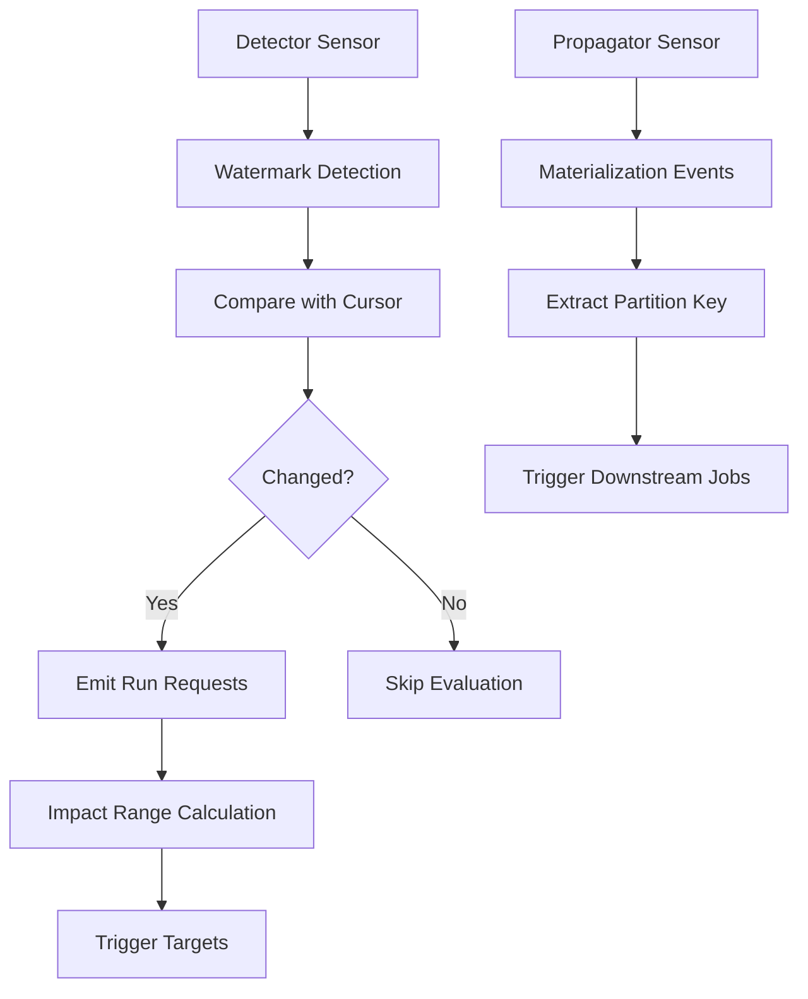

**Diagram sources**
- [factory.py:85-195](file://src/dbt_dagsterizer/sensors/partition_change/detector/factory.py#L85-L195)
- [factory.py:42-142](file://src/dbt_dagsterizer/sensors/partition_change/propagator/factory.py#L42-L142)

**Section sources**
- [factory.py:85-195](file://src/dbt_dagsterizer/sensors/partition_change/detector/factory.py#L85-L195)
- [factory.py:42-142](file://src/dbt_dagsterizer/sensors/partition_change/propagator/factory.py#L42-L142)

## Replication System

### Replication Configuration Structure
The replication system extends the configuration with a dedicated section for StarRocks-to-SQL Server data movement:

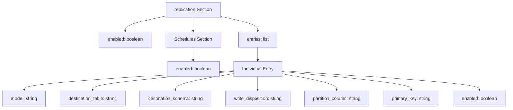

**Diagram sources**
- [orchestration_config.py:19-28](file://src/dbt_dagsterizer/orchestration_config.py#L19-L28)

### Write Dispositions and Behavior
The replication system supports three write dispositions with distinct behaviors:

| Write Disposition | Behavior | Partition-Aware | Use Case |
|---|---|---|---|
| `append` | Append new rows without modification | ❌ | Incremental loads, audit trails |
| `replace` | Replace entire table or partition | ✅ | Full refresh scenarios |
| `merge` | Merge based on primary key | ✅ | Upsert operations, slowly changing dimensions |

**Section sources**
- [validation.py:243-249](file://src/dbt_dagsterizer/cli_parts/validation.py#L243-L249)

### Partition-Aware Replication
The replication system respects dbt model partitioning strategies:

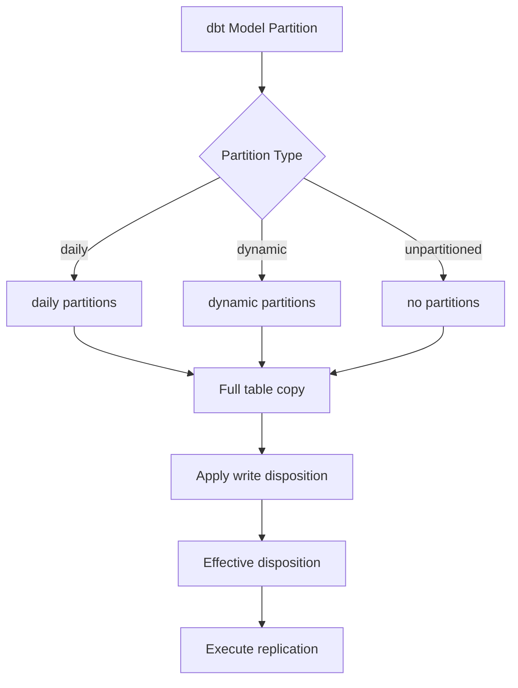

**Diagram sources**
- [executor.py:92-102](file://src/dbt_dagsterizer/assets/replication/executor.py#L92-L102)
- [factory.py:69-74](file://src/dbt_dagsterizer/assets/replication/factory.py#L69-L74)

### Resource Management
The system manages connections to both source and destination databases:

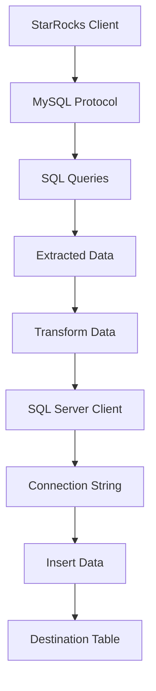

**Diagram sources**
- [starrocks.py:9-16](file://src/dbt_dagsterizer/resources/starrocks.py#L9-L16)
- [mssql.py:7-17](file://src/dbt_dagsterizer/resources/mssql.py#L7-L17)
- [executor.py:62-87](file://src/dbt_dagsterizer/assets/replication/executor.py#L62-L87)

**Section sources**
- [starrocks.py:9-16](file://src/dbt_dagsterizer/resources/starrocks.py#L9-L16)
- [mssql.py:7-17](file://src/dbt_dagsterizer/resources/mssql.py#L7-L17)
- [executor.py:62-87](file://src/dbt_dagsterizer/assets/replication/executor.py#L62-L87)

### Practical Usage Scenarios
Common use cases for the replication system:

1. **Analytics Workloads**: Move processed dbt models to SQL Server for business intelligence tools
2. **Data Warehousing**: Create mirror copies of StarRocks tables in SQL Server for reporting
3. **Legacy System Integration**: Provide SQL Server access for existing applications requiring ODBC connectivity
4. **Hybrid Architectures**: Support mixed database environments with specialized workloads

**Section sources**
- [auto_config.py:25-79](file://src/dbt_dagsterizer/assets/replication/auto_config.py#L25-L79)
- [executor.py:18-102](file://src/dbt_dagsterizer/assets/replication/executor.py#L18-L102)

## Timezone Configuration

### Global Timezone Support
The system now provides comprehensive timezone configuration capabilities for global schedule execution:

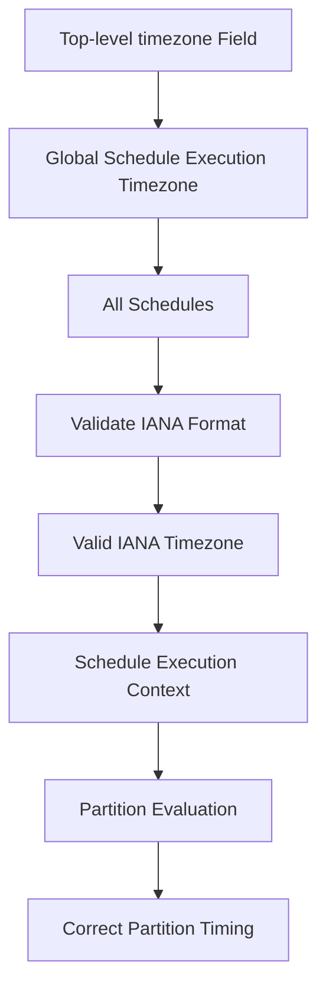

**Diagram sources**
- [dagsterization-yml.md:64-91](file://docs/concepts/dagsterization-yml.md#L64-L91)
- [validation.py:273-278](file://src/dbt_dagsterizer/cli_parts/validation.py#L273-L278)

### Timezone Configuration Options
The timezone field supports all standard IANA timezone names:

| Timezone | Description | Example |
|---|---|---|
| `UTC` | Coordinated Universal Time | `UTC` |
| `America/New_York` | Eastern Time (US) | `America/New_York` |
| `Europe/London` | Greenwich Mean Time | `Europe/London` |
| `Asia/Tokyo` | Japan Standard Time | `Asia/Tokyo` |
| `Australia/Sydney` | Australian Eastern Time | `Australia/Sydney` |

**Section sources**
- [dagsterization-yml.md:64-91](file://docs/concepts/dagsterization-yml.md#L64-L91)
- [validation.py:273-278](file://src/dbt_dagsterizer/cli_parts/validation.py#L273-L278)

## Dependency Analysis

The configuration system exhibits clear separation of concerns with well-defined dependencies:

```mermaid
graph TB
subgraph "Configuration Dependencies"
DAGSTERIZATION[dagsterization.yml] --> ORCHESTRATION_CONFIG[orchestration_config.py]
ORCHESTRATION_CONFIG --> VALIDATION[validation.py]
ORCHESTRATION_CONFIG --> PARTITIONS[partitions.py]
ORCHESTRATION_CONFIG --> REPLICATION_ENTRY[ReplicationEntry]
ORCHESTRATION_CONFIG --> TIMEZONE[set_timezone Function]
END_OFFSET[include_current_day_partition] --> PARTITIONS
end
subgraph "Runtime Dependencies"
VALIDATION --> JOBS_FACTORY[jobs/dbt/factory.py]
VALIDATION --> SCHEDULES_FACTORY[schedules/dbt/factory.py]
VALIDATION --> DETECTORS_FACTORY[sensors/partition_change/detector/factory.py]
VALIDATION --> PROPAGATORS_FACTORY[sensors/partition_change/propagator/factory.py]
VALIDATION --> BOOTSTRAP_FACTORY[sensors/dynamic_partitions_bootstrap.py]
end
subgraph "Partition Dependencies"
ORCHESTRATION_CONFIG --> PARTITIONS_DYNAMIC[partitions_dynamic.py]
DETECTORS_FACTORY --> PARTITIONS_DYNAMIC
BOOTSTRAP_FACTORY --> PARTITIONS_DYNAMIC
PARTITIONS --> DAILY_PARTITIONS_DEF[DailyPartitionsDefinition]
DAILY_PARTITIONS_DEF --> END_OFFSET
END_OFFSET --> DAGSTER_RUNTIME[Dagster Runtime]
end
subgraph "Replication Dependencies"
REPLICATION_ENTRY --> AUTO_CONFIG[assets/replication/auto_config.py]
AUTO_CONFIG --> EXECUTOR[assets/replication/executor.py]
EXECUTOR --> STARROCKS_CLIENT[resources/starrocks.py]
EXECUTOR --> MSSQL_CLIENT[resources/mssql.py]
EXECUTOR --> DAGSTER_ASSETS[dagster assets]
REPLICATION_SCHEDULES --> REPLICATION_JOBS[jobs/replication/factory.py]
REPLICATION_JOBS --> REPLICATION_SCHEDULES_FACTORY[schedules/replication/factory.py]
end
subgraph "Timezone Dependencies"
TIMEZONE --> VALIDATION
VALIDATION --> SCHEDULES_FACTORY
SCHEDULES_FACTORY --> DAGSTER_RUNTIME
end
```

**Diagram sources**
- [orchestration_config.py:1-91](file://src/dbt_dagsterizer/orchestration_config.py#L1-L91)
- [validation.py:1-200](file://src/dbt_dagsterizer/cli_parts/validation.py#L1-L200)
- [partitions.py:10-30](file://src/dbt_dagsterizer/partitions.py#L10-L30)
- [auto_config.py:1-79](file://src/dbt_dagsterizer/assets/replication/auto_config.py#L1-L79)
- [executor.py:18-102](file://src/dbt_dagsterizer/assets/replication/executor.py#L18-L102)

**Section sources**
- [orchestration_config.py:1-91](file://src/dbt_dagsterizer/orchestration_config.py#L1-L91)
- [validation.py:1-200](file://src/dbt_dagsterizer/cli_parts/validation.py#L1-L200)

## Performance Considerations
The configuration system is designed for optimal performance through several mechanisms:

- **Lazy Loading**: Dynamic partitions are loaded on-demand rather than at startup
- **Caching**: Partition definitions are cached to avoid repeated creation
- **Efficient Validation**: Validation occurs only when configuration changes
- **Minimal Memory Footprint**: Configuration is parsed once and reused across components
- **Boolean Flag Optimization**: The `include_current_day_partition` option is processed as a simple boolean flag without additional overhead
- **Resource Pooling**: Database connections are managed efficiently through client classes
- **Partition Pruning**: Replication respects model partitioning to minimize data transfer
- **Timezone Caching**: Timezone validation results are cached for improved performance
- **Optional Scheduling**: Replication schedules are optional and disabled by default to reduce overhead

## Troubleshooting Guide

### Common Configuration Issues

**Partition Type Conflicts**
- **Symptom**: `DagsterInvariantViolationError: Cannot mix partition types`
- **Cause**: Mixing different partition types in a single job
- **Solution**: Ensure each job uses models with the same partition type

**Missing Model References**
- **Symptom**: Validation errors for missing models
- **Cause**: Models referenced in configuration don't exist in dbt manifest
- **Solution**: Verify model names match dbt project structure

**Dynamic Partition Configuration Errors**
- **Symptom**: Errors for invalid dynamic partition names
- **Cause**: Unknown dynamic partition references or empty initial keys
- **Solution**: Check dynamic partition definitions in configuration

**Daily Configuration Validation Errors**
- **Symptom**: Validation errors for `partitions.daily_config.include_current_day_partition`
- **Cause**: Non-boolean value or malformed daily_config structure
- **Solution**: Ensure `include_current_day_partition` is a boolean value and `daily_config` is a mapping

**Replication Configuration Errors**
- **Symptom**: Validation errors for replication entries
- **Cause**: Invalid write_disposition values, missing partition columns for partitioned models, or invalid model references
- **Solution**: Verify write_disposition is one of 'append', 'replace', or 'merge'; ensure partition_column is specified for partitioned models; confirm model exists in dbt project

**Timezone Configuration Errors**
- **Symptom**: Validation errors for timezone field
- **Cause**: Invalid IANA timezone name or empty string
- **Solution**: Use valid IANA timezone names (e.g., 'UTC', 'America/New_York', 'Europe/London')

**Database Connection Issues**
- **Symptom**: Connection errors to StarRocks or SQL Server
- **Cause**: Incorrect credentials, network connectivity, or driver issues
- **Solution**: Verify environment variables for STARROCKS_* and SQLSERVER_*; check network connectivity; ensure appropriate drivers are installed

**Section sources**
- [dagsterization-yml.md:654-864](file://docs/concepts/dagsterization-yml.md#L654-L864)
- [validation.py:243-249](file://src/dbt_dagsterizer/cli_parts/validation.py#L243-L249)

## Conclusion
The Dagsterization YAML Configuration system provides a robust, declarative approach to orchestrating dbt models in Dagster. Through careful separation of concerns, comprehensive validation, and flexible partitioning strategies, it enables teams to manage complex orchestration requirements while maintaining simplicity and reliability.

**Updated** The addition of the StarRocks-to-Microsoft SQL Server replication system significantly enhances the platform's versatility by enabling downstream SQL Server access for dbt-dagsterizer users. The replication system supports three write dispositions (append, replace, merge) with partition-aware behavior, integrates seamlessly with existing orchestration configuration, and provides practical solutions for analytics workloads, legacy system integration, and hybrid database architectures.

The system's modular architecture allows for easy extension and customization while preserving backward compatibility and providing clear error messages for troubleshooting. The new replication feature maintains consistency with the existing configuration structure and validation patterns, ensuring seamless integration into the overall orchestration framework while opening new possibilities for data movement and downstream system access.

The enhanced timezone configuration capabilities further strengthen the system's internationalization support, enabling precise schedule execution across different geographic regions and time zones. This combination of replication capabilities and timezone support makes dbt-dagsterizer a comprehensive solution for modern data orchestration needs.