# Execution Model

<cite>
**Referenced Files in This Document**
- [api.py](file://src/dbt_dagsterizer/api.py)
- [env_utils.py](file://src/dbt_dagsterizer/env_utils.py)
- [k8s_tags.py](file://src/dbt_dagsterizer/k8s_tags.py)
- [orchestration_config.py](file://src/dbt_dagsterizer/orchestration_config.py)
- [gitops_env.py](file://src/dbt_dagsterizer/gitops_env.py)
- [assets/__init__.py](file://src/dbt_dagsterizer/assets/__init__.py)
- [assets/dbt/assets.py](file://src/dbt_dagsterizer/assets/dbt/assets.py)
- [resources/__init__.py](file://src/dbt_dagsterizer/resources/__init__.py)
- [resources/dbt.py](file://src/dbt_dagsterizer/resources/dbt.py)
- [resources/starrocks.py](file://src/dbt_dagsterizer/resources/starrocks.py)
- [sensors/__init__.py](file://src/dbt_dagsterizer/sensors/__init__.py)
- [dbt/manifest.py](file://src/dbt_dagsterizer/dbt/manifest.py)
- [execution-model.md](file://docs/concepts/execution-model.md)
</cite>

## Table of Contents
1. [Introduction](#introduction)
2. [Project Structure](#project-structure)
3. [Core Components](#core-components)
4. [Architecture Overview](#architecture-overview)
5. [Detailed Component Analysis](#detailed-component-analysis)
6. [Dependency Analysis](#dependency-analysis)
7. [Performance Considerations](#performance-considerations)
8. [Troubleshooting Guide](#troubleshooting-guide)
9. [Conclusion](#conclusion)
10. [Appendices](#appendices)

## Introduction
This document explains dbt-dagsterizer’s execution model and orchestration patterns. It focuses on:
- The static code location philosophy and how it enables dynamic generation of Dagster definitions from dbt projects
- Environment propagation mechanisms and how environment variables and configuration files influence asset generation
- The build_definitions() API workflow and runtime orchestration process
- How dbt-dagsterizer integrates with Dagster’s orchestration framework and manages execution contexts
- Example execution flows, environment configuration patterns, and production best practices

## Project Structure
At a high level, dbt-dagsterizer exposes a single API to materialize a Dagster Definitions object from a dbt project. The system separates concerns across:
- API surface for building Definitions
- Environment utilities for .env parsing and temporary environment injection
- Asset factories for dbt assets and observable sources
- Resources for dbt and external systems (e.g., StarRocks)
- Sensors for partition change detection and propagation
- Orchestration configuration for scheduling, partitioning, and job grouping
- Kubernetes run pod environment injection via tags

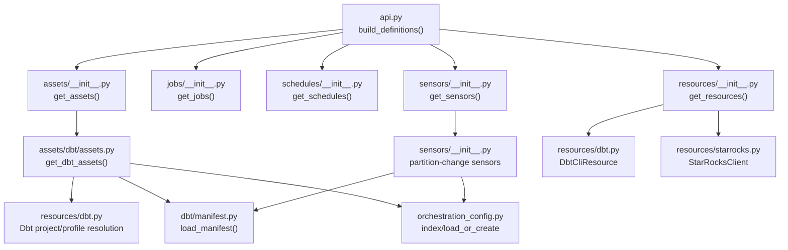

**Diagram sources**
- [api.py:15-72](file://src/dbt_dagsterizer/api.py#L15-L72)
- [assets/__init__.py:1-13](file://src/dbt_dagsterizer/assets/__init__.py#L1-L13)
- [assets/dbt/assets.py:40-113](file://src/dbt_dagsterizer/assets/dbt/assets.py#L40-L113)
- [resources/__init__.py:1-10](file://src/dbt_dagsterizer/resources/__init__.py#L1-L10)
- [resources/dbt.py:87-95](file://src/dbt_dagsterizer/resources/dbt.py#L87-L95)
- [dbt/manifest.py:28-37](file://src/dbt_dagsterizer/dbt/manifest.py#L28-L37)
- [orchestration_config.py:112-158](file://src/dbt_dagsterizer/orchestration_config.py#L112-L158)
- [sensors/__init__.py:40-75](file://src/dbt_dagsterizer/sensors/__init__.py#L40-L75)

**Section sources**
- [api.py:15-72](file://src/dbt_dagsterizer/api.py#L15-L72)
- [assets/__init__.py:1-13](file://src/dbt_dagsterizer/assets/__init__.py#L1-L13)
- [resources/__init__.py:1-10](file://src/dbt_dagsterizer/resources/__init__.py#L1-L10)
- [sensors/__init__.py:40-75](file://src/dbt_dagsterizer/sensors/__init__.py#L40-L75)

## Core Components
- build_definitions(): Central entrypoint that resolves dbt project/profile locations, injects environment variables temporarily, and returns a fully populated Dagster Definitions object. It conditionally generates a minimal “project ready” asset when no dbt models are present.
- Environment utilities: Parse .env files adjacent to the dbt project and inject only non-conflicting overrides into the current process environment for the duration of definition building.
- Asset factories: Compose dbt assets and observable sources into a cohesive asset graph.
- Resources: Provide dbt and external system clients (e.g., StarRocks) to Dagster ops/assets.
- Sensors: Build partition-change detection and propagation sensors using dbt manifest metadata and orchestration configuration.
- Orchestration configuration: Persist and index scheduling, partitioning, and job grouping preferences in a YAML file.
- Kubernetes run pod env injection: Tag jobs with Kubernetes container envFrom configuration when run environment secrets/configmaps are specified.

**Section sources**
- [api.py:15-72](file://src/dbt_dagsterizer/api.py#L15-L72)
- [env_utils.py:8-78](file://src/dbt_dagsterizer/env_utils.py#L8-L78)
- [assets/__init__.py:1-13](file://src/dbt_dagsterizer/assets/__init__.py#L1-L13)
- [resources/__init__.py:1-10](file://src/dbt_dagsterizer/resources/__init__.py#L1-L10)
- [sensors/__init__.py:40-75](file://src/dbt_dagsterizer/sensors/__init__.py#L40-L75)
- [orchestration_config.py:23-83](file://src/dbt_dagsterizer/orchestration_config.py#L23-L83)
- [k8s_tags.py:10-37](file://src/dbt_dagsterizer/k8s_tags.py#L10-L37)

## Architecture Overview
The execution model follows a static code location philosophy:
- Dagster code (assets, jobs, schedules, sensors, resources) is loaded from a fixed code location (code-server).
- Sensors and schedules evaluate in the code location and may trigger runs.
- Actual asset/op execution happens in separate run pods managed by the run launcher (e.g., K8sRunLauncher), inheriting only the run-time environment configured for that run.

Environment propagation ensures credentials are available where needed:
- Code location environment: Provided via ConfigMap/Secret mounted or envFrom in the code-server deployment.
- Run pod environment: Optionally injected via tags that configure envFrom for run containers.

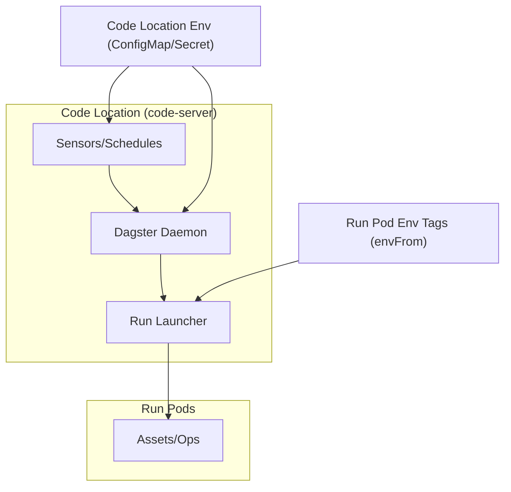

**Diagram sources**
- [execution-model.md:7-35](file://docs/concepts/execution-model.md#L7-L35)
- [k8s_tags.py:10-37](file://src/dbt_dagsterizer/k8s_tags.py#L10-L37)

**Section sources**
- [execution-model.md:1-65](file://docs/concepts/execution-model.md#L1-L65)
- [k8s_tags.py:10-37](file://src/dbt_dagsterizer/k8s_tags.py#L10-L37)

## Detailed Component Analysis

### build_definitions() API Workflow
The API orchestrates environment setup, discovery of dbt assets, and composition of Dagster constructs.

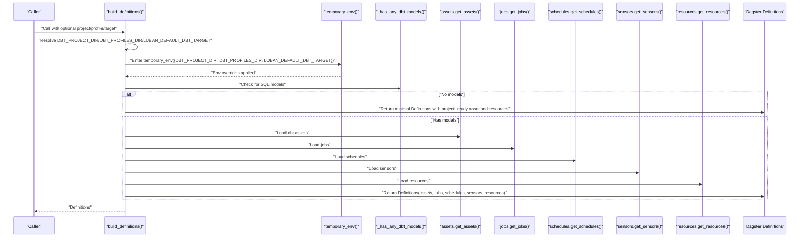

**Diagram sources**
- [api.py:15-72](file://src/dbt_dagsterizer/api.py#L15-L72)
- [env_utils.py:61-78](file://src/dbt_dagsterizer/env_utils.py#L61-L78)
- [assets/__init__.py:1-13](file://src/dbt_dagsterizer/assets/__init__.py#L1-L13)
- [jobs/__init__.py:1-10](file://src/dbt_dagsterizer/jobs/__init__.py#L1-L10)
- [schedules/__init__.py:1-10](file://src/dbt_dagsterizer/schedules/__init__.py#L1-L10)
- [sensors/__init__.py:40-75](file://src/dbt_dagsterizer/sensors/__init__.py#L40-L75)
- [resources/__init__.py:1-10](file://src/dbt_dagsterizer/resources/__init__.py#L1-L10)

**Section sources**
- [api.py:15-72](file://src/dbt_dagsterizer/api.py#L15-L72)
- [env_utils.py:61-78](file://src/dbt_dagsterizer/env_utils.py#L61-L78)

### Environment Propagation and .env Handling
- Dotenv parsing: Adjacent .env files are parsed and merged, with existing environment variables taking precedence.
- Temporary environment: Overrides are applied only during definition building to avoid leaking into the broader process.
- DBT_PROJECT_DIR and DBT_PROFILES_DIR resolution: Determined from explicit inputs or inferred from repository layout.
- Target selection: DBT_TARGET or LUBAN_DEFAULT_DBT_TARGET controls the dbt target.

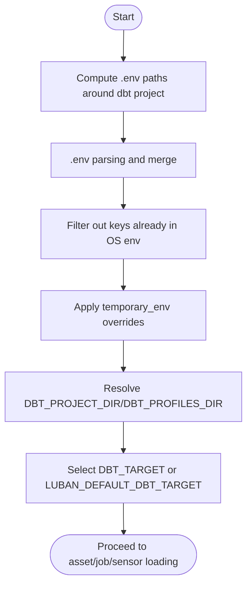

**Diagram sources**
- [env_utils.py:8-49](file://src/dbt_dagsterizer/env_utils.py#L8-L49)
- [env_utils.py:61-78](file://src/dbt_dagsterizer/env_utils.py#L61-L78)
- [api.py:21-41](file://src/dbt_dagsterizer/api.py#L21-L41)

**Section sources**
- [env_utils.py:8-78](file://src/dbt_dagsterizer/env_utils.py#L8-L78)
- [api.py:21-41](file://src/dbt_dagsterizer/api.py#L21-L41)

### Static Code Location Philosophy and Dynamic Definition Generation
- Code location: Sensors/schedules and user code run here; credentials for external systems accessed during evaluation must be present in this environment.
- Dynamic generation: Assets/jobs/schedules/sensors are produced at import-time by calling centralized getters, enabling runtime customization via environment and configuration files.
- Run pods: Separate execution units for asset/op execution; credentials must be injected here when external systems are accessed during execution.

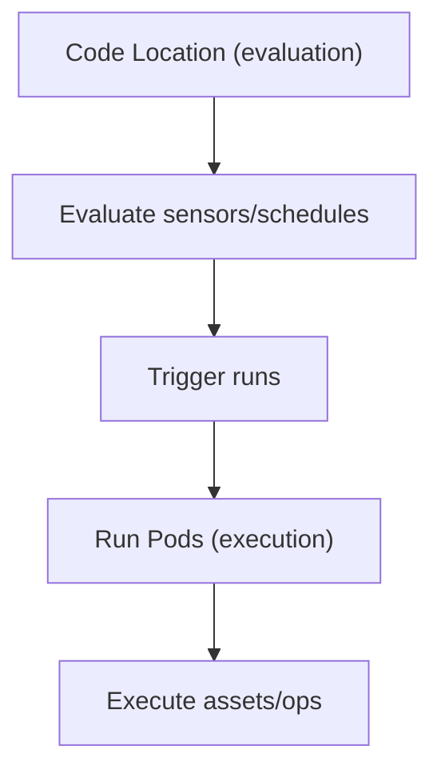

**Diagram sources**
- [execution-model.md:7-35](file://docs/concepts/execution-model.md#L7-L35)

**Section sources**
- [execution-model.md:1-65](file://docs/concepts/execution-model.md#L1-L65)

### dbt Assets Execution Context
- dbt project/profile resolution: Determined by environment variables and repository layout.
- Manifest preparation: Ensures a valid manifest is present before asset translation.
- Asset translation: Uses a custom translator informed by orchestration configuration (partitioning, asset-job assignments).
- Telemetry: Records run results telemetry and spans for observability.

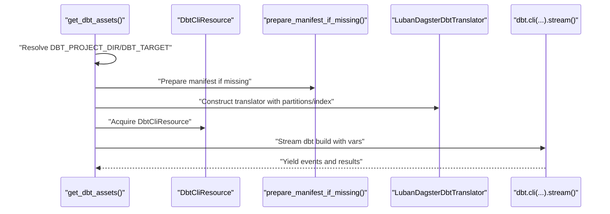

**Diagram sources**
- [assets/dbt/assets.py:40-113](file://src/dbt_dagsterizer/assets/dbt/assets.py#L40-L113)
- [resources/dbt.py:87-95](file://src/dbt_dagsterizer/resources/dbt.py#L87-L95)
- [dbt/manifest.py:28-37](file://src/dbt_dagsterizer/dbt/manifest.py#L28-L37)
- [orchestration_config.py:112-158](file://src/dbt_dagsterizer/orchestration_config.py#L112-L158)

**Section sources**
- [assets/dbt/assets.py:40-113](file://src/dbt_dagsterizer/assets/dbt/assets.py#L40-L113)
- [resources/dbt.py:87-95](file://src/dbt_dagsterizer/resources/dbt.py#L87-L95)
- [dbt/manifest.py:28-37](file://src/dbt_dagsterizer/dbt/manifest.py#L28-L37)
- [orchestration_config.py:112-158](file://src/dbt_dagsterizer/orchestration_config.py#L112-L158)

### Sensors: Partition Change Detection and Propagation
- Indexing: Builds a model-to-relation mapping from the dbt manifest.
- Normalization: Converts manual propagation specs to use normalized upstream relations.
- Composition: Creates detection sensors and propagation sensors (with mode control) using jobs discovered by name.

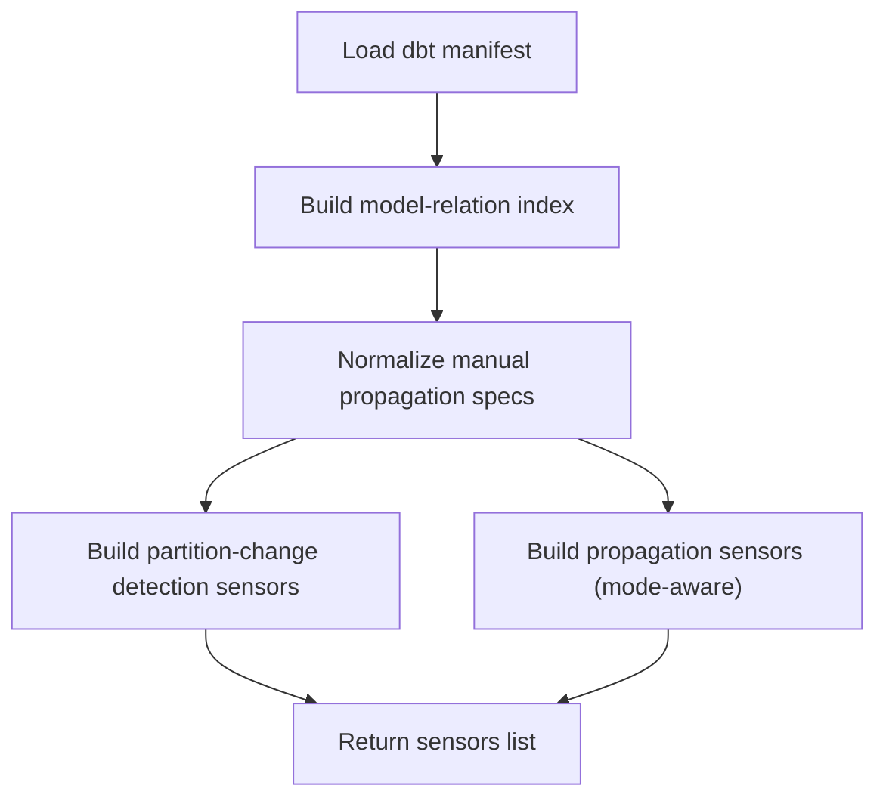

**Diagram sources**
- [sensors/__init__.py:5-37](file://src/dbt_dagsterizer/sensors/__init__.py#L5-L37)
- [sensors/__init__.py:40-75](file://src/dbt_dagsterizer/sensors/__init__.py#L40-L75)
- [dbt/manifest.py:28-64](file://src/dbt_dagsterizer/dbt/manifest.py#L28-L64)

**Section sources**
- [sensors/__init__.py:40-75](file://src/dbt_dagsterizer/sensors/__init__.py#L40-L75)
- [dbt/manifest.py:28-64](file://src/dbt_dagsterizer/dbt/manifest.py#L28-L64)

### Kubernetes Run Pod Environment Injection
- Tags: When LUBAN_RUN_ENV_CONFIGMAP or LUBAN_RUN_ENV_SECRET are set, a JSON tag is constructed to configure envFrom on run containers.
- Merging: Existing tags are preserved; if no env injection is configured, tags remain unchanged.

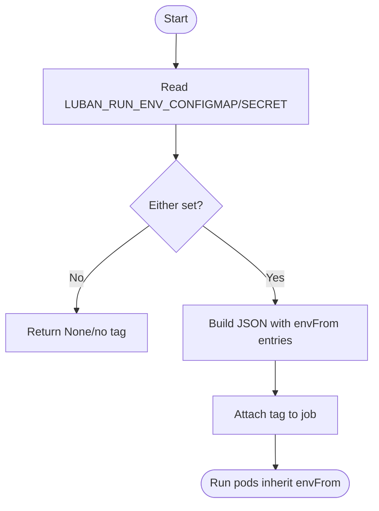

**Diagram sources**
- [k8s_tags.py:10-37](file://src/dbt_dagsterizer/k8s_tags.py#L10-L37)

**Section sources**
- [k8s_tags.py:10-37](file://src/dbt_dagsterizer/k8s_tags.py#L10-L37)

### Orchestration Configuration Management
- Schema: Provides defaults and normalization for orchestration configuration (jobs, partitions, schedules, partition-change detectors/propagators).
- Indexing: Produces a lightweight index for partition types, asset-job membership, and group-job mappings.
- Persistence: Loads, creates, and saves orchestration configuration with robust error handling.

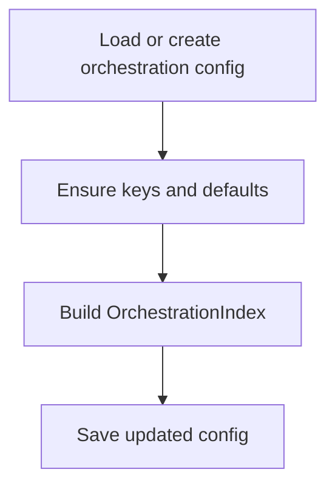

**Diagram sources**
- [orchestration_config.py:23-83](file://src/dbt_dagsterizer/orchestration_config.py#L23-L83)
- [orchestration_config.py:112-158](file://src/dbt_dagsterizer/orchestration_config.py#L112-L158)

**Section sources**
- [orchestration_config.py:23-83](file://src/dbt_dagsterizer/orchestration_config.py#L23-L83)
- [orchestration_config.py:112-158](file://src/dbt_dagsterizer/orchestration_config.py#L112-L158)

### GitOps Environment Generation
- Purpose: Generate environment artifacts (ConfigMaps/Secrets) across environments (base/snd/prd) from a single .env file.
- Filtering: Excludes sensitive or disallowed keys/prefixes.
- Naming: Normalizes application name to Kubernetes-friendly identifiers.
- Overlay data: Derives environment-specific values (e.g., DBT_TARGET, database suffixes) and writes manifests.

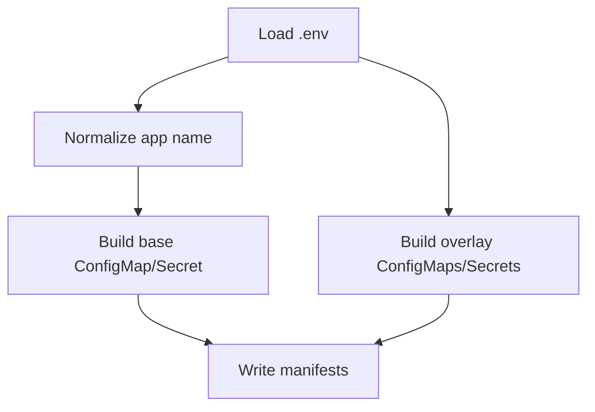

**Diagram sources**
- [gitops_env.py:104-197](file://src/dbt_dagsterizer/gitops_env.py#L104-L197)

**Section sources**
- [gitops_env.py:104-197](file://src/dbt_dagsterizer/gitops_env.py#L104-L197)

## Dependency Analysis
The following diagram highlights key dependencies among core modules involved in the execution model.

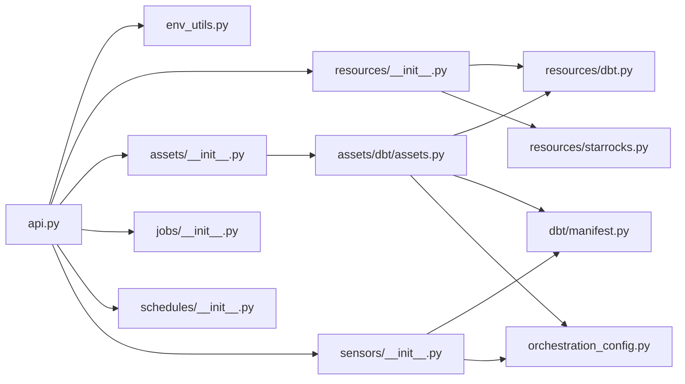

**Diagram sources**
- [api.py:15-72](file://src/dbt_dagsterizer/api.py#L15-L72)
- [assets/__init__.py:1-13](file://src/dbt_dagsterizer/assets/__init__.py#L1-L13)
- [assets/dbt/assets.py:40-113](file://src/dbt_dagsterizer/assets/dbt/assets.py#L40-L113)
- [resources/__init__.py:1-10](file://src/dbt_dagsterizer/resources/__init__.py#L1-L10)
- [resources/dbt.py:87-95](file://src/dbt_dagsterizer/resources/dbt.py#L87-L95)
- [dbt/manifest.py:28-37](file://src/dbt_dagsterizer/dbt/manifest.py#L28-L37)
- [orchestration_config.py:112-158](file://src/dbt_dagsterizer/orchestration_config.py#L112-L158)
- [sensors/__init__.py:40-75](file://src/dbt_dagsterizer/sensors/__init__.py#L40-L75)

**Section sources**
- [api.py:15-72](file://src/dbt_dagsterizer/api.py#L15-L72)
- [assets/dbt/assets.py:40-113](file://src/dbt_dagsterizer/assets/dbt/assets.py#L40-L113)
- [resources/dbt.py:87-95](file://src/dbt_dagsterizer/resources/dbt.py#L87-L95)
- [dbt/manifest.py:28-37](file://src/dbt_dagsterizer/dbt/manifest.py#L28-L37)
- [orchestration_config.py:112-158](file://src/dbt_dagsterizer/orchestration_config.py#L112-L158)
- [sensors/__init__.py:40-75](file://src/dbt_dagsterizer/sensors/__init__.py#L40-L75)

## Performance Considerations
- Manifest caching: The dbt manifest is prepared once per run and reused across asset translation and sensor indexing to avoid redundant work.
- Conditional asset generation: When no dbt models are present, a minimal asset is returned to avoid unnecessary overhead.
- Retry strategy: Limited retries for specific dbt CLI errors to mitigate transient failures.
- Observability: Spans and telemetry are attached to dbt invocations to track performance and outcomes.

[No sources needed since this section provides general guidance]

## Troubleshooting Guide
Common issues and remedies:
- Missing dbt_project.yml: Ensure DBT_PROJECT_DIR or LUBAN_REPO_ROOT is set correctly so the dbt project directory can be resolved.
- Missing profiles.yml: Ensure DBT_PROFILES_DIR points to a directory containing profiles.yml.
- No dbt models: The API returns a minimal “project ready” asset; confirm the dbt models directory contains SQL files.
- Environment not applied: Verify .env files exist near the dbt project and are not overridden by existing environment variables.
- Run pod credentials: If sensors/ops access the same external system, ensure both code location and run pod environments are configured appropriately.

**Section sources**
- [resources/dbt.py:27-54](file://src/dbt_dagsterizer/resources/dbt.py#L27-L54)
- [resources/dbt.py:57-84](file://src/dbt_dagsterizer/resources/dbt.py#L57-L84)
- [api.py:44-57](file://src/dbt_dagsterizer/api.py#L44-L57)
- [env_utils.py:8-49](file://src/dbt_dagsterizer/env_utils.py#L8-L49)
- [execution-model.md:36-65](file://docs/concepts/execution-model.md#L36-L65)

## Conclusion
dbt-dagsterizer’s execution model centers on a static code location for evaluation and dynamic generation of Dagster definitions from dbt projects. Environment propagation is carefully controlled via temporary overrides and .env parsing, while orchestration configuration governs scheduling, partitioning, and job grouping. Kubernetes run pod environment injection ensures credentials reach execution contexts when needed. Together, these patterns enable reliable, observable, and production-ready orchestration of dbt assets within Dagster.

[No sources needed since this section summarizes without analyzing specific files]

## Appendices
- Example execution flows:
  - Minimal project: build_definitions() detects no models and returns a simple asset plus resources.
  - Full project: build_definitions() composes dbt assets, jobs, schedules, sensors, and resources using environment-driven configuration.
- Environment configuration patterns:
  - Use .env files adjacent to the dbt project for local development.
  - Use GitOps generation to produce environment artifacts across environments.
  - Configure run pod env injection via LUBAN_RUN_ENV_CONFIGMAP/SECRET for execution-time credentials.
- Production best practices:
  - Keep code location and run pod credentials aligned when both evaluate and execute against the same external systems.
  - Prefer orchestration configuration for partitioning and job grouping to centralize policy.
  - Instrument dbt invocations with telemetry and spans for observability.

[No sources needed since this section provides general guidance]