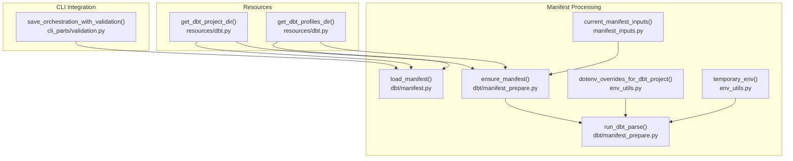
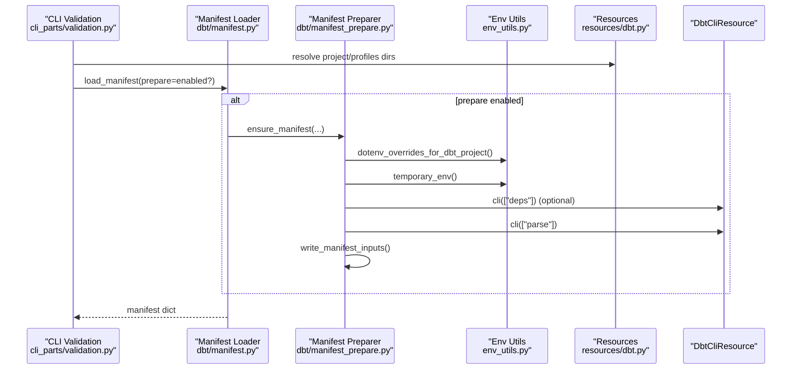
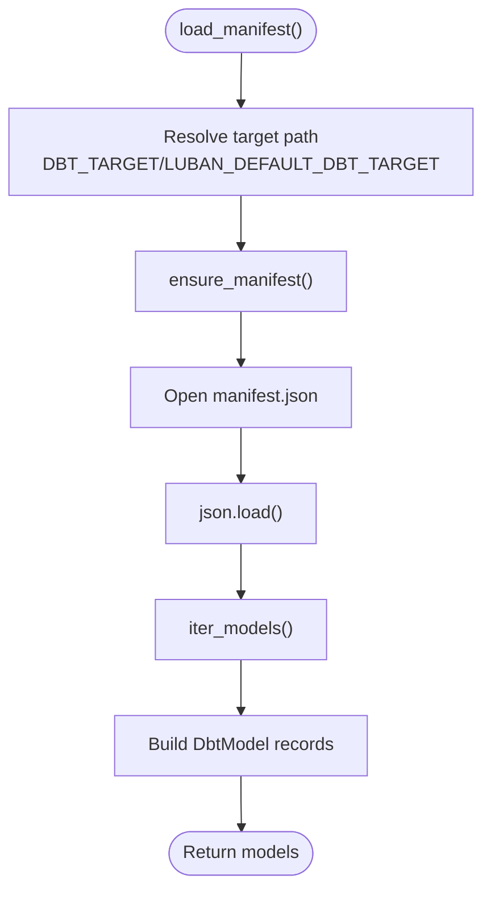
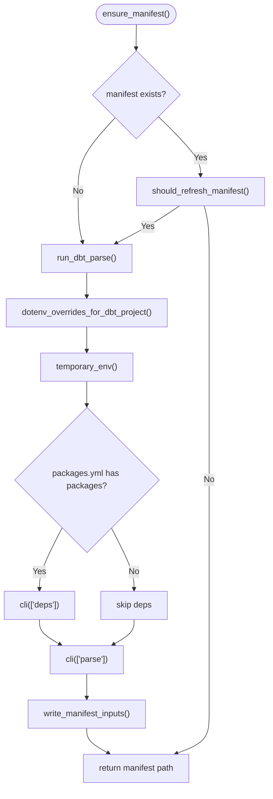
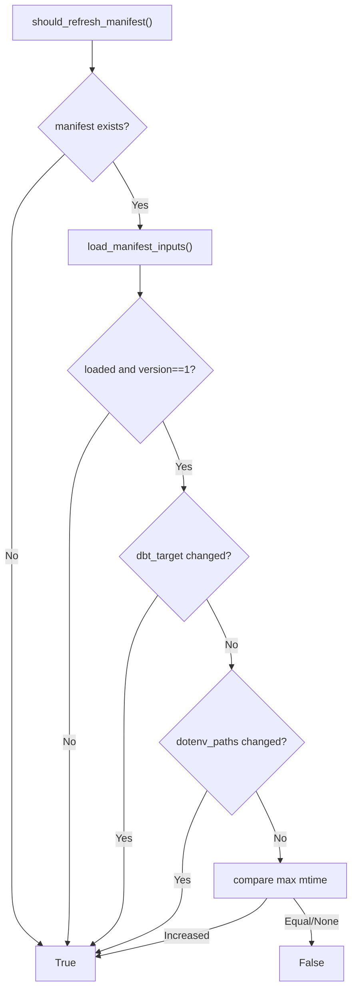
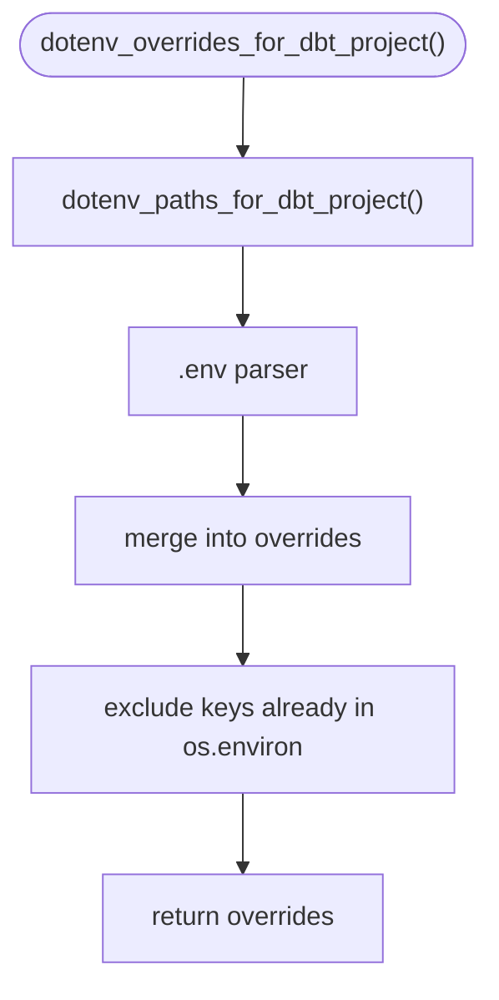
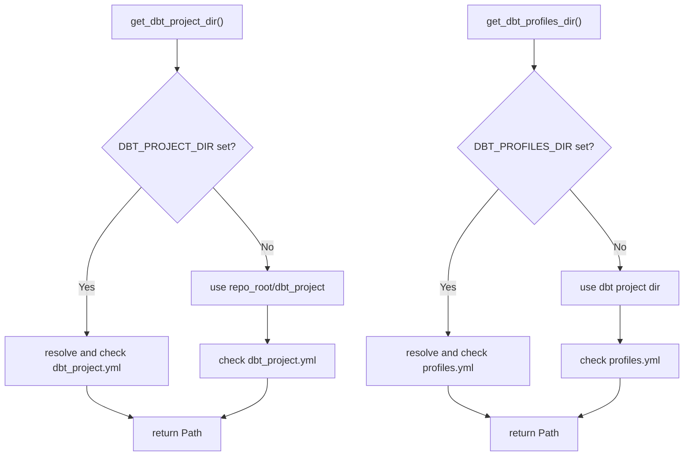
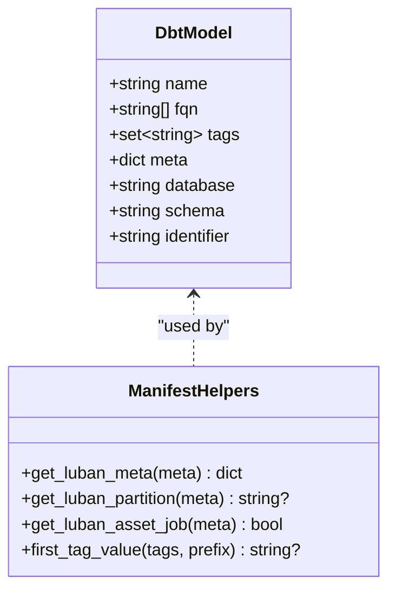
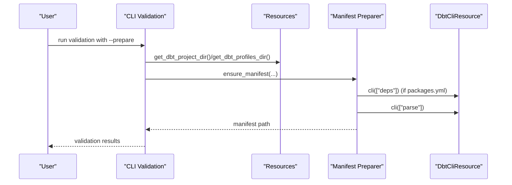
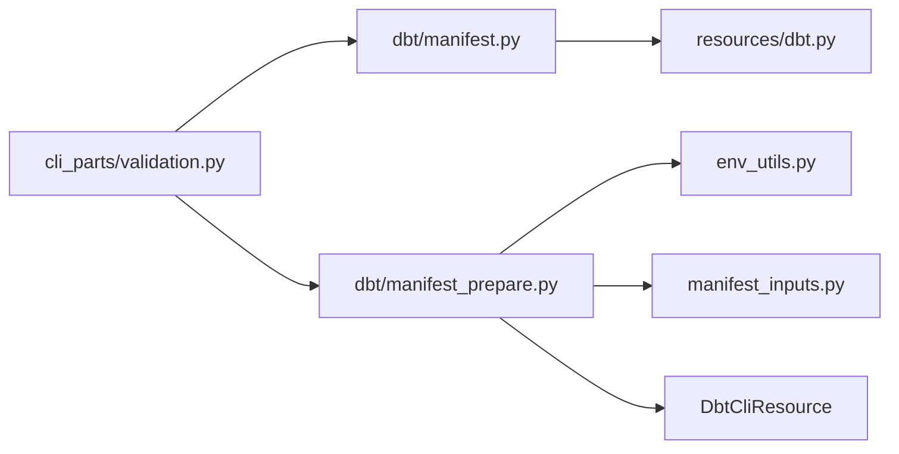

# Manifest Processing

<cite>
**Referenced Files in This Document**
- [manifest.py](file://src/dbt_dagsterizer/dbt/manifest.py)
- [manifest_prepare.py](file://src/dbt_dagsterizer/dbt/manifest_prepare.py)
- [manifest_inputs.py](file://src/dbt_dagsterizer/manifest_inputs.py)
- [env_utils.py](file://src/dbt_dagsterizer/env_utils.py)
- [prepare.py](file://src/dbt_dagsterizer/assets/dbt/prepare.py)
- [dbt.py](file://src/dbt_dagsterizer/resources/dbt.py)
- [validation.py](file://src/dbt_dagsterizer/cli_parts/validation.py)
- [cli.md](file://docs/concepts/cli.md)
- [run_results.py](file://src/dbt_dagsterizer/dbt/run_results.py)
- [test_prepare_manifest_dotenv_loading.py](file://tests/test_prepare_manifest_dotenv_loading.py)
- [test_manifest_inputs.py](file://tests/test_manifest_inputs.py)
</cite>

## Table of Contents
1. [Introduction](#introduction)
2. [Project Structure](#project-structure)
3. [Core Components](#core-components)
4. [Architecture Overview](#architecture-overview)
5. [Detailed Component Analysis](#detailed-component-analysis)
6. [Dependency Analysis](#dependency-analysis)
7. [Performance Considerations](#performance-considerations)
8. [Troubleshooting Guide](#troubleshooting-guide)
9. [Conclusion](#conclusion)

## Introduction
This document explains how dbt manifest files are parsed, validated, and transformed into internal data structures within dbt-dagsterizer. It covers the manifest preparation pipeline, environment variable loading, dotenv processing, and manifest normalization. It also documents how manifest inputs are collected from dbt_project.yml, packages.yml, and environment configurations, and outlines compatibility considerations and common issues encountered during processing.

## Project Structure
The manifest processing logic is centered around four primary modules:
- Manifest loading and iteration
- Manifest preparation and refresh logic
- Manifest inputs signature and refresh decision-making
- Environment variable and dotenv handling

**Diagram sources**
- [manifest.py:28-37](file://src/dbt_dagsterizer/dbt/manifest.py#L28-L37)
- [manifest_prepare.py:57-61](file://src/dbt_dagsterizer/dbt/manifest_prepare.py#L57-L61)
- [manifest_prepare.py:30-54](file://src/dbt_dagsterizer/dbt/manifest_prepare.py#L30-L54)
- [manifest_inputs.py:24-32](file://src/dbt_dagsterizer/manifest_inputs.py#L24-L32)
- [env_utils.py:44-48](file://src/dbt_dagsterizer/env_utils.py#L44-L48)
- [env_utils.py:61-77](file://src/dbt_dagsterizer/env_utils.py#L61-L77)
- [dbt.py:27-54](file://src/dbt_dagsterizer/resources/dbt.py#L27-L54)
- [dbt.py:57-84](file://src/dbt_dagsterizer/resources/dbt.py#L57-L84)
- [validation.py:275-309](file://src/dbt_dagsterizer/cli_parts/validation.py#L275-L309)

**Section sources**
- [manifest.py:28-37](file://src/dbt_dagsterizer/dbt/manifest.py#L28-L37)
- [manifest_prepare.py:57-61](file://src/dbt_dagsterizer/dbt/manifest_prepare.py#L57-L61)
- [manifest_inputs.py:24-32](file://src/dbt_dagsterizer/manifest_inputs.py#L24-L32)
- [env_utils.py:44-48](file://src/dbt_dagsterizer/env_utils.py#L44-L48)
- [env_utils.py:61-77](file://src/dbt_dagsterizer/env_utils.py#L61-L77)
- [dbt.py:27-54](file://src/dbt_dagsterizer/resources/dbt.py#L27-L54)
- [dbt.py:57-84](file://src/dbt_dagsterizer/resources/dbt.py#L57-L84)
- [validation.py:275-309](file://src/dbt_dagsterizer/cli_parts/validation.py#L275-L309)

## Core Components
- Manifest loader: Reads the dbt manifest.json from the dbt project target directory and parses it into a dictionary.
- Manifest preparer: Ensures the manifest is up-to-date by invoking dbt parse (optionally running deps when packages.yml indicates packages).
- Manifest inputs: Captures the signature of inputs used to produce the manifest (dbt target, dotenv paths, and latest dotenv timestamps) to decide whether a refresh is needed.
- Environment utilities: Parses dotenv files and injects overrides into the environment for dbt execution without overriding existing environment variables.
- Resource helpers: Resolve dbt project and profiles directories and validate their presence.

Key responsibilities:
- Load manifest.json safely and transform model nodes into internal structures for downstream consumers.
- Prepare manifest only when necessary, minimizing unnecessary dbt invocations.
- Capture and compare manifest inputs to avoid stale manifests.

**Section sources**
- [manifest.py:28-64](file://src/dbt_dagsterizer/dbt/manifest.py#L28-L64)
- [manifest_prepare.py:57-71](file://src/dbt_dagsterizer/dbt/manifest_prepare.py#L57-L71)
- [manifest_inputs.py:24-90](file://src/dbt_dagsterizer/manifest_inputs.py#L24-L90)
- [env_utils.py:8-77](file://src/dbt_dagsterizer/env_utils.py#L8-L77)
- [dbt.py:27-94](file://src/dbt_dagsterizer/resources/dbt.py#L27-L94)

## Architecture Overview
The manifest processing pipeline integrates CLI validation, environment injection, and dbt execution to maintain a fresh and accurate manifest.json.

**Diagram sources**
- [validation.py:275-309](file://src/dbt_dagsterizer/cli_parts/validation.py#L275-L309)
- [manifest.py:28-37](file://src/dbt_dagsterizer/dbt/manifest.py#L28-L37)
- [manifest_prepare.py:57-61](file://src/dbt_dagsterizer/dbt/manifest_prepare.py#L57-L61)
- [manifest_prepare.py:30-54](file://src/dbt_dagsterizer/dbt/manifest_prepare.py#L30-L54)
- [env_utils.py:44-48](file://src/dbt_dagsterizer/env_utils.py#L44-L48)
- [env_utils.py:61-77](file://src/dbt_dagsterizer/env_utils.py#L61-L77)
- [dbt.py:27-54](file://src/dbt_dagsterizer/resources/dbt.py#L27-L54)
- [dbt.py:57-84](file://src/dbt_dagsterizer/resources/dbt.py#L57-L84)

## Detailed Component Analysis

### Manifest Loading and Model Iteration
- Loads manifest.json from the dbt project target directory.
- Iterates nodes to extract model metadata (name, fqn, tags, meta, database, schema, identifier).
- Provides helper functions to extract Luban-specific metadata and tag prefixes.

**Diagram sources**
- [manifest.py:28-64](file://src/dbt_dagsterizer/dbt/manifest.py#L28-L64)
- [manifest_prepare.py:57-61](file://src/dbt_dagsterizer/dbt/manifest_prepare.py#L57-L61)

**Section sources**
- [manifest.py:28-64](file://src/dbt_dagsterizer/dbt/manifest.py#L28-L64)

### Manifest Preparation and Refresh Logic
- Determines whether to refresh the manifest by checking:
  - Manifest existence
  - dbt target changes
  - Manifest inputs signature changes (dotenv paths or timestamps)
- Runs dbt deps when packages.yml contains entries, followed by dbt parse.
- Writes a sidecar inputs file to track generation metadata.

**Diagram sources**
- [manifest_prepare.py:57-71](file://src/dbt_dagsterizer/dbt/manifest_prepare.py#L57-L71)
- [manifest_prepare.py:30-54](file://src/dbt_dagsterizer/dbt/manifest_prepare.py#L30-L54)
- [manifest_inputs.py:67-90](file://src/dbt_dagsterizer/manifest_inputs.py#L67-L90)
- [env_utils.py:44-48](file://src/dbt_dagsterizer/env_utils.py#L44-L48)
- [env_utils.py:61-77](file://src/dbt_dagsterizer/env_utils.py#L61-L77)

**Section sources**
- [manifest_prepare.py:57-71](file://src/dbt_dagsterizer/dbt/manifest_prepare.py#L57-L71)
- [manifest_prepare.py:30-54](file://src/dbt_dagsterizer/dbt/manifest_prepare.py#L30-L54)
- [manifest_inputs.py:67-90](file://src/dbt_dagsterizer/manifest_inputs.py#L67-L90)

### Manifest Inputs Signature and Refresh Decision
- Captures:
  - Version of the signature schema
  - Generation timestamp
  - dbt target
  - Dotenv file paths
  - Maximum modification time among dotenv files
- Compares current signature with saved signature to decide refresh:
  - Missing signature or incompatible version triggers refresh
  - dbt target mismatch triggers refresh
  - Dotenv path changes or mtime increases trigger refresh

**Diagram sources**
- [manifest_inputs.py:67-90](file://src/dbt_dagsterizer/manifest_inputs.py#L67-L90)

**Section sources**
- [manifest_inputs.py:24-90](file://src/dbt_dagsterizer/manifest_inputs.py#L24-L90)

### Environment Variable Loading and Dotenv Processing
- Locates dotenv files in two locations relative to the dbt project:
  - Repository root .env
  - dbt project .env
- Parses dotenv entries, honoring export statements and quoted values with unescaping.
- Injects parsed values into the environment for dbt execution while preserving existing environment variables.

**Diagram sources**
- [env_utils.py:40-48](file://src/dbt_dagsterizer/env_utils.py#L40-L48)
- [env_utils.py:8-37](file://src/dbt_dagsterizer/env_utils.py#L8-L37)

**Section sources**
- [env_utils.py:40-48](file://src/dbt_dagsterizer/env_utils.py#L40-L48)
- [env_utils.py:8-37](file://src/dbt_dagsterizer/env_utils.py#L8-L37)

### Resource Resolution and Validation
- Resolves dbt project directory and validates dbt_project.yml presence.
- Resolves dbt profiles directory and validates profiles.yml presence.
- Raises descriptive errors when directories are invalid or missing required files.

**Diagram sources**
- [dbt.py:27-54](file://src/dbt_dagsterizer/resources/dbt.py#L27-L54)
- [dbt.py:57-84](file://src/dbt_dagsterizer/resources/dbt.py#L57-L84)

**Section sources**
- [dbt.py:27-54](file://src/dbt_dagsterizer/resources/dbt.py#L27-L54)
- [dbt.py:57-84](file://src/dbt_dagsterizer/resources/dbt.py#L57-L84)

### Manifest Normalization and Transformation
- Normalizes manifest nodes into internal structures for downstream use:
  - Extracts model nodes with name, fqn, tags, meta, database, schema, identifier.
  - Provides helpers to extract Luban-specific metadata and tag prefixes.
- Supports additional manifest sections for telemetry and tracing (run results integration).

**Diagram sources**
- [manifest.py:13-93](file://src/dbt_dagsterizer/dbt/manifest.py#L13-L93)

**Section sources**
- [manifest.py:13-93](file://src/dbt_dagsterizer/dbt/manifest.py#L13-L93)

### Practical Examples of Manifest Parsing Workflows
- CLI validation workflow:
  - Validates orchestration intent against the manifest.
  - Optionally prepares the manifest by invoking dbt parse when needed.
- Runtime preparation workflow:
  - Assets can trigger manifest preparation on load when enabled via environment variable.

**Diagram sources**
- [validation.py:275-309](file://src/dbt_dagsterizer/cli_parts/validation.py#L275-L309)
- [manifest_prepare.py:30-54](file://src/dbt_dagsterizer/dbt/manifest_prepare.py#L30-L54)
- [dbt.py:27-54](file://src/dbt_dagsterizer/resources/dbt.py#L27-L54)
- [dbt.py:57-84](file://src/dbt_dagsterizer/resources/dbt.py#L57-L84)

**Section sources**
- [validation.py:275-309](file://src/dbt_dagsterizer/cli_parts/validation.py#L275-L309)
- [prepare.py:9-17](file://src/dbt_dagsterizer/assets/dbt/prepare.py#L9-L17)

## Dependency Analysis
- Manifest loader depends on:
  - Resource resolution for dbt project and profiles directories
  - Manifest preparer for ensuring freshness
- Manifest preparer depends on:
  - Environment utilities for dotenv parsing and temporary environment injection
  - Manifest inputs for refresh decision logic
  - DbtCliResource for running dbt commands
- CLI validation depends on:
  - Manifest loader for validation against the manifest
  - Manifest preparer for optional preparation

**Diagram sources**
- [validation.py:275-309](file://src/dbt_dagsterizer/cli_parts/validation.py#L275-L309)
- [manifest.py:28-37](file://src/dbt_dagsterizer/dbt/manifest.py#L28-L37)
- [manifest_prepare.py:57-61](file://src/dbt_dagsterizer/dbt/manifest_prepare.py#L57-L61)
- [env_utils.py:44-48](file://src/dbt_dagsterizer/env_utils.py#L44-L48)
- [manifest_inputs.py:67-90](file://src/dbt_dagsterizer/manifest_inputs.py#L67-L90)
- [dbt.py:27-54](file://src/dbt_dagsterizer/resources/dbt.py#L27-L54)
- [dbt.py:57-84](file://src/dbt_dagsterizer/resources/dbt.py#L57-L84)

**Section sources**
- [validation.py:275-309](file://src/dbt_dagsterizer/cli_parts/validation.py#L275-L309)
- [manifest.py:28-37](file://src/dbt_dagsterizer/dbt/manifest.py#L28-L37)
- [manifest_prepare.py:57-61](file://src/dbt_dagsterizer/dbt/manifest_prepare.py#L57-L61)
- [env_utils.py:44-48](file://src/dbt_dagsterizer/env_utils.py#L44-L48)
- [manifest_inputs.py:67-90](file://src/dbt_dagsterizer/manifest_inputs.py#L67-L90)
- [dbt.py:27-54](file://src/dbt_dagsterizer/resources/dbt.py#L27-L54)
- [dbt.py:57-84](file://src/dbt_dagsterizer/resources/dbt.py#L57-L84)

## Performance Considerations
- Minimizing dbt parse invocations:
  - Use should_refresh_manifest to avoid unnecessary dbt parse calls when inputs have not changed.
- Efficient dotenv parsing:
  - Only parse dotenv files when preparing the manifest; avoid repeated parsing by caching overrides.
- Streamlined manifest loading:
  - Load manifest.json once per session and reuse the parsed dictionary across consumers.

[No sources needed since this section provides general guidance]

## Troubleshooting Guide
Common issues and resolutions:
- Manifest not found:
  - Ensure DBT_PROJECT_DIR points to a directory containing dbt_project.yml.
  - Verify DBT_PROFILES_DIR points to a directory containing profiles.yml.
- Stale manifest:
  - Use the CLI’s --prepare flag to regenerate manifest.json.
  - Confirm that dotenv files are present and not excluded by should_refresh_manifest checks.
- Environment variables not applied:
  - Confirm dotenv files are located at repository root and dbt project root.
  - Existing environment variables take precedence over dotenv values.
- Validation failures:
  - The CLI validates orchestration intent against the manifest; ensure models referenced in dagsterization.yml exist in the manifest.

**Section sources**
- [dbt.py:32-53](file://src/dbt_dagsterizer/resources/dbt.py#L32-L53)
- [dbt.py:62-83](file://src/dbt_dagsterizer/resources/dbt.py#L62-L83)
- [cli.md:44-52](file://docs/concepts/cli.md#L44-L52)
- [validation.py:275-309](file://src/dbt_dagsterizer/cli_parts/validation.py#L275-L309)

## Conclusion
dbt-dagsterizer’s manifest processing pipeline ensures that dbt metadata remains synchronized with Dagster orchestration. By capturing manifest inputs, injecting dotenv overrides, and conditionally refreshing the manifest, the system maintains correctness and performance. Understanding these mechanisms enables reliable manifest-driven asset generation and validation.