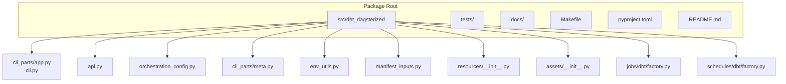
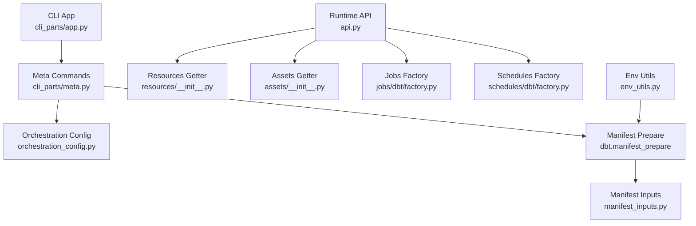
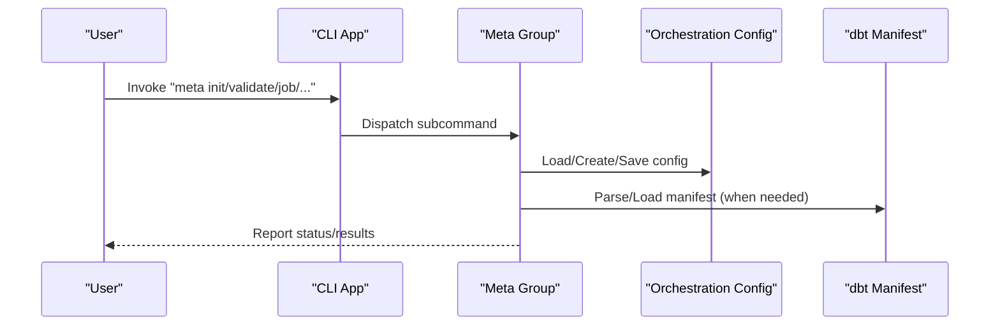
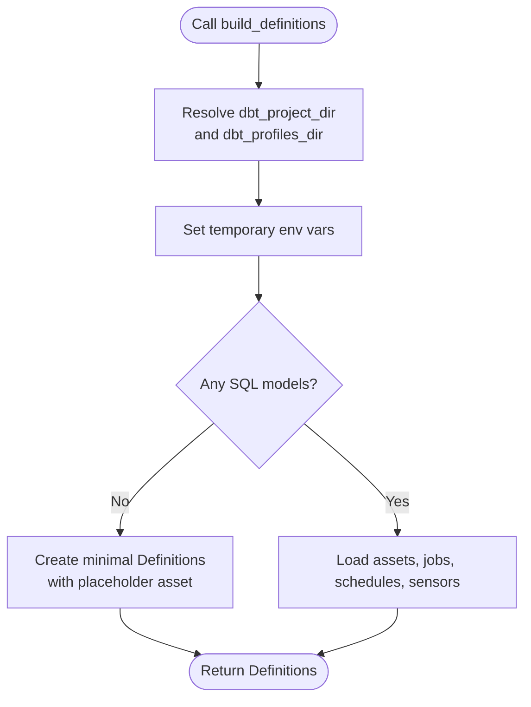
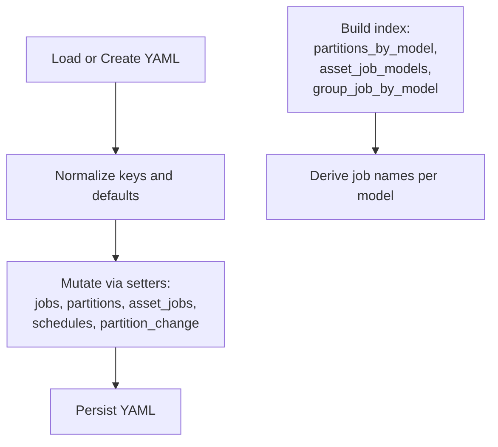
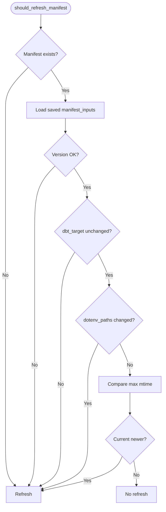
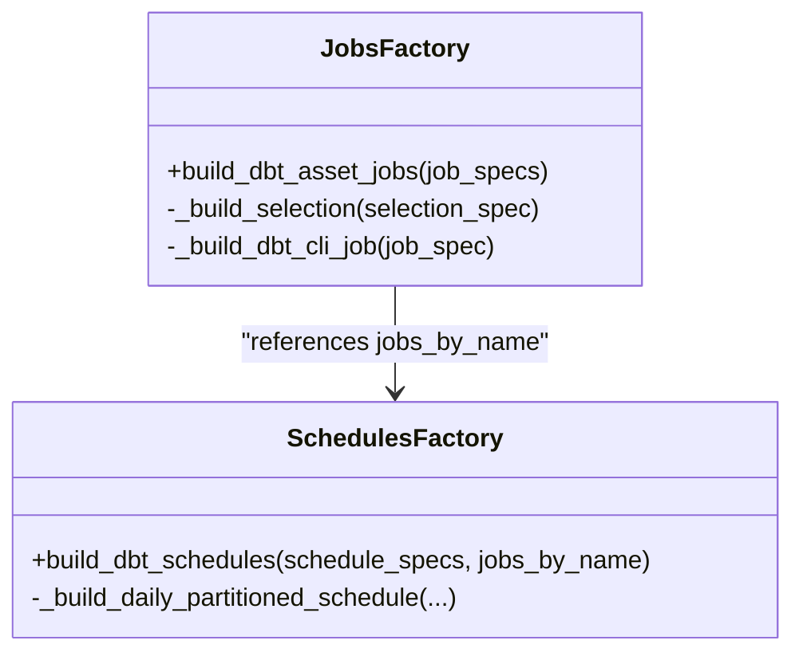
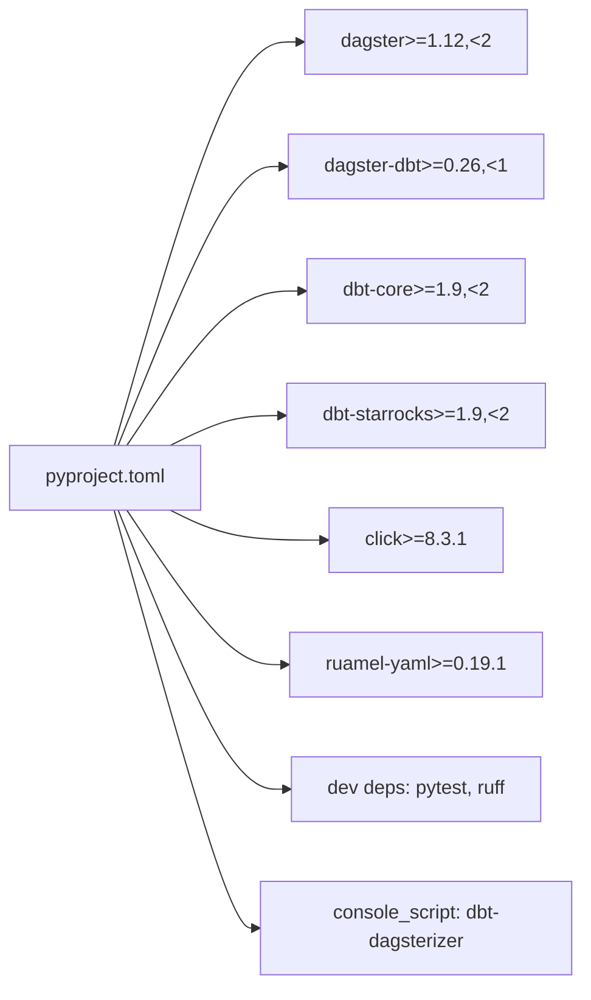

# Development Guide

<cite>
**Referenced Files in This Document**
- [README.md](file://README.md)
- [Makefile](file://Makefile)
- [pyproject.toml](file://pyproject.toml)
- [src/dbt_dagsterizer/__init__.py](file://src/dbt_dagsterizer/__init__.py)
- [src/dbt_dagsterizer/cli.py](file://src/dbt_dagsterizer/cli.py)
- [src/dbt_dagsterizer/cli_parts/app.py](file://src/dbt_dagsterizer/cli_parts/app.py)
- [src/dbt_dagsterizer/api.py](file://src/dbt_dagsterizer/api.py)
- [src/dbt_dagsterizer/env_utils.py](file://src/dbt_dagsterizer/env_utils.py)
- [src/dbt_dagsterizer/manifest_inputs.py](file://src/dbt_dagsterizer/manifest_inputs.py)
- [src/dbt_dagsterizer/orchestration_config.py](file://src/dbt_dagsterizer/orchestration_config.py)
- [src/dbt_dagsterizer/cli_parts/meta.py](file://src/dbt_dagsterizer/cli_parts/meta.py)
- [src/dbt_dagsterizer/assets/__init__.py](file://src/dbt_dagsterizer/assets/__init__.py)
- [src/dbt_dagsterizer/resources/__init__.py](file://src/dbt_dagsterizer/resources/__init__.py)
- [src/dbt_dagsterizer/jobs/dbt/factory.py](file://src/dbt_dagsterizer/jobs/dbt/factory.py)
- [src/dbt_dagsterizer/schedules/dbt/factory.py](file://src/dbt_dagsterizer/schedules/dbt/factory.py)
</cite>

## Table of Contents
1. [Introduction](#introduction)
2. [Project Structure](#project-structure)
3. [Core Components](#core-components)
4. [Architecture Overview](#architecture-overview)
5. [Detailed Component Analysis](#detailed-component-analysis)
6. [Dependency Analysis](#dependency-analysis)
7. [Performance Considerations](#performance-considerations)
8. [Testing Strategies](#testing-strategies)
9. [Contribution Workflows](#contribution-workflows)
10. [Debugging and Profiling](#debugging-and-profiling)
11. [Release Procedures and Versioning](#release-procedures-and-versioning)
12. [Examples and Extending Functionality](#examples-and-extending-functionality)
13. [Troubleshooting Guide](#troubleshooting-guide)
14. [Conclusion](#conclusion)

## Introduction
This development guide supports contributors to dbt-dagsterizer. It covers environment setup, testing, linting, CI preparation, code organization, quality practices, and extension patterns. It also documents the CLI surface, orchestration configuration model, and runtime API used by Dagster code locations.

## Project Structure
The repository is a Python package organized around a CLI, runtime API, orchestration configuration, and modular subsystems for assets, jobs, schedules, sensors, and resources. The Makefile and pyproject.toml define development tasks and packaging.

**Diagram sources**
- [src/dbt_dagsterizer/cli_parts/app.py:1-29](file://src/dbt_dagsterizer/cli_parts/app.py#L1-L29)
- [src/dbt_dagsterizer/cli.py:1-7](file://src/dbt_dagsterizer/cli.py#L1-L7)
- [src/dbt_dagsterizer/api.py:1-72](file://src/dbt_dagsterizer/api.py#L1-L72)
- [src/dbt_dagsterizer/orchestration_config.py:1-370](file://src/dbt_dagsterizer/orchestration_config.py#L1-L370)
- [src/dbt_dagsterizer/cli_parts/meta.py:1-627](file://src/dbt_dagsterizer/cli_parts/meta.py#L1-L627)
- [src/dbt_dagsterizer/env_utils.py:1-78](file://src/dbt_dagsterizer/env_utils.py#L1-L78)
- [src/dbt_dagsterizer/manifest_inputs.py:1-91](file://src/dbt_dagsterizer/manifest_inputs.py#L1-L91)
- [src/dbt_dagsterizer/resources/__init__.py:1-10](file://src/dbt_dagsterizer/resources/__init__.py#L1-L10)
- [src/dbt_dagsterizer/assets/__init__.py:1-13](file://src/dbt_dagsterizer/assets/__init__.py#L1-L13)
- [src/dbt_dagsterizer/jobs/dbt/factory.py:1-107](file://src/dbt_dagsterizer/jobs/dbt/factory.py#L1-L107)
- [src/dbt_dagsterizer/schedules/dbt/factory.py:1-99](file://src/dbt_dagsterizer/schedules/dbt/factory.py#L1-L99)

**Section sources**
- [README.md:1-101](file://README.md#L1-L101)
- [Makefile:1-25](file://Makefile#L1-L25)
- [pyproject.toml:1-50](file://pyproject.toml#L1-L50)

## Core Components
- CLI entrypoint builds a Click-based CLI with subcommands for metadata orchestration, macros, and project scaffolding.
- Runtime API exposes a single function to construct Dagster Definitions from a dbt project, handling empty projects gracefully.
- Orchestration configuration is a YAML-backed model persisted under a deterministic path, with helpers to load/create/save and derive indices.
- Environment utilities support .env parsing and temporary environment variable scoping during dbt operations.
- Manifest inputs capture dbt target and .env freshness to drive manifest refresh decisions.
- Assets, Jobs, Schedules, Sensors, and Resources are wired via module-level factories and getters.

**Section sources**
- [src/dbt_dagsterizer/cli_parts/app.py:1-29](file://src/dbt_dagsterizer/cli_parts/app.py#L1-L29)
- [src/dbt_dagsterizer/cli.py:1-7](file://src/dbt_dagsterizer/cli.py#L1-L7)
- [src/dbt_dagsterizer/api.py:1-72](file://src/dbt_dagsterizer/api.py#L1-L72)
- [src/dbt_dagsterizer/orchestration_config.py:1-370](file://src/dbt_dagsterizer/orchestration_config.py#L1-L370)
- [src/dbt_dagsterizer/env_utils.py:1-78](file://src/dbt_dagsterizer/env_utils.py#L1-L78)
- [src/dbt_dagsterizer/manifest_inputs.py:1-91](file://src/dbt_dagsterizer/manifest_inputs.py#L1-L91)
- [src/dbt_dagsterizer/assets/__init__.py:1-13](file://src/dbt_dagsterizer/assets/__init__.py#L1-L13)
- [src/dbt_dagsterizer/resources/__init__.py:1-10](file://src/dbt_dagsterizer/resources/__init__.py#L1-L10)

## Architecture Overview
The system separates concerns across CLI, runtime API, and orchestration configuration. The CLI orchestrates metadata updates and validation; the runtime API constructs Dagster Definitions dynamically from dbt artifacts and configuration.

**Diagram sources**
- [src/dbt_dagsterizer/cli_parts/app.py:1-29](file://src/dbt_dagsterizer/cli_parts/app.py#L1-L29)
- [src/dbt_dagsterizer/cli_parts/meta.py:1-627](file://src/dbt_dagsterizer/cli_parts/meta.py#L1-L627)
- [src/dbt_dagsterizer/orchestration_config.py:1-370](file://src/dbt_dagsterizer/orchestration_config.py#L1-L370)
- [src/dbt_dagsterizer/api.py:1-72](file://src/dbt_dagsterizer/api.py#L1-L72)
- [src/dbt_dagsterizer/resources/__init__.py:1-10](file://src/dbt_dagsterizer/resources/__init__.py#L1-L10)
- [src/dbt_dagsterizer/assets/__init__.py:1-13](file://src/dbt_dagsterizer/assets/__init__.py#L1-L13)
- [src/dbt_dagsterizer/jobs/dbt/factory.py:1-107](file://src/dbt_dagsterizer/jobs/dbt/factory.py#L1-L107)
- [src/dbt_dagsterizer/schedules/dbt/factory.py:1-99](file://src/dbt_dagsterizer/schedules/dbt/factory.py#L1-L99)
- [src/dbt_dagsterizer/env_utils.py:1-78](file://src/dbt_dagsterizer/env_utils.py#L1-L78)
- [src/dbt_dagsterizer/manifest_inputs.py:1-91](file://src/dbt_dagsterizer/manifest_inputs.py#L1-L91)

## Detailed Component Analysis

### CLI and Meta Commands
The CLI groups commands for initializing orchestration configuration, managing jobs, partitions, asset jobs, schedules, and partition-change detectors/propagators. Validation ensures structural and semantic correctness against the dbt manifest.

**Diagram sources**
- [src/dbt_dagsterizer/cli_parts/app.py:1-29](file://src/dbt_dagsterizer/cli_parts/app.py#L1-L29)
- [src/dbt_dagsterizer/cli_parts/meta.py:1-627](file://src/dbt_dagsterizer/cli_parts/meta.py#L1-L627)
- [src/dbt_dagsterizer/orchestration_config.py:1-370](file://src/dbt_dagsterizer/orchestration_config.py#L1-L370)

**Section sources**
- [src/dbt_dagsterizer/cli_parts/app.py:1-29](file://src/dbt_dagsterizer/cli_parts/app.py#L1-L29)
- [src/dbt_dagsterizer/cli_parts/meta.py:1-627](file://src/dbt_dagsterizer/cli_parts/meta.py#L1-L627)
- [src/dbt_dagsterizer/orchestration_config.py:1-370](file://src/dbt_dagsterizer/orchestration_config.py#L1-L370)

### Runtime API and Definitions Construction
The runtime API resolves dbt project/profile directories, temporarily sets environment variables, and returns a fully populated Dagster Definitions object. If no dbt models exist, it returns a minimal always-loadable Definitions with a placeholder asset and resources.

**Diagram sources**
- [src/dbt_dagsterizer/api.py:1-72](file://src/dbt_dagsterizer/api.py#L1-L72)
- [src/dbt_dagsterizer/env_utils.py:1-78](file://src/dbt_dagsterizer/env_utils.py#L1-L78)

**Section sources**
- [src/dbt_dagsterizer/api.py:1-72](file://src/dbt_dagsterizer/api.py#L1-L72)
- [src/dbt_dagsterizer/env_utils.py:1-78](file://src/dbt_dagsterizer/env_utils.py#L1-L78)

### Orchestration Configuration Model
The configuration is a YAML mapping persisted at a fixed path relative to the dbt project. Helpers ensure defaults, normalize legacy keys, and provide mutation APIs for jobs, partitions, schedules, and partition-change detectors/propagators. An index extracts relationships for deriving job names and validating uniqueness.

**Diagram sources**
- [src/dbt_dagsterizer/orchestration_config.py:1-370](file://src/dbt_dagsterizer/orchestration_config.py#L1-L370)

**Section sources**
- [src/dbt_dagsterizer/orchestration_config.py:1-370](file://src/dbt_dagsterizer/orchestration_config.py#L1-L370)

### Manifest Inputs and Refresh Logic
Manifest inputs capture dbt target and .env timestamps to decide whether to refresh the dbt manifest. The logic compares current vs saved inputs and triggers reparse when necessary.

**Diagram sources**
- [src/dbt_dagsterizer/manifest_inputs.py:1-91](file://src/dbt_dagsterizer/manifest_inputs.py#L1-L91)
- [src/dbt_dagsterizer/env_utils.py:1-78](file://src/dbt_dagsterizer/env_utils.py#L1-L78)

**Section sources**
- [src/dbt_dagsterizer/manifest_inputs.py:1-91](file://src/dbt_dagsterizer/manifest_inputs.py#L1-L91)
- [src/dbt_dagsterizer/env_utils.py:1-78](file://src/dbt_dagsterizer/env_utils.py#L1-L78)

### Jobs and Schedules Factories
Jobs factory builds asset jobs and optional dbt CLI jobs with partitioning and resource tagging. Schedules factory generates daily partitioned schedules with configurable offsets and lookbacks.

**Diagram sources**
- [src/dbt_dagsterizer/jobs/dbt/factory.py:1-107](file://src/dbt_dagsterizer/jobs/dbt/factory.py#L1-L107)
- [src/dbt_dagsterizer/schedules/dbt/factory.py:1-99](file://src/dbt_dagsterizer/schedules/dbt/factory.py#L1-L99)

**Section sources**
- [src/dbt_dagsterizer/jobs/dbt/factory.py:1-107](file://src/dbt_dagsterizer/jobs/dbt/factory.py#L1-L107)
- [src/dbt_dagsterizer/schedules/dbt/factory.py:1-99](file://src/dbt_dagsterizer/schedules/dbt/factory.py#L1-L99)

## Dependency Analysis
The package defines strict upper/lower bounds for core dependencies and exposes a console script entry point. Development dependencies include pytest and ruff. Packaging uses Hatch with shared data for project templates.

**Diagram sources**
- [pyproject.toml:1-50](file://pyproject.toml#L1-L50)

**Section sources**
- [pyproject.toml:1-50](file://pyproject.toml#L1-L50)

## Performance Considerations
- Manifest refresh gating: Use manifest inputs to avoid unnecessary dbt parses when .env and target have not changed.
- Partitioned runs: Prefer daily partitions and bounded lookbacks to limit downstream recomputation.
- Resource tagging: Apply Kubernetes run tags to leverage cluster scheduling and resource policies.
- Logging: Stream dbt CLI events to reduce polling overhead and improve observability.

[No sources needed since this section provides general guidance]

## Testing Strategies
- Unit tests live under tests/. Configure pytest discovery via pyproject.
- Use Makefile targets to run tests locally.
- For integration-like checks, validate CLI flows and orchestration config mutations.

Recommended local workflow:
- Install dev dependencies.
- Run tests.
- Lint with ruff.

**Section sources**
- [pyproject.toml:48-50](file://pyproject.toml#L48-L50)
- [Makefile:6-7](file://Makefile#L6-L7)

## Contribution Workflows
- Fork and branch from the default branch.
- Add or modify tests under tests/.
- Keep changes scoped; update docs and release notes as needed.
- Ensure tests pass and ruff check passes locally.
- Open a pull request with a clear description and rationale.

[No sources needed since this section doesn't analyze specific files]

## Debugging and Profiling
- Use temporary environment variables during dbt operations to isolate credentials and targets.
- Stream dbt CLI events from jobs to capture logs and diagnose failures.
- For performance hotspots, instrument long-running operations and consider partition boundaries.

**Section sources**
- [src/dbt_dagsterizer/env_utils.py:61-77](file://src/dbt_dagsterizer/env_utils.py#L61-L77)
- [src/dbt_dagsterizer/jobs/dbt/factory.py:49-61](file://src/dbt_dagsterizer/jobs/dbt/factory.py#L49-L61)

## Release Procedures and Versioning
- Version is defined in pyproject; increment according to semantic versioning.
- Build distribution artifacts via the Makefile target.
- Publish to production or test PyPI using provided targets with UV_PUBLISH_TOKEN set.

**Section sources**
- [pyproject.toml:3-3](file://pyproject.toml#L3-L3)
- [Makefile:15-24](file://Makefile#L15-L24)

## Examples and Extending Functionality

### Adding a New Job Type
- Extend the jobs factory to support a new job specification shape.
- Add validation and selection logic similar to existing asset and dbt_cli job builders.
- Wire the new job into the runtime API’s job getter.

**Section sources**
- [src/dbt_dagsterizer/jobs/dbt/factory.py:73-107](file://src/dbt_dagsterizer/jobs/dbt/factory.py#L73-L107)

### Introducing a New Schedule Type
- Add a builder in the schedules factory mirroring daily partitioned schedules.
- Support partition offsets and lookbacks appropriate to the new type.
- Register the schedule in the runtime API’s schedule getter.

**Section sources**
- [src/dbt_dagsterizer/schedules/dbt/factory.py:51-99](file://src/dbt_dagsterizer/schedules/dbt/factory.py#L51-L99)

### Extending Orchestration Configuration
- Add a new mutation function in orchestration_config.py.
- Ensure normalization and backwards-compatibility for legacy keys.
- Update the meta CLI to expose the new capability.

**Section sources**
- [src/dbt_dagsterizer/orchestration_config.py:161-236](file://src/dbt_dagsterizer/orchestration_config.py#L161-L236)
- [src/dbt_dagsterizer/cli_parts/meta.py:584-627](file://src/dbt_dagsterizer/cli_parts/meta.py#L584-L627)

## Troubleshooting Guide
- Manifest not found: Ensure dbt manifest exists or run with prepare to parse.
- Validation failures: Review warnings/errors printed by the validator and fix references or structure.
- Environment propagation: When using K8s run launcher, configure run-time env injection via deployment variables.

**Section sources**
- [src/dbt_dagsterizer/cli_parts/meta.py:584-627](file://src/dbt_dagsterizer/cli_parts/meta.py#L584-L627)
- [README.md:63-79](file://README.md#L63-L79)

## Conclusion
This guide outlined the development environment, architecture, and contribution practices for dbt-dagsterizer. By following the Makefile targets, linting, and testing guidance, contributors can reliably extend the CLI, runtime API, and orchestration model while maintaining backward compatibility and performance.