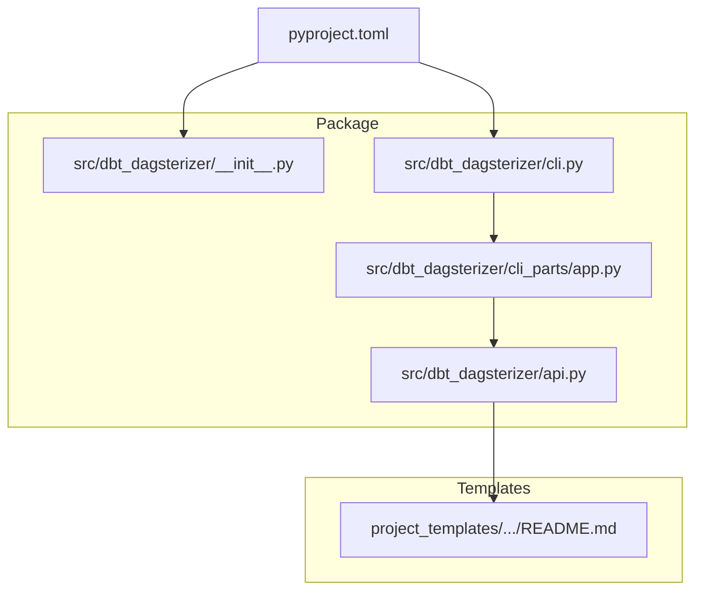
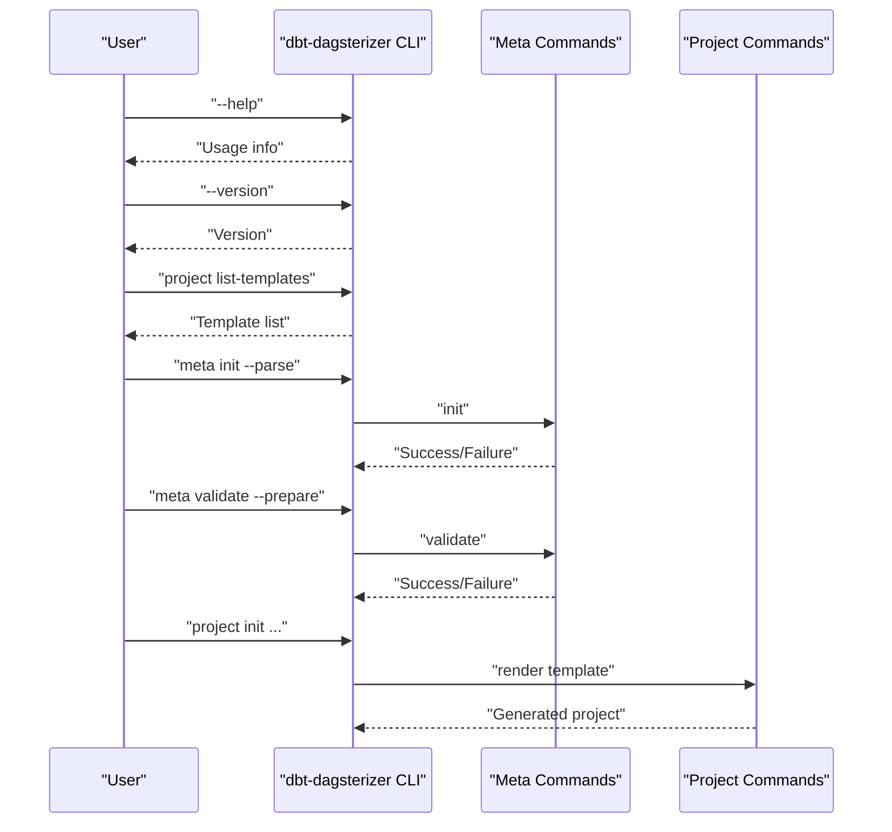
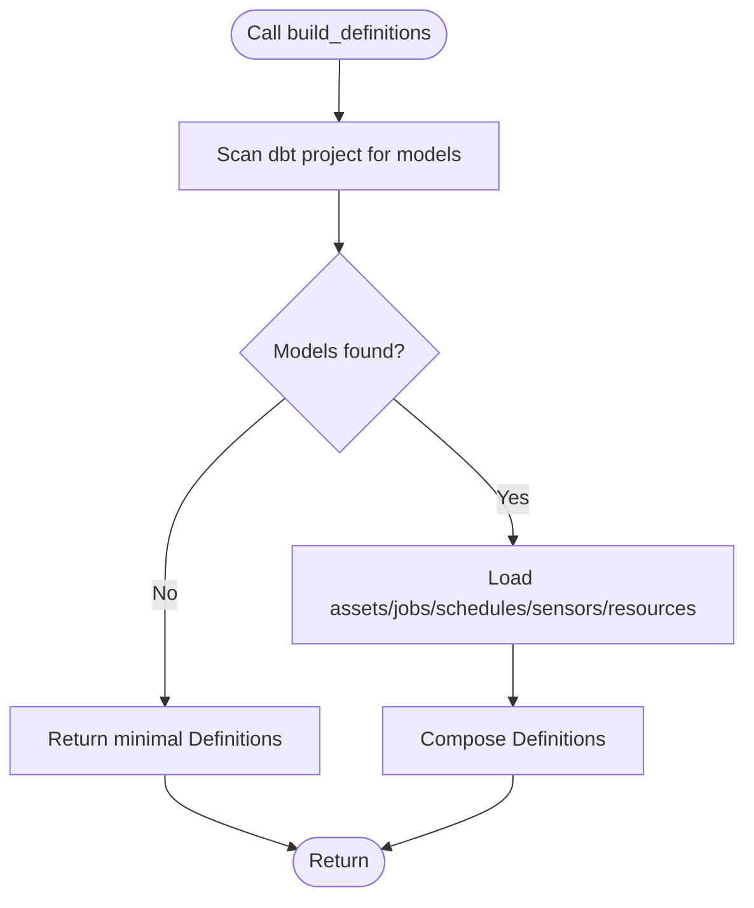
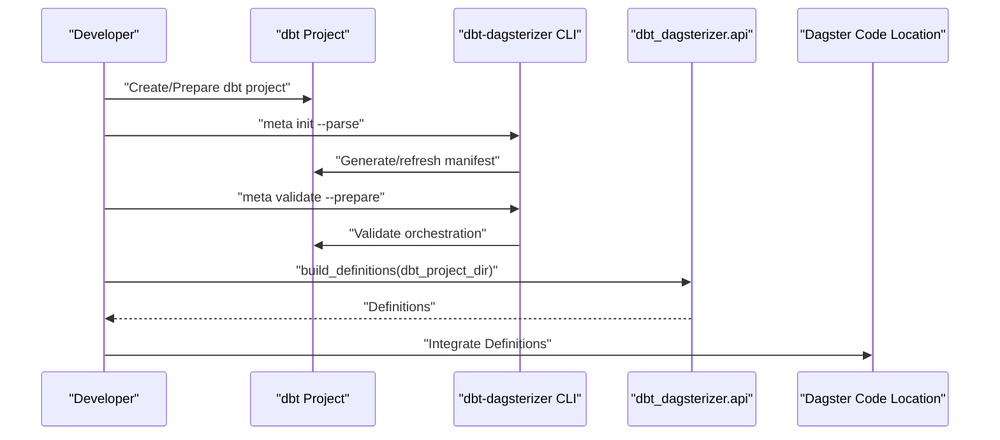
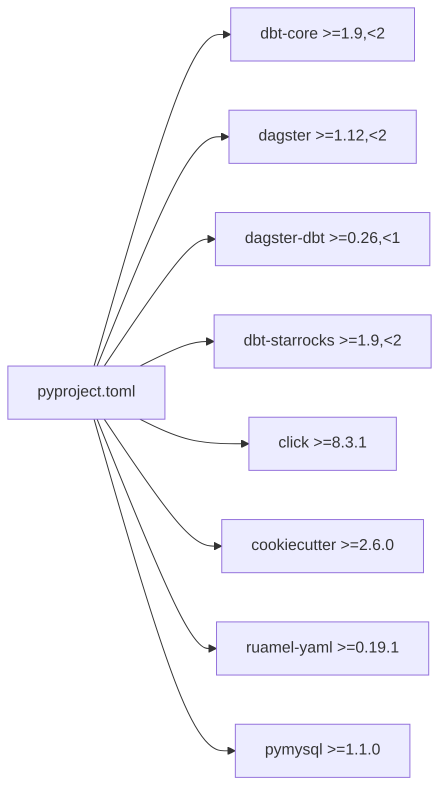

# Getting Started

<cite>
**Referenced Files in This Document**
- [README.md](file://README.md)
- [docs/getting-started.md](file://docs/getting-started.md)
- [pyproject.toml](file://pyproject.toml)
- [src/dbt_dagsterizer/__init__.py](file://src/dbt_dagsterizer/__init__.py)
- [src/dbt_dagsterizer/api.py](file://src/dbt_dagsterizer/api.py)
- [src/dbt_dagsterizer/cli.py](file://src/dbt_dagsterizer/cli.py)
- [src/dbt_dagsterizer/cli_parts/app.py](file://src/dbt_dagsterizer/cli_parts/app.py)
- [src/dbt_dagsterizer/project_templates/luban-dagster-dbt-starrocks-code-location-source-template/{{cookiecutter.output_name}}/README.md](file://src/dbt_dagsterizer/project_templates/luban-dagster-dbt-starrocks-code-location-source-template/{{cookiecutter.output_name}}/README.md)
</cite>

## Table of Contents
1. [Introduction](#introduction)
2. [Project Structure](#project-structure)
3. [Core Components](#core-components)
4. [Architecture Overview](#architecture-overview)
5. [Detailed Component Analysis](#detailed-component-analysis)
6. [Dependency Analysis](#dependency-analysis)
7. [Performance Considerations](#performance-considerations)
8. [Troubleshooting Guide](#troubleshooting-guide)
9. [Conclusion](#conclusion)
10. [Appendices](#appendices)

## Introduction
dbt-dagsterizer generates and validates Dagster orchestration for a dbt project using dbt metadata (manifest.json) and a small, reviewable orchestration file (dagsterization.yml). It supports two primary usage modes:
- CLI tool mode for bootstrapping and orchestrating dbt-dagsterizer commands
- Python dependency mode for importing APIs at runtime in a Dagster code location

This guide focuses on prerequisites, installation, development environment setup with uv, quick start workflows, and verification steps.

## Project Structure
At a high level, dbt-dagsterizer exposes:
- A CLI entrypoint that registers subcommands for project scaffolding, metadata management, and macro synchronization
- A Python API for building Dagster Definitions from a dbt project directory
- A set of project templates for generating complete code locations



**Diagram sources**
- [src/dbt_dagsterizer/cli.py:1-7](file://src/dbt_dagsterizer/cli.py#L1-L7)
- [src/dbt_dagsterizer/cli_parts/app.py:1-29](file://src/dbt_dagsterizer/cli_parts/app.py#L1-L29)
- [src/dbt_dagsterizer/api.py:1-72](file://src/dbt_dagsterizer/api.py#L1-L72)
- [src/dbt_dagsterizer/__init__.py:1-11](file://src/dbt_dagsterizer/__init__.py#L1-L11)
- [src/dbt_dagsterizer/project_templates/luban-dagster-dbt-starrocks-code-location-source-template/{{cookiecutter.output_name}}/README.md](file://src/dbt_dagsterizer/project_templates/luban-dagster-dbt-starrocks-code-location-source-template/{{cookiecutter.output_name}}/README.md)
- [pyproject.toml:1-50](file://pyproject.toml#L1-L50)

**Section sources**
- [pyproject.toml:1-50](file://pyproject.toml#L1-L50)
- [src/dbt_dagsterizer/cli.py:1-7](file://src/dbt_dagsterizer/cli.py#L1-L7)
- [src/dbt_dagsterizer/cli_parts/app.py:1-29](file://src/dbt_dagsterizer/cli_parts/app.py#L1-L29)
- [src/dbt_dagsterizer/api.py:1-72](file://src/dbt_dagsterizer/api.py#L1-L72)
- [src/dbt_dagsterizer/__init__.py:1-11](file://src/dbt_dagsterizer/__init__.py#L1-L11)

## Core Components
- CLI entrypoint: Registers version and subcommands for project, meta, and macros operations
- API surface: Provides build_definitions() to construct Dagster Definitions from a dbt project directory
- Version discovery: Reads package version for CLI version option

Key responsibilities:
- CLI: Exposes commands for initializing projects, managing metadata, and syncing macros
- API: Builds a fully populated Definitions object when dbt models exist, or a minimal placeholder when not

**Section sources**
- [src/dbt_dagsterizer/cli_parts/app.py:12-29](file://src/dbt_dagsterizer/cli_parts/app.py#L12-L29)
- [src/dbt_dagsterizer/api.py:15-72](file://src/dbt_dagsterizer/api.py#L15-L72)
- [src/dbt_dagsterizer/__init__.py:7-11](file://src/dbt_dagsterizer/__init__.py#L7-L11)

## Architecture Overview
The CLI and API share a common foundation: Click-based command registration and environment variable propagation for dbt configuration. The API wraps resource and orchestration modules to produce a cohesive Definitions object.

```mermaid
graph TB
subgraph "CLI"
CLIEntrypoint["cli.py"]
CLIBuilder["cli_parts/app.py"]
end
subgraph "API"
API["api.py"]
Resources["resources module"]
Assets["assets module"]
Jobs["jobs module"]
Schedules["schedules module"]
Sensors["sensors module"]
end
subgraph "Runtime"
Env["env_utils.temporary_env"]
end
CLIEntrypoint --> CLIBuilder
CLIBuilder --> API
API --> Env
API --> Resources
API --> Assets
API --> Jobs
API --> Schedules
API --> Sensors
```

**Diagram sources**
- [src/dbt_dagsterizer/cli.py:1-7](file://src/dbt_dagsterizer/cli.py#L1-L7)
- [src/dbt_dagsterizer/cli_parts/app.py:19-29](file://src/dbt_dagsterizer/cli_parts/app.py#L19-L29)
- [src/dbt_dagsterizer/api.py:15-72](file://src/dbt_dagsterizer/api.py#L15-L72)

## Detailed Component Analysis

### Installation and Prerequisites
- Python version: Requires Python >= 3.12
- Core dependencies include dbt-core, dagster, and related ecosystem packages
- Optional: uv for tool installation and development workflows

Practical steps:
- Install uv if not present
- Install dbt-dagsterizer as a CLI tool
- Add dbt-dagsterizer as a Python dependency in your Dagster code location project

Verification:
- Confirm CLI availability and version
- Verify Python interpreter meets the minimum version requirement

**Section sources**
- [pyproject.toml:6-16](file://pyproject.toml#L6-L16)
- [docs/getting-started.md:5-38](file://docs/getting-started.md#L5-L38)
- [README.md:11-28](file://README.md#L11-L28)

### Development Environment Setup with uv
Recommended development workflow:
- Sync development dependencies
- Run tests
- Lint with ruff

These commands streamline local iteration and ensure consistent formatting and testing.

**Section sources**
- [docs/getting-started.md:29-38](file://docs/getting-started.md#L29-L38)
- [README.md:84-100](file://README.md#L84-L100)
- [pyproject.toml:24-28](file://pyproject.toml#L24-L28)
- [pyproject.toml:48-50](file://pyproject.toml#L48-L50)

### Quick Start: CLI Workflow
Typical CLI commands:
- Show help and version
- List templates
- Initialize orchestration intent and validate metadata
- Render a new code-location project with optional sample dbt models



**Diagram sources**
- [docs/getting-started.md:39-84](file://docs/getting-started.md#L39-L84)
- [src/dbt_dagsterizer/cli_parts/app.py:19-29](file://src/dbt_dagsterizer/cli_parts/app.py#L19-L29)

**Section sources**
- [docs/getting-started.md:39-84](file://docs/getting-started.md#L39-L84)
- [README.md:38-62](file://README.md#L38-L62)

### Quick Start: Python API Integration
Basic pattern:
- Import build_definitions from dbt_dagsterizer.api
- Call build_definitions with dbt_project_dir
- Use the returned Definitions in your Dagster code location

Behavior:
- If no dbt models are present, returns a minimal, always-loadable Definitions
- If dbt models exist, constructs a full Definitions with assets, jobs, schedules, sensors, and resources



**Diagram sources**
- [src/dbt_dagsterizer/api.py:15-72](file://src/dbt_dagsterizer/api.py#L15-L72)

**Section sources**
- [docs/getting-started.md:85-96](file://docs/getting-started.md#L85-L96)
- [README.md:53-62](file://README.md#L53-L62)
- [src/dbt_dagsterizer/api.py:15-72](file://src/dbt_dagsterizer/api.py#L15-L72)

### Basic Workflow: From dbt Project to Dagster Definitions
End-to-end flow:
- Initialize a dbt project (or use an existing one)
- Generate and manage orchestration intent via meta commands
- Build Dagster Definitions either via CLI or Python API
- Integrate Definitions into your Dagster code location



**Diagram sources**
- [docs/getting-started.md:59-64](file://docs/getting-started.md#L59-L64)
- [docs/getting-started.md:85-96](file://docs/getting-started.md#L85-L96)
- [src/dbt_dagsterizer/api.py:15-72](file://src/dbt_dagsterizer/api.py#L15-L72)

**Section sources**
- [docs/getting-started.md:59-64](file://docs/getting-started.md#L59-L64)
- [docs/getting-started.md:85-96](file://docs/getting-started.md#L85-L96)

### Practical Examples

#### New Project Creation Scenario
- Use project init to render a new code-location project
- Optionally include sample dbt models
- Pin or unpin dbt-dagsterizer version as desired

Reference paths:
- [docs/getting-started.md:66-84](file://docs/getting-started.md#L66-L84)

#### Existing Project Integration Scenario
- Initialize orchestration intent and validate metadata
- Build Definitions in your existing Dagster code location
- Integrate into your deployment

Reference paths:
- [docs/getting-started.md:59-64](file://docs/getting-started.md#L59-L64)
- [docs/getting-started.md:85-96](file://docs/getting-started.md#L85-L96)

**Section sources**
- [docs/getting-started.md:59-96](file://docs/getting-started.md#L59-L96)

## Dependency Analysis
dbt-dagsterizer declares strict upper and lower bounds for core dependencies to ensure compatibility and stability.



**Diagram sources**
- [pyproject.toml:7-16](file://pyproject.toml#L7-L16)

**Section sources**
- [pyproject.toml:7-16](file://pyproject.toml#L7-L16)

## Performance Considerations
- Keep dbt manifests fresh by running meta validate after schema or model changes
- Prefer incremental updates to dagsterization.yml to minimize reprocessing
- Use partitioning presets judiciously to avoid excessive downstream recomputation

## Troubleshooting Guide
Common issues and checks:
- Python version mismatch: Ensure Python >= 3.12
- Missing dbt models: build_definitions returns a minimal Definitions when no models are present
- CLI not found: Confirm uv tool installation and PATH resolution
- Manifest staleness: Re-run meta init --parse and meta validate --prepare after dbt changes

Verification steps:
- Confirm CLI version and help output
- Validate that DAGSTER_DAILY_PARTITIONS_START_DATE is set when using daily partitioning
- Test API import and build_definitions in your environment

**Section sources**
- [pyproject.toml:6](file://pyproject.toml#L6)
- [docs/getting-started.md:97-103](file://docs/getting-started.md#L97-L103)
- [README.md:11-28](file://README.md#L11-L28)
- [src/dbt_dagsterizer/api.py:44-57](file://src/dbt_dagsterizer/api.py#L44-L57)

## Conclusion
With uv and dbt-dagsterizer, you can quickly bootstrap a new code location or integrate orchestration into an existing dbt project. Use the CLI for project scaffolding and metadata management, and the Python API to embed Definitions into your Dagster code location. Keep dependencies aligned with declared compatibility and validate manifests regularly for reliable orchestration.

## Appendices

### Appendix A: CLI Reference Highlights
- Show help and version
- List templates
- Initialize and validate orchestration intent
- Render a new project with optional sample dbt models

Reference paths:
- [docs/getting-started.md:39-84](file://docs/getting-started.md#L39-L84)

### Appendix B: Python API Reference Highlights
- Import build_definitions
- Call with dbt_project_dir
- Behavior with and without dbt models

Reference paths:
- [docs/getting-started.md:85-96](file://docs/getting-started.md#L85-L96)
- [src/dbt_dagsterizer/api.py:15-72](file://src/dbt_dagsterizer/api.py#L15-L72)