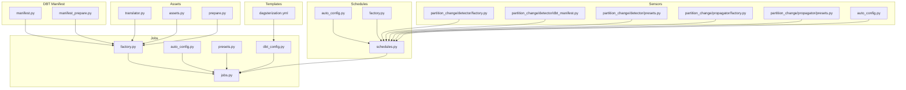
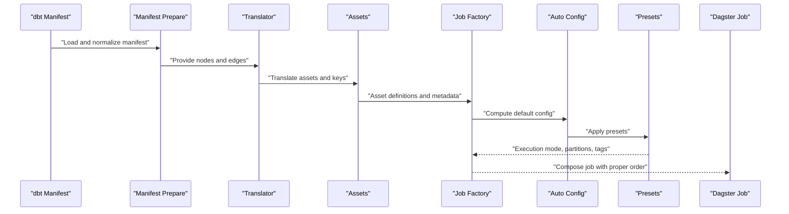
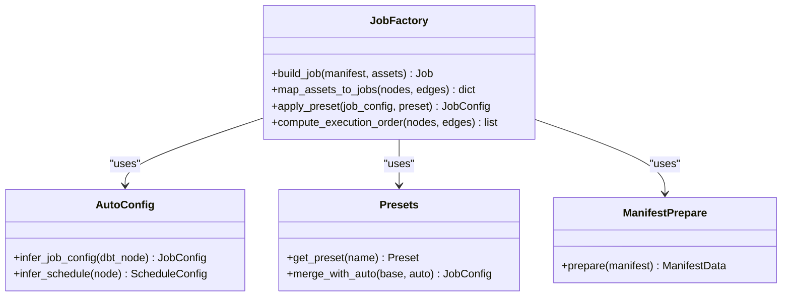
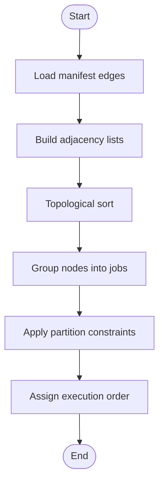
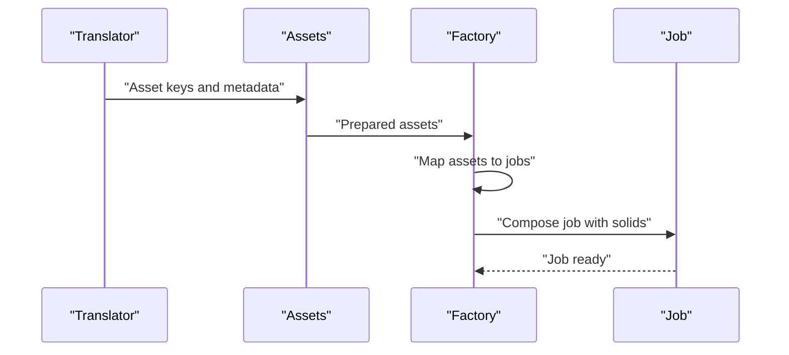
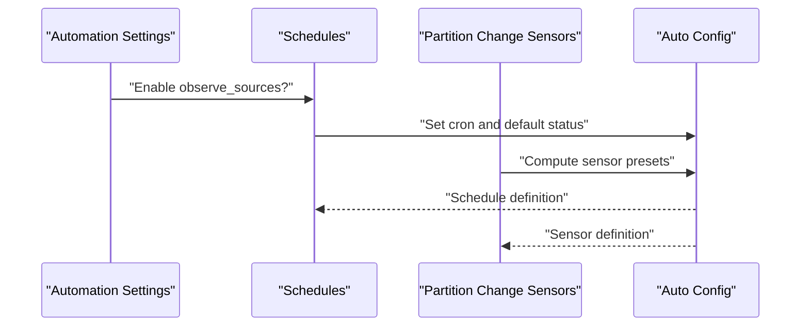
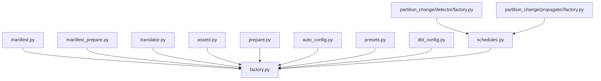

# Automatic Job Creation

<cite>
**Referenced Files in This Document**
- [jobs.py](file://src/dbt_dagsterizer/jobs/dbt/jobs.py)
- [factory.py](file://src/dbt_dagsterizer/jobs/dbt/factory.py)
- [auto_config.py](file://src/dbt_dagsterizer/jobs/dbt/auto_config.py)
- [presets.py](file://src/dbt_dagsterizer/jobs/dbt/presets.py)
- [dbt_config.py](file://src/dbt_dagsterizer/jobs/dbt_config.py)
- [manifest.py](file://src/dbt_dagsterizer/dbt/manifest.py)
- [manifest_prepare.py](file://src/dbt_dagsterizer/dbt/manifest_prepare.py)
- [assets.py](file://src/dbt_dagsterizer/assets/dbt/assets.py)
- [translator.py](file://src/dbt_dagsterizer/assets/dbt/translator.py)
- [prepare.py](file://src/dbt_dagsterizer/assets/dbt/prepare.py)
- [automation.py](file://src/dbt_dagsterizer/assets/sources/automation.py)
- [schedules.py](file://src/dbt_dagsterizer/schedules/sources/schedules.py)
- [partition_change/detector/factory.py](file://src/dbt_dagsterizer/sensors/partition_change/detector/factory.py)
- [partition_change/detector/dbt_manifest.py](file://src/dbt_dagsterizer/sensors/partition_change/detector/dbt_manifest.py)
- [partition_change/detector/presets.py](file://src/dbt_dagsterizer/sensors/partition_change/detector/presets.py)
- [partition_change/propagator/factory.py](file://src/dbt_dagsterizer/sensors/partition_change/propagator/factory.py)
- [partition_change/propagator/presets.py](file://src/dbt_dagsterizer/sensors/partition_change/propagator/presets.py)
- [auto_config.py](file://src/dbt_dagsterizer/sensors/partition_change/auto_config.py)
- [dagsterization.yml](file://src/dbt_dagsterizer/project_templates/luban-dagster-dbt-starrocks-code-location-source-template/{{cookiecutter.output_name}}/dbt_project/dagsterization.yml)
</cite>

## Table of Contents
1. [Introduction](#introduction)
2. [Project Structure](#project-structure)
3. [Core Components](#core-components)
4. [Architecture Overview](#architecture-overview)
5. [Detailed Component Analysis](#detailed-component-analysis)
6. [Dependency Analysis](#dependency-analysis)
7. [Performance Considerations](#performance-considerations)
8. [Troubleshooting Guide](#troubleshooting-guide)
9. [Conclusion](#conclusion)
10. [Appendices](#appendices)

## Introduction
This document explains how dbt-dagsterizer automatically creates Dagster jobs from dbt model dependencies and manifest data. It covers the dependency graph analysis process, job composition algorithms, automatic scheduling inference, and the factory pattern used to generate jobs. It also documents configuration options for automatic behavior, naming conventions, and metadata assignment, with examples drawn from different dbt model types and dependency scenarios.

## Project Structure
The automatic job creation capability spans several modules:
- Jobs: automatic job generation and configuration for dbt assets
- Schedules: automatic schedule inference for dbt jobs and observable sources
- Sensors: partition change detection and propagation, informing job execution windows
- Assets: dbt asset translation and preparation for Dagster
- DBT Manifest: parsing and preparing dbt manifest data for job/schedule inference
- Templates: project-level configuration for dagsterization behavior

**Diagram sources**
- [jobs.py](file://src/dbt_dagsterizer/jobs/dbt/jobs.py)
- [factory.py](file://src/dbt_dagsterizer/jobs/dbt/factory.py)
- [auto_config.py](file://src/dbt_dagsterizer/jobs/dbt/auto_config.py)
- [presets.py](file://src/dbt_dagsterizer/jobs/dbt/presets.py)
- [dbt_config.py](file://src/dbt_dagsterizer/jobs/dbt_config.py)
- [manifest.py](file://src/dbt_dagsterizer/dbt/manifest.py)
- [manifest_prepare.py](file://src/dbt_dagsterizer/dbt/manifest_prepare.py)
- [assets.py](file://src/dbt_dagsterizer/assets/dbt/assets.py)
- [translator.py](file://src/dbt_dagsterizer/assets/dbt/translator.py)
- [prepare.py](file://src/dbt_dagsterizer/assets/dbt/prepare.py)
- [schedules.py](file://src/dbt_dagsterizer/schedules/sources/schedules.py)
- [partition_change/detector/factory.py](file://src/dbt_dagsterizer/sensors/partition_change/detector/factory.py)
- [partition_change/detector/dbt_manifest.py](file://src/dbt_dagsterizer/sensors/partition_change/detector/dbt_manifest.py)
- [partition_change/detector/presets.py](file://src/dbt_dagsterizer/sensors/partition_change/detector/presets.py)
- [partition_change/propagator/factory.py](file://src/dbt_dagsterizer/sensors/partition_change/propagator/factory.py)
- [partition_change/propagator/presets.py](file://src/dbt_dagsterizer/sensors/partition_change/propagator/presets.py)
- [auto_config.py](file://src/dbt_dagsterizer/sensors/partition_change/auto_config.py)
- [dagsterization.yml](file://src/dbt_dagsterizer/project_templates/luban-dagster-dbt-starrocks-code-location-source-template/{{cookiecutter.output_name}}/dbt_project/dagsterization.yml)

**Section sources**
- [jobs.py](file://src/dbt_dagsterizer/jobs/dbt/jobs.py)
- [factory.py](file://src/dbt_dagsterizer/jobs/dbt/factory.py)
- [auto_config.py](file://src/dbt_dagsterizer/jobs/dbt/auto_config.py)
- [presets.py](file://src/dbt_dagsterizer/jobs/dbt/presets.py)
- [dbt_config.py](file://src/dbt_dagsterizer/jobs/dbt_config.py)
- [manifest.py](file://src/dbt_dagsterizer/dbt/manifest.py)
- [manifest_prepare.py](file://src/dbt_dagsterizer/dbt/manifest_prepare.py)
- [assets.py](file://src/dbt_dagsterizer/assets/dbt/assets.py)
- [translator.py](file://src/dbt_dagsterizer/assets/dbt/translator.py)
- [prepare.py](file://src/dbt_dagsterizer/assets/dbt/prepare.py)
- [schedules.py](file://src/dbt_dagsterizer/schedules/sources/schedules.py)
- [partition_change/detector/factory.py](file://src/dbt_dagsterizer/sensors/partition_change/detector/factory.py)
- [partition_change/detector/dbt_manifest.py](file://src/dbt_dagsterizer/sensors/partition_change/detector/dbt_manifest.py)
- [partition_change/detector/presets.py](file://src/dbt_dagsterizer/sensors/partition_change/detector/presets.py)
- [partition_change/propagator/factory.py](file://src/dbt_dagsterizer/sensors/partition_change/propagator/factory.py)
- [partition_change/propagator/presets.py](file://src/dbt_dagsterizer/sensors/partition_change/propagator/presets.py)
- [auto_config.py](file://src/dbt_dagsterizer/sensors/partition_change/auto_config.py)
- [dagsterization.yml](file://src/dbt_dagsterizer/project_templates/luban-dagster-dbt-starrocks-code-location-source-template/{{cookiecutter.output_name}}/dbt_project/dagsterization.yml)

## Core Components
- Job Factory: constructs Dagster jobs from dbt manifest data and asset definitions.
- Auto Config: computes default job and schedule configurations from dbt dependencies and project settings.
- Presets: provides named defaults for job modes, partitions, and execution policies.
- DBT Manifest Integration: parses and prepares dbt manifest artifacts for job/sensor inference.
- Assets Pipeline: translates dbt assets into Dagster assets and prepares them for job composition.
- Schedules: infers schedules for dbt jobs and observable sources based on automation settings.
- Sensors: detects partition changes and propagates impact ranges to refine job execution windows.

Key responsibilities:
- Dependency Graph Analysis: build topological ordering of dbt nodes to determine execution order.
- Asset-to-Job Mapping: map dbt assets to jobs while respecting upstream/downstream boundaries.
- Automatic Scheduling Inference: derive cron schedules and default statuses from dbt metadata and project presets.
- Metadata Assignment: propagate dbt model properties and tags into Dagster job and asset metadata.

**Section sources**
- [factory.py](file://src/dbt_dagsterizer/jobs/dbt/factory.py)
- [auto_config.py](file://src/dbt_dagsterizer/jobs/dbt/auto_config.py)
- [presets.py](file://src/dbt_dagsterizer/jobs/dbt/presets.py)
- [manifest.py](file://src/dbt_dagsterizer/dbt/manifest.py)
- [manifest_prepare.py](file://src/dbt_dagsterizer/dbt/manifest_prepare.py)
- [assets.py](file://src/dbt_dagsterizer/assets/dbt/assets.py)
- [translator.py](file://src/dbt_dagsterizer/assets/dbt/translator.py)
- [prepare.py](file://src/dbt_dagsterizer/assets/dbt/prepare.py)
- [schedules.py](file://src/dbt_dagsterizer/schedules/sources/schedules.py)
- [partition_change/detector/factory.py](file://src/dbt_dagsterizer/sensors/partition_change/detector/factory.py)
- [partition_change/propagator/factory.py](file://src/dbt_dagsterizer/sensors/partition_change/propagator/factory.py)

## Architecture Overview
The automatic job creation pipeline integrates dbt manifest data, asset translation, and preset-driven configuration to produce Dagster jobs and schedules.

**Diagram sources**
- [manifest.py](file://src/dbt_dagsterizer/dbt/manifest.py)
- [manifest_prepare.py](file://src/dbt_dagsterizer/dbt/manifest_prepare.py)
- [translator.py](file://src/dbt_dagsterizer/assets/dbt/translator.py)
- [assets.py](file://src/dbt_dagsterizer/assets/dbt/assets.py)
- [factory.py](file://src/dbt_dagsterizer/jobs/dbt/factory.py)
- [auto_config.py](file://src/dbt_dagsterizer/jobs/dbt/auto_config.py)
- [presets.py](file://src/dbt_dagsterizer/jobs/dbt/presets.py)

## Detailed Component Analysis

### Job Factory Pattern
The job factory builds Dagster jobs from dbt assets and manifest data. It orchestrates:
- Topological sorting of dbt nodes to define execution order
- Asset-to-job mapping respecting upstream/downstream boundaries
- Metadata propagation from dbt to Dagster (tags, owners, descriptions)
- Partition and schedule configuration via presets and automation settings

**Diagram sources**
- [factory.py](file://src/dbt_dagsterizer/jobs/dbt/factory.py)
- [auto_config.py](file://src/dbt_dagsterizer/jobs/dbt/auto_config.py)
- [presets.py](file://src/dbt_dagsterizer/jobs/dbt/presets.py)
- [manifest_prepare.py](file://src/dbt_dagsterizer/dbt/manifest_prepare.py)

**Section sources**
- [factory.py](file://src/dbt_dagsterizer/jobs/dbt/factory.py)
- [auto_config.py](file://src/dbt_dagsterizer/jobs/dbt/auto_config.py)
- [presets.py](file://src/dbt_dagsterizer/jobs/dbt/presets.py)
- [manifest_prepare.py](file://src/dbt_dagsterizer/dbt/manifest_prepare.py)

### Dependency Graph Analysis and Execution Order
The factory analyzes dbt manifest edges to construct a dependency graph and compute execution order:
- Build adjacency lists from manifest edges
- Perform topological sort to determine node execution order
- Group nodes into job units respecting asset boundaries and partition constraints
- Assign downstream tasks to run after upstream completion

**Diagram sources**
- [factory.py](file://src/dbt_dagsterizer/jobs/dbt/factory.py)
- [manifest_prepare.py](file://src/dbt_dagsterizer/dbt/manifest_prepare.py)

**Section sources**
- [factory.py](file://src/dbt_dagsterizer/jobs/dbt/factory.py)
- [manifest_prepare.py](file://src/dbt_dagsterizer/dbt/manifest_prepare.py)

### Asset-to-Job Mapping and Composition
The factory maps dbt assets to jobs by:
- Translating dbt relations to Dagster asset keys
- Using translator utilities to resolve naming and grouping
- Preparing assets with metadata and partition definitions
- Composing job solids in execution order and attaching schedules

**Diagram sources**
- [translator.py](file://src/dbt_dagsterizer/assets/dbt/translator.py)
- [assets.py](file://src/dbt_dagsterizer/assets/dbt/assets.py)
- [factory.py](file://src/dbt_dagsterizer/jobs/dbt/factory.py)

**Section sources**
- [translator.py](file://src/dbt_dagsterizer/assets/dbt/translator.py)
- [assets.py](file://src/dbt_dagsterizer/assets/dbt/assets.py)
- [factory.py](file://src/dbt_dagsterizer/jobs/dbt/factory.py)

### Automatic Scheduling Inference
Schedules are inferred from dbt automation settings and project presets:
- Observable sources schedule: checks automation flag and sets cron and default status
- Partition change sensors: detect partition updates and propagate impact ranges
- Sensor factories: build sensor definitions aligned with dbt manifest and presets

**Diagram sources**
- [schedules.py](file://src/dbt_dagsterizer/schedules/sources/schedules.py)
- [auto_config.py](file://src/dbt_dagsterizer/sensors/partition_change/auto_config.py)
- [partition_change/detector/factory.py](file://src/dbt_dagsterizer/sensors/partition_change/detector/factory.py)
- [partition_change/propagator/factory.py](file://src/dbt_dagsterizer/sensors/partition_change/propagator/factory.py)

**Section sources**
- [schedules.py](file://src/dbt_dagsterizer/schedules/sources/schedules.py)
- [auto_config.py](file://src/dbt_dagsterizer/sensors/partition_change/auto_config.py)
- [partition_change/detector/factory.py](file://src/dbt_dagsterizer/sensors/partition_change/detector/factory.py)
- [partition_change/propagator/factory.py](file://src/dbt_dagsterizer/sensors/partition_change/propagator/factory.py)

### Configuration Options and Naming Conventions
Configuration is driven by:
- Project-level presets and automation flags
- DBT manifest metadata (model owners, tags, materializations)
- Template-defined defaults in dagsterization.yml
- Environment variables for schedule tuning

Examples of configurable aspects:
- Job naming conventions derived from dbt model names and groups
- Partition definitions mapped from dbt models to Dagster partitions
- Cron schedule presets applied per model type or group
- Default status for schedules controlled by automation flags

**Section sources**
- [presets.py](file://src/dbt_dagsterizer/jobs/dbt/presets.py)
- [dbt_config.py](file://src/dbt_dagsterizer/jobs/dbt_config.py)
- [dagsterization.yml](file://src/dbt_dagsterizer/project_templates/luban-dagster-dbt-starrocks-code-location-source-template/{{cookiecutter.output_name}}/dbt_project/dagsterization.yml)

### Examples of Automatic Job Generation

#### Example 1: Incremental Model with Partitioned Upstream
- Scenario: An incremental dbt model depends on a partitioned upstream model.
- Behavior: The factory groups nodes into a single job respecting partition boundaries, assigns execution order via topological sort, and applies partition presets for downstream runs.

#### Example 2: Star Schema with Fact/Dimension Separation
- Scenario: A fact table depends on multiple dimension tables.
- Behavior: The factory composes a job that executes dimension tables first, followed by the fact table, ensuring data consistency.

#### Example 3: Observability Workflow
- Scenario: Observable sources are enabled via automation.
- Behavior: A schedule is created with a default status set to running and a cron interval configured from environment variables.

**Section sources**
- [factory.py](file://src/dbt_dagsterizer/jobs/dbt/factory.py)
- [schedules.py](file://src/dbt_dagsterizer/schedules/sources/schedules.py)
- [partition_change/detector/factory.py](file://src/dbt_dagsterizer/sensors/partition_change/detector/factory.py)
- [partition_change/propagator/factory.py](file://src/dbt_dagsterizer/sensors/partition_change/propagator/factory.py)

## Dependency Analysis
The automatic job creation system exhibits cohesive coupling around manifest parsing, asset translation, and preset-driven configuration.

**Diagram sources**
- [manifest.py](file://src/dbt_dagsterizer/dbt/manifest.py)
- [manifest_prepare.py](file://src/dbt_dagsterizer/dbt/manifest_prepare.py)
- [translator.py](file://src/dbt_dagsterizer/assets/dbt/translator.py)
- [assets.py](file://src/dbt_dagsterizer/assets/dbt/assets.py)
- [prepare.py](file://src/dbt_dagsterizer/assets/dbt/prepare.py)
- [auto_config.py](file://src/dbt_dagsterizer/jobs/dbt/auto_config.py)
- [presets.py](file://src/dbt_dagsterizer/jobs/dbt/presets.py)
- [dbt_config.py](file://src/dbt_dagsterizer/jobs/dbt_config.py)
- [schedules.py](file://src/dbt_dagsterizer/schedules/sources/schedules.py)
- [partition_change/detector/factory.py](file://src/dbt_dagsterizer/sensors/partition_change/detector/factory.py)
- [partition_change/propagator/factory.py](file://src/dbt_dagsterizer/sensors/partition_change/propagator/factory.py)

**Section sources**
- [factory.py](file://src/dbt_dagsterizer/jobs/dbt/factory.py)
- [auto_config.py](file://src/dbt_dagsterizer/jobs/dbt/auto_config.py)
- [presets.py](file://src/dbt_dagsterizer/jobs/dbt/presets.py)
- [dbt_config.py](file://src/dbt_dagsterizer/jobs/dbt_config.py)
- [manifest.py](file://src/dbt_dagsterizer/dbt/manifest.py)
- [manifest_prepare.py](file://src/dbt_dagsterizer/dbt/manifest_prepare.py)
- [assets.py](file://src/dbt_dagsterizer/assets/dbt/assets.py)
- [translator.py](file://src/dbt_dagsterizer/assets/dbt/translator.py)
- [prepare.py](file://src/dbt_dagsterizer/assets/dbt/prepare.py)
- [schedules.py](file://src/dbt_dagsterizer/schedules/sources/schedules.py)
- [partition_change/detector/factory.py](file://src/dbt_dagsterizer/sensors/partition_change/detector/factory.py)
- [partition_change/propagator/factory.py](file://src/dbt_dagsterizer/sensors/partition_change/propagator/factory.py)

## Performance Considerations
- Prefer topological sorting over repeated dependency resolution to minimize overhead.
- Cache prepared manifest data and asset translations to avoid recomputation across runs.
- Limit job granularity to reduce scheduler overhead while preserving data correctness.
- Use partition-aware scheduling to constrain execution windows and reduce redundant runs.

## Troubleshooting Guide
Common issues and resolutions:
- Missing automation flag for observable sources: ensure the automation flag is enabled so the observe_sources schedule is generated.
- Incorrect cron schedule: verify environment variables and presets align with desired frequency.
- Partition mismatch errors: confirm dbt model partition definitions match Dagster partition presets.
- Job not appearing: check asset translation and prepare steps to ensure assets are registered.

**Section sources**
- [schedules.py](file://src/dbt_dagsterizer/schedules/sources/schedules.py)
- [auto_config.py](file://src/dbt_dagsterizer/sensors/partition_change/auto_config.py)
- [partition_change/detector/factory.py](file://src/dbt_dagsterizer/sensors/partition_change/detector/factory.py)
- [partition_change/propagator/factory.py](file://src/dbt_dagsterizer/sensors/partition_change/propagator/factory.py)

## Conclusion
dbt-dagsterizer’s automatic job creation leverages dbt manifest data, asset translation, and preset-driven configuration to compose efficient Dagster jobs and schedules. The factory pattern coordinates dependency graph analysis, asset-to-job mapping, and scheduling inference, while templates and automation flags tailor behavior to project needs.

## Appendices
- Additional references for project-level configuration and automation flags are available in the template dagsterization.yml and related automation modules.