# Job Dependency Resolution

<cite>
**Referenced Files in This Document**
- [orchestration_config.py](file://src/dbt_dagsterizer/orchestration_config.py)
- [jobs.py](file://src/dbt_dagsterizer/jobs/dbt/jobs.py)
- [auto_config.py](file://src/dbt_dagsterizer/jobs/dbt/auto_config.py)
- [factory.py](file://src/dbt_dagsterizer/jobs/dbt/factory.py)
- [presets.py](file://src/dbt_dagsterizer/jobs/dbt/presets.py)
- [manifest_prepare.py](file://src/dbt_dagsterizer/dbt/manifest_prepare.py)
- [manifest_inputs.py](file://src/dbt_dagsterizer/manifest_inputs.py)
- [dbt_manifest.py](file://src/dbt_dagsterizer/sensors/partition_change/detector/dbt_manifest.py)
- [validation.py](file://src/dbt_dagsterizer/cli_parts/validation.py)
- [meta.py](file://src/dbt_dagsterizer/cli_parts/meta.py)
- [run_results.py](file://src/dbt_dagsterizer/dbt/run_results.py)
- [execution-model.md](file://docs/concepts/execution-model.md)
- [test_cli.py](file://tests/test_cli.py)
</cite>

## Table of Contents
1. [Introduction](#introduction)
2. [Project Structure](#project-structure)
3. [Core Components](#core-components)
4. [Architecture Overview](#architecture-overview)
5. [Detailed Component Analysis](#detailed-component-analysis)
6. [Dependency Analysis](#dependency-analysis)
7. [Performance Considerations](#performance-considerations)
8. [Troubleshooting Guide](#troubleshooting-guide)
9. [Conclusion](#conclusion)

## Introduction
This document explains how dbt-dagsterizer analyzes dbt model dependencies to construct optimal execution graphs for jobs. It covers dependency chain resolution, circular dependency detection, conflict resolution, parallelization and batching strategies, resource optimization, visualization, execution planning, and performance tuning. It also includes examples of complex dependency scenarios, upstream/downstream relationships, and practical troubleshooting steps grounded in the repository’s implementation.

## Project Structure
The dependency resolution pipeline spans several modules:
- Orchestration configuration and validation define job groups and partitioning policies.
- Auto-config and presets generate job specifications from dbt manifests and orchestration metadata.
- Factory modules transform specifications into executable Dagster jobs.
- Manifest preparation ensures dbt artifacts are present and up-to-date.
- Sensors and detectors use dbt manifests to infer impact ranges and trigger propagation.

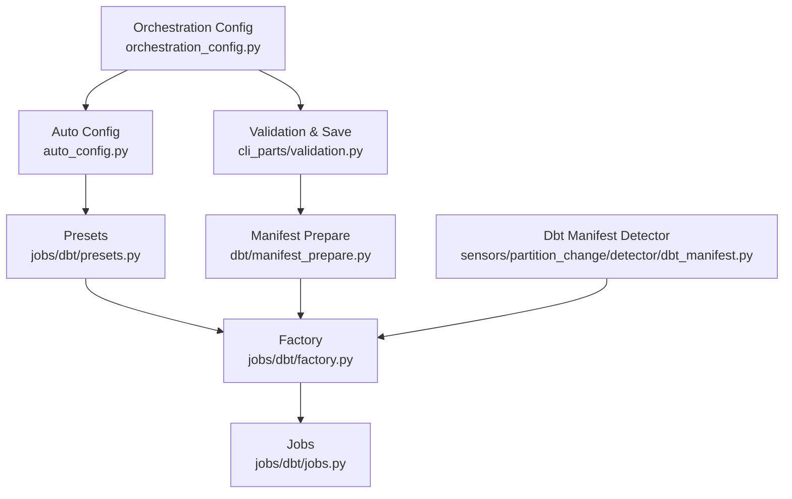

**Diagram sources**
- [orchestration_config.py](file://src/dbt_dagsterizer/orchestration_config.py)
- [auto_config.py](file://src/dbt_dagsterizer/jobs/dbt/auto_config.py)
- [presets.py](file://src/dbt_dagsterizer/jobs/dbt/presets.py)
- [factory.py](file://src/dbt_dagsterizer/jobs/dbt/factory.py)
- [jobs.py](file://src/dbt_dagsterizer/jobs/dbt/jobs.py)
- [manifest_prepare.py](file://src/dbt_dagsterizer/dbt/manifest_prepare.py)
- [validation.py](file://src/dbt_dagsterizer/cli_parts/validation.py)
- [dbt_manifest.py](file://src/dbt_dagsterizer/sensors/partition_change/detector/dbt_manifest.py)

**Section sources**
- [orchestration_config.py](file://src/dbt_dagsterizer/orchestration_config.py)
- [auto_config.py](file://src/dbt_dagsterizer/jobs/dbt/auto_config.py)
- [presets.py](file://src/dbt_dagsterizer/jobs/dbt/presets.py)
- [factory.py](file://src/dbt_dagsterizer/jobs/dbt/factory.py)
- [jobs.py](file://src/dbt_dagsterizer/jobs/dbt/jobs.py)
- [manifest_prepare.py](file://src/dbt_dagsterizer/dbt/manifest_prepare.py)
- [validation.py](file://src/dbt_dagsterizer/cli_parts/validation.py)
- [dbt_manifest.py](file://src/dbt_dagsterizer/sensors/partition_change/detector/dbt_manifest.py)

## Core Components
- Orchestration Index: Parses orchestration config to enforce uniqueness of models across jobs, collect asset-job models, and map models to jobs. It raises explicit errors when a model appears in multiple jobs.
- Auto Job Specs: Builds automatic job specifications from orchestration indices and dbt model relations, supporting per-model jobs and grouped jobs with optional upstream inclusion.
- Presets and Factory: Provide reusable job building blocks and translate job specs into Dagster jobs with dbt CLI selections and partitioning.
- Manifest Preparation: Ensures dbt manifest availability and freshness, invoking dbt parse and deps when needed.
- Validation Pipeline: Validates orchestration structure and content against dbt manifest, reporting errors and preventing invalid configurations from being saved.

Key behaviors:
- Model uniqueness across jobs is enforced early to prevent conflicts.
- Upstream inclusion can be toggled per job to expand dependency sets.
- Partitioning metadata is attached to jobs to enable downstream scheduling and propagation.

**Section sources**
- [orchestration_config.py](file://src/dbt_dagsterizer/orchestration_config.py)
- [auto_config.py](file://src/dbt_dagsterizer/jobs/dbt/auto_config.py)
- [presets.py](file://src/dbt_dagsterizer/jobs/dbt/presets.py)
- [factory.py](file://src/dbt_dagsterizer/jobs/dbt/factory.py)
- [manifest_prepare.py](file://src/dbt_dagsterizer/dbt/manifest_prepare.py)
- [validation.py](file://src/dbt_dagsterizer/cli_parts/validation.py)

## Architecture Overview
The system orchestrates dbt jobs by:
1. Loading and validating orchestration configuration.
2. Building job specifications from dbt manifests and orchestration metadata.
3. Normalizing legacy or partial specs and expanding upstream dependencies when requested.
4. Constructing Dagster jobs via factory presets.
5. Executing jobs and emitting telemetry for performance insights.

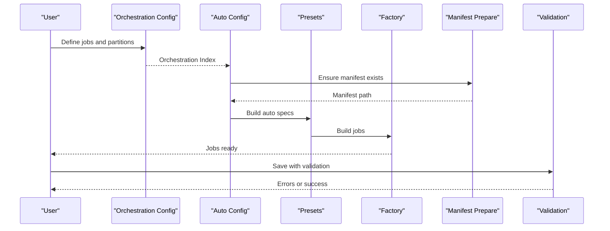

**Diagram sources**
- [orchestration_config.py](file://src/dbt_dagsterizer/orchestration_config.py)
- [auto_config.py](file://src/dbt_dagsterizer/jobs/dbt/auto_config.py)
- [presets.py](file://src/dbt_dagsterizer/jobs/dbt/presets.py)
- [factory.py](file://src/dbt_dagsterizer/jobs/dbt/factory.py)
- [manifest_prepare.py](file://src/dbt_dagsterizer/dbt/manifest_prepare.py)
- [validation.py](file://src/dbt_dagsterizer/cli_parts/validation.py)

## Detailed Component Analysis

### Orchestration Index and Conflict Detection
- Enforces that each dbt model belongs to at most one job group, raising a clear error if duplicates are detected.
- Collects asset-job models and builds a reverse mapping from model to job name for downstream use.
- Supports partitioning policies per model to guide scheduling and propagation.

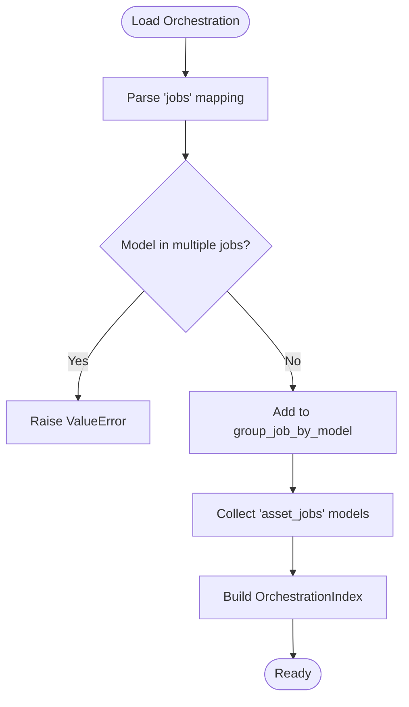

**Diagram sources**
- [orchestration_config.py](file://src/dbt_dagsterizer/orchestration_config.py)

**Section sources**
- [orchestration_config.py](file://src/dbt_dagsterizer/orchestration_config.py)
- [test_cli.py](file://tests/test_cli.py)

### Auto Job Specification Generation
- Iterates over orchestration indices to produce job specs for grouped jobs and standalone asset jobs.
- Resolves missing models referenced by asset jobs and raises errors for unknown models.
- Applies per-model partitioning policies to each job spec.

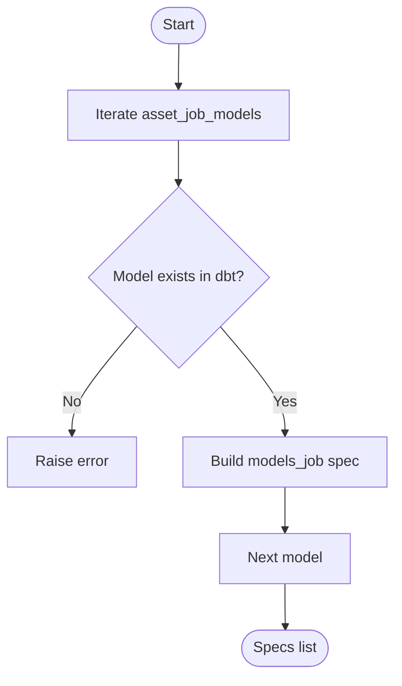

**Diagram sources**
- [auto_config.py](file://src/dbt_dagsterizer/jobs/dbt/auto_config.py)

**Section sources**
- [auto_config.py](file://src/dbt_dagsterizer/jobs/dbt/auto_config.py)

### Job Specification Normalization and Upstream Expansion
- Normalizes legacy or partial job specs, replacing dbt asset keys with canonical model relations.
- Expands selections to include upstream dependencies when configured, ensuring correct execution order.

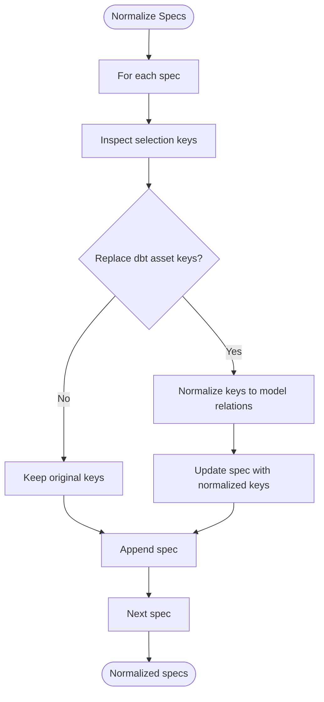

**Diagram sources**
- [jobs.py](file://src/dbt_dagsterizer/jobs/dbt/jobs.py)

**Section sources**
- [jobs.py](file://src/dbt_dagsterizer/jobs/dbt/jobs.py)

### Factory and Presets: Building Executable Jobs
- Presets provide standardized builders for dbt jobs, including selection construction and partitioning.
- Factory transforms job specs into Dagster jobs, wiring dbt CLI resources and selection expressions.

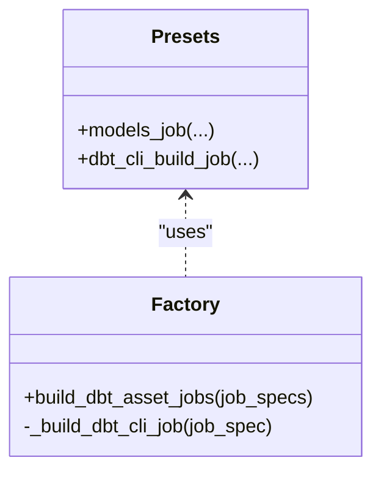

**Diagram sources**
- [presets.py](file://src/dbt_dagsterizer/jobs/dbt/presets.py)
- [factory.py](file://src/dbt_dagsterizer/jobs/dbt/factory.py)

**Section sources**
- [presets.py](file://src/dbt_dagsterizer/jobs/dbt/presets.py)
- [factory.py](file://src/dbt_dagsterizer/jobs/dbt/factory.py)

### Manifest Preparation and Freshness
- Ensures dbt manifest exists and is fresh by checking inputs and invoking dbt parse and deps when needed.
- Writes manifest inputs to track generation context and target.

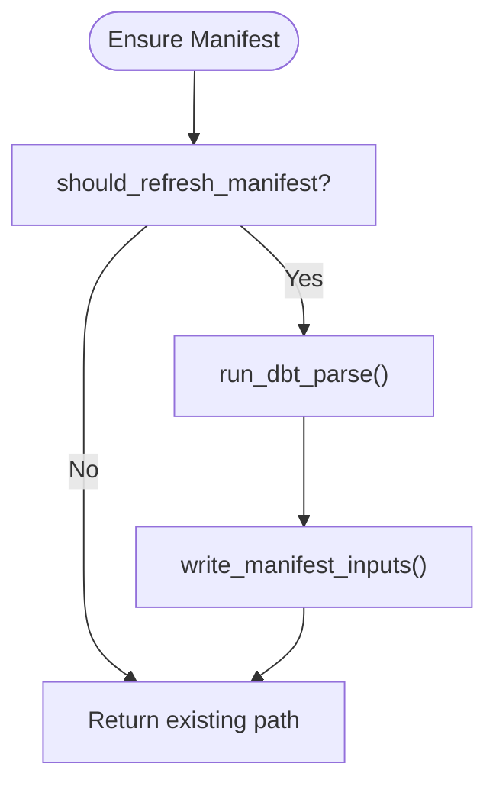

**Diagram sources**
- [manifest_prepare.py](file://src/dbt_dagsterizer/dbt/manifest_prepare.py)
- [manifest_inputs.py](file://src/dbt_dagsterizer/manifest_inputs.py)

**Section sources**
- [manifest_prepare.py](file://src/dbt_dagsterizer/dbt/manifest_prepare.py)
- [manifest_inputs.py](file://src/dbt_dagsterizer/manifest_inputs.py)

### Validation Pipeline and Error Reporting
- Validates orchestration structure and content against dbt manifest, collecting warnings and errors.
- Prevents saving invalid configurations and reports actionable messages to users.

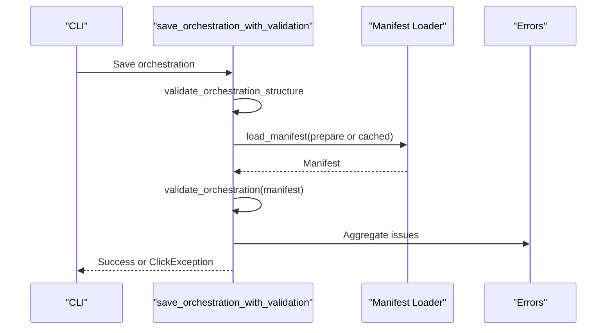

**Diagram sources**
- [validation.py](file://src/dbt_dagsterizer/cli_parts/validation.py)
- [manifest_prepare.py](file://src/dbt_dagsterizer/dbt/manifest_prepare.py)

**Section sources**
- [validation.py](file://src/dbt_dagsterizer/cli_parts/validation.py)
- [manifest_prepare.py](file://src/dbt_dagsterizer/dbt/manifest_prepare.py)

### Execution Planning and Telemetry
- Execution spans are created for dbt nodes with attributes derived from manifest and run results.
- Telemetry captures execution time, status, and node metadata for performance analysis.

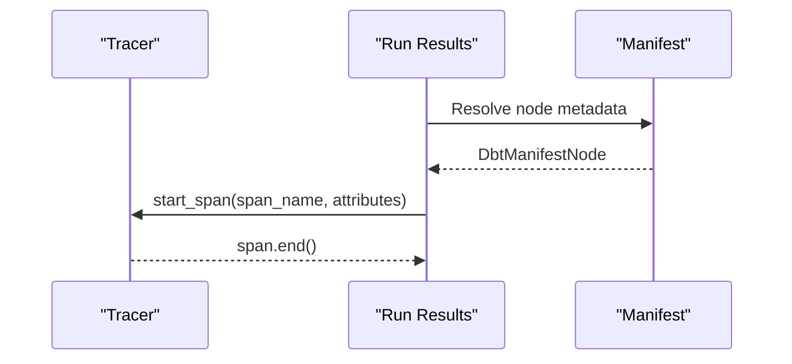

**Diagram sources**
- [run_results.py](file://src/dbt_dagsterizer/dbt/run_results.py)

**Section sources**
- [run_results.py](file://src/dbt_dagsterizer/dbt/run_results.py)

### Sensor and Detector Impact Range Resolution
- Detects dbt models by name in the manifest, raising descriptive errors when ambiguous or missing.
- Used by partition-change detectors to compute impact ranges and by propagators to trigger downstream runs.

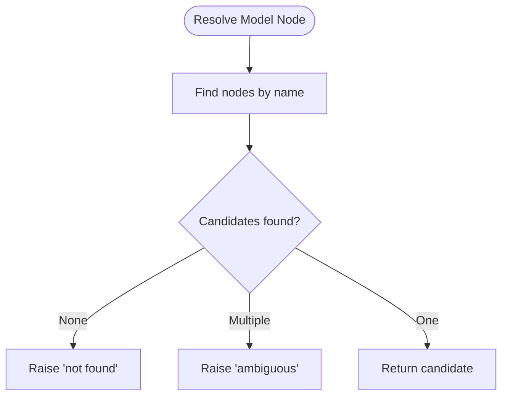

**Diagram sources**
- [dbt_manifest.py](file://src/dbt_dagsterizer/sensors/partition_change/detector/dbt_manifest.py)

**Section sources**
- [dbt_manifest.py](file://src/dbt_dagsterizer/sensors/partition_change/detector/dbt_manifest.py)

## Dependency Analysis
- Dependency Chain Resolution: Upstream expansion is controlled per job; when enabled, selections are augmented to include upstream dependencies, ensuring correct execution order.
- Circular Dependency Detection: The system enforces model uniqueness across jobs to avoid conflicting updates. While explicit cycle detection is not shown in code, the uniqueness constraint prevents a model from being scheduled twice concurrently in different jobs.
- Conflict Resolution: Conflicts are resolved by rejecting duplicate model assignments at orchestration time, prompting users to consolidate or restructure jobs.
- Parallelization and Batching: Jobs are grouped by model or user-defined groups; Dagster’s scheduler executes independent jobs in parallel. Partitioning metadata enables batched or incremental execution aligned with partition boundaries.
- Resource Optimization: Manifest preparation avoids unnecessary parsing by checking freshness and inputs. Telemetry informs performance tuning and capacity planning.

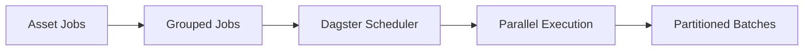

[No sources needed since this diagram shows conceptual workflow, not actual code structure]

**Section sources**
- [auto_config.py](file://src/dbt_dagsterizer/jobs/dbt/auto_config.py)
- [jobs.py](file://src/dbt_dagsterizer/jobs/dbt/jobs.py)
- [factory.py](file://src/dbt_dagsterizer/jobs/dbt/factory.py)
- [manifest_prepare.py](file://src/dbt_dagsterizer/dbt/manifest_prepare.py)
- [run_results.py](file://src/dbt_dagsterizer/dbt/run_results.py)

## Performance Considerations
- Manifest caching and refresh logic minimize redundant dbt invocations.
- Telemetry spans capture execution time and status, enabling targeted optimization.
- Partition-aware job design supports incremental processing and reduces compute overhead.
- Execution model guidance emphasizes credential placement and code location evaluation for schedules and sensors.

**Section sources**
- [manifest_prepare.py](file://src/dbt_dagsterizer/dbt/manifest_prepare.py)
- [run_results.py](file://src/dbt_dagsterizer/dbt/run_results.py)
- [execution-model.md](file://docs/concepts/execution-model.md)

## Troubleshooting Guide
Common issues and resolutions:
- Duplicate model in multiple jobs: Detected during orchestration index build; fix by consolidating jobs or removing duplicates.
- Unknown model in asset_jobs: Detected when resolving missing models; ensure the model exists in the dbt project.
- Ambiguous or missing dbt model in sensors: Detected by manifest lookup; confirm model name uniqueness and presence in the manifest.
- Validation failures on save: The validation pipeline aggregates errors and prints actionable messages; address reported issues before saving.

Operational tips:
- Use the CLI to validate and save orchestration configurations with manifest preparation.
- Review telemetry spans to identify slow-running nodes and optimize accordingly.
- Align partitioning policies with data freshness and downstream dependencies.

**Section sources**
- [orchestration_config.py](file://src/dbt_dagsterizer/orchestration_config.py)
- [auto_config.py](file://src/dbt_dagsterizer/jobs/dbt/auto_config.py)
- [dbt_manifest.py](file://src/dbt_dagsterizer/sensors/partition_change/detector/dbt_manifest.py)
- [validation.py](file://src/dbt_dagsterizer/cli_parts/validation.py)
- [meta.py](file://src/dbt_dagsterizer/cli_parts/meta.py)
- [test_cli.py](file://tests/test_cli.py)

## Conclusion
dbt-dagsterizer constructs robust execution graphs by combining orchestration metadata, dbt manifests, and Dagster job factories. Its design enforces model uniqueness across jobs, expands upstream dependencies when needed, and leverages partitioning and telemetry for efficient, observable execution. By following the validation and troubleshooting guidance here, teams can reliably manage complex dependency scenarios and maintain high-performance data pipelines.