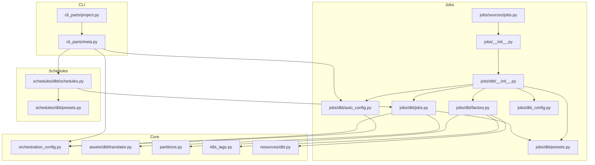
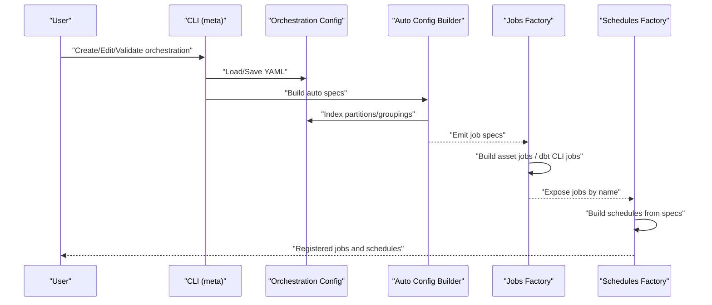
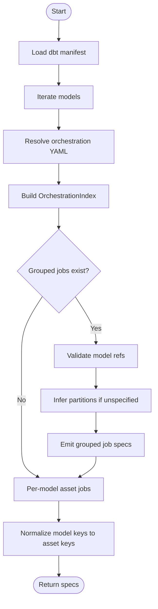
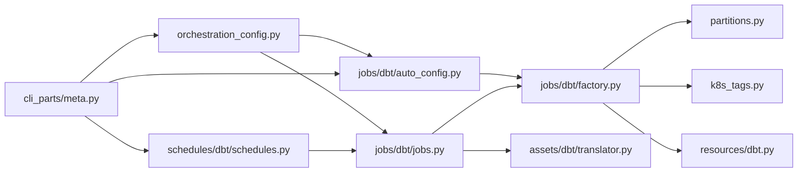
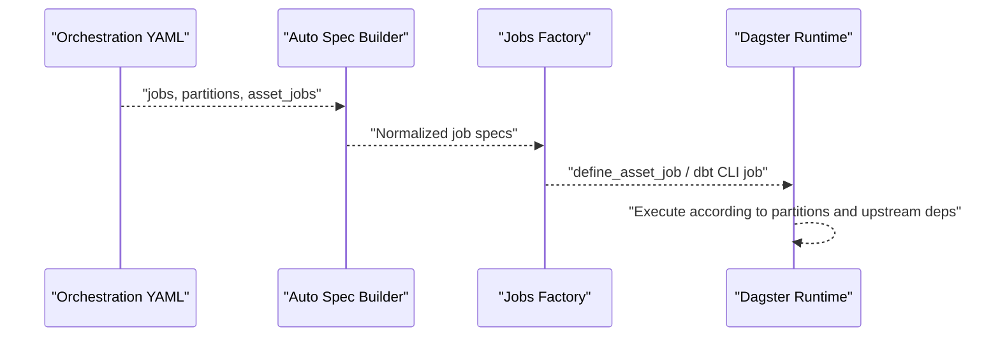
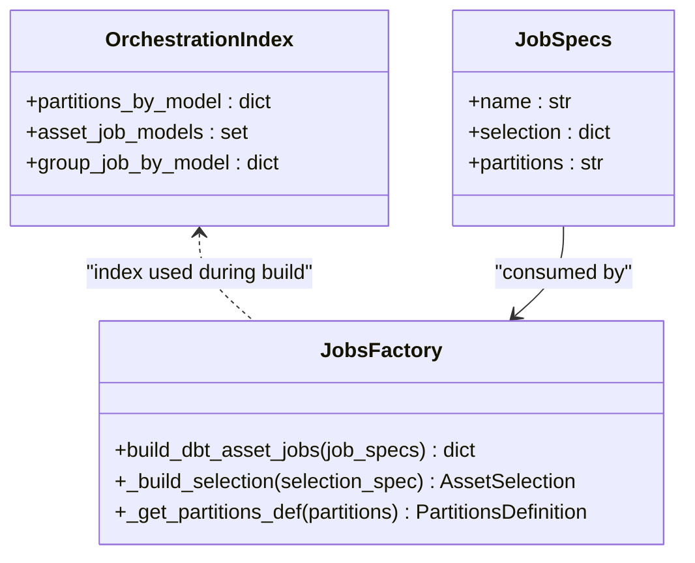

# Job Orchestration

<cite>
**Referenced Files in This Document**
- [jobs/__init__.py](file://src/dbt_dagsterizer/jobs/__init__.py)
- [jobs/dbt/__init__.py](file://src/dbt_dagsterizer/jobs/dbt/__init__.py)
- [jobs/dbt/auto_config.py](file://src/dbt_dagsterizer/jobs/dbt/auto_config.py)
- [jobs/dbt/factory.py](file://src/dbt_dagsterizer/jobs/dbt/factory.py)
- [jobs/dbt/jobs.py](file://src/dbt_dagsterizer/jobs/dbt/jobs.py)
- [jobs/dbt/presets.py](file://src/dbt_dagsterizer/jobs/dbt/presets.py)
- [jobs/dbt_config.py](file://src/dbt_dagsterizer/jobs/dbt_config.py)
- [jobs/sources/jobs.py](file://src/dbt_dagsterizer/jobs/sources/jobs.py)
- [schedules/dbt/schedules.py](file://src/dbt_dagsterizer/schedules/dbt/schedules.py)
- [schedules/dbt/presets.py](file://src/dbt_dagsterizer/schedules/dbt/presets.py)
- [orchestration_config.py](file://src/dbt_dagsterizer/orchestration_config.py)
- [assets/dbt/translator.py](file://src/dbt_dagsterizer/assets/dbt/translator.py)
- [partitions.py](file://src/dbt_dagsterizer/partitions.py)
- [k8s_tags.py](file://src/dbt_dagsterizer/k8s_tags.py)
- [resources/dbt.py](file://src/dbt_dagsterizer/resources/dbt.py)
- [cli_parts/meta.py](file://src/dbt_dagsterizer/cli_parts/meta.py)
- [cli_parts/project.py](file://src/dbt_dagsterizer/cli_parts/project.py)
</cite>

## Table of Contents
1. [Introduction](#introduction)
2. [Project Structure](#project-structure)
3. [Core Components](#core-components)
4. [Architecture Overview](#architecture-overview)
5. [Detailed Component Analysis](#detailed-component-analysis)
6. [Dependency Analysis](#dependency-analysis)
7. [Performance Considerations](#performance-considerations)
8. [Troubleshooting Guide](#troubleshooting-guide)
9. [Conclusion](#conclusion)
10. [Appendices](#appendices)

## Introduction
This document explains how job orchestration works in dbt-dagsterizer. It covers automatic job creation from dbt model dependencies, manual configuration via YAML presets, dependency-aware job composition, execution ordering and parallelization, scheduling integration, failure handling and retries, naming conventions and metadata tagging, and configuration options for behavior and execution environments. It also provides examples of custom job creation and advanced orchestration patterns.

## Project Structure
The job orchestration system is organized around:
- Automatic job discovery and composition from dbt manifests and orchestration configuration
- Manual job presets and CLI-driven configuration
- Factory functions that convert job specs into Dagster jobs
- Scheduling integration and partition-aware execution
- Resource and environment configuration for dbt CLI execution

**Diagram sources**
- [jobs/__init__.py:1-10](file://src/dbt_dagsterizer/jobs/__init__.py#L1-L10)
- [jobs/dbt/__init__.py:1-4](file://src/dbt_dagsterizer/jobs/dbt/__init__.py#L1-L4)
- [jobs/dbt/auto_config.py:1-88](file://src/dbt_dagsterizer/jobs/dbt/auto_config.py#L1-L88)
- [jobs/dbt/factory.py:1-107](file://src/dbt_dagsterizer/jobs/dbt/factory.py#L1-L107)
- [jobs/dbt/jobs.py:1-76](file://src/dbt_dagsterizer/jobs/dbt/jobs.py#L1-L76)
- [jobs/dbt/presets.py:1-55](file://src/dbt_dagsterizer/jobs/dbt/presets.py#L1-L55)
- [jobs/dbt_config.py:1-3](file://src/dbt_dagsterizer/jobs/dbt_config.py#L1-L3)
- [jobs/sources/jobs.py:1-24](file://src/dbt_dagsterizer/jobs/sources/jobs.py#L1-L24)
- [schedules/dbt/schedules.py:1-17](file://src/dbt_dagsterizer/schedules/dbt/schedules.py#L1-L17)
- [schedules/dbt/presets.py:1-38](file://src/dbt_dagsterizer/schedules/dbt/presets.py#L1-L38)
- [orchestration_config.py:1-370](file://src/dbt_dagsterizer/orchestration_config.py#L1-L370)
- [assets/dbt/translator.py:1-116](file://src/dbt_dagsterizer/assets/dbt/translator.py#L1-L116)
- [partitions.py:1-21](file://src/dbt_dagsterizer/partitions.py#L1-L21)
- [k8s_tags.py:1-37](file://src/dbt_dagsterizer/k8s_tags.py#L1-L37)
- [resources/dbt.py:1-95](file://src/dbt_dagsterizer/resources/dbt.py#L1-L95)
- [cli_parts/meta.py:1-627](file://src/dbt_dagsterizer/cli_parts/meta.py#L1-L627)
- [cli_parts/project.py:1-307](file://src/dbt_dagsterizer/cli_parts/project.py#L1-L307)

**Section sources**
- [jobs/__init__.py:1-10](file://src/dbt_dagsterizer/jobs/__init__.py#L1-L10)
- [jobs/dbt/__init__.py:1-4](file://src/dbt_dagsterizer/jobs/dbt/__init__.py#L1-L4)
- [schedules/dbt/schedules.py:1-17](file://src/dbt_dagsterizer/schedules/dbt/schedules.py#L1-L17)

## Core Components
- Orchestration configuration and indexing: Loads and validates the orchestration YAML, builds indices for partitions, asset jobs, and grouping by model.
- Automatic job spec builder: Reads dbt manifest and orchestration config to produce job specs for grouped jobs and per-model asset jobs.
- Job factory: Converts job specs into Dagster asset jobs or dbt CLI jobs, applying partitions and tags.
- Preset builders: Provide convenient constructors for common job configurations (grouped models, dbt CLI commands).
- Scheduling integration: Builds schedule specs from orchestration config and attaches them to jobs.
- Resource and environment: Provides dbt project/profile discovery and CLI resource configuration.
- CLI integration: Offers commands to initialize, edit, and validate orchestration configuration, including job groups, partitions, schedules, and partition change detectors/propagators.

**Section sources**
- [orchestration_config.py:19-370](file://src/dbt_dagsterizer/orchestration_config.py#L19-L370)
- [jobs/dbt/auto_config.py:22-88](file://src/dbt_dagsterizer/jobs/dbt/auto_config.py#L22-L88)
- [jobs/dbt/factory.py:40-107](file://src/dbt_dagsterizer/jobs/dbt/factory.py#L40-L107)
- [jobs/dbt/presets.py:1-55](file://src/dbt_dagsterizer/jobs/dbt/presets.py#L1-L55)
- [schedules/dbt/schedules.py:9-17](file://src/dbt_dagsterizer/schedules/dbt/schedules.py#L9-L17)
- [resources/dbt.py:27-95](file://src/dbt_dagsterizer/resources/dbt.py#L27-L95)
- [cli_parts/meta.py:61-627](file://src/dbt_dagsterizer/cli_parts/meta.py#L61-L627)

## Architecture Overview
The orchestration pipeline transforms dbt models and user configuration into executable Dagster jobs and schedules. It reads the dbt manifest and an orchestration YAML to:
- Derive job specs for grouped models and per-model asset jobs
- Normalize and expand job specs
- Build Dagster jobs with appropriate partitions and tags
- Compose schedules and attach them to jobs
- Provide CLI commands to manage orchestration configuration

**Diagram sources**
- [cli_parts/meta.py:61-627](file://src/dbt_dagsterizer/cli_parts/meta.py#L61-L627)
- [orchestration_config.py:23-83](file://src/dbt_dagsterizer/orchestration_config.py#L23-L83)
- [jobs/dbt/auto_config.py:22-88](file://src/dbt_dagsterizer/jobs/dbt/auto_config.py#L22-L88)
- [jobs/dbt/factory.py:73-107](file://src/dbt_dagsterizer/jobs/dbt/factory.py#L73-L107)
- [schedules/dbt/schedules.py:9-17](file://src/dbt_dagsterizer/schedules/dbt/schedules.py#L9-L17)

## Detailed Component Analysis

### Automatic Job Creation from dbt Model Dependencies
Automatic job creation is driven by:
- Loading the dbt manifest and iterating models
- Resolving orchestration configuration (jobs, partitions, asset_jobs)
- Indexing partitions and groupings
- Building job specs for:
  - Grouped jobs defined in orchestration YAML
  - Per-model asset jobs inferred from the index
- Normalizing model keys to relation-based asset keys
- Emitting specs suitable for the job factory

**Diagram sources**
- [jobs/dbt/auto_config.py:22-88](file://src/dbt_dagsterizer/jobs/dbt/auto_config.py#L22-L88)
- [orchestration_config.py:112-158](file://src/dbt_dagsterizer/orchestration_config.py#L112-L158)
- [assets/dbt/translator.py:27-42](file://src/dbt_dagsterizer/assets/dbt/translator.py#L27-L42)

**Section sources**
- [jobs/dbt/auto_config.py:22-88](file://src/dbt_dagsterizer/jobs/dbt/auto_config.py#L22-L88)
- [orchestration_config.py:112-158](file://src/dbt_dagsterizer/orchestration_config.py#L112-L158)
- [assets/dbt/translator.py:27-42](file://src/dbt_dagsterizer/assets/dbt/translator.py#L27-L42)

### Manual Job Configuration via YAML Presets and Custom Definitions
Manual configuration is managed through:
- CLI commands to create/update/delete job groups, partitions, asset jobs, schedules, and partition change detectors/propagators
- Preset builders for common patterns (grouped models, dbt CLI jobs)
- Direct specification of job specs in the orchestration YAML

Key CLI capabilities:
- Initialize orchestration YAML and optionally parse dbt manifest
- Add or remove job groups with optional upstream inclusion and partition type
- Set partitions per model or globally
- Enable/disable asset jobs per model
- Define daily schedules with cron-like configuration
- Configure partition change detectors and propagators

**Section sources**
- [cli_parts/meta.py:61-627](file://src/dbt_dagsterizer/cli_parts/meta.py#L61-L627)
- [jobs/dbt/presets.py:1-55](file://src/dbt_dagsterizer/jobs/dbt/presets.py#L1-L55)
- [jobs/dbt_config.py:1-3](file://src/dbt_dagsterizer/jobs/dbt_config.py#L1-L3)

### Job Dependency Resolution, Execution Ordering, and Parallelization
Execution ordering is determined by:
- Asset selection semantics: upstream expansion and asset key matching
- Partition-aware execution: daily partitions require a start date environment variable
- Tagging for Kubernetes configuration propagation

Parallelization:
- Jobs are defined independently; Dagster’s asset graph determines parallelizable subsets automatically
- Upstream inclusion in job specs ensures downstream jobs wait for upstream completion

**Section sources**
- [jobs/dbt/factory.py:20-34](file://src/dbt_dagsterizer/jobs/dbt/factory.py#L20-L34)
- [partitions.py:10-21](file://src/dbt_dagsterizer/partitions.py#L10-L21)
- [k8s_tags.py:26-37](file://src/dbt_dagsterizer/k8s_tags.py#L26-L37)

### Scheduling Integration, Failure Handling, and Retry Mechanisms
Scheduling:
- Daily schedules are defined via preset builders and attached to jobs
- Schedules support partition offsets and lookbacks

Failure handling and retries:
- The codebase does not define explicit retry policies for jobs or ops
- Users can leverage Dagster’s built-in run recovery and sensor-based triggers for remediation

**Section sources**
- [schedules/dbt/presets.py:1-38](file://src/dbt_dagsterizer/schedules/dbt/presets.py#L1-L38)
- [schedules/dbt/schedules.py:9-17](file://src/dbt_dagsterizer/schedules/dbt/schedules.py#L9-L17)

### Job Naming Conventions, Tags, and Metadata Assignment
Naming conventions:
- Derived names for per-model asset jobs
- Explicit names for grouped jobs
- Sanitized names for dbt CLI ops

Tags and metadata:
- Kubernetes run configuration tags are injected into job tags
- Tags propagate to runs for environment configuration

**Section sources**
- [orchestration_config.py:360-370](file://src/dbt_dagsterizer/orchestration_config.py#L360-L370)
- [jobs/dbt/factory.py:36-38](file://src/dbt_dagsterizer/jobs/dbt/factory.py#L36-L38)
- [k8s_tags.py:26-37](file://src/dbt_dagsterizer/k8s_tags.py#L26-L37)

### Configuration Options for Job Behavior, Resource Requirements, and Execution Environment
Behavior:
- Partition type: daily or unpartitioned
- Upstream inclusion for job groups
- Selection types: key prefixes and asset keys

Resources and environment:
- dbt project and profiles discovery
- Target selection and CLI resource construction
- Daily partitions start date requirement

**Section sources**
- [jobs/dbt/factory.py:12-17](file://src/dbt_dagsterizer/jobs/dbt/factory.py#L12-L17)
- [resources/dbt.py:27-95](file://src/dbt_dagsterizer/resources/dbt.py#L27-L95)
- [partitions.py:14-19](file://src/dbt_dagsterizer/partitions.py#L14-L19)

### Examples of Custom Job Creation and Advanced Orchestration Patterns
- Grouped jobs: Use preset builders to define a job selecting multiple models, optionally including upstream assets and specifying partition type
- Per-model asset jobs: Enable asset jobs for individual models so each model runs as a separate job
- dbt CLI jobs: Define jobs that execute dbt CLI commands with custom selection strings and variables
- Partition change propagation: Configure detectors and propagators to trigger downstream jobs when upstream partitions change

**Section sources**
- [jobs/dbt/presets.py:30-55](file://src/dbt_dagsterizer/jobs/dbt/presets.py#L30-L55)
- [cli_parts/meta.py:264-357](file://src/dbt_dagsterizer/cli_parts/meta.py#L264-L357)
- [cli_parts/meta.py:437-583](file://src/dbt_dagsterizer/cli_parts/meta.py#L437-L583)

## Dependency Analysis
The job orchestration system exhibits clear separation of concerns:
- Orchestration configuration underpins automatic and manual job creation
- Factories translate specs into Dagster constructs
- Schedules depend on jobs produced by factories
- CLI commands mutate orchestration configuration and drive parsing

**Diagram sources**
- [orchestration_config.py:1-370](file://src/dbt_dagsterizer/orchestration_config.py#L1-L370)
- [jobs/dbt/auto_config.py:1-88](file://src/dbt_dagsterizer/jobs/dbt/auto_config.py#L1-L88)
- [jobs/dbt/jobs.py:1-76](file://src/dbt_dagsterizer/jobs/dbt/jobs.py#L1-L76)
- [jobs/dbt/factory.py:1-107](file://src/dbt_dagsterizer/jobs/dbt/factory.py#L1-L107)
- [partitions.py:1-21](file://src/dbt_dagsterizer/partitions.py#L1-L21)
- [k8s_tags.py:1-37](file://src/dbt_dagsterizer/k8s_tags.py#L1-L37)
- [resources/dbt.py:1-95](file://src/dbt_dagsterizer/resources/dbt.py#L1-L95)
- [assets/dbt/translator.py:1-116](file://src/dbt_dagsterizer/assets/dbt/translator.py#L1-L116)
- [schedules/dbt/schedules.py:1-17](file://src/dbt_dagsterizer/schedules/dbt/schedules.py#L1-L17)
- [cli_parts/meta.py:1-627](file://src/dbt_dagsterizer/cli_parts/meta.py#L1-L627)

**Section sources**
- [jobs/dbt/jobs.py:66-76](file://src/dbt_dagsterizer/jobs/dbt/jobs.py#L66-L76)
- [schedules/dbt/schedules.py:9-17](file://src/dbt_dagsterizer/schedules/dbt/schedules.py#L9-L17)

## Performance Considerations
- Prefer grouped jobs for large sets of related models to reduce overhead
- Use upstream inclusion judiciously to avoid unnecessary fan-out
- Daily partitions require a start date; ensure environment configuration is correct to avoid runtime errors
- Normalize model keys early to minimize repeated translation costs

[No sources needed since this section provides general guidance]

## Troubleshooting Guide
Common issues and remedies:
- Missing dbt project or profiles: Ensure dbt project directory and profiles are discoverable or set explicit environment variables
- Daily partitions start date not configured: Set the required environment variable before enabling daily partitions
- Duplicate job names: Ensure unique job names when combining auto and manual specs
- Invalid partitions value: Use supported values (daily, unpartitioned)
- Orchestration YAML structure errors: Use validation commands to check and fix structure and references

**Section sources**
- [resources/dbt.py:27-95](file://src/dbt_dagsterizer/resources/dbt.py#L27-L95)
- [partitions.py:14-19](file://src/dbt_dagsterizer/partitions.py#L14-L19)
- [jobs/dbt/factory.py:84-85](file://src/dbt_dagsterizer/jobs/dbt/factory.py#L84-L85)
- [cli_parts/meta.py:584-627](file://src/dbt_dagsterizer/cli_parts/meta.py#L584-L627)

## Conclusion
dbt-dagsterizer provides a robust framework for job orchestration that blends automatic discovery with manual control. By leveraging dbt manifests, YAML configuration, and Dagster’s asset model, teams can compose reliable, partition-aware jobs, schedule them effectively, and integrate with Kubernetes environments. The CLI offers powerful commands to manage orchestration lifecycle, while presets and factories simplify common patterns and advanced scenarios.

[No sources needed since this section summarizes without analyzing specific files]

## Appendices

### Appendix A: Job Composition and Execution Flow

**Diagram sources**
- [jobs/dbt/auto_config.py:22-88](file://src/dbt_dagsterizer/jobs/dbt/auto_config.py#L22-L88)
- [jobs/dbt/factory.py:73-107](file://src/dbt_dagsterizer/jobs/dbt/factory.py#L73-L107)

### Appendix B: Class Relationships for Job Builders

**Diagram sources**
- [orchestration_config.py:105-158](file://src/dbt_dagsterizer/orchestration_config.py#L105-L158)
- [jobs/dbt/factory.py:20-107](file://src/dbt_dagsterizer/jobs/dbt/factory.py#L20-L107)