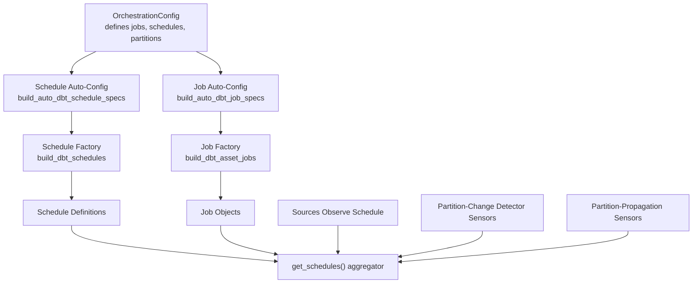
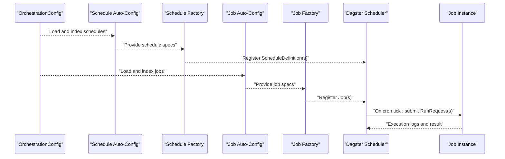
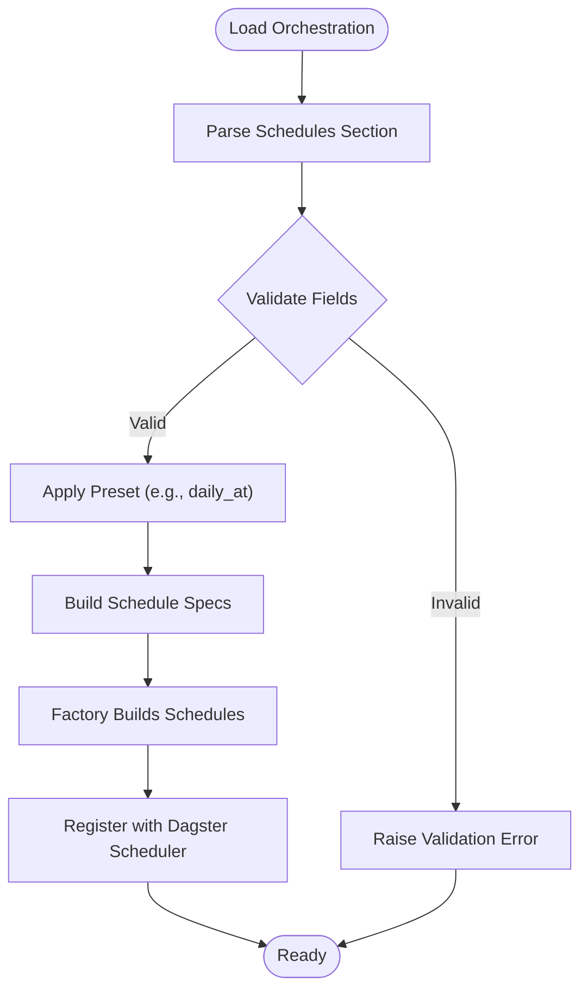
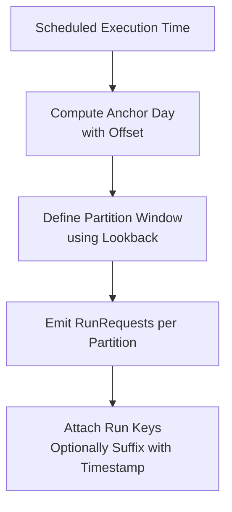
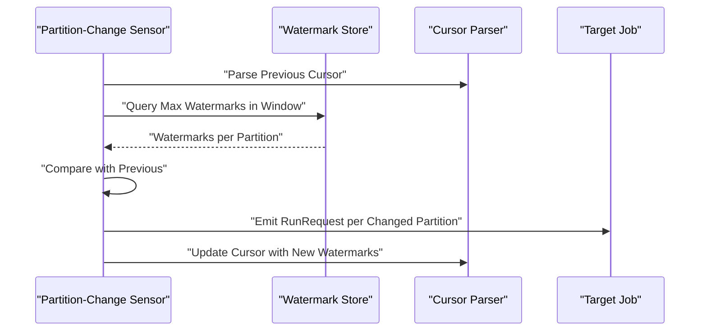
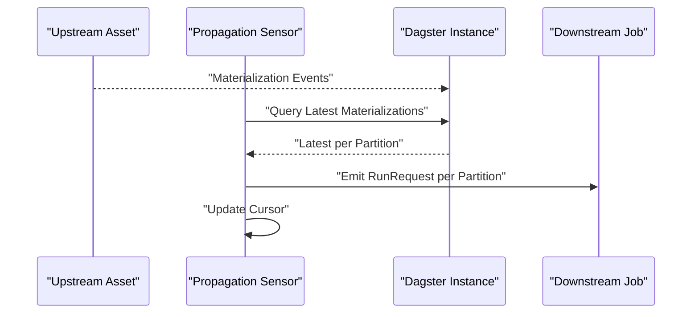
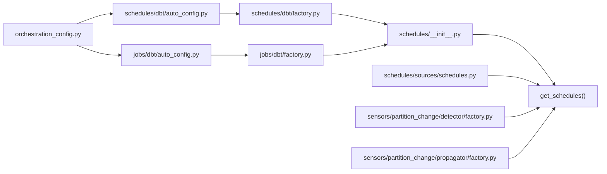

# Job Scheduling Integration

<cite>
**Referenced Files in This Document**
- [schedules/__init__.py](file://src/dbt_dagsterizer/schedules/__init__.py)
- [schedules/dbt/schedules.py](file://src/dbt_dagsterizer/schedules/dbt/schedules.py)
- [schedules/dbt/auto_config.py](file://src/dbt_dagsterizer/schedules/dbt/auto_config.py)
- [schedules/dbt/factory.py](file://src/dbt_dagsterizer/schedules/dbt/factory.py)
- [schedules/dbt/presets.py](file://src/dbt_dagsterizer/schedules/dbt/presets.py)
- [schedules/sources/schedules.py](file://src/dbt_dagsterizer/schedules/sources/schedules.py)
- [jobs/dbt/jobs.py](file://src/dbt_dagsterizer/jobs/dbt/jobs.py)
- [jobs/dbt/factory.py](file://src/dbt_dagsterizer/jobs/dbt/factory.py)
- [jobs/dbt/auto_config.py](file://src/dbt_dagsterizer/jobs/dbt/auto_config.py)
- [jobs/dbt/presets.py](file://src/dbt_dagsterizer/jobs/dbt/presets.py)
- [orchestration_config.py](file://src/dbt_dagsterizer/orchestration_config.py)
- [sensors/partition_change/detector/factory.py](file://src/dbt_dagsterizer/sensors/partition_change/detector/factory.py)
- [sensors/partition_change/propagator/factory.py](file://src/dbt_dagsterizer/sensors/partition_change/propagator/factory.py)
- [cli_parts/project.py](file://src/dbt_dagsterizer/cli_parts/project.py)
- [cli_parts/macros.py](file://src/dbt_dagsterizer/cli_parts/macros.py)
</cite>

## Table of Contents
1. [Introduction](#introduction)
2. [Project Structure](#project-structure)
3. [Core Components](#core-components)
4. [Architecture Overview](#architecture-overview)
5. [Detailed Component Analysis](#detailed-component-analysis)
6. [Dependency Analysis](#dependency-analysis)
7. [Performance Considerations](#performance-considerations)
8. [Troubleshooting Guide](#troubleshooting-guide)
9. [Conclusion](#conclusion)
10. [Appendices](#appendices)

## Introduction
This document explains how job scheduling integrates with Dagster’s built-in scheduler and complementary event-driven mechanisms. It covers schedule configuration via orchestration metadata, cron-based triggers, partition-aware execution, and event-driven triggers for partition changes and propagation. It also documents monitoring and alerting patterns, hybrid scheduling approaches, failover and high availability considerations, and operational procedures for validation, drift detection, and maintenance.

## Project Structure
The scheduling system is organized around three pillars:
- Orchestration configuration: centralized YAML that defines jobs, schedules, partitions, and partition-change automation.
- Schedules: cron-based schedules that trigger partitioned runs for dbt asset jobs.
- Sensors: event-driven triggers for partition-change detection and propagation.

**Diagram sources**
- [orchestration_config.py](file://src/dbt_dagsterizer/orchestration_config.py)
- [schedules/dbt/auto_config.py](file://src/dbt_dagsterizer/schedules/dbt/auto_config.py)
- [schedules/dbt/factory.py](file://src/dbt_dagsterizer/schedules/dbt/factory.py)
- [jobs/dbt/auto_config.py](file://src/dbt_dagsterizer/jobs/dbt/auto_config.py)
- [jobs/dbt/factory.py](file://src/dbt_dagsterizer/jobs/dbt/factory.py)
- [schedules/__init__.py](file://src/dbt_dagsterizer/schedules/__init__.py)
- [schedules/sources/schedules.py](file://src/dbt_dagsterizer/schedules/sources/schedules.py)
- [sensors/partition_change/detector/factory.py](file://src/dbt_dagsterizer/sensors/partition_change/detector/factory.py)
- [sensors/partition_change/propagator/factory.py](file://src/dbt_dagsterizer/sensors/partition_change/propagator/factory.py)

**Section sources**
- [orchestration_config.py](file://src/dbt_dagsterizer/orchestration_config.py)
- [schedules/dbt/auto_config.py](file://src/dbt_dagsterizer/schedules/dbt/auto_config.py)
- [jobs/dbt/auto_config.py](file://src/dbt_dagsterizer/jobs/dbt/auto_config.py)
- [schedules/__init__.py](file://src/dbt_dagsterizer/schedules/__init__.py)

## Core Components
- Orchestration configuration: loads and normalizes a YAML file that defines jobs, schedules, partitions, and partition-change automation. It validates and indexes the configuration to support auto-scheduling and job derivation.
- Schedule auto-config: reads orchestration metadata to produce schedule specs with cron expressions, partition offsets, and lookbacks.
- Schedule factory: converts schedule specs into Dagster ScheduleDefinition instances, binding jobs and partition windows.
- Job auto-config and factory: derive jobs from orchestration metadata and dbt manifests, supporting asset-based and CLI-based jobs with partitioning.
- Sources observe schedule: a periodic schedule to scan observable sources at a configurable cadence.
- Partition-change sensors: detect watermark changes and emit RunRequests for impacted partitions.
- Propagation sensors: react to upstream materializations and trigger downstream jobs per partition.

**Section sources**
- [orchestration_config.py](file://src/dbt_dagsterizer/orchestration_config.py)
- [schedules/dbt/auto_config.py](file://src/dbt_dagsterizer/schedules/dbt/auto_config.py)
- [schedules/dbt/factory.py](file://src/dbt_dagsterizer/schedules/dbt/factory.py)
- [jobs/dbt/auto_config.py](file://src/dbt_dagsterizer/jobs/dbt/auto_config.py)
- [jobs/dbt/factory.py](file://src/dbt_dagsterizer/jobs/dbt/factory.py)
- [schedules/sources/schedules.py](file://src/dbt_dagsterizer/schedules/sources/schedules.py)
- [sensors/partition_change/detector/factory.py](file://src/dbt_dagsterizer/sensors/partition_change/detector/factory.py)
- [sensors/partition_change/propagator/factory.py](file://src/dbt_dagsterizer/sensors/partition_change/propagator/factory.py)

## Architecture Overview
The system composes schedules and sensors from orchestration metadata and dbt manifests. Cron-based schedules trigger partitioned runs; event-driven sensors complement or replace cron for near-real-time responsiveness.

**Diagram sources**
- [orchestration_config.py](file://src/dbt_dagsterizer/orchestration_config.py)
- [schedules/dbt/auto_config.py](file://src/dbt_dagsterizer/schedules/dbt/auto_config.py)
- [schedules/dbt/factory.py](file://src/dbt_dagsterizer/schedules/dbt/factory.py)
- [jobs/dbt/auto_config.py](file://src/dbt_dagsterizer/jobs/dbt/auto_config.py)
- [jobs/dbt/factory.py](file://src/dbt_dagsterizer/jobs/dbt/factory.py)

## Detailed Component Analysis

### Schedule Configuration and Execution Triggers
- Orchestration metadata defines schedules with type, cadence, job binding, and partition parameters. The loader ensures defaults and validates presence of required fields.
- Schedule presets convert human-friendly daily-at parameters into cron expressions and standardized schedule specs.
- The schedule factory enforces uniqueness, builds cron-based schedules, and computes partition windows for each tick.

**Diagram sources**
- [orchestration_config.py](file://src/dbt_dagsterizer/orchestration_config.py)
- [schedules/dbt/presets.py](file://src/dbt_dagsterizer/schedules/dbt/presets.py)
- [schedules/dbt/factory.py](file://src/dbt_dagsterizer/schedules/dbt/factory.py)

**Section sources**
- [orchestration_config.py](file://src/dbt_dagsterizer/orchestration_config.py)
- [schedules/dbt/presets.py](file://src/dbt_dagsterizer/schedules/dbt/presets.py)
- [schedules/dbt/factory.py](file://src/dbt_dagsterizer/schedules/dbt/factory.py)

### Timing Coordination and Partition Windows
- Each schedule computes an anchor day from the scheduled execution time and applies offset and lookback parameters to generate a contiguous window of partitions.
- Run keys incorporate schedule identity and partition date to ensure idempotency across ticks when configured.

**Diagram sources**
- [schedules/dbt/factory.py](file://src/dbt_dagsterizer/schedules/dbt/factory.py)

**Section sources**
- [schedules/dbt/factory.py](file://src/dbt_dagsterizer/schedules/dbt/factory.py)

### Integration with External Schedulers and Cloud-Native Platforms
- The system relies on Dagster’s built-in scheduler for cron-based scheduling. There is no explicit integration code for external schedulers or cloud-native platforms in the analyzed files.
- To integrate with external schedulers, export the schedule definitions and mirror them externally, ensuring equivalent cron expressions and partition semantics. Alternatively, mirror the orchestration configuration to external systems and reconcile differences periodically.

[No sources needed since this section provides general guidance]

### Event-Driven Triggers: Partition-Change Detection
- Partition-change sensors compute watermarks over a sliding window and compare against previous cursors. They emit RunRequests for partitions whose watermarks have advanced within the configured window.
- The detector supports sparse lookback metadata and impact-range expansion to propagate changes to downstream partitions.

**Diagram sources**
- [sensors/partition_change/detector/factory.py](file://src/dbt_dagsterizer/sensors/partition_change/detector/factory.py)

**Section sources**
- [sensors/partition_change/detector/factory.py](file://src/dbt_dagsterizer/sensors/partition_change/detector/factory.py)

### Event-Driven Triggers: Propagation
- Propagation sensors watch upstream materialization events and emit RunRequests for the latest partition per partition key. They support catch-up behavior controlled by an environment variable and maintain a cursor for progress tracking.

**Diagram sources**
- [sensors/partition_change/propagator/factory.py](file://src/dbt_dagsterizer/sensors/partition_change/propagator/factory.py)

**Section sources**
- [sensors/partition_change/propagator/factory.py](file://src/dbt_dagsterizer/sensors/partition_change/propagator/factory.py)

### Hybrid Scheduling Approaches
- Combine cron schedules for baseline coverage with event-driven sensors for near-real-time updates. Use partition-change detectors for data-driven triggers and propagation sensors for downstream cascading runs.
- Maintain separate orchestration entries for cron-triggered jobs and event-triggered sensors to avoid duplication and ensure predictable partition boundaries.

[No sources needed since this section provides general guidance]

### Failover Mechanisms and High Availability
- Run multiple Dagster instance workers behind a shared storage backend to achieve high availability for the scheduler and sensors.
- Use idempotent run keys and partition-aware execution to tolerate retries and overlapping ticks gracefully.

[No sources needed since this section provides general guidance]

### Monitoring, Alerting, and Notifications
- Leverage Dagster’s logging and event streams to monitor schedule ticks, RunRequest emissions, and job outcomes.
- Tag runs with detector or propagation metadata to enable targeted alerts and dashboards.
- Integrate with external observability stacks to track SLAs, latency, and failure rates.

[No sources needed since this section provides general guidance]

### Schedule Validation, Drift Detection, and Maintenance
- Validate orchestration configuration on load and at generation time to prevent misconfigurations (e.g., unknown models, unsupported partition types).
- Detect drift by comparing current dbt models against configured schedules and jobs; reconcile discrepancies via maintenance scripts or CLI commands.
- Maintain a process to review and update partition-change detectors and propagators when upstream schemas evolve.

**Section sources**
- [orchestration_config.py](file://src/dbt_dagsterizer/orchestration_config.py)
- [schedules/dbt/auto_config.py](file://src/dbt_dagsterizer/schedules/dbt/auto_config.py)
- [jobs/dbt/auto_config.py](file://src/dbt_dagsterizer/jobs/dbt/auto_config.py)

## Dependency Analysis
The scheduling subsystem depends on orchestration metadata and dbt manifests to construct schedules and jobs. Sensors depend on the job registry and resource backends to evaluate conditions and emit RunRequests.

**Diagram sources**
- [orchestration_config.py](file://src/dbt_dagsterizer/orchestration_config.py)
- [schedules/dbt/auto_config.py](file://src/dbt_dagsterizer/schedules/dbt/auto_config.py)
- [schedules/dbt/factory.py](file://src/dbt_dagsterizer/schedules/dbt/factory.py)
- [jobs/dbt/auto_config.py](file://src/dbt_dagsterizer/jobs/dbt/auto_config.py)
- [jobs/dbt/factory.py](file://src/dbt_dagsterizer/jobs/dbt/factory.py)
- [schedules/__init__.py](file://src/dbt_dagsterizer/schedules/__init__.py)
- [schedules/sources/schedules.py](file://src/dbt_dagsterizer/schedules/sources/schedules.py)
- [sensors/partition_change/detector/factory.py](file://src/dbt_dagsterizer/sensors/partition_change/detector/factory.py)
- [sensors/partition_change/propagator/factory.py](file://src/dbt_dagsterizer/sensors/partition_change/propagator/factory.py)

**Section sources**
- [schedules/__init__.py](file://src/dbt_dagsterizer/schedules/__init__.py)
- [schedules/dbt/factory.py](file://src/dbt_dagsterizer/schedules/dbt/factory.py)
- [jobs/dbt/factory.py](file://src/dbt_dagsterizer/jobs/dbt/factory.py)

## Performance Considerations
- Limit lookback windows to reduce the number of emitted RunRequests per tick.
- Use partition-aware jobs to constrain work per run and improve throughput.
- Tune minimum interval for sensors to balance responsiveness and overhead.
- Prefer asset-based jobs for efficient downstream propagation; use CLI jobs sparingly for specialized tasks.

[No sources needed since this section provides general guidance]

## Troubleshooting Guide
- Duplicate names: Both schedules and sensors enforce uniqueness and raise errors on duplicates.
- Unsupported partition types: Schedules currently support daily partitioning; specifying other types raises errors.
- Unknown models or jobs: References to missing dbt models or undefined jobs cause validation failures during auto-config.
- Missing relations in detectors: Sensors skip or warn when required relations are absent and update cursors accordingly.
- Propagation cursor resets: Sensors reset invalid cursors and initialize from latest materialization when appropriate.

**Section sources**
- [schedules/dbt/factory.py](file://src/dbt_dagsterizer/schedules/dbt/factory.py)
- [sensors/partition_change/detector/factory.py](file://src/dbt_dagsterizer/sensors/partition_change/detector/factory.py)
- [sensors/partition_change/propagator/factory.py](file://src/dbt_dagsterizer/sensors/partition_change/propagator/factory.py)
- [jobs/dbt/auto_config.py](file://src/dbt_dagsterizer/jobs/dbt/auto_config.py)

## Conclusion
The scheduling system integrates cron-based and event-driven mechanisms around a central orchestration configuration. By combining schedules for steady-state coverage with sensors for responsive reactions, teams can achieve robust, partition-aware execution. Operational procedures around validation, drift detection, and maintenance keep the system reliable and aligned with evolving data and model structures.

## Appendices

### Appendix A: CLI and Project Templates
- Project initialization and GitOps environment generation are supported via CLI groups, enabling reproducible environments and consistent scheduling setups.

**Section sources**
- [cli_parts/project.py](file://src/dbt_dagsterizer/cli_parts/project.py)
- [cli_parts/macros.py](file://src/dbt_dagsterizer/cli_parts/macros.py)