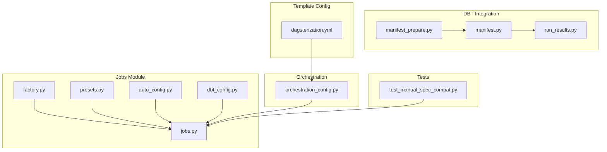
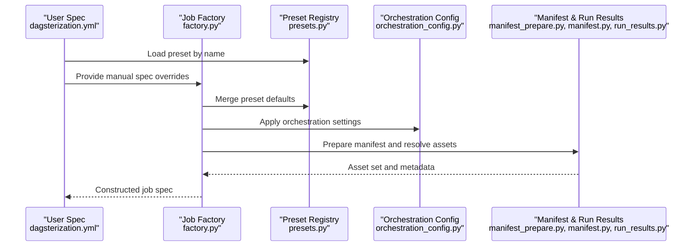
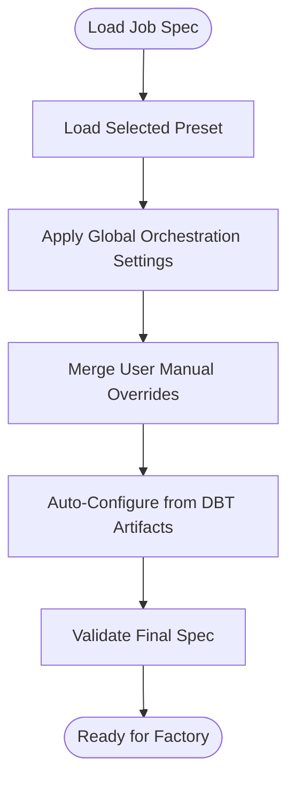
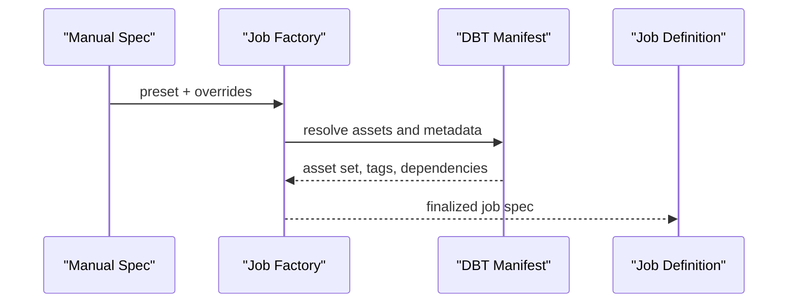
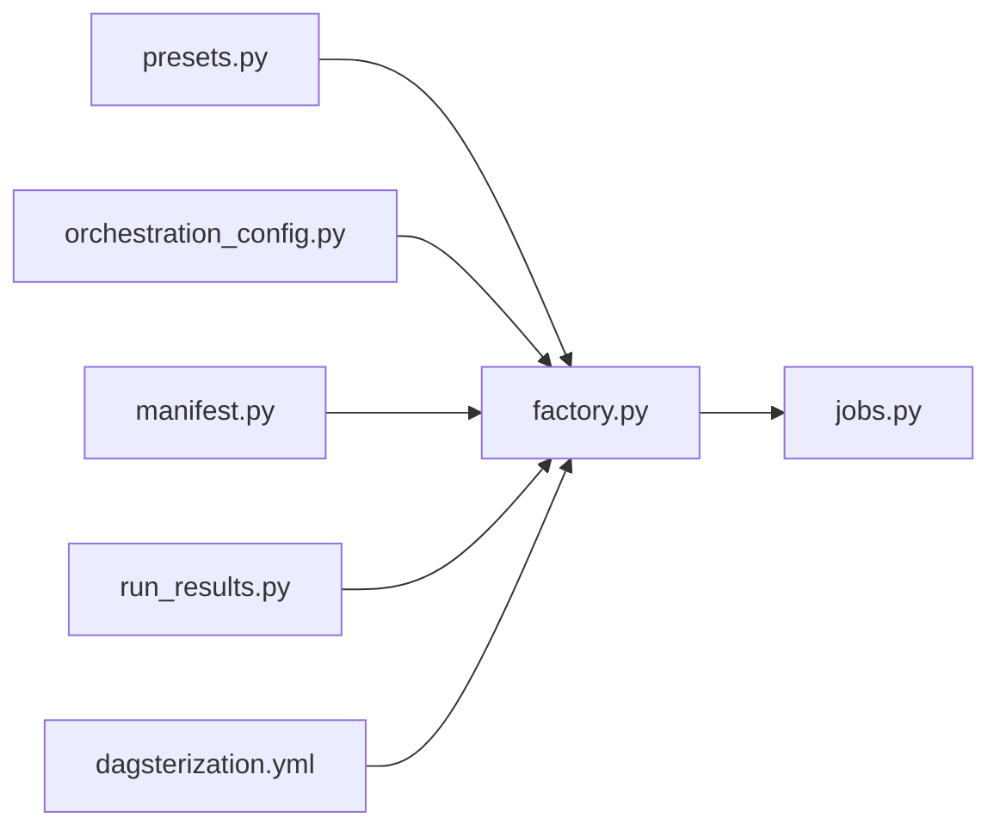

# Manual Job Configuration

<cite>
**Referenced Files in This Document**
- [jobs.py](file://src/dbt_dagsterizer/jobs/dbt/jobs.py)
- [factory.py](file://src/dbt_dagsterizer/jobs/dbt/factory.py)
- [presets.py](file://src/dbt_dagsterizer/jobs/dbt/presets.py)
- [auto_config.py](file://src/dbt_dagsterizer/jobs/dbt/auto_config.py)
- [dbt_config.py](file://src/dbt_dagsterizer/jobs/dbt_config.py)
- [orchestration_config.py](file://src/dbt_dagsterizer/orchestration_config.py)
- [manifest_prepare.py](file://src/dbt_dagsterizer/dbt/manifest_prepare.py)
- [manifest.py](file://src/dbt_dagsterizer/dbt/manifest.py)
- [run_results.py](file://src/dbt_dagsterizer/dbt/run_results.py)
- [dagsterization.yml](file://src/project_templates/luban-dagster-dbt-starrocks-code-location-source-template/{{cookiecutter.output_name}}/dbt_project/dagsterization.yml)
- [test_manual_spec_compat.py](file://tests/test_manual_spec_compat.py)
</cite>

## Table of Contents
1. [Introduction](#introduction)
2. [Project Structure](#project-structure)
3. [Core Components](#core-components)
4. [Architecture Overview](#architecture-overview)
5. [Detailed Component Analysis](#detailed-component-analysis)
6. [Dependency Analysis](#dependency-analysis)
7. [Performance Considerations](#performance-considerations)
8. [Troubleshooting Guide](#troubleshooting-guide)
9. [Conclusion](#conclusion)
10. [Appendices](#appendices)

## Introduction
This document explains how to configure and manage manual jobs beyond automatic generation. It covers the YAML preset system for defining custom jobs, the job specification syntax, parameter options, configuration inheritance, and practical workflows for asset selection, execution ordering, and custom scheduling. It also documents job presets for different deployment scenarios, resource requirements, and execution environments, along with examples of complex configurations, conditional execution, and advanced orchestration patterns. Finally, it addresses validation, error handling, and debugging techniques grounded in the repository’s implementation.

## Project Structure
Manual job configuration spans several modules:
- Job definition and presets: jobs/dbt/jobs.py, jobs/dbt/presets.py
- Factory and orchestration: jobs/dbt/factory.py, orchestration_config.py
- Auto configuration and DBT integration: jobs/dbt/auto_config.py, dbt/manifest_prepare.py, dbt/manifest.py, dbt/run_results.py
- User-facing configuration: dbt_project/dagsterization.yml in the template
- Tests validating manual spec compatibility: tests/test_manual_spec_compat.py

**Diagram sources**
- [factory.py](file://src/dbt_dagsterizer/jobs/dbt/factory.py)
- [presets.py](file://src/dbt_dagsterizer/jobs/dbt/presets.py)
- [auto_config.py](file://src/dbt_dagsterizer/jobs/dbt/auto_config.py)
- [dbt_config.py](file://src/dbt_dagsterizer/jobs/dbt_config.py)
- [jobs.py](file://src/dbt_dagsterizer/jobs/dbt/jobs.py)
- [orchestration_config.py](file://src/dbt_dagsterizer/orchestration_config.py)
- [manifest_prepare.py](file://src/dbt_dagsterizer/dbt/manifest_prepare.py)
- [manifest.py](file://src/dbt_dagsterizer/dbt/manifest.py)
- [run_results.py](file://src/dbt_dagsterizer/dbt/run_results.py)
- [dagsterization.yml](file://src/project_templates/luban-dagster-dbt-starrocks-code-location-source-template/{{cookiecutter.output_name}}/dbt_project/dagsterization.yml)
- [test_manual_spec_compat.py](file://tests/test_manual_spec_compat.py)

**Section sources**
- [jobs.py](file://src/dbt_dagsterizer/jobs/dbt/jobs.py)
- [presets.py](file://src/dbt_dagsterizer/jobs/dbt/presets.py)
- [factory.py](file://src/dbt_dagsterizer/jobs/dbt/factory.py)
- [auto_config.py](file://src/dbt_dagsterizer/jobs/dbt/auto_config.py)
- [dbt_config.py](file://src/dbt_dagsterizer/jobs/dbt_config.py)
- [orchestration_config.py](file://src/dbt_dagsterizer/orchestration_config.py)
- [manifest_prepare.py](file://src/dbt_dagsterizer/dbt/manifest_prepare.py)
- [manifest.py](file://src/dbt_dagsterizer/dbt/manifest.py)
- [run_results.py](file://src/dbt_dagsterizer/dbt/run_results.py)
- [dagsterization.yml](file://src/project_templates/luban-dagster-dbt-starrocks-code-location-source-template/{{cookiecutter.output_name}}/dbt_project/dagsterization.yml)
- [test_manual_spec_compat.py](file://tests/test_manual_spec_compat.py)

## Core Components
- Job factory: constructs job definitions from presets and overrides, orchestrating asset selection and execution order.
- Preset registry: defines reusable job configurations for common deployment scenarios and environments.
- Auto configuration: augments job specs with DBT manifest-derived metadata and runtime context.
- Orchestration config: centralizes job-level settings, resource requirements, and execution environment directives.
- DBT integration: prepares manifests, resolves assets, and interprets run results to inform job behavior.
- Template configuration: user-facing YAML that declares manual job specs and optional overrides.

Key responsibilities:
- Define job spec schema and parameter options
- Resolve asset sets and enforce execution ordering
- Apply configuration inheritance and override precedence
- Integrate with DBT artifacts and run results
- Support custom scheduling and environment-specific presets

**Section sources**
- [jobs.py](file://src/dbt_dagsterizer/jobs/dbt/jobs.py)
- [presets.py](file://src/dbt_dagsterizer/jobs/dbt/presets.py)
- [factory.py](file://src/dbt_dagsterizer/jobs/dbt/factory.py)
- [auto_config.py](file://src/dbt_dagsterizer/jobs/dbt/auto_config.py)
- [dbt_config.py](file://src/dbt_dagsterizer/jobs/dbt_config.py)
- [orchestration_config.py](file://src/dbt_dagsterizer/orchestration_config.py)
- [manifest_prepare.py](file://src/dbt_dagsterizer/dbt/manifest_prepare.py)
- [manifest.py](file://src/dbt_dagsterizer/dbt/manifest.py)
- [run_results.py](file://src/dbt_dagsterizer/dbt/run_results.py)
- [dagsterization.yml](file://src/project_templates/luban-dagster-dbt-starrocks-code-location-source-template/{{cookiecutter.output_name}}/dbt_project/dagsterization.yml)

## Architecture Overview
The manual job configuration pipeline integrates user-defined specs with DBT artifacts and orchestration settings.

**Diagram sources**
- [factory.py](file://src/dbt_dagsterizer/jobs/dbt/factory.py)
- [presets.py](file://src/dbt_dagsterizer/jobs/dbt/presets.py)
- [orchestration_config.py](file://src/dbt_dagsterizer/orchestration_config.py)
- [manifest_prepare.py](file://src/dbt_dagsterizer/dbt/manifest_prepare.py)
- [manifest.py](file://src/dbt_dagsterizer/dbt/manifest.py)
- [run_results.py](file://src/dbt_dagsterizer/dbt/run_results.py)
- [dagsterization.yml](file://src/project_templates/luban-dagster-dbt-starrocks-code-location-source-template/{{cookiecutter.output_name}}/dbt_project/dagsterization.yml)

## Detailed Component Analysis

### Job Specification Syntax and Parameter Options
Manual job specs are defined via a YAML schema that supports:
- Preset selection: choose a named preset to inherit base configuration
- Asset selection: define inclusion/exclusion filters for DBT nodes
- Execution ordering: specify upstream/downstream constraints and grouping
- Scheduling: declare cron-like schedules and partition-aware cadence
- Resource requirements: CPU/memory requests/limits and environment tags
- Environment overrides: per-environment settings and variable substitution
- Conditional execution: enable/disable jobs and branch on run outcomes

Parameter categories:
- Identity and scope: name, preset, asset selection rules
- Execution: tags, exclude, select, group_by, order
- Scheduling: cron, minute/hour/day/month/wday, catchup behavior
- Resources: compute profile, environment tags, labels
- Environment: variables, secrets, runtime overrides

These options are resolved and validated during job construction, with defaults supplied by the selected preset and overrides applied last.

**Section sources**
- [jobs.py](file://src/dbt_dagsterizer/jobs/dbt/jobs.py)
- [presets.py](file://src/dbt_dagsterizer/jobs/dbt/presets.py)
- [dbt_config.py](file://src/dbt_dagsterizer/jobs/dbt_config.py)
- [dagsterization.yml](file://src/project_templates/luban-dagster-dbt-starrocks-code-location-source-template/{{cookiecutter.output_name}}/dbt_project/dagsterization.yml)

### Configuration Inheritance and Overrides
Inheritance follows a layered approach:
- Base preset: default configuration for a scenario (e.g., dev/stage/prod)
- Orchestration config: global settings for resource profiles and environment tags
- User spec: manual overrides that refine or replace inherited values
- Auto config: runtime augmentation derived from DBT manifest and run results

Override precedence ensures user intent takes priority over defaults, while preserving safety and consistency.

**Diagram sources**
- [presets.py](file://src/dbt_dagsterizer/jobs/dbt/presets.py)
- [orchestration_config.py](file://src/dbt_dagsterizer/orchestration_config.py)
- [dbt_config.py](file://src/dbt_dagsterizer/jobs/dbt_config.py)
- [auto_config.py](file://src/dbt_dagsterizer/jobs/dbt/auto_config.py)

**Section sources**
- [presets.py](file://src/dbt_dagsterizer/jobs/dbt/presets.py)
- [orchestration_config.py](file://src/dbt_dagsterizer/orchestration_config.py)
- [dbt_config.py](file://src/dbt_dagsterizer/jobs/dbt_config.py)
- [auto_config.py](file://src/dbt_dagsterizer/jobs/dbt/auto_config.py)

### Manual Job Creation Workflows
Workflows include:
- Asset selection: filter DBT nodes by tags, models, sources, or custom criteria
- Execution ordering: define upstream dependencies and grouping to optimize DAG topology
- Custom scheduling: set cron expressions and partition-aware cadence aligned with data freshness
- Environment-specific presets: choose appropriate compute and tagging profiles per stage

Factory constructs job definitions from presets and user specs, integrating DBT-manifest-derived metadata to ensure correctness and completeness.

**Diagram sources**
- [factory.py](file://src/dbt_dagsterizer/jobs/dbt/factory.py)
- [manifest_prepare.py](file://src/dbt_dagsterizer/dbt/manifest_prepare.py)
- [manifest.py](file://src/dbt_dagsterizer/dbt/manifest.py)
- [jobs.py](file://src/dbt_dagsterizer/jobs/dbt/jobs.py)

**Section sources**
- [factory.py](file://src/dbt_dagsterizer/jobs/dbt/factory.py)
- [manifest_prepare.py](file://src/dbt_dagsterizer/dbt/manifest_prepare.py)
- [manifest.py](file://src/dbt_dagsterizer/dbt/manifest.py)
- [jobs.py](file://src/dbt_dagsterizer/jobs/dbt/jobs.py)

### Job Presets for Deployment Scenarios
Presets encapsulate common configurations for:
- Development: lightweight compute, frequent runs, minimal resource limits
- Staging: moderate compute, stricter quotas, environment tagging
- Production: high-resource profiles, strict scheduling, audit-friendly labels

Each preset defines defaults for:
- Resource profiles and environment tags
- Scheduling cadence and partition behavior
- Asset selection and execution grouping
- Validation and failure policies

Users can compose a preset with targeted overrides to tailor to specific workloads.

**Section sources**
- [presets.py](file://src/dbt_dagsterizer/jobs/dbt/presets.py)
- [orchestration_config.py](file://src/dbt_dagsterizer/orchestration_config.py)

### Advanced Orchestration Patterns
Patterns supported:
- Conditional execution: enable/disable jobs based on environment or run outcomes
- Partition-aware scheduling: align runs with partition boundaries and watermarks
- Multi-stage pipelines: group jobs by phase (extract, transform, load) with explicit ordering
- Failure propagation: propagate failures across dependent jobs with backoff and alerting
- Dynamic asset selection: adjust included assets based on run results or external signals

These patterns leverage DBT run results and manifest metadata to drive intelligent orchestration decisions.

**Section sources**
- [run_results.py](file://src/dbt_dagsterizer/dbt/run_results.py)
- [manifest.py](file://src/dbt_dagsterizer/dbt/manifest.py)
- [auto_config.py](file://src/dbt_dagsterizer/jobs/dbt/auto_config.py)

### Examples of Complex Job Configurations
While specific code is not reproduced here, typical examples include:
- Multi-group jobs: split large transformations into batches grouped by domain or partition
- Conditional downstream: schedule downstream jobs only after successful upstream runs
- Environment-specific overrides: increase resource limits in production while keeping dev light
- Partition-triggered runs: align job cadence with partition availability and watermark updates

Validation and compatibility tests ensure these patterns remain functional across versions.

**Section sources**
- [test_manual_spec_compat.py](file://tests/test_manual_spec_compat.py)

## Dependency Analysis
The job configuration system exhibits cohesive coupling around the factory and presets, with loose coupling to DBT artifacts and orchestration settings.

**Diagram sources**
- [presets.py](file://src/dbt_dagsterizer/jobs/dbt/presets.py)
- [factory.py](file://src/dbt_dagsterizer/jobs/dbt/factory.py)
- [orchestration_config.py](file://src/dbt_dagsterizer/orchestration_config.py)
- [manifest.py](file://src/dbt_dagsterizer/dbt/manifest.py)
- [run_results.py](file://src/dbt_dagsterizer/dbt/run_results.py)
- [dagsterization.yml](file://src/project_templates/luban-dagster-dbt-starrocks-code-location-source-template/{{cookiecutter.output_name}}/dbt_project/dagsterization.yml)
- [jobs.py](file://src/dbt_dagsterizer/jobs/dbt/jobs.py)

**Section sources**
- [factory.py](file://src/dbt_dagsterizer/jobs/dbt/factory.py)
- [presets.py](file://src/dbt_dagsterizer/jobs/dbt/presets.py)
- [orchestration_config.py](file://src/dbt_dagsterizer/orchestration_config.py)
- [manifest.py](file://src/dbt_dagsterizer/dbt/manifest.py)
- [run_results.py](file://src/dbt_dagsterizer/dbt/run_results.py)
- [dagsterization.yml](file://src/project_templates/luban-dagster-dbt-starrocks-code-location-source-template/{{cookiecutter.output_name}}/dbt_project/dagsterization.yml)
- [jobs.py](file://src/dbt_dagsterizer/jobs/dbt/jobs.py)

## Performance Considerations
- Prefer grouping assets to reduce fan-out and improve parallelism within bounds
- Align scheduling with partition cadence to minimize idle time and redundant runs
- Use environment-specific presets to right-size compute and avoid over-provisioning
- Leverage DBT run results to skip unnecessary downstream steps and accelerate cycles

## Troubleshooting Guide
Common issues and remedies:
- Invalid preset name: verify preset exists and spelling matches the registry
- Asset selection mismatch: confirm tag filters and model globs align with manifest
- Scheduling conflicts: review cron expressions and partition windows for overlap
- Resource exhaustion: adjust compute profile and environment tags per preset
- Validation errors: check manual overrides against schema and ensure required fields are present

Validation and compatibility tests help detect regressions early.

**Section sources**
- [test_manual_spec_compat.py](file://tests/test_manual_spec_compat.py)

## Conclusion
Manual job configuration provides a powerful, extensible mechanism to define custom orchestration beyond automatic generation. By combining presets, orchestration settings, DBT artifacts, and user overrides, teams can craft precise, efficient, and maintainable job pipelines tailored to their deployment scenarios and operational needs.

## Appendices
- Example configuration locations:
  - Manual job specs: [dagsterization.yml](file://src/project_templates/luban-dagster-dbt-starrocks-code-location-source-template/{{cookiecutter.output_name}}/dbt_project/dagsterization.yml)
  - Preset definitions: [presets.py](file://src/dbt_dagsterizer/jobs/dbt/presets.py)
  - Factory and job construction: [factory.py](file://src/dbt_dagsterizer/jobs/dbt/factory.py), [jobs.py](file://src/dbt_dagsterizer/jobs/dbt/jobs.py)
  - Orchestration settings: [orchestration_config.py](file://src/dbt_dagsterizer/orchestration_config.py)
  - DBT integration: [manifest_prepare.py](file://src/dbt_dagsterizer/dbt/manifest_prepare.py), [manifest.py](file://src/dbt_dagsterizer/dbt/manifest.py), [run_results.py](file://src/dbt_dagsterizer/dbt/run_results.py)
  - Compatibility checks: [test_manual_spec_compat.py](file://tests/test_manual_spec_compat.py)