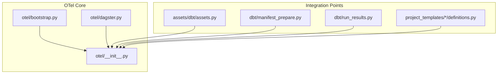
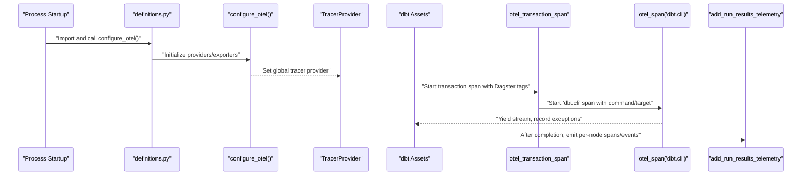
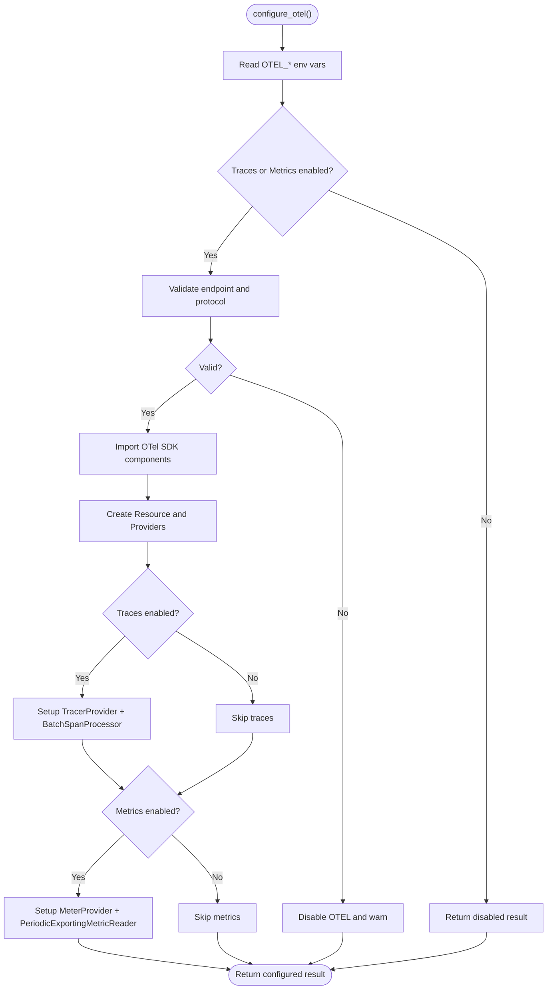
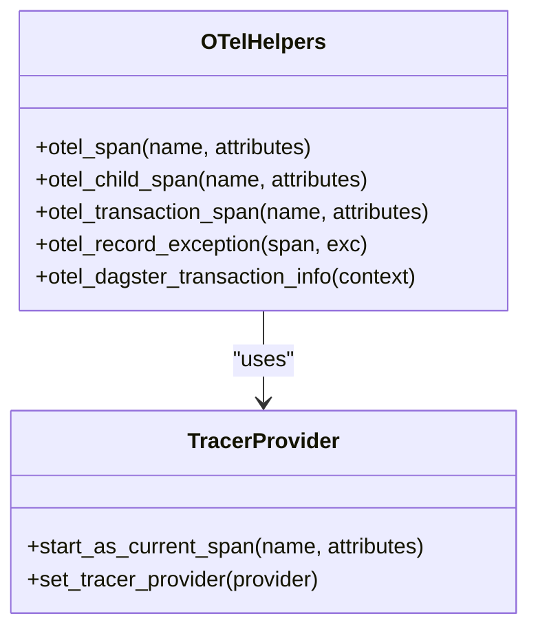
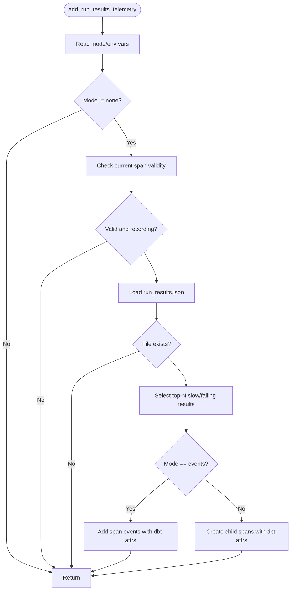
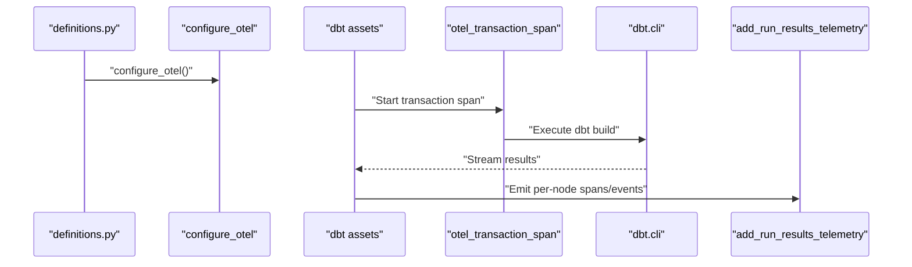
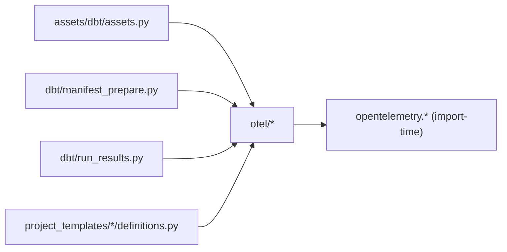

# Observability and Monitoring

<cite>
**Referenced Files in This Document**
- [bootstrap.py](file://src/dbt_dagsterizer/otel/bootstrap.py)
- [dagster.py](file://src/dbt_dagsterizer/otel/dagster.py)
- [__init__.py](file://src/dbt_dagsterizer/otel/__init__.py)
- [assets.py](file://src/dbt_dagsterizer/assets/dbt/assets.py)
- [manifest_prepare.py](file://src/dbt_dagsterizer/dbt/manifest_prepare.py)
- [run_results.py](file://src/dbt_dagsterizer/dbt/run_results.py)
- [definitions.py](file://src/dbt_dagsterizer/project_templates/luban-dagster-dbt-starrocks-code-location-source-template/{{cookiecutter.output_name}}/src/{{cookiecutter.package_name}}/definitions.py)
- [observability.md](file://docs/observability.md)
- [test_otel.py](file://tests/test_otel.py)
</cite>

## Table of Contents
1. [Introduction](#introduction)
2. [Project Structure](#project-structure)
3. [Core Components](#core-components)
4. [Architecture Overview](#architecture-overview)
5. [Detailed Component Analysis](#detailed-component-analysis)
6. [Dependency Analysis](#dependency-analysis)
7. [Performance Considerations](#performance-considerations)
8. [Troubleshooting Guide](#troubleshooting-guide)
9. [Conclusion](#conclusion)
10. [Appendices](#appendices)

## Introduction
This document explains observability and monitoring in dbt-dagsterizer with a focus on OpenTelemetry integration, distributed tracing, and optional run-results-based telemetry. It covers observability bootstrapping, span creation patterns, transaction tagging, and how to export telemetry to backends such as Elastic APM. It also provides guidance on logging configuration, structured logging patterns, alerting strategies, dashboard views, and production considerations.

## Project Structure
The observability subsystem is organized around three primary modules:
- OpenTelemetry bootstrapping and configuration
- Dagster-specific tracing helpers and transaction tagging
- Telemetry integration points in dbt asset materialization and manifest preparation

**Diagram sources**
- [bootstrap.py:1-187](file://src/dbt_dagsterizer/otel/bootstrap.py#L1-L187)
- [dagster.py:1-185](file://src/dbt_dagsterizer/otel/dagster.py#L1-L185)
- [__init__.py:1-29](file://src/dbt_dagsterizer/otel/__init__.py#L1-L29)
- [assets.py:1-113](file://src/dbt_dagsterizer/assets/dbt/assets.py#L1-L113)
- [manifest_prepare.py:1-72](file://src/dbt_dagsterizer/dbt/manifest_prepare.py#L1-L72)
- [run_results.py:1-335](file://src/dbt_dagsterizer/dbt/run_results.py#L1-L335)
- [definitions.py:1-23](file://src/dbt_dagsterizer/project_templates/luban-dagster-dbt-starrocks-code-location-source-template/{{cookiecutter.output_name}}/src/{{cookiecutter.package_name}}/definitions.py#L1-L23)

**Section sources**
- [bootstrap.py:1-187](file://src/dbt_dagsterizer/otel/bootstrap.py#L1-L187)
- [dagster.py:1-185](file://src/dbt_dagsterizer/otel/dagster.py#L1-L185)
- [__init__.py:1-29](file://src/dbt_dagsterizer/otel/__init__.py#L1-L29)
- [assets.py:1-113](file://src/dbt_dagsterizer/assets/dbt/assets.py#L1-L113)
- [manifest_prepare.py:1-72](file://src/dbt_dagsterizer/dbt/manifest_prepare.py#L1-L72)
- [run_results.py:1-335](file://src/dbt_dagsterizer/dbt/run_results.py#L1-L335)
- [definitions.py:1-23](file://src/dbt_dagsterizer/project_templates/luban-dagster-dbt-starrocks-code-location-source-template/{{cookiecutter.output_name}}/src/{{cookiecutter.package_name}}/definitions.py#L1-L23)

## Core Components
- OpenTelemetry bootstrapper: Parses environment variables, validates configuration, and sets up TracerProvider/MeterProvider with exporters when enabled.
- Dagster tracing helpers: Provide context-aware span creation, exception recording, and transaction metadata extraction from Dagster run contexts.
- Run-results telemetry: Optionally emits child spans or span events for slow models/tests based on dbt’s run_results.json and manifest.json.

Key responsibilities:
- Bootstrapping: configure_otel initializes providers and processors, honoring OTEL_* environment variables and defaults.
- Span creation: otel_span, otel_child_span, and otel_transaction_span wrap major execution phases and transactions.
- Transaction tagging: otel_dagster_transaction_info extracts run-level metadata to annotate spans consistently across runs.
- Telemetry emission: add_run_results_telemetry enriches the dbt.cli span with per-node details when enabled.

**Section sources**
- [bootstrap.py:80-185](file://src/dbt_dagsterizer/otel/bootstrap.py#L80-L185)
- [dagster.py:7-184](file://src/dbt_dagsterizer/otel/dagster.py#L7-L184)
- [run_results.py:223-335](file://src/dbt_dagsterizer/dbt/run_results.py#L223-L335)

## Architecture Overview
The observability pipeline integrates at process startup and during asset materialization:

**Diagram sources**
- [definitions.py:15-15](file://src/dbt_dagsterizer/project_templates/luban-dagster-dbt-starrocks-code-location-source-template/{{cookiecutter.output_name}}/src/{{cookiecutter.package_name}}/definitions.py#L15-L15)
- [bootstrap.py:123-185](file://src/dbt_dagsterizer/otel/bootstrap.py#L123-L185)
- [assets.py:77-109](file://src/dbt_dagsterizer/assets/dbt/assets.py#L77-L109)
- [run_results.py:223-335](file://src/dbt_dagsterizer/dbt/run_results.py#L223-L335)

## Detailed Component Analysis

### OpenTelemetry Bootstrapping and Configuration
- Environment-driven configuration:
  - Exporters: OTEL_TRACES_EXPORTER and OTEL_METRICS_EXPORTER default to enabled only when set to "otlp".
  - Endpoint and protocol: OTEL_EXPORTER_OTLP_ENDPOINT and OTEL_EXPORTER_OTLP_PROTOCOL control transport; http/protobuf auto-appends /v1/traces or /v1/metrics when needed.
  - Headers and resource attributes: OTEL_EXPORTER_OTLP_HEADERS and OTEL_RESOURCE_ATTRIBUTES support backend authentication and service metadata.
- Provider setup:
  - TracerProvider with BatchSpanProcessor for OTLP spans.
  - MeterProvider with PeriodicExportingMetricReader for OTLP metrics.
  - Graceful shutdown via atexit.
- Safety and fallback:
  - Missing OpenTelemetry packages disable OTEL safely with warnings.
  - Invalid protocol or missing endpoint disables export.

**Diagram sources**
- [bootstrap.py:80-185](file://src/dbt_dagsterizer/otel/bootstrap.py#L80-L185)

**Section sources**
- [bootstrap.py:80-185](file://src/dbt_dagsterizer/otel/bootstrap.py#L80-L185)
- [observability.md:24-42](file://docs/observability.md#L24-L42)

### Dagster Tracing Helpers
- otel_span(name, attributes): Starts a top-level span with a given name and attributes.
- otel_child_span(name, attributes): Creates a child span only if the current span is valid and recording.
- otel_transaction_span(name, attributes): Either annotates the existing span with attributes or starts a new transaction-level span.
- otel_record_exception(span, exc): Records an exception and marks the span status as ERROR.
- otel_dagster_transaction_info(context): Extracts transaction type/name and attributes from Dagster run tags and context (supports schedules, sensors, detectors, propagators, backfills, asset jobs, manual runs).

**Diagram sources**
- [dagster.py:7-184](file://src/dbt_dagsterizer/otel/dagster.py#L7-L184)

**Section sources**
- [dagster.py:7-184](file://src/dbt_dagsterizer/otel/dagster.py#L7-L184)

### Run-Results Telemetry
- Controls:
  - LUBAN_OTEL_DBT_RUN_RESULTS_MODE: "spans", "events", or "none".
  - LUBAN_OTEL_DBT_RUN_RESULTS_TOP_N: number of top slow items to emit.
  - LUBAN_OTEL_DBT_RUN_RESULTS_MIN_SECONDS: minimum execution time threshold.
- Behavior:
  - Loads run_results.json and manifest.json.
  - Selects top-N slow or failing nodes based on execution time and status.
  - Emits either span events or child spans under the current span, including dbt metadata (unique_id, status, execution_time_s, resource_type, name, package_name, path, fqn).
  - Uses precise timing bounds when available.

**Diagram sources**
- [run_results.py:223-335](file://src/dbt_dagsterizer/dbt/run_results.py#L223-L335)

**Section sources**
- [run_results.py:194-221](file://src/dbt_dagsterizer/dbt/run_results.py#L194-L221)
- [run_results.py:223-335](file://src/dbt_dagsterizer/dbt/run_results.py#L223-L335)
- [observability.md:18-23](file://docs/observability.md#L18-L23)

### Integration Points in the Application
- Process startup: configure_otel is called early to initialize providers.
- Asset materialization: wraps dbt.cli execution with transaction and command spans; records exceptions; emits run-results telemetry after completion.
- Manifest preparation: wraps parse/deps steps with a dedicated child span.

**Diagram sources**
- [definitions.py:15-15](file://src/dbt_dagsterizer/project_templates/luban-dagster-dbt-starrocks-code-location-source-template/{{cookiecutter.output_name}}/src/{{cookiecutter.package_name}}/definitions.py#L15-L15)
- [assets.py:77-109](file://src/dbt_dagsterizer/assets/dbt/assets.py#L77-L109)
- [run_results.py:223-335](file://src/dbt_dagsterizer/dbt/run_results.py#L223-L335)

**Section sources**
- [definitions.py:15-15](file://src/dbt_dagsterizer/project_templates/luban-dagster-dbt-starrocks-code-location-source-template/{{cookiecutter.output_name}}/src/{{cookiecutter.package_name}}/definitions.py#L15-L15)
- [assets.py:77-109](file://src/dbt_dagsterizer/assets/dbt/assets.py#L77-L109)
- [manifest_prepare.py:36-50](file://src/dbt_dagsterizer/dbt/manifest_prepare.py#L36-L50)

## Dependency Analysis
- Internal dependencies:
  - assets.py, manifest_prepare.py, and run_results.py depend on otel helpers.
  - definitions.py calls configure_otel at import time.
- External dependencies:
  - OpenTelemetry SDK components are imported conditionally; missing packages disable OTEL gracefully.
- Coupling:
  - Low coupling via thin wrappers around OpenTelemetry APIs.
  - Environment-driven configuration avoids hard-coded backend specifics.

**Diagram sources**
- [assets.py:20-25](file://src/dbt_dagsterizer/assets/dbt/assets.py#L20-L25)
- [manifest_prepare.py:15-15](file://src/dbt_dagsterizer/dbt/manifest_prepare.py#L15-L15)
- [run_results.py:234-234](file://src/dbt_dagsterizer/dbt/run_results.py#L234-L234)
- [definitions.py:5-5](file://src/dbt_dagsterizer/project_templates/luban-dagster-dbt-starrocks-code-location-source-template/{{cookiecutter.output_name}}/src/{{cookiecutter.package_name}}/definitions.py#L5-L5)

**Section sources**
- [assets.py:20-25](file://src/dbt_dagsterizer/assets/dbt/assets.py#L20-L25)
- [manifest_prepare.py:15-15](file://src/dbt_dagsterizer/dbt/manifest_prepare.py#L15-L15)
- [run_results.py:234-234](file://src/dbt_dagsterizer/dbt/run_results.py#L234-L234)
- [definitions.py:5-5](file://src/dbt_dagsterizer/project_templates/luban-dagster-dbt-starrocks-code-location-source-template/{{cookiecutter.output_name}}/src/{{cookiecutter.package_name}}/definitions.py#L5-L5)

## Performance Considerations
- Overhead:
  - BatchSpanProcessor and PeriodicExportingMetricReader batch exports to reduce network overhead.
  - Child spans/events are emitted only when the current span is valid and recording.
- Filtering:
  - Use LUBAN_OTEL_DBT_RUN_RESULTS_MODE to choose between spans and events; events are lighter-weight than child spans.
  - Tune LUBAN_OTEL_DBT_RUN_RESULTS_TOP_N and LUBAN_OTEL_DBT_RUN_RESULTS_MIN_SECONDS to limit per-run telemetry volume.
- Protocol choice:
  - grpc vs http/protobuf affects endpoint normalization and path handling; choose based on backend support and latency characteristics.
- Resource attributes:
  - Set OTEL_RESOURCE_ATTRIBUTES and OTEL_SERVICE_NAME to improve backend grouping and filtering.

[No sources needed since this section provides general guidance]

## Troubleshooting Guide
- OTEL disabled unexpectedly:
  - Ensure OTEL_TRACES_EXPORTER or OTEL_METRICS_EXPORTER is set to "otlp" (not empty or "none").
  - Confirm OTEL_EXPORTER_OTLP_ENDPOINT is present and properly formatted for the chosen protocol.
  - Verify OTEL_EXPORTER_OTLP_PROTOCOL is one of "grpc" or "http/protobuf".
- Missing OpenTelemetry packages:
  - The bootstrapper logs a warning and disables OTEL when packages are unavailable; install opentelemetry-sdk and exporters accordingly.
- No traces in APM:
  - Confirm OTEL_SERVICE_NAME and OTEL_RESOURCE_ATTRIBUTES match your backend service filters.
  - For http/protobuf, ensure the endpoint includes the correct scheme; the library auto-appends /v1/traces when needed.
- Run-results telemetry not visible:
  - Check LUBAN_OTEL_DBT_RUN_RESULTS_MODE and thresholds.
  - Ensure run_results.json and manifest.json exist and are readable.
- Tests and validations:
  - Unit tests cover environment parsing, endpoint normalization, and transaction info extraction.

**Section sources**
- [bootstrap.py:80-130](file://src/dbt_dagsterizer/otel/bootstrap.py#L80-L130)
- [bootstrap.py:134-185](file://src/dbt_dagsterizer/otel/bootstrap.py#L134-L185)
- [test_otel.py:11-146](file://tests/test_otel.py#L11-L146)
- [observability.md:43-119](file://docs/observability.md#L43-L119)

## Conclusion
dbt-dagsterizer provides a robust, environment-driven OpenTelemetry integration that enables distributed tracing and optional per-node telemetry from dbt run results. By initializing providers at startup and wrapping key execution phases with transaction and command spans, it offers clear visibility into asset materialization flows. With configurable run-results telemetry and strong defaults, teams can instrument their pipelines for APM backends while controlling overhead and complexity.

[No sources needed since this section summarizes without analyzing specific files]

## Appendices

### Environment Variables Reference
- OTEL_TRACES_EXPORTER: "otlp" or "none"
- OTEL_METRICS_EXPORTER: "otlp" or "none"
- OTEL_EXPORTER_OTLP_PROTOCOL: "grpc" or "http/protobuf"
- OTEL_EXPORTER_OTLP_ENDPOINT: backend endpoint
- OTEL_EXPORTER_OTLP_HEADERS: optional headers (e.g., Authorization)
- OTEL_SERVICE_NAME: service name for resource attributes
- OTEL_RESOURCE_ATTRIBUTES: comma-separated key=value pairs
- LUBAN_OTEL_DBT_RUN_RESULTS_MODE: "spans", "events", or "none"
- LUBAN_OTEL_DBT_RUN_RESULTS_TOP_N: integer
- LUBAN_OTEL_DBT_RUN_RESULTS_MIN_SECONDS: float

**Section sources**
- [observability.md:24-42](file://docs/observability.md#L24-L42)
- [observability.md:18-23](file://docs/observability.md#L18-L23)
- [run_results.py:194-221](file://src/dbt_dagsterizer/dbt/run_results.py#L194-L221)