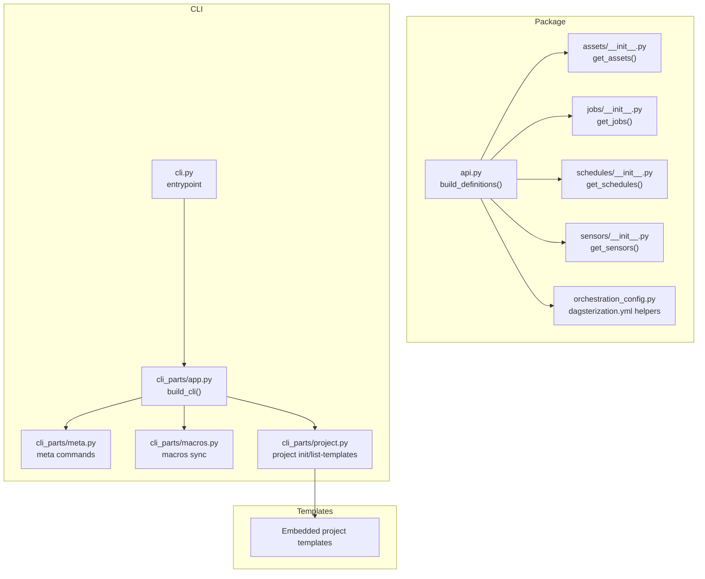
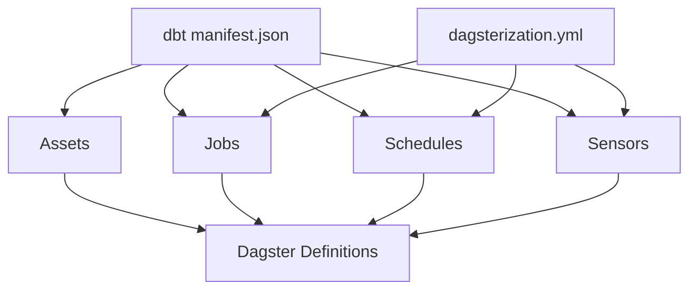
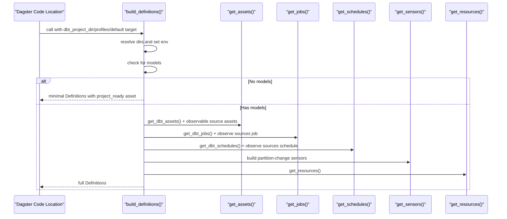
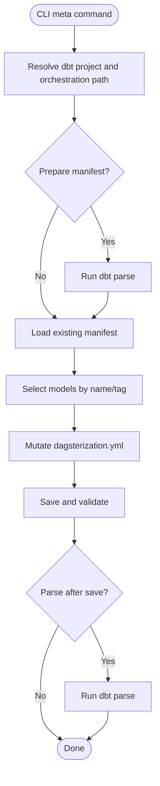
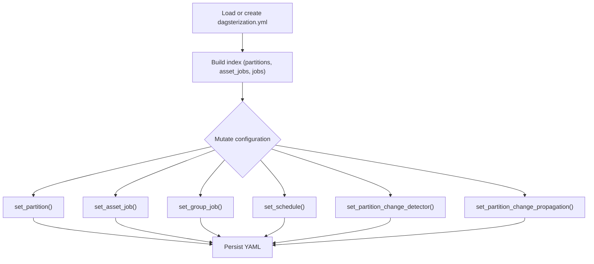
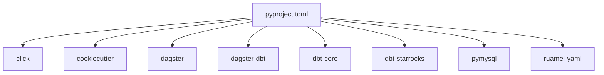

# Project Overview

<cite>
**Referenced Files in This Document**
- [README.md](file://README.md)
- [docs/README.md](file://docs/README.md)
- [docs/getting-started.md](file://docs/getting-started.md)
- [docs/concepts/overview.md](file://docs/concepts/overview.md)
- [pyproject.toml](file://pyproject.toml)
- [src/dbt_dagsterizer/__init__.py](file://src/dbt_dagsterizer/__init__.py)
- [src/dbt_dagsterizer/api.py](file://src/dbt_dagsterizer/api.py)
- [src/dbt_dagsterizer/cli.py](file://src/dbt_dagsterizer/cli.py)
- [src/dbt_dagsterizer/cli_parts/app.py](file://src/dbt_dagsterizer/cli_parts/app.py)
- [src/dbt_dagsterizer/cli_parts/meta.py](file://src/dbt_dagsterizer/cli_parts/meta.py)
- [src/dbt_dagsterizer/cli_parts/macros.py](file://src/dbt_dagsterizer/cli_parts/macros.py)
- [src/dbt_dagsterizer/cli_parts/project.py](file://src/dbt_dagsterizer/cli_parts/project.py)
- [src/dbt_dagsterizer/orchestration_config.py](file://src/dbt_dagsterizer/orchestration_config.py)
- [src/dbt_dagsterizer/assets/__init__.py](file://src/dbt_dagsterizer/assets/__init__.py)
- [src/dbt_dagsterizer/jobs/__init__.py](file://src/dbt_dagsterizer/jobs/__init__.py)
- [src/dbt_dagsterizer/schedules/__init__.py](file://src/dbt_dagsterizer/schedules/__init__.py)
- [src/dbt_dagsterizer/sensors/__init__.py](file://src/dbt_dagsterizer/sensors/__init__.py)
- [src/dbt_dagsterizer/project_templates/luban-dagster-dbt-starrocks-code-location-source-template/{{cookiecutter.output_name}}/dbt_project/dagsterization.yml](file://src/dbt_dagsterizer/project_templates/luban-dagster-dbt-starrocks-code-location-source-template/{{cookiecutter.output_name}}/dbt_project/dagsterization.yml)
</cite>

## Table of Contents
1. [Introduction](#introduction)
2. [Project Structure](#project-structure)
3. [Core Components](#core-components)
4. [Architecture Overview](#architecture-overview)
5. [Detailed Component Analysis](#detailed-component-analysis)
6. [Dependency Analysis](#dependency-analysis)
7. [Performance Considerations](#performance-considerations)
8. [Troubleshooting Guide](#troubleshooting-guide)
9. [Conclusion](#conclusion)

## Introduction
dbt-dagsterizer is a Python package that builds Dagster automation from dbt metadata. Its primary purpose is to keep Dagster code locations static while enabling orchestration intent to be declared in a small, reviewable YAML file alongside the dbt project. This separation ensures that dbt projects and Dagster code locations remain decoupled, allowing teams to evolve either stack independently without tight coupling.

Key value propositions:
- Static code locations: Dagster definitions are generated dynamically from dbt metadata and a YAML orchestration file, minimizing hard-coded Python code in the code location.
- Declarative orchestration: Orchestration intent is captured in a single YAML file, making it easy to review, version, and iterate.
- Dual usage modes: Use as a CLI tool for authoring and validating orchestration, or as a Python dependency for runtime generation of Dagster Definitions.

Target audience:
- Data engineers who want to automate Dagster assets, jobs, schedules, and sensors from dbt projects.
- Teams maintaining dbt projects who prefer to keep orchestration close to the dbt project and avoid embedding orchestration logic in Python code locations.

Practical examples:
- Define daily partitioned jobs for specific dbt models and attach schedules that run at specific hours with configurable offsets.
- Configure partition change detection and propagation to trigger downstream jobs when upstream partitions change.
- Generate a complete Dagster code location scaffold from a dbt project using the built-in project templates.

**Section sources**
- [README.md:1-101](file://README.md#L1-L101)
- [docs/concepts/overview.md:1-56](file://docs/concepts/overview.md#L1-L56)
- [docs/getting-started.md:1-108](file://docs/getting-started.md#L1-L108)

## Project Structure
At a high level, the project exposes:
- A CLI entry point for authoring and validating orchestration intent and scaffolding code locations.
- A Python API for generating Dagster Definitions at runtime from a dbt project.
- Core modules for assets, jobs, schedules, sensors, and orchestration configuration.
- Embedded project templates to bootstrap new code locations.

**Diagram sources**
- [src/dbt_dagsterizer/api.py:15-72](file://src/dbt_dagsterizer/api.py#L15-L72)
- [src/dbt_dagsterizer/assets/__init__.py:1-13](file://src/dbt_dagsterizer/assets/__init__.py#L1-L13)
- [src/dbt_dagsterizer/jobs/__init__.py:1-10](file://src/dbt_dagsterizer/jobs/__init__.py#L1-L10)
- [src/dbt_dagsterizer/schedules/__init__.py:1-10](file://src/dbt_dagsterizer/schedules/__init__.py#L1-L10)
- [src/dbt_dagsterizer/sensors/__init__.py:40-75](file://src/dbt_dagsterizer/sensors/__init__.py#L40-L75)
- [src/dbt_dagsterizer/orchestration_config.py:19-83](file://src/dbt_dagsterizer/orchestration_config.py#L19-L83)
- [src/dbt_dagsterizer/cli.py:1-7](file://src/dbt_dagsterizer/cli.py#L1-L7)
- [src/dbt_dagsterizer/cli_parts/app.py:19-29](file://src/dbt_dagsterizer/cli_parts/app.py#L19-L29)
- [src/dbt_dagsterizer/cli_parts/meta.py:56-627](file://src/dbt_dagsterizer/cli_parts/meta.py#L56-L627)
- [src/dbt_dagsterizer/cli_parts/macros.py:67-84](file://src/dbt_dagsterizer/cli_parts/macros.py#L67-L84)
- [src/dbt_dagsterizer/cli_parts/project.py:106-307](file://src/dbt_dagsterizer/cli_parts/project.py#L106-L307)

**Section sources**
- [pyproject.toml:1-50](file://pyproject.toml#L1-L50)
- [src/dbt_dagsterizer/__init__.py:1-11](file://src/dbt_dagsterizer/__init__.py#L1-L11)
- [src/dbt_dagsterizer/cli.py:1-7](file://src/dbt_dagsterizer/cli.py#L1-L7)
- [src/dbt_dagsterizer/cli_parts/app.py:19-29](file://src/dbt_dagsterizer/cli_parts/app.py#L19-L29)

## Core Components
- API surface for runtime definition generation:
  - build_definitions(): Returns a fully populated Dagster Definitions when dbt models exist, or a minimal always-loadable set when models are absent.
- Asset pipeline:
  - get_assets(): Aggregates dbt assets and observable source assets.
- Orchestration orchestration:
  - get_jobs(), get_schedules(), get_sensors(): Aggregate generated jobs, schedules, and sensors.
- Orchestration configuration:
  - Helpers for loading, indexing, and mutating dagsterization.yml, including partitioning, job grouping, schedules, and partition-change detectors/propagators.

Dual usage modes:
- CLI tool: Install globally and use for orchestrating intent and scaffolding code locations.
- Python dependency: Import dbt_dagsterizer in a Dagster code location to generate Definitions at runtime.

**Section sources**
- [src/dbt_dagsterizer/api.py:15-72](file://src/dbt_dagsterizer/api.py#L15-L72)
- [src/dbt_dagsterizer/assets/__init__.py:1-13](file://src/dbt_dagsterizer/assets/__init__.py#L1-L13)
- [src/dbt_dagsterizer/jobs/__init__.py:1-10](file://src/dbt_dagsterizer/jobs/__init__.py#L1-L10)
- [src/dbt_dagsterizer/schedules/__init__.py:1-10](file://src/dbt_dagsterizer/schedules/__init__.py#L1-L10)
- [src/dbt_dagsterizer/sensors/__init__.py:40-75](file://src/dbt_dagsterizer/sensors/__init__.py#L40-L75)
- [src/dbt_dagsterizer/orchestration_config.py:19-370](file://src/dbt_dagsterizer/orchestration_config.py#L19-L370)
- [README.md:7-28](file://README.md#L7-L28)
- [docs/getting-started.md:5-38](file://docs/getting-started.md#L5-L38)

## Architecture Overview
The project follows a manifest-driven architecture:
- dbt manifest.json serves as the canonical source of truth for dbt relations and models.
- dagsterization.yml captures orchestration intent (jobs, partitions, schedules, partition-change detectors/propagators).
- At runtime, dbt-dagsterizer reads the manifest and the YAML file to generate Dagster assets, jobs, schedules, and sensors.

**Diagram sources**
- [docs/concepts/overview.md:13-27](file://docs/concepts/overview.md#L13-L27)
- [src/dbt_dagsterizer/orchestration_config.py:19-83](file://src/dbt_dagsterizer/orchestration_config.py#L19-L83)
- [src/dbt_dagsterizer/assets/__init__.py:1-13](file://src/dbt_dagsterizer/assets/__init__.py#L1-13)
- [src/dbt_dagsterizer/jobs/__init__.py:1-10](file://src/dbt_dagsterizer/jobs/__init__.py#L1-10)
- [src/dbt_dagsterizer/schedules/__init__.py:1-10](file://src/dbt_dagsterizer/schedules/__init__.py#L1-10)
- [src/dbt_dagsterizer/sensors/__init__.py:40-75](file://src/dbt_dagsterizer/sensors/__init__.py#L40-75)

## Detailed Component Analysis

### API: build_definitions
Purpose:
- Build a Dagster Definitions object from a dbt project directory.
- If no dbt models exist, return a minimal always-loadable set so the code location remains importable.

Behavior highlights:
- Resolves dbt project and profiles directories.
- Temporarily sets environment variables for dbt parsing.
- Returns a minimal asset when no models are present; otherwise aggregates assets, jobs, schedules, sensors, and resources.

**Diagram sources**
- [src/dbt_dagsterizer/api.py:15-72](file://src/dbt_dagsterizer/api.py#L15-L72)
- [src/dbt_dagsterizer/assets/__init__.py:1-13](file://src/dbt_dagsterizer/assets/__init__.py#L1-L13)
- [src/dbt_dagsterizer/jobs/__init__.py:1-10](file://src/dbt_dagsterizer/jobs/__init__.py#L1-L10)
- [src/dbt_dagsterizer/schedules/__init__.py:1-10](file://src/dbt_dagsterizer/schedules/__init__.py#L1-L10)
- [src/dbt_dagsterizer/sensors/__init__.py:40-75](file://src/dbt_dagsterizer/sensors/__init__.py#L40-L75)

**Section sources**
- [src/dbt_dagsterizer/api.py:15-72](file://src/dbt_dagsterizer/api.py#L15-L72)
- [docs/getting-started.md:85-96](file://docs/getting-started.md#L85-L96)

### CLI: Orchestration Intent Management (meta)
Purpose:
- Author and validate orchestration intent declaratively via the CLI.
- Supports creating/updating jobs, partitions, asset jobs, schedules, and partition-change detectors/propagators.

Key commands:
- meta init: Initialize dagsterization.yml and optionally parse dbt manifest.
- meta job / meta job-delete: Manage grouped jobs and partitions.
- meta partition: Assign daily/unpartitioned to models.
- meta asset-job / meta asset-job-delete: Toggle asset jobs.
- meta schedule: Attach daily_at schedules to models.
- meta partition-change detector / propagator: Configure partition-change detection and propagation.
- meta validate: Validate structure and content against the current manifest.

**Diagram sources**
- [src/dbt_dagsterizer/cli_parts/meta.py:56-627](file://src/dbt_dagsterizer/cli_parts/meta.py#L56-L627)

**Section sources**
- [src/dbt_dagsterizer/cli_parts/meta.py:56-627](file://src/dbt_dagsterizer/cli_parts/meta.py#L56-L627)
- [docs/getting-started.md:39-84](file://docs/getting-started.md#L39-L84)

### CLI: Macros Sync
Purpose:
- Sync managed dbt macros from the embedded template into a dbt project’s macros directory.

Behavior:
- Determines template name from environment or marker file.
- Copies macro SQL files into dbt_project/macros/dbt_dagsterizer.

**Section sources**
- [src/dbt_dagsterizer/cli_parts/macros.py:28-51](file://src/dbt_dagsterizer/cli_parts/macros.py#L28-L51)
- [src/dbt_dagsterizer/cli_parts/macros.py:53-65](file://src/dbt_dagsterizer/cli_parts/macros.py#L53-L65)

### CLI: Project Scaffold
Purpose:
- Render a complete code location project from an embedded template.

Capabilities:
- List templates, initialize a project with normalized names and optional Docker/sample dbt project inclusion.
- Optionally pin dbt-dagsterizer version in the generated project.
- Generate GitOps environment artifacts.

**Section sources**
- [src/dbt_dagsterizer/cli_parts/project.py:106-307](file://src/dbt_dagsterizer/cli_parts/project.py#L106-L307)

### Orchestration Configuration Model
Purpose:
- Provide a structured way to manage and mutate dagsterization.yml.

Highlights:
- Default path resolution to dbt_project/dagsterization.yml.
- Indexing of partitions, asset jobs, and job-to-model mappings.
- Helpers to set partitions, asset jobs, grouped jobs, schedules, and partition-change specs.

**Diagram sources**
- [src/dbt_dagsterizer/orchestration_config.py:19-370](file://src/dbt_dagsterizer/orchestration_config.py#L19-L370)

**Section sources**
- [src/dbt_dagsterizer/orchestration_config.py:19-370](file://src/dbt_dagsterizer/orchestration_config.py#L19-L370)

### Example: Typical Orchestration Intent File
A typical dagsterization.yml defines:
- Jobs with model lists and partitioning.
- Asset jobs for individual models.
- Daily partitions for specific models.
- Schedules attached to asset jobs.
- Partition-change detectors and propagators to drive incremental recomputation.

**Section sources**
- [src/dbt_dagsterizer/project_templates/luban-dagster-dbt-starrocks-code-location-source-template/{{cookiecutter.output_name}}/dbt_project/dagsterization.yml:1-48](file://src/dbt_dagsterizer/project_templates/luban-dagster-dbt-starrocks-code-location-source-template/{{cookiecutter.output_name}}/dbt_project/dagsterization.yml#L1-L48)

## Dependency Analysis
External dependencies and their roles:
- click: CLI framework for command groups and options.
- cookiecutter: Project scaffolding from templates.
- dagster: Core framework for assets, jobs, schedules, sensors, and Definitions.
- dagster-dbt: Integration for dbt assets and resources.
- dbt-core: Parsing and manifest generation.
- dbt-starrocks: StarRocks-specific dbt adapter.
- pymysql: MySQL connectivity for adapters.
- ruamel-yaml: Robust YAML serialization/deserialization for dagsterization.yml.

Runtime vs. build-time:
- CLI entry point is exposed via project.scripts in pyproject.toml.
- The package is built as a wheel with shared data for project templates.

**Diagram sources**
- [pyproject.toml:1-50](file://pyproject.toml#L1-L50)

**Section sources**
- [pyproject.toml:1-50](file://pyproject.toml#L1-L50)

## Performance Considerations
- Manifest caching: The CLI supports preparing and reusing the dbt manifest to avoid repeated parsing during orchestration authoring.
- Minimal runtime cost: When no dbt models exist, build_definitions() returns a minimal set of assets and resources, avoiding expensive computations.
- Incremental updates: Partition-change sensors and propagators reduce unnecessary recomputation by reacting to upstream partition changes.

## Troubleshooting Guide
Common issues and resolutions:
- Manifest not found: Use meta validate with --prepare to run dbt parse before validation.
- Missing dbt models: build_definitions() still returns a minimal, always-loadable set so the code location remains importable.
- Template macros sync failures: Ensure the dbt project has a macros/dbt_dagsterizer directory and consider using --force to overwrite existing files.
- Partition prerequisites: If using daily partitions, set DAGSTER_DAILY_PARTITIONS_START_DATE in the environment.

**Section sources**
- [src/dbt_dagsterizer/cli_parts/meta.py:584-627](file://src/dbt_dagsterizer/cli_parts/meta.py#L584-L627)
- [src/dbt_dagsterizer/api.py:43-58](file://src/dbt_dagsterizer/api.py#L43-L58)
- [src/dbt_dagsterizer/cli_parts/macros.py:72-82](file://src/dbt_dagsterizer/cli_parts/macros.py#L72-L82)
- [docs/getting-started.md:97-108](file://docs/getting-started.md#L97-L108)

## Conclusion
dbt-dagsterizer enables teams to keep Dagster code locations static while declaring orchestration intent in a small, reviewable YAML file. It supports two usage modes—CLI for authoring and scaffolding, and Python dependency for runtime generation—allowing dbt metadata to drive asset, job, schedule, and sensor creation. This approach reduces coupling between dbt and Dagster, improves maintainability, and accelerates onboarding with project templates.