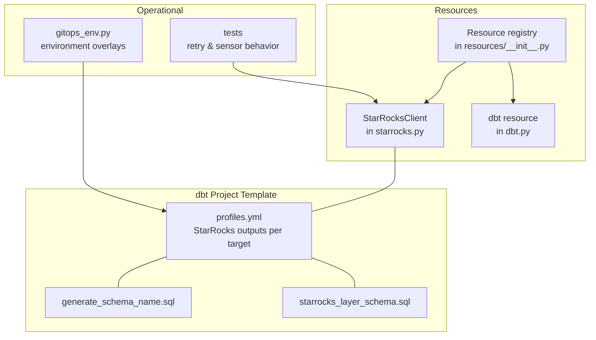
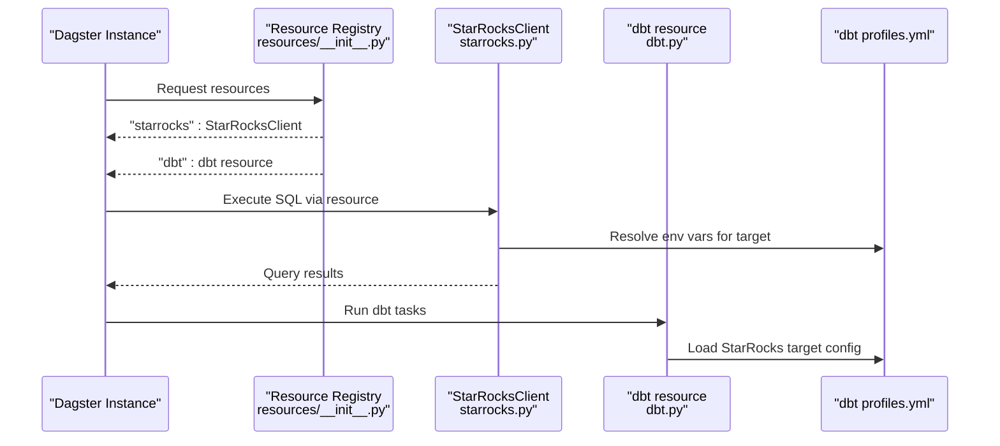
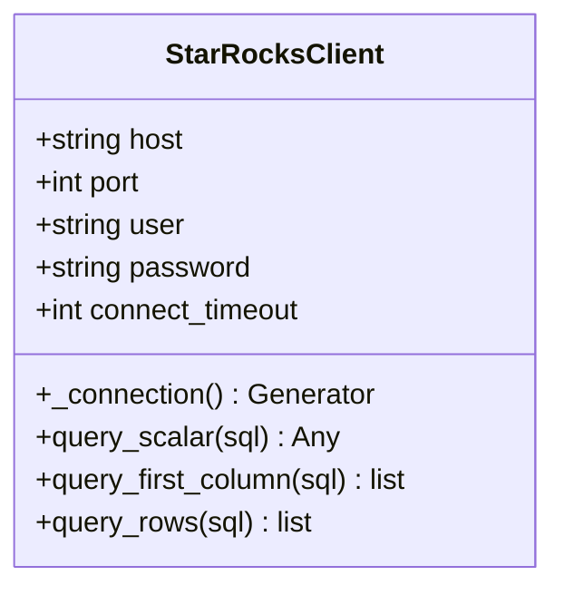
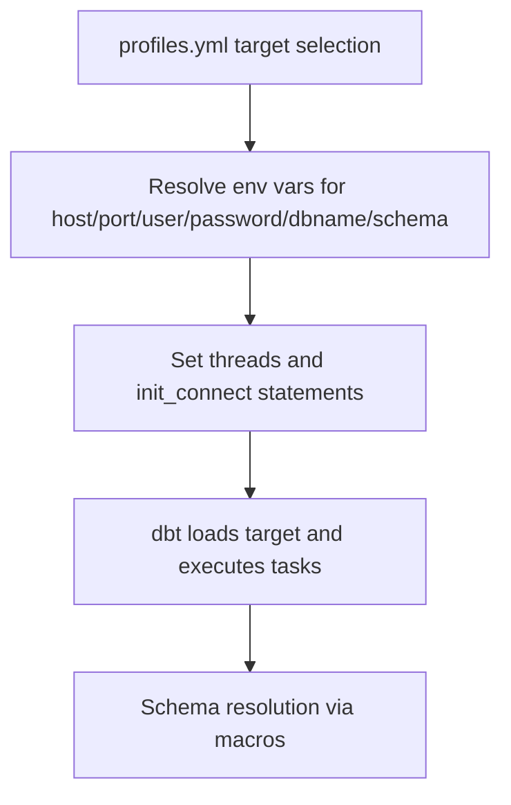
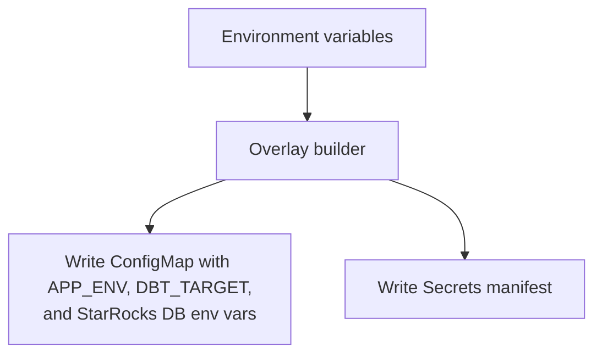
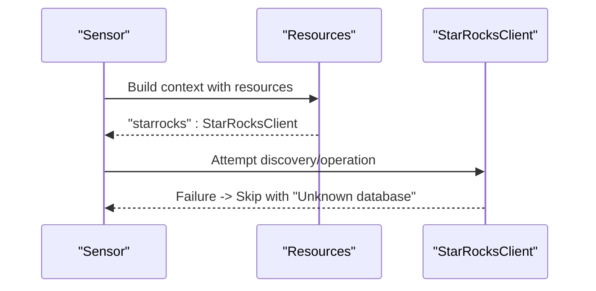
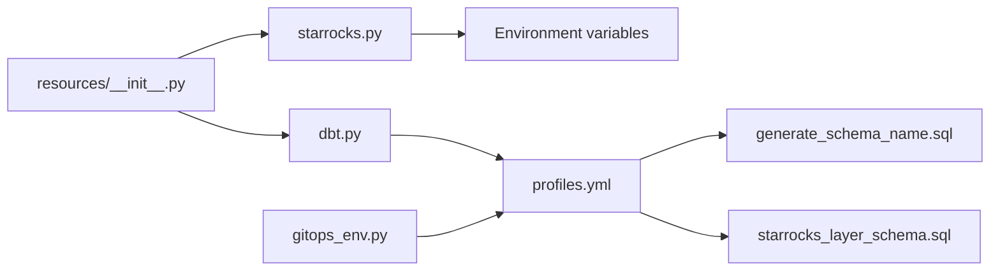

# Database Connections

<cite>
**Referenced Files in This Document**
- [starrocks.py](file://src/dbt_dagsterizer/resources/starrocks.py)
- [__init__.py](file://src/dbt_dagsterizer/resources/__init__.py)
- [profiles.yml](file://src/dbt_dagsterizer/project_templates/luban-dagster-dbt-starrocks-code-location-source-template/{{cookiecutter.output_name}}/dbt_project/profiles.yml)
- [starrocks_layer_schema.sql](file://src/dbt_dagsterizer/project_templates/luban-dagster-dbt-starrocks-code-location-source-template/{{cookiecutter.output_name}}/dbt_project/macros/dbt_dagsterizer/starrocks_layer_schema.sql)
- [generate_schema_name.sql](file://src/dbt_dagsterizer/project_templates/luban-dagster-dbt-starrocks-code-location-source-template/{{cookiecutter.output_name}}/dbt_project/macros/dbt_dagsterizer/generate_schema_name.sql)
- [dbt.py](file://src/dbt_dagsterizer/resources/dbt.py)
- [assets.py](file://src/dbt_dagsterizer/assets/dbt/assets.py)
- [gitops_env.py](file://src/dbt_dagsterizer/gitops_env.py)
- [test_assets_retry.py](file://tests/test_assets_retry.py)
- [test_partition_change_sensor_missing_relation.py](file://tests/test_partition_change_sensor_missing_relation.py)
</cite>

## Table of Contents
1. [Introduction](#introduction)
2. [Project Structure](#project-structure)
3. [Core Components](#core-components)
4. [Architecture Overview](#architecture-overview)
5. [Detailed Component Analysis](#detailed-component-analysis)
6. [Dependency Analysis](#dependency-analysis)
7. [Performance Considerations](#performance-considerations)
8. [Troubleshooting Guide](#troubleshooting-guide)
9. [Conclusion](#conclusion)

## Introduction
This document explains database connection management in dbt-dagsterizer with a focus on:
- dbt resource configuration and credential sourcing
- StarRocks integration and connection handling
- Environment-specific configuration and GitOps overlays
- Connection lifecycle, timeouts, and basic retry patterns
- Security considerations and operational best practices

It consolidates the repository’s actual implementation to help operators configure reliable, secure, and performant database connections across environments.

## Project Structure
The database connection surface spans a small set of focused modules:
- StarRocks client resource encapsulating connection creation and queries
- dbt resource wiring for dbt-core execution
- dbt profiles and schema generation macros for StarRocks targets
- GitOps helpers to propagate environment variables and secrets to deployment artifacts
- Tests validating retry behavior and sensor skip conditions

**Diagram sources**
- [starrocks.py:1-64](file://src/dbt_dagsterizer/resources/starrocks.py#L1-L64)
- [__init__.py:1-9](file://src/dbt_dagsterizer/resources/__init__.py#L1-L9)
- [dbt.py](file://src/dbt_dagsterizer/resources/dbt.py)
- [profiles.yml:1-47](file://src/dbt_dagsterizer/project_templates/luban-dagster-dbt-starrocks-code-location-source-template/{{cookiecutter.output_name}}/dbt_project/profiles.yml#L1-L47)
- [generate_schema_name.sql:1-22](file://src/dbt_dagsterizer/project_templates/luban-dagster-dbt-starrocks-code-location-source-template/{{cookiecutter.output_name}}/dbt_project/macros/dbt_dagsterizer/generate_schema_name.sql#L1-L22)
- [starrocks_layer_schema.sql:1-14](file://src/dbt_dagsterizer/project_templates/luban-dagster-dbt-starrocks-code-location-source-template/{{cookiecutter.output_name}}/dbt_project/macros/dbt_dagsterizer/starrocks_layer_schema.sql#L1-L14)
- [gitops_env.py:160-186](file://src/dbt_dagsterizer/gitops_env.py#L160-L186)
- [test_assets_retry.py:1-14](file://tests/test_assets_retry.py#L1-L14)
- [test_partition_change_sensor_missing_relation.py:46-65](file://tests/test_partition_change_sensor_missing_relation.py#L46-L65)

**Section sources**
- [starrocks.py:1-64](file://src/dbt_dagsterizer/resources/starrocks.py#L1-L64)
- [__init__.py:1-9](file://src/dbt_dagsterizer/resources/__init__.py#L1-L9)
- [profiles.yml:1-47](file://src/dbt_dagsterizer/project_templates/luban-dagster-dbt-starrocks-code-location-source-template/{{cookiecutter.output_name}}/dbt_project/profiles.yml#L1-L47)
- [generate_schema_name.sql:1-22](file://src/dbt_dagsterizer/project_templates/luban-dagster-dbt-starrocks-code-location-source-template/{{cookiecutter.output_name}}/dbt_project/macros/dbt_dagsterizer/generate_schema_name.sql#L1-L22)
- [starrocks_layer_schema.sql:1-14](file://src/dbt_dagsterizer/project_templates/luban-dagster-dbt-starrocks-code-location-source-template/{{cookiecutter.output_name}}/dbt_project/macros/dbt_dagsterizer/starrocks_layer_schema.sql#L1-L14)
- [gitops_env.py:160-186](file://src/dbt_dagsterizer/gitops_env.py#L160-L186)
- [test_assets_retry.py:1-14](file://tests/test_assets_retry.py#L1-L14)
- [test_partition_change_sensor_missing_relation.py:46-65](file://tests/test_partition_change_sensor_missing_relation.py#L46-L65)

## Core Components
- StarRocksClient: Provides a context-managed connection using a MySQL-compatible driver, executes scalar, column, and row queries, and sets timeouts for connect/read/write.
- Resource registry: Exposes “dbt” and “starrocks” resources for Dagster runs.
- dbt resource: Wires dbt-core execution into the Dagster environment.
- dbt profiles: Defines StarRocks outputs per target with environment-driven defaults and initialization statements.
- Schema macros: Control how dbt resolves schema/database names for StarRocks targets.
- GitOps overlays: Generates environment-specific configmaps/secrets for dbt and StarRocks settings.

Key implementation anchors:
- StarRocks connection and query methods
- Resource registration
- dbt profiles and schema overrides
- Environment variable propagation via GitOps

**Section sources**
- [starrocks.py:9-64](file://src/dbt_dagsterizer/resources/starrocks.py#L9-L64)
- [__init__.py:5-9](file://src/dbt_dagsterizer/resources/__init__.py#L5-L9)
- [dbt.py](file://src/dbt_dagsterizer/resources/dbt.py)
- [profiles.yml:1-47](file://src/dbt_dagsterizer/project_templates/luban-dagster-dbt-starrocks-code-location-source-template/{{cookiecutter.output_name}}/dbt_project/profiles.yml#L1-L47)
- [generate_schema_name.sql:1-22](file://src/dbt_dagsterizer/project_templates/luban-dagster-dbt-starrocks-code-location-source-template/{{cookiecutter.output_name}}/dbt_project/macros/dbt_dagsterizer/generate_schema_name.sql#L1-L22)
- [starrocks_layer_schema.sql:1-14](file://src/dbt_dagsterizer/project_templates/luban-dagster-dbt-starrocks-code-location-source-template/{{cookiecutter.output_name}}/dbt_project/macros/dbt_dagsterizer/starrocks_layer_schema.sql#L1-L14)
- [gitops_env.py:160-186](file://src/dbt_dagsterizer/gitops_env.py#L160-L186)

## Architecture Overview
The runtime connection pipeline integrates resource provisioning, dbt execution, and environment configuration:

**Diagram sources**
- [__init__.py:5-9](file://src/dbt_dagsterizer/resources/__init__.py#L5-L9)
- [starrocks.py:17-34](file://src/dbt_dagsterizer/resources/starrocks.py#L17-L34)
- [dbt.py](file://src/dbt_dagsterizer/resources/dbt.py)
- [profiles.yml:1-47](file://src/dbt_dagsterizer/project_templates/luban-dagster-dbt-starrocks-code-location-source-template/{{cookiecutter.output_name}}/dbt_project/profiles.yml#L1-L47)

## Detailed Component Analysis

### StarRocksClient: Connection and Query Execution
- Connection lifecycle: Uses a context manager to open and close a single connection per operation, ensuring cleanup.
- Driver and timeouts: Creates a MySQL-compatible connection with connect/read/write timeouts set to the same value.
- Query methods:
  - Scalar: returns a single cell value
  - First column: returns a list of first-column values
  - Rows: returns a list of tuples representing rows
- Credentials: Loaded from environment variables with safe defaults.

**Diagram sources**
- [starrocks.py:9-64](file://src/dbt_dagsterizer/resources/starrocks.py#L9-L64)

**Section sources**
- [starrocks.py:17-64](file://src/dbt_dagsterizer/resources/starrocks.py#L17-L64)

### Resource Registration and Access
- The registry exposes two primary resources: “dbt” and “starrocks,” enabling asset code to depend on either or both during execution.

**Section sources**
- [__init__.py:5-9](file://src/dbt_dagsterizer/resources/__init__.py#L5-L9)

### dbt Resource and Profiles
- dbt resource: Integrates dbt-core execution into the Dagster environment.
- profiles.yml: Defines StarRocks outputs for development, sandbox, and production targets. It:
  - Reads environment variables for host, port, user, password, dbname/schema, threads, and optional initialization statements.
  - Supports environment-driven thread counts and query-timeout tuning.
  - Uses a “use_pure” toggle for driver behavior.
- Schema macros:
  - generate_schema_name.sql: Overrides dbt’s default schema concatenation to avoid double database names in StarRocks.
  - starrocks_layer_schema.sql: Routes models to databases by layer (e.g., DWD/DWS) using environment variables.

**Diagram sources**
- [profiles.yml:1-47](file://src/dbt_dagsterizer/project_templates/luban-dagster-dbt-starrocks-code-location-source-template/{{cookiecutter.output_name}}/dbt_project/profiles.yml#L1-L47)
- [generate_schema_name.sql:1-22](file://src/dbt_dagsterizer/project_templates/luban-dagster-dbt-starrocks-code-location-source-template/{{cookiecutter.output_name}}/dbt_project/macros/dbt_dagsterizer/generate_schema_name.sql#L1-L22)
- [starrocks_layer_schema.sql:1-14](file://src/dbt_dagsterizer/project_templates/luban-dagster-dbt-starrocks-code-location-source-template/{{cookiecutter.output_name}}/dbt_project/macros/dbt_dagsterizer/starrocks_layer_schema.sql#L1-L14)

**Section sources**
- [dbt.py](file://src/dbt_dagsterizer/resources/dbt.py)
- [profiles.yml:1-47](file://src/dbt_dagsterizer/project_templates/luban-dagster-dbt-starrocks-code-location-source-template/{{cookiecutter.output_name}}/dbt_project/profiles.yml#L1-L47)
- [generate_schema_name.sql:1-22](file://src/dbt_dagsterizer/project_templates/luban-dagster-dbt-starrocks-code-location-source-template/{{cookiecutter.output_name}}/dbt_project/macros/dbt_dagsterizer/generate_schema_name.sql#L1-L22)
- [starrocks_layer_schema.sql:1-14](file://src/dbt_dagsterizer/project_templates/luban-dagster-dbt-starrocks-code-location-source-template/{{cookiecutter.output_name}}/dbt_project/macros/dbt_dagsterizer/starrocks_layer_schema.sql#L1-L14)

### Environment-Specific Configuration and GitOps Overlays
- GitOps overlay generator writes environment-specific configmaps and secrets for dbt targets and StarRocks databases.
- It replaces suffixes like dev/snd/prd and injects DBT_TARGET and StarRocks database environment variables into each environment’s artifact.

**Diagram sources**
- [gitops_env.py:160-186](file://src/dbt_dagsterizer/gitops_env.py#L160-L186)

**Section sources**
- [gitops_env.py:160-186](file://src/dbt_dagsterizer/gitops_env.py#L160-L186)

### Connection Validation and Sensor Behavior
- Sensor behavior: When a StarRocks resource is unavailable, sensors skip with a message indicating an “Unknown database.”
- Asset-level retry: Some dbt CLI errors are retried conditionally (e.g., “Table already exists”) to handle transient conditions.

**Diagram sources**
- [test_partition_change_sensor_missing_relation.py:46-65](file://tests/test_partition_change_sensor_missing_relation.py#L46-L65)
- [starrocks.py:17-34](file://src/dbt_dagsterizer/resources/starrocks.py#L17-L34)

**Section sources**
- [test_partition_change_sensor_missing_relation.py:46-65](file://tests/test_partition_change_sensor_missing_relation.py#L46-L65)
- [test_assets_retry.py:1-14](file://tests/test_assets_retry.py#L1-L14)

## Dependency Analysis
- Resource registry depends on individual resource factories.
- StarRocksClient depends on environment variables and a MySQL-compatible driver.
- dbt resource depends on dbt profiles for target configuration.
- Schema macros depend on environment variables and target schema.
- GitOps overlays depend on environment variable presence and suffix replacement logic.

**Diagram sources**
- [__init__.py:1-9](file://src/dbt_dagsterizer/resources/__init__.py#L1-L9)
- [starrocks.py:1-64](file://src/dbt_dagsterizer/resources/starrocks.py#L1-L64)
- [dbt.py](file://src/dbt_dagsterizer/resources/dbt.py)
- [profiles.yml:1-47](file://src/dbt_dagsterizer/project_templates/luban-dagster-dbt-starrocks-code-location-source-template/{{cookiecutter.output_name}}/dbt_project/profiles.yml#L1-L47)
- [generate_schema_name.sql:1-22](file://src/dbt_dagsterizer/project_templates/luban-dagster-dbt-starrocks-code-location-source-template/{{cookiecutter.output_name}}/dbt_project/macros/dbt_dagsterizer/generate_schema_name.sql#L1-L22)
- [starrocks_layer_schema.sql:1-14](file://src/dbt_dagsterizer/project_templates/luban-dagster-dbt-starrocks-code-location-source-template/{{cookiecutter.output_name}}/dbt_project/macros/dbt_dagsterizer/starrocks_layer_schema.sql#L1-L14)
- [gitops_env.py:160-186](file://src/dbt_dagsterizer/gitops_env.py#L160-L186)

**Section sources**
- [__init__.py:1-9](file://src/dbt_dagsterizer/resources/__init__.py#L1-L9)
- [starrocks.py:1-64](file://src/dbt_dagsterizer/resources/starrocks.py#L1-L64)
- [dbt.py](file://src/dbt_dagsterizer/resources/dbt.py)
- [profiles.yml:1-47](file://src/dbt_dagsterizer/project_templates/luban-dagster-dbt-starrocks-code-location-source-template/{{cookiecutter.output_name}}/dbt_project/profiles.yml#L1-L47)
- [generate_schema_name.sql:1-22](file://src/dbt_dagsterizer/project_templates/luban-dagster-dbt-starrocks-code-location-source-template/{{cookiecutter.output_name}}/dbt_project/macros/dbt_dagsterizer/generate_schema_name.sql#L1-L22)
- [starrocks_layer_schema.sql:1-14](file://src/dbt_dagsterizer/project_templates/luban-dagster-dbt-starrocks-code-location-source-template/{{cookiecutter.output_name}}/dbt_project/macros/dbt_dagsterizer/starrocks_layer_schema.sql#L1-L14)
- [gitops_env.py:160-186](file://src/dbt_dagsterizer/gitops_env.py#L160-L186)

## Performance Considerations
- Connection reuse: Current StarRocksClient opens/closes a connection per query. For high-throughput workloads, consider pooling or long-lived connections with health checks.
- Timeout alignment: Connect/read/write timeouts are uniform; tune per environment to match network latency and workload characteristics.
- Thread count: dbt thread settings are environment-driven; adjust per target to balance concurrency and resource limits.
- Initialization statements: Use init_connect to set planner/query timeouts appropriate for your environment.
- Schema resolution: Avoid unnecessary schema concatenation by leveraging the provided macros to prevent invalid database names.

[No sources needed since this section provides general guidance]

## Troubleshooting Guide
- Unknown database in sensors: Indicates the StarRocks resource could not establish a connection or the target database is unreachable. Verify credentials and connectivity.
- Transient dbt failures: Certain dbt CLI errors are retried once to mitigate transient conditions; confirm logs for repeated failures.
- Environment mismatch: Ensure DBT_TARGET and StarRocks database environment variables are correctly set in the deployment environment.
- Schema naming anomalies: Confirm schema macros are applied so dbt does not concatenate target and custom schema names.

**Section sources**
- [test_partition_change_sensor_missing_relation.py:46-65](file://tests/test_partition_change_sensor_missing_relation.py#L46-L65)
- [test_assets_retry.py:1-14](file://tests/test_assets_retry.py#L1-L14)
- [profiles.yml:1-47](file://src/dbt_dagsterizer/project_templates/luban-dagster-dbt-starrocks-code-location-source-template/{{cookiecutter.output_name}}/dbt_project/profiles.yml#L1-L47)
- [generate_schema_name.sql:1-22](file://src/dbt_dagsterizer/project_templates/luban-dagster-dbt-starrocks-code-location-source-template/{{cookiecutter.output_name}}/dbt_project/macros/dbt_dagsterizer/generate_schema_name.sql#L1-L22)

## Conclusion
dbt-dagsterizer’s database connection management centers on:
- A minimal, context-managed StarRocks client with environment-driven credentials
- dbt profiles and schema macros tailored for StarRocks
- GitOps overlays for environment-specific configuration
- Basic retry logic for select dbt operations and sensor skip behavior for connectivity issues

Adopt environment-driven timeouts, thread counts, and initialization settings to optimize performance per environment. For production, evaluate connection pooling and health checks to improve reliability under load.