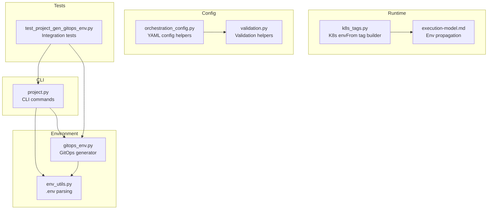
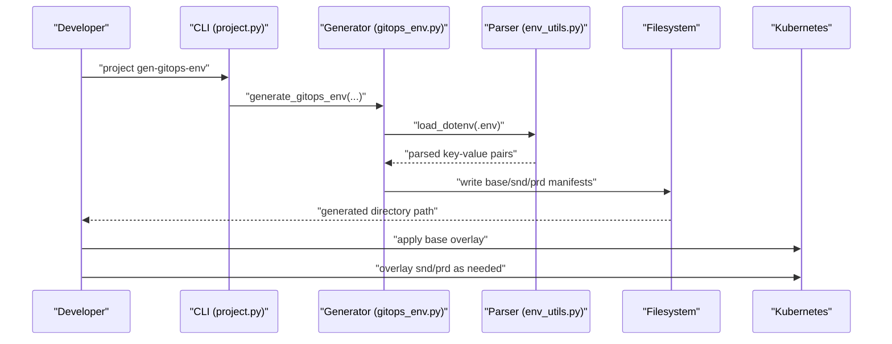
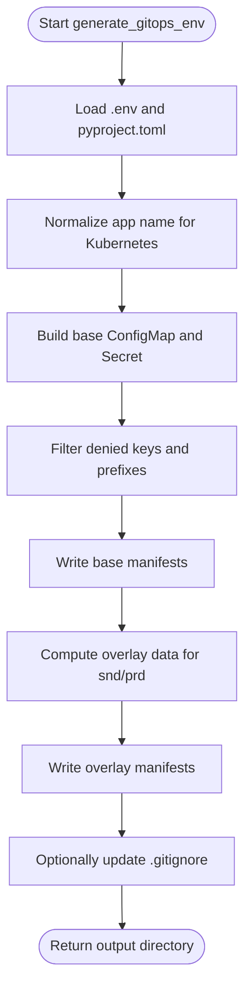
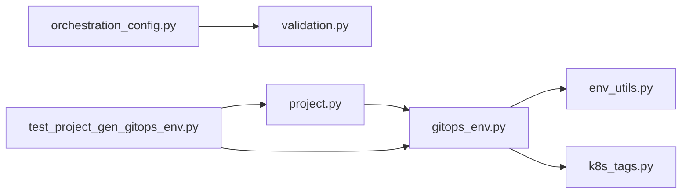

# GitOps Environment Management

<cite>
**Referenced Files in This Document**
- [gitops_env.py](file://src/dbt_dagsterizer/gitops_env.py)
- [env_utils.py](file://src/dbt_dagsterizer/env_utils.py)
- [project.py](file://src/dbt_dagsterizer/cli_parts/project.py)
- [k8s_tags.py](file://src/dbt_dagsterizer/k8s_tags.py)
- [execution-model.md](file://docs/concepts/execution-model.md)
- [test_project_gen_gitops_env.py](file://tests/test_project_gen_gitops_env.py)
- [orchestration_config.py](file://src/dbt_dagsterizer/orchestration_config.py)
- [validation.py](file://src/dbt_dagsterizer/cli_parts/validation.py)
</cite>

## Table of Contents
1. [Introduction](#introduction)
2. [Project Structure](#project-structure)
3. [Core Components](#core-components)
4. [Architecture Overview](#architecture-overview)
5. [Detailed Component Analysis](#detailed-component-analysis)
6. [Dependency Analysis](#dependency-analysis)
7. [Performance Considerations](#performance-considerations)
8. [Troubleshooting Guide](#troubleshooting-guide)
9. [Conclusion](#conclusion)
10. [Appendices](#appendices)

## Introduction
This document explains GitOps environment management in dbt-dagsterizer. It covers how environment configuration is propagated from source-of-truth files into Kubernetes manifests, how the CLI integrates with GitOps workflows, and how infrastructure-as-code patterns are applied to manage multiple environments. It also documents environment variable handling across stages, configuration drift prevention, automated rollout strategies, CI/CD integration, environment-specific settings, validation, templates, environment switching, rollbacks, and security considerations for credentials.

## Project Structure
The GitOps environment management spans several modules:
- CLI command group for project operations, including generation of GitOps artifacts
- Environment parsing utilities for .env files
- GitOps artifact generator that produces Kustomize-compatible manifests
- Kubernetes tagging utilities for run pod environment injection
- Execution model documentation describing environment propagation
- Orchestration configuration utilities supporting validation and persistence
- Tests validating the generated GitOps tree and environment overlays

**Diagram sources**
- [project.py:106-307](file://src/dbt_dagsterizer/cli_parts/project.py#L106-L307)
- [env_utils.py:1-78](file://src/dbt_dagsterizer/env_utils.py#L1-L78)
- [gitops_env.py:104-197](file://src/dbt_dagsterizer/gitops_env.py#L104-L197)
- [k8s_tags.py:10-36](file://src/dbt_dagsterizer/k8s_tags.py#L10-L36)
- [execution-model.md:34-58](file://docs/concepts/execution-model.md#L34-L58)
- [orchestration_config.py:19-83](file://src/dbt_dagsterizer/orchestration_config.py#L19-L83)
- [validation.py:275-310](file://src/dbt_dagsterizer/cli_parts/validation.py#L275-L310)
- [test_project_gen_gitops_env.py:10-81](file://tests/test_project_gen_gitops_env.py#L10-L81)

**Section sources**
- [project.py:106-307](file://src/dbt_dagsterizer/cli_parts/project.py#L106-L307)
- [gitops_env.py:104-197](file://src/dbt_dagsterizer/gitops_env.py#L104-L197)
- [env_utils.py:1-78](file://src/dbt_dagsterizer/env_utils.py#L1-L78)
- [k8s_tags.py:10-36](file://src/dbt_dagsterizer/k8s_tags.py#L10-L36)
- [execution-model.md:34-58](file://docs/concepts/execution-model.md#L34-L58)
- [orchestration_config.py:19-83](file://src/dbt_dagsterizer/orchestration_config.py#L19-L83)
- [validation.py:275-310](file://src/dbt_dagsterizer/cli_parts/validation.py#L275-L310)
- [test_project_gen_gitops_env.py:10-81](file://tests/test_project_gen_gitops_env.py#L10-L81)

## Core Components
- GitOps environment generator: Produces Kustomize-compatible manifests for base and overlays (snd/prd), normalizes app names for Kubernetes, filters sensitive and disallowed keys, writes ConfigMaps and Secrets, and optionally updates .gitignore.
- Environment utilities: Parse .env files, compute overrides for dbt projects, and temporarily override environment variables.
- CLI integration: Exposes project init and gen-gitops-env commands, wiring into the generator and environment parsing.
- Kubernetes runtime environment injection: Builds a tag to inject envFrom from ConfigMap/Secret into run pods via the code location Deployment.
- Execution model: Documents how environment variables propagate to sensors/schedules and run pods.
- Orchestration configuration: Loads, validates, and persists orchestration metadata (jobs, schedules, partition change).
- Tests: Validate the generated GitOps tree, overlay values, and .gitignore updates.

**Section sources**
- [gitops_env.py:104-197](file://src/dbt_dagsterizer/gitops_env.py#L104-L197)
- [env_utils.py:8-78](file://src/dbt_dagsterizer/env_utils.py#L8-L78)
- [project.py:262-306](file://src/dbt_dagsterizer/cli_parts/project.py#L262-L306)
- [k8s_tags.py:10-36](file://src/dbt_dagsterizer/k8s_tags.py#L10-L36)
- [execution-model.md:34-58](file://docs/concepts/execution-model.md#L34-L58)
- [orchestration_config.py:19-83](file://src/dbt_dagsterizer/orchestration_config.py#L19-L83)
- [test_project_gen_gitops_env.py:10-81](file://tests/test_project_gen_gitops_env.py#L10-L81)

## Architecture Overview
The GitOps environment management architecture centers on generating declarative Kubernetes manifests from a single source of truth (.env) and project metadata (pyproject.toml). The CLI orchestrates the process, environment parsing ensures only safe variables are propagated, and Kubernetes tagging enables secure run-time injection.

**Diagram sources**
- [project.py:280-306](file://src/dbt_dagsterizer/cli_parts/project.py#L280-L306)
- [gitops_env.py:104-197](file://src/dbt_dagsterizer/gitops_env.py#L104-L197)
- [env_utils.py:8-37](file://src/dbt_dagsterizer/env_utils.py#L8-L37)

## Detailed Component Analysis

### GitOps Environment Generator
The generator reads project metadata and environment variables, normalizes names for Kubernetes, filters sensitive keys, and writes three-layer Kustomize manifests:
- Base: shared configuration plus a Secret placeholder for credentials
- Overlays: environment-specific ConfigMaps and Secret placeholders
- Optional .gitignore updates to exclude the output directory

Key behaviors:
- Name normalization enforces Kubernetes naming rules
- Sensitive keys and OTEL_ prefixed keys are excluded from base ConfigMap
- Overlay data sets APP_ENV and DBT_TARGET, and transforms database schema suffixes
- Secret placeholders are written for STARROCKS_PASSWORD in base and overlays

**Diagram sources**
- [gitops_env.py:104-197](file://src/dbt_dagsterizer/gitops_env.py#L104-L197)

**Section sources**
- [gitops_env.py:14-28](file://src/dbt_dagsterizer/gitops_env.py#L14-L28)
- [gitops_env.py:31-47](file://src/dbt_dagsterizer/gitops_env.py#L31-L47)
- [gitops_env.py:50-54](file://src/dbt_dagsterizer/gitops_env.py#L50-L54)
- [gitops_env.py:57-84](file://src/dbt_dagsterizer/gitops_env.py#L57-L84)
- [gitops_env.py:104-197](file://src/dbt_dagsterizer/gitops_env.py#L104-L197)

### Environment Utilities
Environment utilities support:
- Parsing .env files with export and quoted value handling
- Computing dbt project .env overrides while respecting existing environment variables
- Temporarily overriding environment variables for controlled operations

These utilities underpin safe propagation of environment variables into generated manifests and runtime execution contexts.

**Section sources**
- [env_utils.py:8-37](file://src/dbt_dagsterizer/env_utils.py#L8-L37)
- [env_utils.py:44-48](file://src/dbt_dagsterizer/env_utils.py#L44-L48)
- [env_utils.py:61-77](file://src/dbt_dagsterizer/env_utils.py#L61-L77)

### CLI Integration
The CLI exposes:
- project init: renders project templates with environment defaults and optional Docker inclusion
- project gen-gitops-env: generates GitOps manifests from .env and pyproject.toml, with options for overwrite and .gitignore updates

Error handling wraps missing files, existing output directories, and invalid values.

**Section sources**
- [project.py:168-261](file://src/dbt_dagsterizer/cli_parts/project.py#L168-L261)
- [project.py:280-306](file://src/dbt_dagsterizer/cli_parts/project.py#L280-L306)

### Kubernetes Runtime Environment Injection
The Kubernetes tagging utility builds a tag value that instructs Dagster to inject envFrom from a ConfigMap and/or Secret into run pods. This complements code location envFrom for evaluation-time code and ensures credentials reach execution-time assets/ops.

**Section sources**
- [k8s_tags.py:10-36](file://src/dbt_dagsterizer/k8s_tags.py#L10-L36)
- [execution-model.md:34-58](file://docs/concepts/execution-model.md#L34-L58)

### Orchestration Configuration and Validation
Orchestration configuration utilities:
- Load and normalize orchestration metadata (jobs, schedules, partition change)
- Persist with preserved formatting and indentation
- Validation helpers ensure structural correctness and cross-references against derived job names

**Section sources**
- [orchestration_config.py:19-83](file://src/dbt_dagsterizer/orchestration_config.py#L19-L83)
- [validation.py:275-310](file://src/dbt_dagsterizer/cli_parts/validation.py#L275-L310)

## Dependency Analysis
The following diagram shows module-level dependencies among the core GitOps components.

**Diagram sources**
- [project.py:11](file://src/dbt_dagsterizer/cli_parts/project.py#L11)
- [gitops_env.py:14-28](file://src/dbt_dagsterizer/gitops_env.py#L14-L28)
- [env_utils.py:8-37](file://src/dbt_dagsterizer/env_utils.py#L8-L37)
- [k8s_tags.py:10-36](file://src/dbt_dagsterizer/k8s_tags.py#L10-L36)
- [orchestration_config.py:19-83](file://src/dbt_dagsterizer/orchestration_config.py#L19-L83)
- [validation.py:275-310](file://src/dbt_dagsterizer/cli_parts/validation.py#L275-L310)
- [test_project_gen_gitops_env.py:7](file://tests/test_project_gen_gitops_env.py#L7)

**Section sources**
- [project.py:11](file://src/dbt_dagsterizer/cli_parts/project.py#L11)
- [gitops_env.py:14-28](file://src/dbt_dagsterizer/gitops_env.py#L14-L28)
- [env_utils.py:8-37](file://src/dbt_dagsterizer/env_utils.py#L8-L37)
- [k8s_tags.py:10-36](file://src/dbt_dagsterizer/k8s_tags.py#L10-L36)
- [orchestration_config.py:19-83](file://src/dbt_dagsterizer/orchestration_config.py#L19-L83)
- [validation.py:275-310](file://src/dbt_dagsterizer/cli_parts/validation.py#L275-L310)
- [test_project_gen_gitops_env.py:7](file://tests/test_project_gen_gitops_env.py#L7)

## Performance Considerations
- Manifest generation is I/O bound; keep .env files minimal and avoid unnecessary entries to reduce write volume.
- Name normalization and regex checks are linear in input size; typical .env sizes pose negligible overhead.
- Using overlays avoids duplicating large ConfigMaps; only environment-specific keys should differ across overlays.
- Prefer incremental updates to .gitignore to minimize filesystem churn.

## Troubleshooting Guide
Common issues and resolutions:
- Missing pyproject.toml: Generation requires a valid project name; ensure the file exists and contains the project name.
- Existing output directory: Use overwrite flag or change output directory.
- Invalid Kubernetes name: App name normalization enforces Kubernetes naming; adjust project name accordingly.
- Denied keys present in .env: Keys like OTEL_ and specific deny-listed keys are filtered; remove or rename them.
- DBT_TARGET not set: Overlay logic depends on DBT_TARGET presence; define it in .env if needed.
- .gitignore not updated: Enable update-gitignore option or manually add the output directory.

Validation and tests:
- Integration tests verify base and overlay manifests, denied keys filtering, and .gitignore updates.

**Section sources**
- [gitops_env.py:116-117](file://src/dbt_dagsterizer/gitops_env.py#L116-L117)
- [gitops_env.py:125-126](file://src/dbt_dagsterizer/gitops_env.py#L125-L126)
- [gitops_env.py:140-147](file://src/dbt_dagsterizer/gitops_env.py#L140-L147)
- [gitops_env.py:162-163](file://src/dbt_dagsterizer/gitops_env.py#L162-L163)
- [test_project_gen_gitops_env.py:14-44](file://tests/test_project_gen_gitops_env.py#L14-L44)

## Conclusion
dbt-dagsterizer’s GitOps environment management provides a robust, declarative approach to multi-environment configuration. By centralizing environment variables in .env and deriving Kubernetes manifests from a single source of truth, teams can prevent configuration drift, automate rollouts via overlays, and maintain strict separation of concerns between evaluation-time and execution-time environments. The included CLI, validation, and tests streamline adoption and ensure reliability across CI/CD pipelines.

## Appendices

### GitOps Workflow Integration with CI/CD
- Source of truth: Keep .env and pyproject.toml in version control; treat generated manifests as output.
- CI steps:
  - Initialize project (optional) and generate GitOps environment
  - Validate generated manifests and overlays
  - Apply base, then overlay for target environment
- Drift prevention: Treat generated directory as non-interactive; regenerate on changes to .env or project metadata.
- Rollout strategy: Use overlays to stage changes; promote snd to prd by applying the prd overlay.

### Environment-Specific Settings and Switching
- Base overlay: Shared configuration and credential placeholders
- snd overlay: Sets APP_ENV to snd and DBT_TARGET to sandbox; transforms schema suffixes
- prd overlay: Sets APP_ENV to prd and DBT_TARGET to production; transforms schema suffixes
- Environment switching: Apply base, then the desired overlay; secrets remain as placeholders to be filled by cluster operators.

### Deployment Validation
- Validate orchestration configuration before applying manifests
- Confirm denied keys are absent and overlay values match expectations
- Verify .gitignore contains the output directory to prevent accidental commits

### Security Considerations
- Do not commit secrets; use Secret placeholders and inject at cluster level
- Filter sensitive keys and OTEL_ prefixes from base ConfigMap
- Separate code location envFrom (evaluation-time) from run pod env injection (execution-time) as documented
- Enforce least privilege for cluster credentials and limit access to overlay applications