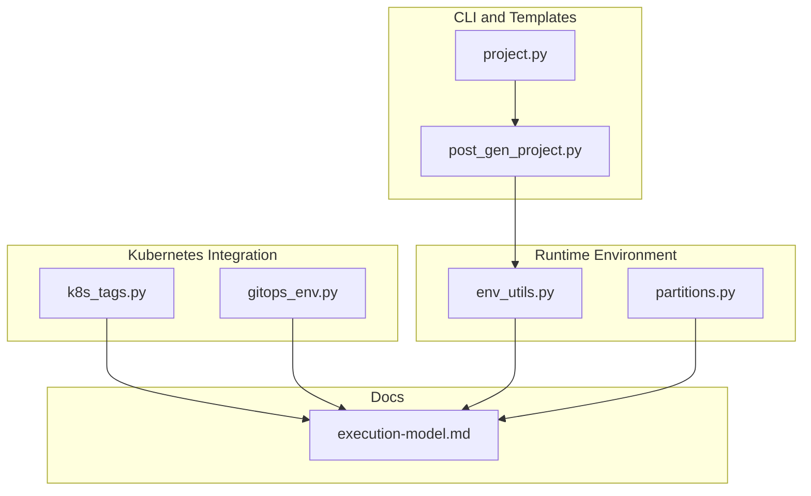
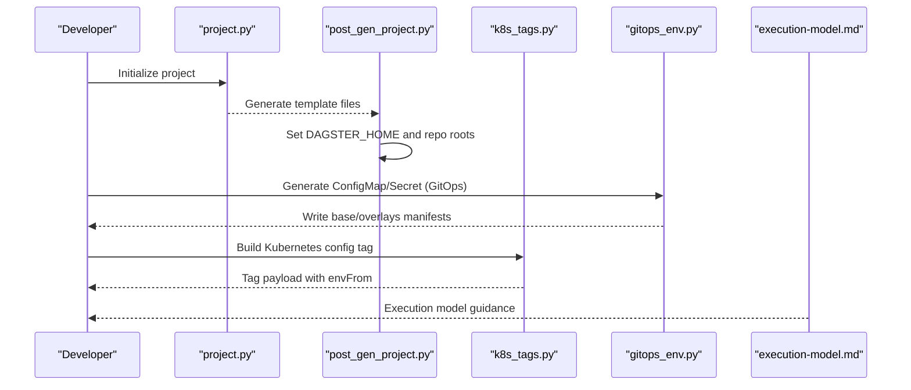
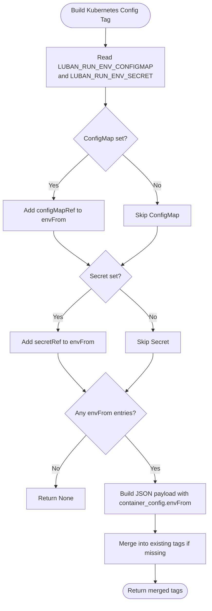
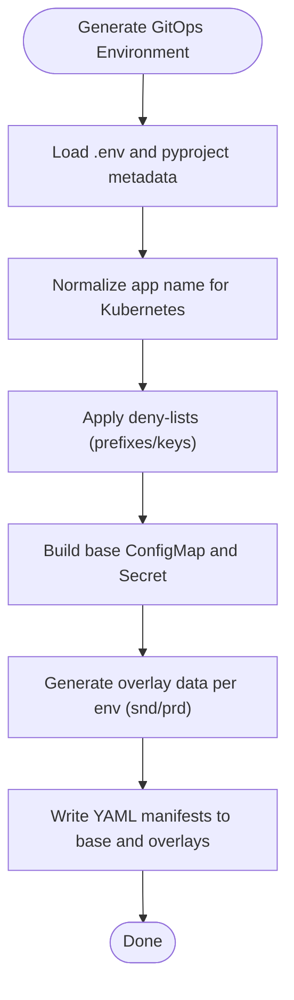
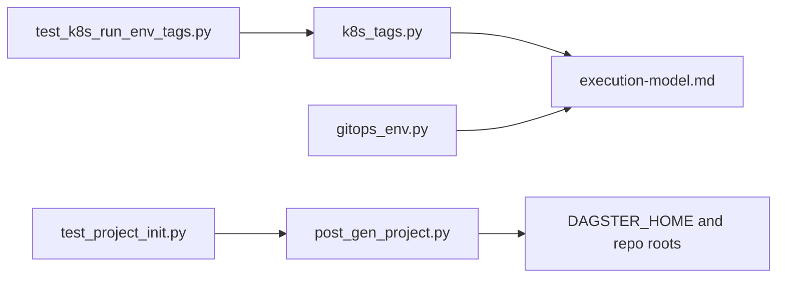

# Kubernetes Integration

<cite>
**Referenced Files in This Document**
- [k8s_tags.py](file://src/dbt_dagsterizer/k8s_tags.py)
- [gitops_env.py](file://src/dbt_dagsterizer/gitops_env.py)
- [execution-model.md](file://docs/concepts/execution-model.md)
- [project.py](file://src/dbt_dagsterizer/cli_parts/project.py)
- [post_gen_project.py](file://src/dbt_dagsterizer/project_templates/luban-dagster-dbt-starrocks-code-location-source-template/hooks/post_gen_project.py)
- [test_k8s_run_env_tags.py](file://tests/test_k8s_run_env_tags.py)
- [test_project_init.py](file://tests/test_project_init.py)
- [env_utils.py](file://src/dbt_dagsterizer/env_utils.py)
- [partitions.py](file://src/dbt_dagsterizer/partitions.py)
</cite>

## Table of Contents
1. [Introduction](#introduction)
2. [Project Structure](#project-structure)
3. [Core Components](#core-components)
4. [Architecture Overview](#architecture-overview)
5. [Detailed Component Analysis](#detailed-component-analysis)
6. [Dependency Analysis](#dependency-analysis)
7. [Performance Considerations](#performance-considerations)
8. [Troubleshooting Guide](#troubleshooting-guide)
9. [Conclusion](#conclusion)
10. [Appendices](#appendices)

## Introduction
This document explains how dbt-dagsterizer integrates with Kubernetes to run dbt jobs securely and reliably. It covers environment variable injection for dbt runs, including DAGSTER_HOME configuration and runtime environment setup. It also documents job-level tagging strategies, pod configuration options, resource allocation patterns, Kubernetes-specific environment variables, namespace management, and deployment annotations. Container image requirements, volume mounting for dbt projects, and secret management are included, along with examples of custom Kubernetes configurations, resource quotas, and security contexts. Monitoring integration, logging configuration, and health check implementations are addressed for robust deployments.

## Project Structure
The Kubernetes integration spans several modules:
- Environment injection and tagging for Kubernetes runs
- GitOps-based generation of ConfigMaps and Secrets
- CLI helpers for project initialization and environment defaults
- Template hooks that set DAGSTER_HOME and repository roots
- Tests validating Kubernetes environment tag injection and project initialization defaults

**Diagram sources**
- [project.py:1-48](file://src/dbt_dagsterizer/cli_parts/project.py#L1-L48)
- [post_gen_project.py:75-81](file://src/dbt_dagsterizer/project_templates/luban-dagster-dbt-starrocks-code-location-source-template/hooks/post_gen_project.py#L75-L81)
- [k8s_tags.py:1-36](file://src/dbt_dagsterizer/k8s_tags.py#L1-L36)
- [gitops_env.py:104-160](file://src/dbt_dagsterizer/gitops_env.py#L104-L160)
- [env_utils.py](file://src/dbt_dagsterizer/env_utils.py)
- [partitions.py:1-20](file://src/dbt_dagsterizer/partitions.py#L1-L20)
- [execution-model.md:1-32](file://docs/concepts/execution-model.md#L1-L32)

**Section sources**
- [project.py:1-48](file://src/dbt_dagsterizer/cli_parts/project.py#L1-L48)
- [post_gen_project.py:75-81](file://src/dbt_dagsterizer/project_templates/luban-dagster-dbt-starrocks-code-location-source-template/hooks/post_gen_project.py#L75-L81)
- [k8s_tags.py:1-36](file://src/dbt_dagsterizer/k8s_tags.py#L1-L36)
- [gitops_env.py:104-160](file://src/dbt_dagsterizer/gitops_env.py#L104-L160)
- [execution-model.md:1-32](file://docs/concepts/execution-model.md#L1-L32)

## Core Components
- Kubernetes environment injection via tags: The module builds a Kubernetes configuration tag that injects environment variables from a ConfigMap and/or Secret into the run pod.
- GitOps environment generation: Generates ConfigMap and Secret manifests for base and overlay environments, normalizes Kubernetes resource names, and filters sensitive or disallowed keys.
- Execution model guidance: Clarifies where code runs (daemon, code-server, and run pods) and where credentials must be available.
- Project initialization defaults: Ensures DAGSTER_HOME and repository root environment variables are set during project initialization and template generation.

Key responsibilities:
- Build Kubernetes config tag for envFrom injection
- Generate ConfigMap and Secret YAML for GitOps
- Normalize Kubernetes resource names
- Enforce environment variable filtering and deny-lists
- Provide execution model guidance for credential placement

**Section sources**
- [k8s_tags.py:10-36](file://src/dbt_dagsterizer/k8s_tags.py#L10-L36)
- [gitops_env.py:104-160](file://src/dbt_dagsterizer/gitops_env.py#L104-L160)
- [execution-model.md:1-32](file://docs/concepts/execution-model.md#L1-L32)
- [post_gen_project.py:75-81](file://src/dbt_dagsterizer/project_templates/luban-dagster-dbt-starrocks-code-location-source-template/hooks/post_gen_project.py#L75-L81)

## Architecture Overview
The Kubernetes integration centers on injecting environment variables into run pods via a Dagster tag and generating GitOps artifacts for credentials.

**Diagram sources**
- [project.py:1-48](file://src/dbt_dagsterizer/cli_parts/project.py#L1-L48)
- [post_gen_project.py:75-81](file://src/dbt_dagsterizer/project_templates/luban-dagster-dbt-starrocks-code-location-source-template/hooks/post_gen_project.py#L75-L81)
- [k8s_tags.py:10-36](file://src/dbt_dagsterizer/k8s_tags.py#L10-L36)
- [gitops_env.py:104-160](file://src/dbt_dagsterizer/gitops_env.py#L104-L160)
- [execution-model.md:1-32](file://docs/concepts/execution-model.md#L1-L32)

## Detailed Component Analysis

### Kubernetes Environment Injection via Tags
Purpose:
- Inject environment variables into run pods using a Dagster tag that encodes container configuration with envFrom entries referencing a ConfigMap and/or Secret.

Behavior:
- Reads LUBAN_RUN_ENV_CONFIGMAP and LUBAN_RUN_ENV_SECRET environment variables.
- Builds a JSON payload under a specific tag key containing container_config.envFrom entries.
- Merges the tag into existing tags without overriding an existing Kubernetes config tag.
- Returns None if neither ConfigMap nor Secret is specified.

**Diagram sources**
- [k8s_tags.py:10-36](file://src/dbt_dagsterizer/k8s_tags.py#L10-L36)

**Section sources**
- [k8s_tags.py:10-36](file://src/dbt_dagsterizer/k8s_tags.py#L10-L36)
- [test_k8s_run_env_tags.py:38-72](file://tests/test_k8s_run_env_tags.py#L38-L72)

### GitOps Environment Generation (ConfigMap and Secret)
Purpose:
- Generate Kubernetes manifests for base and environment overlays (snd/prd) with normalized resource names.

Key steps:
- Normalize application name to a Kubernetes-compatible name.
- Load environment variables from a .env file.
- Define denied prefixes and keys (e.g., OTEL_, specific environment variables).
- Build base ConfigMap with allowed keys and set DAGSTER_HOME.
- Build base Secret with predefined keys (e.g., STARROCKS_PASSWORD).
- Generate overlay data per environment and write manifests.

**Diagram sources**
- [gitops_env.py:104-160](file://src/dbt_dagsterizer/gitops_env.py#L104-L160)

**Section sources**
- [gitops_env.py:104-160](file://src/dbt_dagsterizer/gitops_env.py#L104-L160)

### Execution Model Guidance (Where Credentials Are Needed)
Purpose:
- Clarify where code runs and where credentials must be available.

Highlights:
- Daemon (control plane): Orchestrator; credentials not required here.
- Code location (dagster code-server): Evaluates sensors/schedules; credentials required here.
- Run pods (job execution): Separate pods launched by K8sRunLauncher; credentials required here.

Implications:
- Ensure credentials are available in both code-server and run pods when accessing the same external systems.

**Section sources**
- [execution-model.md:1-32](file://docs/concepts/execution-model.md#L1-L32)

### Project Initialization Defaults (DAGSTER_HOME and Repo Roots)
Purpose:
- Establish environment defaults during project initialization and template generation.

Actions:
- Set DAGSTER_HOME to a dedicated directory within the project.
- Set repository root and dbt project/profile directories.
- Ensure environment variables are written into the generated .env.example and template hooks.

Validation:
- Tests confirm DAGSTER_HOME and repository root defaults are present after project initialization.

**Section sources**
- [post_gen_project.py:75-81](file://src/dbt_dagsterizer/project_templates/luban-dagster-dbt-starrocks-code-location-source-template/hooks/post_gen_project.py#L75-L81)
- [test_project_init.py:38-54](file://tests/test_project_init.py#L38-L54)

### Additional Runtime Environment Variables
- Daily partitions start date: Used to configure partition definitions when using daily partitions.
- Environment utilities: Provide helpers for environment loading and validation.

**Section sources**
- [partitions.py:10-20](file://src/dbt_dagsterizer/partitions.py#L10-L20)
- [env_utils.py](file://src/dbt_dagsterizer/env_utils.py)

## Dependency Analysis
Relationships among Kubernetes integration components:

**Diagram sources**
- [k8s_tags.py:10-36](file://src/dbt_dagsterizer/k8s_tags.py#L10-L36)
- [gitops_env.py:104-160](file://src/dbt_dagsterizer/gitops_env.py#L104-L160)
- [execution-model.md:1-32](file://docs/concepts/execution-model.md#L1-L32)
- [post_gen_project.py:75-81](file://src/dbt_dagsterizer/project_templates/luban-dagster-dbt-starrocks-code-location-source-template/hooks/post_gen_project.py#L75-L81)
- [test_k8s_run_env_tags.py:38-72](file://tests/test_k8s_run_env_tags.py#L38-L72)
- [test_project_init.py:38-54](file://tests/test_project_init.py#L38-L54)

**Section sources**
- [k8s_tags.py:10-36](file://src/dbt_dagsterizer/k8s_tags.py#L10-L36)
- [gitops_env.py:104-160](file://src/dbt_dagsterizer/gitops_env.py#L104-L160)
- [execution-model.md:1-32](file://docs/concepts/execution-model.md#L1-L32)
- [post_gen_project.py:75-81](file://src/dbt_dagsterizer/project_templates/luban-dagster-dbt-starrocks-code-location-source-template/hooks/post_gen_project.py#L75-L81)
- [test_k8s_run_env_tags.py:38-72](file://tests/test_k8s_run_env_tags.py#L38-L72)
- [test_project_init.py:38-54](file://tests/test_project_init.py#L38-L54)

## Performance Considerations
- Limit unnecessary environment variables in ConfigMaps to reduce pod startup overhead.
- Prefer Secrets for sensitive data to avoid accidental exposure in logs or ConfigMaps.
- Use targeted envFrom references to minimize redundant environment propagation.
- Keep DAGSTER_HOME and repository root paths stable to avoid repeated filesystem checks.

## Troubleshooting Guide
Common issues and resolutions:
- Missing Kubernetes config tag: Ensure LUBAN_RUN_ENV_CONFIGMAP or LUBAN_RUN_ENV_SECRET is set; otherwise, no injection occurs.
- Existing Kubernetes config tag override: The tag builder avoids overriding an existing Kubernetes config tag; remove or adjust the tag if conflicts arise.
- Invalid Kubernetes resource names: Names are normalized; verify that the derived names match Kubernetes naming rules.
- Denied environment variables: Certain prefixes and keys are filtered out; confirm credentials are placed in allowed keys or overlays.
- Credential placement: If external systems are accessed from both code-server and run pods, ensure credentials are available in both environments.

Validation references:
- Tag injection tests demonstrate behavior when variables are set/unset and when existing tags are present.
- Project initialization tests confirm DAGSTER_HOME and repository root defaults.

**Section sources**
- [test_k8s_run_env_tags.py:38-72](file://tests/test_k8s_run_env_tags.py#L38-L72)
- [test_project_init.py:38-54](file://tests/test_project_init.py#L38-L54)

## Conclusion
dbt-dagsterizer provides a cohesive Kubernetes integration strategy:
- Use Kubernetes config tags to inject environment variables into run pods via envFrom.
- Generate ConfigMap and Secret manifests through GitOps for secure, environment-aware deployments.
- Align credential placement with the execution model: code-server and run pods require credentials when accessing shared external systems.
- Establish environment defaults (DAGSTER_HOME, repository roots) during project initialization.
- Apply deny-lists and normalization to maintain safe and compliant Kubernetes resource definitions.

## Appendices

### Kubernetes-Specific Environment Variables
- LUBAN_RUN_ENV_CONFIGMAP: Name of the ConfigMap to inject into run pods.
- LUBAN_RUN_ENV_SECRET: Name of the Secret to inject into run pods.
- DAGSTER_HOME: Directory for Dagster storage and configuration.
- LUBAN_REPO_ROOT: Root of the repository for dbt and project resolution.
- DAGSTER_DAILY_PARTITIONS_START_DATE: Required when using daily partitions.

**Section sources**
- [k8s_tags.py:10-23](file://src/dbt_dagsterizer/k8s_tags.py#L10-L23)
- [post_gen_project.py:75-81](file://src/dbt_dagsterizer/project_templates/luban-dagster-dbt-starrocks-code-location-source-template/hooks/post_gen_project.py#L75-L81)
- [partitions.py:10-20](file://src/dbt_dagsterizer/partitions.py#L10-L20)

### Namespace Management and Resource Naming
- Application name normalization ensures Kubernetes compatibility.
- Base and overlay directories are organized for GitOps workflows.

**Section sources**
- [gitops_env.py:42-47](file://src/dbt_dagsterizer/gitops_env.py#L42-L47)
- [gitops_env.py:129-134](file://src/dbt_dagsterizer/gitops_env.py#L129-L134)

### Deployment Annotations and Pod Configuration
- Use the Kubernetes config tag to define envFrom entries referencing ConfigMap and/or Secret.
- Combine with Kubernetes run launcher configuration to schedule and launch jobs in pods with desired annotations and labels.

**Section sources**
- [k8s_tags.py:26-36](file://src/dbt_dagsterizer/k8s_tags.py#L26-L36)
- [execution-model.md:30-32](file://docs/concepts/execution-model.md#L30-L32)

### Container Image Requirements and Volume Mounting
- Container images should include dbt CLI and Python runtime compatible with the project.
- Mount the dbt project directory as a volume to the container path expected by DAGSTER_HOME and repository root settings.

[No sources needed since this section provides general guidance]

### Secret Management
- Store sensitive keys (e.g., STARROCKS_PASSWORD) in Secrets.
- Reference Secrets via envFrom in the Kubernetes config tag to expose them to run pods.

**Section sources**
- [gitops_env.py:138-158](file://src/dbt_dagsterizer/gitops_env.py#L138-L158)
- [k8s_tags.py:10-23](file://src/dbt_dagsterizer/k8s_tags.py#L10-L23)

### Examples of Custom Kubernetes Configurations
- Resource quotas: Define ResourceQuotas in the target namespaces to constrain CPU/memory usage per environment.
- Security contexts: Configure pod securityContext and container securityContext to restrict privileges.
- Annotations: Add labels and annotations to ConfigMaps/Secrets and pods for observability and lifecycle management.

[No sources needed since this section provides general guidance]

### Monitoring Integration, Logging Configuration, and Health Checks
- Observability: Integrate OpenTelemetry and logging frameworks as supported by the project’s documentation.
- Health checks: Implement readiness/liveness probes in deployment specs to ensure run pods are healthy before traffic is directed.

[No sources needed since this section provides general guidance]