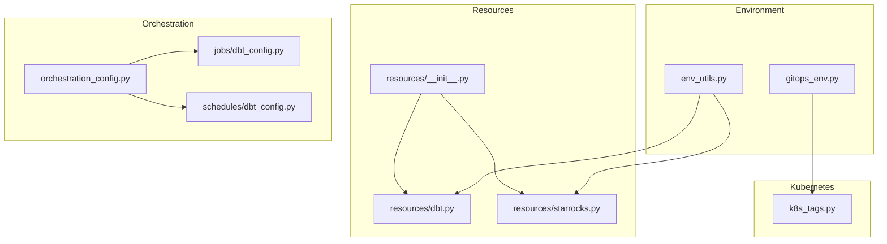
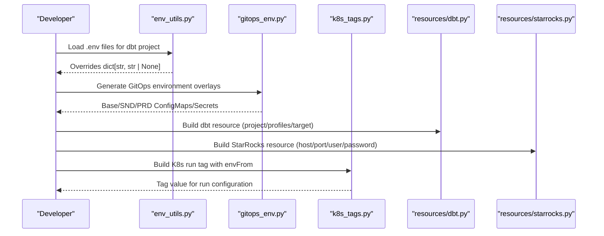
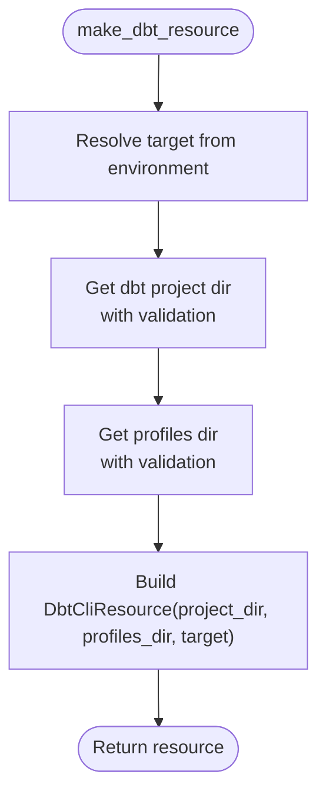
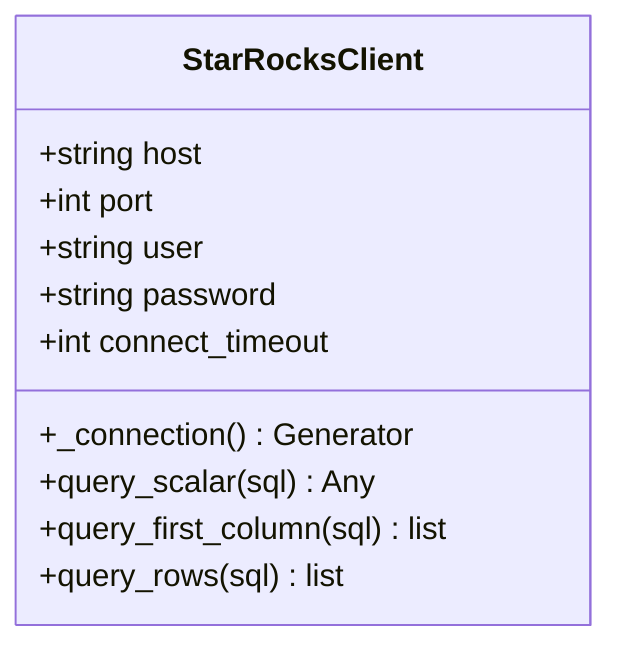
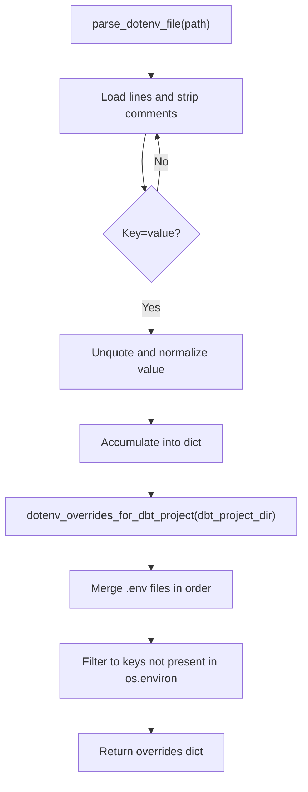
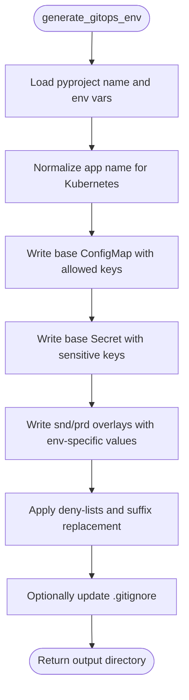
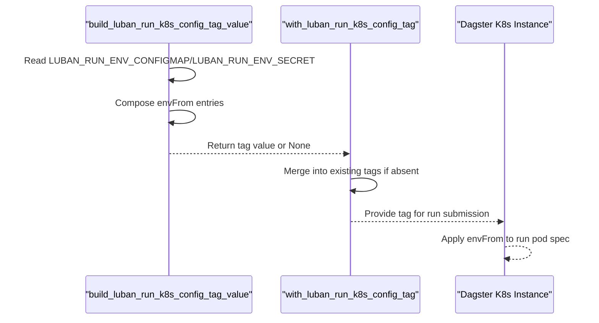
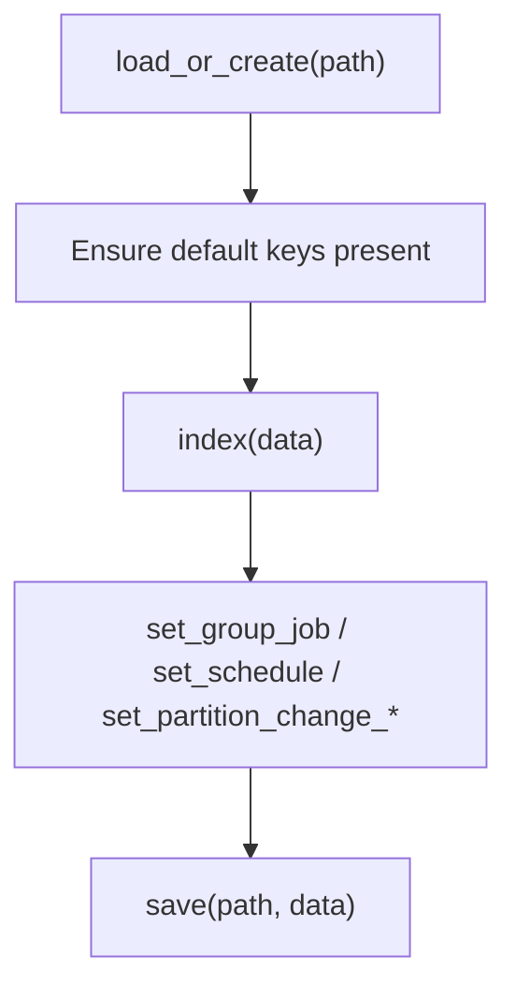
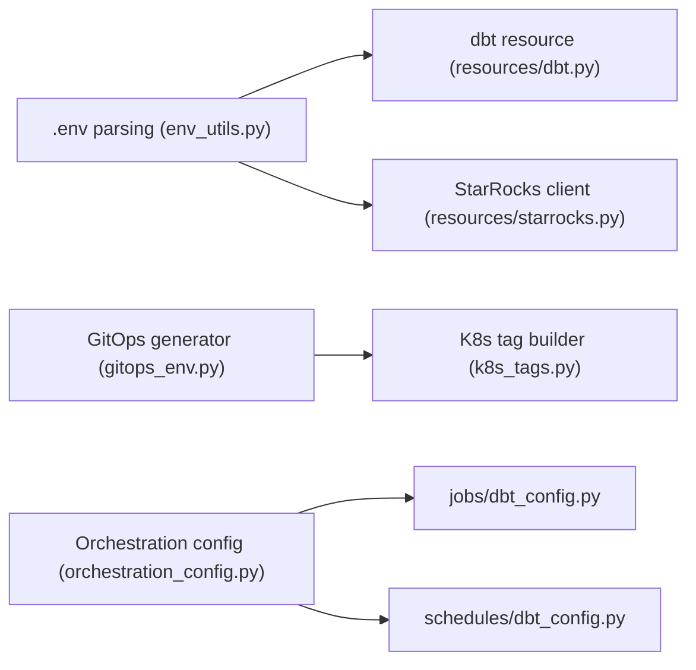

# Resource Management

<cite>
**Referenced Files in This Document**
- [resources/__init__.py](file://src/dbt_dagsterizer/resources/__init__.py)
- [resources/dbt.py](file://src/dbt_dagsterizer/resources/dbt.py)
- [resources/starrocks.py](file://src/dbt_dagsterizer/resources/starrocks.py)
- [k8s_tags.py](file://src/dbt_dagsterizer/k8s_tags.py)
- [gitops_env.py](file://src/dbt_dagsterizer/gitops_env.py)
- [env_utils.py](file://src/dbt_dagsterizer/env_utils.py)
- [orchestration_config.py](file://src/dbt_dagsterizer/orchestration_config.py)
- [jobs/dbt_config.py](file://src/dbt_dagsterizer/jobs/dbt_config.py)
- [schedules/dbt_config.py](file://src/dbt_dagsterizer/schedules/dbt_config.py)
</cite>

## Table of Contents
1. [Introduction](#introduction)
2. [Project Structure](#project-structure)
3. [Core Components](#core-components)
4. [Architecture Overview](#architecture-overview)
5. [Detailed Component Analysis](#detailed-component-analysis)
6. [Dependency Analysis](#dependency-analysis)
7. [Performance Considerations](#performance-considerations)
8. [Troubleshooting Guide](#troubleshooting-guide)
9. [Conclusion](#conclusion)
10. [Appendices](#appendices)

## Introduction
This document explains resource management in dbt-dagsterizer with a focus on:
- Database connection management for dbt projects and StarRocks integration
- Environment-specific configuration propagation via GitOps
- Kubernetes environment variable injection and run pod configuration
- Job-level tagging for Kubernetes scheduling
- Naming conventions for Kubernetes artifacts
- Security considerations around credentials and secrets
- Configuration options across execution environments and cloud providers

It synthesizes the repository’s resource creation, environment loading, GitOps generation, and Kubernetes tagging utilities to provide a practical guide for deploying and operating dbt-dagsterizer workloads reliably and securely.

## Project Structure
The resource management surface spans several modules:
- Resource factories expose dbt and StarRocks resources
- Environment utilities parse .env files and temporarily override environment variables
- GitOps environment generator emits ConfigMaps and Secrets per environment overlay
- Kubernetes tag builder injects envFrom into Dagster K8s runs
- Orchestration configuration stores job, schedule, and partition metadata

**Diagram sources**
- [resources/__init__.py:1-10](file://src/dbt_dagsterizer/resources/__init__.py#L1-L10)
- [resources/dbt.py:1-95](file://src/dbt_dagsterizer/resources/dbt.py#L1-L95)
- [resources/starrocks.py:1-65](file://src/dbt_dagsterizer/resources/starrocks.py#L1-L65)
- [env_utils.py:1-78](file://src/dbt_dagsterizer/env_utils.py#L1-L78)
- [gitops_env.py:1-197](file://src/dbt_dagsterizer/gitops_env.py#L1-L197)
- [k8s_tags.py:1-37](file://src/dbt_dagsterizer/k8s_tags.py#L1-L37)
- [orchestration_config.py:1-370](file://src/dbt_dagsterizer/orchestration_config.py#L1-L370)
- [jobs/dbt_config.py:1-3](file://src/dbt_dagsterizer/jobs/dbt_config.py#L1-L3)
- [schedules/dbt_config.py:1-3](file://src/dbt_dagsterizer/schedules/dbt_config.py#L1-L3)

**Section sources**
- [resources/__init__.py:1-10](file://src/dbt_dagsterizer/resources/__init__.py#L1-L10)
- [resources/dbt.py:1-95](file://src/dbt_dagsterizer/resources/dbt.py#L1-L95)
- [resources/starrocks.py:1-65](file://src/dbt_dagsterizer/resources/starrocks.py#L1-L65)
- [env_utils.py:1-78](file://src/dbt_dagsterizer/env_utils.py#L1-L78)
- [gitops_env.py:1-197](file://src/dbt_dagsterizer/gitops_env.py#L1-L197)
- [k8s_tags.py:1-37](file://src/dbt_dagsterizer/k8s_tags.py#L1-L37)
- [orchestration_config.py:1-370](file://src/dbt_dagsterizer/orchestration_config.py#L1-L370)
- [jobs/dbt_config.py:1-3](file://src/dbt_dagsterizer/jobs/dbt_config.py#L1-L3)
- [schedules/dbt_config.py:1-3](file://src/dbt_dagsterizer/schedules/dbt_config.py#L1-L3)

## Core Components
- Resource registry: Exposes dbt and StarRocks resources for use in Dagster definitions
- dbt resource factory: Locates dbt project and profiles directories, selects target, and constructs a DbtCliResource
- StarRocks client: Provides a lightweight, context-managed MySQL-compatible client backed by a single connection per operation
- Environment utilities: Parse .env files and temporarily override environment variables during operations
- GitOps environment generator: Produces environment overlays with ConfigMaps and Secrets, normalizes names, and enforces denials
- Kubernetes tag builder: Encodes envFrom references into a Dagster K8s run tag for runtime environment injection
- Orchestration configuration: Manages job, schedule, and partition metadata persisted in dagsterization.yml

**Section sources**
- [resources/__init__.py:1-10](file://src/dbt_dagsterizer/resources/__init__.py#L1-L10)
- [resources/dbt.py:87-95](file://src/dbt_dagsterizer/resources/dbt.py#L87-L95)
- [resources/starrocks.py:58-65](file://src/dbt_dagsterizer/resources/starrocks.py#L58-L65)
- [env_utils.py:8-78](file://src/dbt_dagsterizer/env_utils.py#L8-L78)
- [gitops_env.py:104-197](file://src/dbt_dagsterizer/gitops_env.py#L104-L197)
- [k8s_tags.py:10-37](file://src/dbt_dagsterizer/k8s_tags.py#L10-L37)
- [orchestration_config.py:19-83](file://src/dbt_dagsterizer/orchestration_config.py#L19-L83)

## Architecture Overview
The resource management architecture connects environment discovery, GitOps generation, and Kubernetes runtime configuration:

**Diagram sources**
- [env_utils.py:44-78](file://src/dbt_dagsterizer/env_utils.py#L44-L78)
- [gitops_env.py:104-197](file://src/dbt_dagsterizer/gitops_env.py#L104-L197)
- [k8s_tags.py:10-37](file://src/dbt_dagsterizer/k8s_tags.py#L10-L37)
- [resources/dbt.py:87-95](file://src/dbt_dagsterizer/resources/dbt.py#L87-L95)
- [resources/starrocks.py:58-65](file://src/dbt_dagsterizer/resources/starrocks.py#L58-L65)

## Detailed Component Analysis

### dbt Resource Factory
Purpose:
- Determine dbt project and profiles directories
- Resolve target selection
- Construct a DbtCliResource for CLI-driven orchestration

Key behaviors:
- Repository root detection with fallbacks
- Validation that dbt_project.yml exists under the chosen project directory
- Validation that profiles.yml exists under the chosen profiles directory
- Target resolution with precedence across environment variables

**Diagram sources**
- [resources/dbt.py:87-95](file://src/dbt_dagsterizer/resources/dbt.py#L87-L95)
- [resources/dbt.py:17-54](file://src/dbt_dagsterizer/resources/dbt.py#L17-L54)
- [resources/dbt.py:57-84](file://src/dbt_dagsterizer/resources/dbt.py#L57-L84)

Operational notes:
- Environment variables used: LUBAN_REPO_ROOT, DBT_PROJECT_DIR, DBT_PROFILES_DIR, DBT_TARGET, LUBAN_DEFAULT_DBT_TARGET
- Errors raised when required files or directories are missing

**Section sources**
- [resources/dbt.py:1-95](file://src/dbt_dagsterizer/resources/dbt.py#L1-L95)

### StarRocks Resource Factory
Purpose:
- Provide a simple, context-managed client for StarRocks connectivity
- Encapsulate connection parameters and basic query helpers

Key behaviors:
- Reads connection parameters from environment variables with safe defaults
- Uses a context manager to open/close a single connection per operation
- Provides convenience methods for scalar, column, and row queries

**Diagram sources**
- [resources/starrocks.py:9-65](file://src/dbt_dagsterizer/resources/starrocks.py#L9-L65)

Operational notes:
- Environment variables used: STARROCKS_HOST, STARROCKS_PORT, STARROCKS_USER, STARROCKS_PASSWORD
- Connection timeouts configured for connect/read/write
- No built-in connection pooling; each method opens/closes a connection

**Section sources**
- [resources/starrocks.py:1-65](file://src/dbt_dagsterizer/resources/starrocks.py#L1-L65)

### Environment Utilities (.env parsing and temporary overrides)
Purpose:
- Parse .env files for dbt projects
- Temporarily override environment variables during operations

Key behaviors:
- Supports export-prefixed lines and quoted/unquoted values
- Computes overrides only if the environment variable is not already set
- Provides a context manager to restore original environment after operations

**Diagram sources**
- [env_utils.py:8-78](file://src/dbt_dagsterizer/env_utils.py#L8-L78)

**Section sources**
- [env_utils.py:1-78](file://src/dbt_dagsterizer/env_utils.py#L1-L78)

### GitOps Environment Generation
Purpose:
- Generate environment overlays (base, snd, prd) with ConfigMaps and Secrets
- Normalize application name for Kubernetes compatibility
- Enforce denials for sensitive keys and prefixes

Key behaviors:
- Load project name from pyproject.toml
- Normalize name to Kubernetes-friendly lowercase, hyphenated form
- Load environment variables from a .env file
- Write base overlay with allowed keys and deny-listed keys/prefixes
- Write snd and prd overlays with environment-specific values and DBT_TARGET overrides
- Replace suffixes like _dev/_snd/_prd on selected keys
- Optionally update .gitignore to exclude generated output

**Diagram sources**
- [gitops_env.py:104-197](file://src/dbt_dagsterizer/gitops_env.py#L104-L197)

Operational notes:
- Sensitive keys: STARROCKS_PASSWORD
- Denied prefixes: OTEL_
- Denied keys: DAGSTER_WEBSERVER_HOST, DAGSTER_WEBSERVER_PORT, DAGSTER_HOME, LUBAN_REPO_ROOT, STARROCKS_PASSWORD
- DBT_TARGET override per environment
- Name normalization ensures Kubernetes resource name validity

**Section sources**
- [gitops_env.py:1-197](file://src/dbt_dagsterizer/gitops_env.py#L1-L197)

### Kubernetes Run Pod Configuration and Job-Level Tagging
Purpose:
- Inject environment variables into run pods via envFrom references
- Attach a Dagster K8s run tag that encodes the desired ConfigMap and Secret

Key behaviors:
- Build a JSON-encoded tag value when LUBAN_RUN_ENV_CONFIGMAP or LUBAN_RUN_ENV_SECRET are set
- Merge the tag into existing run tags if not already present
- The resulting tag instructs Dagster to mount the specified ConfigMap and/or Secret into the run pod

**Diagram sources**
- [k8s_tags.py:10-37](file://src/dbt_dagsterizer/k8s_tags.py#L10-L37)

Operational notes:
- Environment variables used: LUBAN_RUN_ENV_CONFIGMAP, LUBAN_RUN_ENV_SECRET
- Tag key: dagster-k8s/config
- The tag value is a compact JSON string suitable for Dagster K8s configuration

**Section sources**
- [k8s_tags.py:1-37](file://src/dbt_dagsterizer/k8s_tags.py#L1-L37)

### Orchestration Configuration Persistence
Purpose:
- Persist and manage orchestration metadata (jobs, schedules, partitions) in dagsterization.yml
- Provide helpers to set/update jobs, schedules, and partition change detectors/propagators

Key behaviors:
- Load or create orchestration config with default structure
- Index models to jobs and partitions for downstream use
- Set or remove jobs, schedules, and partition change specs
- Save updated configuration to disk

**Diagram sources**
- [orchestration_config.py:23-83](file://src/dbt_dagsterizer/orchestration_config.py#L23-L83)
- [orchestration_config.py:112-158](file://src/dbt_dagsterizer/orchestration_config.py#L112-L158)
- [orchestration_config.py:196-236](file://src/dbt_dagsterizer/orchestration_config.py#L196-L236)
- [orchestration_config.py:238-358](file://src/dbt_dagsterizer/orchestration_config.py#L238-L358)
- [orchestration_config.py:78-83](file://src/dbt_dagsterizer/orchestration_config.py#L78-L83)

**Section sources**
- [orchestration_config.py:1-370](file://src/dbt_dagsterizer/orchestration_config.py#L1-L370)

## Dependency Analysis
High-level dependencies among resource management modules:

**Diagram sources**
- [env_utils.py:1-78](file://src/dbt_dagsterizer/env_utils.py#L1-L78)
- [resources/dbt.py:1-95](file://src/dbt_dagsterizer/resources/dbt.py#L1-L95)
- [resources/starrocks.py:1-65](file://src/dbt_dagsterizer/resources/starrocks.py#L1-L65)
- [gitops_env.py:1-197](file://src/dbt_dagsterizer/gitops_env.py#L1-L197)
- [k8s_tags.py:1-37](file://src/dbt_dagsterizer/k8s_tags.py#L1-L37)
- [orchestration_config.py:1-370](file://src/dbt_dagsterizer/orchestration_config.py#L1-L370)
- [jobs/dbt_config.py:1-3](file://src/dbt_dagsterizer/jobs/dbt_config.py#L1-L3)
- [schedules/dbt_config.py:1-3](file://src/dbt_dagsterizer/schedules/dbt_config.py#L1-L3)

Observations:
- Low coupling: Each module focuses on a distinct concern
- Clear separation of concerns: environment discovery, resource construction, GitOps, and K8s tagging
- No circular dependencies observed among the analyzed modules

**Section sources**
- [resources/__init__.py:1-10](file://src/dbt_dagsterizer/resources/__init__.py#L1-L10)
- [resources/dbt.py:1-95](file://src/dbt_dagsterizer/resources/dbt.py#L1-L95)
- [resources/starrocks.py:1-65](file://src/dbt_dagsterizer/resources/starrocks.py#L1-L65)
- [env_utils.py:1-78](file://src/dbt_dagsterizer/env_utils.py#L1-L78)
- [gitops_env.py:1-197](file://src/dbt_dagsterizer/gitops_env.py#L1-L197)
- [k8s_tags.py:1-37](file://src/dbt_dagsterizer/k8s_tags.py#L1-L37)
- [orchestration_config.py:1-370](file://src/dbt_dagsterizer/orchestration_config.py#L1-L370)
- [jobs/dbt_config.py:1-3](file://src/dbt_dagsterizer/jobs/dbt_config.py#L1-L3)
- [schedules/dbt_config.py:1-3](file://src/dbt_dagsterizer/schedules/dbt_config.py#L1-L3)

## Performance Considerations
- StarRocks client: Each query opens and closes a connection. For high-throughput scenarios, consider:
  - Consolidating queries within a single operation
  - Introducing a lightweight connection pool if the workload demands repeated connections
- dbt resource: Directory validation occurs on resource creation. Keep project and profiles directories stable to avoid repeated filesystem checks.
- GitOps generation: Writing multiple overlays is I/O-bound; batch writes and avoid unnecessary regeneration.
- Kubernetes envFrom: Using envFrom avoids embedding secrets in image layers but increases pod startup time slightly due to ConfigMap/Secret mounting.

[No sources needed since this section provides general guidance]

## Troubleshooting Guide
Common issues and resolutions:
- dbt project not found
  - Symptom: Runtime error indicating dbt_project.yml cannot be located
  - Resolution: Set LUBAN_REPO_ROOT or DBT_PROJECT_DIR appropriately; ensure the chosen directory contains dbt_project.yml
  - Section sources
    - [resources/dbt.py:27-54](file://src/dbt_dagsterizer/resources/dbt.py#L27-L54)
- Profiles directory missing profiles.yml
  - Symptom: Runtime error indicating profiles.yml not found
  - Resolution: Set DBT_PROFILES_DIR to a directory containing profiles.yml
  - Section sources
    - [resources/dbt.py:57-84](file://src/dbt_dagsterizer/resources/dbt.py#L57-L84)
- StarRocks connection failures
  - Symptom: Exceptions when querying StarRocks
  - Resolution: Verify STARROCKS_HOST, STARROCKS_PORT, STARROCKS_USER, STARROCKS_PASSWORD; confirm network reachability and credentials
  - Section sources
    - [resources/starrocks.py:58-65](file://src/dbt_dagsterizer/resources/starrocks.py#L58-L65)
- Kubernetes run lacks environment variables
  - Symptom: Run pod cannot access expected environment variables
  - Resolution: Set LUBAN_RUN_ENV_CONFIGMAP and/or LUBAN_RUN_ENV_SECRET; ensure the tag is applied to the run
  - Section sources
    - [k8s_tags.py:10-37](file://src/dbt_dagsterizer/k8s_tags.py#L10-L37)
- GitOps overlay missing expected keys
  - Symptom: Generated overlay does not contain expected variables
  - Resolution: Confirm .env file contents, denied keys/prefixes, and suffix replacement rules
  - Section sources
    - [gitops_env.py:140-172](file://src/dbt_dagsterizer/gitops_env.py#L140-L172)

**Section sources**
- [resources/dbt.py:27-84](file://src/dbt_dagsterizer/resources/dbt.py#L27-L84)
- [resources/starrocks.py:58-65](file://src/dbt_dagsterizer/resources/starrocks.py#L58-L65)
- [k8s_tags.py:10-37](file://src/dbt_dagsterizer/k8s_tags.py#L10-L37)
- [gitops_env.py:140-172](file://src/dbt_dagsterizer/gitops_env.py#L140-L172)

## Conclusion
dbt-dagsterizer’s resource management centers on:
- Robust dbt project and profiles discovery with explicit validations
- A minimal StarRocks client optimized for simplicity and safety
- GitOps-driven environment overlays with strict denials and normalization
- Kubernetes run tagging to inject environment variables via envFrom
- Persistent orchestration configuration for jobs and schedules

These components collectively enable secure, reproducible deployments across environments while keeping operational overhead low.

[No sources needed since this section summarizes without analyzing specific files]

## Appendices

### Environment Variables Reference
- dbt resource
  - LUBAN_REPO_ROOT: Repository root override
  - DBT_PROJECT_DIR: dbt project directory override
  - DBT_PROFILES_DIR: dbt profiles directory override
  - DBT_TARGET: Target selection
  - LUBAN_DEFAULT_DBT_TARGET: Fallback target
- StarRocks client
  - STARROCKS_HOST: Hostname
  - STARROCKS_PORT: Port
  - STARROCKS_USER: Username
  - STARROCKS_PASSWORD: Password
- Kubernetes run tagging
  - LUBAN_RUN_ENV_CONFIGMAP: ConfigMap name to mount
  - LUBAN_RUN_ENV_SECRET: Secret name to mount
- GitOps generation
  - DAGSTER_HOME: Home directory for the app
  - OTEL_*: Denied prefix
  - Other keys: Allowed unless explicitly denied

**Section sources**
- [resources/dbt.py:87-95](file://src/dbt_dagsterizer/resources/dbt.py#L87-L95)
- [resources/starrocks.py:58-65](file://src/dbt_dagsterizer/resources/starrocks.py#L58-L65)
- [k8s_tags.py:10-37](file://src/dbt_dagsterizer/k8s_tags.py#L10-L37)
- [gitops_env.py:140-147](file://src/dbt_dagsterizer/gitops_env.py#L140-L147)

### Example Workflows

- Local development with .env overrides
  - Use dotenv_overrides_for_dbt_project to merge .env values only when not already present in the environment
  - Section sources
    - [env_utils.py:44-78](file://src/dbt_dagsterizer/env_utils.py#L44-L78)

- Generate GitOps overlays for base, snd, prd
  - Call generate_gitops_env with project_dir, env_file, output_dir, and DAGSTER_HOME
  - Review generated ConfigMaps and Secrets for allowed/denied keys
  - Section sources
    - [gitops_env.py:104-197](file://src/dbt_dagsterizer/gitops_env.py#L104-L197)

- Configure Kubernetes run with envFrom
  - Set LUBAN_RUN_ENV_CONFIGMAP and/or LUBAN_RUN_ENV_SECRET
  - Allow with_luban_run_k8s_config_tag to attach the tag to runs
  - Section sources
    - [k8s_tags.py:10-37](file://src/dbt_dagsterizer/k8s_tags.py#L10-L37)

- Persist orchestration configuration
  - Use load_or_create to initialize dagsterization.yml
  - Use set_group_job, set_schedule, and partition change setters to update configuration
  - Section sources
    - [orchestration_config.py:23-83](file://src/dbt_dagsterizer/orchestration_config.py#L23-L83)
    - [orchestration_config.py:196-236](file://src/dbt_dagsterizer/orchestration_config.py#L196-L236)
    - [orchestration_config.py:238-358](file://src/dbt_dagsterizer/orchestration_config.py#L238-L358)