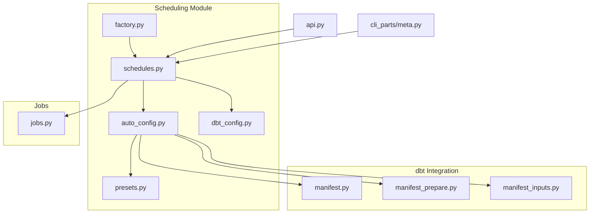
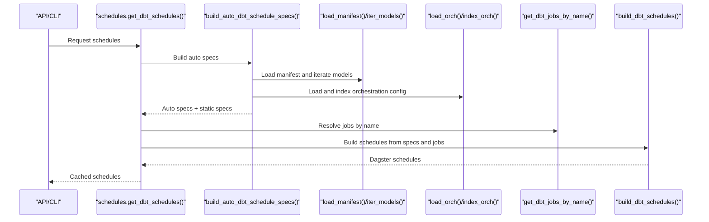
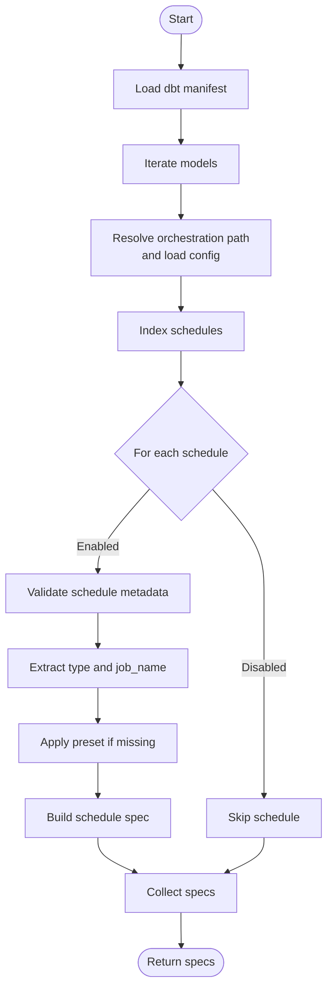
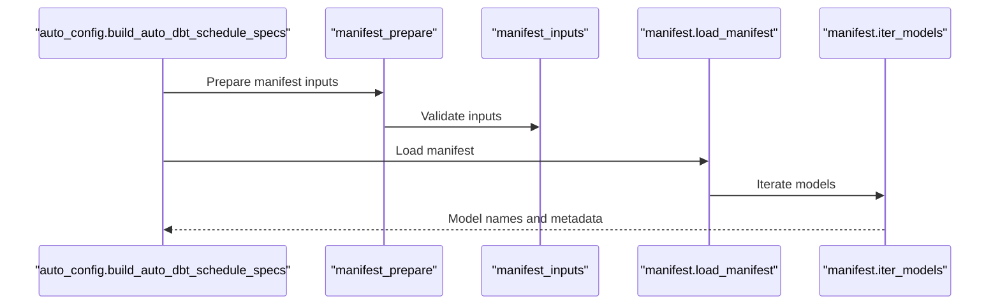
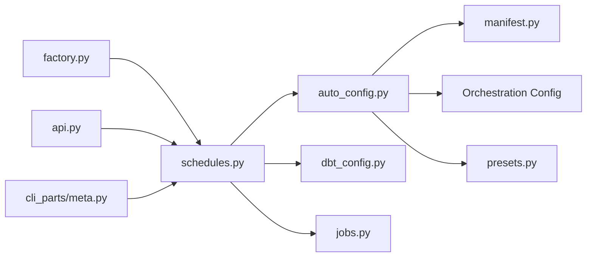

# Automatic Schedule Generation

<cite>
**Referenced Files in This Document**
- [schedules.py](file://src/dbt_dagsterizer/schedules/dbt/schedules.py)
- [auto_config.py](file://src/dbt_dagsterizer/schedules/dbt/auto_config.py)
- [factory.py](file://src/dbt_dagsterizer/schedules/dbt/factory.py)
- [presets.py](file://src/dbt_dagsterizer/schedules/dbt/presets.py)
- [dbt_config.py](file://src/dbt_dagsterizer/schedules/dbt_config.py)
- [manifest.py](file://src/dbt_dagsterizer/dbt/manifest.py)
- [jobs.py](file://src/dbt_dagsterizer/jobs/dbt/jobs.py)
- [manifest_prepare.py](file://src/dbt_dagsterizer/dbt/manifest_prepare.py)
- [manifest_inputs.py](file://src/dbt_dagsterizer/manifest_inputs.py)
- [api.py](file://src/dbt_dagsterizer/api.py)
- [cli_parts/meta.py](file://src/dbt_dagsterizer/cli_parts/meta.py)
- [test_dbt_schedule_presets.py](file://tests/test_dbt_schedule_presets.py)
- [test_schedule_specs.py](file://tests/tests_schedule_specs.py)
</cite>

## Table of Contents
1. [Introduction](#introduction)
2. [Project Structure](#project-structure)
3. [Core Components](#core-components)
4. [Architecture Overview](#architecture-overview)
5. [Detailed Component Analysis](#detailed-component-analysis)
6. [Dependency Analysis](#dependency-analysis)
7. [Performance Considerations](#performance-considerations)
8. [Troubleshooting Guide](#troubleshooting-guide)
9. [Conclusion](#conclusion)

## Introduction
This document explains how automatic schedule generation works in dbt-dagsterizer. It covers how schedules are derived from dbt model metadata and manifest files, how model dependencies and incremental configurations influence schedule decisions, and how the system integrates dbt manifest loading, model iteration, and schedule specification building. It also documents the automatic mapping between dbt models and corresponding Dagster jobs, along with validation, conflict resolution, and error handling during automatic generation.

## Project Structure
The scheduling subsystem resides under src/dbt_dagsterizer/schedules/dbt and coordinates with dbt manifest loading, orchestration configuration, and job discovery. Key modules include:
- schedules.py: Public entrypoint that builds and caches schedule definitions
- auto_config.py: Automatic discovery pipeline that reads dbt manifests and orchestration config to produce schedule specs
- factory.py: Builds Dagster schedules from schedule specs and job mappings
- presets.py: Provides default schedule presets (e.g., daily)
- dbt_config.py: Exposes static schedule specs configured by users
- jobs.py: Resolves dbt jobs by name for schedule-to-job mapping
- manifest.py: Loads and iterates dbt models from the manifest
- manifest_prepare.py and manifest_inputs.py: Prepare and validate manifest inputs
- api.py and cli_parts/meta.py: Integrate schedule generation into CLI and API flows

**Diagram sources**
- [schedules.py:1-16](file://src/dbt_dagsterizer/schedules/dbt/schedules.py#L1-L16)
- [auto_config.py:20-41](file://src/dbt_dagsterizer/schedules/dbt/auto_config.py#L20-L41)
- [factory.py](file://src/dbt_dagsterizer/schedules/dbt/factory.py)
- [presets.py](file://src/dbt_dagsterizer/schedules/dbt/presets.py)
- [dbt_config.py](file://src/dbt_dagsterizer/schedules/dbt_config.py)
- [manifest.py](file://src/dbt_dagsterizer/dbt/manifest.py)
- [manifest_prepare.py](file://src/dbt_dagsterizer/dbt/manifest_prepare.py)
- [manifest_inputs.py](file://src/dbt_dagsterizer/manifest_inputs.py)
- [jobs.py](file://src/dbt_dagsterizer/jobs/dbt/jobs.py)
- [api.py:53](file://src/dbt_dagsterizer/api.py#L53)
- [cli_parts/meta.py:41](file://src/dbt_dagsterizer/cli_parts/meta.py#L41)

**Section sources**
- [schedules.py:1-16](file://src/dbt_dagsterizer/schedules/dbt/schedules.py#L1-L16)
- [auto_config.py:20-41](file://src/dbt_dagsterizer/schedules/dbt/auto_config.py#L20-L41)
- [manifest.py](file://src/dbt_dagsterizer/dbt/manifest.py)
- [jobs.py](file://src/dbt_dagsterizer/jobs/dbt/jobs.py)

## Core Components
- Automatic schedule spec builder: Reads dbt manifest and orchestration configuration to derive schedule specs per model/job.
- Schedule factory: Translates schedule specs into Dagster schedules and binds them to jobs.
- Presets: Provides default cadence and partitioning strategies.
- Static schedule specs: Allows manual overrides via dbt_config.py.
- Manifest preparation and validation: Ensures manifest inputs are ready and consistent.

Key responsibilities:
- Discover dbt models and their metadata from the manifest
- Resolve job mappings for each model
- Apply presets and user-defined overrides
- Build schedule definitions and cache them for reuse

**Section sources**
- [auto_config.py:20-41](file://src/dbt_dagsterizer/schedules/dbt/auto_config.py#L20-L41)
- [factory.py](file://src/dbt_dagsterizer/schedules/dbt/factory.py)
- [presets.py](file://src/dbt_dagsterizer/schedules/dbt/presets.py)
- [dbt_config.py](file://src/dbt_dagsterizer/schedules/dbt_config.py)
- [manifest_prepare.py](file://src/dbt_dagsterizer/dbt/manifest_prepare.py)
- [manifest_inputs.py](file://src/dbt_dagsterizer/manifest_inputs.py)

## Architecture Overview
The automatic schedule generation pipeline follows a deterministic flow:
1. Load dbt manifest and iterate models
2. Load orchestration configuration and index schedules
3. For each schedule spec, compute cadence and partitioning
4. Map schedule to a job by name
5. Build Dagster schedules and cache them

**Diagram sources**
- [schedules.py:9-16](file://src/dbt_dagsterizer/schedules/dbt/schedules.py#L9-L16)
- [auto_config.py:20-41](file://src/dbt_dagsterizer/schedules/dbt/auto_config.py#L20-L41)
- [manifest.py](file://src/dbt_dagsterizer/dbt/manifest.py)
- [jobs.py](file://src/dbt_dagsterizer/jobs/dbt/jobs.py)
- [factory.py](file://src/dbt_dagsterizer/schedules/dbt/factory.py)

## Detailed Component Analysis

### Automatic Discovery Pipeline
The automatic discovery reads the dbt manifest and orchestration configuration to produce schedule specs. It:
- Loads the manifest and collects model names
- Resolves the orchestration config path and loads it
- Indexes the configuration to enumerate schedules
- Validates each schedule entry and extracts cadence, job name, and type
- Applies defaults (e.g., daily cadence preset) when unspecified

**Diagram sources**
- [auto_config.py:20-41](file://src/dbt_dagsterizer/schedules/dbt/auto_config.py#L20-L41)
- [manifest.py](file://src/dbt_dagsterizer/dbt/manifest.py)
- [presets.py](file://src/dbt_dagsterizer/schedules/dbt/presets.py)

**Section sources**
- [auto_config.py:20-41](file://src/dbt_dagsterizer/schedules/dbt/auto_config.py#L20-L41)
- [manifest.py](file://src/dbt_dagsterizer/dbt/manifest.py)
- [presets.py](file://src/dbt_dagsterizer/schedules/dbt/presets.py)

### Schedule Specification Building
The schedule spec builder:
- Reads the manifest to collect model names
- Resolves the orchestration configuration path and loads it
- Iterates over schedule entries, validating presence and shape
- Extracts enabled flag, type, and job_name
- Uses a daily preset when cadence is not specified
- Produces a list of schedule specs suitable for downstream building

Practical outcomes:
- Ensures only valid and enabled schedules are considered
- Normalizes missing cadence using a preset
- Maintains a stable ordering by schedule name

**Section sources**
- [auto_config.py:20-41](file://src/dbt_dagsterizer/schedules/dbt/auto_config.py#L20-L41)
- [presets.py](file://src/dbt_dagsterizer/schedules/dbt/presets.py)

### Schedule Factory and Job Mapping
The schedule factory:
- Receives schedule specs and a job resolver
- Maps each schedule spec to a job by name
- Builds Dagster schedules using the resolved jobs
- Caches the resulting schedules for reuse

Job mapping:
- Jobs are discovered by name and matched to schedule specs
- This enables automatic binding of schedules to the correct Dagster jobs

**Section sources**
- [schedules.py:9-16](file://src/dbt_dagsterizer/schedules/dbt/schedules.py#L9-L16)
- [jobs.py](file://src/dbt_dagsterizer/jobs/dbt/jobs.py)
- [factory.py](file://src/dbt_dagsterizer/schedules/dbt/factory.py)

### Integration with Manifest Loading and Model Iteration
Manifest preparation and inputs:
- Manifest preparation ensures inputs are consistent and prepared
- Manifest inputs validation checks for required artifacts
- Manifest loading and model iteration provide the model graph for discovery

**Diagram sources**
- [auto_config.py:20-41](file://src/dbt_dagsterizer/schedules/dbt/auto_config.py#L20-L41)
- [manifest_prepare.py](file://src/dbt_dagsterizer/dbt/manifest_prepare.py)
- [manifest_inputs.py](file://src/dbt_dagsterizer/manifest_inputs.py)
- [manifest.py](file://src/dbt_dagsterizer/dbt/manifest.py)

**Section sources**
- [manifest_prepare.py](file://src/dbt_dagsterizer/dbt/manifest_prepare.py)
- [manifest_inputs.py](file://src/dbt_dagsterizer/manifest_inputs.py)
- [manifest.py](file://src/dbt_dagsterizer/dbt/manifest.py)

### Influence of Model Types on Schedule Generation
Different dbt model characteristics influence automatic schedule generation:
- Incremental models: Often paired with partitioned schedules aligned to their incremental update cadence
- Full-refresh models: Typically scheduled less frequently or with daily cadence presets
- View-based models: Usually scheduled conservatively, often using daily presets or weekly schedules depending on downstream dependencies

These influences are realized through:
- Orchestration configuration specifying schedule types and cadences
- Preset defaults applied when no explicit configuration exists
- Job mapping ensuring schedules target the correct jobs

[No sources needed since this section synthesizes behavior from referenced components without quoting specific lines]

### Schedule Validation, Conflict Resolution, and Error Handling
Validation and safety:
- Schedule entries are validated for presence and shape before processing
- Enabled/disabled flags control inclusion in the generated specs
- CLI and API flows prevent deletion conflicts by reporting asset job references

Conflict resolution:
- When schedules reference asset jobs, CLI meta operations report conflicts and require explicit override flags to remove

Error handling:
- Invalid or malformed schedule entries are skipped
- Missing job names lead to mapping failures, surfaced during schedule building

**Section sources**
- [auto_config.py:32-41](file://src/dbt_dagsterizer/schedules/dbt/auto_config.py#L32-L41)
- [cli_parts/meta.py:159](file://src/dbt_dagsterizer/cli_parts/meta.py#L159)
- [cli_parts/meta.py:182](file://src/dbt_dagsterizer/cli_parts/meta.py#L182)
- [cli_parts/meta.py:192](file://src/dbt_dagsterizer/cli_parts/meta.py#L192)
- [cli_parts/meta.py:332](file://src/dbt_dagsterizer/cli_parts/meta.py#L332)
- [cli_parts/meta.py:342](file://src/dbt_dagsterizer/cli_parts/meta.py#L342)
- [cli_parts/meta.py:346](file://src/dbt_dagsterizer/cli_parts/meta.py#L346)

## Dependency Analysis
The scheduling module depends on:
- dbt manifest loader and iterator for model discovery
- Orchestration configuration loader and indexer for schedule definitions
- Job resolver for schedule-to-job mapping
- Preset provider for default cadence and partitioning
- Static schedule specs for manual overrides

**Diagram sources**
- [auto_config.py:20-41](file://src/dbt_dagsterizer/schedules/dbt/auto_config.py#L20-L41)
- [manifest.py](file://src/dbt_dagsterizer/dbt/manifest.py)
- [presets.py](file://src/dbt_dagsterizer/schedules/dbt/presets.py)
- [schedules.py:9-16](file://src/dbt_dagsterizer/schedules/dbt/schedules.py#L9-L16)
- [dbt_config.py](file://src/dbt_dagsterizer/schedules/dbt_config.py)
- [jobs.py](file://src/dbt_dagsterizer/jobs/dbt/jobs.py)
- [factory.py](file://src/dbt_dagsterizer/schedules/dbt/factory.py)
- [api.py:53](file://src/dbt_dagsterizer/api.py#L53)
- [cli_parts/meta.py:41](file://src/dbt_dagsterizer/cli_parts/meta.py#L41)

**Section sources**
- [schedules.py:9-16](file://src/dbt_dagsterizer/schedules/dbt/schedules.py#L9-L16)
- [auto_config.py:20-41](file://src/dbt_dagsterizer/schedules/dbt/auto_config.py#L20-L41)
- [manifest.py](file://src/dbt_dagsterizer/dbt/manifest.py)
- [jobs.py](file://src/dbt_dagsterizer/jobs/dbt/jobs.py)
- [factory.py](file://src/dbt_dagsterizer/schedules/dbt/factory.py)
- [dbt_config.py](file://src/dbt_dagsterizer/schedules/dbt_config.py)
- [api.py:53](file://src/dbt_dagsterizer/api.py#L53)
- [cli_parts/meta.py:41](file://src/dbt_dagsterizer/cli_parts/meta.py#L41)

## Performance Considerations
- Manifest loading and model iteration are O(N) in the number of models; caching reduces repeated work
- Schedule spec building is linear in the number of schedule entries
- Job resolution is O(J) per schedule, where J is the number of jobs
- Using cached schedules avoids recomputation across invocations

[No sources needed since this section provides general guidance]

## Troubleshooting Guide
Common issues and resolutions:
- No schedules generated:
  - Verify orchestration configuration contains a schedules section with valid entries
  - Confirm dbt manifest is present and loadable
- Schedules not bound to jobs:
  - Ensure job_name in schedule specs matches an existing job
  - Check job discovery and mapping logic
- Conflicts during deletion:
  - CLI meta operations report asset job references; use force flags to remove after confirming impact
- Unexpected cadence:
  - Review preset defaults and user overrides in orchestration configuration

**Section sources**
- [auto_config.py:32-41](file://src/dbt_dagsterizer/schedules/dbt/auto_config.py#L32-L41)
- [cli_parts/meta.py:159](file://src/dbt_dagsterizer/cli_parts/meta.py#L159)
- [cli_parts/meta.py:182](file://src/dbt_dagsterizer/cli_parts/meta.py#L182)
- [cli_parts/meta.py:192](file://src/dbt_dagsterizer/cli_parts/meta.py#L192)
- [cli_parts/meta.py:332](file://src/dbt_dagsterizer/cli_parts/meta.py#L332)
- [cli_parts/meta.py:342](file://src/dbt_dagsterizer/cli_parts/meta.py#L342)
- [cli_parts/meta.py:346](file://src/dbt_dagsterizer/cli_parts/meta.py#L346)

## Conclusion
Automatic schedule generation in dbt-dagsterizer derives schedule specifications from dbt manifests and orchestration configuration, applies sensible defaults via presets, and binds schedules to jobs for execution. The system validates inputs, resolves conflicts, and caches results for efficient reuse. By combining manifest-driven discovery with configurable overrides, it supports diverse model types and operational needs while maintaining robustness and clarity.