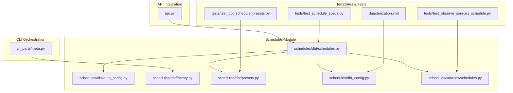
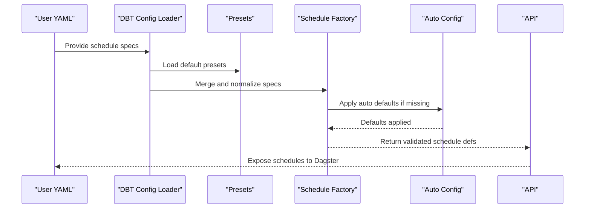
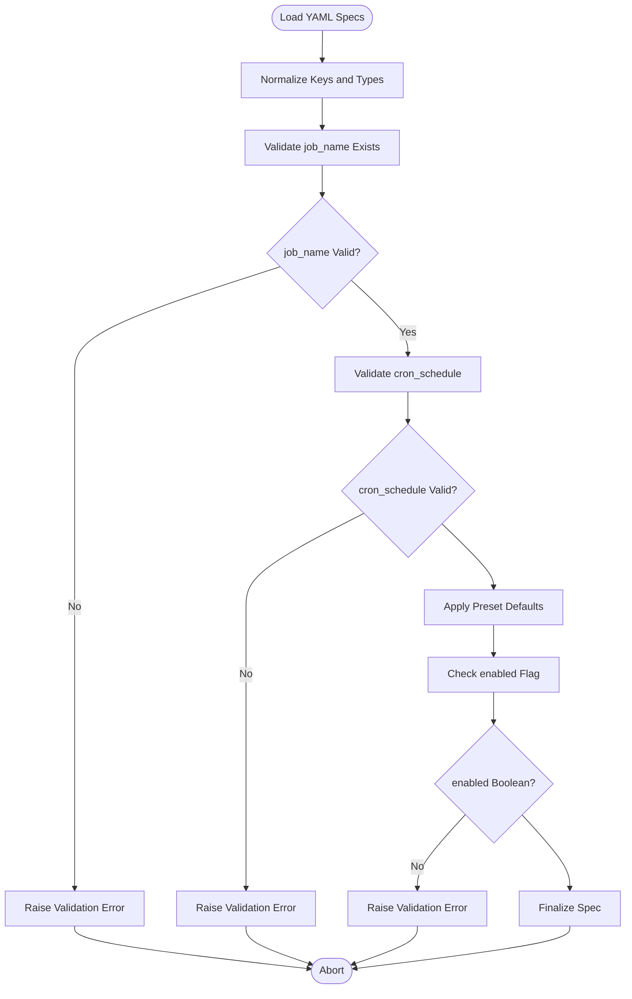
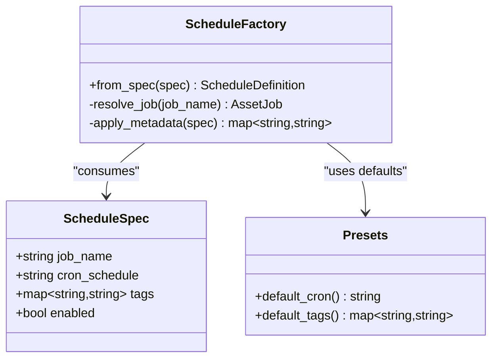
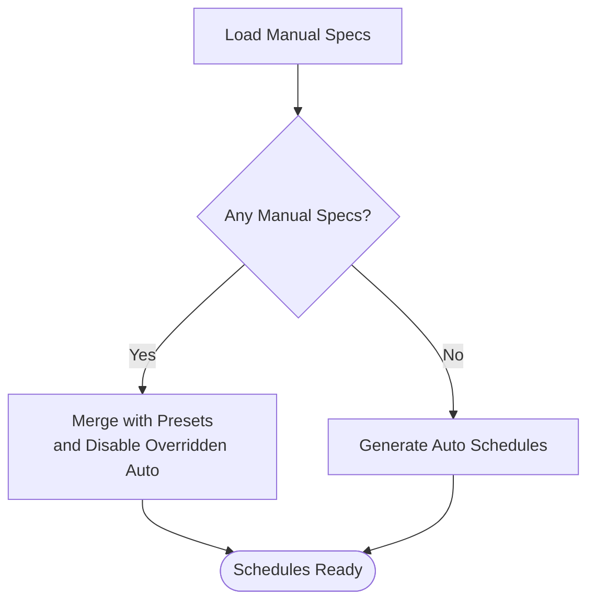
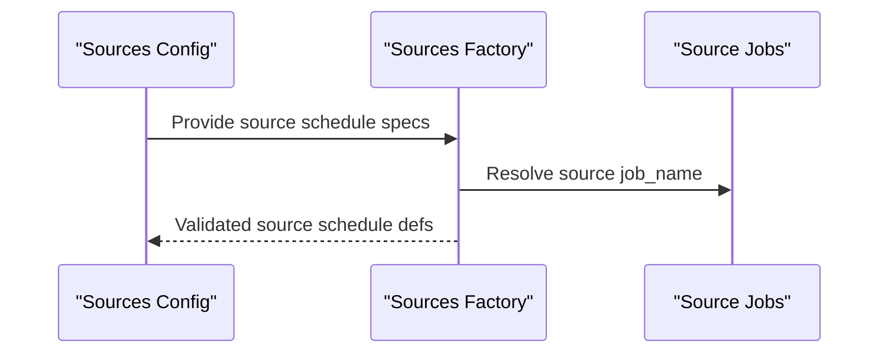
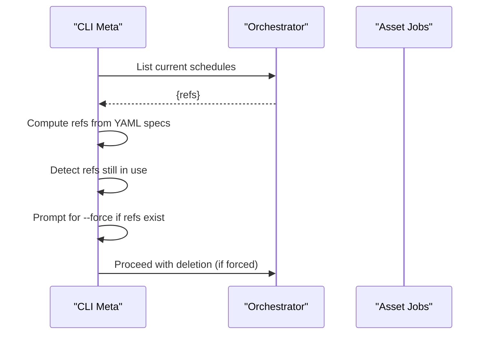
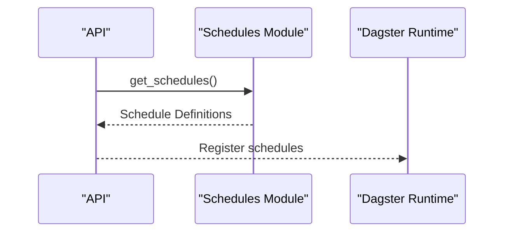
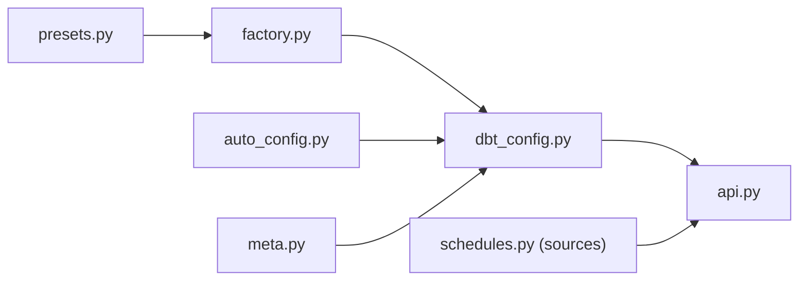

# Manual Schedule Configuration

<cite>
**Referenced Files in This Document**
- [schedules.py](file://src/dbt_dagsterizer/schedules/dbt/schedules.py)
- [auto_config.py](file://src/dbt_dagsterizer/schedules/dbt/auto_config.py)
- [factory.py](file://src/dbt_dagsterizer/schedules/dbt/factory.py)
- [presets.py](file://src/dbt_dagsterizer/schedules/dbt/presets.py)
- [dbt_config.py](file://src/dbt_dagsterizer/schedules/dbt_config.py)
- [schedules.py (sources)](file://src/dbt_dagsterizer/schedules/sources/schedules.py)
- [meta.py](file://src/dbt_dagsterizer/cli_parts/meta.py)
- [api.py](file://src/dbt_dagsterizer/api.py)
- [test_schedule_specs.py](file://src/dbt_dagsterizer/project_templates/luban-dagster-dbt-starrocks-code-location-source-template/{{cookiecutter.output_name}}/tests/test_schedule_specs.py)
- [dagsterization.yml](file://src/dbt_dagsterizer/project_templates/luban-dagster-dbt-starrocks-code-location-source-template/{{cookiecutter.output_name}}/dbt_project/dagsterization.yml)
- [test_dbt_schedule_presets.py](file://tests/test_dbt_schedule_presets.py)
- [test_observe_sources_schedule.py](file://tests/test_observe_sources_schedule.py)
</cite>

## Table of Contents
1. [Introduction](#introduction)
2. [Project Structure](#project-structure)
3. [Core Components](#core-components)
4. [Architecture Overview](#architecture-overview)
5. [Detailed Component Analysis](#detailed-component-analysis)
6. [Dependency Analysis](#dependency-analysis)
7. [Performance Considerations](#performance-considerations)
8. [Troubleshooting Guide](#troubleshooting-guide)
9. [Conclusion](#conclusion)
10. [Appendices](#appendices)

## Introduction
This document explains how to configure manual schedules in dbt-dagsterizer using YAML-based orchestration settings. It covers schedule specification syntax, job_name references, timing configurations, metadata assignments, validation, enabled/disabled states, and job name resolution. It also clarifies the relationship between manual configurations and automatic schedule generation, and provides guidance on schedule overrides and conflict resolution.

## Project Structure
Manual schedule configuration is primarily handled under the schedules module and integrated via CLI orchestration and API entry points. The key files include:
- Schedule factory and presets for DBT schedules
- Auto-config logic for default schedules
- CLI meta orchestration for managing schedule references
- API integration for exposing schedules
- Template-driven configuration examples and tests

**Diagram sources**
- [schedules.py](file://src/dbt_dagsterizer/schedules/dbt/schedules.py)
- [auto_config.py](file://src/dbt_dagsterizer/schedules/dbt/auto_config.py)
- [factory.py](file://src/dbt_dagsterizer/schedules/dbt/factory.py)
- [presets.py](file://src/dbt_dagsterizer/schedules/dbt/presets.py)
- [dbt_config.py](file://src/dbt_dagsterizer/schedules/dbt_config.py)
- [schedules.py (sources)](file://src/dbt_dagsterizer/schedules/sources/schedules.py)
- [meta.py](file://src/dbt_dagsterizer/cli_parts/meta.py)
- [api.py](file://src/dbt_dagsterizer/api.py)
- [dagsterization.yml](file://src/dbt_dagsterizer/project_templates/luban-dagster-dbt-starrocks-code-location-source-template/{{cookiecutter.output_name}}/dbt_project/dagsterization.yml)
- [test_schedule_specs.py](file://src/dbt_dagsterizer/project_templates/luban-dagster-dbt-starrocks-code-location-source-template/{{cookiecutter.output_name}}/tests/test_schedule_specs.py)
- [test_dbt_schedule_presets.py](file://tests/test_dbt_schedule_presets.py)
- [test_observe_sources_schedule.py](file://tests/test_observe_sources_schedule.py)

**Section sources**
- [schedules.py](file://src/dbt_dagsterizer/schedules/dbt/schedules.py)
- [factory.py](file://src/dbt_dagsterizer/schedules/dbt/factory.py)
- [presets.py](file://src/dbt_dagsterizer/schedules/dbt/presets.py)
- [dbt_config.py](file://src/dbt_dagsterizer/schedules/dbt_config.py)
- [schedules.py (sources)](file://src/dbt_dagsterizer/schedules/sources/schedules.py)
- [meta.py](file://src/dbt_dagsterizer/cli_parts/meta.py)
- [api.py](file://src/dbt_dagsterizer/api.py)
- [dagsterization.yml](file://src/dbt_dagsterizer/project_templates/luban-dagster-dbt-starrocks-code-location-source-template/{{cookiecutter.output_name}}/dbt_project/dagsterization.yml)
- [test_schedule_specs.py](file://src/dbt_dagsterizer/project_templates/luban-dagster-dbt-starrocks-code-location-source-template/{{cookiecutter.output_name}}/tests/test_schedule_specs.py)
- [test_dbt_schedule_presets.py](file://tests/test_dbt_schedule_presets.py)
- [test_observe_sources_schedule.py](file://tests/test_observe_sources_schedule.py)

## Core Components
- Schedule factory: constructs schedule definitions from configuration and presets.
- Presets: provides default schedule templates and timing defaults.
- Auto-config: generates default schedules when none are explicitly configured.
- DBT config: merges user-provided schedule specs with defaults and validates them.
- Sources schedules: manages schedules for observable sources.
- CLI meta orchestration: tracks schedule references and enforces safe deletion.
- API integration: exposes schedules to the runtime definitions.

Key responsibilities:
- Parse and validate schedule specifications from YAML.
- Resolve job_name references against available asset jobs.
- Apply enabled/disabled states and metadata assignments.
- Merge manual overrides with automatic defaults.
- Detect conflicts and resolve them deterministically.

**Section sources**
- [factory.py](file://src/dbt_dagsterizer/schedules/dbt/factory.py)
- [presets.py](file://src/dbt_dagsterizer/schedules/dbt/presets.py)
- [auto_config.py](file://src/dbt_dagsterizer/schedules/dbt/auto_config.py)
- [dbt_config.py](file://src/dbt_dagsterizer/schedules/dbt_config.py)
- [schedules.py (sources)](file://src/dbt_dagsterizer/schedules/sources/schedules.py)
- [meta.py](file://src/dbt_dagsterizer/cli_parts/meta.py)
- [api.py](file://src/dbt_dagsterizer/api.py)

## Architecture Overview
The manual schedule configuration pipeline integrates YAML orchestration settings with the schedule factory and presets. The flow below illustrates how a user’s manual schedule spec is validated, merged with defaults, and resolved into executable schedule definitions.

**Diagram sources**
- [dbt_config.py](file://src/dbt_dagsterizer/schedules/dbt_config.py)
- [presets.py](file://src/dbt_dagsterizer/schedules/dbt/presets.py)
- [factory.py](file://src/dbt_dagsterizer/schedules/dbt/factory.py)
- [auto_config.py](file://src/dbt_dagsterizer/schedules/dbt/auto_config.py)
- [api.py](file://src/dbt_dagsterizer/api.py)

## Detailed Component Analysis

### Schedule Specification Syntax and Validation
Manual schedule specifications are expressed in YAML and validated during configuration loading. The schema supports:
- job_name: references an asset job by name.
- cron_schedule: cron expression for timing.
- tags: optional metadata tags.
- enabled: boolean flag to enable/disable a schedule.
- Additional keys: any extra metadata fields supported by the underlying scheduler.

Validation ensures:
- job_name exists among available asset jobs.
- cron_schedule is syntactically valid.
- enabled is a boolean.
- No conflicting or duplicate schedule entries for the same job.

**Diagram sources**
- [dbt_config.py](file://src/dbt_dagsterizer/schedules/dbt_config.py)
- [presets.py](file://src/dbt_dagsterizer/schedules/dbt/presets.py)

**Section sources**
- [dbt_config.py](file://src/dbt_dagsterizer/schedules/dbt_config.py)
- [presets.py](file://src/dbt_dagsterizer/schedules/dbt/presets.py)

### Schedule Factory and Job Name Resolution
The factory transforms normalized schedule specs into executable schedule definitions. It resolves job_name to the corresponding asset job and applies metadata and timing.

**Diagram sources**
- [factory.py](file://src/dbt_dagsterizer/schedules/dbt/factory.py)
- [presets.py](file://src/dbt_dagsterizer/schedules/dbt/presets.py)

**Section sources**
- [factory.py](file://src/dbt_dagsterizer/schedules/dbt/factory.py)
- [presets.py](file://src/dbt_dagsterizer/schedules/dbt/presets.py)

### Auto-Generated Schedules vs Manual Overrides
Automatic schedules are generated when no manual specs are present. Manual specs override auto-generated ones for the same job_name. Conflicts are resolved by preferring manual specs and disabling auto defaults for overridden jobs.

**Diagram sources**
- [auto_config.py](file://src/dbt_dagsterizer/schedules/dbt/auto_config.py)
- [dbt_config.py](file://src/dbt_dagsterizer/schedules/dbt_config.py)

**Section sources**
- [auto_config.py](file://src/dbt_dagsterizer/schedules/dbt/auto_config.py)
- [dbt_config.py](file://src/dbt_dagsterizer/schedules/dbt_config.py)

### Sources Schedules for Observable Entities
Sources schedules manage schedules for observable source entities. They follow similar validation and resolution rules as DBT schedules but target source-specific jobs.

**Diagram sources**
- [schedules.py (sources)](file://src/dbt_dagsterizer/schedules/sources/schedules.py)

**Section sources**
- [schedules.py (sources)](file://src/dbt_dagsterizer/schedules/sources/schedules.py)

### CLI Orchestration and Schedule References
The CLI tracks which asset jobs are referenced by schedules and prevents accidental deletion without explicit override. It enumerates schedule references and enforces safe operations.

**Diagram sources**
- [meta.py](file://src/dbt_dagsterizer/cli_parts/meta.py)

**Section sources**
- [meta.py](file://src/dbt_dagsterizer/cli_parts/meta.py)

### API Integration and Exposure
The API integrates schedules into the runtime definitions, exposing them to Dagster for execution.

**Diagram sources**
- [api.py](file://src/dbt_dagsterizer/api.py)
- [schedules.py](file://src/dbt_dagsterizer/schedules/dbt/schedules.py)

**Section sources**
- [api.py](file://src/dbt_dagsterizer/api.py)
- [schedules.py](file://src/dbt_dagsterizer/schedules/dbt/schedules.py)

## Dependency Analysis
Manual schedule configuration depends on:
- Presets for default cron expressions and metadata.
- Factory for transforming specs into schedule definitions.
- Auto-config for generating defaults when manual specs are absent.
- CLI meta for enforcing safe lifecycle operations.
- API for runtime exposure.

**Diagram sources**
- [presets.py](file://src/dbt_dagsterizer/schedules/dbt/presets.py)
- [factory.py](file://src/dbt_dagsterizer/schedules/dbt/factory.py)
- [dbt_config.py](file://src/dbt_dagsterizer/schedules/dbt_config.py)
- [auto_config.py](file://src/dbt_dagsterizer/schedules/dbt/auto_config.py)
- [meta.py](file://src/dbt_dagsterizer/cli_parts/meta.py)
- [api.py](file://src/dbt_dagsterizer/api.py)
- [schedules.py (sources)](file://src/dbt_dagsterizer/schedules/sources/schedules.py)

**Section sources**
- [presets.py](file://src/dbt_dagsterizer/schedules/dbt/presets.py)
- [factory.py](file://src/dbt_dagsterizer/schedules/dbt/factory.py)
- [dbt_config.py](file://src/dbt_dagsterizer/schedules/dbt_config.py)
- [auto_config.py](file://src/dbt_dagsterizer/schedules/dbt/auto_config.py)
- [meta.py](file://src/dbt_dagsterizer/cli_parts/meta.py)
- [api.py](file://src/dbt_dagsterizer/api.py)
- [schedules.py (sources)](file://src/dbt_dagsterizer/schedules/sources/schedules.py)

## Performance Considerations
- Prefer concise cron_schedule expressions to minimize overhead.
- Limit metadata tags to essential keys to reduce serialization costs.
- Consolidate overlapping schedules to avoid redundant runs.
- Use enabled=false for inactive schedules to prevent unnecessary polling.

## Troubleshooting Guide
Common issues and resolutions:
- Validation errors for job_name: Ensure the job_name matches an existing asset job.
- Invalid cron_schedule: Verify cron syntax and timezone alignment.
- Conflicting schedule entries: Remove duplicates or adjust timing to avoid overlap.
- Deletion blocked by references: Use the CLI’s reference detection and consider --force after backing up YAML specs.
- Automatic schedules overriding manual ones: Confirm manual specs take precedence; remove or rename conflicting entries.

**Section sources**
- [meta.py](file://src/dbt_dagsterizer/cli_parts/meta.py)
- [dbt_config.py](file://src/dbt_dagsterizer/schedules/dbt_config.py)

## Conclusion
Manual schedule configuration in dbt-dagsterizer is achieved through YAML orchestration settings that are validated, normalized, and transformed into executable schedule definitions. The system supports explicit overrides over automatic defaults, robust validation, and safe lifecycle management via CLI orchestration. By following the specification syntax and validation rules outlined here, teams can reliably define and maintain schedules tailored to their operational needs.

## Appendices

### Example Scenarios and Guidance
- Custom schedule definition: Define a new schedule spec with job_name, cron_schedule, tags, and enabled=true/false.
- Schedule override: Provide a manual spec for a job_name that would otherwise be auto-generated; it takes precedence.
- Manual schedule for specific use cases: Use job_name to target a specific asset job and tune cron_schedule and tags accordingly.
- Conflict resolution: If both manual and auto configs target the same job_name, manual wins; auto is disabled for that job.

**Section sources**
- [dbt_config.py](file://src/dbt_dagsterizer/schedules/dbt_config.py)
- [auto_config.py](file://src/dbt_dagsterizer/schedules/dbt/auto_config.py)
- [presets.py](file://src/dbt_dagsterizer/schedules/dbt/presets.py)
- [factory.py](file://src/dbt_dagsterizer/schedules/dbt/factory.py)