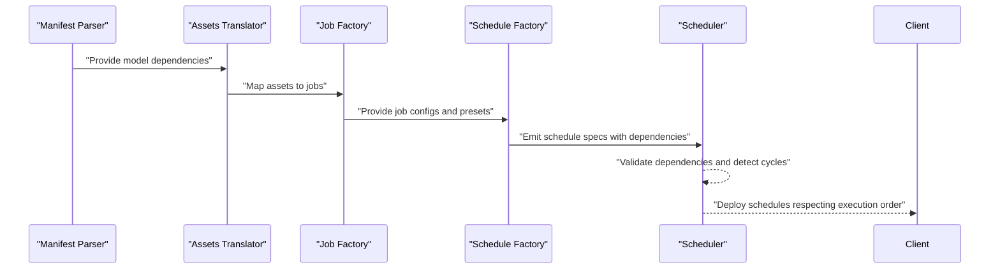
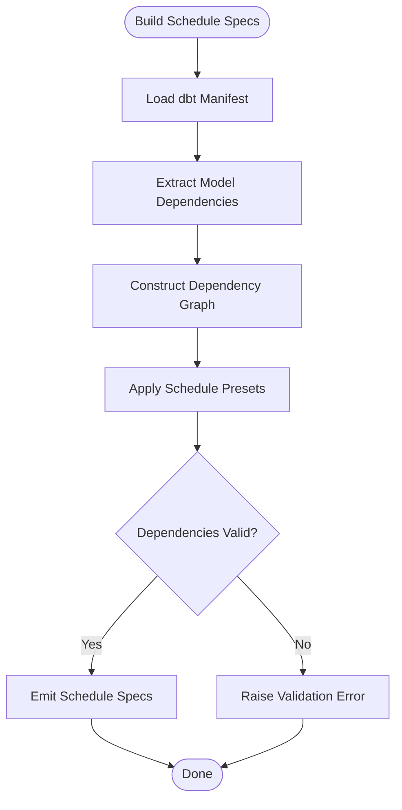
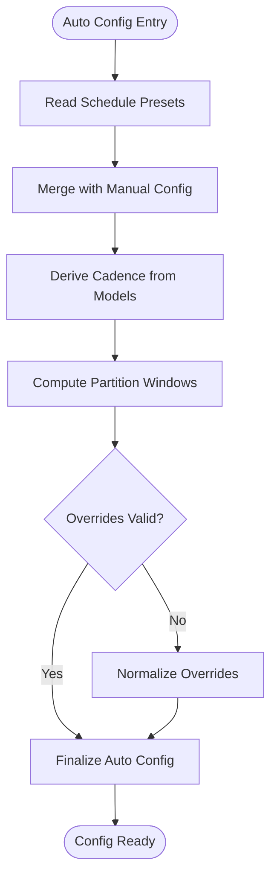
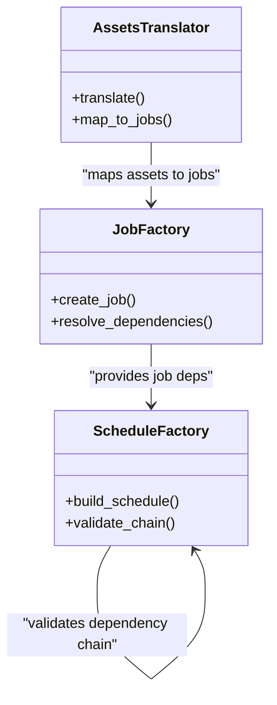
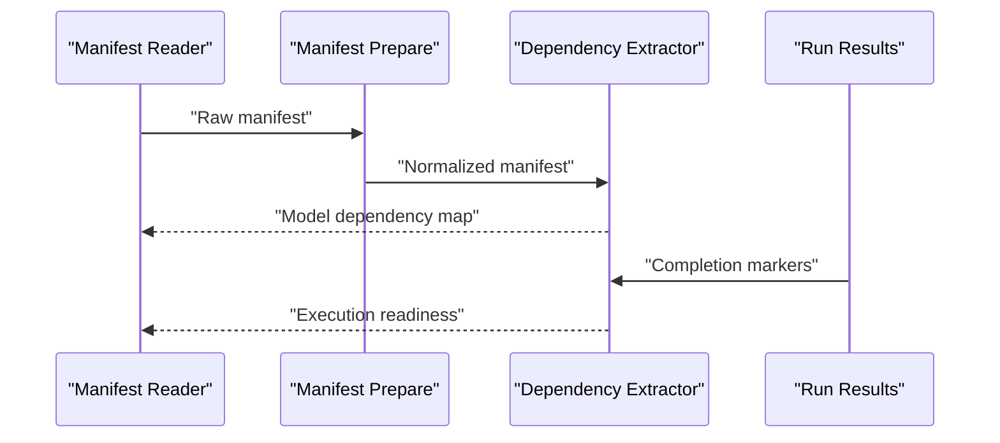
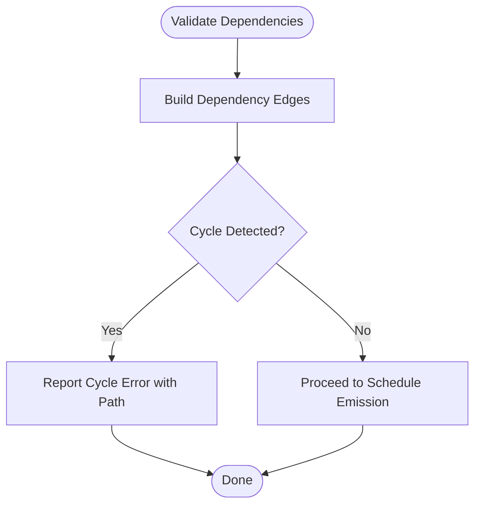
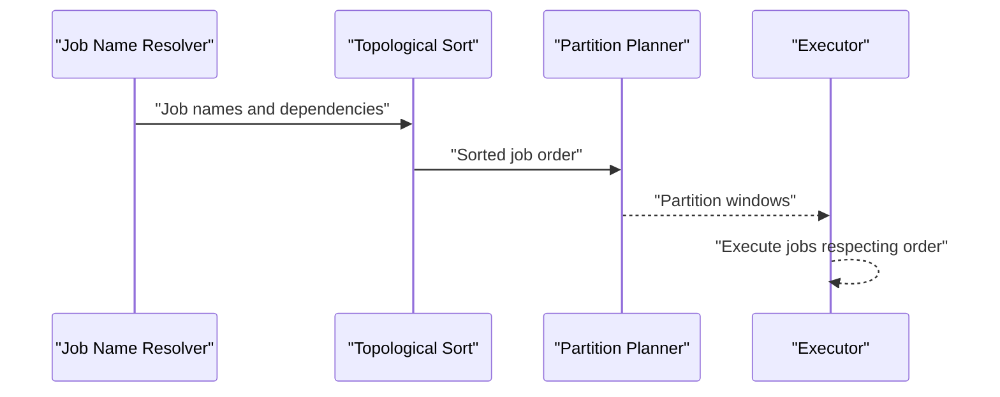
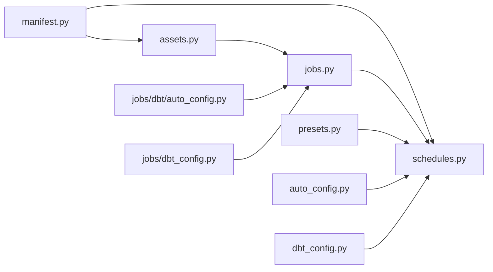

# Schedule Dependency Management

<cite>
**Referenced Files in This Document**
- [schedules.py](file://src/dbt_dagsterizer/schedules/dbt/schedules.py)
- [factory.py](file://src/dbt_dagsterizer/schedules/dbt/factory.py)
- [auto_config.py](file://src/dbt_dagsterizer/schedules/dbt/auto_config.py)
- [presets.py](file://src/dbt_dagsterizer/schedules/dbt/presets.py)
- [dbt_config.py](file://src/dbt_dagsterizer/schedules/dbt_config.py)
- [jobs.py](file://src/dbt_dagsterizer/jobs/dbt/jobs.py)
- [factory.py](file://src/dbt_dagsterizer/jobs/dbt/factory.py)
- [auto_config.py](file://src/dbt_dagsterizer/jobs/dbt/auto_config.py)
- [dbt_config.py](file://src/dbt_dagsterizer/jobs/dbt_config.py)
- [assets.py](file://src/dbt_dagsterizer/assets/dbt/assets.py)
- [translator.py](file://src/dbt_dagsterizer/assets/dbt/translator.py)
- [manifest.py](file://src/dbt_dagsterizer/dbt/manifest.py)
- [manifest_prepare.py](file://src/dbt_dagsterizer/dbt/manifest_prepare.py)
- [run_results.py](file://src/dbt_dagsterizer/dbt/run_results.py)
- [test_dbt_schedule_presets.py](file://tests/test_dbt_schedule_presets.py)
</cite>

## Table of Contents
1. [Introduction](#introduction)
2. [Project Structure](#project-structure)
3. [Core Components](#core-components)
4. [Architecture Overview](#architecture-overview)
5. [Detailed Component Analysis](#detailed-component-analysis)
6. [Dependency Analysis](#dependency-analysis)
7. [Performance Considerations](#performance-considerations)
8. [Troubleshooting Guide](#troubleshooting-guide)
9. [Conclusion](#conclusion)

## Introduction
This document explains how schedule dependency management works in dbt-dagsterizer. It focuses on how schedule dependencies are resolved, validated against dbt model dependencies and job configurations, and how asset jobs, model dependencies, and schedule execution order interrelate. It covers dependency validation, circular dependency detection, error handling, schedule job name resolution, asset-to-job mapping, dependency chain analysis, and practical strategies for complex dependency scenarios. It also addresses performance implications and optimization techniques.

## Project Structure
The schedule dependency management spans several modules:
- Schedules: schedule creation, preset handling, and automatic configuration
- Jobs: job generation and configuration aligned with schedules
- Assets: asset translation and mapping to jobs
- Manifest: dbt manifest parsing and dependency extraction
- Tests: schedule preset validation and integration checks

```mermaid
graph TB
subgraph "Schedules"
SchedPy["schedules.py"]
SchedFactory["factory.py"]
SchedAuto["auto_config.py"]
SchedPresets["presets.py"]
SchedCfg["dbt_config.py"]
end
subgraph "Jobs"
JobPy["jobs.py"]
JobFactory["factory.py"]
JobAuto["auto_config.py"]
JobCfg["dbt_config.py"]
end
subgraph "Assets"
AssetsPy["assets.py"]
Translator["translator.py"]
end
subgraph "Manifest"
Manifest["manifest.py"]
ManifestPrepare["manifest_prepare.py"]
RunResults["run_results.py"]
end
SchedPy --> SchedFactory
SchedPy --> SchedAuto
SchedPy --> SchedPresets
SchedPy --> SchedCfg
SchedFactory --> JobFactory
SchedFactory --> AssetsPy
SchedFactory --> Manifest
JobPy --> JobFactory
JobPy --> JobAuto
JobPy --> JobCfg
AssetsPy --> Translator
AssetsPy --> Manifest
Manifest --> ManifestPrepare
Manifest --> RunResults
```

**Diagram sources**
- [schedules.py](file://src/dbt_dagsterizer/schedules/dbt/schedules.py)
- [factory.py](file://src/dbt_dagsterizer/schedules/dbt/factory.py)
- [auto_config.py](file://src/dbt_dagsterizer/schedules/dbt/auto_config.py)
- [presets.py](file://src/dbt_dagsterizer/schedules/dbt/presets.py)
- [dbt_config.py](file://src/dbt_dagsterizer/schedules/dbt_config.py)
- [jobs.py](file://src/dbt_dagsterizer/jobs/dbt/jobs.py)
- [factory.py](file://src/dbt_dagsterizer/jobs/dbt/factory.py)
- [auto_config.py](file://src/dbt_dagsterizer/jobs/dbt/auto_config.py)
- [dbt_config.py](file://src/dbt_dagsterizer/jobs/dbt_config.py)
- [assets.py](file://src/dbt_dagsterizer/assets/dbt/assets.py)
- [translator.py](file://src/dbt_dagsterizer/assets/dbt/translator.py)
- [manifest.py](file://src/dbt_dagsterizer/dbt/manifest.py)
- [manifest_prepare.py](file://src/dbt_dagsterizer/dbt/manifest_prepare.py)
- [run_results.py](file://src/dbt_dagsterizer/dbt/run_results.py)

**Section sources**
- [schedules.py](file://src/dbt_dagsterizer/schedules/dbt/schedules.py)
- [jobs.py](file://src/dbt_dagsterizer/jobs/dbt/jobs.py)
- [assets.py](file://src/dbt_dagsterizer/assets/dbt/assets.py)
- [manifest.py](file://src/dbt_dagsterizer/dbt/manifest.py)

## Core Components
- Schedule definition and resolution: constructs schedule specs from dbt artifacts and job configurations
- Automatic configuration: derives schedule cadence and partitions from dbt models and presets
- Asset-to-job mapping: translates dbt assets into Dagster jobs and schedules
- Manifest-driven dependency extraction: reads dbt manifest to build dependency graphs
- Validation and error handling: ensures dependencies are valid, detects cycles, and surfaces actionable errors

Key responsibilities:
- Resolve schedule dependencies from dbt model graph and job presets
- Validate that schedule execution respects upstream dependencies
- Detect and prevent circular dependencies
- Map assets to jobs and propagate dependency chains
- Optimize schedule performance via partition-aware scheduling and minimal overlap

**Section sources**
- [schedules.py](file://src/dbt_dagsterizer/schedules/dbt/schedules.py)
- [factory.py](file://src/dbt_dagsterizer/schedules/dbt/factory.py)
- [auto_config.py](file://src/dbt_dagsterizer/schedules/dbt/auto_config.py)
- [presets.py](file://src/dbt_dagsterizer/schedules/dbt/presets.py)
- [dbt_config.py](file://src/dbt_dagsterizer/schedules/dbt_config.py)
- [jobs.py](file://src/dbt_dagsterizer/jobs/dbt/jobs.py)
- [assets.py](file://src/dbt_dagsterizer/assets/dbt/assets.py)
- [manifest.py](file://src/dbt_dagsterizer/dbt/manifest.py)

## Architecture Overview
The schedule dependency pipeline integrates dbt manifests, asset translation, job factories, and schedule factories to produce Dagster schedules that honor dbt model dependencies.



**Diagram sources**
- [manifest.py](file://src/dbt_dagsterizer/dbt/manifest.py)
- [assets.py](file://src/dbt_dagsterizer/assets/dbt/assets.py)
- [translator.py](file://src/dbt_dagsterizer/assets/dbt/translator.py)
- [jobs.py](file://src/dbt_dagsterizer/jobs/dbt/jobs.py)
- [factory.py](file://src/dbt_dagsterizer/schedules/dbt/factory.py)
- [schedules.py](file://src/dbt_dagsterizer/schedules/dbt/schedules.py)

## Detailed Component Analysis

### Schedule Definition and Resolution
- Schedule specs are built from dbt manifest and job configurations
- Dependencies are extracted from the dbt model graph and enforced in schedule execution order
- Preset-driven cadence and partitioning inform schedule frequency and partition windows



**Diagram sources**
- [schedules.py](file://src/dbt_dagsterizer/schedules/dbt/schedules.py)
- [presets.py](file://src/dbt_dagsterizer/schedules/dbt/presets.py)
- [manifest.py](file://src/dbt_dagsterizer/dbt/manifest.py)

**Section sources**
- [schedules.py](file://src/dbt_dagsterizer/schedules/dbt/schedules.py)
- [presets.py](file://src/dbt_dagsterizer/schedules/dbt/presets.py)

### Automatic Configuration and Presets
- Automatic configuration derives schedule cadence and partitioning from dbt models and preset rules
- Presets define default schedules per model or group of models
- Overrides and manual adjustments are supported through configuration merging



**Diagram sources**
- [auto_config.py](file://src/dbt_dagsterizer/schedules/dbt/auto_config.py)
- [presets.py](file://src/dbt_dagsterizer/schedules/dbt/presets.py)
- [dbt_config.py](file://src/dbt_dagsterizer/schedules/dbt_config.py)

**Section sources**
- [auto_config.py](file://src/dbt_dagsterizer/schedules/dbt/auto_config.py)
- [presets.py](file://src/dbt_dagsterizer/schedules/dbt/presets.py)
- [dbt_config.py](file://src/dbt_dagsterizer/schedules/dbt_config.py)

### Asset-to-Job Mapping and Dependency Chain Analysis
- Assets are translated into jobs; each asset maps to one or more jobs depending on materialization and partitioning
- Dependency chains are traced from upstream assets/models to downstream jobs
- Chain analysis ensures that schedule execution respects upstream completion



**Diagram sources**
- [assets.py](file://src/dbt_dagsterizer/assets/dbt/assets.py)
- [translator.py](file://src/dbt_dagsterizer/assets/dbt/translator.py)
- [factory.py](file://src/dbt_dagsterizer/jobs/dbt/factory.py)
- [factory.py](file://src/dbt_dagsterizer/schedules/dbt/factory.py)

**Section sources**
- [assets.py](file://src/dbt_dagsterizer/assets/dbt/assets.py)
- [translator.py](file://src/dbt_dagsterizer/assets/dbt/translator.py)
- [factory.py](file://src/dbt_dagsterizer/jobs/dbt/factory.py)
- [factory.py](file://src/dbt_dagsterizer/schedules/dbt/factory.py)

### Manifest-Driven Dependency Extraction
- The manifest parser extracts dbt model dependencies and materialization metadata
- Manifest preparation normalizes inputs for downstream consumers
- Run results can be used to infer successful completions and partition boundaries



**Diagram sources**
- [manifest.py](file://src/dbt_dagsterizer/dbt/manifest.py)
- [manifest_prepare.py](file://src/dbt_dagsterizer/dbt/manifest_prepare.py)
- [run_results.py](file://src/dbt_dagsterizer/dbt/run_results.py)

**Section sources**
- [manifest.py](file://src/dbt_dagsterizer/dbt/manifest.py)
- [manifest_prepare.py](file://src/dbt_dagsterizer/dbt/manifest_prepare.py)
- [run_results.py](file://src/dbt_dagsterizer/dbt/run_results.py)

### Circular Dependency Detection and Error Handling
- During schedule spec construction, dependency edges are validated for cycles
- Errors are surfaced with actionable messages indicating offending models and paths
- Recovery strategies include disabling problematic schedules or adjusting dependencies



**Diagram sources**
- [schedules.py](file://src/dbt_dagsterizer/schedules/dbt/schedules.py)
- [factory.py](file://src/dbt_dagsterizer/schedules/dbt/factory.py)

**Section sources**
- [schedules.py](file://src/dbt_dagsterizer/schedules/dbt/schedules.py)
- [factory.py](file://src/dbt_dagsterizer/schedules/dbt/factory.py)

### Schedule Job Name Resolution and Execution Order
- Job names are derived from dbt model identifiers and optional overrides
- Execution order is determined by topological sorting of model dependencies
- Partition-aware scheduling aligns execution windows with data freshness and partition boundaries



**Diagram sources**
- [jobs.py](file://src/dbt_dagsterizer/jobs/dbt/jobs.py)
- [factory.py](file://src/dbt_dagsterizer/jobs/dbt/factory.py)
- [auto_config.py](file://src/dbt_dagsterizer/schedules/dbt/auto_config.py)

**Section sources**
- [jobs.py](file://src/dbt_dagsterizer/jobs/dbt/jobs.py)
- [factory.py](file://src/dbt_dagsterizer/jobs/dbt/factory.py)
- [auto_config.py](file://src/dbt_dagsterizer/schedules/dbt/auto_config.py)

### Complex Dependency Scenarios and Resolution Strategies
- Multi-hop upstream dependencies: resolve by expanding dependency chains and enforcing transitive ordering
- Conditional materializations: adjust schedule cadence based on incremental vs full-refresh models
- Partition drift and late data: use partition windows to avoid re-executing completed partitions
- Mixed materializations: separate incremental and full-refresh jobs into distinct schedules to minimize contention

Validation and testing:
- Integration tests validate schedule presets and dependency chains
- Tests ensure that complex scenarios do not introduce cycles or invalid dependencies

**Section sources**
- [test_dbt_schedule_presets.py](file://tests/test_dbt_schedule_presets.py)
- [presets.py](file://src/dbt_dagsterizer/schedules/dbt/presets.py)
- [auto_config.py](file://src/dbt_dagsterizer/schedules/dbt/auto_config.py)

## Dependency Analysis
This section maps how components depend on each other and how data flows across modules during schedule dependency management.



**Diagram sources**
- [manifest.py](file://src/dbt_dagsterizer/dbt/manifest.py)
- [assets.py](file://src/dbt_dagsterizer/assets/dbt/assets.py)
- [jobs.py](file://src/dbt_dagsterizer/jobs/dbt/jobs.py)
- [schedules.py](file://src/dbt_dagsterizer/schedules/dbt/schedules.py)
- [presets.py](file://src/dbt_dagsterizer/schedules/dbt/presets.py)
- [auto_config.py](file://src/dbt_dagsterizer/schedules/dbt/auto_config.py)
- [dbt_config.py](file://src/dbt_dagsterizer/schedules/dbt_config.py)
- [auto_config.py](file://src/dbt_dagsterizer/jobs/dbt/auto_config.py)
- [dbt_config.py](file://src/dbt_dagsterizer/jobs/dbt_config.py)

**Section sources**
- [manifest.py](file://src/dbt_dagsterizer/dbt/manifest.py)
- [assets.py](file://src/dbt_dagsterizer/assets/dbt/assets.py)
- [jobs.py](file://src/dbt_dagsterizer/jobs/dbt/jobs.py)
- [schedules.py](file://src/dbt_dagsterizer/schedules/dbt/schedules.py)

## Performance Considerations
- Minimize redundant schedule runs by aligning cadence with partition windows and materialization type
- Prefer incremental models where possible to reduce full-refresh overhead
- Use topological sorting to batch compatible jobs and reduce contention
- Cache and reuse normalized manifest data to avoid repeated parsing costs
- Limit schedule fan-out by grouping related models into fewer jobs when feasible

[No sources needed since this section provides general guidance]

## Troubleshooting Guide
Common issues and resolutions:
- Circular dependencies: review model dependencies and adjust to remove cycles; disable conflicting schedules
- Invalid job names: ensure naming follows Dagster conventions and dbt model naming rules
- Mismatched partitions: reconcile partition windows across dependent jobs; avoid overlapping re-runs
- Preset conflicts: merge presets carefully; prefer explicit overrides for problematic models
- Manifest parsing errors: validate dbt manifest completeness and integrity

Validation and testing:
- Use integration tests to verify schedule presets and dependency chains
- Confirm that circular dependency detection triggers appropriate errors
- Verify that asset-to-job mapping produces expected job graphs

**Section sources**
- [test_dbt_schedule_presets.py](file://tests/test_dbt_schedule_presets.py)
- [schedules.py](file://src/dbt_dagsterizer/schedules/dbt/schedules.py)
- [factory.py](file://src/dbt_dagsterizer/schedules/dbt/factory.py)

## Conclusion
Schedule dependency management in dbt-dagsterizer is driven by dbt manifests, asset translation, and job factories. By validating dependencies, detecting cycles, and aligning schedules with model materialization and partitioning, the system ensures reliable and efficient execution order. Proper configuration, mapping, and chain analysis enable robust handling of complex dependency scenarios while maintaining performance and operability.

[No sources needed since this section summarizes without analyzing specific files]