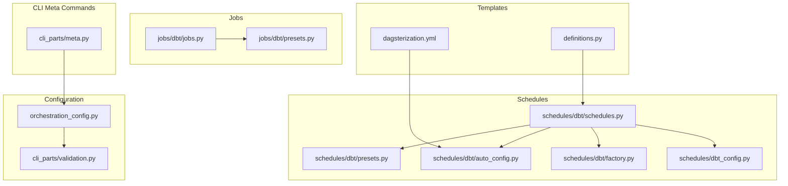
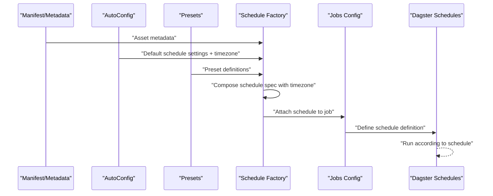
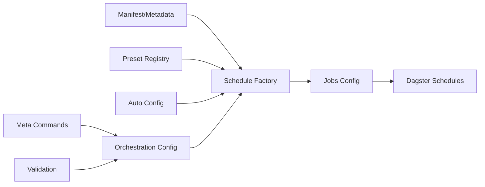

# Schedule Management

<cite>
**Referenced Files in This Document**
- [schedules.py](file://src/dbt_dagsterizer/schedules/dbt/schedules.py)
- [presets.py](file://src/dbt_dagsterizer/schedules/dbt/presets.py)
- [auto_config.py](file://src/dbt_dagsterizer/schedules/dbt/auto_config.py)
- [factory.py](file://src/dbt_dagsterizer/schedules/dbt/factory.py)
- [dbt_config.py](file://src/dbt_dagsterizer/schedules/dbt_config.py)
- [jobs.py](file://src/dbt_dagsterizer/jobs/dbt/jobs.py)
- [presets.py](file://src/dbt_dagsterizer/jobs/dbt/presets.py)
- [test_dbt_schedule_presets.py](file://tests/test_dbt_schedule_presets.py)
- [meta.py](file://src/dbt_dagsterizer/cli_parts/meta.py)
- [orchestration_config.py](file://src/dbt_dagsterizer/orchestration_config.py)
- [validation.py](file://src/dbt_dagsterizer/cli_parts/validation.py)
- [test_timezone.py](file://tests/test_timezone.py)
- [dagsterization.yml](file://src/dbt_dagsterizer/project_templates/luban-dagster-dbt-starrocks-code-location-source-template/dagsterization.yml)
- [definitions.py](file://src/dbt_dagsterizer/project_templates/luban-dagster-dbt-starrocks-code-location-source-template/src/{{cookiecutter.package_name}}/definitions.py)
</cite>

## Update Summary
**Changes Made**
- Added comprehensive documentation for the new global timezone configuration capability
- Updated timezone handling section to cover the new meta timezone command
- Enhanced schedule generation documentation to reflect timezone inheritance from global configuration
- Added timezone validation and error handling documentation
- Updated troubleshooting guide with timezone-related issues
- Added examples of timezone configuration and usage patterns

## Table of Contents
1. [Introduction](#introduction)
2. [Project Structure](#project-structure)
3. [Core Components](#core-components)
4. [Architecture Overview](#architecture-overview)
5. [Detailed Component Analysis](#detailed-component-analysis)
6. [Dependency Analysis](#dependency-analysis)
7. [Performance Considerations](#performance-considerations)
8. [Troubleshooting Guide](#troubleshooting-guide)
9. [Conclusion](#conclusion)
10. [Appendices](#appendices)

## Introduction
This document explains schedule management in dbt-dagsterizer, focusing on time-based scheduling for dbt models. It covers automatic schedule generation from model metadata, manual configuration via YAML presets, schedule presets for common patterns (daily, hourly, and custom intervals), schedule dependency management, timezone handling, overrides, naming conventions, tags, metadata assignment, configuration options for behavior, execution windows, and resource allocation. It also provides examples of custom schedule creation and advanced scheduling patterns.

**Updated** Added comprehensive coverage of the new global timezone configuration capability that allows setting the execution timezone for all schedules via the `meta timezone` command.

## Project Structure
The schedule subsystem is organized under the schedules package with dedicated modules for DBT schedules, presets, auto-configuration, and factory logic. Jobs-related schedule presets and configuration are co-located under jobs. Tests validate schedule preset behavior and timezone configuration. Template configurations demonstrate real-world usage.

**Diagram sources**
- [schedules.py](file://src/dbt_dagsterizer/schedules/dbt/schedules.py)
- [presets.py](file://src/dbt_dagsterizer/schedules/dbt/presets.py)
- [auto_config.py](file://src/dbt_dagsterizer/schedules/dbt/auto_config.py)
- [factory.py](file://src/dbt_dagsterizer/schedules/dbt/factory.py)
- [dbt_config.py](file://src/dbt_dagsterizer/schedules/dbt_config.py)
- [jobs.py](file://src/dbt_dagsterizer/jobs/dbt/jobs.py)
- [presets.py](file://src/dbt_dagsterizer/jobs/dbt/presets.py)
- [meta.py](file://src/dbt_dagsterizer/cli_parts/meta.py)
- [orchestration_config.py](file://src/dbt_dagsterizer/orchestration_config.py)
- [validation.py](file://src/dbt_dagsterizer/cli_parts/validation.py)
- [dagsterization.yml](file://src/dbt_dagsterizer/project_templates/luban-dagster-dbt-starrocks-code-location-source-template/dagsterization.yml)
- [definitions.py](file://src/dbt_dagsterizer/project_templates/luban-dagster-dbt-starrocks-code-location-source-template/src/{{cookiecutter.package_name}}/definitions.py)

**Section sources**
- [schedules.py](file://src/dbt_dagsterizer/schedules/dbt/schedules.py)
- [presets.py](file://src/dbt_dagsterizer/schedules/dbt/presets.py)
- [auto_config.py](file://src/dbt_dagsterizer/schedules/dbt/auto_config.py)
- [factory.py](file://src/dbt_dagsterizer/schedules/dbt/factory.py)
- [dbt_config.py](file://src/dbt_dagsterizer/schedules/dbt_config.py)
- [jobs.py](file://src/dbt_dagsterizer/jobs/dbt/jobs.py)
- [presets.py](file://src/dbt_dagsterizer/jobs/dbt/presets.py)
- [meta.py](file://src/dbt_dagsterizer/cli_parts/meta.py)
- [orchestration_config.py](file://src/dbt_dagsterizer/orchestration_config.py)
- [validation.py](file://src/dbt_dagsterizer/cli_parts/validation.py)
- [dagsterization.yml](file://src/dbt_dagsterizer/project_templates/luban-dagster-dbt-starrocks-code-location-source-template/dagsterization.yml)
- [definitions.py](file://src/dbt_dagsterizer/project_templates/luban-dagster-dbt-starrocks-code-location-source-template/src/{{cookiecutter.package_name}}/definitions.py)

## Core Components
- Schedule factory: constructs schedule definitions for dbt assets from metadata and presets.
- Preset registry: defines common scheduling patterns (daily, hourly, custom intervals).
- Auto-config: reads project-level configuration and applies defaults for schedules, including global timezone settings.
- DBT config: merges schedule settings into job definitions.
- Jobs presets: provides schedule-related job configuration aligned with schedule presets.
- CLI meta commands: provide timezone configuration capabilities.
- Templates: demonstrate schedule usage in generated projects.

Key responsibilities:
- Automatic schedule generation from model metadata and project configuration.
- Manual override and customization via YAML presets.
- Global timezone configuration via CLI meta command.
- Consistent naming, tagging, and metadata assignment for schedules.
- Execution window and resource allocation controls.

**Section sources**
- [factory.py](file://src/dbt_dagsterizer/schedules/dbt/factory.py)
- [presets.py](file://src/dbt_dagsterizer/schedules/dbt/presets.py)
- [auto_config.py](file://src/dbt_dagsterizer/schedules/dbt/auto_config.py)
- [dbt_config.py](file://src/dbt_dagsterizer/schedules/dbt_config.py)
- [jobs.py](file://src/dbt_dagsterizer/jobs/dbt/jobs.py)
- [presets.py](file://src/dbt_dagsterizer/jobs/dbt/presets.py)
- [meta.py](file://src/dbt_dagsterizer/cli_parts/meta.py)

## Architecture Overview
The schedule pipeline integrates model metadata, project configuration, and preset definitions to produce Dagster schedules. Factory logic composes schedules per asset, while auto-config supplies defaults including global timezone settings. Jobs presets align execution behavior with schedule cadence.

**Diagram sources**
- [schedules.py](file://src/dbt_dagsterizer/schedules/dbt/schedules.py)
- [presets.py](file://src/dbt_dagsterizer/schedules/dbt/presets.py)
- [auto_config.py](file://src/dbt_dagsterizer/schedules/dbt/auto_config.py)
- [factory.py](file://src/dbt_dagsterizer/schedules/dbt/factory.py)
- [jobs.py](file://src/dbt_dagsterizer/jobs/dbt/jobs.py)

## Detailed Component Analysis

### Schedule Presets
Schedule presets define standardized cadences and behaviors:
- Daily cadence with optional start time and execution windows.
- Hourly cadence with optional execution windows.
- Custom interval presets supporting arbitrary cron-like expressions.
- Execution window controls to constrain runs to specific time ranges.
- Resource allocation hints for job execution.
- **Global timezone integration**: Presets now support timezone specification for consistent scheduling across different regions.

Behavioral notes:
- Presets encapsulate timezone-aware scheduling preferences.
- Execution windows prevent runs outside desired periods.
- Resource hints guide executor capacity selection.
- Timezone parameter allows per-schedule timezone override.

**Section sources**
- [presets.py](file://src/dbt_dagsterizer/schedules/dbt/presets.py)
- [presets.py](file://src/dbt_dagsterizer/jobs/dbt/presets.py)

### Auto Configuration
Auto configuration reads project-level settings and applies defaults:
- Loads schedule defaults from project configuration.
- Merges global settings with per-asset overrides.
- **Inherits global timezone**: Reads timezone from orchestration configuration for all schedules.
- Ensures consistent timezone handling across schedules.
- Provides fallbacks for missing settings.

Integration points:
- Reads project configuration and augments schedule specs.
- Supplies default cadence and execution window when unspecified.
- **Injects global timezone into all schedule specifications**.

**Section sources**
- [auto_config.py](file://src/dbt_dagsterizer/schedules/dbt/auto_config.py)
- [dbt_config.py](file://src/dbt_dagsterizer/schedules/dbt_config.py)

### Schedule Factory
The factory composes schedule definitions:
- Builds schedule specs from model metadata and presets.
- Applies auto-config defaults and manual overrides.
- **Inherits global timezone**: Uses timezone from global configuration when not explicitly specified.
- Attaches schedules to corresponding dbt jobs.
- Enforces naming conventions and tag assignment.

Output characteristics:
- Unique schedule names derived from asset keys.
- Tags reflecting model lineage and schedule cadence.
- Metadata indicating schedule type and execution constraints.
- **Consistent timezone application across all schedules**.

**Section sources**
- [factory.py](file://src/dbt_dagsterizer/schedules/dbt/factory.py)
- [schedules.py](file://src/dbt_dagsterizer/schedules/dbt/schedules.py)

### Jobs Integration
Jobs configuration aligns execution behavior with schedule presets:
- Links schedule definitions to job definitions.
- Applies resource allocation and execution window constraints.
- Supports incremental vs full-refresh strategies via job-level settings.

**Section sources**
- [jobs.py](file://src/dbt_dagsterizer/jobs/dbt/jobs.py)
- [presets.py](file://src/dbt_dagsterizer/jobs/dbt/presets.py)

### Template-Based Usage
Generated projects demonstrate practical schedule usage:
- Project configuration enables automatic schedule generation.
- Definitions module wires schedules into the repository.
- Real-world cadences and execution windows are applied consistently.
- **Global timezone configuration is preserved across template generations**.

**Section sources**
- [dagsterization.yml](file://src/dbt_dagsterizer/project_templates/luban-dagster-dbt-starrocks-code-location-source-template/dagsterization.yml)
- [definitions.py](file://src/dbt_dagsterizer/project_templates/luban-dagster-dbt-starrocks-code-location-source-template/src/{{cookiecutter.package_name}}/definitions.py)

### Incremental Model Scheduling and Full-Refresh Strategies
Incremental models:
- Use daily or hourly presets depending on data freshness needs.
- Execution windows can limit incremental runs to off-peak hours.
- Partition-aware scheduling ensures correct backfill behavior.
- **Timezone-aware scheduling prevents cross-day boundary issues**.

Full-refresh strategies:
- Weekly or monthly cadences reduce compute costs.
- Execution windows can stagger refreshes to avoid contention.
- Resource allocation can be increased for heavy refresh jobs.
- **Global timezone ensures consistent refresh timing across different regions**.

**Section sources**
- [presets.py](file://src/dbt_dagsterizer/schedules/dbt/presets.py)
- [presets.py](file://src/dbt_dagsterizer/jobs/dbt/presets.py)

### Schedule Naming Conventions, Tags, and Metadata Assignment
Naming:
- Derived from asset keys to ensure uniqueness and traceability.

Tagging:
- Tags reflect model lineage, schedule cadence, and execution constraints.
- Useful for filtering and observability.

Metadata:
- Stores schedule type, cadence, and execution window details.
- **Includes timezone information for schedule semantics**.
- Enables downstream systems to interpret and act on schedule semantics.

**Section sources**
- [factory.py](file://src/dbt_dagsterizer/schedules/dbt/factory.py)

### Schedule Overrides
Manual overrides allow per-asset control:
- Override cadence, execution windows, and resource allocation.
- **Override timezone per schedule**: Individual schedules can specify different timezones.
- Merge strategy prioritizes explicit overrides over defaults.
- Validation ensures overrides remain within supported bounds.

**Section sources**
- [auto_config.py](file://src/dbt_dagsterizer/schedules/dbt/auto_config.py)
- [dbt_config.py](file://src/dbt_dagsterizer/schedules/dbt_config.py)

### Timezone Handling
**Updated** The timezone configuration system now includes comprehensive global timezone management:

Global timezone configuration:
- **New meta timezone command**: `dbt-dagsterizer meta timezone --timezone "Asia/Shanghai"`
- **CLI integration**: Sets timezone in dagsterization.yml automatically.
- **Default fallback**: UTC when no timezone is specified.
- **Validation**: Ensures timezone values are valid IANA timezone names.

Schedule timezone inheritance:
- Global timezone from orchestration configuration (dagsterization.yml).
- Inherited by all schedules when not explicitly overridden.
- **Per-schedule override**: Individual schedules can specify different timezones.
- **Consistent timezone resolution**: All schedules use the same timezone context.

Execution timezone application:
- Presets accept timezone parameter for timezone-aware scheduling.
- Factory logic injects global timezone into schedule specifications.
- Generated schedules maintain timezone correctness across environments.
- **Cross-region scheduling**: Supports international deployments with localized execution times.

**Section sources**
- [presets.py](file://src/dbt_dagsterizer/schedules/dbt/presets.py)
- [auto_config.py](file://src/dbt_dagsterizer/schedules/dbt/auto_config.py)
- [meta.py](file://src/dbt_dagsterizer/cli_parts/meta.py)
- [orchestration_config.py](file://src/dbt_dagsterizer/orchestration_config.py)
- [validation.py](file://src/dbt_dagsterizer/cli_parts/validation.py)
- [test_timezone.py](file://tests/test_timezone.py)

### Schedule Dependency Management
Dependencies:
- Schedules coordinate upstream and downstream assets.
- Execution windows prevent overlapping runs that could cause conflicts.
- Resource allocation avoids contention during peak hours.
- **Timezone-aware dependency coordination**: Prevents cross-day boundary conflicts.

Patterns:
- Downstream assets scheduled after upstream completion.
- Backfill-friendly ordering respects partition boundaries.
- **Global timezone ensures consistent dependency ordering across regions**.

**Section sources**
- [factory.py](file://src/dbt_dagsterizer/schedules/dbt/factory.py)
- [jobs.py](file://src/dbt_dagsterizer/jobs/dbt/jobs.py)

### Configuration Options for Schedule Behavior, Execution Windows, and Resource Allocation
Behavior:
- Cadence selection (daily, hourly, custom).
- Execution window constraints.
- Incremental vs full-refresh behavior.
- **Global timezone configuration**.

Execution windows:
- Define allowed start/end times per day.
- Support timezone-aware boundaries.
- **Cross-timezone execution window validation**.

Resource allocation:
- CPU/memory hints for job execution.
- Queue priorities for scheduling fairness.

**Section sources**
- [presets.py](file://src/dbt_dagsterizer/schedules/dbt/presets.py)
- [presets.py](file://src/dbt_dagsterizer/jobs/dbt/presets.py)
- [dbt_config.py](file://src/dbt_dagsterizer/schedules/dbt_config.py)

### Examples of Custom Schedule Creation and Advanced Scheduling Patterns
Custom cadences:
- Define custom interval presets for specialized workflows.
- Combine execution windows with cadence to optimize resource usage.
- **Configure timezone per custom schedule**.

Advanced patterns:
- **Multi-timezone scheduling**: Create separate schedules for different regions with localized execution times.
- Hierarchical scheduling: group related assets by domain and apply shared cadences.
- Graceful backfills: stagger refreshes to minimize impact.
- **Global timezone management**: Use meta timezone command to set consistent timezone across all schedules.

Validation and testing:
- Use tests to verify preset behavior and edge cases.
- Validate merge of auto-config defaults and manual overrides.
- **Test timezone configuration and validation**.

**Section sources**
- [presets.py](file://src/dbt_dagsterizer/schedules/dbt/presets.py)
- [test_dbt_schedule_presets.py](file://tests/test_dbt_schedule_presets.py)
- [test_timezone.py](file://tests/test_timezone.py)

## Dependency Analysis
The schedule subsystem depends on:
- Manifest/metadata for asset-level scheduling signals.
- Preset registry for standardized cadences.
- Auto-config for project-level defaults including timezone settings.
- Jobs configuration for execution alignment.
- **CLI meta commands for timezone configuration**.
- **Orchestration configuration for timezone persistence**.

**Diagram sources**
- [schedules.py](file://src/dbt_dagsterizer/schedules/dbt/schedules.py)
- [presets.py](file://src/dbt_dagsterizer/schedules/dbt/presets.py)
- [auto_config.py](file://src/dbt_dagsterizer/schedules/dbt/auto_config.py)
- [factory.py](file://src/dbt_dagsterizer/schedules/dbt/factory.py)
- [jobs.py](file://src/dbt_dagsterizer/jobs/dbt/jobs.py)
- [meta.py](file://src/dbt_dagsterizer/cli_parts/meta.py)
- [orchestration_config.py](file://src/dbt_dagsterizer/orchestration_config.py)
- [validation.py](file://src/dbt_dagsterizer/cli_parts/validation.py)

**Section sources**
- [schedules.py](file://src/dbt_dagsterizer/schedules/dbt/schedules.py)
- [presets.py](file://src/dbt_dagsterizer/schedules/dbt/presets.py)
- [auto_config.py](file://src/dbt_dagsterizer/schedules/dbt/auto_config.py)
- [factory.py](file://src/dbt_dagsterizer/schedules/dbt/factory.py)
- [jobs.py](file://src/dbt_dagsterizer/jobs/dbt/jobs.py)
- [meta.py](file://src/dbt_dagsterizer/cli_parts/meta.py)
- [orchestration_config.py](file://src/dbt_dagsterizer/orchestration_config.py)
- [validation.py](file://src/dbt_dagsterizer/cli_parts/validation.py)

## Performance Considerations
- Execution windows reduce contention and improve throughput.
- Resource allocation hints help the executor place workloads efficiently.
- Incremental scheduling minimizes compute by limiting data processed per run.
- Staggered backfills prevent cascading failures and reduce peak load.
- **Timezone consistency reduces scheduling overhead and prevents timezone-related errors**.

## Troubleshooting Guide
**Updated** Common issues and resolutions including timezone-related problems:

Common issues and resolutions:
- Unexpected cadence: verify auto-config defaults and manual overrides.
- **Timezone misconfiguration**: verify global timezone setting and individual schedule timezone overrides.
- **Invalid timezone values**: ensure IANA timezone names are used (e.g., "UTC", "Asia/Shanghai").
- Execution window misalignment: confirm timezone settings and window boundaries.
- Resource exhaustion: adjust resource allocation and consider queue priorities.
- Naming conflicts: ensure unique naming conventions and asset key derivation.

**New timezone-specific troubleshooting**:
- **Meta command failures**: verify timezone argument format and IANA timezone validity.
- **Schedule timezone inheritance**: check that global timezone is properly set in dagsterization.yml.
- **Cross-timezone scheduling issues**: ensure schedules are configured for the correct regional timezone.
- **Validation errors**: review timezone validation messages and fix invalid timezone values.

Validation steps:
- Review preset behavior with tests.
- Inspect merged schedule specs for correctness.
- Confirm template-generated schedules match expectations.
- **Test timezone configuration with CLI meta timezone command**.
- **Verify timezone persistence in dagsterization.yml**.

**Section sources**
- [test_dbt_schedule_presets.py](file://tests/test_dbt_schedule_presets.py)
- [auto_config.py](file://src/dbt_dagsterizer/schedules/dbt/auto_config.py)
- [dbt_config.py](file://src/dbt_dagsterizer/schedules/dbt_config.py)
- [test_timezone.py](file://tests/test_timezone.py)

## Conclusion
dbt-dagsterizer provides a robust, extensible framework for time-based scheduling of dbt models. Automatic generation from metadata, combined with manual presets and overrides, enables flexible and predictable scheduling. With strong support for incremental and full-refresh strategies, execution windows, resource allocation, and comprehensive timezone handling, teams can build reliable, observable pipelines tailored to their operational needs.

**Updated** The new global timezone configuration capability via the `meta timezone` command enhances the platform's international deployment capabilities, allowing teams to set consistent execution timezones across all schedules while maintaining flexibility for per-schedule overrides.

## Appendices
- Example references:
  - [dagsterization.yml](file://src/dbt_dagsterizer/project_templates/luban-dagster-dbt-starrocks-code-location-source-template/dagsterization.yml)
  - [definitions.py](file://src/dbt_dagsterizer/project_templates/luban-dagster-dbt-starrocks-code-location-source-template/src/{{cookiecutter.package_name}}/definitions.py)
  - [presets.py](file://src/dbt_dagsterizer/schedules/dbt/presets.py)
  - [auto_config.py](file://src/dbt_dagsterizer/schedules/dbt/auto_config.py)
  - [factory.py](file://src/dbt_dagsterizer/schedules/dbt/factory.py)
  - [jobs.py](file://src/dbt_dagsterizer/jobs/dbt/jobs.py)
  - [presets.py](file://src/dbt_dagsterizer/jobs/dbt/presets.py)
  - [test_dbt_schedule_presets.py](file://tests/test_dbt_schedule_presets.py)
  - [meta.py](file://src/dbt_dagsterizer/cli_parts/meta.py)
  - [orchestration_config.py](file://src/dbt_dagsterizer/orchestration_config.py)
  - [validation.py](file://src/dbt_dagsterizer/cli_parts/validation.py)
  - [test_timezone.py](file://tests/test_timezone.py)