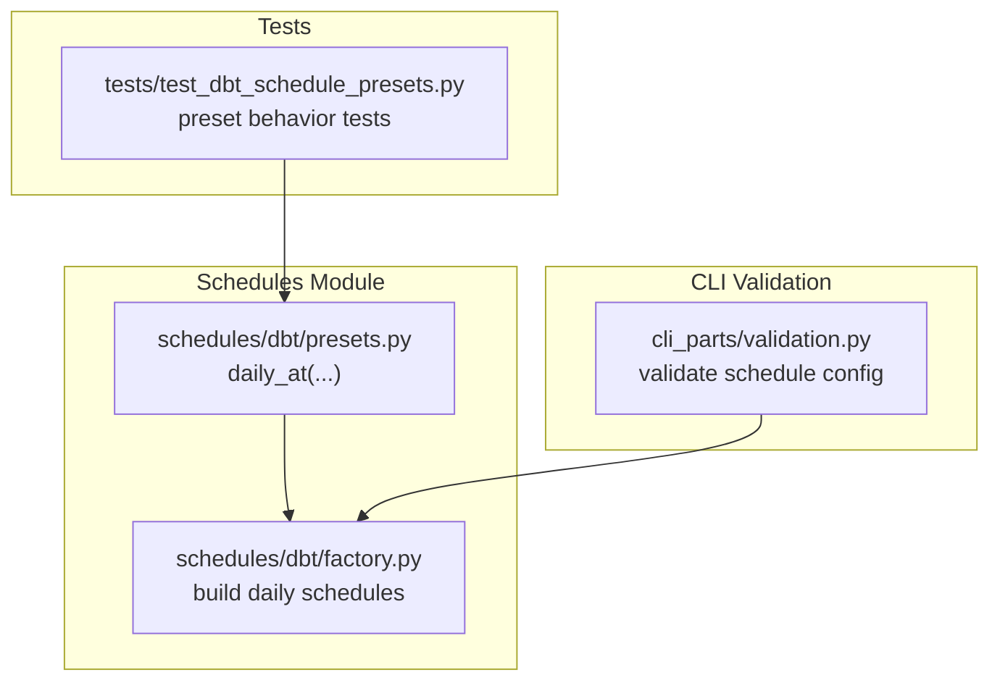
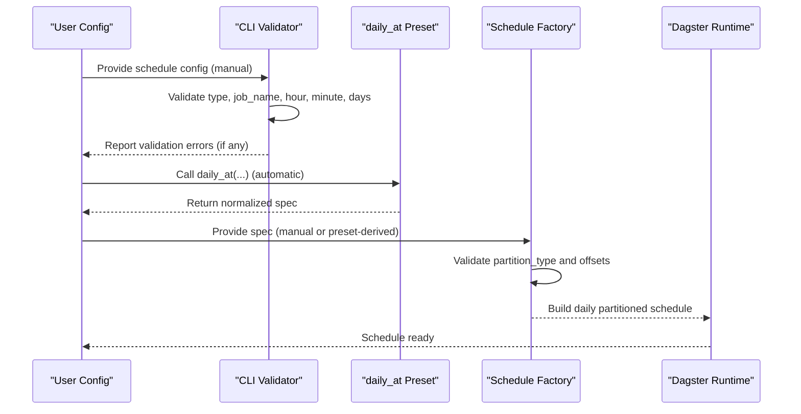
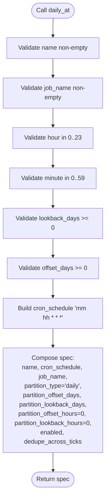
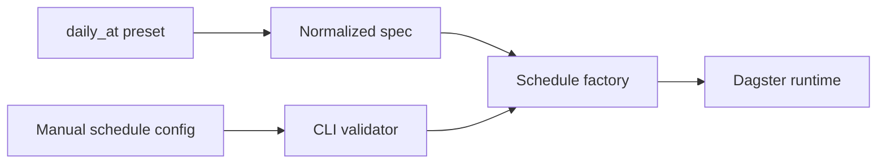

# Schedule Presets

<cite>
**Referenced Files in This Document**
- [presets.py](file://src/dbt_dagsterizer/schedules/dbt/presets.py)
- [factory.py](file://src/dbt_dagsterizer/schedules/dbt/factory.py)
- [validation.py](file://src/dbt_dagsterizer/cli_parts/validation.py)
- [test_dbt_schedule_presets.py](file://tests/test_dbt_schedule_presets.py)
</cite>

## Table of Contents
1. [Introduction](#introduction)
2. [Project Structure](#project-structure)
3. [Core Components](#core-components)
4. [Architecture Overview](#architecture-overview)
5. [Detailed Component Analysis](#detailed-component-analysis)
6. [Dependency Analysis](#dependency-analysis)
7. [Performance Considerations](#performance-considerations)
8. [Troubleshooting Guide](#troubleshooting-guide)
9. [Conclusion](#conclusion)

## Introduction
This document explains schedule presets in dbt-dagsterizer with a focus on the daily_at preset. It covers predefined scheduling patterns, configuration parameters, validation rules, timezone handling, and schedule generation logic. It also describes how presets integrate with both automatic and manual schedule configuration, provides examples for different model types and scheduling patterns, and outlines customization, tuning, and best practices for various deployment scenarios.

## Project Structure
The schedule presets live under the schedules module and are consumed by the schedule factory during orchestration definition. Validation logic ensures user-provided schedule configurations conform to expected shapes and values.

**Diagram sources**
- [presets.py:1-38](file://src/dbt_dagsterizer/schedules/dbt/presets.py#L1-L38)
- [factory.py:77-98](file://src/dbt_dagsterizer/schedules/dbt/factory.py#L77-L98)
- [validation.py:85-105](file://src/dbt_dagsterizer/cli_parts/validation.py#L85-L105)
- [test_dbt_schedule_presets.py:1-34](file://tests/test_dbt_schedule_presets.py#L1-L34)

**Section sources**
- [presets.py:1-38](file://src/dbt_dagsterizer/schedules/dbt/presets.py#L1-L38)
- [factory.py:77-98](file://src/dbt_dagsterizer/schedules/dbt/factory.py#L77-L98)
- [validation.py:85-105](file://src/dbt_dagsterizer/cli_parts/validation.py#L85-L105)
- [test_dbt_schedule_presets.py:1-34](file://tests/test_dbt_schedule_presets.py#L1-L34)

## Core Components
- daily_at preset: Generates a daily partitioned schedule specification with cron timing, partition offsets, and runtime flags. It enforces parameter bounds and returns a normalized dictionary suitable for downstream schedule construction.

Key behaviors:
- Validates non-empty name and job_name, and numeric bounds for hour and minute.
- Enforces non-negative lookback_days and offset_days.
- Produces a cron_schedule expression aligned with the provided hour and minute.
- Sets partition_type to daily and zero-hour offsets for daily schedules.
- Exposes flags for enabled and dedupe_across_ticks.

**Section sources**
- [presets.py:1-38](file://src/dbt_dagsterizer/schedules/dbt/presets.py#L1-L38)

## Architecture Overview
The daily_at preset is consumed by the schedule factory, which validates partition semantics and constructs the final schedule. CLI validation ensures manual schedule configurations adhere to the expected schema before orchestration.

**Diagram sources**
- [validation.py:85-105](file://src/dbt_dagsterizer/cli_parts/validation.py#L85-L105)
- [presets.py:1-38](file://src/dbt_dagsterizer/schedules/dbt/presets.py#L1-L38)
- [factory.py:77-98](file://src/dbt_dagsterizer/schedules/dbt/factory.py#L77-L98)

## Detailed Component Analysis

### daily_at Preset
The daily_at preset encapsulates a common daily scheduling pattern for dbt jobs. It accepts a set of parameters and returns a normalized schedule specification.

Parameters:
- name: Unique identifier for the schedule. Must be non-empty.
- job_name: Target job name. Must be non-empty and correspond to a known job.
- hour: Hour of day (0–23).
- minute: Minute of hour (0–59).
- lookback_days: Number of prior partitions to include. Must be non-negative.
- offset_days: Partition offset applied to the schedule cadence. Must be non-negative.
- enabled: Whether the schedule is active.
- dedupe_across_ticks: Deduplication behavior across schedule ticks.

Behavior:
- Validates parameter ranges and raises explicit errors for invalid values.
- Constructs a cron_schedule expression using minute and hour.
- Sets partition_type to daily and zero hourly offsets.
- Returns a dictionary containing all schedule metadata and partition settings.

Integration:
- Manual configuration must pass CLI validation for type and field values.
- The schedule factory enforces that daily schedules do not set hourly offsets and builds a daily partitioned schedule accordingly.

**Diagram sources**
- [presets.py:1-38](file://src/dbt_dagsterizer/schedules/dbt/presets.py#L1-L38)

**Section sources**
- [presets.py:1-38](file://src/dbt_dagsterizer/schedules/dbt/presets.py#L1-L38)
- [factory.py:77-98](file://src/dbt_dagsterizer/schedules/dbt/factory.py#L77-L98)
- [validation.py:85-105](file://src/dbt_dagsterizer/cli_parts/validation.py#L85-L105)
- [test_dbt_schedule_presets.py:1-34](file://tests/test_dbt_schedule_presets.py#L1-L34)

### Parameter Validation and Defaults
- CLI validation enforces:
  - type equals "daily_at".
  - job_name exists and references a known job.
  - hour and minute are within valid ranges.
  - lookback_days and offset_days are non-negative integers.
- Preset defaults:
  - lookback_days defaults to 0.
  - offset_days defaults to 1 (yielding yesterday’s partition by default).
  - enabled defaults to True.
  - dedupe_across_ticks defaults to True.

These defaults align with common operational expectations: process the previous day’s partition by default, avoid overlapping runs unless explicitly configured otherwise, and keep schedules enabled unless disabled.

**Section sources**
- [validation.py:85-105](file://src/dbt_dagsterizer/cli_parts/validation.py#L85-L105)
- [presets.py:1-38](file://src/dbt_dagsterizer/schedules/dbt/presets.py#L1-L38)
- [test_dbt_schedule_presets.py:6-26](file://tests/test_dbt_schedule_presets.py#L6-L26)

### Timezone Handling
- The cron_schedule produced by daily_at uses the literal minute and hour values supplied by the caller. The effective timezone depends on where the Dagster instance runs and how cron is interpreted in that environment.
- For deterministic partition semantics, ensure the cron hour/minute align with the intended partition boundary in the target timezone. There is no explicit timezone conversion in the preset itself.

[No sources needed since this section provides general guidance]

### Schedule Generation Logic
- The schedule factory validates that daily schedules do not set hourly offsets and constructs a daily partitioned schedule using the provided cron and partition offsets.
- The resulting schedule targets daily partitions with the specified offset and lookback windows.

**Section sources**
- [factory.py:77-98](file://src/dbt_dagsterizer/schedules/dbt/factory.py#L77-L98)

### Integration with Automatic and Manual Configuration
- Automatic configuration: Call daily_at to produce a normalized spec. This is ideal for standard daily runs with predictable offsets.
- Manual configuration: Provide a mapping with type "daily_at" and the required fields. The validator checks correctness before the factory builds the schedule.

**Section sources**
- [validation.py:85-105](file://src/dbt_dagsterizer/cli_parts/validation.py#L85-L105)
- [presets.py:1-38](file://src/dbt_dagsterizer/schedules/dbt/presets.py#L1-L38)
- [factory.py:77-98](file://src/dbt_dagsterizer/schedules/dbt/factory.py#L77-L98)

### Examples and Best Practices

- Example: Daily ingestion at 01:00 UTC for yesterday’s partition
  - Use daily_at with hour=1, minute=0, offset_days=1.
  - Ensures downstream models consume the previous day’s data consistently.

- Example: Backfill of recent partitions
  - Use lookback_days to include N prior partitions in a single run.
  - Combine with appropriate offset_days to target the desired base partition.

- Example: Model-specific scheduling
  - For dimension tables updated less frequently, increase offset_days to reduce run frequency.
  - For event-level tables, keep offset_days at 1 for near-real-time freshness.

- Example: Off-peak execution
  - Choose hour/minute outside business hours to minimize resource contention.

- Example: Testing and validation
  - Use offset_days=0 to target today’s partition for smoke testing.
  - Verify cron_schedule alignment with partition boundaries in your environment.

Best practices:
- Align cron hour/minute with partition boundary in your target timezone.
- Prefer offset_days=1 for most daily jobs to process the previous day’s data.
- Use lookback_days judiciously to avoid long-running jobs.
- Keep enabled=True for production schedules; disable temporarily for maintenance windows.
- Enable dedupe_across_ticks to prevent redundant runs on overlapping ticks.

[No sources needed since this section provides general guidance]

## Dependency Analysis
The daily_at preset produces a specification consumed by the schedule factory. CLI validation ensures manual configs meet schema requirements before factory construction.

**Diagram sources**
- [presets.py:1-38](file://src/dbt_dagsterizer/schedules/dbt/presets.py#L1-L38)
- [factory.py:77-98](file://src/dbt_dagsterizer/schedules/dbt/factory.py#L77-L98)
- [validation.py:85-105](file://src/dbt_dagsterizer/cli_parts/validation.py#L85-L105)

**Section sources**
- [presets.py:1-38](file://src/dbt_dagsterizer/schedules/dbt/presets.py#L1-L38)
- [factory.py:77-98](file://src/dbt_dagsterizer/schedules/dbt/factory.py#L77-L98)
- [validation.py:85-105](file://src/dbt_dagsterizer/cli_parts/validation.py#L85-L105)

## Performance Considerations
- Partition window sizing: Larger lookback_days increases compute cost. Use minimal lookback necessary for stability.
- Frequency tuning: Offset tuning controls how often a job runs and which partitions it processes. Reduce offset_days for higher frequency if needed.
- Concurrency and deduplication: Dedupe flags help avoid redundant runs but may delay catch-up. Tune based on SLAs.

[No sources needed since this section provides general guidance]

## Troubleshooting Guide
Common issues and resolutions:
- Invalid parameter ranges: Ensure hour is 0–23 and minute is 0–59. Both lookback_days and offset_days must be non-negative.
- Unknown job_name: Confirm the job exists and is discoverable by the orchestrator.
- Unsupported partition fields: Daily schedules must not set hourly offsets; the factory enforces this.
- Manual config errors: Use the validator feedback to correct type, field presence, and value types.

**Section sources**
- [presets.py:12-23](file://src/dbt_dagsterizer/schedules/dbt/presets.py#L12-L23)
- [validation.py:85-105](file://src/dbt_dagsterizer/cli_parts/validation.py#L85-L105)
- [factory.py:77-80](file://src/dbt_dagsterizer/schedules/dbt/factory.py#L77-L80)

## Conclusion
The daily_at preset offers a concise, validated way to define daily schedules for dbt jobs in dbt-dagsterizer. By enforcing parameter bounds, producing a standardized spec, and integrating with the schedule factory and CLI validation, it enables reliable, repeatable scheduling across diverse deployment scenarios. Use the defaults as a starting point, tune offset_days and lookback_days per model sensitivity, and align cron timing with your partition boundaries and time zone.