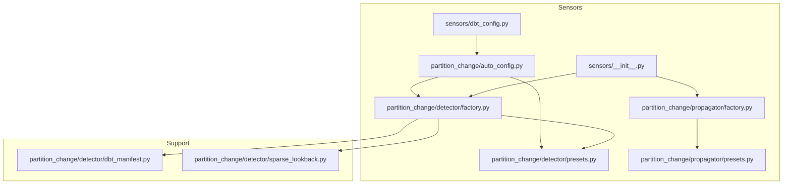
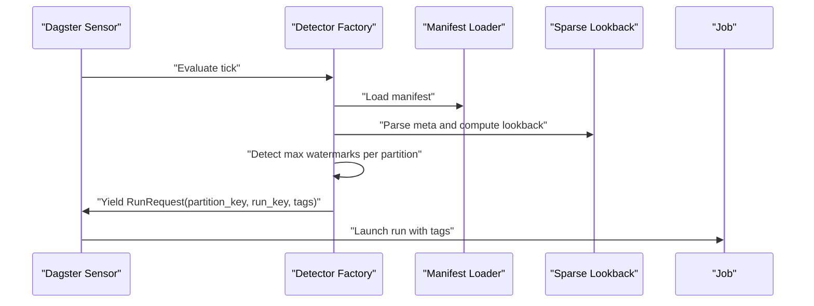
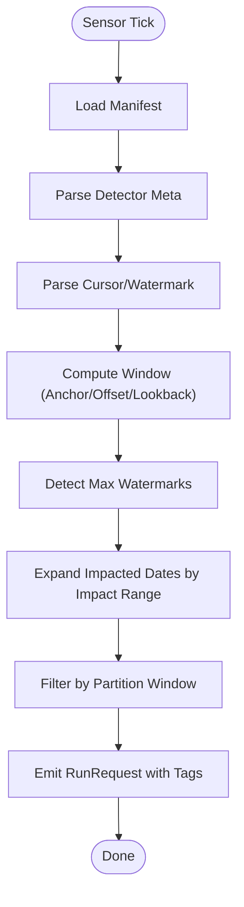
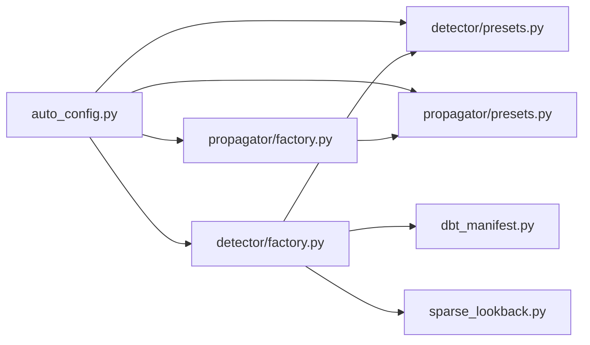

# Custom Sensor Creation

<cite>
**Referenced Files in This Document**
- [sensors/__init__.py](file://src/dbt_dagsterizer/sensors/__init__.py)
- [sensors/dbt_config.py](file://src/dbt_dagsterizer/sensors/dbt_config.py)
- [sensors/partition_change/auto_config.py](file://src/dbt_dagsterizer/sensors/partition_change/auto_config.py)
- [sensors/partition_change/detector/factory.py](file://src/dbt_dagsterizer/sensors/partition_change/detector/factory.py)
- [sensors/partition_change/detector/presets.py](file://src/dbt_dagsterizer/sensors/partition_change/detector/presets.py)
- [sensors/partition_change/detector/dbt_manifest.py](file://src/dbt_dagsterizer/sensors/partition_change/detector/dbt_manifest.py)
- [sensors/partition_change/detector/sparse_lookback.py](file://src/dbt_dagsterizer/sensors/partition_change/detector/sparse_lookback.py)
- [sensors/partition_change/propagator/factory.py](file://src/dbt_dagsterizer/sensors/partition_change/propagator/factory.py)
- [sensors/partition_change/propagator/presets.py](file://src/dbt_dagsterizer/sensors/partition_change/propagator/presets.py)
- [api.py](file://src/dbt_dagsterizer/api.py)
- [test_partition_change_sensor_impact_range.py](file://tests/test_partition_change_sensor_impact_range.py)
- [test_partition_change_sensor_missing_relation.py](file://tests/test_partition_change_sensor_missing_relation.py)
- [test_partition_change_sensor_watermark_dedupe.py](file://tests/test_partition_change_sensor_watermark_dedupe.py)
</cite>

## Table of Contents
1. [Introduction](#introduction)
2. [Project Structure](#project-structure)
3. [Core Components](#core-components)
4. [Architecture Overview](#architecture-overview)
5. [Detailed Component Analysis](#detailed-component-analysis)
6. [Dependency Analysis](#dependency-analysis)
7. [Performance Considerations](#performance-considerations)
8. [Troubleshooting Guide](#troubleshooting-guide)
9. [Conclusion](#conclusion)
10. [Appendices](#appendices)

## Introduction
This document explains how to create custom sensors in dbt-dagsterizer with a focus on the partition-change sensor family. It covers sensor factory patterns, custom detection logic, configuration customization, naming conventions, metadata assignment, tag management, extending existing detectors, building specialized propagation sensors, implementing custom watermark strategies, registration processes, configuration validation, integration with the broader sensor ecosystem, and practical testing and performance guidance.

## Project Structure
The sensor subsystem centers around two families:
- Detector sensors: detect partition changes and emit RunRequests for downstream jobs.
- Propagator sensors: propagate RunRequests across dependent assets/models.

Key modules:
- Sensors entrypoint aggregates factories for detector and propagator sensors.
- Auto-configuration derives sensor specs from dbt models and runtime metadata.
- Detector factory builds sensors with configurable lookback windows, offsets, and watermark strategies.
- Propagator factory builds sensors that traverse impact graphs to propagate runs.
- Presets define canonical sensor spec shapes and validation rules.
- Manifest and sparse lookback utilities support detection logic.

**Diagram sources**
- [sensors/__init__.py:1-100](file://src/dbt_dagsterizer/sensors/__init__.py#L1-L100)
- [sensors/partition_change/detector/factory.py:1-200](file://src/dbt_dagsterizer/sensors/partition_change/detector/factory.py#L1-L200)
- [sensors/partition_change/propagator/factory.py:1-200](file://src/dbt_dagsterizer/sensors/partition_change/propagator/factory.py#L1-L200)
- [sensors/partition_change/detector/presets.py:1-100](file://src/dbt_dagsterizer/sensors/partition_change/detector/presets.py#L1-L100)
- [sensors/partition_change/propagator/presets.py:1-100](file://src/dbt_dagsterizer/sensors/partition_change/propagator/presets.py#L1-L100)
- [sensors/partition_change/auto_config.py:1-120](file://src/dbt_dagsterizer/sensors/partition_change/auto_config.py#L1-L120)
- [sensors/partition_change/detector/dbt_manifest.py:1-200](file://src/dbt_dagsterizer/sensors/partition_change/detector/dbt_manifest.py#L1-L200)
- [sensors/partition_change/detector/sparse_lookback.py:1-200](file://src/dbt_dagsterizer/sensors/partition_change/detector/sparse_lookback.py#L1-L200)

**Section sources**
- [sensors/__init__.py:1-100](file://src/dbt_dagsterizer/sensors/__init__.py#L1-L100)
- [sensors/dbt_config.py:1-200](file://src/dbt_dagsterizer/sensors/dbt_config.py#L1-L200)

## Core Components
- Detector factory: Builds a Dagster sensor that evaluates partition changes over a configurable window, computes watermarks, deduplicates via cursors, and emits RunRequests with standardized tags.
- Propagator factory: Builds sensors that traverse an impact graph to propagate RunRequests downstream.
- Presets: Define canonical sensor spec schemas and enforce validation for required fields and ranges.
- Auto-configuration: Derives sensor specs from dbt models and runtime metadata, including defaults for naming, scheduling, and detection parameters.
- Manifest and sparse lookback: Utilities to resolve dbt relations, extract partition expressions, and compute sparse lookback windows.

Key responsibilities:
- Sensor naming: Derived from model names or explicit spec name; follows a consistent pattern for partition-change sensors.
- Metadata: Stored under a structured meta dictionary; supports detect_relation/detect_source, partition_date_expr, updated_at_expr, and impact range.
- Tags: RunRequest tags include detector model, detected relation, and partition watermark for observability and deduplication.

**Section sources**
- [sensors/partition_change/detector/factory.py:70-200](file://src/dbt_dagsterizer/sensors/partition_change/detector/factory.py#L70-L200)
- [sensors/partition_change/detector/presets.py:1-100](file://src/dbt_dagsterizer/sensors/partition_change/detector/presets.py#L1-L100)
- [sensors/partition_change/auto_config.py:60-120](file://src/dbt_dagsterizer/sensors/partition_change/auto_config.py#L60-L120)

## Architecture Overview
The sensor ecosystem integrates dbt manifests, resource keys, and Dagster’s sensor framework. Detectors scan for partition changes and emit RunRequests; propagators ensure downstream assets re-run when upstream inputs change.

**Diagram sources**
- [sensors/partition_change/detector/factory.py:79-191](file://src/dbt_dagsterizer/sensors/partition_change/detector/factory.py#L79-L191)
- [sensors/partition_change/detector/dbt_manifest.py:1-200](file://src/dbt_dagsterizer/sensors/partition_change/detector/dbt_manifest.py#L1-L200)
- [sensors/partition_change/detector/sparse_lookback.py:1-200](file://src/dbt_dagsterizer/sensors/partition_change/detector/sparse_lookback.py#L1-L200)

## Detailed Component Analysis

### Detector Factory Pattern
The detector factory constructs a sensor decorated with Dagster’s sensor decorator. It:
- Loads and prepares the dbt manifest.
- Parses detection metadata (detect_relation/detect_source, partition date expression, updated-at expression).
- Computes lookback windows using anchor dates and offsets.
- Resolves cursors for watermark deduplication (including legacy timestamp parsing).
- Expands impacted partitions by an impact range and emits RunRequests with deterministic run_key and tags.

**Diagram sources**
- [sensors/partition_change/detector/factory.py:79-191](file://src/dbt_dagsterizer/sensors/partition_change/detector/factory.py#L79-L191)

**Section sources**
- [sensors/partition_change/detector/factory.py:79-191](file://src/dbt_dagsterizer/sensors/partition_change/detector/factory.py#L79-L191)

### Sensor Naming Conventions and Metadata Assignment
Naming:
- If a spec name is provided, it is used; otherwise, a default pattern is applied for partition-change sensors.
- Job name derivation supports automatic mapping from detector specs.

Metadata:
- The meta dictionary carries detection parameters such as detect_relation/detect_source, partition_date_expr, updated_at_expr, and optional impact configuration.
- Presets validate presence of required fields and enforce numeric ranges.

Tag Management:
- RunRequests include tags for detector model, detected relation, and partition watermark to enable observability and deduplication.

**Section sources**
- [sensors/partition_change/auto_config.py:65-96](file://src/dbt_dagsterizer/sensors/partition_change/auto_config.py#L65-L96)
- [sensors/partition_change/detector/presets.py:1-35](file://src/dbt_dagsterizer/sensors/partition_change/detector/presets.py#L1-L35)
- [sensors/partition_change/detector/factory.py:185-190](file://src/dbt_dagsterizer/sensors/partition_change/detector/factory.py#L185-L190)

### Custom Detection Logic Implementation
To implement custom detection logic:
- Extend the detector factory by adding new detection modes in the metadata parsing layer.
- Introduce new watermark computation strategies by replacing or wrapping the watermark detection routine while preserving the RunRequest emission contract.
- Add new sparse lookback strategies by integrating new utilities that resolve partition expressions and compute lookback windows.

Integration points:
- dbt_manifest utilities resolve relations and schemas.
- sparse_lookback utilities compute anchor dates and window boundaries.

**Section sources**
- [sensors/partition_change/detector/dbt_manifest.py:1-200](file://src/dbt_dagsterizer/sensors/partition_change/detector/dbt_manifest.py#L1-L200)
- [sensors/partition_change/detector/sparse_lookback.py:1-200](file://src/dbt_dagsterizer/sensors/partition_change/detector/sparse_lookback.py#L1-L200)

### Sensor Configuration Customization
Configuration is centralized in presets and auto-config:
- Presets define canonical sensor specs with strict validation for name, job_name, detector_model, lookback_days, offset_days, and minimum_interval_seconds.
- Auto-config derives sensor specs from dbt models and runtime metadata, allowing defaults for naming and scheduling while enabling overrides.

Customization tips:
- Override lookback_days and offset_days to tune sensitivity.
- Adjust minimum_interval_seconds to throttle emissions.
- Provide detect_relation/detect_source and partition expressions in meta to tailor detection.

**Section sources**
- [sensors/partition_change/detector/presets.py:1-35](file://src/dbt_dagsterizer/sensors/partition_change/detector/presets.py#L1-L35)
- [sensors/partition_change/auto_config.py:65-96](file://src/dbt_dagsterizer/sensors/partition_change/auto_config.py#L65-L96)

### Extending Existing Detectors
Examples of extension points validated by tests:
- Impact range expansion: Tests demonstrate how changing the impact range affects downstream partitions.
- Missing relation handling: Tests show skip behavior when a detected relation is unknown.
- Watermark deduplication: Tests verify that identical watermarks do not trigger duplicate RunRequests.

These behaviors confirm that:
- Detector logic can be extended safely without breaking the emission contract.
- Cursor-based deduplication preserves idempotency.
- Impact range controls breadth of propagated runs.

**Section sources**
- [tests/test_partition_change_sensor_impact_range.py:1-120](file://tests/test_partition_change_sensor_impact_range.py#L1-L120)
- [tests/test_partition_change_sensor_missing_relation.py:1-120](file://tests/test_partition_change_sensor_missing_relation.py#L1-L120)
- [tests/test_partition_change_sensor_watermark_dedupe.py:1-120](file://tests/test_partition_change_sensor_watermark_dedupe.py#L1-L120)

### Specialized Propagation Sensors
The propagator factory builds sensors that:
- Traverse an impact graph to propagate RunRequests downstream.
- Respect minimum intervals and job assignments.
- Support preset configurations for propagation specs.

Use cases:
- Build propagation sensors for downstream models after upstream partition changes.
- Combine detector and propagator sensors to form end-to-end change-driven pipelines.

**Section sources**
- [sensors/partition_change/propagator/factory.py:1-200](file://src/dbt_dagsterizer/sensors/partition_change/propagator/factory.py#L1-L200)
- [sensors/partition_change/propagator/presets.py:1-100](file://src/dbt_dagsterizer/sensors/partition_change/propagator/presets.py#L1-L100)

### Custom Watermark Strategies
Watermark strategies are encapsulated in the detector factory:
- Watermarks are computed per partition and compared against prior cursors.
- Legacy cursor timestamps are supported for backward compatibility.
- RunRequest run_key includes the watermark to ensure idempotent re-emission.

Implementation guidance:
- Replace watermark detection routines while preserving the watermark-to-partition mapping and cursor payload format.
- Ensure emitted tags include the watermark for observability.

**Section sources**
- [sensors/partition_change/detector/factory.py:100-191](file://src/dbt_dagsterizer/sensors/partition_change/detector/factory.py#L100-L191)

### Sensor Registration and Integration
Registration:
- Sensors are aggregated in the sensors entrypoint module and exposed via the API surface.
- The API module imports and exposes sensor builders to higher-level definition assemblies.

Integration with the broader ecosystem:
- Sensors require a resource key expected by the underlying job (e.g., a StarRocks resource).
- Sensor specs integrate with dbt_config and auto_config to derive runtime behavior.

**Section sources**
- [sensors/__init__.py:45-55](file://src/dbt_dagsterizer/sensors/__init__.py#L45-L55)
- [api.py:50-70](file://src/dbt_dagsterizer/api.py#L50-L70)

## Dependency Analysis
The detector and propagator factories depend on shared utilities and presets. The auto-config module bridges dbt metadata and sensor specs.

**Diagram sources**
- [sensors/partition_change/auto_config.py:60-120](file://src/dbt_dagsterizer/sensors/partition_change/auto_config.py#L60-L120)
- [sensors/partition_change/detector/factory.py:1-200](file://src/dbt_dagsterizer/sensors/partition_change/detector/factory.py#L1-L200)
- [sensors/partition_change/propagator/factory.py:1-200](file://src/dbt_dagsterizer/sensors/partition_change/propagator/factory.py#L1-L200)
- [sensors/partition_change/detector/presets.py:1-100](file://src/dbt_dagsterizer/sensors/partition_change/detector/presets.py#L1-L100)
- [sensors/partition_change/propagator/presets.py:1-100](file://src/dbt_dagsterizer/sensors/partition_change/propagator/presets.py#L1-L100)
- [sensors/partition_change/detector/dbt_manifest.py:1-200](file://src/dbt_dagsterizer/sensors/partition_change/detector/dbt_manifest.py#L1-L200)
- [sensors/partition_change/detector/sparse_lookback.py:1-200](file://src/dbt_dagsterizer/sensors/partition_change/detector/sparse_lookback.py#L1-L200)

**Section sources**
- [sensors/partition_change/auto_config.py:60-120](file://src/dbt_dagsterizer/sensors/partition_change/auto_config.py#L60-L120)
- [sensors/partition_change/detector/factory.py:1-200](file://src/dbt_dagsterizer/sensors/partition_change/detector/factory.py#L1-L200)
- [sensors/partition_change/propagator/factory.py:1-200](file://src/dbt_dagsterizer/sensors/partition_change/propagator/factory.py#L1-L200)

## Performance Considerations
- Throttle emissions: Use minimum_interval_seconds to avoid excessive sensor ticks.
- Narrow lookback windows: Reduce lookback_days and offset_days to limit scanning scope.
- Impact range tuning: Control propagation breadth via impact configuration to minimize downstream churn.
- Cursor-based deduplication: Rely on watermark cursors to prevent redundant RunRequests.
- Resource contention: Ensure required resource keys are available to avoid unnecessary retries.

[No sources needed since this section provides general guidance]

## Troubleshooting Guide
Common issues and resolutions:
- Unknown database/relation: Detector skips with a clear skip message when a detected relation cannot be resolved.
- Duplicate RunRequests: Watermark-based deduplication prevents repeated emissions for unchanged watermarks.
- Missing meta: Detector raises a validation error if meta is absent or malformed.

Validation and testing references:
- Impact range behavior: Demonstrates how expanding the impact range increases downstream partitions.
- Missing relation handling: Confirms skip behavior and messaging.
- Watermark deduplication: Ensures idempotency across ticks.

**Section sources**
- [tests/test_partition_change_sensor_impact_range.py:1-120](file://tests/test_partition_change_sensor_impact_range.py#L1-L120)
- [tests/test_partition_change_sensor_missing_relation.py:1-120](file://tests/test_partition_change_sensor_missing_relation.py#L1-L120)
- [tests/test_partition_change_sensor_watermark_dedupe.py:1-120](file://tests/test_partition_change_sensor_watermark_dedupe.py#L1-L120)

## Conclusion
dbt-dagsterizer provides a robust, extensible foundation for building custom sensors. By leveraging detector and propagator factories, presets, and auto-configuration, teams can implement targeted change detection, customize watermark strategies, and integrate seamlessly with the broader sensor ecosystem. Validation, tagging, and cursor-based deduplication ensure reliable, observable, and efficient operation.

[No sources needed since this section summarizes without analyzing specific files]

## Appendices

### Sensor Registration Checklist
- Define a sensor spec using presets or auto-config.
- Provide required metadata (detect_relation/detect_source, partition expressions).
- Assign a job and set minimum_interval_seconds.
- Register sensors via the sensors entrypoint and expose them through the API.

**Section sources**
- [sensors/partition_change/detector/presets.py:1-35](file://src/dbt_dagsterizer/sensors/partition_change/detector/presets.py#L1-L35)
- [sensors/partition_change/auto_config.py:65-96](file://src/dbt_dagsterizer/sensors/partition_change/auto_config.py#L65-L96)
- [sensors/__init__.py:45-55](file://src/dbt_dagsterizer/sensors/__init__.py#L45-L55)
- [api.py:50-70](file://src/dbt_dagsterizer/api.py#L50-L70)