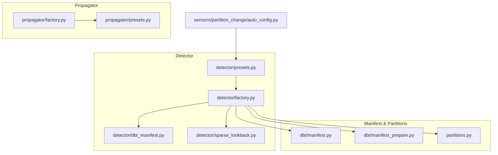
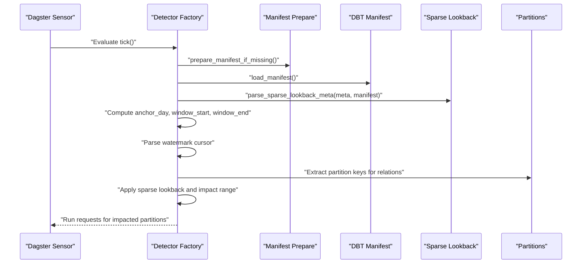
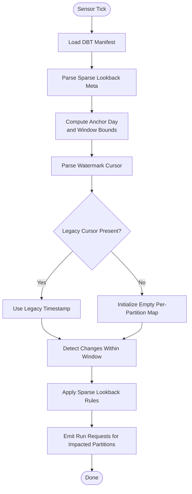
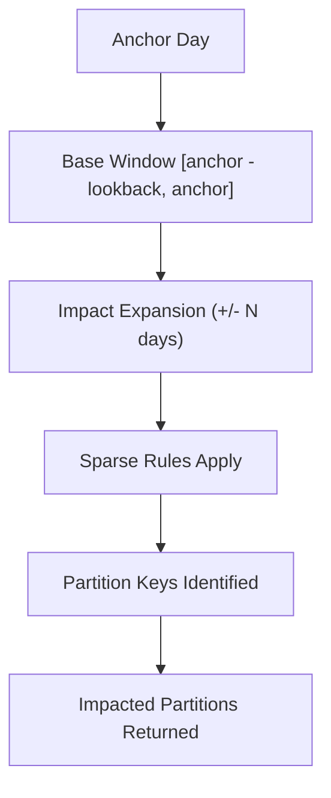
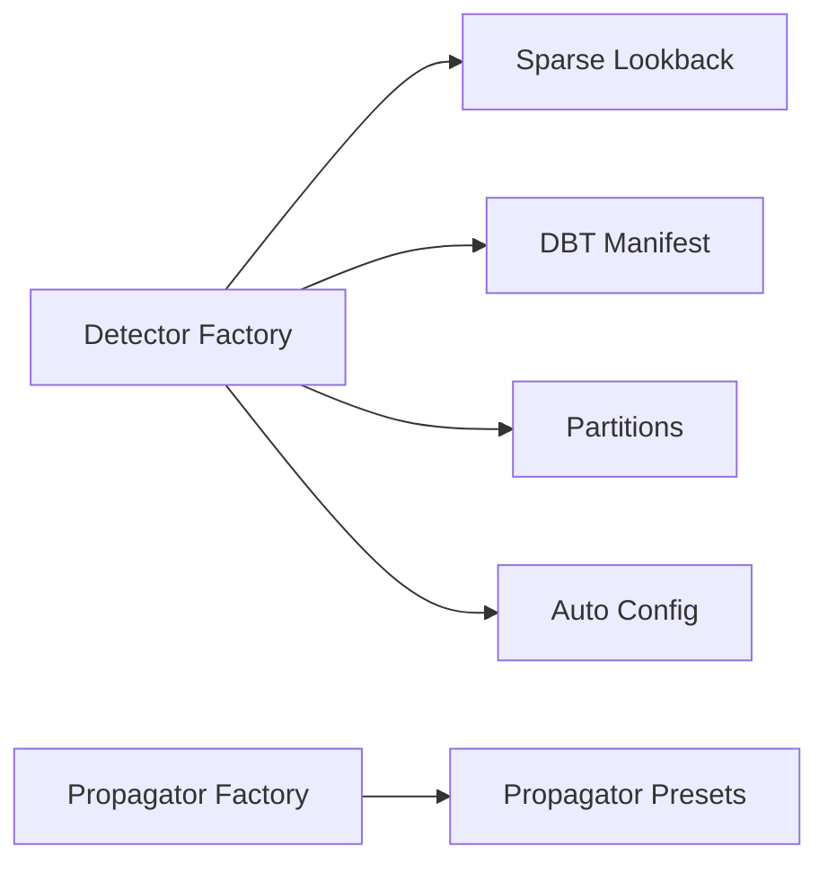

# Partition Change Detection

<cite>
**Referenced Files in This Document**
- [detector/factory.py](file://src/dbt_dagsterizer/sensors/partition_change/detector/factory.py)
- [detector/presets.py](file://src/dbt_dagsterizer/sensors/partition_change/detector/presets.py)
- [detector/dbt_manifest.py](file://src/dbt_dagsterizer/sensors/partition_change/detector/dbt_manifest.py)
- [detector/sparse_lookback.py](file://src/dbt_dagsterizer/sensors/partition_change/detector/sparse_lookback.py)
- [sensors/partition_change/auto_config.py](file://src/dbt_dagsterizer/sensors/partition_change/auto_config.py)
- [propagator/factory.py](file://src/dbt_dagsterizer/sensors/partition_change/propagator/factory.py)
- [propagator/presets.py](file://src/dbt_dagsterizer/sensors/partition_change/propagator/presets.py)
- [partitions.py](file://src/dbt_dagsterizer/partitions.py)
- [dbt/manifest.py](file://src/dbt_dagsterizer/dbt/manifest.py)
- [dbt/manifest_prepare.py](file://src/dbt_dagsterizer/dbt/manifest_prepare.py)
- [test_partition_change_sensor_impact_range.py](file://tests/test_partition_change_sensor_impact_range.py)
- [test_partition_change_sensor_watermark_dedupe.py](file://tests/test_partition_change_sensor_watermark_dedupe.py)
- [test_partition_change_sensor_missing_relation.py](file://tests/test_partition_change_sensor_missing_relation.py)
- [project_templates/luban-dagster-dbt-starrocks-code-location-source-template/{{cookiecutter.output_name}}/dbt_project/macros/dbt_dagsterizer/partition_vars.sql](file://src/dbt_dagsterizer/project_templates/luban-dagster-dbt-starrocks-code-location-source-template/{{cookiecutter.output_name}}/dbt_project/macros/dbt_dagsterizer/partition_vars.sql)
</cite>

## Table of Contents
1. [Introduction](#introduction)
2. [Project Structure](#project-structure)
3. [Core Components](#core-components)
4. [Architecture Overview](#architecture-overview)
5. [Detailed Component Analysis](#detailed-component-analysis)
6. [Dependency Analysis](#dependency-analysis)
7. [Performance Considerations](#performance-considerations)
8. [Troubleshooting Guide](#troubleshooting-guide)
9. [Conclusion](#conclusion)
10. [Appendices](#appendices)

## Introduction
This document explains the partition change detection mechanism in dbt-dagsterizer. It covers how DBT manifests are parsed for partition metadata, how sensors are generated via factory patterns, and how preset configurations define detection strategies. It also documents sparse lookback algorithms, impact range computation, watermark-based deduplication, sensor naming conventions, metadata assignment, and performance optimizations. Finally, it outlines integration with DBT manifest structures, partition key extraction, and troubleshooting common detection issues.

## Project Structure
Partition change detection spans two primary subsystems:
- Detector: builds sensors that detect changes in partitioned assets and emits run requests for impacted partitions.
- Propagator: propagates downstream asset changes triggered by detected upstream partition changes.

Key modules:
- Detector factory and presets define sensor specs and runtime behavior.
- Sparse lookback module parses detection metadata and computes sparse windows.
- Auto-config reads user-provided detector specs and materializes sensor definitions.
- Manifest integrations parse DBT manifest artifacts for partition keys and relation metadata.
- Tests validate impact range, watermark deduplication, and missing relation scenarios.

**Diagram sources**
- [detector/factory.py](file://src/dbt_dagsterizer/sensors/partition_change/detector/factory.py)
- [detector/presets.py](file://src/dbt_dagsterizer/sensors/partition_change/detector/presets.py)
- [detector/dbt_manifest.py](file://src/dbt_dagsterizer/sensors/partition_change/detector/dbt_manifest.py)
- [detector/sparse_lookback.py](file://src/dbt_dagsterizer/sensors/partition_change/detector/sparse_lookback.py)
- [sensors/partition_change/auto_config.py](file://src/dbt_dagsterizer/sensors/partition_change/auto_config.py)
- [propagator/factory.py](file://src/dbt_dagsterizer/sensors/partition_change/propagator/factory.py)
- [propagator/presets.py](file://src/dbt_dagsterizer/sensors/partition_change/propagator/presets.py)
- [dbt/manifest.py](file://src/dbt_dagsterizer/dbt/manifest.py)
- [dbt/manifest_prepare.py](file://src/dbt_dagsterizer/dbt/manifest_prepare.py)
- [partitions.py](file://src/dbt_dagsterizer/partitions.py)

**Section sources**
- [detector/factory.py](file://src/dbt_dagsterizer/sensors/partition_change/detector/factory.py)
- [detector/presets.py](file://src/dbt_dagsterizer/sensors/partition_change/detector/presets.py)
- [detector/dbt_manifest.py](file://src/dbt_dagsterizer/sensors/partition_change/detector/dbt_manifest.py)
- [detector/sparse_lookback.py](file://src/dbt_dagsterizer/sensors/partition_change/detector/sparse_lookback.py)
- [sensors/partition_change/auto_config.py](file://src/dbt_dagsterizer/sensors/partition_change/auto_config.py)
- [propagator/factory.py](file://src/dbt_dagsterizer/sensors/partition_change/propagator/factory.py)
- [propagator/presets.py](file://src/dbt_dagsterizer/sensors/partition_change/propagator/presets.py)
- [dbt/manifest.py](file://src/dbt_dagsterizer/dbt/manifest.py)
- [dbt/manifest_prepare.py](file://src/dbt_dagsterizer/dbt/manifest_prepare.py)
- [partitions.py](file://src/dbt_dagsterizer/partitions.py)

## Core Components
- Sensor Presets: Define standardized detector configurations (e.g., daily partition change) with validated parameters such as name, job_name, detector_model, lookback_days, offset_days, enabled flag, interval, and meta.
- Detector Factory: Creates Dagster sensors that evaluate partition changes. It loads the DBT manifest, parses sparse lookback metadata, computes date windows, manages watermarks, and emits run requests for impacted partitions.
- Sparse Lookback Parser: Extracts and validates detection metadata from sensor specs and manifest, enabling sparse window computation around anchors.
- Auto Config: Translates user detector specs into sensor presets, applying defaults and deriving sensor/job names.
- Manifest Integrations: Provide accessors to DBT manifest artifacts and partition key extraction for relations.
- Propagator: Defines propagation sensors and presets to cascade changes downstream.

**Section sources**
- [detector/presets.py](file://src/dbt_dagsterizer/sensors/partition_change/detector/presets.py)
- [detector/factory.py](file://src/dbt_dagsterizer/sensors/partition_change/detector/factory.py)
- [detector/sparse_lookback.py](file://src/dbt_dagsterizer/sensors/partition_change/detector/sparse_lookback.py)
- [sensors/partition_change/auto_config.py](file://src/dbt_dagsterizer/sensors/partition_change/auto_config.py)
- [dbt/manifest.py](file://src/dbt_dagsterizer/dbt/manifest.py)
- [dbt/manifest_prepare.py](file://src/dbt_dagsterizer/dbt/manifest_prepare.py)
- [partitions.py](file://src/dbt_dagsterizer/partitions.py)
- [propagator/presets.py](file://src/dbt_dagsterizer/sensors/partition_change/propagator/presets.py)

## Architecture Overview
The detector sensor orchestrates change detection across partitioned assets. It computes a lookback window anchored at the current day minus offset, queries manifest metadata for partition keys, applies sparse lookback rules, deduplicates using watermarks, and emits run requests scoped to impacted partitions.

**Diagram sources**
- [detector/factory.py](file://src/dbt_dagsterizer/sensors/partition_change/detector/factory.py)
- [detector/sparse_lookback.py](file://src/dbt_dagsterizer/sensors/partition_change/detector/sparse_lookback.py)
- [dbt/manifest_prepare.py](file://src/dbt_dagsterizer/dbt/manifest_prepare.py)
- [dbt/manifest.py](file://src/dbt_dagsterizer/dbt/manifest.py)
- [partitions.py](file://src/dbt_dagsterizer/partitions.py)

## Detailed Component Analysis

### Sensor Presets and Naming Conventions
- Preset: daily_partition_change encapsulates a standardized detector spec with validation for required fields and sensible defaults for optional fields.
- Naming: Sensors derive names from detector specs; if unspecified, a default pattern is applied. Job names are derived similarly.
- Metadata: Detector meta supports partition_date_expr, updated_at_expr, detect_relation, detect_source, and impact.

**Section sources**
- [detector/presets.py](file://src/dbt_dagsterizer/sensors/partition_change/detector/presets.py)
- [sensors/partition_change/auto_config.py](file://src/dbt_dagsterizer/sensors/partition_change/auto_config.py)

### Detector Factory and Watermark Deduplication
- Sensor Creation: Uses Dagster’s decorator to register sensors with scheduling and resource configuration.
- Manifest Loading: Ensures manifest availability and loads it for metadata access.
- Window Computation: Computes anchor_day from current time minus offset_days; sets lookback window from anchor_day minus lookback_days to anchor_day.
- Watermark Parsing: Supports new per-partition cursors and falls back to legacy timestamp cursors when absent.
- Run Request Emission: Emits run requests scoped to impacted partitions after applying sparse lookback and deduplication.

**Diagram sources**
- [detector/factory.py](file://src/dbt_dagsterizer/sensors/partition_change/detector/factory.py)
- [detector/sparse_lookback.py](file://src/dbt_dagsterizer/sensors/partition_change/detector/sparse_lookback.py)

**Section sources**
- [detector/factory.py](file://src/dbt_dagsterizer/sensors/partition_change/detector/factory.py)

### Sparse Lookback and Impact Range
- Sparse Lookback Metadata: Extracted from detector meta and manifest to define sparse evaluation windows around anchors.
- Impact Range Calculation: Expands the base window by a configurable symmetric range to capture upstream effects.
- Tests validate that the computed partitions include the anchor day and its neighbors within the configured range.

**Diagram sources**
- [detector/sparse_lookback.py](file://src/dbt_dagsterizer/sensors/partition_change/detector/sparse_lookback.py)
- [test_partition_change_sensor_impact_range.py](file://tests/test_partition_change_sensor_impact_range.py)

**Section sources**
- [detector/sparse_lookback.py](file://src/dbt_dagsterizer/sensors/partition_change/detector/sparse_lookback.py)
- [test_partition_change_sensor_impact_range.py](file://tests/test_partition_change_sensor_impact_range.py)

### Watermark Deduplication
- Per-Partition Cursors: New-style watermark stores last processed partition timestamps keyed by partition.
- Legacy Fallback: If no per-partition cursor exists, falls back to a single timestamp cursor.
- Deduplication: Prevents reprocessing the same partitions across ticks by comparing against stored watermarks.

**Section sources**
- [detector/factory.py](file://src/dbt_dagsterizer/sensors/partition_change/detector/factory.py)
- [test_partition_change_sensor_watermark_dedupe.py](file://tests/test_partition_change_sensor_watermark_dedupe.py)

### Manifest Integration and Partition Key Extraction
- Manifest Access: Detector factory loads DBT manifest to access relation metadata and partition keys.
- Partition Key Extraction: Partitions module provides utilities to extract partition keys for relations involved in change detection.
- Relation Validation: Auto config and detector factory validate presence of detect_relation/detect_source and model references.

**Section sources**
- [detector/factory.py](file://src/dbt_dagsterizer/sensors/partition_change/detector/factory.py)
- [dbt/manifest.py](file://src/dbt_dagsterizer/dbt/manifest.py)
- [dbt/manifest_prepare.py](file://src/dbt_dagsterizer/dbt/manifest_prepare.py)
- [partitions.py](file://src/dbt_dagsterizer/partitions.py)
- [sensors/partition_change/auto_config.py](file://src/dbt_dagsterizer/sensors/partition_change/auto_config.py)

### Propagator Sensors
- Purpose: Cascade partition changes downstream to dependent assets.
- Factory and Presets: Similar factory and preset patterns mirror the detector subsystem for propagator sensors.

**Section sources**
- [propagator/factory.py](file://src/dbt_dagsterizer/sensors/partition_change/propagator/factory.py)
- [propagator/presets.py](file://src/dbt_dagsterizer/sensors/partition_change/propagator/presets.py)

### DBT Manifest Parsing for Partition Information
- Manifest Preparation: Ensures manifest artifacts are present and up-to-date before loading.
- Manifest Loading: Loads manifest for relation metadata and partition key discovery.
- Macros and Variables: Project templates include macros to assist with partition variable generation and schema handling.

**Section sources**
- [dbt/manifest_prepare.py](file://src/dbt_dagsterizer/dbt/manifest_prepare.py)
- [dbt/manifest.py](file://src/dbt_dagsterizer/dbt/manifest.py)
- [project_templates/luban-dagster-dbt-starrocks-code-location-source-template/{{cookiecutter.output_name}}/dbt_project/macros/dbt_dagsterizer/partition_vars.sql](file://src/dbt_dagsterizer/project_templates/luban-dagster-dbt-starrocks-code-location-source-template/{{cookiecutter.output_name}}/dbt_project/macros/dbt_dagsterizer/partition_vars.sql)

## Dependency Analysis
- Detector factory depends on:
  - Sparse lookback parser for metadata interpretation.
  - Manifest loader for relation and partition metadata.
  - Partitions module for extracting partition keys.
  - Auto config for preset generation and defaults.
- Propagator mirrors detector dependencies for downstream propagation.
- Tests validate correctness of impact range, watermark behavior, and missing relation handling.

**Diagram sources**
- [detector/factory.py](file://src/dbt_dagsterizer/sensors/partition_change/detector/factory.py)
- [detector/sparse_lookback.py](file://src/dbt_dagsterizer/sensors/partition_change/detector/sparse_lookback.py)
- [dbt/manifest.py](file://src/dbt_dagsterizer/dbt/manifest.py)
- [partitions.py](file://src/dbt_dagsterizer/partitions.py)
- [sensors/partition_change/auto_config.py](file://src/dbt_dagsterizer/sensors/partition_change/auto_config.py)
- [propagator/factory.py](file://src/dbt_dagsterizer/sensors/partition_change/propagator/factory.py)
- [propagator/presets.py](file://src/dbt_dagsterizer/sensors/partition_change/propagator/presets.py)

**Section sources**
- [detector/factory.py](file://src/dbt_dagsterizer/sensors/partition_change/detector/factory.py)
- [detector/sparse_lookback.py](file://src/dbt_dagsterizer/sensors/partition_change/detector/sparse_lookback.py)
- [dbt/manifest.py](file://src/dbt_dagsterizer/dbt/manifest.py)
- [partitions.py](file://src/dbt_dagsterizer/partitions.py)
- [sensors/partition_change/auto_config.py](file://src/dbt_dagsterizer/sensors/partition_change/auto_config.py)
- [propagator/factory.py](file://src/dbt_dagsterizer/sensors/partition_change/propagator/factory.py)
- [propagator/presets.py](file://src/dbt_dagsterizer/sensors/partition_change/propagator/presets.py)

## Performance Considerations
- Sparse Lookback: Reduces scanning to relevant partitions around anchors, minimizing unnecessary evaluations.
- Watermark Deduplication: Avoids reprocessing partitions already handled in previous ticks.
- Manifest Caching: Manifest preparation ensures artifacts are ready to avoid repeated IO overhead.
- Interval Tuning: minimum_interval_seconds controls polling cadence; tune based on partition granularity and latency tolerance.
- Impact Range: Limiting expansion reduces downstream cascading work while ensuring correctness.

[No sources needed since this section provides general guidance]

## Troubleshooting Guide
Common issues and resolutions:
- Missing Relation or Source: Detector meta must specify detect_relation or detect_source; otherwise, sensor creation fails. Validate model references and manifest presence.
- Watermark Parsing Failures: If neither per-partition nor legacy cursor is present, the detector initializes defaults; verify cursor storage and serialization.
- Incorrect Partition Keys: Ensure partition_date_expr aligns with underlying partitioning; confirm manifest contains expected partition keys for relations.
- Impact Range Mismatches: Validate impact configuration and sparse lookback metadata; tests demonstrate expected neighbor inclusion around anchor day.

**Section sources**
- [sensors/partition_change/auto_config.py](file://src/dbt_dagsterizer/sensors/partition_change/auto_config.py)
- [detector/factory.py](file://src/dbt_dagsterizer/sensors/partition_change/detector/factory.py)
- [test_partition_change_sensor_missing_relation.py](file://tests/test_partition_change_sensor_missing_relation.py)
- [test_partition_change_sensor_watermark_dedupe.py](file://tests/test_partition_change_sensor_watermark_dedupe.py)
- [test_partition_change_sensor_impact_range.py](file://tests/test_partition_change_sensor_impact_range.py)

## Conclusion
The partition change detection subsystem integrates DBT manifest metadata with Dagster sensors to efficiently detect and propagate changes across partitioned assets. By combining sparse lookback, watermark-based deduplication, and configurable impact ranges, it balances accuracy and performance. Preset-driven factories simplify deployment, while robust error handling and tests ensure reliability across diverse partition strategies.

[No sources needed since this section summarizes without analyzing specific files]

## Appendices

### Configuration Options for Different Partition Strategies
- Daily Partitioning: Configure daily_partition_change preset with lookback_days and offset_days to control historical depth and anchor positioning.
- Partition Date Expression: Use partition_date_expr in detector meta to align with underlying partitioning.
- Updated At Expression: Optionally supply updated_at_expr for change-time filtering.
- Detect Relation/Source: Explicitly target relations or sources for change detection.
- Impact Scope: Adjust impact to expand evaluation beyond immediate partitions.

**Section sources**
- [detector/presets.py](file://src/dbt_dagsterizer/sensors/partition_change/detector/presets.py)
- [sensors/partition_change/auto_config.py](file://src/dbt_dagsterizer/sensors/partition_change/auto_config.py)