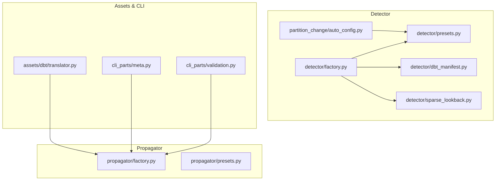
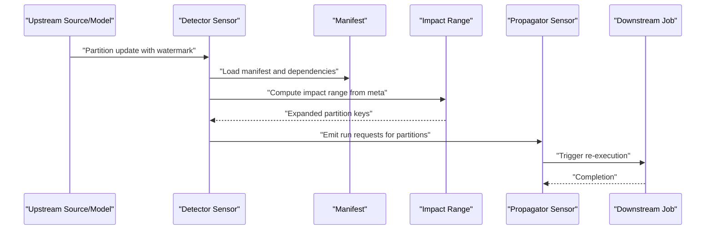
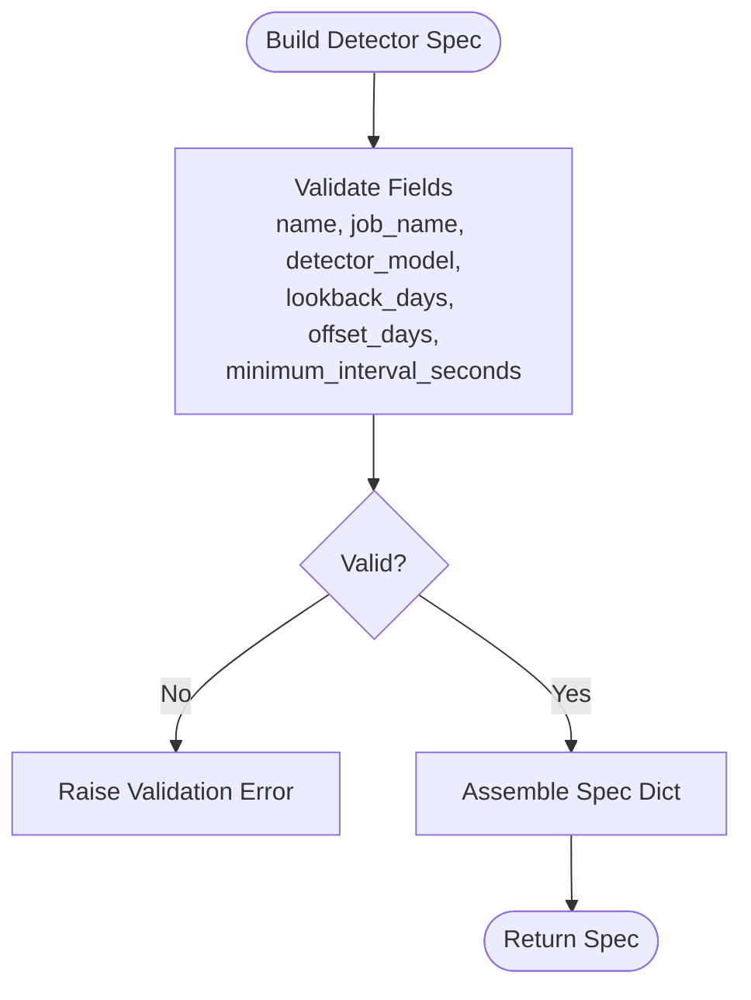
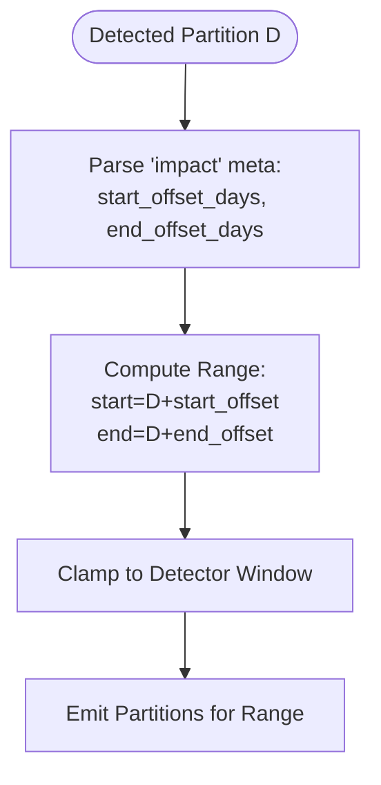
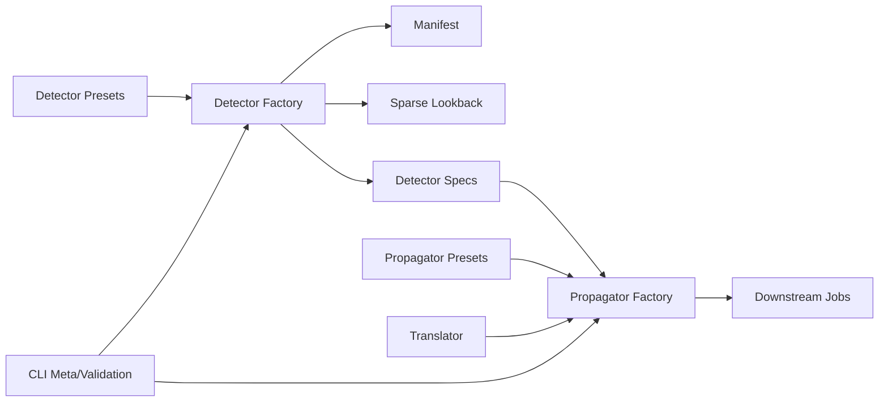

# Sensor Propagation

<cite>
**Referenced Files in This Document**
- [sensors/dbt_config.py](file://src/dbt_dagsterizer/sensors/dbt_config.py)
- [sensors/partition_change/detector/factory.py](file://src/dbt_dagsterizer/sensors/partition_change/detector/factory.py)
- [sensors/partition_change/detector/presets.py](file://src/dbt_dagsterizer/sensors/partition_change/detector/presets.py)
- [sensors/partition_change/detector/dbt_manifest.py](file://src/dbt_dagsterizer/sensors/partition_change/detector/dbt_manifest.py)
- [sensors/partition_change/detector/sparse_lookback.py](file://src/dbt_dagsterizer/sensors/partition_change/detector/sparse_lookback.py)
- [sensors/partition_change/auto_config.py](file://src/dbt_dagsterizer/sensors/partition_change/auto_config.py)
- [sensors/partition_change/propagator/factory.py](file://src/dbt_dagsterizer/sensors/partition_change/propagator/factory.py)
- [sensors/partition_change/propagator/presets.py](file://src/dbt_dagsterizer/sensors/partition_change/propagator/presets.py)
- [assets/dbt/translator.py](file://src/dbt_dagsterizer/assets/dbt/translator.py)
- [cli_parts/meta.py](file://src/dbt_dagsterizer/cli_parts/meta.py)
- [cli_parts/validation.py](file://src/dbt_dagsterizer/cli_parts/validation.py)
- [tests/test_partition_change_sensor_impact_range.py](file://tests/test_partition_change_sensor_impact_range.py)
- [tests/test_partition_change_sensor_watermark_dedupe.py](file://tests/test_partition_change_sensor_watermark_dedupe.py)
- [docs/templates/dagster-dbt-starrocks-code-location/developer_workflow.md](file://docs/templates/dagster-dbt-starrocks-code-location/developer_workflow.md)
</cite>

## Table of Contents
1. [Introduction](#introduction)
2. [Project Structure](#project-structure)
3. [Core Components](#core-components)
4. [Architecture Overview](#architecture-overview)
5. [Detailed Component Analysis](#detailed-component-analysis)
6. [Dependency Analysis](#dependency-analysis)
7. [Performance Considerations](#performance-considerations)
8. [Troubleshooting Guide](#troubleshooting-guide)
9. [Conclusion](#conclusion)
10. [Appendices](#appendices)

## Introduction
This document explains sensor propagation mechanisms in dbt-dagsterizer with a focus on how partition-change sensors detect upstream data updates and propagate those signals downstream to re-materialize affected partitions. It covers:
- Upstream and downstream propagation patterns
- Dependency chain traversal and impact range computation
- Factory patterns for building propagation sensors
- Preset configurations for different strategies
- Propagation direction handling, cycle detection, and performance optimization
- Sensor tagging and metadata inheritance
- Debugging, monitoring, and troubleshooting approaches

## Project Structure
The sensor propagation feature spans two primary subsystems:
- Detector: identifies partition changes in upstream sources/models and computes an impact range
- Propagator: creates downstream sensors that trigger re-execution of impacted partitions

Key modules:
- Detector factory and presets define sensor specs and runtime behavior
- Manifest and sparse lookback utilities support dependency traversal and impact range expansion
- Auto-config derives detector specs from project metadata
- Propagator factory and presets define downstream propagation sensors
- Translator and CLI integrate propagation modes and metadata into asset generation
- Tests validate impact range behavior and watermark de-duplication

**Diagram sources**
- [sensors/partition_change/detector/factory.py](file://src/dbt_dagsterizer/sensors/partition_change/detector/factory.py)
- [sensors/partition_change/detector/presets.py](file://src/dbt_dagsterizer/sensors/partition_change/detector/presets.py)
- [sensors/partition_change/detector/dbt_manifest.py](file://src/dbt_dagsterizer/sensors/partition_change/detector/dbt_manifest.py)
- [sensors/partition_change/detector/sparse_lookback.py](file://src/dbt_dagsterizer/sensors/partition_change/detector/sparse_lookback.py)
- [sensors/partition_change/auto_config.py](file://src/dbt_dagsterizer/sensors/partition_change/auto_config.py)
- [sensors/partition_change/propagator/factory.py](file://src/dbt_dagsterizer/sensors/partition_change/propagator/factory.py)
- [sensors/partition_change/propagator/presets.py](file://src/dbt_dagsterizer/sensors/partition_change/propagator/presets.py)
- [assets/dbt/translator.py](file://src/dbt_dagsterizer/assets/dbt/translator.py)
- [cli_parts/meta.py](file://src/dbt_dagsterizer/cli_parts/meta.py)
- [cli_parts/validation.py](file://src/dbt_dagsterizer/cli_parts/validation.py)

**Section sources**
- [sensors/dbt_config.py](file://src/dbt_dagsterizer/sensors/dbt_config.py)
- [sensors/partition_change/detector/factory.py](file://src/dbt_dagsterizer/sensors/partition_change/detector/factory.py)
- [sensors/partition_change/detector/presets.py](file://src/dbt_dagsterizer/sensors/partition_change/detector/presets.py)
- [sensors/partition_change/detector/dbt_manifest.py](file://src/dbt_dagsterizer/sensors/partition_change/detector/dbt_manifest.py)
- [sensors/partition_change/detector/sparse_lookback.py](file://src/dbt_dagsterizer/sensors/partition_change/detector/sparse_lookback.py)
- [sensors/partition_change/auto_config.py](file://src/dbt_dagsterizer/sensors/partition_change/auto_config.py)
- [sensors/partition_change/propagator/factory.py](file://src/dbt_dagsterizer/sensors/partition_change/propagator/factory.py)
- [sensors/partition_change/propagator/presets.py](file://src/dbt_dagsterizer/sensors/partition_change/propagator/presets.py)
- [assets/dbt/translator.py](file://src/dbt_dagsterizer/assets/dbt/translator.py)
- [cli_parts/meta.py](file://src/dbt_dagsterizer/cli_parts/meta.py)
- [cli_parts/validation.py](file://src/dbt_dagsterizer/cli_parts/validation.py)

## Core Components
- Detector presets and factory: Define sensor specs (daily partition windows, lookback/offset, meta), validate inputs, and build sensors.
- Sparse lookback impact range: Expand a detected partition into a contiguous date range to capture late-arriving data effects.
- Manifest utilities: Provide dependency graph access for traversal and model discovery.
- Auto-config: Derives detector specs from project-level configuration.
- Propagator presets and factory: Define downstream propagation sensors and their scheduling behavior.
- Translator and CLI: Integrate propagation mode and metadata into asset generation and CLI-driven propagation configuration.

Key responsibilities:
- Detect partition changes via watermark comparisons
- Compute impact ranges to downstream partitions
- Build sensors with appropriate cursors and run keys
- Support propagation directionality and metadata inheritance

**Section sources**
- [sensors/partition_change/detector/presets.py](file://src/dbt_dagsterizer/sensors/partition_change/detector/presets.py)
- [sensors/partition_change/detector/factory.py](file://src/dbt_dagsterizer/sensors/partition_change/detector/factory.py)
- [sensors/partition_change/detector/sparse_lookback.py](file://src/dbt_dagsterizer/sensors/partition_change/detector/sparse_lookback.py)
- [sensors/partition_change/detector/dbt_manifest.py](file://src/dbt_dagsterizer/sensors/partition_change/detector/dbt_manifest.py)
- [sensors/partition_change/auto_config.py](file://src/dbt_dagsterizer/sensors/partition_change/auto_config.py)
- [sensors/partition_change/propagator/presets.py](file://src/dbt_dagsterizer/sensors/partition_change/propagator/presets.py)
- [sensors/partition_change/propagator/factory.py](file://src/dbt_dagsterizer/sensors/partition_change/propagator/factory.py)
- [assets/dbt/translator.py](file://src/dbt_dagsterizer/assets/dbt/translator.py)
- [cli_parts/meta.py](file://src/dbt_dagsterizer/cli_parts/meta.py)
- [cli_parts/validation.py](file://src/dbt_dagsterizer/cli_parts/validation.py)

## Architecture Overview
The propagation pipeline connects upstream partition changes to downstream re-execution via sensors. At a high level:
- Detector sensors scan upstream partitions within a lookback window and compare max watermark timestamps to the stored cursor
- Detected partitions are expanded into an impact range (e.g., ±N days) to account for late arrivals
- Propagator sensors schedule downstream jobs for the computed partitions
- Metadata and tags propagate from detector specs to downstream sensors

**Diagram sources**
- [sensors/partition_change/detector/factory.py](file://src/dbt_dagsterizer/sensors/partition_change/detector/factory.py)
- [sensors/partition_change/detector/dbt_manifest.py](file://src/dbt_dagsterizer/sensors/partition_change/detector/dbt_manifest.py)
- [sensors/partition_change/detector/sparse_lookback.py](file://src/dbt_dagsterizer/sensors/partition_change/detector/sparse_lookback.py)
- [sensors/partition_change/propagator/factory.py](file://src/dbt_dagsterizer/sensors/partition_change/propagator/factory.py)

## Detailed Component Analysis

### Detector Factory and Presets
- Presets define validated sensor spec shapes for daily partition types, including name, job_name, detector_model, lookback_days, offset_days, enabled flag, minimum_interval_seconds, and meta.
- Factory builds sensors from specs, preparing manifests and parsing sparse lookback meta to compute impact ranges.

**Diagram sources**
- [sensors/partition_change/detector/presets.py](file://src/dbt_dagsterizer/sensors/partition_change/detector/presets.py)

**Section sources**
- [sensors/partition_change/detector/presets.py](file://src/dbt_dagsterizer/sensors/partition_change/detector/presets.py)
- [sensors/partition_change/detector/factory.py](file://src/dbt_dagsterizer/sensors/partition_change/detector/factory.py)

### Impact Range Computation (Sparse Lookback)
- Sparse lookback meta defines a contiguous range around a detected partition to expand downstream re-execution.
- Tests confirm that a detected partition D yields an inclusive range [D-1, D+1] when configured accordingly, clamped to the detector window.

**Diagram sources**
- [sensors/partition_change/detector/sparse_lookback.py](file://src/dbt_dagsterizer/sensors/partition_change/detector/sparse_lookback.py)
- [tests/test_partition_change_sensor_impact_range.py](file://tests/test_partition_change_sensor_impact_range.py)

**Section sources**
- [sensors/partition_change/detector/sparse_lookback.py](file://src/dbt_dagsterizer/sensors/partition_change/detector/sparse_lookback.py)
- [tests/test_partition_change_sensor_impact_range.py](file://tests/test_partition_change_sensor_impact_range.py)

### Manifest and Dependency Traversal
- Manifest utilities load and query dbt artifacts to discover models and relationships.
- Detector factory integrates manifest loading and prepares it for watermark detection and dependency resolution.

**Section sources**
- [sensors/partition_change/detector/dbt_manifest.py](file://src/dbt_dagsterizer/sensors/partition_change/detector/dbt_manifest.py)
- [sensors/partition_change/detector/factory.py](file://src/dbt_dagsterizer/sensors/partition_change/detector/factory.py)

### Auto-configuration of Detector Specs
- Auto-config derives detector specs from project-level configuration, setting defaults for job_name, minimum_interval_seconds, and sensor name, and copying detect_source/detect_relation/partition_date_expr/updated_at_expr/impact into meta.

**Section sources**
- [sensors/partition_change/auto_config.py](file://src/dbt_dagsterizer/sensors/partition_change/auto_config.py)

### Propagator Factory and Presets
- Propagator presets define downstream propagation sensor specs with validated fields and defaults.
- Propagator factory builds downstream sensors that target downstream jobs and schedule re-execution for the computed partitions.

**Section sources**
- [sensors/partition_change/propagator/presets.py](file://src/dbt_dagsterizer/sensors/partition_change/propagator/presets.py)
- [sensors/partition_change/propagator/factory.py](file://src/dbt_dagsterizer/sensors/partition_change/propagator/factory.py)

### Translator and CLI Integration
- Translator reads environment-driven propagation mode and conditionally enables eager propagation behavior for certain models.
- CLI meta commands manage propagator references and validate propagator configurations, ensuring upstream_model and targets are present and valid.

**Section sources**
- [assets/dbt/translator.py](file://src/dbt_dagsterizer/assets/dbt/translator.py)
- [cli_parts/meta.py](file://src/dbt_dagsterizer/cli_parts/meta.py)
- [cli_parts/validation.py](file://src/dbt_dagsterizer/cli_parts/validation.py)

## Dependency Analysis
Propagation involves tight coupling between detector and propagator modules, mediated by shared configuration and metadata:
- Detector specs depend on presets and factory; they parse sparse lookback meta and compute impact ranges
- Propagator specs depend on presets and factory; they schedule downstream runs for computed partitions
- Translator and CLI provide configuration and validation that influence propagation behavior

**Diagram sources**
- [sensors/partition_change/detector/presets.py](file://src/dbt_dagsterizer/sensors/partition_change/detector/presets.py)
- [sensors/partition_change/detector/factory.py](file://src/dbt_dagsterizer/sensors/partition_change/detector/factory.py)
- [sensors/partition_change/detector/sparse_lookback.py](file://src/dbt_dagsterizer/sensors/partition_change/detector/sparse_lookback.py)
- [sensors/partition_change/propagator/presets.py](file://src/dbt_dagsterizer/sensors/partition_change/propagator/presets.py)
- [sensors/partition_change/propagator/factory.py](file://src/dbt_dagsterizer/sensors/partition_change/propagator/factory.py)
- [assets/dbt/translator.py](file://src/dbt_dagsterizer/assets/dbt/translator.py)
- [cli_parts/meta.py](file://src/dbt_dagsterizer/cli_parts/meta.py)
- [cli_parts/validation.py](file://src/dbt_dagsterizer/cli_parts/validation.py)

**Section sources**
- [sensors/partition_change/detector/factory.py](file://src/dbt_dagsterizer/sensors/partition_change/detector/factory.py)
- [sensors/partition_change/propagator/factory.py](file://src/dbt_dagsterizer/sensors/partition_change/propagator/factory.py)
- [cli_parts/meta.py](file://src/dbt_dagsterizer/cli_parts/meta.py)
- [cli_parts/validation.py](file://src/dbt_dagsterizer/cli_parts/validation.py)

## Performance Considerations
- Watermark de-duplication: Sensors store per-partition watermark cursors and only emit run requests when watermarks increase, preventing redundant downstream executions.
- Lookback and offset windows: Tuning lookback_days and offset_days controls breadth of detection and reduces unnecessary downstream triggers.
- Impact range clamping: Impact ranges are clamped to the detector window to avoid scanning beyond relevant partitions.
- Eager propagation mode: Translator supports an eager propagation mode that can alter scheduling behavior for specific models, reducing latency at the cost of increased downstream work.

Practical tips:
- Increase minimum_interval_seconds to throttle frequent evaluations
- Use impact ranges conservatively to limit downstream fan-out
- Reset sensor cursors when changing detector logic to ensure fresh evaluation

**Section sources**
- [tests/test_partition_change_sensor_watermark_dedupe.py](file://tests/test_partition_change_sensor_watermark_dedupe.py)
- [docs/templates/dagster-dbt-starrocks-code-location/developer_workflow.md](file://docs/templates/dagster-dbt-starrocks-code-location/developer_workflow.md)
- [assets/dbt/translator.py](file://src/dbt_dagsterizer/assets/dbt/translator.py)

## Troubleshooting Guide
Common issues and resolutions:
- Missing or invalid propagator configuration: The CLI validates that propagator entries are mappings with non-empty upstream_model and non-empty targets; fix by correcting meta configuration.
- Detector meta misconfiguration: Ensure detect_relation or detect_source and partition_date_expr/updated_at_expr are set appropriately; otherwise, detection may fail or be overly broad.
- Cursor resets: After changing detector logic, reset the sensor cursor in Dagster to force a fresh evaluation.
- Unexpected downstream fan-out: Adjust impact range offsets and lookback window to reduce the number of partitions scheduled.

Diagnostic steps:
- Inspect sensor specs generated by auto-config and CLI meta commands
- Verify manifest loading and model availability
- Confirm watermark cursor behavior and run_key composition

**Section sources**
- [cli_parts/validation.py](file://src/dbt_dagsterizer/cli_parts/validation.py)
- [cli_parts/meta.py](file://src/dbt_dagsterizer/cli_parts/meta.py)
- [sensors/partition_change/auto_config.py](file://src/dbt_dagsterizer/sensors/partition_change/auto_config.py)
- [tests/test_partition_change_sensor_watermark_dedupe.py](file://tests/test_partition_change_sensor_watermark_dedupe.py)

## Conclusion
Sensor propagation in dbt-dagsterizer combines upstream partition change detection with downstream propagation to ensure accurate and timely re-materialization of affected partitions. By leveraging validated presets, manifest-aware dependency traversal, and configurable impact ranges, teams can tune propagation behavior for correctness and performance. Proper configuration, monitoring, and troubleshooting practices help maintain reliable pipelines at scale.

## Appendices

### Sensor Tagging and Metadata Inheritance
- Detector meta fields (detect_relation, detect_source, partition_date_expr, updated_at_expr, impact) are propagated into downstream specs, enabling consistent behavior across sensors.
- Propagator sensors inherit metadata from detector specs to maintain traceability and uniformity.

**Section sources**
- [sensors/partition_change/auto_config.py](file://src/dbt_dagsterizer/sensors/partition_change/auto_config.py)
- [sensors/partition_change/detector/factory.py](file://src/dbt_dagsterizer/sensors/partition_change/detector/factory.py)
- [sensors/partition_change/propagator/factory.py](file://src/dbt_dagsterizer/sensors/partition_change/propagator/factory.py)

### Propagation Direction Handling and Cycle Detection
- Direction handling: Detector computes impact ranges downstream; propagator sensors target downstream jobs. There is no explicit upstream-to-downstream cycle detection in the analyzed modules; however, manifest-based dependency queries inform which downstream assets are affected.
- Cycle detection: No dedicated cycle detection mechanism was identified in the analyzed files; downstream propagation relies on manifest relationships and impact range expansion.

**Section sources**
- [sensors/partition_change/detector/dbt_manifest.py](file://src/dbt_dagsterizer/sensors/partition_change/detector/dbt_manifest.py)
- [sensors/partition_change/detector/sparse_lookback.py](file://src/dbt_dagsterizer/sensors/partition_change/detector/sparse_lookback.py)
- [sensors/partition_change/propagator/factory.py](file://src/dbt_dagsterizer/sensors/partition_change/propagator/factory.py)

### Propagation Configuration Options
- Detector presets: partition_type, name, job_name, detector_model, lookback_days, offset_days, enabled, minimum_interval_seconds, meta
- Propagator presets: upstream_model, targets, propagation_window, minimum_interval_seconds, meta
- Translator mode: eager propagation toggle influences downstream scheduling behavior

**Section sources**
- [sensors/partition_change/detector/presets.py](file://src/dbt_dagsterizer/sensors/partition_change/detector/presets.py)
- [sensors/partition_change/propagator/presets.py](file://src/dbt_dagsterizer/sensors/partition_change/propagator/presets.py)
- [assets/dbt/translator.py](file://src/dbt_dagsterizer/assets/dbt/translator.py)