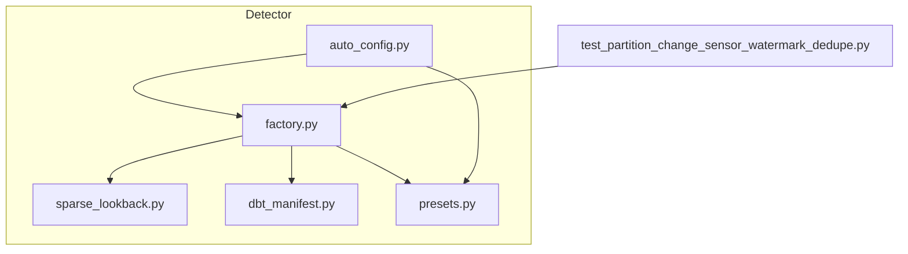
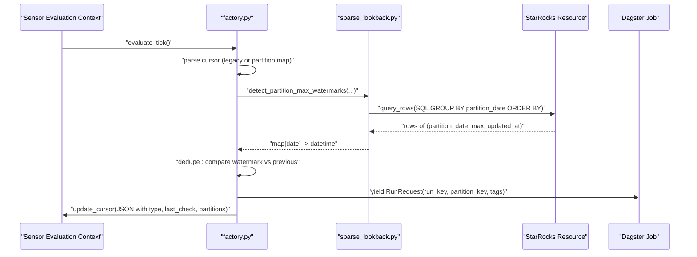
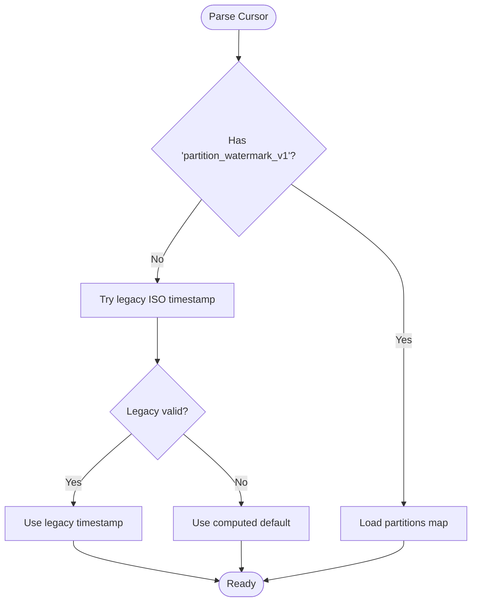
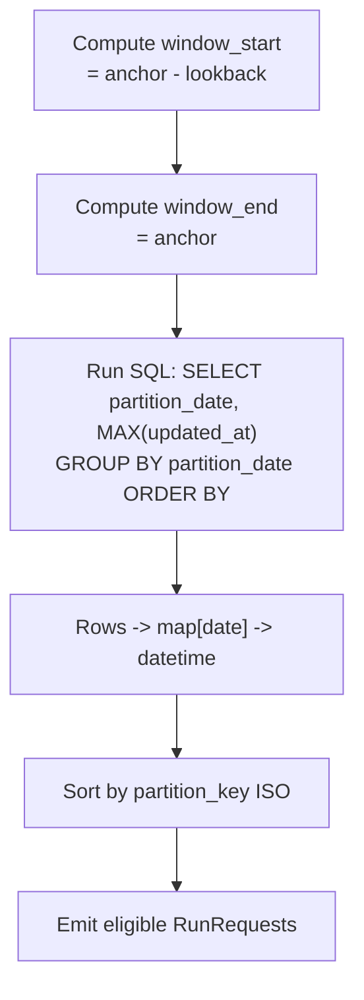
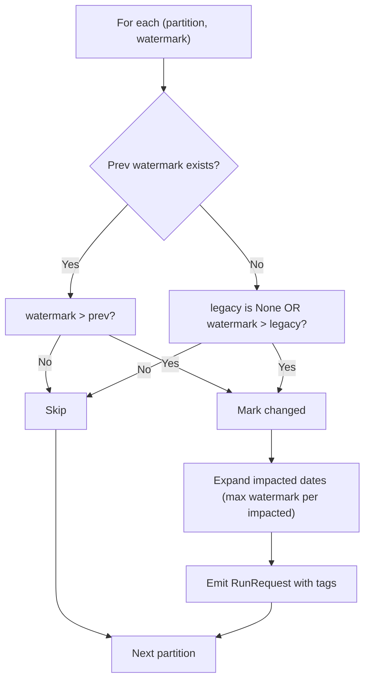
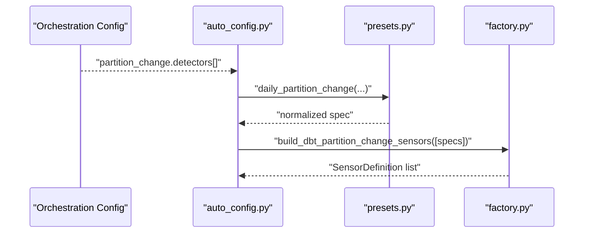
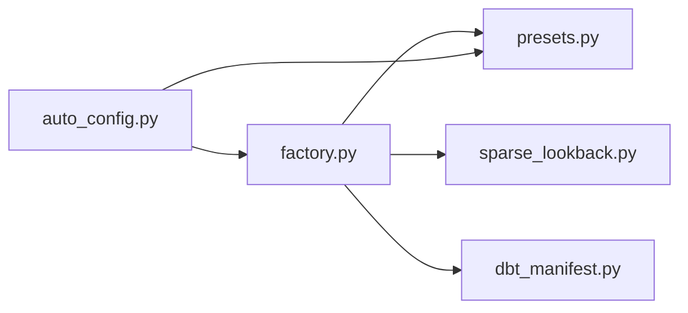

# Watermark Management

<cite>
**Referenced Files in This Document**
- [factory.py](file://src/dbt_dagsterizer/sensors/partition_change/detector/factory.py)
- [sparse_lookback.py](file://src/dbt_dagsterizer/sensors/partition_change/detector/sparse_lookback.py)
- [dbt_manifest.py](file://src/dbt_dagsterizer/sensors/partition_change/detector/dbt_manifest.py)
- [auto_config.py](file://src/dbt_dagsterizer/sensors/partition_change/auto_config.py)
- [presets.py](file://src/dbt_dagsterizer/sensors/partition_change/detector/presets.py)
- [test_partition_change_sensor_watermark_dedupe.py](file://tests/test_partition_change_sensor_watermark_dedupe.py)
</cite>

## Table of Contents
1. [Introduction](#introduction)
2. [Project Structure](#project-structure)
3. [Core Components](#core-components)
4. [Architecture Overview](#architecture-overview)
5. [Detailed Component Analysis](#detailed-component-analysis)
6. [Dependency Analysis](#dependency-analysis)
7. [Performance Considerations](#performance-considerations)
8. [Troubleshooting Guide](#troubleshooting-guide)
9. [Conclusion](#conclusion)

## Introduction
This document explains watermark management in sensor configuration for detecting partition changes. It covers how watermarks are stored, tracked, and deduplicated; how automatic configuration builds sensors; how cursors persist state across runs; and how watermarks are validated and emitted. It also documents naming conventions, metadata tagging, conflict resolution, stale watermark handling, monitoring approaches, configuration options, performance considerations, and troubleshooting steps.

## Project Structure
The watermark management logic resides in the partition change detector module. Key files:
- Sensor factory that constructs sensors, computes watermarks, emits run requests, and updates cursors
- Sparse lookback utilities that parse detector metadata, compute affected partitions, and query watermarks
- Manifest loader for dbt model/source metadata
- Auto configuration builder that generates sensor specs from orchestration configuration
- Preset helpers that normalize sensor spec construction
- Tests validating watermark cursor format and deduplication behavior

**Diagram sources**
- [factory.py:1-206](file://src/dbt_dagsterizer/sensors/partition_change/detector/factory.py#L1-L206)
- [sparse_lookback.py:1-219](file://src/dbt_dagsterizer/sensors/partition_change/detector/sparse_lookback.py#L1-L219)
- [dbt_manifest.py:1-64](file://src/dbt_dagsterizer/sensors/partition_change/detector/dbt_manifest.py#L1-L64)
- [presets.py:1-36](file://src/dbt_dagsterizer/sensors/partition_change/detector/presets.py#L1-L36)
- [auto_config.py:1-166](file://src/dbt_dagsterizer/sensors/partition_change/auto_config.py#L1-L166)
- [test_partition_change_sensor_watermark_dedupe.py:1-118](file://tests/test_partition_change_sensor_watermark_dedupe.py#L1-L118)

**Section sources**
- [factory.py:1-206](file://src/dbt_dagsterizer/sensors/partition_change/detector/factory.py#L1-L206)
- [sparse_lookback.py:1-219](file://src/dbt_dagsterizer/sensors/partition_change/detector/sparse_lookback.py#L1-L219)
- [dbt_manifest.py:1-64](file://src/dbt_dagsterizer/sensors/partition_change/detector/dbt_manifest.py#L1-L64)
- [auto_config.py:1-166](file://src/dbt_dagsterizer/sensors/partition_change/auto_config.py#L1-L166)
- [presets.py:1-36](file://src/dbt_dagsterizer/sensors/partition_change/detector/presets.py#L1-L36)
- [test_partition_change_sensor_watermark_dedupe.py:1-118](file://tests/test_partition_change_sensor_watermark_dedupe.py#L1-L118)

## Core Components
- Watermark cursor format: A JSON payload persisted in the sensor’s cursor containing a type marker, last check timestamp, and per-partition watermark entries. The format is parsed and validated by the factory.
- Watermark computation: The detector queries the latest watermark per partition within a date window and optionally expands impacted dates based on configured impact ranges.
- Deduplication: Emission occurs only when the computed watermark exceeds the previously recorded watermark for that partition or when a legacy timestamp indicates initial emission.
- Run request generation: Each eligible watermark produces a RunRequest with a composite run_key and tags including the detected watermark value.
- Persistence: After evaluation, the factory writes a new cursor reflecting the latest per-partition watermarks.

**Section sources**
- [factory.py:28-46](file://src/dbt_dagsterizer/sensors/partition_change/detector/factory.py#L28-L46)
- [factory.py:108-201](file://src/dbt_dagsterizer/sensors/partition_change/detector/factory.py#L108-L201)
- [sparse_lookback.py:172-218](file://src/dbt_dagsterizer/sensors/partition_change/detector/sparse_lookback.py#L172-L218)

## Architecture Overview
The watermark lifecycle spans sensor evaluation, watermark detection, deduplication, and cursor update.

**Diagram sources**
- [factory.py:87-201](file://src/dbt_dagsterizer/sensors/partition_change/detector/factory.py#L87-L201)
- [sparse_lookback.py:172-218](file://src/dbt_dagsterizer/sensors/partition_change/detector/sparse_lookback.py#L172-L218)

## Detailed Component Analysis

### Watermark Storage and Cursor Parsing
- Legacy cursor parsing supports ISO timestamp fallback when the new cursor format is absent or invalid.
- New cursor format is a JSON object with:
  - type: a version marker
  - last_check: timestamp of last evaluation
  - partitions: map of partition_key to watermark_key (ISO timestamps)
- The parser validates presence, types, and structure; invalid payloads reset to empty state.

**Diagram sources**
- [factory.py:18-46](file://src/dbt_dagsterizer/sensors/partition_change/detector/factory.py#L18-L46)

**Section sources**
- [factory.py:18-46](file://src/dbt_dagsterizer/sensors/partition_change/detector/factory.py#L18-L46)

### Timestamp Tracking and Watermark Computation
- Window selection: Uses current UTC time, offset by offset_days, and computes lookback_days window.
- Watermark retrieval: Executes SQL grouped by partition date and ordered by partition date to produce a deterministic sequence.
- Type normalization: Converts partition and watermark values to date and datetime respectively for consistent comparison.

**Diagram sources**
- [factory.py:95-134](file://src/dbt_dagsterizer/sensors/partition_change/detector/factory.py#L95-L134)
- [sparse_lookback.py:172-218](file://src/dbt_dagsterizer/sensors/partition_change/detector/sparse_lookback.py#L172-L218)

**Section sources**
- [factory.py:95-134](file://src/dbt_dagsterizer/sensors/partition_change/detector/factory.py#L95-L134)
- [sparse_lookback.py:172-218](file://src/dbt_dagsterizer/sensors/partition_change/detector/sparse_lookback.py#L172-L218)

### Watermark Deduplication Strategy
- For each partition, compare computed watermark with:
  - Previously recorded watermark (if present)
  - Legacy timestamp (if no prior watermark)
- Emits only when watermark increased; otherwise skips.
- Impact range expansion ensures downstream partitions emit when upstream watermark advances.

**Diagram sources**
- [factory.py:134-170](file://src/dbt_dagsterizer/sensors/partition_change/detector/factory.py#L134-L170)
- [sparse_lookback.py:124-132](file://src/dbt_dagsterizer/sensors/partition_change/detector/sparse_lookback.py#L124-L132)

**Section sources**
- [factory.py:134-170](file://src/dbt_dagsterizer/sensors/partition_change/detector/factory.py#L134-L170)
- [sparse_lookback.py:124-132](file://src/dbt_dagsterizer/sensors/partition_change/detector/sparse_lookback.py#L124-L132)

### Automatic Watermark Configuration
- Auto-config reads orchestration configuration and derives sensor specs for partition-change detectors and propagators.
- Detector specs are built from dbt manifest and orchestration settings, including optional impact ranges and expressions.
- Propagation specs are validated for uniqueness and correctness.

**Diagram sources**
- [auto_config.py:30-97](file://src/dbt_dagsterizer/sensors/partition_change/auto_config.py#L30-L97)
- [presets.py:1-36](file://src/dbt_dagsterizer/sensors/partition_change/detector/presets.py#L1-L36)
- [factory.py:49-205](file://src/dbt_dagsterizer/sensors/partition_change/detector/factory.py#L49-L205)

**Section sources**
- [auto_config.py:30-97](file://src/dbt_dagsterizer/sensors/partition_change/auto_config.py#L30-L97)
- [presets.py:1-36](file://src/dbt_dagsterizer/sensors/partition_change/detector/presets.py#L1-L36)
- [factory.py:49-205](file://src/dbt_dagsterizer/sensors/partition_change/detector/factory.py#L49-L205)

### Watermark Naming Conventions and Metadata Association
- Partition key: ISO date string derived from partition date.
- Watermark key: ISO timestamp string derived from watermark datetime.
- Run key: Composite string combining sensor name, partition key, and watermark key.
- Tags:
  - Detector model name
  - Detected relation
  - Luban partition watermark value

These conventions ensure unique run identifiers and searchable metadata.

**Section sources**
- [factory.py:172-190](file://src/dbt_dagsterizer/sensors/partition_change/detector/factory.py#L172-L190)

### Watermark Validation Processes
- Missing relation handling: If the underlying relation does not exist, the sensor logs a warning and yields a skip reason, avoiding repeated failures.
- Cursor validation: Only accepts the new cursor format with correct type marker; otherwise falls back to legacy or default behavior.
- Test coverage: Validates cursor payload shape, watermark-based deduplication, and run_key composition.

**Section sources**
- [factory.py:115-126](file://src/dbt_dagsterizer/sensors/partition_change/detector/factory.py#L115-L126)
- [test_partition_change_sensor_watermark_dedupe.py:94-117](file://tests/test_partition_change_sensor_watermark_dedupe.py#L94-L117)

### Watermark Persistence Across Runs
- After each tick, the factory writes a JSON cursor containing:
  - type marker
  - last_check timestamp
  - partitions map of partition_key to watermark_key
- Subsequent ticks read this cursor to compute differences and avoid redundant emissions.

**Section sources**
- [factory.py:192-201](file://src/dbt_dagsterizer/sensors/partition_change/detector/factory.py#L192-L201)

### Watermark Conflict Resolution and Cleanup
- Conflict resolution: When multiple upstream partitions influence downstream partitions via impact ranges, the system keeps the maximum watermark per impacted date, ensuring downstream runs reflect the latest state.
- Cleanup: No explicit cleanup routine is implemented; stale partitions remain in the cursor map until superseded by newer watermarks.

**Section sources**
- [factory.py:160-170](file://src/dbt_dagsterizer/sensors/partition_change/detector/factory.py#L160-L170)

### Stale Watermark Handling
- Legacy timestamp fallback: If no prior watermark is found, the sensor compares against a legacy timestamp derived from the lookback window to decide initial emission.
- Window bounds: Partitions outside the computed window are ignored during emission.

**Section sources**
- [factory.py:100-106](file://src/dbt_dagsterizer/sensors/partition_change/detector/factory.py#L100-L106)
- [factory.py:172-177](file://src/dbt_dagsterizer/sensors/partition_change/detector/factory.py#L172-L177)

### Monitoring Approaches
- Tag-based observability: Run requests include tags for detector model, detected relation, and watermark value, enabling filtering and dashboards.
- Cursor inspection: Administrators can inspect sensor cursors to verify last_check and per-partition watermark values.
- Test-driven validation: Unit tests confirm cursor shape and deduplication behavior.

**Section sources**
- [factory.py:185-189](file://src/dbt_dagsterizer/sensors/partition_change/detector/factory.py#L185-L189)
- [test_partition_change_sensor_watermark_dedupe.py:94-96](file://tests/test_partition_change_sensor_watermark_dedupe.py#L94-L96)

### Watermark Configuration Options
- Detector configuration keys:
  - partition_type: daily
  - name: sensor name
  - job_name: target Dagster job
  - detector_model: model name for metadata
  - enabled: enable/disable sensor
  - lookback_days: days to scan backward
  - offset_days: anchor offset from today
  - minimum_interval_seconds: polling interval
  - meta: detector metadata including detect_relation or detect_source, partition_date_expr, updated_at_expr, and optional impact range
- Preset helper enforces non-negative numeric constraints and non-empty strings.

**Section sources**
- [factory.py:67-78](file://src/dbt_dagsterizer/sensors/partition_change/detector/factory.py#L67-L78)
- [presets.py:11-35](file://src/dbt_dagsterizer/sensors/partition_change/detector/presets.py#L11-L35)
- [auto_config.py:84-95](file://src/dbt_dagsterizer/sensors/partition_change/auto_config.py#L84-L95)

## Dependency Analysis
The detector depends on:
- Sparse lookback utilities for metadata parsing, SQL expression building, and watermark queries
- Manifest loader for resolving dbt sources to relation names
- Auto configuration for deriving sensor specs from orchestration settings

**Diagram sources**
- [factory.py:10-15](file://src/dbt_dagsterizer/sensors/partition_change/detector/factory.py#L10-L15)
- [sparse_lookback.py:63-113](file://src/dbt_dagsterizer/sensors/partition_change/detector/sparse_lookback.py#L63-L113)
- [dbt_manifest.py:23-62](file://src/dbt_dagsterizer/sensors/partition_change/detector/dbt_manifest.py#L23-L62)
- [auto_config.py:20-21](file://src/dbt_dagsterizer/sensors/partition_change/auto_config.py#L20-L21)

**Section sources**
- [factory.py:10-15](file://src/dbt_dagsterizer/sensors/partition_change/detector/factory.py#L10-L15)
- [sparse_lookback.py:63-113](file://src/dbt_dagsterizer/sensors/partition_change/detector/sparse_lookback.py#L63-L113)
- [dbt_manifest.py:23-62](file://src/dbt_dagsterizer/sensors/partition_change/detector/dbt_manifest.py#L23-L62)
- [auto_config.py:20-21](file://src/dbt_dagsterizer/sensors/partition_change/auto_config.py#L20-L21)

## Performance Considerations
- Query efficiency: The watermark query groups by partition date and orders results deterministically, minimizing overhead.
- Impact range expansion: Limits emission to affected partitions, reducing unnecessary downstream runs.
- Cursor updates: Persisting only per-partition watermarks avoids large payloads while maintaining correctness.
- Interval tuning: minimum_interval_seconds balances sensitivity and resource usage.

[No sources needed since this section provides general guidance]

## Troubleshooting Guide
Common issues and resolutions:
- Missing relation: Sensor logs a warning and skips; ensure dbt manifest and relation names are correct.
- Invalid cursor: Parser resets to empty/new defaults; verify sensor cursor format and permissions.
- Duplicate sensor names: Factory raises an error; ensure unique sensor names.
- Unexpected deduplication: Confirm partition_key and watermark_key formats and that previous watermarks exist in the cursor.
- Impact range misconfiguration: Verify start_offset_days ≤ end_offset_days and that upstream changes propagate as intended.

**Section sources**
- [factory.py:115-126](file://src/dbt_dagsterizer/sensors/partition_change/detector/factory.py#L115-L126)
- [factory.py:50-61](file://src/dbt_dagsterizer/sensors/partition_change/detector/factory.py#L50-L61)
- [test_partition_change_sensor_watermark_dedupe.py:94-117](file://tests/test_partition_change_sensor_watermark_dedupe.py#L94-L117)

## Conclusion
The watermark management system provides robust, deterministic detection of partition changes with strong persistence guarantees and efficient deduplication. By leveraging structured cursors, tag-based observability, and configurable impact ranges, it scales to complex downstream propagation scenarios while remaining easy to monitor and troubleshoot.