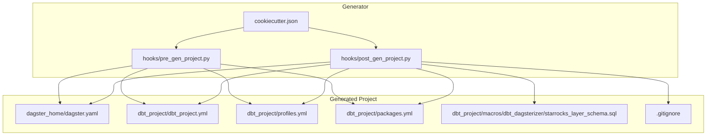
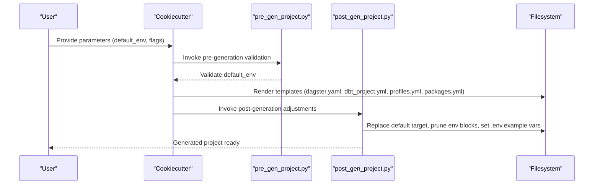
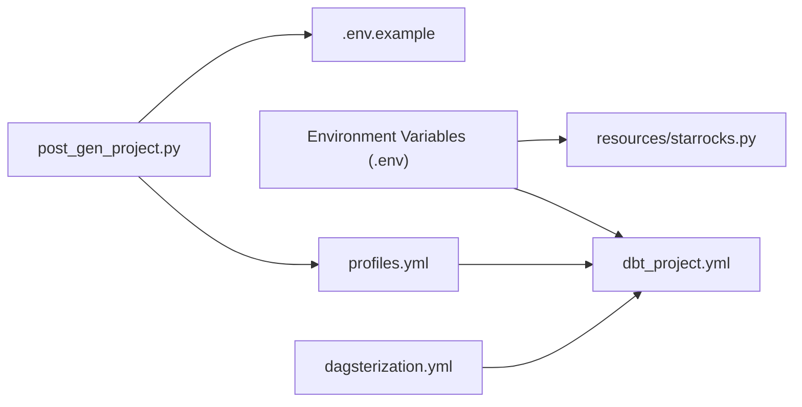

# Configuration Templates

<cite>
**Referenced Files in This Document**
- [dagster.yaml](file://src/dbt_dagsterizer/project_templates/luban-dagster-dbt-starrocks-code-location-source-template/{{cookiecutter.output_name}}/dagster_home/dagster.yaml)
- [dbt_project.yml](file://src/dbt_dagsterizer/project_templates/luban-dagster-dbt-starrocks-code-location-source-template/{{cookiecutter.output_name}}/dbt_project/dbt_project.yml)
- [profiles.yml](file://src/dbt_dagsterizer/project_templates/luban-dagster-dbt-starrocks-code-location-source-template/{{cookiecutter.output_name}}/dbt_project/profiles.yml)
- [packages.yml](file://src/dbt_dagsterizer/project_templates/luban-dagster-dbt-starrocks-code-location-source-template/{{cookiecutter.output_name}}/dbt_project/packages.yml)
- [cookiecutter.json](file://src/dbt_dagsterizer/project_templates/luban-dagster-dbt-starrocks-code-location-source-template/cookiecutter.json)
- [post_gen_project.py](file://src/dbt_dagsterizer/project_templates/luban-dagster-dbt-starrocks-code-location-source-template/hooks/post_gen_project.py)
- [pre_gen_project.py](file://src/dbt_dagsterizer/project_templates/luban-dagster-dbt-starrocks-code-location-source-template/hooks/pre_gen_project.py)
- [.gitignore](file://src/dbt_dagsterizer/project_templates/luban-dagster-dbt-starrocks-code-location-source-template/{{cookiecutter.output_name}}/.gitignore)
- [env_utils.py](file://src/dbt_dagsterizer/env_utils.py)
- [dagsterization.yml](file://src/dbt_dagsterizer/orchestration_config.py)
- [starrocks_layer_schema.sql](file://src/dbt_dagsterizer/project_templates/luban-dagster-dbt-starrocks-code-location-source-template/{{cookiecutter.output_name}}/dbt_project/macros/dbt_dagsterizer/starrocks_layer_schema.sql)
- [starrocks.py](file://src/dbt_dagsterizer/resources/starrocks.py)
</cite>

## Table of Contents
1. [Introduction](#introduction)
2. [Project Structure](#project-structure)
3. [Core Components](#core-components)
4. [Architecture Overview](#architecture-overview)
5. [Detailed Component Analysis](#detailed-component-analysis)
6. [Dependency Analysis](#dependency-analysis)
7. [Performance Considerations](#performance-considerations)
8. [Troubleshooting Guide](#troubleshooting-guide)
9. [Conclusion](#conclusion)

## Introduction
This document explains the configuration templates used by the project generator to scaffold a Dagster + dbt project with StarRocks connectivity. It focuses on:
- The Dagster instance configuration template (dagster.yaml) for run coordination and telemetry
- The dbt project configuration template (dbt_project.yml) for project metadata, paths, and variables
- The dbt profiles template (profiles.yml) for environment-specific database connections and authentication
- The dbt packages template (packages.yml) for managing dbt packages and dependencies
It also covers customization, environment-specific settings, and best practices for maintaining these templates.

## Project Structure
The generator creates a standard layout with:
- A Dagster home directory containing the instance configuration
- A dbt project directory containing dbt configuration, profiles, packages, macros, and project scaffolding
- Cookiecutter configuration to parameterize the generated project
- Post-generation hooks to tailor the configuration to the selected environment

**Diagram sources**
- [dagster.yaml](file://src/dbt_dagsterizer/project_templates/luban-dagster-dbt-starrocks-code-location-source-template/{{cookiecutter.output_name}}/dagster_home/dagster.yaml)
- [dbt_project.yml](file://src/dbt_dagsterizer/project_templates/luban-dagster-dbt-starrocks-code-location-source-template/{{cookiecutter.output_name}}/dbt_project/dbt_project.yml)
- [profiles.yml](file://src/dbt_dagsterizer/project_templates/luban-dagster-dbt-starrocks-code-location-source-template/{{cookiecutter.output_name}}/dbt_project/profiles.yml)
- [packages.yml](file://src/dbt_dagsterizer/project_templates/luban-dagster-dbt-starrocks-code-location-source-template/{{cookiecutter.output_name}}/dbt_project/packages.yml)
- [cookiecutter.json](file://src/dbt_dagsterizer/project_templates/luban-dagster-dbt-starrocks-code-location-source-template/cookiecutter.json)
- [post_gen_project.py](file://src/dbt_dagsterizer/project_templates/luban-dagster-dbt-starrocks-code-location-source-template/hooks/post_gen_project.py)
- [pre_gen_project.py](file://src/dbt_dagsterizer/project_templates/luban-dagster-dbt-starrocks-code-location-source-template/hooks/pre_gen_project.py)
- [starrocks_layer_schema.sql](file://src/dbt_dagsterizer/project_templates/luban-dagster-dbt-starrocks-code-location-source-template/{{cookiecutter.output_name}}/dbt_project/macros/dbt_dagsterizer/starrocks_layer_schema.sql)
- [.gitignore](file://src/dbt_dagsterizer/project_templates/luban-dagster-dbt-starrocks-code-location-source-template/{{cookiecutter.output_name}}/.gitignore)

**Section sources**
- [cookiecutter.json](file://src/dbt_dagsterizer/project_templates/luban-dagster-dbt-starrocks-code-location-source-template/cookiecutter.json)
- [post_gen_project.py](file://src/dbt_dagsterizer/project_templates/luban-dagster-dbt-starrocks-code-location-source-template/hooks/post_gen_project.py)
- [pre_gen_project.py](file://src/dbt_dagsterizer/project_templates/luban-dagster-dbt-starrocks-code-location-source-template/hooks/pre_gen_project.py)

## Core Components
- Dagster instance configuration (dagster.yaml): Defines run coordination behavior and telemetry toggles.
- dbt project configuration (dbt_project.yml): Declares project metadata, path mappings, target path, clean targets, and model materialization defaults.
- dbt profiles (profiles.yml): Provides environment-specific connection settings for StarRocks and default values via environment variables.
- dbt packages (packages.yml): Manages dbt packages and dependencies.
- Cookiecutter configuration (cookiecutter.json): Supplies project metadata and default environment selection.
- Post-generation hooks (hooks/post_gen_project.py): Adjusts defaults and prunes unused environments after project generation.
- Pre-generation validation (hooks/pre_gen_project.py): Ensures the selected default environment is supported.
- Environment variable loading utilities (env_utils.py): Loads .env files and injects overrides for dbt projects.
- Orchestration configuration (dagsterization.yml): Defines scheduling and partitioning configuration for dbt jobs.

**Section sources**
- [dagster.yaml](file://src/dbt_dagsterizer/project_templates/luban-dagster-dbt-starrocks-code-location-source-template/{{cookiecutter.output_name}}/dagster_home/dagster.yaml)
- [dbt_project.yml](file://src/dbt_dagsterizer/project_templates/luban-dagster-dbt-starrocks-code-location-source-template/{{cookiecutter.output_name}}/dbt_project/dbt_project.yml)
- [profiles.yml](file://src/dbt_dagsterizer/project_templates/luban-dagster-dbt-starrocks-code-location-source-template/{{cookiecutter.output_name}}/dbt_project/profiles.yml)
- [packages.yml](file://src/dbt_dagsterizer/project_templates/luban-dagster-dbt-starrocks-code-location-source-template/{{cookiecutter.output_name}}/dbt_project/packages.yml)
- [cookiecutter.json](file://src/dbt_dagsterizer/project_templates/luban-dagster-dbt-starrocks-code-location-source-template/cookiecutter.json)
- [post_gen_project.py](file://src/dbt_dagsterizer/project_templates/luban-dagster-dbt-starrocks-code-location-source-template/hooks/post_gen_project.py)
- [pre_gen_project.py](file://src/dbt_dagsterizer/project_templates/luban-dagster-dbt-starrocks-code-location-source-template/hooks/pre_gen_project.py)
- [env_utils.py](file://src/dbt_dagsterizer/env_utils.py)
- [dagsterization.yml](file://src/dbt_dagsterizer/orchestration_config.py)

## Architecture Overview
The configuration templates integrate with the generator and runtime systems as follows:
- Cookiecutter renders templates with project parameters
- Pre-generation hook validates environment selection
- Post-generation hook adjusts defaults and environment blocks
- dbt_project.yml and profiles.yml define runtime connectivity and project behavior
- dagsterization.yml defines orchestration behavior for dbt jobs
- Environment variables loaded via env_utils.py influence dbt and StarRocks resource initialization

**Diagram sources**
- [cookiecutter.json](file://src/dbt_dagsterizer/project_templates/luban-dagster-dbt-starrocks-code-location-source-template/cookiecutter.json)
- [pre_gen_project.py](file://src/dbt_dagsterizer/project_templates/luban-dagster-dbt-starrocks-code-location-source-template/hooks/pre_gen_project.py)
- [post_gen_project.py](file://src/dbt_dagsterizer/project_templates/luban-dagster-dbt-starrocks-code-location-source-template/hooks/post_gen_project.py)
- [dagster.yaml](file://src/dbt_dagsterizer/project_templates/luban-dagster-dbt-starrocks-code-location-source-template/{{cookiecutter.output_name}}/dagster_home/dagster.yaml)
- [dbt_project.yml](file://src/dbt_dagsterizer/project_templates/luban-dagster-dbt-starrocks-code-location-source-template/{{cookiecutter.output_name}}/dbt_project/dbt_project.yml)
- [profiles.yml](file://src/dbt_dagsterizer/project_templates/luban-dagster-dbt-starrocks-code-location-source-template/{{cookiecutter.output_name}}/dbt_project/profiles.yml)
- [packages.yml](file://src/dbt_dagsterizer/project_templates/luban-dagster-dbt-starrocks-code-location-source-template/{{cookiecutter.output_name}}/dbt_project/packages.yml)

## Detailed Component Analysis

### Dagster Instance Configuration (dagster.yaml)
Purpose:
- Configure run coordination and telemetry for the Dagster instance
- Allow environment-driven concurrency limits

Key aspects:
- Run coordinator configuration with queued run coordination
- Environment variable-backed concurrency limit
- Telemetry disabled by default

Customization tips:
- Adjust max concurrent runs via environment variable
- Enable telemetry in controlled environments if needed

**Section sources**
- [dagster.yaml](file://src/dbt_dagsterizer/project_templates/luban-dagster-dbt-starrocks-code-location-source-template/{{cookiecutter.output_name}}/dagster_home/dagster.yaml)

### dbt Project Configuration (dbt_project.yml)
Purpose:
- Define dbt project metadata, paths, and defaults
- Control target path and cleanup targets
- Provide environment-specific variables

Key aspects:
- Project name and version derived from cookiecutter parameters
- Profile linkage to the generated profile block
- Variable defaults for testing and development
- Model paths and materialization defaults for layers
- Target path and clean targets for artifacts and packages

Customization tips:
- Override variables per environment using .env files
- Adjust materialization defaults for layers as needed
- Add or remove model paths according to project needs

**Section sources**
- [dbt_project.yml](file://src/dbt_dagsterizer/project_templates/luban-dagster-dbt-starrocks-code-location-source-template/{{cookiecutter.output_name}}/dbt_project/dbt_project.yml)
- [cookiecutter.json](file://src/dbt_dagsterizer/project_templates/luban-dagster-dbt-starrocks-code-location-source-template/cookiecutter.json)

### dbt Profiles (profiles.yml)
Purpose:
- Define environment-specific database connections and authentication
- Support multiple targets (development, sandbox, production)
- Use environment variables for sensitive values

Key aspects:
- Profile name derived from cookiecutter parameters
- Targets configured for StarRocks with host, port, user, password, threads, and initial SQL
- Default target selection via environment variable
- Conditional pruning of environments post-generation

Customization tips:
- Set environment variables for secure credential management
- Add or remove targets based on deployment stages
- Tune thread counts and timeouts per environment

**Section sources**
- [profiles.yml](file://src/dbt_dagsterizer/project_templates/luban-dagster-dbt-starrocks-code-location-source-template/{{cookiecutter.output_name}}/dbt_project/profiles.yml)
- [post_gen_project.py](file://src/dbt_dagsterizer/project_templates/luban-dagster-dbt-starrocks-code-location-source-template/hooks/post_gen_project.py)

### dbt Packages (packages.yml)
Purpose:
- Manage dbt packages and dependencies
- Initialize with an empty packages list for manual addition

Best practices:
- Keep packages pinned to specific versions for reproducibility
- Group related packages under a single namespace
- Review package licenses and compatibility

**Section sources**
- [packages.yml](file://src/dbt_dagsterizer/project_templates/luban-dagster-dbt-starrocks-code-location-source-template/{{cookiecutter.output_name}}/dbt_project/packages.yml)

### Orchestration Configuration (dagsterization.yml)
Purpose:
- Define scheduling and partitioning configuration for dbt jobs
- Provide a structured way to manage jobs, asset jobs, partitions, schedules, and partition-change detectors

Key aspects:
- Versioned orchestration configuration
- Jobs and schedules keyed by name
- Partition-change detectors and propagators
- Helpers to load, create, update, and delete entries

Customization tips:
- Use CLI helpers to initialize and update the orchestration configuration
- Define daily schedules with appropriate offsets and lookbacks
- Track partition-change detectors and propagators for downstream propagation

**Section sources**
- [dagsterization.yml](file://src/dbt_dagsterizer/orchestration_config.py)

### Environment Variables and Resource Initialization
Purpose:
- Load environment variables from .env files and inject them into the runtime
- Initialize StarRocks client with environment-provided credentials

Key aspects:
- Parse .env files and merge overrides
- Respect existing environment variables (do not override)
- Provide a StarRocks client resource initialized from environment variables

Customization tips:
- Place environment-specific overrides in .env files at project root or dbt project root
- Ensure secrets are not committed; rely on .gitignore to exclude .env files
- Use environment variables to tune StarRocks connection parameters

**Section sources**
- [env_utils.py](file://src/dbt_dagsterizer/env_utils.py)
- [starrocks.py](file://src/dbt_dagsterizer/resources/starrocks.py)

### Cookiecutter and Post-Generation Hooks
Purpose:
- Parameterize the generated project via cookiecutter.json
- Validate environment selection pre-generation
- Adjust defaults and prune unused environments post-generation

Key aspects:
- Supported default environments: development, sandbox, production
- Replace default target placeholder with selected environment
- Prune unused environment blocks for sandbox/production
- Set DAGSTER_HOME and LUBAN_REPO_ROOT in .env.example
- Conditionally include or exclude sample dbt project and Docker assets

Customization tips:
- Choose a default environment aligned with your CI/CD pipeline
- Use post-generation adjustments to tailor profiles for each stage
- Keep .env.example up to date with required variables

**Section sources**
- [cookiecutter.json](file://src/dbt_dagsterizer/project_templates/luban-dagster-dbt-starrocks-code-location-source-template/cookiecutter.json)
- [pre_gen_project.py](file://src/dbt_dagsterizer/project_templates/luban-dagster-dbt-starrocks-code-location-source-template/hooks/pre_gen_project.py)
- [post_gen_project.py](file://src/dbt_dagsterizer/project_templates/luban-dagster-dbt-starrocks-code-location-source-template/hooks/post_gen_project.py)

### dbt Macros for Schema Layering
Purpose:
- Route models to appropriate databases/schemas based on layer and path

Key aspects:
- Macro determines schema based on model layer (dwd, dws) or snapshot path
- Uses environment variables for layer-specific databases
- Falls back to target schema otherwise

Customization tips:
- Align environment variables with your StarRocks database layout
- Extend macro logic to support additional layers or conditions

**Section sources**
- [starrocks_layer_schema.sql](file://src/dbt_dagsterizer/project_templates/luban-dagster-dbt-starrocks-code-location-source-template/{{cookiecutter.output_name}}/dbt_project/macros/dbt_dagsterizer/starrocks_layer_schema.sql)

## Dependency Analysis
The configuration templates depend on each other and on runtime utilities:
- dbt_project.yml depends on profiles.yml for credentials and profile linkage
- dagsterization.yml orchestrates dbt jobs defined in dbt_project.yml
- Environment variables from .env files influence both dbt and StarRocks resource initialization
- Post-generation hooks adjust profiles.yml and .env.example based on cookiecutter parameters

**Diagram sources**
- [profiles.yml](file://src/dbt_dagsterizer/project_templates/luban-dagster-dbt-starrocks-code-location-source-template/{{cookiecutter.output_name}}/dbt_project/profiles.yml)
- [dbt_project.yml](file://src/dbt_dagsterizer/project_templates/luban-dagster-dbt-starrocks-code-location-source-template/{{cookiecutter.output_name}}/dbt_project/dbt_project.yml)
- [env_utils.py](file://src/dbt_dagsterizer/env_utils.py)
- [starrocks.py](file://src/dbt_dagsterizer/resources/starrocks.py)
- [post_gen_project.py](file://src/dbt_dagsterizer/project_templates/luban-dagster-dbt-starrocks-code-location-source-template/hooks/post_gen_project.py)
- [dagsterization.yml](file://src/dbt_dagsterizer/orchestration_config.py)

**Section sources**
- [env_utils.py](file://src/dbt_dagsterizer/env_utils.py)
- [starrocks.py](file://src/dbt_dagsterizer/resources/starrocks.py)
- [post_gen_project.py](file://src/dbt_dagsterizer/project_templates/luban-dagster-dbt-starrocks-code-location-source-template/hooks/post_gen_project.py)

## Performance Considerations
- Limit concurrent Dagster runs via environment variable to avoid resource contention
- Tune dbt threads per environment to balance throughput and stability
- Use environment-specific timeouts for StarRocks queries to prevent long-running operations
- Keep target and clean-targets paths minimal to reduce artifact churn

## Troubleshooting Guide
Common issues and resolutions:
- Unsupported default environment: Ensure default_env matches supported values (development, sandbox, production)
- Missing credentials: Verify environment variables for StarRocks and dbt targets are set
- Incorrect target selection: Confirm DBT_TARGET environment variable aligns with intended profile target
- Excessive concurrent runs: Lower DAGSTER_MAX_CONCURRENT_RUNS to protect downstream systems
- .env not applied: Confirm .env files are present and not ignored by .gitignore

**Section sources**
- [pre_gen_project.py](file://src/dbt_dagsterizer/project_templates/luban-dagster-dbt-starrocks-code-location-source-template/hooks/pre_gen_project.py)
- [post_gen_project.py](file://src/dbt_dagsterizer/project_templates/luban-dagster-dbt-starrocks-code-location-source-template/hooks/post_gen_project.py)
- [.gitignore](file://src/dbt_dagsterizer/project_templates/luban-dagster-dbt-starrocks-code-location-source-template/{{cookiecutter.output_name}}/.gitignore)
- [env_utils.py](file://src/dbt_dagsterizer/env_utils.py)

## Conclusion
These configuration templates provide a robust foundation for a Dagster + dbt + StarRocks project. By leveraging environment variables, targeted profiles, and orchestration configuration, teams can maintain consistent setups across environments while keeping secrets and customization separate from the template itself. Use the post-generation hooks to tailor the configuration to your deployment stages and follow the best practices outlined here to ensure reliability and maintainability.