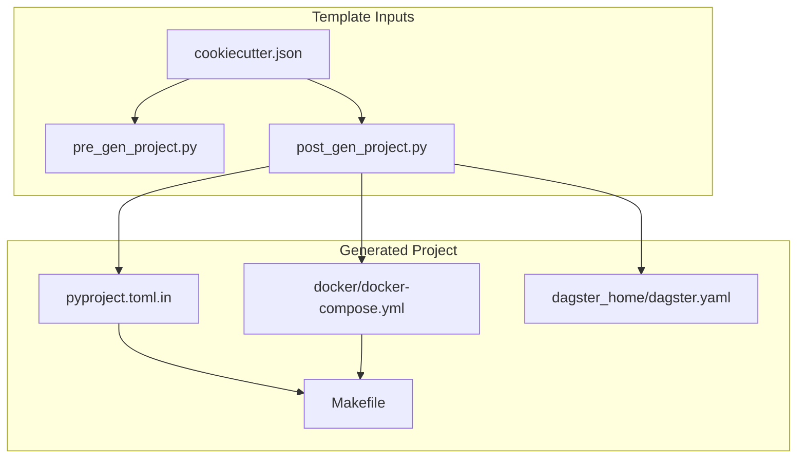
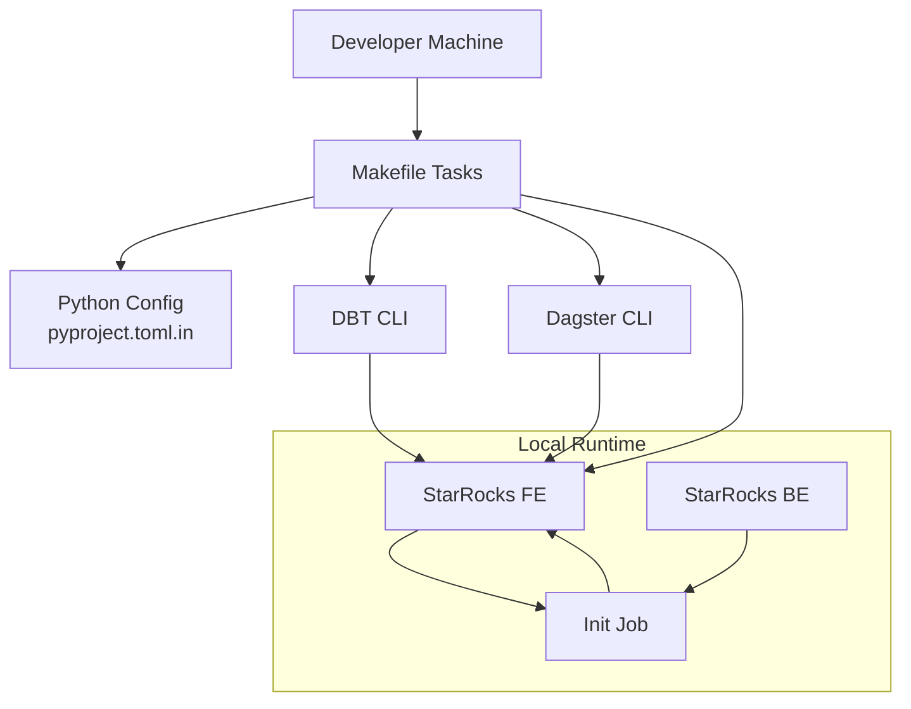
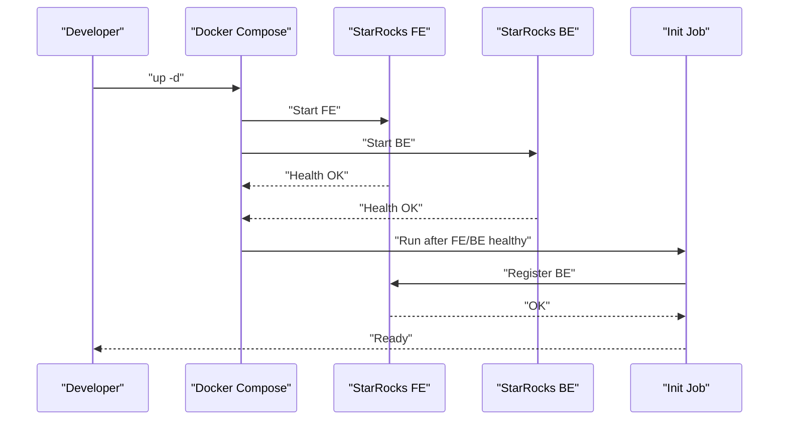
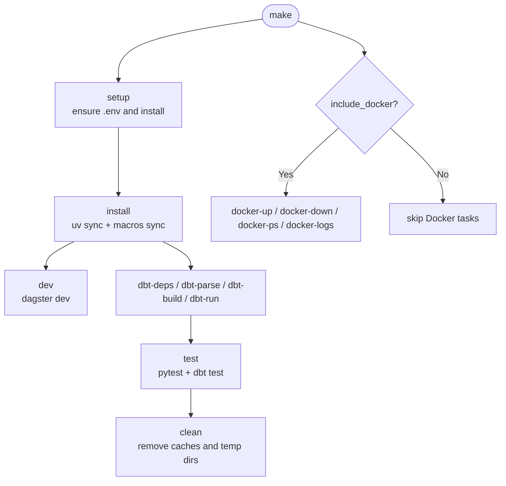
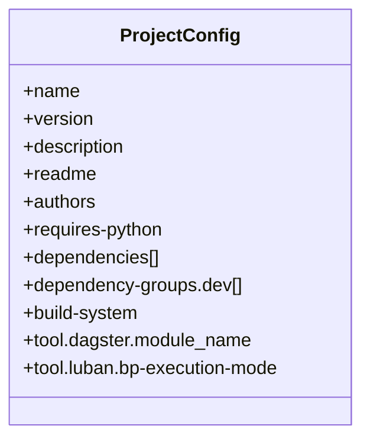
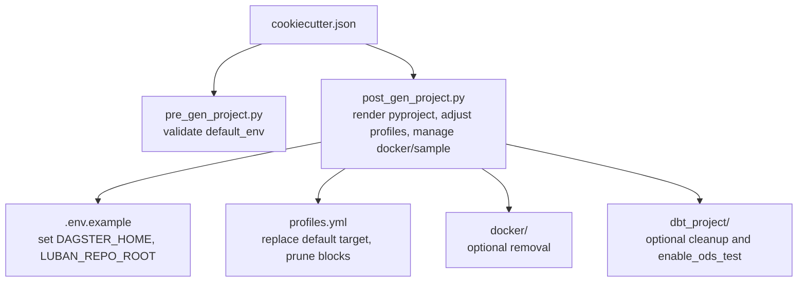
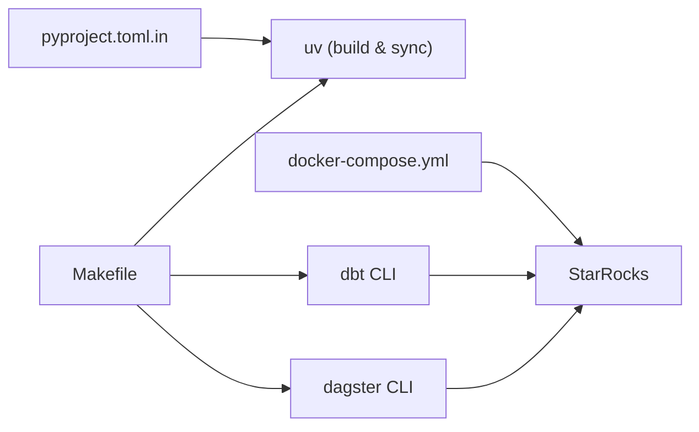

# Environment Setup

<cite>
**Referenced Files in This Document**
- [docker-compose.yml](file://src/dbt_dagsterizer/project_templates/luban-dagster-dbt-starrocks-code-location-source-template/{{cookiecutter.output_name}}/docker/docker-compose.yml)
- [Makefile](file://src/dbt_dagsterizer/project_templates/luban-dagster-dbt-starrocks-code-location-source-template/{{cookiecutter.output_name}}/Makefile)
- [pyproject.toml.in](file://src/dbt_dagsterizer/project_templates/luban-dagster-dbt-starrocks-code-location-source-template/{{cookiecutter.output_name}}/pyproject.toml.in)
- [cookiecutter.json](file://src/dbt_dagsterizer/project_templates/luban-dagster-dbt-starrocks-code-location-source-template/cookiecutter.json)
- [post_gen_project.py](file://src/dbt_dagsterizer/project_templates/luban-dagster-dbt-starrocks-code-location-source-template/hooks/post_gen_project.py)
- [pre_gen_project.py](file://src/dbt_dagsterizer/project_templates/luban-dagster-dbt-starrocks-code-location-source-template/hooks/pre_gen_project.py)
- [dagster.yaml](file://src/dbt_dagsterizer/project_templates/luban-dagster-dbt-starrocks-code-location-source-template/{{cookiecutter.output_name}}/dagster_home/dagster.yaml)
</cite>

## Table of Contents
1. [Introduction](#introduction)
2. [Project Structure](#project-structure)
3. [Core Components](#core-components)
4. [Architecture Overview](#architecture-overview)
5. [Detailed Component Analysis](#detailed-component-analysis)
6. [Dependency Analysis](#dependency-analysis)
7. [Performance Considerations](#performance-considerations)
8. [Troubleshooting Guide](#troubleshooting-guide)
9. [Conclusion](#conclusion)
10. [Appendices](#appendices)

## Introduction
This document explains the environment setup templates included in dbt-dagsterizer’s project scaffolding. It focuses on:
- Containerized development with Docker Compose for StarRocks
- Makefile-based development tasks and automation
- Python project configuration via pyproject.toml.in with uv build and dependency groups
- Environment customization, multi-environment profiles, and CI/CD integration patterns
- Practical development workflows and environment-specific optimizations

## Project Structure
The environment setup templates are part of a Cookiecutter template that generates a complete, runnable project. The relevant files are:
- Docker Compose definition for StarRocks FE/BE services
- Makefile with tasks for setup, development, DBT lifecycle, and optional Docker orchestration
- Python project configuration template with uv build backend and dependency groups
- Cookiecutter configuration and hooks that customize the generated project

**Diagram sources**
- [cookiecutter.json:1-28](file://src/dbt_dagsterizer/project_templates/luban-dagster-dbt-starrocks-code-location-source-template/cookiecutter.json#L1-L28)
- [pre_gen_project.py:1-17](file://src/dbt_dagsterizer/project_templates/luban-dagster-dbt-starrocks-code-location-source-template/hooks/pre_gen_project.py#L1-L17)
- [post_gen_project.py:63-132](file://src/dbt_dagsterizer/project_templates/luban-dagster-dbt-starrocks-code-location-source-template/hooks/post_gen_project.py#L63-L132)
- [docker-compose.yml:1-95](file://src/dbt_dagsterizer/project_templates/luban-dagster-dbt-starrocks-code-location-source-template/{{cookiecutter.output_name}}/docker/docker-compose.yml#L1-L95)
- [Makefile:1-128](file://src/dbt_dagsterizer/project_templates/luban-dagster-dbt-starrocks-code-location-source-template/{{cookiecutter.output_name}}/Makefile#L1-L128)
- [pyproject.toml.in:1-51](file://src/dbt_dagsterizer/project_templates/luban-dagster-dbt-starrocks-code-location-source-template/{{cookiecutter.output_name}}/pyproject.toml.in#L1-L51)
- [dagster.yaml:1-10](file://src/dbt_dagsterizer/project_templates/luban-dagster-dbt-starrocks-code-location-source-template/{{cookiecutter.output_name}}/dagster_home/dagster.yaml#L1-L10)

**Section sources**
- [cookiecutter.json:1-28](file://src/dbt_dagsterizer/project_templates/luban-dagster-dbt-starrocks-code-location-source-template/cookiecutter.json#L1-L28)
- [pre_gen_project.py:1-17](file://src/dbt_dagsterizer/project_templates/luban-dagster-dbt-starrocks-code-location-source-template/hooks/pre_gen_project.py#L1-L17)
- [post_gen_project.py:63-132](file://src/dbt_dagsterizer/project_templates/luban-dagster-dbt-starrocks-code-location-source-template/hooks/post_gen_project.py#L63-L132)

## Core Components
- Docker Compose template defines StarRocks FE/BE services, health checks, port mappings, and a one-shot init job that registers the BE after both services are healthy.
- Makefile provides tasks for environment setup, dependency installation, DBT lifecycle, tests, and optional Docker orchestration.
- pyproject.toml.in defines project metadata, dependencies, dev dependency groups, uv build backend, and Dagster configuration.
- Cookiecutter configuration and hooks control environment defaults, optional inclusion of Docker and sample DBT project, and post-generation adjustments to profiles and environment variables.

**Section sources**
- [docker-compose.yml:1-95](file://src/dbt_dagsterizer/project_templates/luban-dagster-dbt-starrocks-code-location-source-template/{{cookiecutter.output_name}}/docker/docker-compose.yml#L1-L95)
- [Makefile:1-128](file://src/dbt_dagsterizer/project_templates/luban-dagster-dbt-starrocks-code-location-source-template/{{cookiecutter.output_name}}/Makefile#L1-L128)
- [pyproject.toml.in:1-51](file://src/dbt_dagsterizer/project_templates/luban-dagster-dbt-starrocks-code-location-source-template/{{cookiecutter.output_name}}/pyproject.toml.in#L1-L51)
- [cookiecutter.json:1-28](file://src/dbt_dagsterizer/project_templates/luban-dagster-dbt-starrocks-code-location-source-template/cookiecutter.json#L1-L28)
- [post_gen_project.py:63-132](file://src/dbt_dagsterizer/project_templates/luban-dagster-dbt-starrocks-code-location-source-template/hooks/post_gen_project.py#L63-L132)

## Architecture Overview
The environment setup orchestrates three primary concerns:
- Local database runtime via Docker Compose
- Python packaging and dependency management via uv
- DBT orchestration and Dagster code location discovery

**Diagram sources**
- [docker-compose.yml:1-95](file://src/dbt_dagsterizer/project_templates/luban-dagster-dbt-starrocks-code-location-source-template/{{cookiecutter.output_name}}/docker/docker-compose.yml#L1-L95)
- [Makefile:1-128](file://src/dbt_dagsterizer/project_templates/luban-dagster-dbt-starrocks-code-location-source-template/{{cookiecutter.output_name}}/Makefile#L1-L128)
- [pyproject.toml.in:1-51](file://src/dbt_dagsterizer/project_templates/luban-dagster-dbt-starrocks-code-location-source-template/{{cookiecutter.output_name}}/pyproject.toml.in#L1-L51)

## Detailed Component Analysis

### Docker Compose Template
Purpose:
- Provide a reproducible local StarRocks runtime for development and testing.
Key elements:
- Services: FE and BE with startup scripts, health checks, and port mappings.
- Network: A dedicated bridge network for service isolation.
- Init job: Waits for FE/BE readiness, then registers the BE.
- Optional volume mounts: Storage directories are prepared; volumes are not mounted by default to keep the setup ephemeral.

**Diagram sources**
- [docker-compose.yml:1-95](file://src/dbt_dagsterizer/project_templates/luban-dagster-dbt-starrocks-code-location-source-template/{{cookiecutter.output_name}}/docker/docker-compose.yml#L1-L95)

**Section sources**
- [docker-compose.yml:1-95](file://src/dbt_dagsterizer/project_templates/luban-dagster-dbt-starrocks-code-location-source-template/{{cookiecutter.output_name}}/docker/docker-compose.yml#L1-L95)

### Makefile Template
Purpose:
- Centralize development tasks and reduce boilerplate for common workflows.
Key capabilities:
- Environment setup: creates .env from .env.example and installs dependencies.
- Dependency management: delegates to uv sync and macros synchronization.
- DBT lifecycle: deps, parse, build, run, and tests with variable injection.
- Tests: runs Python unit tests and DBT tests with required partition window variables.
- Docker helpers: optional tasks to start/stop/tail logs for local StarRocks.
- Cleanup: removes generated artifacts and caches.

**Diagram sources**
- [Makefile:1-128](file://src/dbt_dagsterizer/project_templates/luban-dagster-dbt-starrocks-code-location-source-template/{{cookiecutter.output_name}}/Makefile#L1-L128)

**Section sources**
- [Makefile:1-128](file://src/dbt_dagsterizer/project_templates/luban-dagster-dbt-starrocks-code-location-source-template/{{cookiecutter.output_name}}/Makefile#L1-L128)

### Python Project Configuration Template (pyproject.toml.in)
Purpose:
- Define project metadata, dependencies, dev groups, build backend, and Dagster configuration.
Highlights:
- Dependencies: pinned Dagster version, dbt-dagsterizer, dbt-core, dbt-starrocks, OpenTelemetry, and others.
- Dependency groups: dev group for webserver and tooling.
- Build system: uv build backend with a compatible version range.
- Tool configuration: Dagster module name and Luban execution mode.
- Optional index override: supports private indexes via cookiecutter variables.

**Diagram sources**
- [pyproject.toml.in:1-51](file://src/dbt_dagsterizer/project_templates/luban-dagster-dbt-starrocks-code-location-source-template/{{cookiecutter.output_name}}/pyproject.toml.in#L1-L51)

**Section sources**
- [pyproject.toml.in:1-51](file://src/dbt_dagsterizer/project_templates/luban-dagster-dbt-starrocks-code-location-source-template/{{cookiecutter.output_name}}/pyproject.toml.in#L1-L51)

### Cookiecutter Configuration and Hooks
Purpose:
- Parameterize the template and post-generate adjustments to tailor the project to environment and preferences.
Key behaviors:
- Supported environments: development, sandbox, production enforced by pre-generation hook.
- Default DBT target substitution in profiles.yml during post-generation.
- Conditional inclusion/removal of Docker and sample DBT project.
- Environment variable bootstrapping in .env.example (DAGSTER_HOME, LUBAN_REPO_ROOT).

**Diagram sources**
- [cookiecutter.json:1-28](file://src/dbt_dagsterizer/project_templates/luban-dagster-dbt-starrocks-code-location-source-template/cookiecutter.json#L1-L28)
- [pre_gen_project.py:1-17](file://src/dbt_dagsterizer/project_templates/luban-dagster-dbt-starrocks-code-location-source-template/hooks/pre_gen_project.py#L1-L17)
- [post_gen_project.py:63-132](file://src/dbt_dagsterizer/project_templates/luban-dagster-dbt-starrocks-code-location-source-template/hooks/post_gen_project.py#L63-L132)

**Section sources**
- [cookiecutter.json:1-28](file://src/dbt_dagsterizer/project_templates/luban-dagster-dbt-starrocks-code-location-source-template/cookiecutter.json#L1-L28)
- [pre_gen_project.py:1-17](file://src/dbt_dagsterizer/project_templates/luban-dagster-dbt-starrocks-code-location-source-template/hooks/pre_gen_project.py#L1-L17)
- [post_gen_project.py:63-132](file://src/dbt_dagsterizer/project_templates/luban-dagster-dbt-starrocks-code-location-source-template/hooks/post_gen_project.py#L63-L132)

### Dagster Runtime Configuration
Purpose:
- Configure Dagster run coordinator concurrency and telemetry for local development.
Highlights:
- Queued run coordinator with max concurrent runs controlled by an environment variable.
- Telemetry disabled by default.

**Section sources**
- [dagster.yaml:1-10](file://src/dbt_dagsterizer/project_templates/luban-dagster-dbt-starrocks-code-location-source-template/{{cookiecutter.output_name}}/dagster_home/dagster.yaml#L1-L10)

## Dependency Analysis
Relationships among environment setup components:
- pyproject.toml.in drives Python packaging and dependency resolution via uv.
- Makefile consumes pyproject.toml.in and invokes uv for install and macros sync.
- Docker Compose provides a local StarRocks runtime for DBT and Dagster to connect to.
- Cookiecutter hooks shape the generated project based on user-provided parameters.

**Diagram sources**
- [pyproject.toml.in:1-51](file://src/dbt_dagsterizer/project_templates/luban-dagster-dbt-starrocks-code-location-source-template/{{cookiecutter.output_name}}/pyproject.toml.in#L1-L51)
- [Makefile:1-128](file://src/dbt_dagsterizer/project_templates/luban-dagster-dbt-starrocks-code-location-source-template/{{cookiecutter.output_name}}/Makefile#L1-L128)
- [docker-compose.yml:1-95](file://src/dbt_dagsterizer/project_templates/luban-dagster-dbt-starrocks-code-location-source-template/{{cookiecutter.output_name}}/docker/docker-compose.yml#L1-L95)

**Section sources**
- [pyproject.toml.in:1-51](file://src/dbt_dagsterizer/project_templates/luban-dagster-dbt-starrocks-code-location-source-template/{{cookiecutter.output_name}}/pyproject.toml.in#L1-L51)
- [Makefile:1-128](file://src/dbt_dagsterizer/project_templates/luban-dagster-dbt-starrocks-code-location-source-template/{{cookiecutter.output_name}}/Makefile#L1-L128)
- [docker-compose.yml:1-95](file://src/dbt_dagsterizer/project_templates/luban-dagster-dbt-starrocks-code-location-source-template/{{cookiecutter.output_name}}/docker/docker-compose.yml#L1-L95)

## Performance Considerations
- StarRocks memory: FE heap is limited in the template to improve local stability; adjust JAVA_OPTS as needed for larger datasets.
- Health checks: short intervals and retries ensure robust startup sequencing; tune for slower hosts if necessary.
- DBT parsing: use dbt parse to generate manifest.json once per change to avoid repeated parsing overhead.
- Concurrency: limit concurrent runs in development via DAGSTER_MAX_CONCURRENT_RUNS to prevent resource contention.

[No sources needed since this section provides general guidance]

## Troubleshooting Guide
Common issues and resolutions:
- Missing DBT_VARS for tests/build/run: these targets require partition window variables; export DBT_VARS accordingly before invoking make targets.
- StarRocks connectivity: use the connectivity test target to validate DBT profile settings.
- Docker stack status: use docker-ps to inspect service states; docker-logs to tail logs for diagnostics.
- Environment variables: ensure .env is copied from .env.example and updated with local credentials; DAGSTER_HOME and LUBAN_REPO_ROOT are set automatically during generation.
- Profiles.yml target: default target is substituted based on cookiecutter default_env; for sandbox/production, development outputs are pruned.

**Section sources**
- [Makefile:50-57](file://src/dbt_dagsterizer/project_templates/luban-dagster-dbt-starrocks-code-location-source-template/{{cookiecutter.output_name}}/Makefile#L50-L57)
- [Makefile:60-62](file://src/dbt_dagsterizer/project_templates/luban-dagster-dbt-starrocks-code-location-source-template/{{cookiecutter.output_name}}/Makefile#L60-L62)
- [Makefile:108-114](file://src/dbt_dagsterizer/project_templates/luban-dagster-dbt-starrocks-code-location-source-template/{{cookiecutter.output_name}}/Makefile#L108-L114)
- [post_gen_project.py:126-131](file://src/dbt_dagsterizer/project_templates/luban-dagster-dbt-starrocks-code-location-source-template/hooks/post_gen_project.py#L126-L131)

## Conclusion
The environment setup templates provide a cohesive, reproducible foundation for developing dbt-dagsterizer projects locally. They combine a containerized StarRocks runtime, a streamlined Makefile for development tasks, and a modern Python configuration powered by uv. Cookiecutter hooks tailor the project to the chosen environment and optional components, enabling flexible multi-environment setups and straightforward CI/CD integration.

[No sources needed since this section summarizes without analyzing specific files]

## Appendices

### Environment Customization Examples
- Multi-environment profiles: choose default_env to scaffold development, sandbox, or production profiles; the post-generation hook replaces the default target and prunes incompatible outputs for sandbox/production.
- Private Python index: supply python_index_url and python_index_name via cookiecutter to configure a private index in pyproject.toml.in.
- Optional components: toggle include_docker and include_sample_dbt_project to include or remove Docker and sample DBT assets.

**Section sources**
- [cookiecutter.json:1-28](file://src/dbt_dagsterizer/project_templates/luban-dagster-dbt-starrocks-code-location-source-template/cookiecutter.json#L1-L28)
- [post_gen_project.py:82-117](file://src/dbt_dagsterizer/project_templates/luban-dagster-dbt-starrocks-code-location-source-template/hooks/post_gen_project.py#L82-L117)
- [pyproject.toml.in:35-40](file://src/dbt_dagsterizer/project_templates/luban-dagster-dbt-starrocks-code-location-source-template/{{cookiecutter.output_name}}/pyproject.toml.in#L35-L40)

### CI/CD Integration Patterns
- Build and test: use uv to install dependencies and run tests; integrate DBT lifecycle steps (deps, parse, build) with your pipeline stages.
- Docker-based integration: optionally spin up StarRocks via docker compose in CI for integration tests; tear down after jobs.
- Manifest caching: cache DBT target artifacts between runs to speed up parse/build.

[No sources needed since this section provides general guidance]