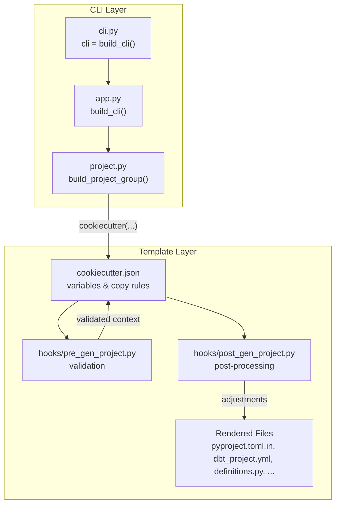
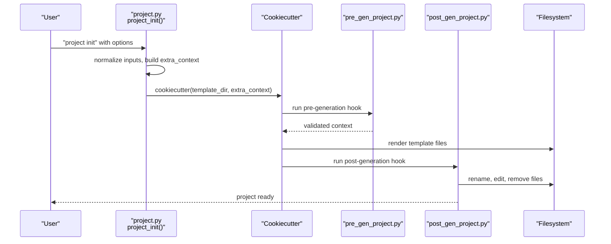
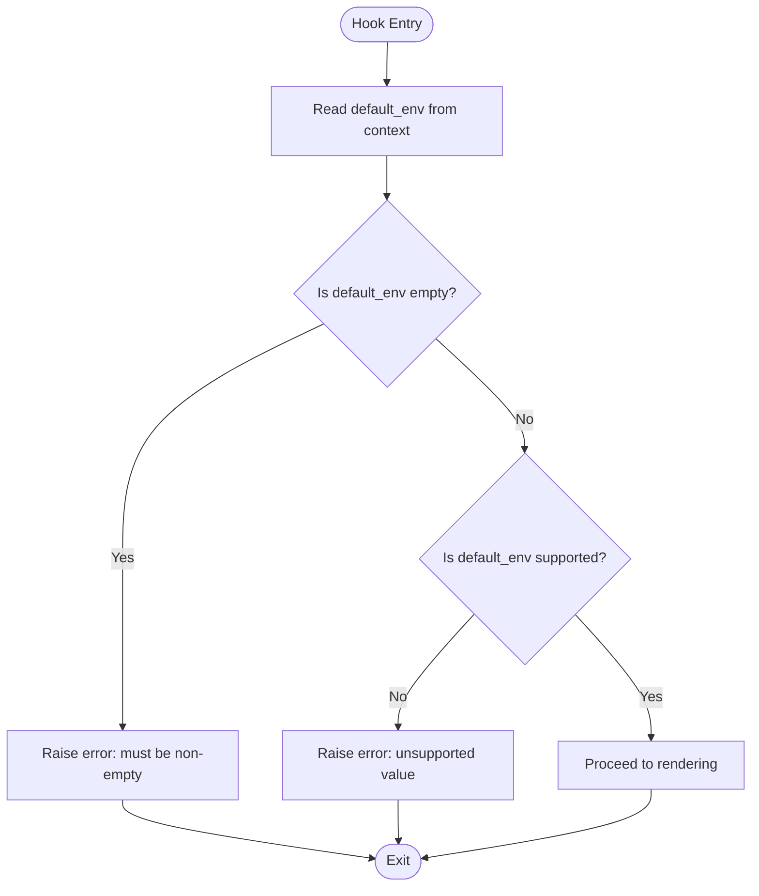
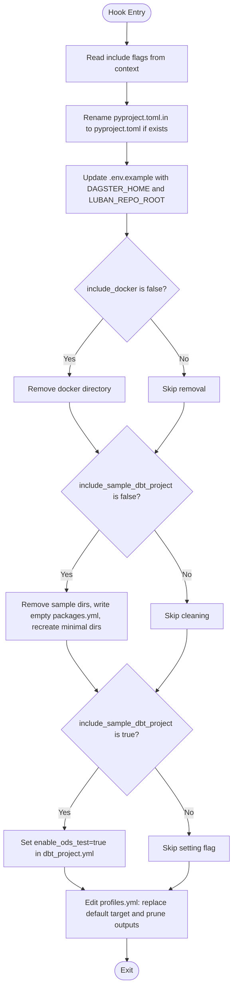
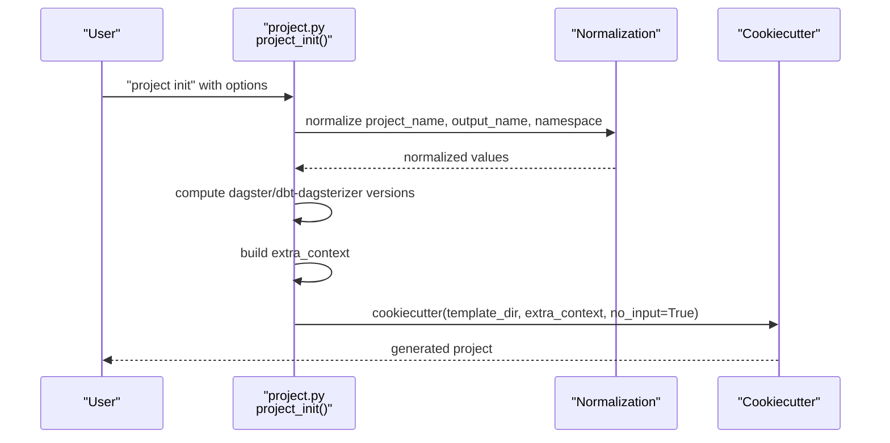
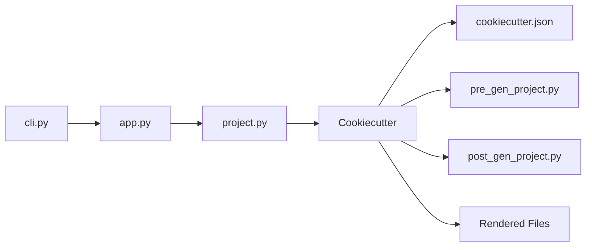

# Project Scaffolding

<cite>
**Referenced Files in This Document**
- [cookiecutter.json](file://src/dbt_dagsterizer/project_templates/luban-dagster-dbt-starrocks-code-location-source-template/cookiecutter.json)
- [pre_gen_project.py](file://src/dbt_dagsterizer/project_templates/luban-dagster-dbt-starrocks-code-location-source-template/hooks/pre_gen_project.py)
- [post_gen_project.py](file://src/dbt_dagsterizer/project_templates/luban-dagster-dbt-starrocks-code-location-source-template/hooks/post_gen_project.py)
- [project.py](file://src/dbt_dagsterizer/cli_parts/project.py)
- [app.py](file://src/dbt_dagsterizer/cli_parts/app.py)
- [pyproject.toml.in](file://src/dbt_dagsterizer/project_templates/luban-dagster-dbt-starrocks-code-location-source-template/{{cookiecutter.output_name}}/pyproject.toml.in)
- [dagster.yaml](file://src/dbt_dagsterizer/project_templates/luban-dagster-dbt-starrocks-code-location-source-template/{{cookiecutter.output_name}}/dagster_home/dagster.yaml)
- [dbt_project.yml](file://src/dbt_dagsterizer/project_templates/luban-dagster-dbt-starrocks-code-location-source-template/{{cookiecutter.output_name}}/dbt_project/dbt_project.yml)
- [definitions.py](file://src/dbt_dagsterizer/project_templates/luban-dagster-dbt-starrocks-code-location-source-template/{{cookiecutter.output_name}}/src/{{cookiecutter.package_name}}/definitions.py)
- [cli.py](file://src/dbt_dagsterizer/cli.py)
</cite>

## Table of Contents
1. [Introduction](#introduction)
2. [Project Structure](#project-structure)
3. [Core Components](#core-components)
4. [Architecture Overview](#architecture-overview)
5. [Detailed Component Analysis](#detailed-component-analysis)
6. [Dependency Analysis](#dependency-analysis)
7. [Performance Considerations](#performance-considerations)
8. [Troubleshooting Guide](#troubleshooting-guide)
9. [Conclusion](#conclusion)

## Introduction
This document explains how dbt-dagsterizer scaffolds new projects using Cookiecutter templates. It covers the template variables defined in cookiecutter.json, the pre- and post-generation hooks, variable substitution patterns, conditional generation logic, and file rendering controls. It also provides practical examples for customization, validation, error handling, and debugging techniques for template development.

## Project Structure
The scaffolding pipeline centers around a single embedded Cookiecutter template and a CLI-driven workflow:
- The template defines variables and file layout under project_templates/<template_name>.
- The CLI builds an extra context from user options and invokes Cookiecutter with that context.
- Pre-generation and post-generation hooks adjust the generated project after rendering.

**Diagram sources**
- [app.py:19-28](file://src/dbt_dagsterizer/cli_parts/app.py#L19-L28)
- [project.py:106-261](file://src/dbt_dagsterizer/cli_parts/project.py#L106-L261)
- [cookiecutter.json:1-28](file://src/dbt_dagsterizer/project_templates/luban-dagster-dbt-starrocks-code-location-source-template/cookiecutter.json#L1-L28)
- [pre_gen_project.py:1-17](file://src/dbt_dagsterizer/project_templates/luban-dagster-dbt-starrocks-code-location-source-template/hooks/pre_gen_project.py#L1-L17)
- [post_gen_project.py:63-136](file://src/dbt_dagsterizer/project_templates/luban-dagster-dbt-starrocks-code-location-source-template/hooks/post_gen_project.py#L63-L136)

**Section sources**
- [app.py:19-28](file://src/dbt_dagsterizer/cli_parts/app.py#L19-L28)
- [project.py:106-261](file://src/dbt_dagsterizer/cli_parts/project.py#L106-L261)

## Core Components
- Template variables: Defined in cookiecutter.json and consumed during rendering.
- Pre-generation hook: Validates required variables before rendering.
- Post-generation hook: Adjusts generated files after rendering.
- CLI integration: Builds the extra context and invokes Cookiecutter.

Key responsibilities:
- cookiecutter.json: Declares variables and copy-without-render rules.
- pre_gen_project.py: Enforces allowed values for environment selection.
- post_gen_project.py: Renames template files, sets environment variables, conditionally removes sample content, toggles dbt_project flags, and prunes unused profile outputs.
- project.py: Normalizes inputs, constructs extra_context, and calls Cookiecutter.

**Section sources**
- [cookiecutter.json:1-28](file://src/dbt_dagsterizer/project_templates/luban-dagster-dbt-starrocks-code-location-source-template/cookiecutter.json#L1-L28)
- [pre_gen_project.py:1-17](file://src/dbt_dagsterizer/project_templates/luban-dagster-dbt-starrocks-code-location-source-template/hooks/pre_gen_project.py#L1-L17)
- [post_gen_project.py:63-136](file://src/dbt_dagsterizer/project_templates/luban-dagster-dbt-starrocks-code-location-source-template/hooks/post_gen_project.py#L63-L136)
- [project.py:168-258](file://src/dbt_dagsterizer/cli_parts/project.py#L168-L258)

## Architecture Overview
The scaffolding process follows a deterministic flow: CLI collects user options, normalizes them, and passes them to Cookiecutter as extra_context. Cookiecutter renders files using Jinja2 templating. Hooks run before and after rendering to validate and adjust the project.

**Diagram sources**
- [project.py:168-258](file://src/dbt_dagsterizer/cli_parts/project.py#L168-L258)
- [pre_gen_project.py:1-17](file://src/dbt_dagsterizer/project_templates/luban-dagster-dbt-starrocks-code-location-source-template/hooks/pre_gen_project.py#L1-L17)
- [post_gen_project.py:63-136](file://src/dbt_dagsterizer/project_templates/luban-dagster-dbt-starrocks-code-location-source-template/hooks/post_gen_project.py#L63-L136)

## Detailed Component Analysis

### Template Variables and Their Purposes
The template declares the following variables in cookiecutter.json:
- namespace: Optional namespace used for OTEL service naming and StarRocks DB prefixes.
- project_name: Human-friendly app name used to derive code-location and package names.
- output_name: Output directory name; defaults to a normalized kebab-case form of project_name.
- app_name: Python-safe identifier derived from project_name.
- package_name: Python package name used in module references and configuration.
- dagster_version: Pinned Dagster version injected into dependencies.
- dbt_dagsterizer_version: Optional pinned version for dbt-dagsterizer; empty means unversioned.
- default_env: Default environment for targets and runtime behavior.
- code_location_port: Port used for the code location server.
- include_sample_dbt_project: Whether to include sample dbt artifacts.
- include_docker: Whether to include Docker assets.
- author_name, author_email: Author metadata for the project.
- python_index_url, python_index_name: Optional pip index configuration.
- _copy_without_render: List of globs to copy without Jinja2 rendering.

These variables are passed from the CLI into Cookiecutter’s extra_context and are available in all template files.

**Section sources**
- [cookiecutter.json:1-28](file://src/dbt_dagsterizer/project_templates/luban-dagster-dbt-starrocks-code-location-source-template/cookiecutter.json#L1-L28)
- [project.py:233-249](file://src/dbt_dagsterizer/cli_parts/project.py#L233-L249)

### Variable Substitution Patterns
Variable substitution occurs via Jinja2 templating inside template files. Examples:
- pyproject.toml.in uses variables for dependency pins and tool configuration blocks.
- dbt_project.yml uses variables for model paths and default target.
- definitions.py injects the default environment into runtime configuration.
- dagster.yaml is static in this template but can be extended similarly.

Conditional rendering is supported in template files:
- pyproject.toml.in demonstrates conditional dependency pinning for dbt-dagsterizer based on whether dbt_dagsterizer_version is set.
- pyproject.toml.in demonstrates conditional index configuration when python_index_url is provided.

**Section sources**
- [pyproject.toml.in:15-20](file://src/dbt_dagsterizer/project_templates/luban-dagster-dbt-starrocks-code-location-source-template/{{cookiecutter.output_name}}/pyproject.toml.in#L15-L20)
- [pyproject.toml.in:35-40](file://src/dbt_dagsterizer/project_templates/luban-dagster-dbt-starrocks-code-location-source-template/{{cookiecutter.output_name}}/pyproject.toml.in#L35-L40)
- [dbt_project.yml:1-35](file://src/dbt_dagsterizer/project_templates/luban-dagster-dbt-starrocks-code-location-source-template/{{cookiecutter.output_name}}/dbt_project/dbt_project.yml#L1-L35)
- [definitions.py:21](file://src/dbt_dagsterizer/project_templates/luban-dagster-dbt-starrocks-code-location-source-template/{{cookiecutter.output_name}}/src/{{cookiecutter.package_name}}/definitions.py#L21)

### Conditional Generation Logic and File Rendering Controls
- Copy-without-render: The _copy_without_render list in cookiecutter.json ensures SQL, YAML, and CSV files are copied verbatim, avoiding unintended Jinja2 processing.
- Conditional toggles:
  - include_sample_dbt_project: When disabled, removes sample directories and writes an empty packages list.
  - include_docker: When disabled, removes the docker directory.
  - dbt_dagsterizer_version: When set, pins the dependency; otherwise uses an unversioned specifier.
  - python_index_url: When set, adds a conditional index configuration block.

Post-generation adjustments:
- Renames pyproject.toml.in to pyproject.toml if present.
- Updates .env.example with DAGSTER_HOME and LUBAN_REPO_ROOT.
- Removes sample dbt artifacts when include_sample_dbt_project is false.
- Sets enable_ods_test flag in dbt_project.yml when include_sample_dbt_project is true.
- Edits profiles.yml to replace default target and prune development outputs when default_env is sandbox or production.

**Section sources**
- [cookiecutter.json:17-26](file://src/dbt_dagsterizer/project_templates/luban-dagster-dbt-starrocks-code-location-source-template/cookiecutter.json#L17-L26)
- [post_gen_project.py:70-131](file://src/dbt_dagsterizer/project_templates/luban-dagster-dbt-starrocks-code-location-source-template/hooks/post_gen_project.py#L70-L131)
- [pyproject.toml.in:15-20](file://src/dbt_dagsterizer/project_templates/luban-dagster-dbt-starrocks-code-location-source-template/{{cookiecutter.output_name}}/pyproject.toml.in#L15-L20)
- [pyproject.toml.in:35-40](file://src/dbt_dagsterizer/project_templates/luban-dagster-dbt-starrocks-code-location-source-template/{{cookiecutter.output_name}}/pyproject.toml.in#L35-L40)

### Pre-Generation Hook Execution Order and Functionality
The pre-generation hook runs before Cookiecutter renders files. Its responsibilities:
- Validates that default_env is non-empty.
- Ensures default_env is one of the supported values.

Execution order:
1. CLI builds extra_context.
2. Cookiecutter loads the template and runs pre_gen_project.py.
3. If validation fails, Cookiecutter aborts early.
4. On success, rendering proceeds.

**Diagram sources**
- [pre_gen_project.py:1-17](file://src/dbt_dagsterizer/project_templates/luban-dagster-dbt-starrocks-code-location-source-template/hooks/pre_gen_project.py#L1-L17)

**Section sources**
- [pre_gen_project.py:1-17](file://src/dbt_dagsterizer/project_templates/luban-dagster-dbt-starrocks-code-location-source-template/hooks/pre_gen_project.py#L1-L17)

### Post-Generation Hook Execution Order and Functionality
The post-generation hook runs after Cookiecutter finishes rendering. Its responsibilities:
- Rename pyproject.toml.in to pyproject.toml if present.
- Update .env.example with DAGSTER_HOME and LUBAN_REPO_ROOT.
- Remove docker directory if include_docker is false.
- Remove sample dbt artifacts if include_sample_dbt_project is false, writing an empty packages list and recreating minimal directories.
- Enable dbt_project var enable_ods_test when include_sample_dbt_project is true.
- Edit profiles.yml to replace default target and prune development outputs when default_env is sandbox or production.

**Diagram sources**
- [post_gen_project.py:63-136](file://src/dbt_dagsterizer/project_templates/luban-dagster-dbt-starrocks-code-location-source-template/hooks/post_gen_project.py#L63-L136)

**Section sources**
- [post_gen_project.py:63-136](file://src/dbt_dagsterizer/project_templates/luban-dagster-dbt-starrocks-code-location-source-template/hooks/post_gen_project.py#L63-L136)

### CLI Integration and Extra Context
The CLI composes extra_context from user-provided options and internal normalization rules:
- Normalizes project_name to app_name and package_name.
- Normalizes output_name to a safe directory name.
- Normalizes namespace to a Python-safe identifier.
- Determines dagster_version and dbt_dagsterizer_version (including mutual exclusivity checks).
- Sets default_env, code_location_port, include flags, and author/index metadata.
- Invokes Cookiecutter with no_input=True and overwrite_if_exists controlled by force.

**Diagram sources**
- [project.py:168-258](file://src/dbt_dagsterizer/cli_parts/project.py#L168-L258)

**Section sources**
- [project.py:168-258](file://src/dbt_dagsterizer/cli_parts/project.py#L168-L258)

### Template Customization Examples
Common customization scenarios:
- Pin dbt-dagsterizer: Pass --dbt-dagsterizer-version or --no-pin-dbt-dagsterizer to control the dependency pinning in pyproject.toml.in.
- Change default environment: Use --default-env to set development, sandbox, or production; the post-generation hook adjusts profiles.yml accordingly.
- Toggle sample content: Use --include-sample-dbt-project to include or exclude sample dbt artifacts.
- Toggle Docker: Use --include-docker to include or exclude Docker assets.
- Customize Python index: Provide --python-index-url and --python-index-name to inject a conditional index configuration in pyproject.toml.in.
- Override author metadata: Use --author-name and --author-email to populate project metadata.

**Section sources**
- [project.py:160-167](file://src/dbt_dagsterizer/cli_parts/project.py#L160-L167)
- [pyproject.toml.in:15-20](file://src/dbt_dagsterizer/project_templates/luban-dagster-dbt-starrocks-code-location-source-template/{{cookiecutter.output_name}}/pyproject.toml.in#L15-L20)
- [pyproject.toml.in:35-40](file://src/dbt_dagsterizer/project_templates/luban-dagster-dbt-starrocks-code-location-source-template/{{cookiecutter.output_name}}/pyproject.toml.in#L35-L40)
- [post_gen_project.py:82-117](file://src/dbt_dagsterizer/project_templates/luban-dagster-dbt-starrocks-code-location-source-template/hooks/post_gen_project.py#L82-L117)

### Template Validation and Error Handling
Validation and error handling occur at two stages:
- Pre-generation validation: The hook enforces non-empty default_env and supported values, raising errors that abort generation.
- CLI validation: The CLI validates inputs (e.g., non-empty project_name, mutually exclusive flags) and raises Click exceptions for invalid combinations.
- Post-generation adjustments: The hook performs safe edits and deletions, guarding against missing files and directories.

Recommended validation patterns:
- Always validate required variables in pre_gen_project.py.
- Use explicit checks for mutually exclusive options in the CLI.
- Guard file operations in post_gen_project.py with existence checks.

**Section sources**
- [pre_gen_project.py:6-12](file://src/dbt_dagsterizer/project_templates/luban-dagster-dbt-starrocks-code-location-source-template/hooks/pre_gen_project.py#L6-L12)
- [project.py:209-222](file://src/dbt_dagsterizer/cli_parts/project.py#L209-L222)
- [project.py:228-231](file://src/dbt_dagsterizer/cli_parts/project.py#L228-L231)

### Debugging Techniques for Template Development
- Dry-run rendering: Temporarily set no_input=False in the CLI to prompt for values and inspect substitutions.
- Add logging: Insert print statements in hooks to log decisions and file paths.
- Test hooks independently: Run hooks directly with mocked contexts to validate logic.
- Validate Jinja2 syntax: Use a linter or IDE support for Jinja2 templates to catch syntax errors.
- Verify copy-without-render: Confirm that SQL/YAML/CSV files are not processed by checking rendered content.
- Incremental testing: Start with minimal templates and gradually add complexity.

[No sources needed since this section provides general guidance]

## Dependency Analysis
The scaffolding pipeline depends on:
- CLI group composition: app.py aggregates commands, including project commands.
- Project command: project.py orchestrates Cookiecutter invocation and extra_context construction.
- Template: cookiecutter.json defines variables and copy rules.
- Hooks: pre_gen_project.py and post_gen_project.py implement validation and post-processing.
- Rendered files: pyproject.toml.in, dbt_project.yml, definitions.py, and dagster.yaml consume variables.

**Diagram sources**
- [cli.py:3-6](file://src/dbt_dagsterizer/cli.py#L3-L6)
- [app.py:19-28](file://src/dbt_dagsterizer/cli_parts/app.py#L19-L28)
- [project.py:168-258](file://src/dbt_dagsterizer/cli_parts/project.py#L168-L258)
- [cookiecutter.json:1-28](file://src/dbt_dagsterizer/project_templates/luban-dagster-dbt-starrocks-code-location-source-template/cookiecutter.json#L1-L28)
- [pre_gen_project.py:1-17](file://src/dbt_dagsterizer/project_templates/luban-dagster-dbt-starrocks-code-location-source-template/hooks/pre_gen_project.py#L1-L17)
- [post_gen_project.py:63-136](file://src/dbt_dagsterizer/project_templates/luban-dagster-dbt-starrocks-code-location-source-template/hooks/post_gen_project.py#L63-L136)

**Section sources**
- [cli.py:3-6](file://src/dbt_dagsterizer/cli.py#L3-L6)
- [app.py:19-28](file://src/dbt_dagsterizer/cli_parts/app.py#L19-L28)
- [project.py:168-258](file://src/dbt_dagsterizer/cli_parts/project.py#L168-L258)

## Performance Considerations
- Minimize heavy operations in hooks: Keep post-generation edits lightweight and file-system operations efficient.
- Use copy-without-render judiciously: Avoid unnecessary rendering of large binary or text files.
- Avoid redundant filesystem reads/writes: Batch updates to configuration files when possible.
- Keep template complexity moderate: Prefer straightforward variable substitution and simple conditional blocks.

[No sources needed since this section provides general guidance]

## Troubleshooting Guide
Common issues and resolutions:
- Missing cookiecutter: The CLI requires cookiecutter to be installed; install it and retry.
- Mutually exclusive flags: --no-pin-dbt-dagsterizer and --dbt-dagsterizer-version cannot be combined; fix the combination.
- Existing output directory: Use --force or change --output-name to avoid conflicts.
- Unsupported default_env: Ensure default_env is one of development, sandbox, or production.
- Missing files after generation: Verify include flags and that post-generation hooks executed successfully.

**Section sources**
- [project.py:188-192](file://src/dbt_dagsterizer/cli_parts/project.py#L188-L192)
- [project.py:210-213](file://src/dbt_dagsterizer/cli_parts/project.py#L210-L213)
- [project.py:228-231](file://src/dbt_dagsterizer/cli_parts/project.py#L228-L231)
- [pre_gen_project.py:6-12](file://src/dbt_dagsterizer/project_templates/luban-dagster-dbt-starrocks-code-location-source-template/hooks/pre_gen_project.py#L6-L12)

## Conclusion
The dbt-dagsterizer scaffolding system combines a well-defined set of template variables, robust validation in pre-generation, and targeted post-generation adjustments to produce a customizable, reproducible project layout. By leveraging conditional rendering, copy-without-render rules, and careful CLI orchestration, it enables rapid project bootstrapping tailored to specific environments and requirements.