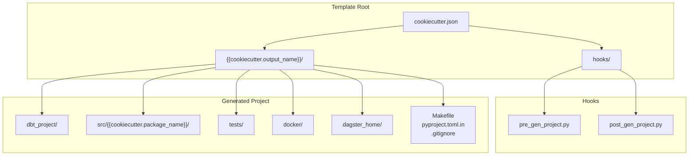
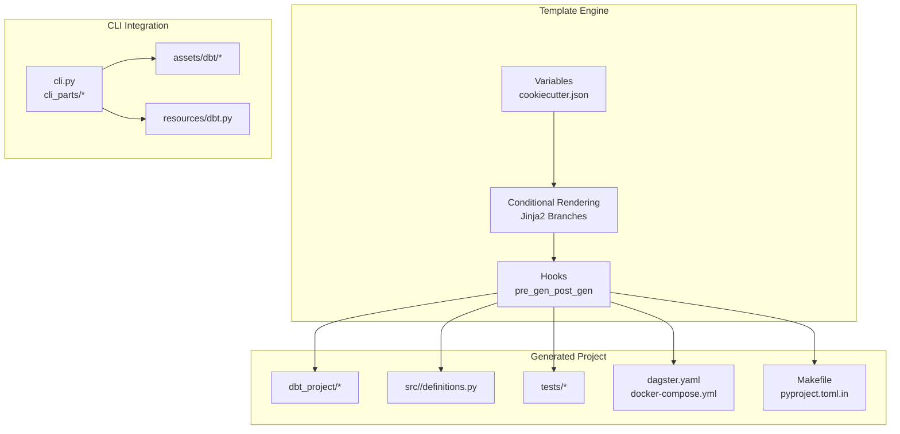
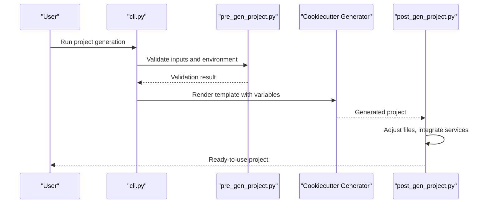
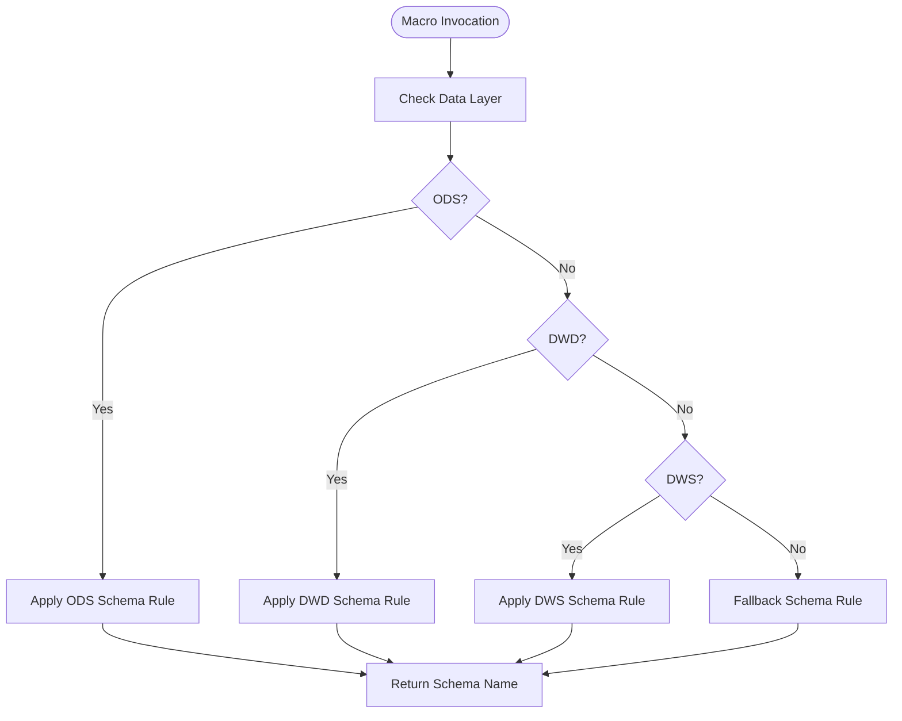
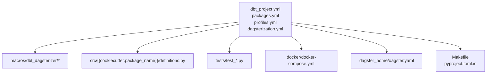
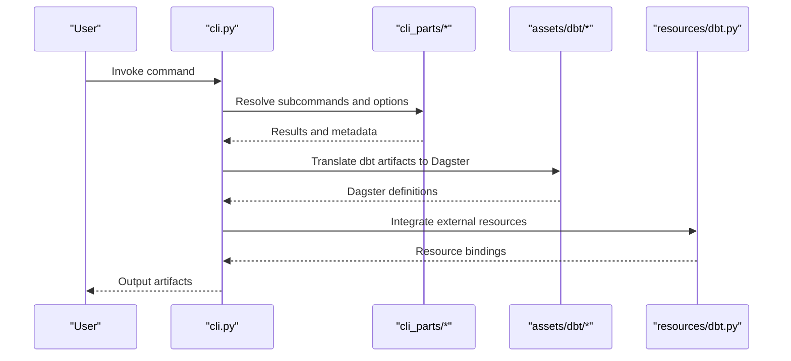
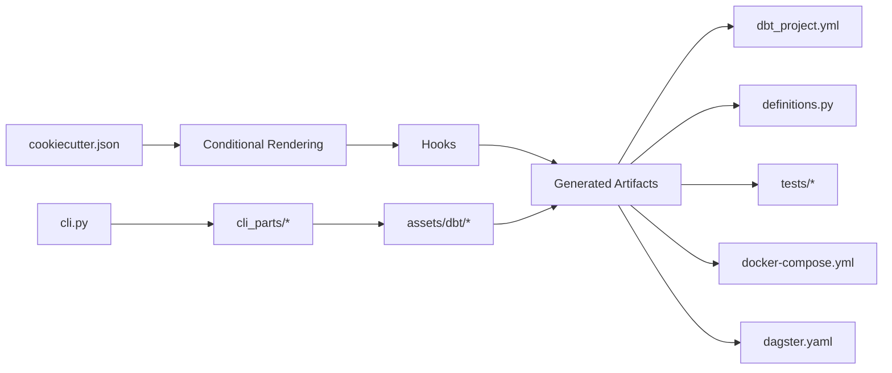

# Template Customization

<cite>
**Referenced Files in This Document**
- [README.md](file://README.md)
- [cookiecutter.json](file://src/dbt_dagsterizer/project_templates/luban-dagster-dbt-starrocks-code-location-source-template/cookiecutter.json)
- [post_gen_project.py](file://src/dbt_dagsterizer/project_templates/luban-dagster-dbt-starrocks-code-location-source-template/hooks/post_gen_project.py)
- [pre_gen_project.py](file://src/dbt_dagsterizer/project_templates/luban-dagster-dbt-starrocks-code-location-source-template/hooks/pre_gen_project.py)
- [dagsterization.yml](file://src/dbt_dagsterizer/project_templates/luban-dagster-dbt-starrocks-code-location-source-template/{{cookiecutter.output_name}}/dbt_project/dagsterization.yml)
- [dbt_project.yml](file://src/dbt_dagsterizer/project_templates/luban-dagster-dbt-starrocks-code-location-source-template/{{cookiecutter.output_name}}/dbt_project/dbt_project.yml)
- [packages.yml](file://src/dbt_dagsterizer/project_templates/luban-dagster-dbt-starrocks-code-location-source-template/{{cookiecutter.output_name}}/dbt_project/packages.yml)
- [profiles.yml](file://src/dbt_dagsterizer/project_templates/luban-dagster-dbt-starrocks-code-location-source-template/{{cookiecutter.output_name}}/dbt_project/profiles.yml)
- [generate_schema_name.sql](file://src/dbt_dagsterizer/project_templates/luban-dagster-dbt-starrocks-code-location-source-template/{{cookiecutter.output_name}}/dbt_project/macros/dbt_dagsterizer/generate_schema_name.sql)
- [partition_vars.sql](file://src/dbt_dagsterizer/project_templates/luban-dagster-dbt-starrocks-code-location-source-template/{{cookiecutter.output_name}}/dbt_project/macros/dbt_dagsterizer/partition_vars.sql)
- [starrocks_layer_schema.sql](file://src/dbt_dagsterizer/project_templates/luban-dagster-dbt-starrocks-code-location-source-template/{{cookiecutter.output_name}}/dbt_project/macros/dbt_dagsterizer/starrocks_layer_schema.sql)
- [starrocks_overrides.sql](file://src/dbt_dagsterizer/project_templates/luban-dagster-dbt-starrocks-code-location-source-template/{{cookiecutter.output_name}}/dbt_project/macros/dbt_dagsterizer/starrocks_overrides.sql)
- [definitions.py](file://src/dbt_dagsterizer/project_templates/luban-dagster-dbt-starrocks-code-location-source-template/{{cookiecutter.output_name}}/src/{{cookiecutter.package_name}}/definitions.py)
- [test_definitions.py](file://src/dbt_dagsterizer/project_templates/luban-dagster-dbt-starrocks-code-location-source-template/{{cookiecutter.output_name}}/tests/test_definitions.py)
- [test_partition_vars.py](file://src/dbt_dagsterizer/project_templates/luban-dagster-dbgstertizer/project_templates/luban-dagster-dbt-starrocks-code-location-source-template/{{cookiecutter.output_name}}/tests/test_partition_vars.py)
- [test_schedule_specs.py](file://src/dbt_dagsterizer/project_templates/luban-dagster-dbt-starrocks-code-location-source-template/{{cookiecutter.output_name}}/tests/test_schedule_specs.py)
- [Makefile](file://src/dbt_dagsterizer/project_templates/luban-dagster-dbt-starrocks-code-location-source-template/{{cookiecutter.output_name}}/Makefile)
- [pyproject.toml.in](file://src/dbt_dagsterizer/project_templates/luban-dagster-dbt-starrocks-code-location-source-template/{{cookiecutter.output_name}}/pyproject.toml.in)
- [dagster.yaml](file://src/dbt_dagsterizer/project_templates/luban-dagster-dbt-starrocks-code-location-source-template/{{cookiecutter.output_name}}/dagster_home/dagster.yaml)
- [docker-compose.yml](file://src/dbt_dagsterizer/project_templates/luban-dagster-dbt-starrocks-code-location-source-template/{{cookiecutter.output_name}}/docker/docker-compose.yml)
- [cli.py](file://src/dbt_dagsterizer/cli.py)
- [app.py](file://src/dbt_dagsterizer/cli_parts/app.py)
- [common.py](file://src/dbt_dagsterizer/cli_parts/common.py)
- [macros.py](file://src/dbt_dagsterizer/cli_parts/macros.py)
- [meta.py](file://src/dbt_dagsterizer/cli_parts/meta.py)
- [project.py](file://src/dbt_dagsterizer/cli_parts/project.py)
- [validation.py](file://src/dbt_dagsterizer/cli_parts/validation.py)
- [assets.py](file://src/dbt_dagsterizer/assets/dbt/assets.py)
- [prepare.py](file://src/dbt_dagsterizer/assets/dbt/prepare.py)
- [translator.py](file://src/dbt_dagsterizer/assets/dbt/translator.py)
- [vars.py](file://src/dbt_dagsterizer/assets/dbt/vars.py)
- [dbt.py](file://src/dbt_dagsterizer/resources/dbt.py)
</cite>

## Table of Contents
1. [Introduction](#introduction)
2. [Project Structure](#project-structure)
3. [Core Components](#core-components)
4. [Architecture Overview](#architecture-overview)
5. [Detailed Component Analysis](#detailed-component-analysis)
6. [Dependency Analysis](#dependency-analysis)
7. [Performance Considerations](#performance-considerations)
8. [Troubleshooting Guide](#troubleshooting-guide)
9. [Conclusion](#conclusion)
10. [Appendices](#appendices)

## Introduction
This document explains how to customize and extend templates in dbt-dagsterizer, focusing on advanced techniques such as conditional file generation, dynamic content insertion, and custom variable processing. It also covers hook customization patterns for pre- and post-generation tasks, validation logic, file manipulation, and external service integration. Guidance is provided for maintaining template versions, ensuring backward compatibility, and implementing migration strategies. Practical examples demonstrate creating custom templates, extending existing ones, and integrating with external tools. Finally, we outline testing, validation, and distribution approaches grounded in the repository’s template structure.

## Project Structure
The template system centers around a Cookiecutter-based generator under project_templates. The primary template is a StarRocks-focused code location template that generates a complete dbt-dagster project scaffold. The template defines variables, conditional rendering, and hooks for lifecycle events. Supporting CLI parts and asset translation modules integrate with the generated project.

**Diagram sources**
- [cookiecutter.json](file://src/dbt_dagsterizer/project_templates/luban-dagster-dbt-starrocks-code-location-source-template/cookiecutter.json)
- [post_gen_project.py](file://src/dbt_dagsterizer/project_templates/luban-dagster-dbt-starrocks-code-location-source-template/hooks/post_gen_project.py)
- [pre_gen_project.py](file://src/dbt_dagsterizer/project_templates/luban-dagster-dbt-starrocks-code-location-source-template/hooks/pre_gen_project.py)

**Section sources**
- [cookiecutter.json](file://src/dbt_dagsterizer/project_templates/luban-dagster-dbt-starrocks-code-location-source-template/cookiecutter.json)
- [README.md](file://README.md)

## Core Components
- Template Variables and Conditional Rendering: The template exposes variables via cookiecutter.json and uses Jinja2 conditionals to control file inclusion and content branching during generation.
- Hooks: Pre- and post-generation scripts manipulate the generated project, validate inputs, and integrate with external systems.
- Generated Artifacts: The template produces a dbt project, Dagster definitions, Docker compose, and supporting configuration and tests.
- CLI Integration: The CLI orchestrates project generation and supports related commands for metadata, validation, and project preparation.

Key responsibilities:
- cookiecutter.json: Defines variables and defaults; enables conditional branches for optional files and content.
- hooks/pre_gen_project.py: Validates inputs and prepares environment before generation.
- hooks/post_gen_project.py: Performs post-generation tasks such as file adjustments, permissions, and external integrations.
- Generated dbt_project: Includes dbt_project.yml, packages.yml, profiles.yml, dagsterization.yml, macros, and example models/tests.
- Generated src and tests: Provide Dagster definitions and unit tests.
- CLI parts: Support project generation, validation, and metadata operations.

**Section sources**
- [cookiecutter.json](file://src/dbt_dagsterizer/project_templates/luban-dagster-dbt-starrocks-code-location-source-template/cookiecutter.json)
- [pre_gen_project.py](file://src/dbt_dagsterizer/project_templates/luban-dagster-dbt-starrocks-code-location-source-template/hooks/pre_gen_project.py)
- [post_gen_project.py](file://src/dbt_dagsterizer/project_templates/luban-dagster-dbt-starrocks-code-location-source-template/hooks/post_gen_project.py)
- [dbt_project.yml](file://src/dbt_dagsterizer/project_templates/luban-dagster-dbt-starrocks-code-location-source-template/{{cookiecutter.output_name}}/dbt_project/dbt_project.yml)
- [packages.yml](file://src/dbt_dagsterizer/project_templates/luban-dagster-dbt-starrocks-code-location-source-template/{{cookiecutter.output_name}}/dbt_project/packages.yml)
- [profiles.yml](file://src/dbt_dagsterizer/project_templates/luban-dagster-dbt-starrocks-code-location-source-template/{{cookiecutter.output_name}}/dbt_project/profiles.yml)
- [dagsterization.yml](file://src/dbt_dagsterizer/project_templates/luban-dagster-dbt-starrocks-code-location-source-template/{{cookiecutter.output_name}}/dbt_project/dagsterization.yml)
- [definitions.py](file://src/dbt_dagsterizer/project_templates/luban-dagster-dbt-starrocks-code-location-source-template/{{cookiecutter.output_name}}/src/{{cookiecutter.package_name}}/definitions.py)
- [test_definitions.py](file://src/dbt_dagsterizer/project_templates/luban-dagster-dbt-starrocks-code-location-source-template/{{cookiecutter.output_name}}/tests/test_definitions.py)
- [test_partition_vars.py](file://src/dbt_dagsterizer/project_templates/luban-dagster-dbt-starrocks-code-location-source-template/{{cookiecutter.output_name}}/tests/test_partition_vars.py)
- [test_schedule_specs.py](file://src/dbt_dagsterizer/project_templates/luban-dagster-dbt-starrocks-code-location-source-template/{{cookiecutter.output_name}}/tests/test_schedule_specs.py)
- [Makefile](file://src/dbt_dagsterizer/project_templates/luban-dagster-dbt-starrocks-code-location-source-template/{{cookiecutter.output_name}}/Makefile)
- [pyproject.toml.in](file://src/dbt_dagsterizer/project_templates/luban-dagster-dbt-starrocks-code-location-source-template/{{cookiecutter.output_name}}/pyproject.toml.in)
- [dagster.yaml](file://src/dbt_dagsterizer/project_templates/luban-dagster-dbt-starrocks-code-location-source-template/{{cookiecutter.output_name}}/dagster_home/dagster.yaml)
- [docker-compose.yml](file://src/dbt_dagsterizer/project_templates/luban-dagster-dbt-starrocks-code-location-source-template/{{cookiecutter.output_name}}/docker/docker-compose.yml)

## Architecture Overview
The template customization pipeline integrates Cookiecutter variables, conditional rendering, and lifecycle hooks with the generated project’s runtime components.

**Diagram sources**
- [cookiecutter.json](file://src/dbt_dagsterizer/project_templates/luban-dagster-dbt-starrocks-code-location-source-template/cookiecutter.json)
- [pre_gen_project.py](file://src/dbt_dagsterizer/project_templates/luban-dagster-dbt-starrocks-code-location-source-template/hooks/pre_gen_project.py)
- [post_gen_project.py](file://src/dbt_dagsterizer/project_templates/luban-dagster-dbt-starrocks-code-location-source-template/hooks/post_gen_project.py)
- [cli.py](file://src/dbt_dagsterizer/cli.py)
- [app.py](file://src/dbt_dagsterizer/cli_parts/app.py)
- [common.py](file://src/dbt_dagsterizer/cli_parts/common.py)
- [macros.py](file://src/dbt_dagsterizer/cli_parts/macros.py)
- [meta.py](file://src/dbt_dagsterizer/cli_parts/meta.py)
- [project.py](file://src/dbt_dagsterizer/cli_parts/project.py)
- [validation.py](file://src/dbt_dagsterizer/cli_parts/validation.py)
- [assets.py](file://src/dbt_dagsterizer/assets/dbt/assets.py)
- [prepare.py](file://src/dbt_dagsterizer/assets/dbt/prepare.py)
- [translator.py](file://src/dbt_dagsterizer/assets/dbt/translator.py)
- [vars.py](file://src/dbt_dagsterizer/assets/dbt/vars.py)
- [dbt.py](file://src/dbt_dagsterizer/resources/dbt.py)

## Detailed Component Analysis

### Template Variables and Conditional Rendering
- Purpose: Define user-configurable inputs and enable conditional inclusion of files and content blocks.
- Implementation pattern: Variables declared in cookiecutter.json drive Jinja2 conditionals in template files. These can toggle optional directories, macro sets, or configuration sections.
- Advanced techniques:
  - Dynamic content insertion: Use variables to populate dbt_project.yml, dagsterization.yml, and profiles.yml.
  - Conditional file generation: Include or exclude sections such as Docker compose, tests, or macros based on flags.
  - Custom variable processing: Normalize inputs (e.g., sanitizing names) and derive derived variables for downstream use.

Best practices:
- Keep variable names explicit and scoped to avoid collisions.
- Provide sensible defaults to streamline generation.
- Use enums or constrained choices where appropriate to reduce errors.

**Section sources**
- [cookiecutter.json](file://src/dbt_dagsterizer/project_templates/luban-dagster-dbt-starrocks-code-location-source-template/cookiecutter.json)
- [dbt_project.yml](file://src/dbt_dagsterizer/project_templates/luban-dagster-dbt-starrocks-code-location-source-template/{{cookiecutter.output_name}}/dbt_project/dbt_project.yml)
- [dagsterization.yml](file://src/dbt_dagsterizer/project_templates/luban-dagster-dbt-starrocks-code-location-source-template/{{cookiecutter.output_name}}/dbt_project/dagsterization.yml)
- [profiles.yml](file://src/dbt_dagsterizer/project_templates/luban-dagster-dbt-starrocks-code-location-source-template/{{cookiecutter.output_name}}/dbt_project/profiles.yml)

### Hook Customization Patterns
- Pre-generation hook (pre_gen_project.py): Validate inputs, enforce constraints, and prepare environment. Typical tasks include checking required variables, ensuring directory availability, and invoking external validators.
- Post-generation hook (post_gen_project.py): Adjust generated files, set permissions, initialize Git, and integrate with external services (e.g., CI/CD, secret stores, registries).
- Validation logic: Combine CLI validation helpers with hook-specific checks to ensure generated artifacts meet expectations.
- File manipulation: Rename, move, or transform generated files; insert or patch content; manage symlinks.
- External service integration: Invoke APIs, write credentials, configure remote registries, or trigger downstream pipelines.

**Diagram sources**
- [cli.py](file://src/dbt_dagsterizer/cli.py)
- [pre_gen_project.py](file://src/dbt_dagsterizer/project_templates/luban-dagster-dbt-starrocks-code-location-source-template/hooks/pre_gen_project.py)
- [post_gen_project.py](file://src/dbt_dagsterizer/project_templates/luban-dagster-dbt-starrocks-code-location-source-template/hooks/post_gen_project.py)

**Section sources**
- [pre_gen_project.py](file://src/dbt_dagsterizer/project_templates/luban-dagster-dbt-starrocks-code-location-source-template/hooks/pre_gen_project.py)
- [post_gen_project.py](file://src/dbt_dagsterizer/project_templates/luban-dagster-dbt-starrocks-code-location-source-template/hooks/post_gen_project.py)
- [validation.py](file://src/dbt_dagsterizer/cli_parts/validation.py)

### Macros and Dynamic Content Insertion
- Schema naming: A macro generates schema names dynamically based on variables and environment.
- Partition variables: Macro-driven partition configuration supports dynamic scheduling and asset keys.
- Layered schema overrides: Macros tailor schema names per data layer (e.g., ODS, DWD, DWS).
- Overrides: Macros encapsulate provider-specific overrides for StarRocks.

**Diagram sources**
- [generate_schema_name.sql](file://src/dbt_dagsterizer/project_templates/luban-dagster-dbt-starrocks-code-location-source-template/{{cookiecutter.output_name}}/dbt_project/macros/dbt_dagsterizer/generate_schema_name.sql)
- [starrocks_layer_schema.sql](file://src/dbt_dagsterizer/project_templates/luban-dagster-dbt-starrocks-code-location-source-template/{{cookiecutter.output_name}}/dbt_project/macros/dbt_dagsterizer/starrocks_layer_schema.sql)
- [starrocks_overrides.sql](file://src/dbt_dagsterizer/project_templates/luban-dagster-dbt-starrocks-code-location-source-template/{{cookiecutter.output_name}}/dbt_project/macros/dbt_dagsterizer/starrocks_overrides.sql)

**Section sources**
- [generate_schema_name.sql](file://src/dbt_dagsterizer/project_templates/luban-dagster-dbt-starrocks-code-location-source-template/{{cookiecutter.output_name}}/dbt_project/macros/dbt_dagsterizer/generate_schema_name.sql)
- [partition_vars.sql](file://src/dbt_dagsterizer/project_templates/luban-dagster-dbt-starrocks-code-location-source-template/{{cookiecutter.output_name}}/dbt_project/macros/dbt_dagsterizer/partition_vars.sql)
- [starrocks_layer_schema.sql](file://src/dbt_dagsterizer/project_templates/luban-dagster-dbt-starrocks-code-location-source-template/{{cookiecutter.output_name}}/dbt_project/macros/dbt_dagsterizer/starrocks_layer_schema.sql)
- [starrocks_overrides.sql](file://src/dbt_dagsterizer/project_templates/luban-dagster-dbt-starrocks-code-location-source-template/{{cookiecutter.output_name}}/dbt_project/macros/dbt_dagsterizer/starrocks_overrides.sql)

### Generated Project Composition
- dbt_project: Core dbt configuration, packages, profiles, and dagsterization metadata.
- src: Dagster definitions module with generated assets and schedules.
- tests: Unit tests for definitions, partition variables, and schedule specs.
- docker: Local orchestration via docker-compose.
- dagster_home: Dagster runtime configuration.
- Makefile and pyproject.toml.in: Build and packaging scaffolding.

**Diagram sources**
- [dbt_project.yml](file://src/dbt_dagsterizer/project_templates/luban-dagster-dbt-starrocks-code-location-source-template/{{cookiecutter.output_name}}/dbt_project/dbt_project.yml)
- [packages.yml](file://src/dbt_dagsterizer/project_templates/luban-dagster-dbt-starrocks-code-location-source-template/{{cookiecutter.output_name}}/dbt_project/packages.yml)
- [profiles.yml](file://src/dbt_dagsterizer/project_templates/luban-dagster-dbt-starrocks-code-location-source-template/{{cookiecutter.output_name}}/dbt_project/profiles.yml)
- [dagsterization.yml](file://src/dbt_dagsterizer/project_templates/luban-dagster-dbt-starrocks-code-location-source-template/{{cookiecutter.output_name}}/dbt_project/dagsterization.yml)
- [definitions.py](file://src/dbt_dagsterizer/project_templates/luban-dagster-dbt-starrocks-code-location-source-template/{{cookiecutter.output_name}}/src/{{cookiecutter.package_name}}/definitions.py)
- [test_definitions.py](file://src/dbt_dagsterizer/project_templates/luban-dagster-dbt-starrocks-code-location-source-template/{{cookiecutter.output_name}}/tests/test_definitions.py)
- [test_partition_vars.py](file://src/dbt_dagsterizer/project_templates/luban-dagster-dbt-starrocks-code-location-source-template/{{cookiecutter.output_name}}/tests/test_partition_vars.py)
- [test_schedule_specs.py](file://src/dbt_dagsterizer/project_templates/luban-dagster-dbt-starrocks-code-location-source-template/{{cookiecutter.output_name}}/tests/test_schedule_specs.py)
- [docker-compose.yml](file://src/dbt_dagsterizer/project_templates/luban-dagster-dbt-starrocks-code-location-source-template/{{cookiecutter.output_name}}/docker/docker-compose.yml)
- [dagster.yaml](file://src/dbt_dagsterizer/project_templates/luban-dagster-dbt-starrocks-code-location-source-template/{{cookiecutter.output_name}}/dagster_home/dagster.yaml)
- [Makefile](file://src/dbt_dagsterizer/project_templates/luban-dagster-dbt-starrocks-code-location-source-template/{{cookiecutter.output_name}}/Makefile)
- [pyproject.toml.in](file://src/dbt_dagsterizer/project_templates/luban-dagster-dbt-starrocks-code-location-source-template/{{cookiecutter.output_name}}/pyproject.toml.in)

**Section sources**
- [dbt_project.yml](file://src/dbt_dagsterizer/project_templates/luban-dagster-dbt-starrocks-code-location-source-template/{{cookiecutter.output_name}}/dbt_project/dbt_project.yml)
- [packages.yml](file://src/dbt_dagsterizer/project_templates/luban-dagster-dbt-starrocks-code-location-source-template/{{cookiecutter.output_name}}/dbt_project/packages.yml)
- [profiles.yml](file://src/dbt_dagsterizer/project_templates/luban-dagster-dbt-starrocks-code-location-source-template/{{cookiecutter.output_name}}/dbt_project/profiles.yml)
- [dagsterization.yml](file://src/dbt_dagsterizer/project_templates/luban-dagster-dbt-starrocks-code-location-source-template/{{cookiecutter.output_name}}/dbt_project/dagsterization.yml)
- [definitions.py](file://src/dbt_dagsterizer/project_templates/luban-dagster-dbt-starrocks-code-location-source-template/{{cookiecutter.output_name}}/src/{{cookiecutter.package_name}}/definitions.py)
- [docker-compose.yml](file://src/dbt_dagsterizer/project_templates/luban-dagster-dbt-starrocks-code-location-source-template/{{cookiecutter.output_name}}/docker/docker-compose.yml)
- [dagster.yaml](file://src/dbt_dagsterizer/project_templates/luban-dagster-dbt-starrocks-code-location-source-template/{{cookiecutter.output_name}}/dagster_home/dagster.yaml)
- [Makefile](file://src/dbt_dagsterizer/project_templates/luban-dagster-dbt-starrocks-code-location-source-template/{{cookiecutter.output_name}}/Makefile)
- [pyproject.toml.in](file://src/dbt_dagsterizer/project_templates/luban-dagster-dbt-starrocks-code-location-source-template/{{cookiecutter.output_name}}/pyproject.toml.in)

### CLI Integration and Asset Translation
- CLI parts: Provide commands for project generation, metadata handling, macros, and validation.
- Asset translation: Converts dbt manifests and run results into Dagster assets and schedules.
- Resources: dbt resource definitions support integration with external systems.

**Diagram sources**
- [cli.py](file://src/dbt_dagsterizer/cli.py)
- [app.py](file://src/dbt_dagsterizer/cli_parts/app.py)
- [common.py](file://src/dbt_dagsterizer/cli_parts/common.py)
- [macros.py](file://src/dbt_dagsterizer/cli_parts/macros.py)
- [meta.py](file://src/dbt_dagsterizer/cli_parts/meta.py)
- [project.py](file://src/dbt_dagsterizer/cli_parts/project.py)
- [validation.py](file://src/dbt_dagsterizer/cli_parts/validation.py)
- [assets.py](file://src/dbt_dagsterizer/assets/dbt/assets.py)
- [prepare.py](file://src/dbt_dagsterizer/assets/dbt/prepare.py)
- [translator.py](file://src/dbt_dagsterizer/assets/dbt/translator.py)
- [vars.py](file://src/dbt_dagsterizer/assets/dbt/vars.py)
- [dbt.py](file://src/dbt_dagsterizer/resources/dbt.py)

**Section sources**
- [cli.py](file://src/dbt_dagsterizer/cli.py)
- [app.py](file://src/dbt_dagsterizer/cli_parts/app.py)
- [common.py](file://src/dbt_dagsterizer/cli_parts/common.py)
- [macros.py](file://src/dbt_dagsterizer/cli_parts/macros.py)
- [meta.py](file://src/dbt_dagsterizer/cli_parts/meta.py)
- [project.py](file://src/dbt_dagsterizer/cli_parts/project.py)
- [validation.py](file://src/dbt_dagsterizer/cli_parts/validation.py)
- [assets.py](file://src/dbt_dagsterizer/assets/dbt/assets.py)
- [prepare.py](file://src/dbt_dagsterizer/assets/dbt/prepare.py)
- [translator.py](file://src/dbt_dagsterizer/assets/dbt/translator.py)
- [vars.py](file://src/dbt_dagsterizer/assets/dbt/vars.py)
- [dbt.py](file://src/dbt_dagsterizer/resources/dbt.py)

## Dependency Analysis
Template customization depends on:
- Variable definitions driving conditional rendering and dynamic content.
- Hooks orchestrating pre- and post-generation steps.
- Generated artifacts relying on dbt configuration, macros, and Dagster definitions.
- CLI parts coordinating generation and asset translation.

**Diagram sources**
- [cookiecutter.json](file://src/dbt_dagsterizer/project_templates/luban-dagster-dbt-starrocks-code-location-source-template/cookiecutter.json)
- [pre_gen_project.py](file://src/dbt_dagsterizer/project_templates/luban-dagster-dbt-starrocks-code-location-source-template/hooks/pre_gen_project.py)
- [post_gen_project.py](file://src/dbt_dagsterizer/project_templates/luban-dagster-dbt-starrocks-code-location-source-template/hooks/post_gen_project.py)
- [dbt_project.yml](file://src/dbt_dagsterizer/project_templates/luban-dagster-dbt-starrocks-code-location-source-template/{{cookiecutter.output_name}}/dbt_project/dbt_project.yml)
- [definitions.py](file://src/dbt_dagsterizer/project_templates/luban-dagster-dbt-starrocks-code-location-source-template/{{cookiecutter.output_name}}/src/{{cookiecutter.package_name}}/definitions.py)
- [test_definitions.py](file://src/dbt_dagsterizer/project_templates/luban-dagster-dbt-starrocks-code-location-source-template/{{cookiecutter.output_name}}/tests/test_definitions.py)
- [docker-compose.yml](file://src/dbt_dagsterizer/project_templates/luban-dagster-dbt-starrocks-code-location-source-template/{{cookiecutter.output_name}}/docker/docker-compose.yml)
- [dagster.yaml](file://src/dbt_dagsterizer/project_templates/luban-dagster-dbt-starrocks-code-location-source-template/{{cookiecutter.output_name}}/dagster_home/dagster.yaml)
- [cli.py](file://src/dbt_dagsterizer/cli.py)
- [assets.py](file://src/dbt_dagsterizer/assets/dbt/assets.py)

**Section sources**
- [cookiecutter.json](file://src/dbt_dagsterizer/project_templates/luban-dagster-dbt-starrocks-code-location-source-template/cookiecutter.json)
- [cli.py](file://src/dbt_dagsterizer/cli.py)
- [assets.py](file://src/dbt_dagsterizer/assets/dbt/assets.py)

## Performance Considerations
- Minimize heavy operations in hooks; defer expensive tasks to post-initialization.
- Cache computed values derived from variables to avoid recomputation.
- Keep conditional branches concise to reduce render-time overhead.
- Use targeted file manipulations in post-gen hooks to limit filesystem churn.

## Troubleshooting Guide
Common issues and resolutions:
- Missing variables: Ensure all required variables are supplied or have defaults; validate early in pre_gen_project.py.
- Permission errors: Set executable bits on scripts and adjust file modes in post_gen_project.py.
- External service failures: Add retries and fallbacks in post_gen_project.py; log failures with context.
- Validation failures: Leverage CLI validation helpers and fail fast with clear messages.
- Template drift: Pin versions and document breaking changes; provide migration steps.

**Section sources**
- [pre_gen_project.py](file://src/dbt_dagsterizer/project_templates/luban-dagster-dbt-starrocks-code-location-source-template/hooks/pre_gen_project.py)
- [post_gen_project.py](file://src/dbt_dagsterizer/project_templates/luban-dagster-dbt-starrocks-code-location-source-template/hooks/post_gen_project.py)
- [validation.py](file://src/dbt_dagsterizer/cli_parts/validation.py)

## Conclusion
Template customization in dbt-dagsterizer leverages Cookiecutter variables, conditional rendering, and lifecycle hooks to produce robust, configurable projects. By structuring variables thoughtfully, validating inputs rigorously, and automating post-generation adjustments, teams can maintain backward compatibility, support migrations, and integrate with external tools. The provided examples and patterns offer a practical foundation for creating and extending templates tailored to diverse environments.

## Appendices
- Best practices for maintaining template versions:
  - Version the template alongside the tool; document breaking changes.
  - Provide upgrade scripts or migration steps for major changes.
  - Use semantic versioning and deprecation notices for removed features.
- Backward compatibility strategies:
  - Preserve default behaviors; introduce new variables with safe defaults.
  - Offer opt-in features behind flags to avoid disrupting existing setups.
- Migration strategies:
  - Provide automated migration helpers in post_gen_project.py.
  - Include a changelog and update documentation for each release.
- Examples:
  - Creating a custom template: Start from the existing template, add new variables, and extend hooks.
  - Extending existing templates: Fork the template, keep shared variables, and override selective files/macros.
  - Integrating external tools: Use post_gen_project.py to call external APIs, inject credentials, or configure CI/CD.
- Testing, validation, and distribution:
  - Test templates locally using Cookiecutter dry-run and smoke tests.
  - Validate generated artifacts against expected schemas and configurations.
  - Distribute templates via package managers or internal registries; document installation steps.