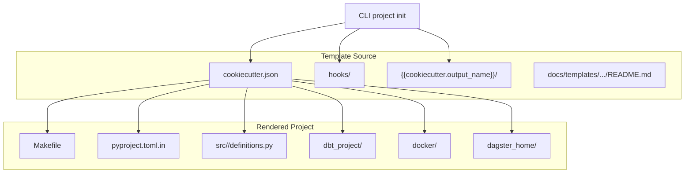
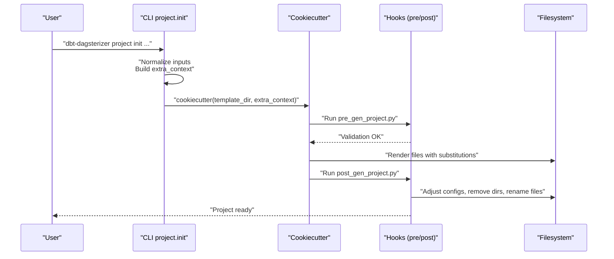
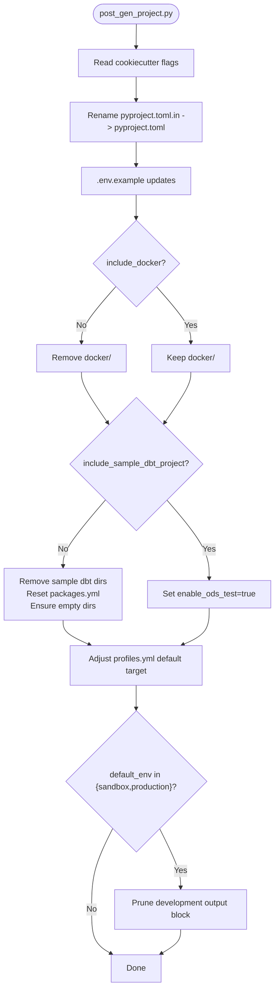
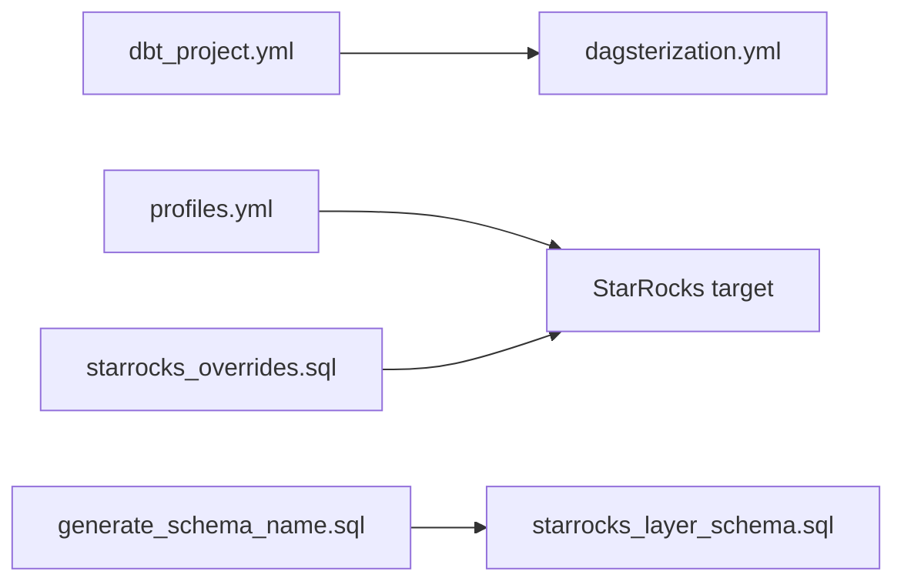
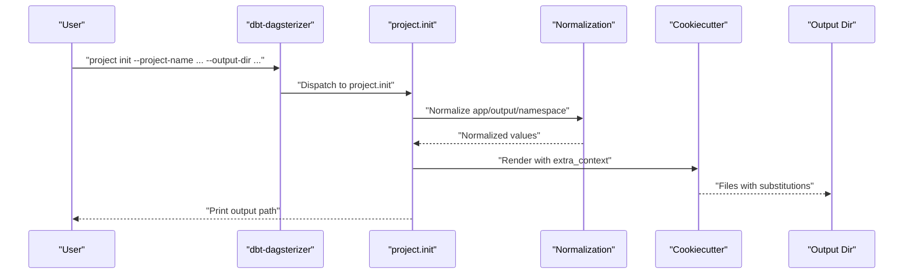
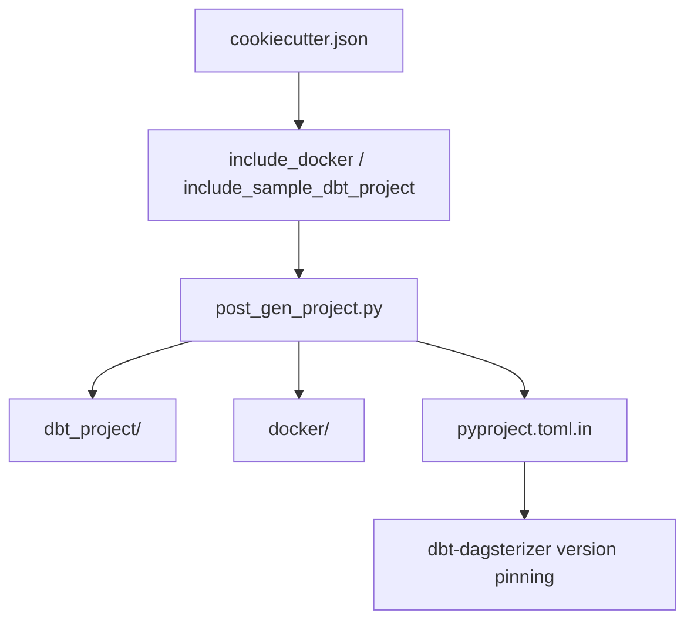

# Template System

<cite>
**Referenced Files in This Document**
- [cookiecutter.json](file://src/dbt_dagsterizer/project_templates/luban-dagster-dbt-starrocks-code-location-source-template/cookiecutter.json)
- [pre_gen_project.py](file://src/dbt_dagsterizer/project_templates/luban-dagster-dbt-starrocks-code-location-source-template/hooks/pre_gen_project.py)
- [post_gen_project.py](file://src/dbt_dagsterizer/project_templates/luban-dagster-dbt-starrocks-code-location-source-template/hooks/post_gen_project.py)
- [dagster.yaml](file://src/dbt_dagsterizer/project_templates/luban-dagster-dbt-starrocks-code-location-source-template/{{cookiecutter.output_name}}/dagster_home/dagster.yaml)
- [dbt_project.yml](file://src/dbt_dagsterizer/project_templates/luban-dagster-dbt-starrocks-code-location-source-template/{{cookiecutter.output_name}}/dbt_project/dbt_project.yml)
- [docker-compose.yml](file://src/dbt_dagsterizer/project_templates/luban-dagster-dbt-starrocks-code-location-source-template/{{cookiecutter.output_name}}/docker/docker-compose.yml)
- [pyproject.toml.in](file://src/dbt_dagsterizer/project_templates/luban-dagster-dbt-starrocks-code-location-source-template/{{cookiecutter.output_name}}/pyproject.toml.in)
- [definitions.py](file://src/dbt_dagsterizer/project_templates/luban-dagster-dbt-starrocks-code-location-source-template/{{cookiecutter.output_name}}/src/{{cookiecutter.package_name}}/definitions.py)
- [generate_schema_name.sql](file://src/dbt_dagsterizer/project_templates/luban-dagster-dbt-starrocks-code-location-source-template/{{cookiecutter.output_name}}/dbt_project/macros/dbt_dagsterizer/generate_schema_name.sql)
- [starrocks_layer_schema.sql](file://src/dbt_dagsterizer/project_templates/luban-dagster-dbt-starrocks-code-location-source-template/{{cookiecutter.output_name}}/dbt_project/macros/dbt_dagsterizer/starrocks_layer_schema.sql)
- [starrocks_overrides.sql](file://src/dbt_dagsterizer/project_templates/luban-dagster-dbt-starrocks-code-location-source-template/{{cookiecutter.output_name}}/dbt_project/macros/dbt_dagsterizer/starrocks_overrides.sql)
- [dagsterization.yml](file://src/dbt_dagsterizer/project_templates/luban-dagster-dbt-starrocks-code-location-source-template/{{cookiecutter.output_name}}/dbt_project/dagsterization.yml)
- [profiles.yml](file://src/dbt_dagsterizer/project_templates/luban-dagster-dbt-starrocks-code-location-source-template/{{cookiecutter.output_name}}/dbt_project/profiles.yml)
- [Makefile](file://src/dbt_dagsterizer/project_templates/luban-dagster-dbt-starrocks-code-location-source-template/{{cookiecutter.output_name}}/Makefile)
- [project.py](file://src/dbt_dagsterizer/cli_parts/project.py)
- [cli.py](file://src/dbt_dagsterizer/cli.py)
- [template_usage.md](file://docs/templates/dagster-dbt-starrocks-code-location/template_usage.md)
- [local_development.md](file://docs/templates/dagster-dbt-starrocks-code-location/local_development.md)
- [developer_workflow.md](file://docs/templates/dagster-dbt-starrocks-code-location/developer_workflow.md)
- [README.md](file://docs/templates/dagster-dbt-starrocks-code-location/README.md)
</cite>

## Table of Contents
1. [Introduction](#introduction)
2. [Project Structure](#project-structure)
3. [Core Components](#core-components)
4. [Architecture Overview](#architecture-overview)
5. [Detailed Component Analysis](#detailed-component-analysis)
6. [Dependency Analysis](#dependency-analysis)
7. [Performance Considerations](#performance-considerations)
8. [Troubleshooting Guide](#troubleshooting-guide)
9. [Conclusion](#conclusion)
10. [Appendices](#appendices)

## Introduction
This document explains the template system used by dbt-dagsterizer to scaffold production-ready projects that orchestrate dbt against StarRocks using Dagster. It covers:
- How Cookiecutter templates are structured and how variables are substituted
- Pre- and post-generation hooks that customize the rendered project
- Configuration templates for dbt, Dagster code locations, and StarRocks integration
- Environment setup patterns, Docker configuration, and optional sample dbt project inclusion
- Conditional generation logic and customization options
- Best practices for maintaining and evolving templates and versions

## Project Structure
The template system is embedded inside the package under a dedicated templates directory. The CLI discovers and renders the template into a user-specified output directory.

**Diagram sources**
- [project.py:106-261](file://src/dbt_dagsterizer/cli_parts/project.py#L106-L261)
- [cookiecutter.json:1-28](file://src/dbt_dagsterizer/project_templates/luban-dagster-dbt-starrocks-code-location-source-template/cookiecutter.json#L1-L28)

**Section sources**
- [project.py:87-104](file://src/dbt_dagsterizer/cli_parts/project.py#L87-L104)
- [README.md:1-54](file://docs/templates/dagster-dbt-starrocks-code-location/README.md#L1-L54)

## Core Components
- Variables and defaults: The template defines a set of variables (namespaces, versions, environment, toggles) and default behaviors for dbt and Dagster.
- Hooks: Pre-generation validates environment selection; post-generation adjusts configuration and removes optional directories.
- Configuration templates: dbt project settings, Dagster code location entrypoint, StarRocks profile, Docker Compose, and Python packaging.
- Conditional generation: Sample dbt project and Docker Compose are included or removed based on flags.

**Section sources**
- [cookiecutter.json:1-28](file://src/dbt_dagsterizer/project_templates/luban-dagster-dbt-starrocks-code-location-source-template/cookiecutter.json#L1-L28)
- [pre_gen_project.py:1-17](file://src/dbt_dagsterizer/project_templates/luban-dagster-dbt-starrocks-code-location-source-template/hooks/pre_gen_project.py#L1-L17)
- [post_gen_project.py:63-132](file://src/dbt_dagsterizer/project_templates/luban-dagster-dbt-starrocks-code-location-source-template/hooks/post_gen_project.py#L63-L132)
- [dbt_project.yml:1-35](file://src/dbt_dagsterizer/project_templates/luban-dagster-dbt-starrocks-code-location-source-template/{{cookiecutter.output_name}}/dbt_project/dbt_project.yml#L1-L35)
- [profiles.yml:1-48](file://src/dbt_dagsterizer/project_templates/luban-dagster-dbt-starrocks-code-location-source-template/{{cookiecutter.output_name}}/dbt_project/profiles.yml#L1-L48)
- [pyproject.toml.in:1-51](file://src/dbt_dagsterizer/project_templates/luban-dagster-dbt-starrocks-code-location-source-template/{{cookiecutter.output_name}}/pyproject.toml.in#L1-L51)
- [Makefile:1-128](file://src/dbt_dagsterizer/project_templates/luban-dagster-dbt-starrocks-code-location-source-template/{{cookiecutter.output_name}}/Makefile#L1-L128)

## Architecture Overview
The template system integrates CLI-driven rendering with Cookiecutter and post-render customization hooks.

**Diagram sources**
- [project.py:168-258](file://src/dbt_dagsterizer/cli_parts/project.py#L168-L258)
- [pre_gen_project.py:1-17](file://src/dbt_dagsterizer/project_templates/luban-dagster-dbt-starrocks-code-location-source-template/hooks/pre_gen_project.py#L1-L17)
- [post_gen_project.py:63-132](file://src/dbt_dagsterizer/project_templates/luban-dagster-dbt-starrocks-code-location-source-template/hooks/post_gen_project.py#L63-L132)

## Detailed Component Analysis

### Variable Substitution and Template Structure
- Variables originate from cookiecutter.json and are passed via CLI into Cookiecutter’s extra_context.
- The template uses Jinja2 templating to render filenames and content, including conditional blocks and environment variable injection.
- Copy-without-render lists exclude certain SQL/YAML seeds from Jinja processing to preserve literal content.

Key variables and defaults:
- Names and identifiers: namespace, project_name, output_name, app_name, package_name
- Versions: dagster_version, dbt_dagsterizer_version
- Environment: default_env, code_location_port
- Feature toggles: include_sample_dbt_project, include_docker
- Authoring: author_name, author_email
- Private index: python_index_url, python_index_name

**Section sources**
- [cookiecutter.json:1-28](file://src/dbt_dagsterizer/project_templates/luban-dagster-dbt-starrocks-code-location-source-template/cookiecutter.json#L1-L28)
- [project.py:233-249](file://src/dbt_dagsterizer/cli_parts/project.py#L233-L249)

### Pre-Generation Hook: Validation
- Validates that default_env is provided and one of supported values.
- Prevents generation with invalid or missing environment selection.

**Section sources**
- [pre_gen_project.py:1-17](file://src/dbt_dagsterizer/project_templates/luban-dagster-dbt-starrocks-code-location-source-template/hooks/pre_gen_project.py#L1-L17)

### Post-Generation Hook: Customization and Cleanup
Post-generation performs several targeted adjustments:
- Renames pyproject.toml.in to pyproject.toml if needed
- Updates .env.example with DAGSTER_HOME and LUBAN_REPO_ROOT
- Removes Docker directory if include_docker is false
- Removes sample dbt directories and resets packages.yml if include_sample_dbt_project is false
- Enables sample dbt var when included
- Adjusts dbt profiles.yml default target and prunes outputs for production-like environments

**Diagram sources**
- [post_gen_project.py:63-132](file://src/dbt_dagsterizer/project_templates/luban-dagster-dbt-starrocks-code-location-source-template/hooks/post_gen_project.py#L63-L132)

**Section sources**
- [post_gen_project.py:63-132](file://src/dbt_dagsterizer/project_templates/luban-dagster-dbt-starrocks-code-location-source-template/hooks/post_gen_project.py#L63-L132)

### dbt Project Configuration and StarRocks Integration
- dbt project settings define model paths, vars, and default materialization behavior.
- StarRocks-specific macros override schema naming and provide relation helpers.
- Profiles define StarRocks connections per environment with environment variable injection.

**Diagram sources**
- [dbt_project.yml:1-35](file://src/dbt_dagsterizer/project_templates/luban-dagster-dbt-starrocks-code-location-source-template/{{cookiecutter.output_name}}/dbt_project/dbt_project.yml#L1-L35)
- [dagsterization.yml:1-48](file://src/dbt_dagsterizer/project_templates/luban-dagster-dbt-starrocks-code-location-source-template/{{cookiecutter.output_name}}/dbt_project/dagsterization.yml#L1-L48)
- [profiles.yml:1-48](file://src/dbt_dagsterizer/project_templates/luban-dagster-dbt-starrocks-code-location-source-template/{{cookiecutter.output_name}}/dbt_project/profiles.yml#L1-L48)
- [generate_schema_name.sql:16-22](file://src/dbt_dagsterizer/project_templates/luban-dagster-dbt-starrocks-code-location-source-template/{{cookiecutter.output_name}}/dbt_project/macros/dbt_dagsterizer/generate_schema_name.sql#L16-L22)
- [starrocks_layer_schema.sql:1-15](file://src/dbt_dagsterizer/project_templates/luban-dagster-dbt-starrocks-code-location-source-template/{{cookiecutter.output_name}}/dbt_project/macros/dbt_dagsterizer/starrocks_layer_schema.sql#L1-L15)
- [starrocks_overrides.sql:1-17](file://src/dbt_dagsterizer/project_templates/luban-dagster-dbt-starrocks-code-location-source-template/{{cookiecutter.output_name}}/dbt_project/macros/dbt_dagsterizer/starrocks_overrides.sql#L1-L17)

**Section sources**
- [dbt_project.yml:1-35](file://src/dbt_dagsterizer/project_templates/luban-dagster-dbt-starrocks-code-location-source-template/{{cookiecutter.output_name}}/dbt_project/dbt_project.yml#L1-L35)
- [profiles.yml:1-48](file://src/dbt_dagsterizer/project_templates/luban-dagster-dbt-starrocks-code-location-source-template/{{cookiecutter.output_name}}/dbt_project/profiles.yml#L1-L48)
- [generate_schema_name.sql:16-22](file://src/dbt_dagsterizer/project_templates/luban-dagster-dbt-starrocks-code-location-source-template/{{cookiecutter.output_name}}/dbt_project/macros/dbt_dagsterizer/generate_schema_name.sql#L16-L22)
- [starrocks_layer_schema.sql:1-15](file://src/dbt_dagsterizer/project_templates/luban-dagster-dbt-starrocks-code-location-source-template/{{cookiecutter.output_name}}/dbt_project/macros/dbt_dagsterizer/starrocks_layer_schema.sql#L1-L15)
- [starrocks_overrides.sql:1-17](file://src/dbt_dagsterizer/project_templates/luban-dagster-dbt-starrocks-code-location-source-template/{{cookiecutter.output_name}}/dbt_project/macros/dbt_dagsterizer/starrocks_overrides.sql#L1-L17)

### Dagster Code Location Entrypoint
- The definitions module sets environment variables for repository root and dbt project/profiles directories.
- It initializes OpenTelemetry and builds Dagster definitions by pointing to the dbt project and default target.

**Section sources**
- [definitions.py:1-23](file://src/dbt_dagsterizer/project_templates/luban-dagster-dbt-starrocks-code-location-source-template/{{cookiecutter.output_name}}/src/{{cookiecutter.package_name}}/definitions.py#L1-L23)

### Dagster Configuration
- Dagster YAML configures run coordinator concurrency and telemetry settings.

**Section sources**
- [dagster.yaml:1-10](file://src/dbt_dagsterizer/project_templates/luban-dagster-dbt-starrocks-code-location-source-template/{{cookiecutter.output_name}}/dagster_home/dagster.yaml#L1-L10)

### Docker Configuration
- docker-compose.yml provisions StarRocks FE/BE and an initialization step to register BE with FE.
- Ports and health checks are defined; network bridging is used.

**Section sources**
- [docker-compose.yml:1-95](file://src/dbt_dagsterizer/project_templates/luban-dagster-dbt-starrocks-code-location-source-template/{{cookiecutter.output_name}}/docker/docker-compose.yml#L1-L95)

### Python Packaging and Dependencies
- pyproject.toml.in defines project metadata, dependencies (Dagster, dbt-dagsterizer, dbt-starrocks, OpenTelemetry), dev dependencies, and optional private index configuration.
- The template conditionally pins dbt-dagsterizer based on CLI-provided version or defaults.

**Section sources**
- [pyproject.toml.in:1-51](file://src/dbt_dagsterizer/project_templates/luban-dagster-dbt-starrocks-code-location-source-template/{{cookiecutter.output_name}}/pyproject.toml.in#L1-L51)
- [project.py:209-222](file://src/dbt_dagsterizer/cli_parts/project.py#L209-L222)

### Environment Setup Patterns and Makefile Targets
- Makefile centralizes local development tasks: setup, install, macros synchronization, dev server, tests, DB connectivity checks, optional Docker lifecycle, ODS bootstrap/append, and dbt lifecycle commands.
- DBT_VARS is required for dbt execution to supply partition window variables.

**Section sources**
- [Makefile:1-128](file://src/dbt_dagsterizer/project_templates/luban-dagster-dbt-starrocks-code-location-source-template/{{cookiecutter.output_name}}/Makefile#L1-L128)

### CLI Integration and Project Generation Workflow
- The CLI exposes a project group with list-templates, init, and gen-gitops-env commands.
- project init renders the template with normalized names, optional version pinning, and environment flags.
- The CLI validates exclusivity of version pinning options and raises clear errors for invalid combinations.

**Diagram sources**
- [cli.py:1-7](file://src/dbt_dagsterizer/cli.py#L1-L7)
- [project.py:106-261](file://src/dbt_dagsterizer/cli_parts/project.py#L106-L261)

**Section sources**
- [cli.py:1-7](file://src/dbt_dagsterizer/cli.py#L1-L7)
- [project.py:106-261](file://src/dbt_dagsterizer/cli_parts/project.py#L106-L261)

## Dependency Analysis
- Template variables drive conditional inclusion of Docker and sample dbt content.
- Post-generation adjusts dbt profiles and cleans up unused directories.
- Python packaging is controlled via pyproject.toml.in with optional private index injection.

**Diagram sources**
- [cookiecutter.json:11-12](file://src/dbt_dagsterizer/project_templates/luban-dagster-dbt-starrocks-code-location-source-template/cookiecutter.json#L11-L12)
- [post_gen_project.py:82-111](file://src/dbt_dagsterizer/project_templates/luban-dagster-dbt-starrocks-code-location-source-template/hooks/post_gen_project.py#L82-L111)
- [pyproject.toml.in:15-20](file://src/dbt_dagsterizer/project_templates/luban-dagster-dbt-starrocks-code-location-source-template/{{cookiecutter.output_name}}/pyproject.toml.in#L15-L20)

**Section sources**
- [cookiecutter.json:11-12](file://src/dbt_dagsterizer/project_templates/luban-dagster-dbt-starrocks-code-location-source-template/cookiecutter.json#L11-L12)
- [post_gen_project.py:82-111](file://src/dbt_dagsterizer/project_templates/luban-dagster-dbt-starrocks-code-location-source-template/hooks/post_gen_project.py#L82-L111)
- [pyproject.toml.in:15-20](file://src/dbt_dagsterizer/project_templates/luban-dagster-dbt-starrocks-code-location-source-template/{{cookiecutter.output_name}}/pyproject.toml.in#L15-L20)

## Performance Considerations
- Keep sample dbt content disabled in production-like environments to minimize disk footprint and parsing overhead.
- Use environment-specific thread counts and timeouts in StarRocks profiles to balance throughput and stability.
- Prefer partitioned runs with narrow windows to reduce compute and storage churn.

## Troubleshooting Guide
Common issues and resolutions:
- Missing or invalid default_env during generation: ensure a supported environment is provided.
- Output directory already exists: use --force or change --output-name.
- dbt manifest missing: run dbt deps and dbt parse or rely on LUBAN_DBT_PREPARE_ON_LOAD.
- Partition variables not supplied: set DBT_VARS with min/max date/datetime for dbt execution.
- Docker not included: regenerate with --include-docker to provision StarRocks stack.

**Section sources**
- [pre_gen_project.py:6-12](file://src/dbt_dagsterizer/project_templates/luban-dagster-dbt-starrocks-code-location-source-template/hooks/pre_gen_project.py#L6-L12)
- [project.py:228-231](file://src/dbt_dagsterizer/cli_parts/project.py#L228-L231)
- [Makefile:50-57](file://src/dbt_dagsterizer/project_templates/luban-dagster-dbt-starrocks-code-location-source-template/{{cookiecutter.output_name}}/Makefile#L50-L57)
- [template_usage.md:16-18](file://docs/templates/dagster-dbt-starrocks-code-location/template_usage.md#L16-L18)

## Conclusion
The dbt-dagsterizer template system provides a robust, configurable foundation for building Dagster code locations that orchestrate dbt against StarRocks. By leveraging Cookiecutter variables, pre/post hooks, and environment-aware configurations, teams can rapidly scaffold consistent projects with optional Docker and sample content. Adhering to the documented workflows and best practices ensures maintainable, version-aligned code locations.

## Appendices

### Template Customization Options and Variable Definitions
- Variables defined in cookiecutter.json and passed via CLI:
  - Names and identifiers: namespace, project_name, output_name, app_name, package_name
  - Versions: dagster_version, dbt_dagsterizer_version
  - Environment: default_env, code_location_port
  - Feature toggles: include_sample_dbt_project, include_docker
  - Authoring: author_name, author_email
  - Private index: python_index_url, python_index_name

- Conditional generation logic:
  - include_docker: controls presence of docker/ directory
  - include_sample_dbt_project: controls inclusion/removal of sample dbt content and packages.yml reset

- Environment variable injection:
  - dbt profiles.yml uses env_var(...) for StarRocks connection parameters
  - dbt_project.yml uses env_var for DBT_TARGET default

**Section sources**
- [cookiecutter.json:1-28](file://src/dbt_dagsterizer/project_templates/luban-dagster-dbt-starrocks-code-location-source-template/cookiecutter.json#L1-L28)
- [post_gen_project.py:82-111](file://src/dbt_dagsterizer/project_templates/luban-dagster-dbt-starrocks-code-location-source-template/hooks/post_gen_project.py#L82-L111)
- [profiles.yml:2-47](file://src/dbt_dagsterizer/project_templates/luban-dagster-dbt-starrocks-code-location-source-template/{{cookiecutter.output_name}}/dbt_project/profiles.yml#L2-L47)
- [dbt_project.yml:7-14](file://src/dbt_dagsterizer/project_templates/luban-dagster-dbt-starrocks-code-location-source-template/{{cookiecutter.output_name}}/dbt_project/dbt_project.yml#L7-L14)

### Best Practices for Template Maintenance and Version Management
- Pin dbt-dagsterizer in generated projects to match the CLI version by default; override only when necessary.
- Use environment-aware profiles and avoid hardcoding credentials; rely on env_var(...) and .env files.
- Keep sample content optional for production-like environments to reduce noise and improve performance.
- Centralize operational tasks in Makefile targets to streamline developer onboarding and CI workflows.

**Section sources**
- [README.md:25-31](file://docs/templates/dagster-dbt-starrocks-code-location/README.md#L25-L31)
- [pyproject.toml.in:15-20](file://src/dbt_dagsterizer/project_templates/luban-dagster-dbt-starrocks-code-location-source-template/{{cookiecutter.output_name}}/pyproject.toml.in#L15-L20)
- [Makefile:21-31](file://src/dbt_dagsterizer/project_templates/luban-dagster-dbt-starrocks-code-location-source-template/{{cookiecutter.output_name}}/Makefile#L21-L31)

### Examples of Template Modification and Custom Template Creation
- Modify dbt project defaults (paths, vars) in dbt_project.yml to align with team conventions.
- Extend StarRocks macros to add layer-specific overrides or schema naming rules.
- Add new Makefile targets for CI-specific tasks (linting, coverage, release).
- Create a custom template by duplicating the existing template directory, adjusting cookiecutter.json and files, and registering it via CLI discovery.

**Section sources**
- [dbt_project.yml:16-35](file://src/dbt_dagsterizer/project_templates/luban-dagster-dbt-starrocks-code-location-source-template/{{cookiecutter.output_name}}/dbt_project/dbt_project.yml#L16-L35)
- [starrocks_layer_schema.sql:1-15](file://src/dbt_dagsterizer/project_templates/luban-dagster-dbt-starrocks-code-location-source-template/{{cookiecutter.output_name}}/dbt_project/macros/dbt_dagsterizer/starrocks_layer_schema.sql#L1-L15)
- [Makefile:17-128](file://src/dbt_dagsterizer/project_templates/luban-dagster-dbt-starrocks-code-location-source-template/{{cookiecutter.output_name}}/Makefile#L17-L128)
- [project.py:87-94](file://src/dbt_dagsterizer/cli_parts/project.py#L87-L94)